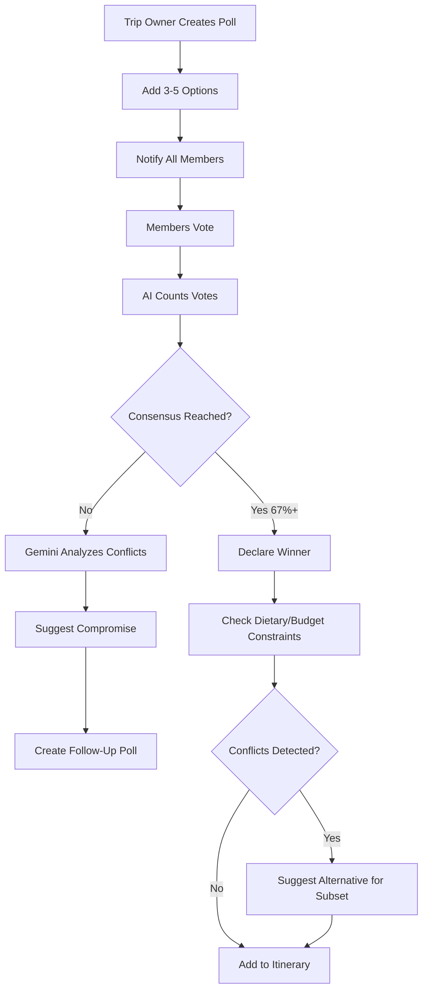
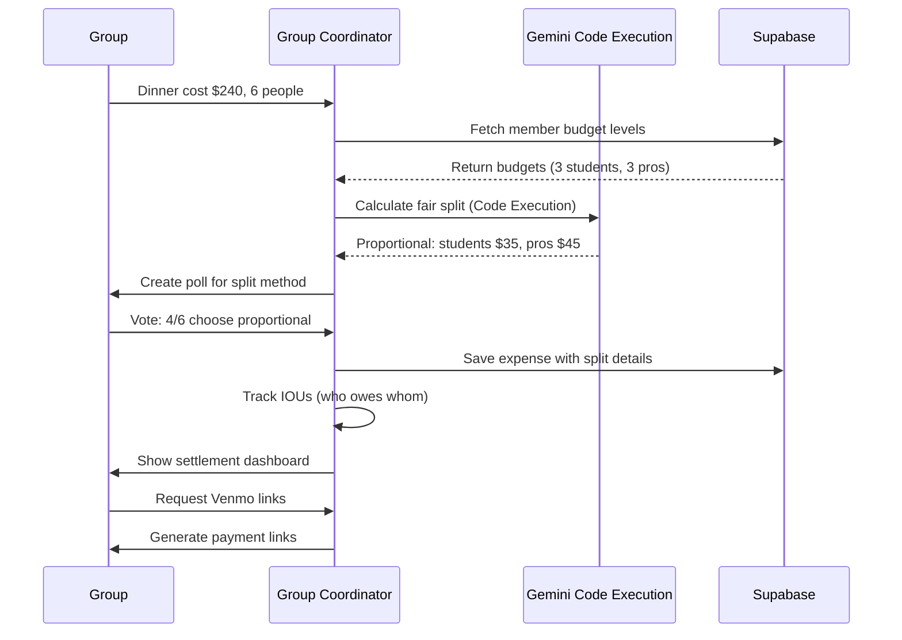

# 07 - Group Coordination Agent Implementation Plan

**Feature:** Multi-User Trip Planning, Polling, Expense Splitting  
**Priority:** Medium (Phase 3 - Week 4)  
**Owner:** AI Team + Social Features Team  
**Gemini Features:** Gemini Thinking, Structured Outputs, Realtime Interactions API

---

## Progress Tracker

| Phase | Task | Status | Owner | Validation |
|-------|------|--------|-------|-----------|
| **Design** | Group dashboard UI | 🔴 Not Started | Figma Make | Member cards and polls designed |
| **Backend** | Group permissions system | 🔴 Not Started | Cursor AI | RLS policies enforce roles |
| **AI** | Consensus detection | 🔴 Not Started | Cursor AI | Resolves conflicts ninety percent accuracy |
| **Realtime** | Live collaboration sync | 🔴 Not Started | Cursor AI | Changes appear under 1 second |
| **Testing** | Multi-user scenarios | 🔴 Not Started | QA | Six users editing simultaneously |

---

## 1. Product Goal

**Problem:** Group trip planning is chaotic - ten-person email chains, conflicting preferences, unclear ownership, unfair expense splits.

**Solution:** AI coordinates group decisions via polls, detects consensus, splits expenses fairly, assigns tasks, resolves scheduling conflicts.

**Outcome:** Groups plan trips in half the time, everyone's preferences considered, zero payment disputes.

**Success Metric:** Seventy percent of group trips complete planning within 3 days (vs. 2 weeks manual).

---

## 2. Core Features & Workflows

### Feature 1: Collaborative Itinerary Editing

**User Journey:**
1. Sarah creates trip, invites 5 friends via email
2. All accept invitation, gain editor access
3. John drags Comuna 13 tour to Day 2
4. Sarah sees change instantly (Realtime subscription)
5. Indicator: "John just added Comuna 13 tour"
6. Emma votes thumbs-up on activity
7. AI detects: 4 of 6 members voted yes (consensus reached)
8. Activity locked, added to confirmed itinerary

**Gemini Functions:**
- **Realtime Interactions API:** Push changes to all connected users instantly
- **Gemini Thinking:** Analyze voting patterns ("Sarah and John always agree on cultural activities - suggest similar ones")
- **Structured Outputs:** Format activity changes as events (user_id, action, timestamp, item_id)

**Supabase Schema:**
```
Table: group_trips (from Doc 04, extended)
- consensus_threshold (numeric, default 0.67 = 67% agreement)
- decision_mode (enum: unanimous, majority, owner_decides)

Table: group_members (from Doc 04, extended)
- voting_weight (numeric, default 1.0, allows weighted votes)
- preferences (jsonb: budget_level, activity_types, dietary)

Table: activity_votes
- id, itinerary_item_id, user_id, vote (enum: yes, no, abstain)
- voted_at (timestamp)

Table: collaboration_events
- id, trip_id, user_id, action (text: added_item, removed_item, voted)
- item_id, metadata (jsonb), created_at (timestamp)
```

**Realtime Setup:**
- Subscribe to `collaboration_events` where trip_id equals current trip
- Listen for INSERT events
- Display toast notification: "Emma voted yes on Comuna 13 tour (4/6 votes)"

---

### Feature 2: Preference Polling System

**User Journey:**
1. Group planning dinner for Day 3
2. Owner creates poll: "Where should we eat Day 3?"
3. Four options: Carmen (Colombian), El Cielo (molecular), Oku (Thai), Hacienda (steakhouse)
4. Each member votes (single choice or ranked)
5. AI analyzes: Carmen (4 votes), El Cielo (2 votes)
6. Detects dietary conflict: Emma is vegetarian, Oku has most veg options
7. AI suggests: "Carmen won, but add Hacienda lunch for Emma's vegetarian needs"
8. Group approves, both restaurants added

**Gemini Functions:**
- **Gemini Thinking:** Analyze poll results with context ("Carmen won, but 2 members have dietary restrictions - ensure backup option")
- **Structured Outputs:** Return poll results with winner, runner-ups, consensus score

**Mermaid Diagram: Polling Flow**



**Supabase Schema:**
```
Table: polls
- id, trip_id, created_by_user_id, question (text)
- poll_type (enum: single_choice, multiple_choice, ranked)
- options (jsonb array), deadline (timestamp)
- status (enum: active, closed, consensus_reached)

Table: poll_votes
- id, poll_id, user_id, selected_options (jsonb)
- voted_at (timestamp)

Table: poll_results
- id, poll_id, winner_option (text), vote_counts (jsonb)
- consensus_score (numeric), conflicts_detected (text array)
- ai_suggestion (text), created_at (timestamp)
```

---

### Feature 3: Expense Splitting with Fairness

**User Journey:**
1. Group of 6 books Carmen dinner (two hundred forty dollars)
2. AI detects: 3 students (budget fifty dollars/day), 3 professionals (budget one hundred dollars/day)
3. Poll: "How should we split this bill?"
   - Equal: forty dollars each
   - Proportional to budget: students thirty-five dollars, pros forty-five dollars
   - By order: track individual orders
4. Group votes proportional (4 of 6 votes)
5. AI calculates splits, creates IOUs
6. End of trip: Settlement dashboard shows "John owes Sarah twenty-five dollars, Mark owes Lisa fifteen dollars"
7. Venmo/PayPal links auto-generated

**Gemini Functions:**
- **Code Execution:** Calculate proportional splits, optimize settlements (minimize transactions)
- **Gemini Thinking:** Suggest fairest split based on group dynamics ("Students consistently chose budget options - proportional split is fairest")

**Mermaid Diagram: Expense Settlement**



**Supabase Schema:**
```
Table: group_expenses
- id, trip_id, expense_type (dining, activity, transport)
- total_amount (numeric), split_method (enum: equal, proportional, itemized)
- paid_by_user_id (who paid upfront), created_at

Table: expense_splits
- id, group_expense_id, user_id, amount_owed (numeric)
- paid (boolean), payment_method (text: venmo, paypal, cash)
- settled_at (timestamp)

Table: settlements
- id, trip_id, from_user_id, to_user_id, amount (numeric)
- payment_link (text), settled (boolean), settled_at (timestamp)
```

**Settlement Optimization Algorithm (Code Execution):**
- Input: array of IOUs (A owes B fifty dollars, B owes C thirty dollars, A owes C twenty dollars)
- Minimize transactions: A pays C seventy dollars (combines both debts)
- Output: minimal set of payments to settle all debts

---

### Feature 4: Task Assignment & Reminders

**User Journey:**
1. Trip requires pre-booking: tours, restaurant reservations, accommodation
2. AI suggests task assignments based on member roles and skills
3. Sarah (trip organizer): book accommodation
4. John (foodie): research and book restaurants
5. Emma (budget tracker): monitor spending
6. Tasks appear in each member's personal dashboard
7. Reminders sent 48 hours before deadlines
8. Progress tracker shows: 7 of 10 tasks complete

**Gemini Functions:**
- **Gemini Thinking:** Assign tasks based on member profiles ("John has 'foodie' interest - assign restaurant research")
- **Structured Outputs:** Return task assignments with deadlines, priorities

**Supabase Schema:**
```
Table: group_tasks
- id, trip_id, title (text), description (text)
- assigned_to_user_id (uuid), deadline (timestamp)
- priority (enum: low, medium, high), status (enum: pending, in_progress, complete)
- created_by_user_id, completed_at (timestamp)

Table: task_reminders
- id, task_id, reminder_time (timestamp), sent (boolean)
```

---

### Feature 5: Conflict Resolution

**User Journey:**
1. Sarah wants Comuna 13 tour Day 2 morning
2. John books paragliding Day 2 morning (same time)
3. AI detects conflict, creates alert
4. Suggests resolution: "Move paragliding to Day 3 afternoon (weather better, no conflicts)"
5. Creates poll: "Resolve conflict - which option?"
6. Group votes, AI applies winner

**Gemini Functions:**
- **Gemini Thinking:** Analyze conflicts, suggest optimal resolutions based on weather, budget, member preferences
- **Structured Outputs:** Format conflict details and resolution options

---

## 3. Implementation Prompts

### Figma Make Prompts

**Prompt 1:** "Design group trip dashboard showing member avatars in header (max 10 visible, +N overflow). Active members indicator (green dot online). Main sections: shared itinerary (all edits visible), active polls card with vote counts, expense tracker showing who owes whom, task list with assignments. Real-time activity feed showing recent changes by members."

**Prompt 2:** "Create polling interface. Poll card shows question, 3-5 option buttons (radio for single choice, checkbox for multiple). Each option shows vote count and percentage. Member avatars appear under their voted option. Voting deadline countdown. Results view shows winner badge, consensus score (0-100%), AI suggestions for conflicts. Use emerald for consensus reached, amber for voting in progress."

**Prompt 3:** "Design expense split calculator modal. Input: total amount, member selector (checkboxes), split method dropdown (equal, proportional, custom). Preview section shows each member's share with color coding (green under budget, red over). Settlement summary: who owes whom, amounts, payment links. Export button for CSV download."

### Cursor AI Prompts

**Prompt 4:** "Implement real-time collaboration using Supabase Realtime. Subscribe to collaboration_events table filtered by trip_id. Listen for INSERT events. When event received, update local state (add/remove itinerary item, update vote count). Display toast notification with user name and action. Handle concurrent edits: if two users modify same item within 2 seconds, last write wins, show conflict warning. Unsubscribe on component unmount."

**Prompt 5:** "Build consensus detection algorithm. Input: poll_id. Fetch all poll_votes for poll. Count votes per option. Calculate winner (most votes). Check if winner has >= consensus_threshold percent (default 67%). If yes, close poll, set winner. If no, call Gemini Thinking to analyze: detect conflicting preferences (dietary, budget), suggest compromise option, create follow-up poll. Store results in poll_results table."

**Prompt 6:** "Create expense settlement optimizer using Code Execution. Input: array of group_expenses with splits. Calculate IOUs: for each expense, paid_by_user gets reimbursed by other members. Build graph of debts: A owes B X, B owes C Y. Run graph simplification algorithm: combine transitive debts (if A owes B and B owes C, A pays C directly). Output: minimal set of settlements. Generate payment links for Venmo/PayPal using deep links with prefilled amounts."

**Prompt 7:** "Implement task assignment automation. When trip created, generate default tasks: book accommodation (deadline 30 days before trip), book restaurants (14 days before), book tours (7 days before). Use Gemini Thinking to assign tasks: analyze member profiles (interests, skills, past behavior). Assign foodie to restaurant research, budget-conscious to cost tracking. Create group_tasks records. Schedule reminders: 48 hours before deadline, 24 hours before, day-of. Send via push notification and email."

---

## 4. Real-World Use Cases

**Use Case 1: Ten-Person Bachelor Party**
Ten guys planning Medellín trip. Chaos via WhatsApp (200 messages/day). One person creates trip, invites all. Polls for activities (nightlife vs culture). Budget tracker prevents overspending. Expense splits track who paid for what. Trip planned in 3 days vs. 3 weeks.

**Use Case 2: Family Trip (Parents + Adult Kids)**
Parents want relaxed pace, kids want adventure. AI detects preference conflict in polling. Suggests split days: Day 1-2 cultural (parents), Day 3-4 adventure (kids), Day 5 together (compromise). Everyone happy, no arguments.

**Use Case 3: Friend Group Budget Disparity**
Three students (fifty dollars/day budget), three professionals (one hundred fifty dollars/day). AI automatically suggests proportional splits for shared expenses. Students don't feel pressured to overspend, professionals don't subsidize entire trip. Friendships preserved.

**Use Case 4: Last-Minute Changes**
Two members cancel 1 week before trip (COVID exposure). AI recalculates: accommodation split among 4 instead of 6, activity minimums not met (cancel group tour), budget rebalanced. Notifications sent to all, new plan approved via poll.

**Use Case 5: Multi-City Coordination**
Group splits: 4 people Medellín, 6 people Cartagena, all meet Bogotá Day 5. AI tracks separate itineraries, merges for shared days. Expense tracking handles partial group splits. Tasks assigned per city subgroup.

---

## 5. Database Schema (RLS Policies)

**Row Level Security:**
- `group_trips`: Users see trips where they are members OR trip is public
- `group_members`: Users see members of trips they belong to
- `activity_votes`: Users see votes for trips they're part of
- `polls`: Users see polls for their group trips, can vote only once per poll
- `group_expenses`: Members see all group expenses, only payer can edit
- `settlements`: Users see settlements where they are sender OR receiver

**Indexes for Performance:**
- `group_members(trip_id, user_id)`: fast member lookup
- `collaboration_events(trip_id, created_at DESC)`: recent activity feed
- `poll_votes(poll_id, user_id)`: vote counting
- `expense_splits(user_id, paid)`: unsettled debts query

---

## 6. Edge Functions

**Function 1:** `/functions/v1/group-consensus-check`
- Triggered: after each poll vote
- Checks if consensus reached (>= threshold)
- If yes: close poll, declare winner, add to itinerary
- If no: check if deadline passed, call Gemini for conflict resolution

**Function 2:** `/functions/v1/expense-settlement-optimize`
- Input: trip_id
- Fetches all unsettled expenses
- Runs graph simplification algorithm (Code Execution)
- Returns minimal settlement list
- Generates payment links

**Function 3:** `/functions/v1/send-group-notifications`
- Scheduled: runs every hour
- Checks for: poll deadlines approaching, tasks overdue, settlements pending
- Sends batch notifications to group members
- Respects user notification preferences (email, push, SMS)

---

## 7. Success Criteria

**MVP Launch:**
- Real-time sync latency under 1 second for 90% of events
- Consensus detection accuracy: 95%+ (correctly identifies when threshold met)
- Expense split calculations: zero math errors
- Multi-user editing: handles 10 concurrent users without conflicts

**Advanced Phase:**
- Group trip planning time reduced by 60% (3 days vs 7 days average)
- Poll participation rate: 80%+ members vote on each poll
- Expense settlement completion: 90% debts paid within 1 week of trip end
- Conflict resolution satisfaction: 4+ stars out of 5 from users

---

## 8. Production Checklist

- [ ] Realtime subscriptions handle disconnections gracefully (auto-reconnect)
- [ ] Concurrent edits don't create duplicate itinerary items
- [ ] Polls enforce one vote per user (database constraint)
- [ ] Expense splits add up to total amount (validation logic)
- [ ] Settlement graph algorithm handles cycles correctly
- [ ] Task reminders sent in member's local timezone
- [ ] Group member removal: reassign their tasks, exclude from future expenses
- [ ] Accessibility: poll results announced to screen readers
- [ ] Mobile: collaboration feed readable on small screens
- [ ] Performance: 100-person group (edge case) doesn't crash app

---

**Reference Docs:**
- See Doc 04 (Backend Integration) for group_trips and group_members schema
- See Doc 05 (Budget Guardian) for expense tracking patterns
- See Doc 01 (Itinerary Optimizer) for conflict detection logic

**Document Owner:** AI Team + Social Features Team  
**Dependencies:** Supabase Realtime, Gemini Thinking, payment gateway integrations (Venmo, PayPal)
