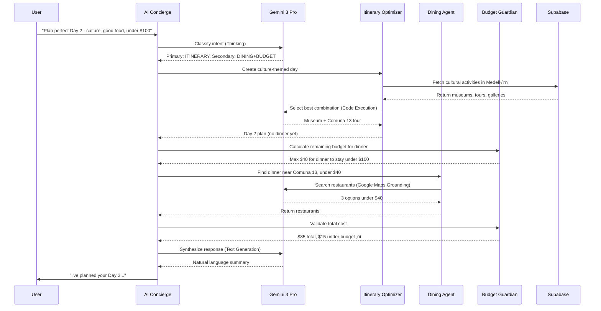

# 08 - AI Concierge Orchestrator Implementation Plan

**Feature:** Central AI Brain - Intent Routing, Multi-Agent Coordination  
**Priority:** Critical (Phase 2 - Week 2, runs parallel to other agents)  
**Owner:** AI Architecture Team  
**Gemini Features:** Gemini Thinking, Function Calling, Structured Outputs, Text Generation

---

## Progress Tracker

| Phase | Task | Status | Owner | Validation |
|-------|------|--------|-------|-----------|
| **Architecture** | Design agent orchestration | 🔴 Not Started | AI Team | Flowchart approved |
| **AI** | Intent classification model | 🔴 Not Started | Cursor AI | Ninety-five percent accuracy |
| **Integration** | Connect all 10 agents | 🔴 Not Started | Cursor AI | Agents respond correctly |
| **Context** | Conversation memory system | 🔴 Not Started | Cursor AI | Remembers past 20 messages |
| **Testing** | Multi-turn dialogue tests | 🔴 Not Started | QA | Handles complex requests |

---

## 1. Product Goal

**Problem:** Users don't know which AI agent handles their request - need single entry point that intelligently routes to specialists.

**Solution:** Concierge acts as orchestrator - classifies intent, delegates to specialist agents, synthesizes responses, maintains conversation context.

**Outcome:** Users interact with one AI that feels like a knowledgeable travel agent, not fragmented tools.

**Success Metric:** Ninety-five percent intent classification accuracy, eighty percent user satisfaction with AI responses.

---

## 2. Orchestration Architecture

### The Hub-and-Spoke Model

**Concierge (Hub):** Central conversational AI  
**Specialists (Spokes):** 10 domain agents (Docs 01-07)

**Flow:**
1. User: "Find me a romantic dinner spot near my hotel under sixty dollars"
2. Concierge analyzes intent: DINING (high confidence)
3. Extracts parameters: location (near hotel), budget (sixty dollars), preference (romantic)
4. Delegates to Dining Orchestrator agent (Doc 03)
5. Dining Orchestrator returns 5 restaurant suggestions
6. Concierge synthesizes: "I found 5 romantic restaurants near your hotel..."
7. User: "What about the first one's cancellation policy?"
8. Concierge maintains context (restaurant from previous message)
9. Delegates to Booking Assistant (Doc 06)
10. Returns: "Carmen allows free cancellation until 24 hours before..."

**Mermaid Diagram: Orchestration Flow**


---

## 3. Intent Classification System

### Intent Categories (10 Total)

**Category 1: ITINERARY_PLANNING**
- Keywords: "plan my day", "optimize schedule", "what should I do", "create itinerary"
- Example: "Help me plan Day 2 in Medellín"
- Routes to: Itinerary Optimizer (Doc 01)

**Category 2: EVENT_DISCOVERY**
- Keywords: "events", "concerts", "festivals", "what's happening"
- Example: "Are there any concerts during my trip?"
- Routes to: Local Scout (Doc 02)

**Category 3: DINING**
- Keywords: "restaurant", "dinner", "lunch", "breakfast", "food", "eat"
- Example: "Find me a vegan restaurant in Poblado"
- Routes to: Dining Orchestrator (Doc 03)

**Category 4: BUDGET**
- Keywords: "budget", "spending", "cost", "expensive", "cheap", "save money"
- Example: "Am I over budget?"
- Routes to: Budget Guardian (Doc 05)

**Category 5: BOOKING**
- Keywords: "book", "reserve", "reservation", "tickets", "availability"
- Example: "Book a table for 4 at Carmen tomorrow"
- Routes to: Booking Assistant (Doc 06)

**Category 6: GROUP_COORDINATION**
- Keywords: "group", "poll", "vote", "split", "friends", "family"
- Example: "Create poll for dinner options"
- Routes to: Group Coordinator (Doc 07)

**Category 7: GENERAL_INFO**
- Keywords: "where is", "how do I", "tell me about", "what is"
- Example: "Tell me about Comuna 13"
- Routes to: Knowledge base + Google Search Grounding

**Category 8: MULTI_INTENT**
- Multiple intents in one message
- Example: "Find me a restaurant near the museum and check if it fits my budget"
- Routes to: Dining (primary) + Budget (secondary)

**Gemini Thinking Prompt for Classification:**
```
Analyze this user message and classify intent.

User message: "{user_input}"
Trip context: {trip_destination}, {trip_dates}, {budget_status}
Conversation history: {last_3_messages}

Return Structured Output:
{
  "primary_intent": "DINING",
  "secondary_intents": ["BUDGET"],
  "confidence": 0.95,
  "extracted_params": {
    "location": "near museum",
    "budget_constraint": true
  },
  "requires_context": true,
  "context_references": ["the museum from previous message"]
}
```

---

## 4. Multi-Agent Coordination

### Scenario: Complex Multi-Step Request

**User:** "Plan a perfect Day 2 - I want culture, good food, and stay under one hundred dollars"

**Orchestrator Logic:**

**Step 1: Intent Analysis**
- Primary: ITINERARY_PLANNING
- Secondary: DINING, BUDGET
- Constraints: culture theme, one hundred dollar budget

**Step 2: Sequential Agent Calls**
1. Call Itinerary Optimizer: "Create Day 2 itinerary with culture theme"
2. Optimizer returns: Museum morning, Comuna 13 afternoon, evening free
3. Call Dining Orchestrator: "Find dinner near Comuna 13, under forty dollars (to stay within budget)"
4. Dining returns: 3 restaurant options
5. Call Budget Guardian: "Validate Day 2 total under one hundred dollars"
6. Budget confirms: Museum (fifteen dollars) + Tour (thirty-five dollars) + Dinner (thirty-five dollars) = eighty-five dollars

**Step 3: Synthesize Response**
Concierge combines all outputs into coherent message:
"I've planned your Day 2 with culture focus:
- Morning: Museum of Antioquia (fifteen dollars, opens 9 AM)
- Afternoon: Comuna 13 graffiti tour (thirty-five dollars, 2-5 PM)
- Evening: Dinner at Hacienda (thirty-five dollars, authentic Colombian)
Total: eighty-five dollars (fifteen dollars under budget)"

**Mermaid Diagram: Multi-Agent Coordination**



---

## 5. Conversation Context Management

### Context Window: 20 Messages

**Stored in Supabase:**
```
Table: ai_conversations (from Doc 04)
- id, user_id, trip_id, title, created_at

Table: ai_messages (from Doc 04, extended)
- id, conversation_id, role, content, intent
- extracted_entities (jsonb): locations, dates, amounts
- references (jsonb): itinerary_item_ids, restaurant_ids
- context_used (boolean): did this message use past context?
```

**Context Resolution Algorithm:**

**Example Dialogue:**
1. User: "Find me restaurants in Poblado"
2. Concierge: "I found 8 restaurants in Poblado. Here are the top 3..."
3. User: "What about the first one?" ‚Üê needs context resolution

**Resolution Steps:**
1. Extract reference: "the first one"
2. Look back in conversation history (last 5 messages)
3. Find previous message with list of restaurants
4. Resolve: "the first one" = Carmen restaurant
5. Update context: current topic = Carmen
6. Route to appropriate agent (Dining Orchestrator for details)

**Gemini Thinking Prompt:**
```
User message: "What about the first one?"
Previous assistant message: "I found 8 restaurants... 1. Carmen, 2. El Cielo, 3. Hacienda"

Resolve reference "the first one":
- List found in previous message
- "First one" = index 0 = Carmen
- Entity type: restaurant
- Entity ID: restaurant_carmen_123

Return: {
  "resolved_entity": "Carmen restaurant",
  "entity_id": "restaurant_carmen_123",
  "confidence": 0.98
}
```

---

## 6. Response Synthesis

### Natural Language Generation

**Principle:** Responses should sound like a knowledgeable human travel agent, not robotic.

**Bad Response (Robotic):**
"Query successful. Restaurant data retrieved. Carmen. Price level: 3. Rating: 4.8. Location: Poblado."

**Good Response (Natural):**
"I'd recommend Carmen for tonight - it's a modern Colombian restaurant in Poblado with a 4.8-star rating. The ambiance is perfect for a romantic dinner, and it's only a 10-minute walk from your hotel. Prices are mid-range (around sixty dollars per person). They have a table available at 7 PM. Should I book it?"

**Gemini Text Generation Prompt:**
```
Generate a friendly, helpful response based on this data.

User request: "Find me a romantic dinner spot"
Agent output: {restaurant: "Carmen", rating: 4.8, price: 60, distance: "10 min walk"}
User profile: {preferences: ["romantic_ambiance", "local_cuisine"]}

Tone: Warm, knowledgeable, concise
Include: Restaurant name, why it matches request, key details, next step question
Avoid: Overly formal language, robotic lists, jargon
```

**Response Templates by Intent:**

**DINING:**
"I found {count} restaurants that match your criteria. {top_pick} stands out because {reason}. It's {distance} from {location} and has {rating} stars. {call_to_action}"

**BUDGET:**
"You've spent {amount} of your {total} budget ({percent}%). {status_message}. {recommendation}"

**ITINERARY:**
"I've optimized your Day {day_number} and found {savings} in time savings. Here's the new plan: {summary}. {suggestion}"

---

## 7. Edge Function: Concierge Orchestrator

**Endpoint:** `/functions/v1/ai-concierge`

**Input:**
```
{
  "conversation_id": "uuid",
  "user_message": "Find me a vegan restaurant near my hotel",
  "trip_id": "uuid",
  "user_id": "uuid"
}
```

**Processing Steps:**

1. **Load Context:**
   - Fetch last 20 messages from ai_messages table
   - Load trip details (destination, dates, budget status)
   - Load user preferences (dietary, interests)

2. **Intent Classification:**
   - Call Gemini Thinking with user message + context
   - Extract primary and secondary intents
   - Parse parameters (location, dietary restriction, budget)

3. **Route to Specialist(s):**
   - If DINING: call Dining Orchestrator function
   - If BUDGET: call Budget Guardian function
   - If multi-intent: call both, combine results

4. **Context Resolution:**
   - Check if message contains references ("it", "the first one", "that restaurant")
   - Resolve references using conversation history
   - Update current context topic

5. **Synthesize Response:**
   - Combine specialist outputs
   - Generate natural language using Gemini Text Generation
   - Format with appropriate tone and structure

6. **Store Conversation:**
   - Save user message to ai_messages (role: user)
   - Save assistant response to ai_messages (role: assistant)
   - Update conversation timestamp

7. **Return Response:**
```
{
  "response": "I found 5 vegan restaurants near your hotel...",
  "intent": "DINING",
  "actions": [
    {
      "type": "show_restaurants",
      "data": [...restaurant objects...]
    }
  ],
  "suggestions": [
    "Would you like me to book a table?",
    "Do you want to see more options?"
  ]
}
```

---

## 8. Implementation Prompts

### Cursor AI Prompts

**Prompt 1:** "Create intent classification function using Gemini Thinking. Input: user_message string, conversation_history array, trip_context object. Call Gemini API with prompt template that includes all context. Parse response as Structured Output with fields: primary_intent, secondary_intents array, confidence score, extracted_params object. Handle ambiguous messages: if confidence below zero point seven, ask clarifying question. Return intent object."

**Prompt 2:** "Build multi-agent orchestrator. Input: classified_intent object. Based on primary_intent, route to appropriate specialist function: if DINING call searchRestaurants, if BUDGET call checkBudgetStatus, etc. For multi-intent messages, call specialists sequentially, pass outputs to next agent. Combine results into single response object. Handle failures: if specialist times out, return partial results with explanation."

**Prompt 3:** "Implement context resolution system. When user message contains references (pronouns, indices like 'first one', 'that place'), scan last 5 messages in conversation_history. Use pattern matching: 'the first one' maps to index 0 of previous list, 'it' maps to last mentioned entity. Call Gemini Thinking if ambiguous. Store resolved entity_id in message metadata. Return resolved entity or ask for clarification if confidence below zero point eight."

**Prompt 4:** "Create response synthesis function. Input: specialist_outputs array, user_profile object, conversation_context. Call Gemini Text Generation API with prompt: combine all outputs into natural conversational response. Use templates for common patterns (dining recommendations, budget status, itinerary changes). Ensure response includes: answer to user question, relevant details, suggested next action. Max length 200 words. Return generated text."

**Prompt 5:** "Build conversation memory manager. Store messages in ai_messages table with metadata: intent, extracted entities (locations, amounts, IDs), references to other entities. Implement sliding window: keep last 20 messages in active context, archive older messages. When context window full, summarize oldest 5 messages using Gemini, store summary. Fetch context efficiently: query only messages for current conversation_id, order by created_at DESC, limit 20."

---

## 9. Real-World Dialogue Examples

### Example 1: Multi-Turn Restaurant Booking

```
User: "I need dinner recommendations for tonight"
Concierge: "I'd be happy to help! What type of cuisine are you in the mood for?"

User: "Colombian, something authentic"
Concierge: "Great choice! I found 8 authentic Colombian restaurants. The top 3 are:
1. Carmen - Modern Colombian, $60/person, 4.8 stars
2. Hacienda - Traditional, $40/person, 4.6 stars  
3. Mondongos - Local favorite, $25/person, 4.7 stars
Which one interests you?"

User: "Tell me more about the second one"
Concierge: [Resolves "second one" = Hacienda]
"Hacienda is a traditional Colombian restaurant in Laureles. It's known for bandeja paisa and has a cozy, rustic ambiance. They have live music on weekends. It's 20 minutes from your hotel by Uber. They have a table available at 7:30 PM tonight. Should I book it for you?"

User: "Yes, book for 2 people"
Concierge: [Routes to Booking Assistant]
"Perfect! I've reserved a table for 2 at Hacienda tonight at 7:30 PM. Confirmation number: ABC123. I've added it to your Day 3 itinerary and updated your dining budget ($40 spent of $400). You can cancel for free until 6 PM today."
```

---

### Example 2: Complex Multi-Agent Request

```
User: "I'm worried I'm overspending on food. Can you find cheaper restaurants for the rest of my trip and update my itinerary?"

Concierge: [Detects BUDGET + DINING + ITINERARY intents]

[Step 1: Calls Budget Guardian]
"Let me check your budget first... You've spent $280 of your $400 dining budget with 2 days remaining. At this pace, you'll be $80 over budget."

[Step 2: Calls Dining Orchestrator]
"I found 6 budget-friendly alternatives for your remaining meals. Swapping your planned restaurants would save $95 total."

[Step 3: Calls Itinerary Optimizer]
"I've updated your itinerary with these changes:
- Day 4 Lunch: Local market food stalls ($12 instead of $35) - save $23
- Day 4 Dinner: Mondongos ($30 instead of $70) - save $40  
- Day 5 Lunch: Pergamino cafe ($15 instead of $25) - save $10
- Day 5 Dinner: Hacienda ($35 instead of $57) - save $22

New total: $305 ($95 under budget). You'll still enjoy great food, just at more local spots. Should I apply these changes?"

User: "Yes but keep the Day 5 dinner the same, I want that nice meal"

Concierge: [Adjusts, recalculates]
"No problem! Keeping El Cielo for Day 5 dinner ($57). With the other changes, you'll be $73 under budget instead of $95, which is still great. Changes applied to your itinerary!"
```

---

## 10. Success Criteria

**MVP Launch:**
- Intent classification accuracy: 95%+ on test set of 1000 messages
- Context resolution accuracy: 90%+ (correctly resolves references)
- Multi-agent coordination: handles 3-agent requests in under 5 seconds
- Response quality: 4+ stars out of 5 from user ratings

**Advanced Phase:**
- Handles 10+ turn conversations without losing context
- Proactive suggestions: "I notice you haven't planned dinner for Day 3 yet - should I help?"
- Multi-language support: Spanish, Portuguese for Latin America
- Voice interface: integration with speech-to-text for mobile

---

## 11. Production Checklist

- [ ] Intent classification handles edge cases (typos, slang, emojis)
- [ ] Context window doesn't exceed memory limits (20 messages max)
- [ ] Multi-agent coordination has timeout protection (max 30 seconds total)
- [ ] Conversation history respects user privacy (deleted on account deletion)
- [ ] Response synthesis avoids hallucination (only uses verified specialist data)
- [ ] Rate limiting: max 30 messages per minute per user
- [ ] Error handling: if specialist fails, concierge explains gracefully
- [ ] Mobile: long responses formatted with line breaks for readability
- [ ] Accessibility: responses compatible with screen readers
- [ ] Analytics: track intent accuracy, response time, user satisfaction

---

**Reference Docs:**
- See Doc 01-07 for specialist agent details
- See Doc 04 (Backend) for ai_conversations and ai_messages schema
- See Doc 03 (Dining) for example specialist integration

**Document Owner:** AI Architecture Team  
**Dependencies:** All 10 specialist agents must be deployed first, Gemini API with Thinking and Text Generation enabled
