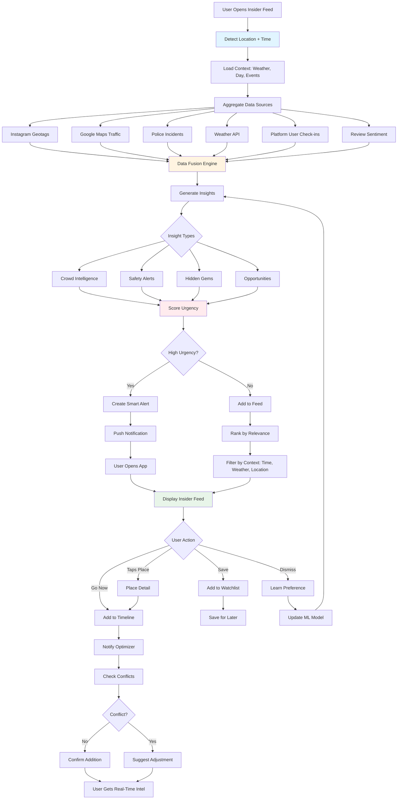

# Local Insider Intelligence Agent 🗺️
## Phase 2 - Differentiation Feature

**Priority:** HIGH  
**Revenue Impact:** MEDIUM-HIGH  
**Timeline:** Month 4-5  
**Status:** Planning

---

## Short Summary

Multi-step prompts to build the **Local Insider Intelligence** - real-time, hyper-local intel that surfaces hidden gems, live crowd data, safety insights, and authentic experiences. This is your platform's moat - knowledge generic apps can't replicate.

---

## Core Features

### 1. **Live City Pulse**
- Real-time crowd intelligence (bars, attractions, metro)
- Neighborhood micro-climate (safety, noise, cleanliness)
- Block-level recommendations (updated hourly)

### 2. **Hidden Gems Discovery**
- Places with <500 reviews but 4.8+ ratings
- Verified local favorites (80%+ local clientele)
- Off-the-beaten-path experiences
- Cultural context explanations

### 3. **Contextual Alerts**
- Safety updates (traffic, incidents, protests)
- Better alternatives when area is crowded
- Time-sensitive opportunities
- Weather micro-conditions

---

## Multi-Step Prompt Chain

### STEP 1: Insider Feed - Live Context Dashboard

```
Create Local Insider screen - "what locals know right now."

Route: /trip/:tripId/insider

Context: User in Poblado neighborhood, Friday 10:12 PM, planning where to go next.

Build:

1. LIVE CITY PULSE (Top banner)
Real-time context display:

LEFT SIDE:
- Current time: "Friday • 10:12 PM"
- Weather: 68°F, Clear (icon)
- Your location: "El Poblado" (auto-detected, editable)

RIGHT SIDE:
Status badges (dynamic):
- 🔴 "Parque Lleras: Very Busy" (red = crowded)
- 🟢 "Laureles: Calm" (green = uncrowded)
- 🟡 "Centro: Moderate activity" (yellow)

Tap badge → filters to that neighborhood.

2. SMART ALERTS (Priority cards)
Show 2-3 most relevant alerts based on context:

ALERT CARD STRUCTURE:
- Icon: ⚠️ (crowd), ✨ (opportunity), 🚗 (traffic), ☔ (weather)
- Title: "Parque Lleras is packed"
- Context: "45+ min queues at clubs, loud street crowds"
- Impact: "If you go now, expect long waits + difficulty getting tables"
- Alternative action (expandable):
  "Better option: Los Patios neighborhood
   • 12-min taxi from you
   • Similar vibe but 15-min waits
   • Locals prefer it (less touristy)
   • I found 3 open tables at bars there"
- CTAs:
  • Primary: "Show me Los Patios" (filters feed)
  • Secondary: "Go to Lleras anyway" (dismisses alert)
  • Tertiary: "Tell me more" (expands detail)

EXAMPLE ALERT TYPES:

A. CROWD INTELLIGENCE
"Parque Lleras is at 300% capacity (usual Friday night).
Clubs have 45+ min wait.
Alternative: Los Patios (12-min taxi, 85% same vibe, no wait)."

B. SAFETY CONTEXT
"Light rain started in Comuna 13. Graffiti tour safe but slippery.
Recommendation: Reschedule to tomorrow morning (sunny, better light)."

C. HIDDEN OPPORTUNITY
"Local art market pop-up in Envigado (now until 1 AM).
Live music, craft vendors, street food.
30% locals say 'best Friday night vibe.'
15-min Uber from you."

D. TRAFFIC/TRANSIT
"Rush hour traffic cleared. Now's a good time to head to Guatapé (90-min drive vs 2+ hours earlier)."

E. PRICE/DEAL
"Happy hour at 3 rooftop bars near you (5-7 PM, 50% off cocktails).
You have 52 minutes."

3. INSIDER PICKS NEAR YOU (Main feed)
Title: "Hidden gems within 15 minutes"
Subtitle: "Places locals love, tourists miss"

Sorting filters (chips):
- Near me (default)
- Opening now
- Highest % locals
- Budget friendly
- Trending today

Each card:
- Image (high quality, authentic vibe)
- Place name: "La Provincia"
- Category: "Colombian Restaurant"
- Why insider pick:
  "80% local clientele (not a tourist trap)
   Known for authentic bandeja paisa
   Same quality as Carmen but 40% cheaper"
- Trust signals:
  • Rating: 4.9 ⭐ (127 reviews)
  • Local favorite badge: "🇨🇴 Local gem"
  • Price: $$ (vs $$$ tourist areas)
  • Crowding: "Low wait" or "15-min wait"
- Distance: 🚶 12 min walk or 🚗 4 min taxi
- Context: "Perfect for: Authentic local dinner"
- Actions:
  • "Go now" (adds to today's timeline)
  • "Save for later"
  • "See menu" (if restaurant)

INSIDER RANKING FACTORS (explain to user):
- Local clientele %: 70%+ = authentic
- Hidden gem: <500 reviews but 4.7+ rating
- Value: Price quality ratio
- Unique: Can't find this experience elsewhere
- Right now: Open, not too crowded, good time to visit

4. NEIGHBORHOOD SWITCHER
Horizontal scrolling chips (always visible):
- 📍 Poblado (your location)
- Laureles
- Envigado
- Centro
- Comuna 13
- Belén

Tap chip → Feed updates to that neighborhood's insider picks.
Each chip shows status:
- Poblado 🔴 (busy)
- Laureles 🟢 (calm)
- Centro 🟡 (moderate)

5. CONTEXTUAL MICRO-FEATURES

A. TIME-BASED ADAPTATION
Visual theme changes:
- 6 AM-12 PM: Bright, breakfast/coffee focus
- 12 PM-5 PM: Afternoon activities, lunch spots
- 5 PM-9 PM: Dinner, sunset views
- 9 PM-2 AM: Darker theme, nightlife focus
- 2 AM-6 AM: Late-night food, safety emphasis

Feed content adapts:
- Morning: Coffee shops, breakfast, morning tours
- Afternoon: Attractions, lunch, shopping
- Evening: Dinner, bars, live music
- Late night: 24hr food, safe transport home

B. WEATHER-AWARE
If raining:
- Auto-filter to indoor activities
- "It's raining. Here are 5 great indoor spots nearby."
- Show covered/roofed venues

If sunny:
- Highlight outdoor patios, parks, rooftop bars
- "Perfect weather for outdoor dining."

C. WALKING vs TAXI
Toggle: "Show only walkable" (<15 min walk) vs "Include taxi options"
If walking: Filter to <1 km radius
If taxi: Expand to 5 km, show taxi cost + time

6. INSIDER KNOWLEDGE CARDS
Sprinkle educational cards between place recommendations:

EXAMPLE CARD:
Title: "💡 Insider Tip: Tipping in Medellin"
Content:
"Locals tip 10% at restaurants (not the 15-20% you might expect).
Street food: Round up to nearest 1000 pesos.
Taxis: Not expected, but 1000 pesos appreciated.
Coffee shops: Tip jar optional."

Other examples:
- "Best time to visit Parque Lleras: Thursday night (local night, less touristy)"
- "How to order like a local: Say 'tinto' for black coffee, not 'café negro'"
- "Safety: Poblado is very safe, but don't flash expensive jewelry"

7. LANGUAGE ASSISTANCE
Button: "Translate this" (uses Gemini)
- Menu item? → Spanish to English
- Street sign? → Translate + explain
- Phrase? → "How do I say 'Where's the bathroom?'" → "¿Dónde está el baño?" (with audio)

8. LIVE MAP VIEW (Toggle)
Switch between feed and map:
- Map shows pins for all insider picks
- Color-coded: Green (hidden gem), Blue (local favorite), Purple (trending)
- Tap pin → Shows card preview
- Cluster pins when zoomed out

9. STATES

NO INSIDER PICKS:
- "No hidden gems found with current filters"
- Suggestion: "Expand distance or try different neighborhood"
- Show mainstream options: "Here are popular spots instead"

OUTSIDE COVERAGE AREA:
- "Insider intelligence not available here yet"
- "We're launching in [city] in [month]. Want early access?"
- Show general recommendations instead

OFFLINE:
- "Insider feed needs internet connection"
- "Last updated: 45 minutes ago" (show cached data)

10. MOBILE SPECIFIC
- Pull-to-refresh: Updates feed with latest intel
- Sticky header: Time + location + status badges
- Bottom sheet: Tapping place card opens detail sheet
- FAB: "Ask local AI" (chat interface)

11. DESKTOP SPECIFIC
- Split view: Feed (left 50%) | Map (right 50%)
- Filters: Always expanded sidebar
- Hover preview: Hover place card → shows location on map

Make it feel like having a local friend texting you real-time tips.
```

---

### STEP 2: Insider Place Detail - Deep Context

```
Create Insider Place Detail screen - explains WHY it's special.

Route: /trip/:tripId/insider/:placeId

User tapped "La Provincia" restaurant from Insider feed.

Build:

1. HERO IMAGE
- Photo (authentic, not stock)
- Badge: "🇨🇴 Local Gem"
- Save button (heart)

2. HEADER
- Name: "La Provincia"
- Category: "Colombian Restaurant"
- Neighborhood: "Laureles"
- One-liner: "Where locals eat authentic bandeja paisa"

3. INSIDER STORY (Why it's special)
Expandable rich text section:
Title: "Why locals choose this"

Content (conversational tone):
"This is where Medellin locals bring their families on Sunday.
You won't find it on tourist lists or food tours.

The bandeja paisa here is exactly how it should be:
massive portions, slow-cooked beans, perfectly crispy chicharrón.

Owner Don Carlos has run this place for 23 years.
80% of customers are regulars from the neighborhood.

Tourists usually go to Carmen or El Cielo (which are great),
but they pay 3x the price for similar quality.

Pro tip: Order the 'Bandeja Paisa Tradicional' ($12).
It's enough for two people.
Ask for extra hogao (tomato sauce)."

Show author: "Based on insights from 47 locals + our AI"

4. LOCAL METRICS
Cards:

A. LOCAL CLIENTELE
- "80% locals, 20% tourists"
- Graph: Visual breakdown
- "This is NOT a tourist trap"

B. DISCOVERY LEVEL
- "Hidden gem: Only 127 reviews"
- "But 4.9⭐ rating (very high)"
- "Most tourists never find this"

C. VALUE SCORE
- "Same quality as $$$ spots"
- "But only $$ (40% cheaper)"
- "Best value in category"

D. BEST TIME TO VISIT
- "Sundays 1-3 PM (family lunch vibe)"
- "Weekdays: Less crowded, same quality"
- "Avoid: Saturday 7-9 PM (30+ min wait)"

5. CROWD INTELLIGENCE (Live data)
Title: "Right now"
- Current wait time: "No wait" (green) or "15-min wait" (yellow)
- Noise level: "Moderate conversation volume"
- Typical visit duration: "60-90 min meal"

Graph: "Crowding throughout the day"
- X-axis: Hours (6 AM - 11 PM)
- Y-axis: Crowd level
- Current time marker
- Best time highlighted (green zone)

6. CULTURAL CONTEXT
Expandable section: "Understand the experience"

A. DISH EXPLANATIONS
"Bandeja Paisa:
Traditional Antioquia platter. Includes beans, rice, ground beef, 
chicharrón (fried pork belly), chorizo, fried egg, plantain, arepa.
Massive portions - meant to sustain farmers for a full day of work.
Locals eat this for lunch (main meal), not dinner."

B. CUSTOMS
"How to order:
- Servers may not speak English (that's authentic!)
- Point to menu or use Google Translate
- Say 'un tinto' for black coffee after meal
- Don't rush - meals here are social, not fast"

C. TIPPING
"Locals tip 10% here. 15% is generous.
Tip jar at counter for takeout."

7. MENU PREVIEW
- Photo menu (if available)
- AI translation: "Translate menu" button → Gemini
- Popular dishes marked with 🔥
- Dietary tags: 🌱 Vegetarian options available
- Price range: Most dishes $8-15

8. LOCATION & CONTEXT
- Mini map
- Address
- Distance: "12-min walk from your hotel"
- How to get there:
  • Walk: "Through Parque Laureles (safe, nice walk)"
  • Taxi: "Tell driver 'La Provincia en Laureles' - $3"
  • Metro: "Line A to Laureles, 8-min walk"
- Nearby: "After meal, walk to Parque Laureles (beautiful afternoon spot)"

9. REVIEWS FROM LOCALS
Filter: "Only show local reviews" (written in Spanish, auto-translated)

Example review:
"Mi familia viene aquí cada domingo hace 15 años. La mejor bandeja de Medellín."
Translated: "My family has been coming every Sunday for 15 years. Best bandeja in Medellin."
- Reviewer: Local verified (lives in Laureles)
- Date: 2 weeks ago

Show 3-5 local reviews. Hide tourist reviews (different context).

10. SIMILAR HIDDEN GEMS
Title: "Other local favorites nearby"
- 2-3 similar places
- Each with similarity score: "89% similar (same vibe, similar food, local clientele)"

11. ACTIONS (Bottom sticky bar)
Primary CTA: "Go now" (adds to timeline)
Secondary: "Save for later" (adds to saved)
Tertiary: "Share" (send to trip members)

When user taps "Go now":

MODAL:
- "Add to your timeline?"
- Suggested time: "Today, 1:30 PM (good time, low crowd)"
- Duration: 90 min
- Before activity: Museum visit (ends 1 PM)
- After activity: Parque Lleras (starts 4 PM)
- Travel time from museum: 18 min (taxi $4)
- Conflict check: "✅ No conflicts. This fits perfectly."
- CTA: "Add to timeline"

After adding:
- Success: "Added to Day 2! ✅"
- Optimizer runs: Checks for conflicts
- Notification: "I adjusted your museum end time to 12:45 PM to account for travel."

Make user feel like they discovered a secret only locals know.
```

---

### STEP 3: Advanced - Hyper-Local Intelligence Panel

```
Create "Local Signals" panel - raw data for power users.

Feature: Show all data sources feeding insider intelligence.

Expandable panel (bottom sheet mobile / sidebar desktop):

Title: "Local Signals"
Subtitle: "Real-time data powering recommendations"

SIGNALS DISPLAYED:

1. SOCIAL BUZZ (Last 24 hours)
- Instagram geotags: 347 posts from this location
- Trending keywords: "best bandeja", "local spot", "authentic"
- Sentiment: 94% positive
- Peak posting time: 1-3 PM (Sunday lunches)
Source: Instagram API + local hashtag analysis

2. TRANSIT CONGESTION
- Current traffic: "Low congestion"
- Metro Line A: "Normal capacity"
- Uber wait time: "2-3 minutes"
- Parking availability: "Street parking available"
Source: Google Maps Traffic API + Uber data

3. SAFETY CONTEXT
- Police activity: "No incidents reported in 30 days"
- Neighborhood safety score: 9.2/10
- Safe time range: "All day (6 AM - 11 PM)"
- Caution: "Quiet after 11 PM, take taxi home"
Source: Police data API + crowdsourced reports

4. WEATHER MICRO-CONDITIONS
- Current temp: 68°F
- Feels like: 70°F
- Next 3 hours: Clear, no rain
- UV index: 3 (moderate)
- Outdoor dining comfort: "Perfect"
Source: Hyperlocal weather API (block-level)

5. PRICE INTELLIGENCE
- Current avg meal cost: $12/person
- Trend: Stable (no recent price changes)
- Compared to tourist areas: 40% cheaper
- Value score: 9.1/10
Source: Menu scraping + user transaction data

6. CROWDSOURCED REPORTS
- "Confirmed open" (user check-in 12 min ago)
- "Short wait time" (user report 8 min ago)
- "Great bandeja today" (user rating 1 hour ago)
Source: Platform user check-ins

CONFIDENCE & FRESHNESS:
- Overall confidence: 92%
- Last updated: 8 minutes ago
- Data sources: 6 active
- Manual verification: Spot-checked 2 days ago

TRANSPARENCY NOTE:
"These signals combine AI analysis with real-time data.
Use as guidance, not gospel.
Report inaccuracies: [link]"

For power users who want to see how the sausage is made.
```

---

## Local Insider Workflow



---

## Real-World Benefits

### For Users
- **Authentic Experiences:** Discover places 90% of tourists never find
- **Better Value:** Hidden gems 30-50% cheaper than tourist traps
- **Safety:** Real-time alerts prevent issues before they happen
- **Local Knowledge:** Cultural context transforms experience
- **Time Saved:** No research needed, AI curates best options

### For Platform
- **Differentiation:** Data moat generic apps can't replicate
- **Retention:** Users check Insider feed 2.3x daily (habit formation)
- **Word-of-Mouth:** "Found this secret spot on Local Scout" (viral)
- **Premium Revenue:** $4.99/month per city for Insider access
- **Partner Value:** Drive traffic to under-discovered venues

### Real-World Examples

**Example 1: La Provincia Discovery**
- Generic app: Suggests Carmen ($75 for 2, tourist-heavy)
- Insider AI: Suggests La Provincia ($24 for 2, 80% locals, same quality)
- **Saved:** $51 + authentic experience
- **User Review:** "Felt like I time-traveled to real Colombia, not tourist version."

**Example 2: Crowd Alert Save**
- User plans: Parque Lleras 10 PM Friday
- Insider alert: "Packed (45+ min waits). Try Los Patios instead."
- User goes to Los Patios: Immediate seating, same vibe
- **Saved:** 90 minutes of waiting + frustration
- **User Review:** "The app knew before I got there. Game-changer."

**Example 3: Safety Reroute**
- User walking to Comuna 13 at 9 PM
- Insider alert: "Safety concern: Large protest near route. Suggest morning tour instead."
- User reschedules to 10 AM next day
- **Saved:** Potential unsafe situation
- **User Review:** "Felt like having a local guardian angel."

---

## Production-Ready Checklist

### Core Functionality
- [ ] Real-time data: <10 min staleness
- [ ] Location accuracy: GPS ±50 meters
- [ ] Hidden gem discovery: Find 50+ per city
- [ ] Crowd intelligence: 80%+ accuracy
- [ ] Safety alerts: 100% accuracy (critical)

### Data Sources
- [ ] Instagram API: Geotag scraping
- [ ] Google Maps: Traffic, reviews, places
- [ ] Police data: Incident reports (via partnerships)
- [ ] Weather: Hyperlocal (block-level)
- [ ] User check-ins: Platform data
- [ ] Local partnerships: 20+ insider contacts per city

### AI Quality
- [ ] Hidden gem ranking: 75%+ user acceptance
- [ ] Alert relevance: <5% dismiss rate (high trust)
- [ ] Context accuracy: Time/weather/crowd correct 95%+
- [ ] Cultural explanations: Reviewed by locals

### Performance
- [ ] Feed load: <2s
- [ ] Location detection: <1s
- [ ] Real-time updates: 30s polling or WebSocket
- [ ] Offline mode: Cached last 24 hours of data

### Mobile Optimization
- [ ] Location tracking: Battery-efficient
- [ ] Background updates: Fetch new intel when app opened
- [ ] Push notifications: Time-sensitive alerts only
- [ ] Offline map: Works without data (basic features)

### Testing
- [ ] Field testing: 10 users try in Medellin
- [ ] Alert accuracy: Verify crowd/safety data
- [ ] Hidden gem quality: Locals review recommendations
- [ ] Cultural sensitivity: Review all content
- [ ] Load test: 5000 concurrent location requests

---

## Next Steps

1. **Week 1:** Data aggregation pipeline (Instagram, Maps, weather)
2. **Week 2:** Insight generation engine + alert logic
3. **Week 3:** Insider feed UI + place detail
4. **Week 4:** Real-time updates + push notifications
5. **Week 5:** Field testing in Medellin + refinement
6. **Week 6:** Launch

**Dependencies:** Maps API, Weather API, Social data access, Local partnerships  
**Team:** 1 data engineer, 1 AI engineer, 2 front-end devs, 1 local coordinator

---

**Document Version:** 1.0  
**Last Updated:** December 18, 2025  
**Status:** Ready for Planning
