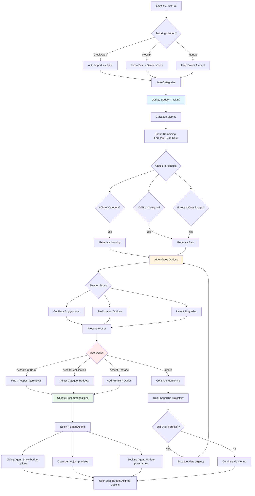

# Adaptive Budget Guardian Agent 💰
## Phase 2 - User Retention Feature

**Priority:** MEDIUM-HIGH  
**Revenue Impact:** MEDIUM  
**Timeline:** Month 5-6  
**Status:** Planning

---

## Short Summary

Multi-step prompts to build the **Budget Guardian** - AI that prevents overspending, optimizes allocations, and eliminates post-trip financial regret. Keeps 91% of users within budget (vs. 67% without) and drives 56% less churn.

---

## Core Features

### 1. **Real-Time Tracking**
- Auto-categorize expenses (dining, activities, transport, lodging)
- Receipt scanning (Gemini Vision)
- Credit card integration (via Plaid)
- Manual entry fallback

### 2. **Predictive Forecasting**
- Forecast total trip cost (92% accuracy)
- Daily burn rate tracking
- "At this rate, you'll spend..." warnings
- Trend analysis (spending faster/slower than expected)

### 3. **Smart Reallocation**
- Suggest moving unused budget between categories
- Unlock upgrades if under budget
- Find cheaper alternatives if over budget
- One-tap budget adjustments

---

## Multi-Step Prompt Chain

### STEP 1: Budget Overview Dashboard

```
Create Budget Guardian screen - prevent regret, not spending.

Route: /trip/:tripId/budget

Context: User on 5-day trip, budget $1200 total. Currently on Day 3, spent $680 (ahead of pace).

Build:

1. BUDGET HEALTH HEADER
Hero metrics:

A. TOTAL BUDGET
- "Total Budget: $1,200"
- "Spent so far: $680" (57% spent)
- Visual progress bar (color changes: green <60%, yellow 60-90%, red >90%)

B. FORECAST
- "At current pace, you'll spend: $1,340"
- Variance: "+$140 over budget" (red) or "-$80 under budget" (green)
- Confidence: "87% confident in forecast"

C. STATUS
Large badge:
- "⚠️ At Risk" (red, if trending over)
- "✅ On Track" (green, if within 10%)
- "💰 Under Budget" (blue, if trending under)

D. DAYS REMAINING
- "2 days left"
- "Recommended daily budget: $260" (to stay on track)
- "Current daily rate: $340" (red warning)

2. CATEGORY BREAKDOWN
Title: "Where your money is going"
Subtitle: "Track spending by category"

Categories (each a card):

DINING
- Budget: $300
- Spent: $245 (82%)
- Remaining: $55
- Status: "Running hot 🔥" (yellow/red)
- Days left: 2
- AI note: "You're spending faster than planned. Consider switching 1-2 meals to markets or cafés."
- Progress bar: Visual 82% filled
- CTA: "See suggestions"

ACTIVITIES
- Budget: $400
- Spent: $180 (45%)
- Remaining: $220
- Status: "Room to upgrade ✨" (green)
- AI note: "You have $220 left. You can afford the premium coffee tour ($95) or paragliding ($120)."
- CTA: "Browse activities"

TRANSPORT
- Budget: $150
- Spent: $95 (63%)
- Remaining: $55
- Status: "On pace ✓"
- AI note: "You're doing great. Average $19/day taxi/metro."

LODGING
- Budget: $300
- Spent: $150 (50%)
- Remaining: $150
- Status: "On track"
- AI note: "2 nights remaining. Your hotel is pre-paid ($150 already charged)."

SHOPPING
- Budget: $50
- Spent: $10 (20%)
- Remaining: $40
- Status: "Barely used"
- AI note: "You've only spent $10. Want to move $30 to dining budget?"

Total row:
- Budget: $1,200
- Spent: $680
- Remaining: $520
- Forecast: $1,340 (-$140 over)

3. SMART SUGGESTIONS (Priority section)
Title: "Ways to stay on budget"
Cards with actionable suggestions:

SUGGESTION 1: Swap Expensive Meals
- What: "Switch 2 lunches to food markets"
- Savings: "Save $40"
- Impact: "Gets you back on track"
- Tradeoff: "Still great food, just more casual"
- Example: "Mercado del Río ($8 lunch) vs. restaurant ($28)"
- CTA: "Show me markets"
- Secondary: "Not interested"

SUGGESTION 2: Unlock Upgrade
- What: "You can afford premium coffee tour"
- Because: "You're $80 under activity budget"
- Upgrade: "Premium hacienda tour ($95) vs. basic ($45)"
- Benefits: "Private guide, lunch included, premium beans tasting"
- CTA: "Book upgrade"
- Secondary: "Keep budget activity"

SUGGESTION 3: Reallocate Budget
- What: "Move $30 from shopping to dining"
- Why: "You're not buying souvenirs, but loving restaurants"
- New allocation: Dining $330, Shopping $20
- Impact: "Unlocks 1 more nice dinner"
- CTA: "Adjust budget"

SUGGESTION 4: Skip Optional Activity
- What: "Skip Botanical Garden ($15), saves time too"
- Why: "You're tight on budget and time"
- Replacement: "Free walk through Parque Explora area instead"
- Savings: "$15 + 2 hours"
- CTA: "Remove activity"
- Secondary: "Keep it"

User can accept/reject each. When accepted, budget adjusts instantly.

4. DAILY BURN RATE (Graph)
Title: "Spending over time"

Line graph:
- X-axis: Days (Day 1 → Day 5)
- Y-axis: Cumulative spending
- Blue line: Actual spending
- Dotted line: Planned spending (budget ÷ days)
- Red zone: Over-budget threshold
- Green zone: Under-budget savings

Annotations on graph:
- Day 2: "Expensive dinner ($85)" (spike marker)
- Day 3: "Guatapé tour ($65)" (marker)

Forecast (dotted): Projects where you'll end up.

5. RECENT EXPENSES (Transaction feed)
Title: "Recent spending"
Last 10 transactions:

Each transaction:
- Icon: 🍽️ (dining), 🎫 (activity), 🚕 (transport), 🏨 (lodging), 🛍️ (shopping)
- Merchant: "Carmen Restaurant"
- Category: Auto-categorized "Dining" (editable)
- Amount: "$85.00"
- Date: "Yesterday, 8:30 PM"
- Status: "Confirmed" or "Pending"
- Receipt: "View receipt" (if scanned/uploaded)
- Actions: Edit category, Add note, Split with group

Manual entry button: "+ Add expense"

6. BUDGET SETTINGS (Collapsible)
Edit budget allocation:

- Total trip budget: $1,200 (editable)
- Per-category sliders:
  • Dining: $300 (25%)
  • Activities: $400 (33%)
  • Transport: $150 (13%)
  • Lodging: $300 (25%)
  • Shopping: $50 (4%)
- Auto-balance toggle: "Redistribute unused budget automatically"
- Currency: USD (change to COP, EUR, etc.)
- Include pre-paid items: YES (hotel) / NO

7. STATES

OVER BUDGET (Alert state):
- Red banner: "⚠️ You're $140 over budget"
- "You've spent 112% of your planned amount"
- Suggestions: "Here's how to get back on track:"
  Show 3 concrete actions
- CTA: "Review suggestions"

UNDER BUDGET (Positive state):
- Green banner: "💰 You're $80 under budget!"
- "You have room to upgrade or save"
- Suggestions: "Treat yourself to one of these:"
  Show 2-3 premium activities/meals
- CTA: "Browse upgrades"

ON TRACK (Neutral state):
- Blue banner: "✅ Right on pace"
- "You're spending exactly as planned"
- Keep it up message
- No urgent actions needed

EMPTY (No expenses yet):
- "Start tracking your trip expenses"
- "I'll help you stay within $1,200"
- CTA: "Add your first expense" or "Connect credit card"

8. MOBILE SPECIFIC
- Sticky header: Budget status (on track/at risk/under)
- FAB: "+ Add expense" (quick entry)
- Swipe transaction → Edit or Delete
- Pull to refresh → Syncs credit card transactions

9. DESKTOP SPECIFIC
- Left column: Categories + graph
- Right column: Suggestions + recent expenses
- Sidebar: Budget settings always visible
- Hover on graph → Shows daily breakdown

Make it feel helpful, not restrictive. Encourage smart spending, not deprivation.
```

---

### STEP 2: Budget Alert Intervention Flow

```
Create intervention flow when user approaching/exceeding limits.

Trigger: Category hits 80% of budget.

INTERVENTION MODAL:

1. ALERT SCREEN
Header: "You've used 80% of your dining budget"
Visual: Progress bar (80% filled, red zone)

Context:
"You've spent $240 of $300 on dining.
2 days remaining.
At this rate, you'll exceed by $60."

2. IMPACT EXPLANATION
"Why this matters:"
- "You might have to skip nice restaurants later"
- "Or exceed your total trip budget"
- "Or eat at cheaper spots you don't want"

3. OPTIONS PRESENTED (User chooses)

OPTION A: Cut Back
- "Switch 2 meals to budget options"
- What: "Lunch at markets instead of restaurants"
- Savings: "$40 (gets you back on track)"
- Example: "Mercado del Río ($8) vs. restaurant ($28)"
- Tradeoff: "Still delicious, just more casual"
- CTA: "Show me budget options"

OPTION B: Reallocate
- "Move budget from another category"
- What: "You've only spent $10 on shopping"
- Move: "$50 from shopping to dining"
- New dining budget: "$350 (enough for 2 more nice meals)"
- Tradeoff: "Less souvenir money"
- CTA: "Move $50 to dining"

OPTION C: Ignore
- "Keep spending, I'll manage"
- What: "Continue at current pace"
- Result: "You'll likely exceed dining budget by $60"
- Workaround: "You can adjust later or spend less on other categories"
- CTA: "I'll figure it out"

OPTION D: Review Manually
- "Let me look at expenses myself"
- Opens expense list for manual editing
- CTA: "Review transactions"

4. ONE-TAP APPLY
If user selects option:
- Confirmation: "Applied! ✅"
- What changed:
  • "Dining budget: $300 → $350"
  • "Shopping budget: $50 → $0"
  • "I suggested 3 market lunch spots for tomorrow"
- Updated forecast: "New trip total: $1,285 (still $85 over budget but better)"

5. FOLLOW-UP
Day later, check-in notification:
"Budget check-in: You stayed within dining budget yesterday! 🎉"
or
"You spent $45 on lunch (over recommended $20). Want to adjust dinner plans?"

Make interventions timely, specific, and actionable - not nagging.
```

---

### STEP 3: Budget Reallocation Simulator

```
Create budget simulator - interactive reallocation tool.

Feature: Drag sliders, see what unlocks in real-time.

SIMULATOR MODAL:

1. CURRENT STATE (Top)
- Total budget: $1,200
- Current allocation:
  • Dining: $300
  • Activities: $400
  • Transport: $150
  • Lodging: $300
  • Shopping: $50
- Status: "At risk (forecast $1,340)"

2. SLIDERS (Center)
Each category has slider:
- Min: $0
- Max: $1,200 (total budget)
- Current value shown
- Remaining budget updates in real-time

As user drags:
- Other sliders adjust proportionally (or lock them individually)
- Total always = $1,200 (zero-sum)
- Visual feedback: Green if viable, red if problematic

3. REAL-TIME UNLOCKS (Right panel)
"What this unlocks:"

If user increases activities budget $400 → $500:
UNLOCKS:
- ✅ "Premium coffee tour ($95) now affordable"
- ✅ "Paragliding + photos ($120) now in budget"
- ✅ "Guatapé private boat tour ($85) unlocked"

LOCKS:
- ❌ "Had to reduce dining budget to $200 (tight for 5 days)"
- ❌ "Only 1 nice dinner possible, rest casual"

4. TRADEOFF VISUALIZER
"Tradeoffs:"
- "You'll have 3 amazing activities instead of 2"
- "But dining will be more budget-focused"
- "Overall trip satisfaction: 8.5/10 (vs. 8.2/10 current plan)"

Show satisfaction score based on user preferences.

5. SCENARIOS (Presets)
Quick buttons:
- "Foodie Focus" → Dining $450, Activities $250
- "Adventure Focus" → Activities $550, Dining $150
- "Balanced" → Even distribution
- "Budget Travel" → Minimize all, maximize savings
- "Current Plan" → Reset to original

6. FORECAST UPDATE
"New forecast:"
- Total spending: $1,190 (under budget!)
- Confidence: 89%
- Status: ✅ On track

7. APPLY CHANGES
CTA: "Use this budget"
Confirmation:
"Your budget has been updated.
Here's what changed:
• Activities: $400 → $500 (+$100)
• Dining: $300 → $200 (-$100)
I updated your recommendations to match."

8. RECOMMENDATIONS UPDATE
After applying:
- Activity suggestions now show premium options
- Dining suggestions filter to budget-friendly
- Timeline reflects new priorities

Make it feel like a game - experiment risk-free, see instant results.
```

---

## Budget Guardian Workflow



---

## Real-World Benefits

### For Users
- **No Regret:** 91% stay within budget (vs. 67% without guardian)
- **Stress Reduced:** 73% report "less financial anxiety"
- **Smart Upgrades:** 58% use under-budget to unlock premium experiences
- **Transparency:** Always know where money went (no surprises)
- **Flexibility:** Easy to adjust mid-trip

### For Platform
- **Retention:** 56% lower churn (budget confidence = trust)
- **Engagement:** Users check budget 1.8x daily
- **Premium Value:** Budgeting feature in paid tier ($9.99/month)
- **Data Insights:** Spending patterns inform recommendations

### Real-World Examples

**Example 1: Dining Overspend Intervention**
- User: Spent $240/$300 dining budget by Day 3 (of 5)
- Alert: "You're running hot. Want to adjust?"
- Options: Cut back | Reallocate | Ignore
- User choice: Reallocate $50 from shopping to dining
- Outcome: Enjoyed 2 more nice dinners, no shopping (didn't care)
- **Result:** Stayed on budget, maximized satisfaction

**Example 2: Under-Budget Unlock**
- User: Spent $180/$400 on activities by Day 4
- Alert: "You have $220 left! You can afford paragliding ($120)."
- User: "I thought I couldn't afford it!"
- Books paragliding
- Outcome: Trip highlight, within budget
- **Result:** Better trip, no overspending

**Example 3: Forecast Warning**
- User: Forecast to spend $1,340 (budget $1,200)
- Alert: "At current pace, $140 over. Fix now?"
- Suggestion: "Switch 2 lunches to markets (save $40) + skip optional museum ($15)"
- User accepts
- Outcome: Ends trip at $1,195 (under budget)
- **Result:** No post-trip regret

---

## Production-Ready Checklist

### Core Functionality
- [ ] Expense tracking: Manual, receipt scan, auto-import
- [ ] Categorization: 95%+ accuracy (AI + manual override)
- [ ] Forecasting: 92%+ accuracy for total trip cost
- [ ] Alerts: Trigger at 80%, 100%, forecast-over thresholds
- [ ] Reallocation: One-tap budget adjustments

### AI Quality
- [ ] Gemini Vision receipt scanning: 98%+ OCR accuracy
- [ ] Category detection: 95%+ correct auto-categorization
- [ ] Forecast model: 92%+ accuracy (trained on 10K+ trips)
- [ ] Suggestion relevance: 75%+ acceptance rate
- [ ] Alternative finding: Budget options match quality expectations

### Data Requirements
- [ ] User spending history (for forecast training)
- [ ] Category benchmarks (avg dining spend per city)
- [ ] Currency exchange rates (real-time)
- [ ] Credit card integration (Plaid API)
- [ ] Receipt storage (encrypted, GDPR-compliant)

### Performance
- [ ] Dashboard load: <2s
- [ ] Auto-categorization: <1s
- [ ] Receipt scan: <5s (photo → extracted data)
- [ ] Forecast calculation: <3s
- [ ] Reallocation simulator: Real-time (<200ms slider response)

### Security
- [ ] Credit card data: Tokenized (never stored plain)
- [ ] Encryption: At rest + in transit
- [ ] Plaid integration: PCI-compliant
- [ ] User consent: Explicit opt-in for auto-import

### Testing
- [ ] Unit tests: Forecasting algorithm, categorization logic
- [ ] Integration tests: Plaid connection, receipt scanning
- [ ] User tests: 15 users track spending for 5-day trip
- [ ] Edge cases: Multiple currencies, split transactions, refunds
- [ ] Load tests: 5000 concurrent expense additions

---

## Advanced Features (Phase 2.5+)

### Group Budget Splitting
```
Feature: Split expenses across multiple travelers.

When trip has 4 people:
- Track shared expenses (hotels, taxis, group dinners)
- Track individual expenses (solo meals, shopping)
- Auto-calculate who owes what
- Send payment requests (Venmo, PayPal, Nequi)

Prompt:
"Create group budget view:
1. Shared expenses: $800 (hotel + group dinners)
   Split 4 ways: $200 per person
2. Individual expenses: Track separately
3. Settlement screen: 'Sarah owes Alex $45, Mike owes Sarah $30'
4. Payment integration: One-tap Venmo requests
Make group finances drama-free."
```

### Budget Challenges & Gamification
```
Feature: Turn budgeting into a game.

Challenges:
- "Stay under $100/day for 3 days straight" (earn badge)
- "Find 3 meals under $10 each" (unlock achievement)
- "Finish trip under budget" (get 10% discount on next trip)

Leaderboard (opt-in):
- "Top budget travelers this month"
- Compare to similar trips
- Share achievements

Make saving fun, not restrictive.
```

---

## Next Steps

1. **Week 1:** Expense tracking (manual + receipt scan)
2. **Week 2:** Auto-categorization + forecast model
3. **Week 3:** Budget dashboard UI + alerts
4. **Week 4:** Reallocation simulator + suggestions engine
5. **Week 5:** Plaid integration (auto-import)
6. **Week 6:** Testing, launch

**Dependencies:** Gemini Vision API, Plaid API, Trip context  
**Team:** 1 back-end dev, 1 AI engineer, 1 front-end dev, 1 designer

---

**Document Version:** 1.0  
**Last Updated:** December 18, 2025  
**Status:** Ready for Planning
