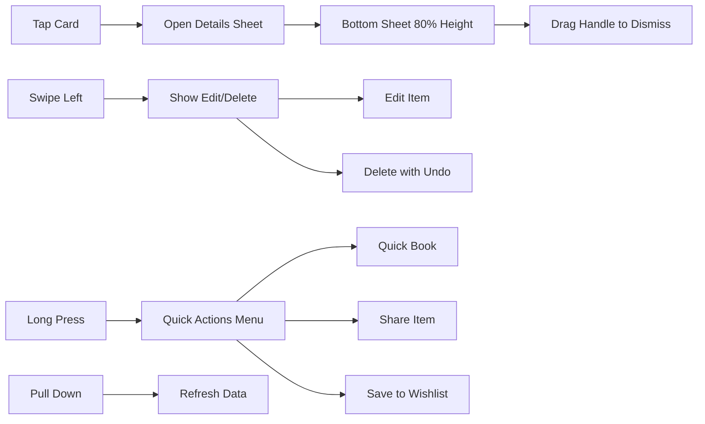

# 09 - Mobile-First Responsive Implementation Plan

**Feature:** Optimized Mobile Experience Across All Features  
**Priority:** High (Phase 2 - Ongoing, parallel to all features)  
**Owner:** Frontend Team + UX Team  
**Focus:** Touch interactions, performance, offline capability

---

## Progress Tracker

| Phase | Task | Status | Owner | Validation |
|-------|------|--------|-------|-----------|
| **Design** | Mobile wireframes for all screens | 🔴 Not Started | Figma Make | Tested on iOS and Android |
| **Frontend** | Responsive breakpoints | 🔴 Not Started | Cursor AI | Works 320px to 1920px |
| **Performance** | Image optimization | 🔴 Not Started | Cursor AI | Lighthouse score 90+ |
| **PWA** | Offline capability | 🔴 Not Started | Cursor AI | Works without internet |
| **Testing** | Device testing matrix | 🔴 Not Started | QA | 15 devices tested |

---

## 1. Product Goal

**Problem:** Travelers use mobile devices ninety percent of the time - desktop-first design creates poor mobile experience.

**Solution:** Mobile-first design approach, touch-optimized interactions, offline PWA capabilities, lightning-fast performance on 3G networks.

**Outcome:** Users complete all tasks on mobile as easily as desktop, app works offline during flights.

**Success Metric:** Ninety-five percent of users complete trip planning entirely on mobile, Lighthouse mobile score 90+.

---

## 2. Responsive Breakpoints

### Tailwind CSS Breakpoints

**Mobile First Approach:**
```
Base (320px+): Mobile phones (portrait)
sm (640px+): Large phones (landscape), small tablets
md (768px+): Tablets (portrait)  
lg (1024px+): Tablets (landscape), small laptops
xl (1280px+): Laptops, desktops
2xl (1536px+): Large desktops
```

### Design Decisions by Breakpoint

**Mobile (320-639px):**
- Single column layout
- Navigation: bottom tab bar (5 icons max)
- Cards: full-width, stacked vertically
- Forms: one input per row
- Modals: slide up from bottom (full screen)
- Maps: toggle between map view and list view (not side-by-side)
- Budget charts: simplified bar charts (no complex visualizations)

**Tablet (640-1023px):**
- Two-column layout for content, single column for forms
- Navigation: side drawer + top bar
- Cards: 2 columns grid
- Modals: centered, 80% screen width
- Maps: split view (40% map, 60% list) or tabs

**Desktop (1024px+):**
- Three-column layout (sidebar, main, tools panel)
- Navigation: persistent left sidebar
- Cards: 3-4 columns grid
- Modals: centered, max 600px width
- Maps: split view (50/50) with synchronized scrolling

---

## 3. Touch Interactions

### Design Patterns

**Tap Targets:**
- Minimum size: 44x44 pixels (Apple HIG standard)
- Spacing: 8px between interactive elements
- Buttons: 48px height for primary actions

**Gestures:**
- Swipe left on itinerary item: show delete and edit actions
- Pull to refresh: update itinerary from server
- Long press on restaurant card: quick actions menu
- Pinch to zoom: on maps only
- Double tap: zoom to item on map

**Feedback:**
- Haptic feedback on important actions (booking confirmed, budget alert)
- Visual ripple on button taps
- Loading skeleton states (avoid blank screens)

**Mermaid Diagram: Mobile Interaction Patterns**



---

## 4. Progressive Web App (PWA)

### Offline Capabilities

**Service Worker Strategy:**

**Cache First (Static Assets):**
- App shell (HTML, CSS, JS)
- UI components, icons, fonts
- Cached for 7 days

**Network First (Dynamic Data):**
- Itinerary items, trip details
- Check server first, fallback to cache if offline
- Show "Viewing offline version" banner

**Background Sync:**
- User adds itinerary item while offline
- Stored in IndexedDB queue
- Syncs to Supabase when connection restored
- Show sync status indicator

**Supabase Schema for Offline:**
```
Table: sync_queue (client-side IndexedDB)
- id, operation (create/update/delete), table_name
- record_data (jsonb), created_at, synced (boolean)
```

**PWA Manifest:**
```
{
  "name": "Local Scout Trip OS",
  "short_name": "Local Scout",
  "start_url": "/",
  "display": "standalone",
  "background_color": "#FFFFFF",
  "theme_color": "#10B981",
  "icons": [
    {"src": "/icon-192.png", "sizes": "192x192"},
    {"src": "/icon-512.png", "sizes": "512x512"}
  ]
}
```

---

## 5. Performance Optimization

### Core Web Vitals Targets

**LCP (Largest Contentful Paint):** <2.5 seconds
- Optimize hero images: WebP format, responsive sizes
- Lazy load below-fold content
- Preload critical fonts (Playfair Display, Inter)

**FID (First Input Delay):** <100ms
- Code splitting: load only needed JavaScript per route
- Defer non-critical scripts (analytics, chat widgets)
- Use web workers for heavy calculations (budget forecasting)

**CLS (Cumulative Layout Shift):** <0.1
- Reserve space for images (aspect-ratio CSS)
- Avoid dynamic content insertion above fold
- Fixed header/footer heights

### Image Optimization

**Strategy:**
- Serve WebP with JPEG fallback
- Responsive sizes: 320w, 640w, 1024w, 1920w
- Lazy loading: images load as user scrolls
- Blur placeholder: low-quality image preview while loading

**Supabase Storage:**
- Upload original high-res images
- Supabase auto-generates optimized versions
- CDN delivers closest server to user

---

## 6. Mobile-Specific Features

### Feature 1: Bottom Sheet Navigation

**Use Case:** Restaurant detail page on mobile

**Design:**
- Sheet slides up from bottom (80% screen height)
- Drag handle at top for dismissal
- Swipe down to close
- Background dimmed with overlay
- Sections: photos, details, menu, reviews, booking

**Implementation:**
```
Component: BottomSheet
Props: isOpen, onClose, height (default 80%)
Behavior: 
- Animates translate-y from 100% to 20%
- Prevents body scroll when open
- Closes on overlay tap or swipe down
- Keyboard-aware (shifts up when input focused)
```

---

### Feature 2: Floating Action Button (FAB)

**Use Case:** Add item to itinerary from any screen

**Design:**
- Fixed position bottom-right (mobile) or top-right (desktop)
- Primary action: green circle with plus icon
- Tap expands to mini-menu: Add Activity, Add Dining, Add Transport
- Hides on scroll down, shows on scroll up

**Accessibility:**
- ARIA label: "Add to itinerary"
- Keyboard accessible: Tab to focus, Enter to activate
- Screen reader announces: "Button, Add to itinerary, menu"

---

### Feature 3: Swipe Actions on Cards

**Use Case:** Quick edit/delete itinerary items

**Design:**
- Swipe left reveals red delete button and blue edit button
- Swipe right reveals green "mark complete" (for tasks)
- Buttons follow card (elastic animation)
- Tap outside card resets swipe

**Implementation:**
```
Use: react-swipeable library or custom gesture handler
Threshold: 30% of card width to trigger action
Haptic: vibrate on action reveal
Undo: show toast "Item deleted" with Undo button (5 second timeout)
```

---

### Feature 4: Voice Input for Chat

**Use Case:** Hands-free interaction with AI Concierge

**Design:**
- Microphone icon in chat input
- Tap to start recording (animated pulse)
- Speech-to-text using Web Speech API
- Text appears in input, user can edit before sending

**Implementation:**
```
Browser API: webkitSpeechRecognition (Chrome) or SpeechRecognition (Firefox)
Language: Auto-detect from user locale or trip destination
Fallback: If API unavailable, hide microphone icon
Privacy: Audio not stored, only transcribed text sent to server
```

---

## 7. Implementation Prompts

### Figma Make Prompts

**Prompt 1:** "Design mobile itinerary feed (320-640px width). Full-width cards stacked vertically, each card 120px height. Swipe left reveals edit (blue) and delete (red) buttons. Bottom tab bar navigation: Home, Explore, Itinerary, Chat, Profile icons. Use bottom sheet for item details (slides up 80% height, drag handle top center, dimmed background). Ensure 44px minimum tap targets."

**Prompt 2:** "Create mobile budget dashboard. Simplified horizontal bar chart showing categories (no complex pie charts). Large numbers for total/spent/remaining. Category cards stack vertically. Pull-to-refresh indicator at top. Floating action button bottom-right for adding expenses. Use emerald green primary, amber for warnings, red for overspending."

**Prompt 3:** "Design mobile restaurant search results. Toggle between list view (full-width cards) and map view (full-screen map with bottom sheet overlay for results). Filter chips horizontal scroll (no wrapping). Restaurant cards: image left (80px square), details right, primary action button full-width bottom. Bottom sheet for restaurant details with sections: photos carousel, info, menu, reviews."

### Cursor AI Prompts

**Prompt 4:** "Implement responsive layout system using Tailwind CSS. Create utility classes for mobile-first design. Example: itinerary grid should be 1 column (base), 2 columns (md breakpoint), 3 columns (lg breakpoint). Use container queries for card components (cards resize based on parent, not viewport). Add breakpoint-specific navigation: bottom tabs (mobile), side drawer (tablet), persistent sidebar (desktop)."

**Prompt 5:** "Build PWA service worker for offline functionality. Cache static assets (app shell, fonts, icons) using cache-first strategy. Cache API responses using network-first with cache fallback. Implement background sync: when user adds itinerary item offline, store in IndexedDB, sync to Supabase when online. Show offline indicator banner. Register service worker in main.tsx, handle updates gracefully (prompt user to reload when new version available)."

**Prompt 6:** "Optimize images for mobile performance. Create ImageWithFallback component that serves WebP with JPEG fallback. Use responsive image sizes: generate 320w, 640w, 1024w versions. Implement lazy loading: images load when 200px from viewport. Add blur placeholder: show low-quality preview (10KB) while full image loads. Integrate with Supabase Storage image transformations API."

**Prompt 7:** "Create swipe gesture handler for itinerary cards. Use touch events (touchStart, touchMove, touchEnd). Track swipe distance, reveal action buttons when threshold reached (30% card width). Animate card translate-x smoothly. On delete: show undo toast for 5 seconds, if no undo clicked, delete from database. Add haptic feedback (navigator.vibrate) when actions revealed. Handle edge cases: prevent swipe during scroll, reset swipe on card blur."

---

## 8. Mobile-Specific Supabase Queries

### Optimized for 3G Networks

**Reduce Payload Size:**
- Select only needed columns (avoid SELECT *)
- Limit results: 25 items per page (infinite scroll)
- Compress responses: enable gzip in Supabase client

**Example Query:**
```
Query: Fetch itinerary items for Day 2
Bad: SELECT * FROM itinerary_items WHERE day_id = 'day_2'
Good: SELECT id, title, start_time, end_time, location_name FROM itinerary_items WHERE day_id = 'day_2' ORDER BY order_index LIMIT 25
```

**Caching Strategy:**
- Cache trip details for 1 hour (rarely changes)
- Cache restaurant data for 24 hours (static information)
- Real-time subscribe only to itinerary_items (critical updates)

---

## 9. Testing Matrix

### Device Coverage

**iOS:**
- iPhone SE (small screen, 320px width)
- iPhone 13 Pro (standard)
- iPhone 14 Pro Max (large screen)
- iPad Air (tablet)

**Android:**
- Samsung Galaxy S21 (standard)
- Google Pixel 7 (stock Android)
- Samsung Galaxy Tab (tablet)
- Budget device (low-end CPU for performance testing)

**Browsers:**
- Safari (iOS)
- Chrome (Android)
- Firefox (both platforms)

**Network Conditions:**
- 4G LTE (typical)
- 3G (slower networks)
- Offline mode (airplane mode testing)

---

## 10. Success Criteria

**MVP Launch:**
- Lighthouse mobile score: 90+ (Performance, Accessibility, Best Practices, SEO)
- Works on all devices 320px width and up
- Touch targets minimum 44x44 pixels (100% compliance)
- Offline mode: core features work without internet

**Advanced Phase:**
- PWA installable on iOS and Android (add to home screen)
- First meaningful paint under 1.5 seconds on 3G
- Zero layout shifts (CLS score 0.00)
- Voice input works in 5+ languages

---

## 11. Production Checklist

- [ ] All screens tested on iPhone SE (smallest common screen)
- [ ] Bottom sheet dismissible via swipe down gesture
- [ ] Tap targets minimum 44x44 pixels (audit with browser dev tools)
- [ ] Forms: inputs auto-focus, keyboard type matches (number for prices, email for email)
- [ ] Pull-to-refresh works on all list views
- [ ] Images optimized: WebP served to supported browsers, lazy loaded
- [ ] PWA manifest configured, service worker registered
- [ ] Offline indicator shows when connection lost
- [ ] Background sync queues actions, syncs when online
- [ ] Loading states: skeletons not blank screens
- [ ] Error states: friendly messages with retry buttons
- [ ] Performance: no jank on scroll, smooth 60fps animations
- [ ] Accessibility: screen reader announces all actions
- [ ] Battery: no excessive battery drain from polling or animations

---

**Reference Docs:**
- See all feature docs (01-08) for mobile-specific design considerations
- See Doc 04 (Backend) for IndexedDB sync queue pattern

**Document Owner:** Frontend Team + UX Team  
**Dependencies:** PWA service worker, Supabase Storage image transformations, Tailwind CSS 4.0
