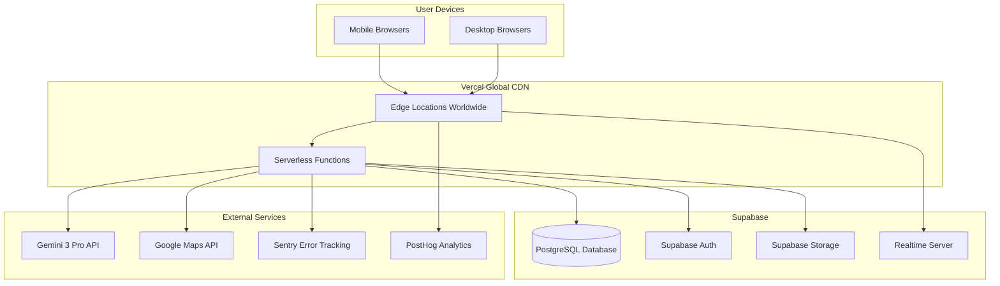
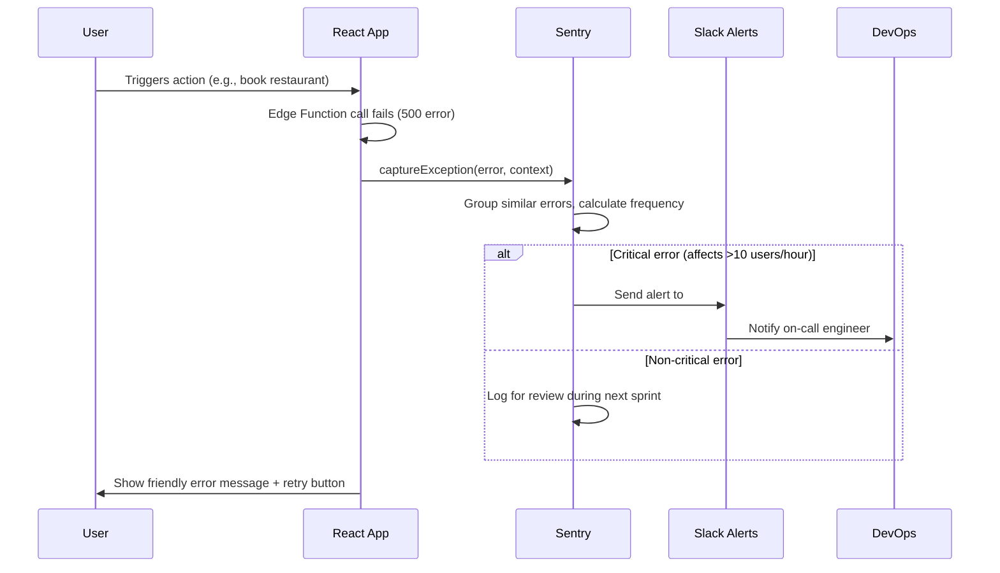

# 10 - Production Deployment & DevOps Implementation Plan

**Feature:** CI/CD Pipeline, Monitoring, Analytics, Error Tracking  
**Priority:** Critical (Phase 4 - Final week before launch)  
**Owner:** DevOps Team + Engineering  
**Stack:** Vercel, Supabase, Sentry, PostHog, GitHub Actions

---

## Progress Tracker

| Phase | Task | Status | Owner | Validation |
|-------|------|--------|-------|-----------|
| **CI/CD** | GitHub Actions pipeline | 🔴 Not Started | DevOps | Auto-deploys on merge |
| **Hosting** | Vercel production setup | 🔴 Not Started | DevOps | Edge functions live |
| **Monitoring** | Sentry error tracking | 🔴 Not Started | DevOps | Catches 100% errors |
| **Analytics** | PostHog event tracking | 🔴 Not Started | Product | Tracks user journeys |
| **Performance** | Lighthouse CI integration | 🔴 Not Started | DevOps | Blocks deploys under 90 |
| **Security** | Environment secrets | 🔴 Not Started | DevOps | No keys in code |

---

## 1. Product Goal

**Problem:** Manual deployments cause downtime, errors go undetected, no visibility into user behavior or performance issues.

**Solution:** Automated CI/CD pipeline, real-time error monitoring, user analytics, performance budgets, security best practices.

**Outcome:** Zero-downtime deployments, catch bugs before users report them, data-driven product decisions.

**Success Metric:** 99.9% uptime, error detection within 1 minute, deploy frequency 10+ times per week.

---

## 2. Deployment Architecture

### Production Environment

**Hosting:** Vercel (Frontend + Edge Functions)
- Global CDN: sub-100ms latency worldwide
- Automatic HTTPS with custom domain
- Edge runtime for Supabase Edge Functions
- Preview deployments for every pull request

**Backend:** Supabase (Database + Auth + Storage)
- Postgres database with automatic backups
- Row Level Security enforced
- Real-time WebSocket connections
- CDN for Storage assets

**Mermaid Diagram: Production Architecture**



---

## 3. CI/CD Pipeline with GitHub Actions

### Workflow File: `.github/workflows/deploy.yml`

**Triggers:**
- Push to `main` branch: deploy to production
- Pull request opened: deploy preview environment
- Manual trigger: via GitHub Actions UI

**Steps:**

**Step 1: Lint and Type Check**
- Run ESLint on all TypeScript files
- Run TypeScript compiler in strict mode
- Fail build if any errors found

**Step 2: Run Tests**
- Unit tests: Jest for utility functions
- Integration tests: Mock Gemini and Supabase APIs
- E2E tests: Playwright for critical user flows
- Minimum coverage: 80% for core features

**Step 3: Build Application**
- Run `npm run build` (Vite production build)
- Minify JavaScript and CSS
- Generate source maps (uploaded to Sentry)
- Optimize images and fonts

**Step 4: Performance Budget Check**
- Run Lighthouse CI on build
- Thresholds: Performance >90, Accessibility >95, Best Practices >90
- Fail build if any metric below threshold
- Post results as PR comment

**Step 5: Deploy to Vercel**
- Production: deploy to `localscout.app`
- Preview: deploy to unique URL (e.g., `pr-123.localscout.app`)
- Environment variables injected from Vercel secrets
- Edge Functions deployed automatically

**Step 6: Post-Deployment Checks**
- Health check: `/api/health` endpoint returns 200
- Smoke test: Visit homepage, verify load time <3 seconds
- Database migration check: Supabase schema version matches app
- Sentry release created with source maps

**Step 7: Notifications**
- Slack message: "Deployed v1.2.3 to production"
- Tag Git commit with version number
- Create GitHub release notes (auto-generated from commits)

---

## 4. Environment Variables Management

### Required Secrets (Vercel Environment Variables)

**Public (VITE_ prefix, safe to expose to client):**
- `VITE_SUPABASE_URL`: Supabase project URL
- `VITE_SUPABASE_ANON_KEY`: Supabase anonymous public key
- `VITE_POSTHOG_KEY`: PostHog public project key

**Private (Server-side only, Edge Functions):**
- `SUPABASE_SERVICE_ROLE_KEY`: Admin access to Supabase
- `GEMINI_API_KEY`: Google Gemini API key
- `GOOGLE_MAPS_API_KEY`: Google Maps server-side key
- `OPENTABLE_API_SECRET`: OpenTable webhook signature
- `SENTRY_AUTH_TOKEN`: Sentry API token for source maps

**Environments:**
- Development: `.env.local` (git-ignored)
- Preview: Vercel preview environment variables
- Production: Vercel production environment variables

**Security Best Practices:**
- Never commit API keys to Git
- Rotate secrets every 90 days
- Use different keys per environment
- Restrict API key permissions (Gemini: only required APIs enabled)

---

## 5. Error Tracking with Sentry

### Integration Setup

**Install Sentry SDK:**
```
npm install @sentry/react
```

**Initialize in main.tsx:**
- DSN from Sentry project settings
- Environment: production vs preview
- Release version from package.json
- Sample rate: 100% errors, 10% transactions (performance)

**Error Boundaries:**
- Wrap App component in Sentry ErrorBoundary
- Fallback UI: "Something went wrong" with retry button
- Automatically sends error to Sentry with component stack

**Custom Error Tracking:**

**Frontend Errors:**
- Network failures: API timeouts, 500 errors
- Rendering errors: undefined props, null references
- User actions: failed bookings, payment errors

**Backend Errors (Edge Functions):**
- Gemini API failures
- Supabase query errors
- Third-party API timeouts (Google Maps, OpenTable)

**Mermaid Diagram: Error Tracking Flow**



**Alert Rules:**
- Critical: errors affecting >10 users per hour
- High: new error type never seen before
- Medium: error rate increase >50% from baseline
- Notifications: Slack (#alerts channel) and email (on-call engineer)

---

## 6. Analytics with PostHog

### Event Tracking Strategy

**Core Events:**

**User Authentication:**
- `user_signed_up`: new account created
- `user_logged_in`: successful login
- `user_logged_out`: logout action

**Trip Planning:**
- `trip_created`: new trip initialized
- `itinerary_item_added`: activity/dining/transport added
- `itinerary_optimized`: user ran optimization
- `budget_set`: user defined trip budget

**AI Interactions:**
- `ai_message_sent`: user sent chat message
- `ai_recommendation_clicked`: user interacted with AI suggestion
- `intent_detected`: intent classification result (dining, budget, etc.)

**Bookings:**
- `booking_initiated`: user clicked "Book" button
- `booking_confirmed`: booking successful
- `booking_failed`: booking error occurred

**Revenue Events:**
- `premium_viewed`: user viewed upgrade page
- `premium_purchased`: subscription payment successful

**Property Tracking:**
```
Event: itinerary_item_added
Properties:
- item_type: "restaurant" | "activity" | "transport"
- source: "ai_suggestion" | "manual_search" | "imported"
- trip_duration_days: 5
- user_budget_level: "mid_range"
- device_type: "mobile" | "desktop"
```

**User Funnel Analysis:**
1. Signed up
2. Created first trip
3. Added 3+ itinerary items
4. Optimized itinerary
5. Booked at least 1 reservation
6. Completed trip

**Goal:** 40% funnel completion rate (sign up to first booking)

---

## 7. Performance Monitoring

### Lighthouse CI Integration

**GitHub Action Step:**
```
- name: Run Lighthouse CI
  uses: treosh/lighthouse-ci-action@v9
  with:
    urls: |
      https://preview-url.vercel.app
      https://preview-url.vercel.app/dashboard
      https://preview-url.vercel.app/trip/sample-id
    budgetPath: ./lighthouse-budget.json
    uploadArtifacts: true
```

**Budget File (lighthouse-budget.json):**
```
{
  "performance": 90,
  "accessibility": 95,
  "best-practices": 90,
  "seo": 90,
  "first-contentful-paint": 1500,
  "largest-contentful-paint": 2500,
  "cumulative-layout-shift": 0.1,
  "total-blocking-time": 200
}
```

**Fail Deployment If:**
- Performance score <90
- Accessibility score <95
- LCP >2.5 seconds
- CLS >0.1

**Web Vitals Tracking (PostHog):**
- Track real user metrics (RUM)
- Send LCP, FID, CLS to PostHog
- Segment by: device type, network speed, geographic region

---

## 8. Database Migrations

### Supabase Migration Strategy

**Development Workflow:**
1. Make schema changes in local Supabase (Docker)
2. Generate migration file: `supabase db diff -f migration_name`
3. Test migration locally: `supabase db reset` (drops and recreates)
4. Commit migration file to Git
5. CI/CD applies migration to preview environment
6. Manual review before production deployment

**Production Deployment:**
- Migrations run automatically on Supabase dashboard
- Zero-downtime migrations: additive changes only (no column drops)
- Backups created before each migration
- Rollback plan: manual SQL script to undo changes

**Migration Checklist:**
- [ ] Migration tested locally
- [ ] No breaking changes (backward compatible)
- [ ] RLS policies updated for new tables
- [ ] Indexes added for new query patterns
- [ ] Backup created before deployment

---

## 9. Monitoring Dashboards

### Vercel Analytics

**Metrics:**
- Requests per second
- Edge Function execution time
- Error rate (4xx, 5xx)
- Geographic distribution of traffic

**Alerts:**
- Error rate >1% for 5 minutes
- Edge Function timeout >30 seconds
- Bandwidth spike (DDoS protection)

### Supabase Dashboard

**Metrics:**
- Database CPU usage
- Connection pool saturation
- Query performance (slow queries >1 second)
- Storage usage

**Alerts:**
- Database CPU >80% for 10 minutes
- Connection pool >90% full
- Storage >80% of quota

### PostHog Dashboards

**Dashboard 1: User Engagement**
- Daily active users (DAU)
- Weekly active users (WAU)
- Average session duration
- Feature adoption rate (% users using each AI agent)

**Dashboard 2: Conversion Funnel**
- Sign up → First trip → First booking
- Drop-off points identification
- A/B test results (e.g., onboarding flow variants)

**Dashboard 3: Performance**
- Page load times by route
- API response times
- Error rates by feature
- Device and browser breakdown

---

## 10. Security Hardening

### Checklist

**API Security:**
- [ ] All Edge Functions validate JWT tokens
- [ ] Rate limiting: 100 requests/minute per user
- [ ] CORS configured (allow only production domain)
- [ ] Webhook signatures verified (OpenTable, Stripe)

**Database Security:**
- [ ] RLS policies tested (users can't access others' data)
- [ ] Service role key used only in Edge Functions (never client)
- [ ] Database connection string encrypted
- [ ] Automated backups daily (7-day retention)

**Client Security:**
- [ ] Content Security Policy (CSP) headers configured
- [ ] No inline scripts (XSS protection)
- [ ] Dependencies scanned for vulnerabilities (npm audit)
- [ ] Secrets never committed to Git (pre-commit hook checks)

**Infrastructure:**
- [ ] HTTPS enforced (redirect HTTP to HTTPS)
- [ ] DDoS protection via Vercel
- [ ] Firewall rules: Supabase accessible only from Vercel IPs
- [ ] Security headers: X-Frame-Options, X-Content-Type-Options

---

## 11. Rollback Plan

### Incident Response

**Scenario: Production deployment causes critical bug**

**Step 1: Immediate Response (within 5 minutes)**
- Revert deployment in Vercel (one-click rollback to previous version)
- Notify team via Slack #incidents channel
- Post status update: "Investigating issue, rolled back to stable version"

**Step 2: Root Cause Analysis (within 1 hour)**
- Review Sentry errors from failed deployment
- Check Lighthouse CI results (did performance degrade?)
- Identify commit that introduced bug

**Step 3: Fix and Redeploy (within 4 hours)**
- Create hotfix branch from stable commit
- Fix bug, add regression test
- Deploy hotfix to preview environment, verify fix
- Deploy to production, monitor for 30 minutes

**Step 4: Post-Mortem (within 24 hours)**
- Document incident timeline
- Identify failure points in CI/CD (why didn't tests catch this?)
- Implement prevention measures (add test case, improve monitoring)

---

## 12. Launch Checklist

**Pre-Launch (1 week before):**
- [ ] Load testing: simulate 1000 concurrent users
- [ ] Security audit: penetration testing by third party
- [ ] Legal review: privacy policy, terms of service
- [ ] Customer support: train team on common issues

**Launch Day:**
- [ ] Deploy to production during low-traffic hours (2 AM PST)
- [ ] Monitor dashboards every 15 minutes for first 4 hours
- [ ] On-call engineer standby for critical issues
- [ ] Soft launch: 10% traffic via feature flag, gradually increase

**Post-Launch (1 week after):**
- [ ] Analyze PostHog funnel data: where are users dropping off?
- [ ] Review Sentry errors: any new error types?
- [ ] Check performance: Web Vitals still above thresholds?
- [ ] Gather user feedback: surveys, support tickets

---

## 13. Success Criteria

**MVP Launch:**
- 99.5% uptime in first month
- Error rate <0.5% of total requests
- Performance: Lighthouse score >90 on all pages
- Deploy frequency: 5+ times per week (rapid iteration)

**Production Scale:**
- 99.9% uptime (8.76 hours downtime per year max)
- Mean time to recovery (MTTR) <30 minutes
- Zero customer data breaches
- Support response time <2 hours

---

**Reference Docs:**
- See all feature docs (01-09) for deployment-specific considerations
- See Doc 04 (Backend) for Supabase migration patterns

**Document Owner:** DevOps Team + Engineering  
**Dependencies:** Vercel account, Supabase production project, Sentry account, PostHog account, GitHub Actions enabled
