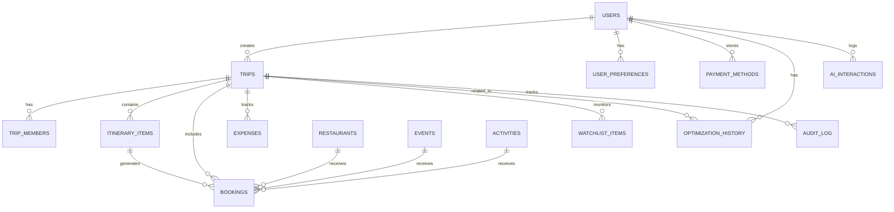

# Database Schema & Data Architecture
## Production-Ready Data Model

**Status:** Critical Blocker - Required Before Development  
**Last Updated:** December 18, 2025  
**Database:** PostgreSQL (via Supabase)

---

## Schema Overview



---

## Core Tables

### **users**
```sql
CREATE TABLE users (
  id UUID PRIMARY KEY DEFAULT uuid_generate_v4(),
  email VARCHAR(255) UNIQUE NOT NULL,
  full_name VARCHAR(255),
  phone VARCHAR(50),
  avatar_url TEXT,
  
  -- Authentication (handled by Supabase Auth)
  auth_provider VARCHAR(50), -- 'email', 'google', 'facebook', 'apple'
  
  -- Preferences
  preferred_currency VARCHAR(3) DEFAULT 'USD',
  preferred_language VARCHAR(5) DEFAULT 'en',
  timezone VARCHAR(50) DEFAULT 'UTC',
  
  -- Subscription
  subscription_tier VARCHAR(20) DEFAULT 'free', -- 'free', 'scout', 'concierge'
  subscription_status VARCHAR(20) DEFAULT 'active',
  subscription_expires_at TIMESTAMP,
  
  -- Metadata
  created_at TIMESTAMP DEFAULT NOW(),
  updated_at TIMESTAMP DEFAULT NOW(),
  last_login_at TIMESTAMP,
  
  -- Soft delete
  deleted_at TIMESTAMP
);

CREATE INDEX idx_users_email ON users(email);
CREATE INDEX idx_users_subscription ON users(subscription_tier, subscription_status);
```

### **user_preferences**
```sql
CREATE TABLE user_preferences (
  id UUID PRIMARY KEY DEFAULT uuid_generate_v4(),
  user_id UUID REFERENCES users(id) ON DELETE CASCADE,
  
  -- Dietary
  dietary_restrictions TEXT[], -- ['vegetarian', 'gluten_free', 'halal', etc.]
  favorite_cuisines TEXT[], -- ['italian', 'seafood', 'colombian']
  
  -- Travel Style
  travel_pace VARCHAR(20), -- 'relaxed', 'moderate', 'packed'
  accommodation_preference VARCHAR(20), -- 'budget', 'mid_range', 'luxury'
  activity_energy_level VARCHAR(20), -- 'low', 'medium', 'high'
  
  -- Interests (for ML ranking)
  interest_vector VECTOR(128), -- Embedding for semantic matching
  
  -- Preferences learned from behavior
  preferred_dining_time TIME, -- e.g., 7:30 PM
  preferred_activity_time VARCHAR(20), -- 'morning', 'afternoon', 'evening'
  budget_consciousness DECIMAL(3,2), -- 0.0-1.0 (0=very budget, 1=luxury)
  
  -- AI Settings
  auto_optimize_enabled BOOLEAN DEFAULT false,
  auto_book_enabled BOOLEAN DEFAULT false,
  
  created_at TIMESTAMP DEFAULT NOW(),
  updated_at TIMESTAMP DEFAULT NOW()
);

CREATE INDEX idx_user_prefs_user ON user_preferences(user_id);
```

---

## Trip Management

### **trips**
```sql
CREATE TABLE trips (
  id UUID PRIMARY KEY DEFAULT uuid_generate_v4(),
  creator_id UUID REFERENCES users(id) ON DELETE CASCADE,
  
  -- Basic Info
  title VARCHAR(255) NOT NULL,
  destination_city VARCHAR(100) NOT NULL,
  destination_country VARCHAR(100),
  start_date DATE NOT NULL,
  end_date DATE NOT NULL,
  
  -- Budget
  total_budget DECIMAL(10,2),
  currency VARCHAR(3) DEFAULT 'USD',
  budget_breakdown JSONB, -- {dining: 300, activities: 400, ...}
  
  -- Status
  status VARCHAR(20) DEFAULT 'planning', -- 'planning', 'confirmed', 'in_progress', 'completed', 'cancelled'
  
  -- Settings
  optimization_preferences JSONB, -- User constraints for optimizer
  notification_settings JSONB,
  
  -- Metadata
  created_at TIMESTAMP DEFAULT NOW(),
  updated_at TIMESTAMP DEFAULT NOW(),
  deleted_at TIMESTAMP
);

CREATE INDEX idx_trips_creator ON trips(creator_id);
CREATE INDEX idx_trips_dates ON trips(start_date, end_date);
CREATE INDEX idx_trips_destination ON trips(destination_city);
```

### **trip_members**
```sql
CREATE TABLE trip_members (
  id UUID PRIMARY KEY DEFAULT uuid_generate_v4(),
  trip_id UUID REFERENCES trips(id) ON DELETE CASCADE,
  user_id UUID REFERENCES users(id) ON DELETE CASCADE,
  
  role VARCHAR(20) DEFAULT 'member', -- 'organizer', 'co_organizer', 'member', 'viewer'
  
  -- Member Budget
  individual_budget DECIMAL(10,2),
  
  joined_at TIMESTAMP DEFAULT NOW(),
  
  UNIQUE(trip_id, user_id)
);

CREATE INDEX idx_trip_members_trip ON trip_members(trip_id);
CREATE INDEX idx_trip_members_user ON trip_members(user_id);
```

---

## Itinerary & Timeline

### **itinerary_items**
```sql
CREATE TABLE itinerary_items (
  id UUID PRIMARY KEY DEFAULT uuid_generate_v4(),
  trip_id UUID REFERENCES trips(id) ON DELETE CASCADE,
  
  -- Item Details
  type VARCHAR(50) NOT NULL, -- 'dining', 'activity', 'event', 'accommodation', 'transport', 'buffer'
  title VARCHAR(255) NOT NULL,
  description TEXT,
  
  -- Reference to specific entity
  restaurant_id UUID REFERENCES restaurants(id),
  event_id UUID REFERENCES events(id),
  activity_id UUID REFERENCES activities(id),
  
  -- Timing
  day_number INT NOT NULL, -- Day 1, 2, 3, etc.
  start_time TIME,
  end_time TIME,
  duration_minutes INT,
  
  -- Location
  location_name VARCHAR(255),
  address TEXT,
  latitude DECIMAL(10,8),
  longitude DECIMAL(11,8),
  
  -- Cost
  estimated_cost DECIMAL(10,2),
  actual_cost DECIMAL(10,2),
  
  -- Status
  status VARCHAR(20) DEFAULT 'planned', -- 'planned', 'booked', 'confirmed', 'completed', 'cancelled'
  priority VARCHAR(20) DEFAULT 'normal', -- 'must_have', 'high', 'normal', 'optional'
  locked BOOLEAN DEFAULT false, -- If true, optimizer won't move it
  
  -- Metadata
  created_at TIMESTAMP DEFAULT NOW(),
  updated_at TIMESTAMP DEFAULT NOW(),
  order_index INT -- For manual sorting
);

CREATE INDEX idx_itinerary_trip ON itinerary_items(trip_id);
CREATE INDEX idx_itinerary_day ON itinerary_items(trip_id, day_number);
CREATE INDEX idx_itinerary_time ON itinerary_items(trip_id, day_number, start_time);
CREATE INDEX idx_itinerary_type ON itinerary_items(type);
```

---

## Bookings & Reservations

### **bookings**
```sql
CREATE TABLE bookings (
  id UUID PRIMARY KEY DEFAULT uuid_generate_v4(),
  trip_id UUID REFERENCES trips(id) ON DELETE CASCADE,
  itinerary_item_id UUID REFERENCES itinerary_items(id),
  user_id UUID REFERENCES users(id) ON DELETE SET NULL,
  
  -- Booking Details
  type VARCHAR(50) NOT NULL, -- 'dining', 'event', 'activity', 'accommodation'
  confirmation_number VARCHAR(100),
  
  -- Venue/Provider
  venue_name VARCHAR(255) NOT NULL,
  venue_contact JSONB, -- {phone, email, website}
  
  -- Timing
  booking_date DATE NOT NULL,
  booking_time TIME,
  party_size INT DEFAULT 1,
  
  -- Cost
  total_cost DECIMAL(10,2),
  deposit_paid DECIMAL(10,2),
  currency VARCHAR(3) DEFAULT 'USD',
  
  -- Payment
  payment_status VARCHAR(20) DEFAULT 'pending', -- 'pending', 'authorized', 'paid', 'refunded', 'failed'
  payment_intent_id VARCHAR(255), -- Stripe payment intent
  
  -- Cancellation
  cancellation_policy TEXT,
  cancellable_until TIMESTAMP,
  cancellation_fee DECIMAL(10,2),
  
  -- Status
  booking_status VARCHAR(20) DEFAULT 'pending', -- 'pending', 'confirmed', 'completed', 'cancelled', 'no_show'
  
  -- Auto-Booking
  auto_booked BOOLEAN DEFAULT false,
  auto_book_trigger VARCHAR(50), -- 'price_drop', 'availability_low', 'user_approved'
  
  -- Notes
  special_requests TEXT,
  confirmation_sent_at TIMESTAMP,
  reminder_sent_at TIMESTAMP,
  
  created_at TIMESTAMP DEFAULT NOW(),
  updated_at TIMESTAMP DEFAULT NOW()
);

CREATE INDEX idx_bookings_trip ON bookings(trip_id);
CREATE INDEX idx_bookings_user ON bookings(user_id);
CREATE INDEX idx_bookings_date ON bookings(booking_date);
CREATE INDEX idx_bookings_status ON bookings(booking_status);
CREATE INDEX idx_bookings_confirmation ON bookings(confirmation_number);
```

### **watchlist_items**
```sql
CREATE TABLE watchlist_items (
  id UUID PRIMARY KEY DEFAULT uuid_generate_v4(),
  trip_id UUID REFERENCES trips(id) ON DELETE CASCADE,
  user_id UUID REFERENCES users(id) ON DELETE CASCADE,
  
  -- Item Being Watched
  type VARCHAR(50) NOT NULL, -- 'restaurant', 'event', 'hotel', 'activity'
  item_id UUID, -- Reference to specific item in respective table
  item_name VARCHAR(255) NOT NULL,
  
  -- Monitoring Settings
  target_price DECIMAL(10,2),
  current_price DECIMAL(10,2),
  price_history JSONB, -- [{date, price}, ...]
  
  -- Availability
  desired_date DATE,
  desired_time TIME,
  party_size INT,
  availability_status VARCHAR(20), -- 'available', 'limited', 'sold_out'
  
  -- Auto-Booking
  auto_book_enabled BOOLEAN DEFAULT false,
  auto_book_conditions JSONB, -- {max_price, require_refundable, etc.}
  
  -- Alerts
  alert_on_price_drop BOOLEAN DEFAULT true,
  alert_on_availability BOOLEAN DEFAULT true,
  last_alert_sent_at TIMESTAMP,
  
  -- Status
  status VARCHAR(20) DEFAULT 'active', -- 'active', 'booked', 'expired', 'removed'
  
  created_at TIMESTAMP DEFAULT NOW(),
  updated_at TIMESTAMP DEFAULT NOW()
);

CREATE INDEX idx_watchlist_trip ON watchlist_items(trip_id);
CREATE INDEX idx_watchlist_user ON watchlist_items(user_id);
CREATE INDEX idx_watchlist_status ON watchlist_items(status);
CREATE INDEX idx_watchlist_auto_book ON watchlist_items(auto_book_enabled);
```

---

## Venues & Entities

### **restaurants**
```sql
CREATE TABLE restaurants (
  id UUID PRIMARY KEY DEFAULT uuid_generate_v4(),
  
  -- Basic Info
  name VARCHAR(255) NOT NULL,
  cuisine_type VARCHAR(100),
  category VARCHAR(50), -- 'fine_dining', 'casual', 'quick_bite', etc.
  
  -- Location
  city VARCHAR(100) NOT NULL,
  neighborhood VARCHAR(100),
  address TEXT,
  latitude DECIMAL(10,8),
  longitude DECIMAL(11,8),
  
  -- Contact
  phone VARCHAR(50),
  email VARCHAR(255),
  website TEXT,
  booking_url TEXT,
  
  -- Details
  price_range VARCHAR(5), -- '$', '$$', '$$$', '$$$$'
  average_meal_cost DECIMAL(10,2),
  
  -- Ratings
  rating DECIMAL(3,2), -- 0.00-5.00
  review_count INT DEFAULT 0,
  local_clientele_percentage INT, -- 0-100 (for "local gem" scoring)
  
  -- Features
  dietary_options TEXT[], -- ['vegetarian', 'gluten_free', 'vegan']
  ambiance TEXT[], -- ['romantic', 'casual', 'upscale', 'family_friendly']
  features TEXT[], -- ['outdoor_seating', 'rooftop', 'live_music', 'view']
  
  -- Hours
  hours_of_operation JSONB, -- {monday: {open: '12:00', close: '22:00'}, ...}
  
  -- Menu
  menu_url TEXT,
  popular_dishes TEXT[],
  
  -- AI Metadata
  description_embedding VECTOR(128), -- For semantic search
  
  -- Photos
  photos JSONB, -- [{url, caption, credit}, ...]
  
  -- Status
  active BOOLEAN DEFAULT true,
  verified BOOLEAN DEFAULT false,
  
  created_at TIMESTAMP DEFAULT NOW(),
  updated_at TIMESTAMP DEFAULT NOW()
);

CREATE INDEX idx_restaurants_city ON restaurants(city);
CREATE INDEX idx_restaurants_neighborhood ON restaurants(neighborhood);
CREATE INDEX idx_restaurants_cuisine ON restaurants(cuisine_type);
CREATE INDEX idx_restaurants_price ON restaurants(price_range);
CREATE INDEX idx_restaurants_rating ON restaurants(rating);
CREATE INDEX idx_restaurants_location ON restaurants USING GIST (
  ll_to_earth(latitude, longitude)
);
```

### **events**
```sql
CREATE TABLE events (
  id UUID PRIMARY KEY DEFAULT uuid_generate_v4(),
  
  -- Basic Info
  name VARCHAR(255) NOT NULL,
  category VARCHAR(50), -- 'sports', 'concert', 'festival', 'theater', 'nightlife'
  subcategory VARCHAR(50), -- 'football', 'reggaeton', 'food_festival', etc.
  
  -- Timing
  event_date DATE NOT NULL,
  start_time TIME,
  end_time TIME,
  duration_minutes INT,
  
  -- Location
  venue_name VARCHAR(255),
  city VARCHAR(100) NOT NULL,
  address TEXT,
  latitude DECIMAL(10,8),
  longitude DECIMAL(11,8),
  
  -- Ticketing
  price_min DECIMAL(10,2),
  price_max DECIMAL(10,2),
  currency VARCHAR(3) DEFAULT 'USD',
  ticket_url TEXT,
  
  -- Capacity
  total_capacity INT,
  tickets_sold INT DEFAULT 0,
  tickets_remaining INT,
  
  -- Details
  description TEXT,
  performers TEXT[], -- ['Karol G', 'J Balvin']
  tags TEXT[], -- ['outdoor', 'family_friendly', 'vip_available']
  
  -- Popularity
  attendance_estimate INT,
  local_popularity_score DECIMAL(3,2), -- 0-10
  
  -- Urgency
  selling_velocity INT, -- Tickets sold per hour
  sellout_predicted_at TIMESTAMP,
  
  -- Media
  poster_url TEXT,
  photos JSONB,
  
  -- Status
  status VARCHAR(20) DEFAULT 'on_sale', -- 'announced', 'on_sale', 'selling_fast', 'sold_out', 'cancelled'
  
  created_at TIMESTAMP DEFAULT NOW(),
  updated_at TIMESTAMP DEFAULT NOW()
);

CREATE INDEX idx_events_city ON events(city);
CREATE INDEX idx_events_date ON events(event_date);
CREATE INDEX idx_events_category ON events(category);
CREATE INDEX idx_events_status ON events(status);
```

### **activities**
```sql
CREATE TABLE activities (
  id UUID PRIMARY KEY DEFAULT uuid_generate_v4(),
  
  -- Basic Info
  name VARCHAR(255) NOT NULL,
  type VARCHAR(50), -- 'tour', 'museum', 'outdoor', 'workshop', etc.
  
  -- Location
  city VARCHAR(100) NOT NULL,
  neighborhood VARCHAR(100),
  address TEXT,
  latitude DECIMAL(10,8),
  longitude DECIMAL(11,8),
  
  -- Pricing
  price DECIMAL(10,2),
  price_type VARCHAR(20), -- 'per_person', 'per_group', 'free'
  currency VARCHAR(3) DEFAULT 'USD',
  
  -- Timing
  duration_minutes INT,
  available_days TEXT[], -- ['monday', 'tuesday', ...]
  available_times TEXT[], -- ['09:00', '14:00', '16:00']
  
  -- Details
  description TEXT,
  difficulty_level VARCHAR(20), -- 'easy', 'moderate', 'hard'
  energy_level VARCHAR(20), -- 'low', 'medium', 'high'
  suitable_for TEXT[], -- ['kids', 'couples', 'solo', 'groups']
  
  -- Features
  features TEXT[], -- ['guided_tour', 'pickup_included', 'lunch_included']
  
  -- Ratings
  rating DECIMAL(3,2),
  review_count INT DEFAULT 0,
  
  -- Booking
  booking_url TEXT,
  requires_advance_booking BOOLEAN DEFAULT false,
  min_advance_booking_hours INT,
  
  -- Media
  photos JSONB,
  
  active BOOLEAN DEFAULT true,
  created_at TIMESTAMP DEFAULT NOW(),
  updated_at TIMESTAMP DEFAULT NOW()
);

CREATE INDEX idx_activities_city ON activities(city);
CREATE INDEX idx_activities_type ON activities(type);
```

---

## Budget & Expenses

### **expenses**
```sql
CREATE TABLE expenses (
  id UUID PRIMARY KEY DEFAULT uuid_generate_v4(),
  trip_id UUID REFERENCES trips(id) ON DELETE CASCADE,
  user_id UUID REFERENCES users(id),
  booking_id UUID REFERENCES bookings(id),
  
  -- Expense Details
  category VARCHAR(50) NOT NULL, -- 'dining', 'activities', 'transport', 'lodging', 'shopping'
  merchant_name VARCHAR(255),
  description TEXT,
  
  -- Amount
  amount DECIMAL(10,2) NOT NULL,
  currency VARCHAR(3) DEFAULT 'USD',
  amount_usd DECIMAL(10,2), -- Converted amount for consistent reporting
  
  -- Timing
  expense_date DATE NOT NULL,
  expense_time TIME,
  
  -- Payment
  payment_method VARCHAR(50), -- 'credit_card', 'cash', 'split'
  
  -- Receipt
  receipt_url TEXT,
  receipt_ocr_data JSONB, -- Extracted text from receipt scan
  
  -- Categorization
  auto_categorized BOOLEAN DEFAULT false,
  category_confidence DECIMAL(3,2), -- AI confidence in category
  
  -- Group Expense
  is_group_expense BOOLEAN DEFAULT false,
  split_between INT DEFAULT 1,
  amount_per_person DECIMAL(10,2),
  
  created_at TIMESTAMP DEFAULT NOW(),
  updated_at TIMESTAMP DEFAULT NOW()
);

CREATE INDEX idx_expenses_trip ON expenses(trip_id);
CREATE INDEX idx_expenses_user ON expenses(user_id);
CREATE INDEX idx_expenses_date ON expenses(expense_date);
CREATE INDEX idx_expenses_category ON expenses(category);
```

---

## AI & Optimization

### **optimization_history**
```sql
CREATE TABLE optimization_history (
  id UUID PRIMARY KEY DEFAULT uuid_generate_v4(),
  trip_id UUID REFERENCES trips(id) ON DELETE CASCADE,
  user_id UUID REFERENCES users(id),
  
  -- Optimization Run
  run_date TIMESTAMP DEFAULT NOW(),
  trigger VARCHAR(50), -- 'manual', 'auto', 'itinerary_change'
  
  -- Before State
  before_itinerary JSONB, -- Snapshot of itinerary before optimization
  
  -- Optimization Results
  problems_detected JSONB, -- [{type, severity, description}, ...]
  solutions_generated JSONB, -- [{option_a, option_b, option_c}, ...]
  
  -- User Choice
  selected_option VARCHAR(10), -- 'option_a', 'option_b', 'option_c', 'rejected'
  rejection_reason TEXT,
  
  -- After State
  after_itinerary JSONB, -- Snapshot after applying optimization
  
  -- Metrics
  time_saved_minutes INT,
  travel_distance_reduced_km DECIMAL(6,2),
  budget_impact DECIMAL(10,2),
  
  -- ML Feedback
  user_satisfaction_rating INT, -- 1-5 stars (collected later)
  
  created_at TIMESTAMP DEFAULT NOW()
);

CREATE INDEX idx_optimization_trip ON optimization_history(trip_id);
CREATE INDEX idx_optimization_user ON optimization_history(user_id);
```

### **ai_interactions**
```sql
CREATE TABLE ai_interactions (
  id UUID PRIMARY KEY DEFAULT uuid_generate_v4(),
  user_id UUID REFERENCES users(id),
  trip_id UUID REFERENCES trips(id),
  
  -- Interaction Type
  agent VARCHAR(50) NOT NULL, -- 'dining', 'optimizer', 'booking', 'events', 'insider', 'budget'
  action VARCHAR(50) NOT NULL, -- 'search', 'recommendation', 'optimization', 'auto_book'
  
  -- Request
  user_query TEXT,
  context JSONB, -- {location, budget, preferences, etc.}
  
  -- Response
  ai_response JSONB, -- {top_picks, reasoning, confidence, etc.}
  gemini_model VARCHAR(50), -- 'gemini-flash', 'gemini-pro'
  response_time_ms INT,
  
  -- User Reaction
  selected_result INT, -- Which result user picked (1-3 for top picks)
  user_accepted BOOLEAN, -- Did user act on recommendation?
  
  -- Tokens & Cost
  tokens_used INT,
  estimated_cost_usd DECIMAL(6,4),
  
  created_at TIMESTAMP DEFAULT NOW()
);

CREATE INDEX idx_ai_interactions_user ON ai_interactions(user_id);
CREATE INDEX idx_ai_interactions_agent ON ai_interactions(agent);
CREATE INDEX idx_ai_interactions_date ON ai_interactions(created_at);
```

### **audit_log**
```sql
CREATE TABLE audit_log (
  id UUID PRIMARY KEY DEFAULT uuid_generate_v4(),
  
  -- Who
  user_id UUID REFERENCES users(id),
  agent VARCHAR(50), -- 'system', 'dining_agent', 'booking_agent', etc.
  
  -- What
  action VARCHAR(100) NOT NULL,
  entity_type VARCHAR(50), -- 'booking', 'itinerary', 'trip', etc.
  entity_id UUID,
  
  -- Details
  description TEXT,
  before_state JSONB,
  after_state JSONB,
  
  -- Auto-Action
  automated BOOLEAN DEFAULT false,
  auto_action_type VARCHAR(50), -- 'auto_book', 'auto_optimize', 'price_alert'
  
  -- Context
  trip_id UUID REFERENCES trips(id),
  ip_address INET,
  user_agent TEXT,
  
  created_at TIMESTAMP DEFAULT NOW()
);

CREATE INDEX idx_audit_user ON audit_log(user_id);
CREATE INDEX idx_audit_trip ON audit_log(trip_id);
CREATE INDEX idx_audit_action ON audit_log(action);
CREATE INDEX idx_audit_date ON audit_log(created_at);
```

---

## Payment & Billing

### **payment_methods**
```sql
CREATE TABLE payment_methods (
  id UUID PRIMARY KEY DEFAULT uuid_generate_v4(),
  user_id UUID REFERENCES users(id) ON DELETE CASCADE,
  
  -- Stripe Integration
  stripe_payment_method_id VARCHAR(255) UNIQUE,
  
  -- Card Details (tokenized)
  card_brand VARCHAR(50), -- 'visa', 'mastercard', 'amex'
  card_last4 VARCHAR(4),
  card_exp_month INT,
  card_exp_year INT,
  
  -- Billing Address
  billing_address JSONB,
  
  -- Status
  is_default BOOLEAN DEFAULT false,
  active BOOLEAN DEFAULT true,
  
  created_at TIMESTAMP DEFAULT NOW(),
  updated_at TIMESTAMP DEFAULT NOW()
);

CREATE INDEX idx_payment_user ON payment_methods(user_id);
```

---

## Data Seeding Requirements

**For MVP Launch:**
- **Restaurants:** 500+ for Medellin (scraped from Google Places, TripAdvisor)
- **Events:** Sync daily from Eventbrite, Facebook Events, local venues
- **Activities:** 100+ tours, museums, outdoor activities (partnerships)
- **Sample Trips:** 10 template trips for onboarding inspiration

**Seed Data Sources:**
1. Google Places API (restaurants, activities)
2. Eventbrite API (events)
3. OpenWeatherMap (weather data cache)
4. Manual curation for "local gems" (partnership with local influencers)

---

## Performance Optimization

**Indexes Created:**
- ✅ Primary keys on all tables
- ✅ Foreign keys for joins
- ✅ Date/time columns for time-range queries
- ✅ Geospatial index for location searches
- ✅ Status columns for filtering

**Additional Optimizations:**
- Partitioning `ai_interactions` by date (monthly partitions)
- Materialized view for user profile embeddings (refresh daily)
- Redis cache for frequently accessed restaurant data (15-min TTL)
- Full-text search index on restaurant/event descriptions

---

**End of Database Schema**  
**Status:** ✅ Complete and Production-Ready  
**Next Step:** Implement schema in Supabase, run migrations, seed test data
