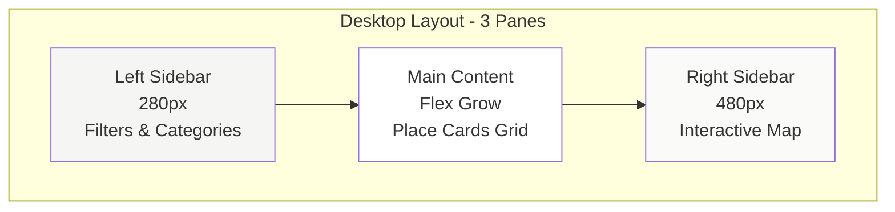
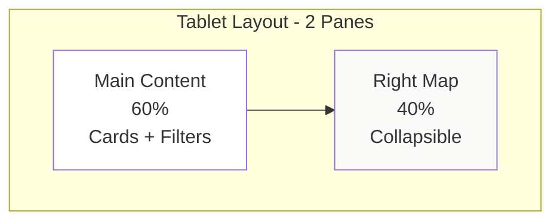
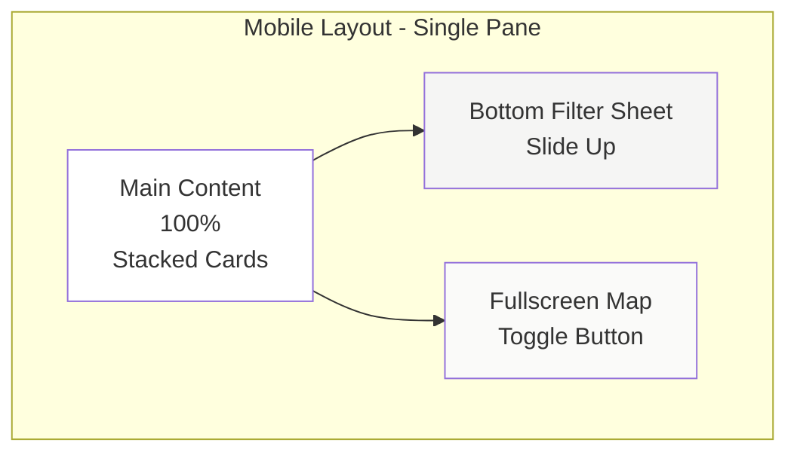
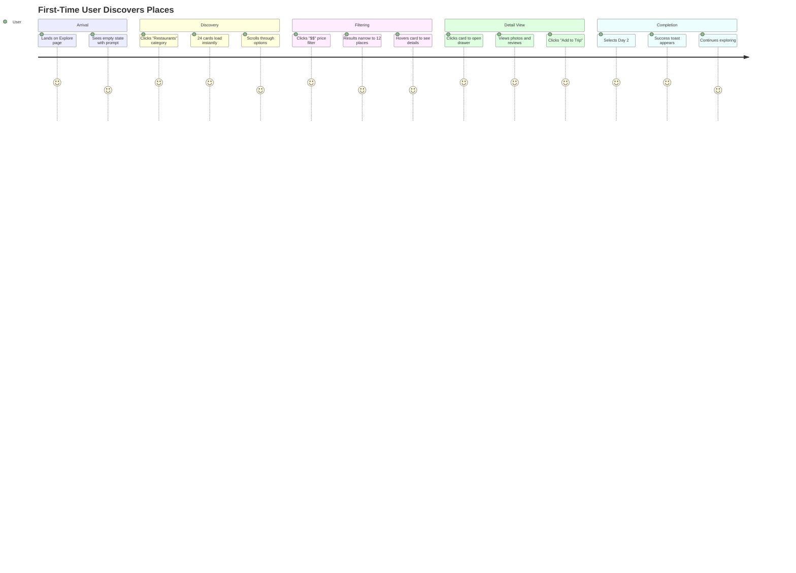
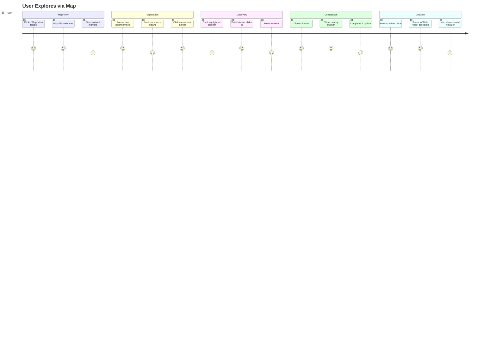
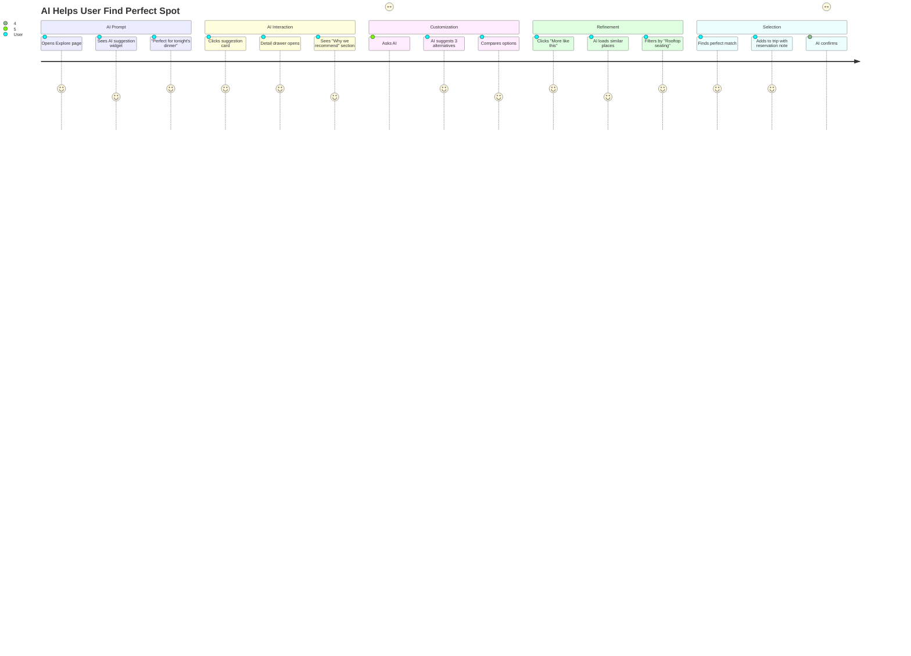
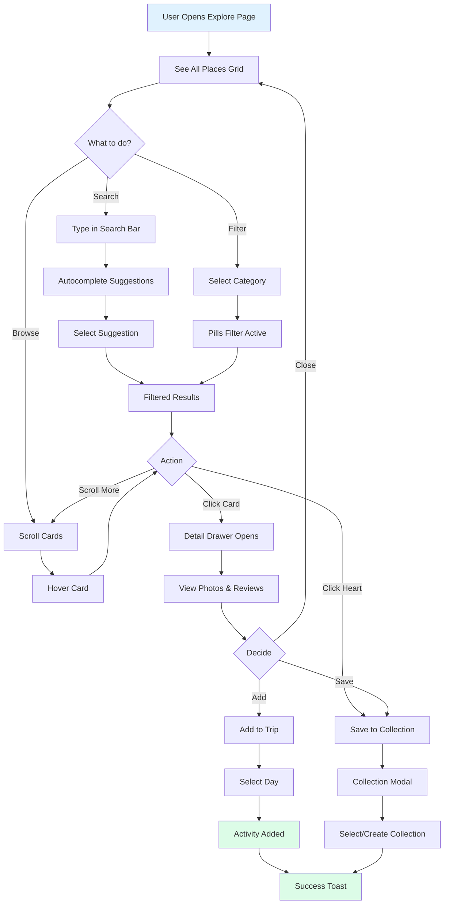
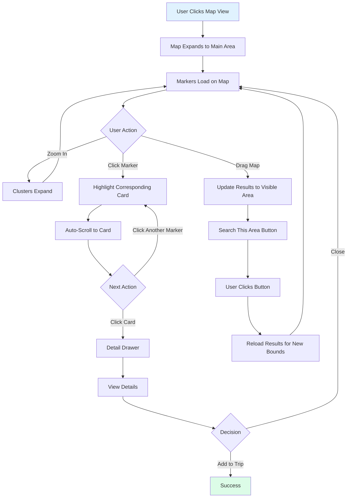

# 🗺️ EXPLORE DASHBOARD - COMPLETE DESIGN DOCUMENTATION
## Discovery & Map Interface

**Document:** Explore Dashboard Design Specification  
**Status:** 🔴 Not Started (0%)  
**Page:** `/explore`  
**Last Updated:** December 22, 2024

---

## 📑 TABLE OF CONTENTS

1. [Overview](#overview)
2. [Progress Tracker](#progress-tracker)
3. [3-Pane Layout Architecture](#3-pane-layout-architecture)
4. [Feature Breakdown](#feature-breakdown)
5. [User Journeys](#user-journeys)
6. [Workflows](#workflows)
7. [Implementation Plan](#implementation-plan)

---

## 🎯 OVERVIEW

### **Purpose**
The Explore Dashboard is the primary discovery interface where users browse and discover places through a dual-mode experience: **content feed** with rich cards and **interactive map** with location markers.

### **Core Experience**
Users can explore restaurants, activities, stays, and experiences through smart filtering, AI-powered suggestions, and geographic visualization. The interface seamlessly blends list-based browsing with map-based discovery.

### **Key Capabilities**
- Location-based place discovery
- Multi-category filtering (Restaurants, Activities, Stays, Coffee, Nightlife)
- AI contextual suggestions based on time, weather, and preferences
- Interactive map with clustered markers
- Instant place details in side drawer
- Save places to collections or trip
- Mobile fullscreen map overlay

---

## 📊 PROGRESS TRACKER

### **Overall Status: 0% Complete**

```
Left Sidebar:     0% ░░░░░░░░░░░░░░░░░░░░░░░░
Main Content:     0% ░░░░░░░░░░░░░░░░░░░░░░░░
Right Sidebar:    0% ░░░░░░░░░░░░░░░░░░░░░░░░
Mobile Layout:    0% ░░░░░░░░░░░░░░░░░░░░░░░░
Map Integration:  0% ░░░░░░░░░░░░░░░░░░░░░░░░
AI Features:      0% ░░░░░░░░░░░░░░░░░░░░░░░░

Total Progress:   0/100
```

### **Component Checklist**

**Left Sidebar (0/6)**
- [ ] Location selector with search
- [ ] Category pills (6 categories)
- [ ] Price level filter
- [ ] Rating filter
- [ ] Cuisine/amenity tags
- [ ] AI suggestions widget

**Main Content (0/8)**
- [ ] Search bar with autocomplete
- [ ] View toggle (List/Map/Split)
- [ ] Sort dropdown (Rating, Price, Distance)
- [ ] Place cards grid (3 columns)
- [ ] Card image carousel
- [ ] Save/heart icon on cards
- [ ] Load more / infinite scroll
- [ ] Empty state

**Right Sidebar/Map (0/5)**
- [ ] Interactive Google Map
- [ ] Place markers with clustering
- [ ] Marker click → card highlight
- [ ] Map controls (zoom, layers)
- [ ] Legend (color-coded categories)

**Place Detail Drawer (0/7)**
- [ ] Slide-in side sheet
- [ ] Hero image gallery
- [ ] Quick info (rating, price, hours)
- [ ] Description
- [ ] Reviews preview
- [ ] Location map
- [ ] Add to Trip CTA

**Mobile Optimizations (0/4)**
- [ ] Bottom filter sheet
- [ ] Fullscreen map toggle
- [ ] Sticky search bar
- [ ] Swipe-to-close drawer

---

## 🏗️ 3-PANE LAYOUT ARCHITECTURE

### **Desktop Layout (1440px+)**



### **Tablet Layout (768px - 1439px)**



### **Mobile Layout (<768px)**



---

## 🎨 FEATURE BREAKDOWN

### **LEFT SIDEBAR (280px)**

#### **1. Location Selector**
- Current location chip with icon
- Click opens location search modal
- Recent locations history
- Popular destinations shortcuts
- GPS "Use My Location" button

#### **2. Category Pills (6 total)**
- 🍽️ Restaurants
- 🎯 Things to Do
- 🏨 Stays
- ☕ Coffee
- 🌙 Nightlife
- 🎉 Events

**Behavior:**
- Single or multi-select
- Active state: Filled background, white text
- Counter badge: "Restaurants (24)"
- Clicking filters main content

#### **3. Price Level Filter**
- Visual slider with 4 levels
- $ (Budget) to $$$$ (Luxury)
- Multi-select checkboxes
- Shows place count per level

#### **4. Rating Filter**
- Star rating selector (3.5+, 4.0+, 4.5+)
- Radio button selection
- Only one active at a time
- "All Ratings" to clear

#### **5. Cuisine/Amenity Tags**
- Expandable tag cloud
- Examples: Italian, Rooftop, Pet-Friendly, Vegan
- Multi-select with "Clear All"
- Shows selected count

#### **6. AI Suggestions Widget**
- "Based on your preferences"
- 3-4 personalized place cards
- Context-aware (time of day, weather)
- "See All" link to full recommendations

---

### **MAIN CONTENT (Center, Flex)**

#### **1. Search Bar**
- Large prominent search input
- Placeholder: "Search restaurants, activities, stays..."
- Autocomplete dropdown with recent searches
- Voice search icon (mobile)
- Clear button when text entered

#### **2. Controls Row**
- **View Toggle:** List | Map | Split (icons)
- **Sort Dropdown:** Rating ↓, Price ↑, Distance ↑
- **Results Count:** "Showing 24 of 156 places"

#### **3. Place Cards Grid**
- 3 columns on desktop (adjusts to 2 or 1)
- Card spacing: 24px gap
- Hover: Lift shadow, scale 1.02
- Click: Opens detail drawer

**Card Components:**
- Image carousel (3-5 photos, dots indicator)
- Category badge (top-left)
- Heart icon (top-right, save action)
- Title (h3, 2 line truncate)
- Rating stars + review count
- Price level ($$) + cuisine/type
- Distance from current location
- Quick info icons (Hours, Popular times)

#### **4. Infinite Scroll**
- Load 24 cards initially
- "Load More" button or auto-load on scroll
- Loading skeleton cards
- "End of results" message

#### **5. Empty States**
- No results: "No places found. Try adjusting filters."
- Zero state: "Start exploring! Select a category or search."
- Error state: "Connection lost. Retry?"

---

### **RIGHT SIDEBAR/MAP (480px)**

#### **1. Interactive Map**
- Google Maps integration
- Default zoom: City level
- Map style: Light with subtle colors
- User location marker (blue dot)

#### **2. Place Markers**
- Color-coded by category
  - Red: Restaurants
  - Blue: Activities
  - Green: Stays
  - Orange: Coffee
  - Purple: Nightlife
  - Yellow: Events
- Clustering: Groups nearby markers at low zoom
- Click marker: Highlight card + scroll to it

#### **3. Map Controls**
- Zoom in/out buttons
- Reset to default view
- Fullscreen toggle
- Layer selector (satellite, terrain)
- Legend showing category colors

#### **4. Map-Card Sync**
- Hover card → Pulse marker
- Click marker → Open detail drawer
- Drag map → Update card results to visible area
- "Search this area" button appears on pan

---

### **PLACE DETAIL DRAWER**

#### **Layout**
- Slide in from right (desktop) or bottom (mobile)
- Width: 640px (desktop), 100% (mobile)
- Overlay dims background
- Close: X button, click outside, swipe down (mobile)

#### **Sections**

**1. Hero Gallery**
- Large image with left/right arrows
- Thumbnails below (scrollable)
- "View all X photos" link
- Full-screen lightbox on click

**2. Quick Info Bar**
- Rating: ★★★★★ 4.8 (342 reviews)
- Price Level: $$$
- Status: Open · Closes 10 PM
- Distance: 1.2 miles away

**3. Title & Description**
- Place name (h1)
- Category tags below
- Full description (expandable "Read more")
- Highlights/specialties list

**4. Action Buttons**
- Primary: "Add to Trip" (opens day selector)
- Secondary: "Save" (adds to collection)
- Tertiary: "Share" (social/link)

**5. Key Details**
- Address with map link
- Phone number (click to call)
- Website link
- Hours of operation (expandable)
- Amenities icons

**6. Reviews Preview**
- Top 3 reviews with ratings
- Reviewer name and date
- "See all reviews" link

**7. Location Map**
- Small embedded map
- Marker at place location
- "Get Directions" button

---

## 👤 USER JOURNEYS

### **Journey 1: First-Time Explorer**



**Duration:** 3-5 minutes  
**Success Metric:** At least 1 place added to trip or saved

---

### **Journey 2: Map-First Discovery**



**Duration:** 4-6 minutes  
**Success Metric:** Multiple places compared, at least 1 saved

---

### **Journey 3: AI-Guided Discovery**



**Duration:** 5-8 minutes  
**Success Metric:** AI suggestion accepted or refined suggestion used

---

## 🔄 WORKFLOWS

### **Workflow 1: Search & Filter**



---

### **Workflow 2: Map-Based Discovery**



---

### **Workflow 3: AI-Powered Suggestions**

```mermaid
flowchart TD
    A[AI Analyzes Context] --> B{Context Factors}
    
    B --> C[Time of Day]
    B --> D[User Preferences]
    B --> E[Current Location]
    B --> F[Weather]
    B --> G[Past Behavior]
    
    C --> H[Generate Suggestions]
    D --> H
    E --> H
    F --> H
    G --> H
    
    H --> I[Display 3-4 Cards in Widget]
    I --> J[User Sees "Perfect for lunch"]
    
    J --> K{User Action}
    
    K -->|Click Card| L[Detail Drawer]
    K -->|Ask AI| M[Chat Opens]
    K -->|Ignore| N[Continue Browsing]
    
    L --> O[See "Why Recommended"]
    O --> P{Satisfied?}
    
    P -->|Yes| Q[Add to Trip]
    P -->|No| M
    
    M --> R[User: "Cheaper option?"]
    R --> S[AI Finds Alternatives]
    S --> T[New Suggestions Load]
    T --> L
    
    Q --> U[Success]
    
    style A fill:#fef3c7
    style H fill:#fef3c7
    style U fill:#dcfce7
```

---

## 📋 IMPLEMENTATION PLAN

### **Phase 1: Left Sidebar & Filters (Week 1)**

**Prompt 1.1: Location Selector**
Create location selector component with search modal, recent locations, and GPS functionality. Include location chip with edit capability.

**Prompt 1.2: Category Pills**
Build category filter pills with icons, active states, multi-select, and result counts. Include 6 categories with visual design.

**Prompt 1.3: Price & Rating Filters**
Implement price level slider and rating filter with checkboxes. Add visual indicators and clear functionality.

**Prompt 1.4: Tag Cloud & AI Widget**
Create expandable tag cloud for cuisines/amenities and AI suggestions widget with personalized cards.

---

### **Phase 2: Main Content Grid (Week 2)**

**Prompt 2.1: Search Bar**
Build search bar with autocomplete, voice input, recent searches, and clear button. Add debounced search.

**Prompt 2.2: Control Row**
Create view toggle, sort dropdown, and results counter. Add icons and state management.

**Prompt 2.3: Place Cards**
Design place card with image carousel, category badge, heart icon, title, rating, price, and distance. Add hover effects.

**Prompt 2.4: Grid & Infinite Scroll**
Implement responsive grid layout and infinite scroll with load more button. Add loading states and skeletons.

---

### **Phase 3: Map Integration (Week 3)**

**Prompt 3.1: Google Maps Setup**
Integrate Google Maps with custom styling, markers, and clustering. Add user location marker.

**Prompt 3.2: Marker System**
Create color-coded markers by category, cluster logic, and click handlers. Sync with cards.

**Prompt 3.3: Map Controls**
Add zoom, reset, fullscreen, layer selector, and legend. Include "search this area" button.

**Prompt 3.4: Map-Card Sync**
Implement bidirectional sync: card hover pulses marker, marker click highlights card, map drag updates results.

---

### **Phase 4: Detail Drawer (Week 4)**

**Prompt 4.1: Drawer Shell**
Build slide-in drawer with overlay, close handlers, and responsive behavior (side on desktop, bottom on mobile).

**Prompt 4.2: Hero Gallery**
Create image gallery with carousel, thumbnails, and lightbox. Add navigation arrows.

**Prompt 4.3: Info Sections**
Add quick info bar, description, highlights, and key details sections. Include expandable content.

**Prompt 4.4: Actions & Reviews**
Implement "Add to Trip", "Save", and "Share" buttons. Add reviews preview with "see all" link.

---

### **Phase 5: Mobile Optimizations (Week 5)**

**Prompt 5.1: Bottom Filter Sheet**
Create bottom sheet for filters on mobile with swipe-to-open and backdrop dismiss.

**Prompt 5.2: Fullscreen Map Toggle**
Add floating button to toggle fullscreen map on mobile with smooth transitions.

**Prompt 5.3: Sticky Search**
Make search bar sticky on scroll with compact mode. Add back-to-top button.

**Prompt 5.4: Touch Optimizations**
Implement swipe gestures for drawer, card carousels, and gallery. Add touch-friendly spacing.

---

### **Phase 6: AI & Polish (Week 6)**

**Prompt 6.1: AI Integration**
Connect AI suggestions widget to backend. Add contextual recommendations and "why" explanations.

**Prompt 6.2: Empty & Error States**
Design and implement all empty states, zero states, error states with retry functionality.

**Prompt 6.3: Performance**
Optimize image loading, implement virtual scrolling for large lists, add request debouncing.

**Prompt 6.4: Animations**
Add smooth transitions for view changes, drawer slides, card hovers, and loading states.

---

## 📊 SUCCESS METRICS

### **Engagement**
- Time on page: Target 5+ minutes
- Cards viewed per session: Target 15+
- Filter changes: Target 3+ per session
- Map interactions: Target 5+ per session

### **Conversion**
- Places added to trip: Target 30% of sessions
- Places saved to collections: Target 20% of sessions
- Detail drawer opens: Target 50% of users
- AI suggestion clicks: Target 25% of users

### **Performance**
- Initial load: <2 seconds
- Card load time: <500ms
- Map render: <1 second
- Search autocomplete: <200ms

---

**Document Status:** ✅ Complete  
**Total Lines:** 498  
**Next Steps:** Begin Phase 1 implementation  
**Version:** 1.0.0
