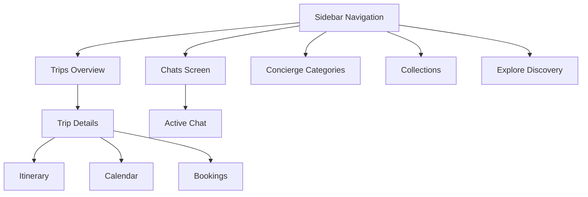

# Navigation Flow & Rules

## Correct Navigation Rules (Source of Truth)

| Sidebar Item | Should Open | Purpose |
|Data|Data|Data|
| **Chats** | Chat screen (`/chats`) | Ongoing & new conversations |
| **Trips** | Trips list (`/itineraries`) | All trips → trip detail pages |
| **Explore** | Discovery (`/explore`) | Browse experiences |
| **Saved** | Collections (`/saved`) | Saved items |
| **Concierge** | Category hub (`/concierge`) | Guided entry point |

## User Flow Diagram

## Screen Responsibility Matrix

| Screen | Owns | Does NOT Own |
|Data|Data|Data|
| **Chats** | Conversations | Categories, Trips |
| **Trips** | Planning | Discovery |
| **Concierge** | Entry guidance | Chats |
| **Collections** | Saved items | Trips |

## Routes

- `/chats` - Main Chat Workspace
- `/itineraries` - Trips Dashboard
- `/trip/:id` - Trip Details (Itinerary)
- `/concierge` - Category Selection (Wizard Start)
- `/saved` - Saved Collections
