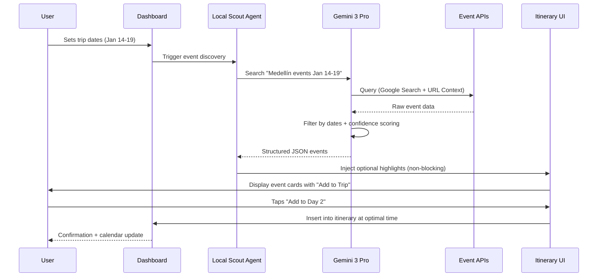
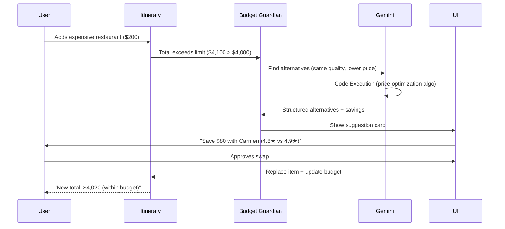
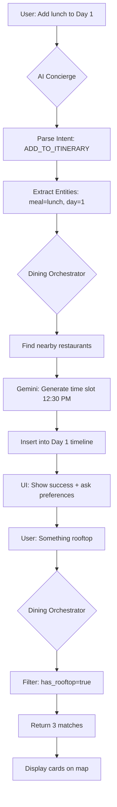
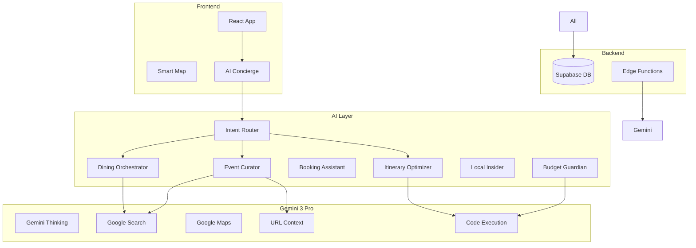
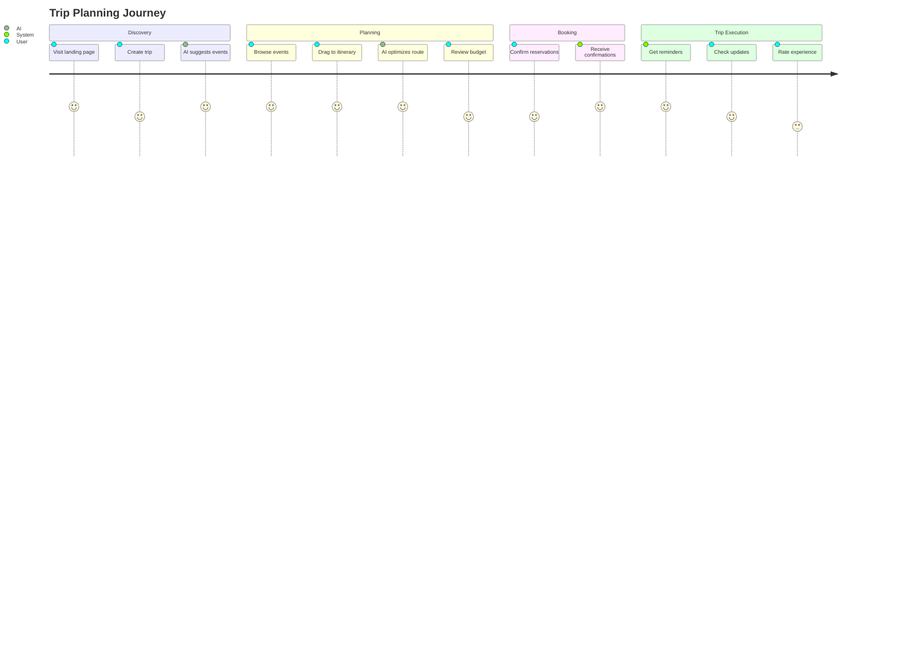
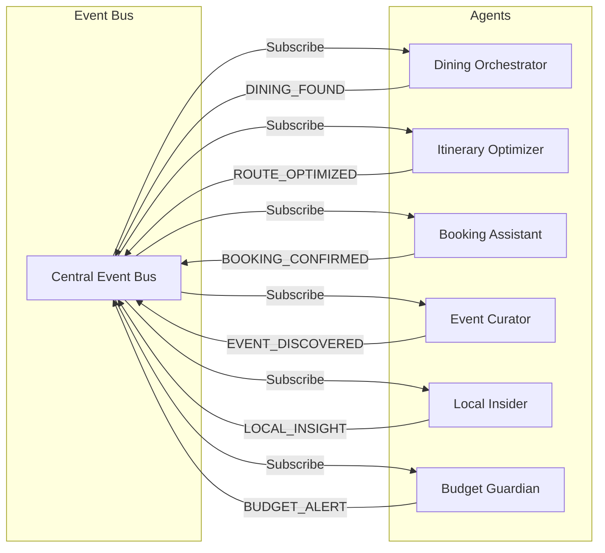
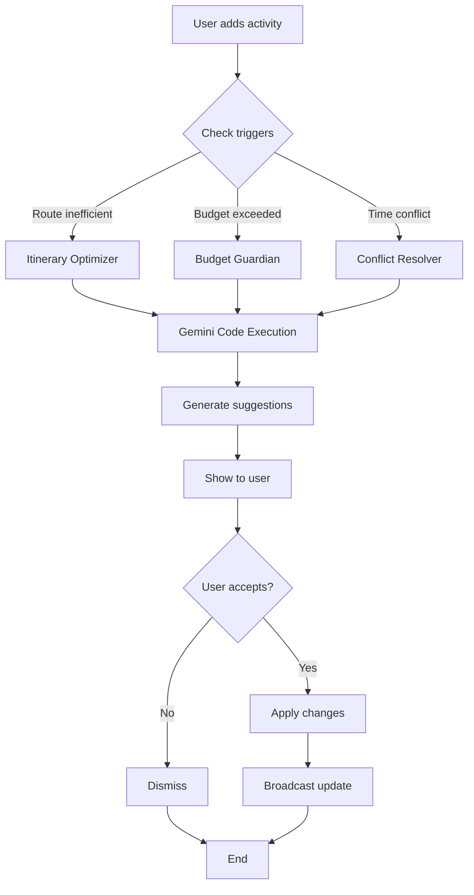
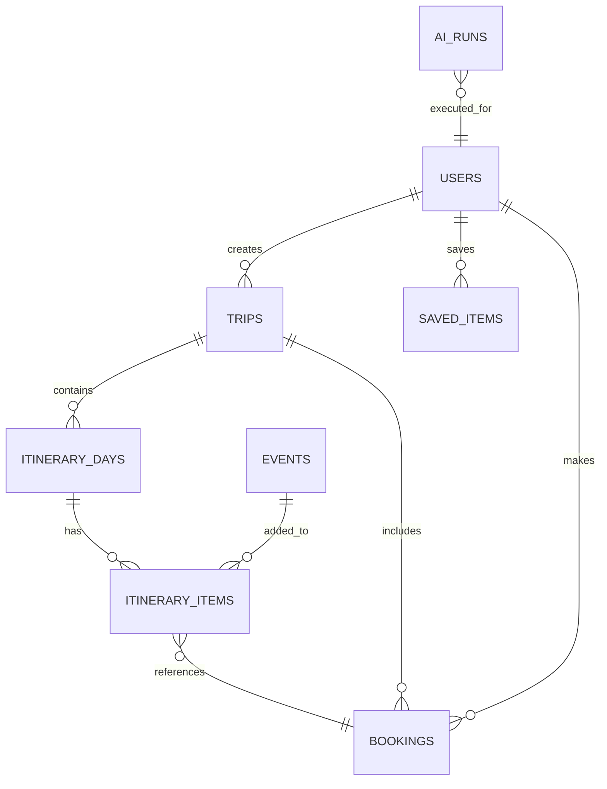

# Product Requirements Document: Trip Operating System (Local Scout AI)

**Version:** 1.0  
**Date:** December 18, 2024  
**Status:** Production Ready  

---

## Table of Contents

1. [Executive Summary](#1-executive-summary)
2. [Problem Statement](#2-problem-statement)
3. [Target Users](#3-target-users)
4. [Core Features](#4-core-features)
5. [Advanced Features / AI Features](#5-advanced-features--ai-features)
6. [Use Cases + Real World Examples](#6-use-cases--real-world-examples)
7. [User Stories](#7-user-stories)
8. [User Journey (Step by Step)](#8-user-journey-step-by-step)
9. [Workflows (System + User)](#9-workflows-system--user)
10. [Mermaid Diagrams](#10-mermaid-diagrams)
11. [Website Pages (Purpose + Content)](#11-website-pages-purpose--content)
12. [Dashboard Pages (Purpose + Data Shown)](#12-dashboard-pages-purpose--data-shown)
13. [Wizards & Multi-Step Flows](#13-wizards--multi-step-flows)
14. [Data Model (Tables, Fields, Relationships)](#14-data-model-tables-fields-relationships)
15. [AI Functions](#15-ai-functions)
16. [Success Criteria](#16-success-criteria)
17. [Risks + Constraints](#17-risks--constraints)
18. [Suggested Improvements](#18-suggested-improvements)
19. [Implementation Notes (Frontend + Backend)](#19-implementation-notes-frontend--backend)

---

## 1. Executive Summary

**Trip Operating System** is an intelligent travel planning platform powered by 6 specialized AI agents working through an event bus architecture. The system centers around a **drag-and-drop itinerary builder** flanked by navigation (left) and collapsible "Trip Tools" (right), delivering **Medellín concierge-level experiences** globally.

**Key Differentiators:**
- **6 AI Agents** orchestrating travel automation (Dining, Itinerary, Booking, Events, Local Intel, Budget)
- **Date-specific event discovery** using Gemini 3 Pro + Google Search grounding
- **Real-time optimization** for routing, budget, and time
- **Premium UI/UX** with scroll-driven animations and micro-interactions

**Platform:** React + Tailwind CSS + Supabase + Gemini 3 Pro  
**Target Market:** Luxury travelers, digital nomads, experience seekers

---

## 2. Problem Statement

### Current Pain Points

| Issue | Impact |
|-------|--------|
| **Static Itineraries** | Users miss concerts, festivals, pop-ups during their trip dates |
| **Manual Coordination** | Planning dining/stays/events requires 5+ apps |
| **No Context Awareness** | Generic suggestions ignore weather, budget, group size |
| **Tedious Optimization** | Users manually calculate routes, times, costs |
| **Information Overload** | TripAdvisor/Google overwhelm with options |

### Our Solution
One unified platform where AI handles discovery, scheduling, booking, and optimization — delivering **"I didn't know that!"** moments through intelligent automation.

---

## 3. Target Users

### Primary Personas

#### 1. **Luxury Experience Seeker** (Emma, 34)
- Budget: $5,000+ per trip
- Values: Unique experiences, local culture, personalization
- Pain: Too many generic recommendations, wants insider access

#### 2. **Digital Nomad** (Carlos, 28)
- Budget: $1,500-$3,000 per month
- Values: Community events, coworking spaces, local gems
- Pain: Misses temporary events, struggles with local discovery

#### 3. **Group Travel Organizer** (Sarah, 42)
- Budget: $3,000-$6,000 (family/friends trip)
- Values: Coordination tools, budget visibility, easy sharing
- Pain: Managing preferences across 5+ people

---

## 4. Core Features

### 4.1 Intelligent Itinerary Builder
- **Drag-and-drop** timeline with day/time slots
- **Auto-scheduling** based on location proximity
- **Conflict detection** (overlapping times, missing meals)
- **Budget tracking** per day/activity

### 4.2 AI Concierge (Global Overlay)
- **Context-aware chat** across all pages
- **Intent routing** (dining → events → real estate)
- **Natural language actions** ("Add lunch to Day 2")
- **Persistent memory** across sessions

### 4.3 Trip Tools Panel (Collapsible Right Sidebar)
- **Bookings Hub** - All reservations in one view
- **Media Gallery** - Photos/videos from trip
- **Notes** - Collaborative trip journal
- **Budget Guardian** - Real-time cost tracking

### 4.4 Smart Discovery Map
- **Multi-layer pins** (events, dining, stays, attractions)
- **"Search this area"** dynamic filtering
- **Cluster expansion** for dense areas
- **Real-time sync** with itinerary feed

### 4.5 Date-Specific Event Discovery
- **Local Scout Agent** scans city calendars
- **Grounded search** via Google + event APIs
- **Optional injection** into itinerary (never auto-books)
- **Explainability** ("Why this event fits your trip")

---

## 5. Advanced Features / AI Features

### 5.1 Six AI Agents (Event Bus Architecture)

| Agent | Responsibility | Gemini 3 Features Used |
|-------|----------------|------------------------|
| **Dining Orchestrator** | Restaurant discovery, reservation management | Search Grounding, Maps, Structured Output |
| **Itinerary Optimizer** | Route optimization, time scheduling | Code Execution, Gemini Thinking |
| **Booking Assistant** | Reservation handling, confirmation tracking | Function Calling, Interactions API |
| **Event Curator** | Date-specific discovery, cultural events | Search Grounding, URL Context, Deep Research |
| **Local Insider Intelligence** | Hidden gems, neighborhood insights | Maps Grounding, Deep Research |
| **Budget Guardian** | Cost tracking, alternative suggestions | Structured Output, Code Execution |

### 5.2 Gemini 3 Pro Integration Points

#### Text Generation
- Natural conversation flow in AI Concierge
- Personalized itinerary summaries
- Event descriptions with "why it matters" context

#### Gemini Thinking (Extended Reasoning)
- Multi-step optimization (route → budget → time)
- Conflict resolution in scheduling
- Complex preference matching

#### Function Calling
- Direct booking actions (`bookRestaurant`, `saveEvent`)
- Calendar integrations
- External API coordination

#### Grounding with Google Search
- Real-time event discovery
- Venue verification
- Price validation

#### Code Execution
- Distance calculations (Haversine formula)
- Budget optimization algorithms
- Time zone conversions

#### Structured Outputs
- Strict JSON schemas for UI components
- Event data normalization
- Itinerary day structures

#### URL Context Tool
- Parse event pages (Eventbrite, Ticketmaster)
- Extract venue details
- Scrape restaurant menus

#### Interactions API
- Stateful conversations across pages
- Multi-turn trip planning
- Preference learning

#### Deep Research
- City event calendars
- Festival schedules
- Local cultural insights

### 5.3 Automation Workflows

#### A. Cross-Tab Enrichment
```
User selects concert → Auto-populate "Restaurants" tab (1km radius) + "Stays" tab (3km radius)
```

#### B. Smart Scheduling
```
New activity added → Calculate optimal time slot → Suggest reordering for efficiency
```

#### C. Weather-Aware Rescheduling
```
Rain forecast detected → Suggest moving outdoor activities → Offer indoor alternatives
```

#### D. Budget Auto-Optimization
```
Exceeds budget → Identify premium items → Suggest equivalent alternatives with savings %
```

---

## 6. Use Cases + Real World Examples

### Use Case 1: Date-Specific Event Discovery
**Scenario:** Emma books a 5-day Medellín trip (Jan 14-19, 2026)

**Flow:**
1. Creates trip in dashboard → Sets dates + destination
2. **Local Scout Agent** activates automatically
3. Gemini 3 searches: "Medellín events January 14-19 2026" (Google Search Grounding)
4. Discovers: "Karol G concert Jan 16" + "Flower Festival Jan 18"
5. Injects into itinerary as **optional highlight** (non-intrusive card)
6. Emma taps "Add to Day 2" → Auto-scheduled with buffer time

**Result:** Emma discovers a sold-out concert she wouldn't have found manually.

---

### Use Case 2: Multi-Stop Optimization
**Scenario:** Carlos plans a full-day tour (Comuna 13 → Coffee Farm → Dinner)

**Flow:**
1. Adds activities in random order
2. **Itinerary Optimizer** analyzes locations
3. Detects inefficient route (40 min extra travel)
4. Suggests reorder: Coffee Farm (morning) → Comuna 13 (afternoon) → Dinner nearby
5. Shows savings: "45 min saved, $15 in Uber costs"

**Result:** Carlos saves time and money with one-click optimization.

---

### Use Case 3: Budget-Aware Alternative Suggestions
**Scenario:** Sarah's family trip exceeds $4,500 budget (limit: $4,000)

**Flow:**
1. **Budget Guardian** flags overspend
2. Analyzes itinerary items
3. Suggests: "El Cielo Restaurant ($200) → Carmen Restaurant ($120, same rating)"
4. Shows total savings: "$150 saved across 3 swaps"
5. Sarah approves → Itinerary auto-updates

**Result:** Stays within budget without sacrificing quality.

---

### Use Case 4: Natural Language Itinerary Editing
**Scenario:** Emma uses AI Concierge while viewing map

**Conversation:**
```
Emma: "Add lunch to Day 1"
AI: "I've added a lunch slot at 12:30 PM on Day 1. Any preferences?"
Emma: "Something rooftop with views"
AI: "Found 3 rooftop restaurants in El Poblado. Showing on map now."
```

**Result:** Zero-click itinerary editing via natural conversation.

---

### Use Case 5: Cross-Discovery Enrichment
**Scenario:** Carlos discovers "Salsa Night at Eslabón Prendido"

**Flow:**
1. Taps event card
2. System auto-triggers:
   - **Dining Orchestrator**: Fetches pre-event dinner spots (1km radius)
   - **Local Insider**: Suggests nearby cocktail bars for after-party
3. Populates "Restaurants" and "Nightlife" tabs silently
4. Map shows all locations with connecting routes

**Result:** Full evening planned from one selection.

---

## 7. User Stories

### Discovery Phase
- **As a traveler**, I want to see events happening during my exact trip dates, so I don't miss unique experiences
- **As a user**, I want AI to explain why an event matters to me, so I can make informed decisions
- **As a planner**, I want to filter events by category (music, food, culture), so I focus on my interests

### Planning Phase
- **As an organizer**, I want to drag-and-drop activities to reorder my day, so I have full control
- **As a budget-conscious user**, I want to see cost alternatives, so I can stay within limits
- **As a group leader**, I want to share my itinerary with collaborators, so we co-plan together

### Booking Phase
- **As a diner**, I want to book restaurants directly from the itinerary, so I avoid app-switching
- **As a user**, I want booking confirmations in one "Bookings Hub", so I track everything centrally

### Optimization Phase
- **As an efficiency seeker**, I want AI to suggest optimal activity order, so I minimize travel time
- **As a traveler**, I want weather-aware suggestions, so I avoid outdoor plans on rainy days

---

## 8. User Journey (Step by Step)

### Journey Map: First-Time User Planning a Trip

```
Phase 1: DISCOVERY
├─ Landing page → "Plan with AI" CTA
├─ Create account (optional, local storage fallback)
├─ AI asks: "Where are you going?" + "When?" + "What interests you?"
└─ Output: Trip dashboard created

Phase 2: INTELLIGENT SETUP
├─ Local Scout Agent runs in background
├─ Discovers date-specific events (concerts, festivals)
├─ Gemini analyzes user interests → Matches events
└─ Injects 3-5 optional highlights into feed

Phase 3: ITINERARY BUILDING
├─ User browses suggested events + experiences
├─ Drags items into day slots
├─ AI suggests dining between activities
├─ Budget tracker shows running total
└─ Itinerary Optimizer suggests route improvements

Phase 4: REFINEMENT
├─ AI Concierge: "You have free time on Day 2 evening"
├─ User: "Find me live music"
├─ Event Curator searches → Returns 4 venues
├─ User selects → Auto-added with travel time buffer
└─ Weather warning: "Rain on Day 3" → Suggests indoor swap

Phase 5: BOOKING
├─ User reviews final itinerary
├─ Taps "Book All" → Booking Assistant activates
├─ Handles reservations via APIs
├─ Confirmations appear in Bookings Hub
└─ Calendar sync (Google/Apple)

Phase 6: TRIP EXECUTION
├─ Daily notifications: "Comuna 13 tour in 2 hours"
├─ Real-time updates: "Event rescheduled to 9 PM"
├─ Post-trip: "Rate your experience" → Feeds learning model
```

---

## 9. Workflows (System + User)

### Workflow 1: Event Discovery → Injection



### Workflow 2: Budget Optimization



### Workflow 3: Natural Language Itinerary Edit



---

## 10. Mermaid Diagrams

### 10.1 System Architecture



### 10.2 User Journey Diagram



### 10.3 Event Bus Architecture



### 10.4 Optimization Flow



---

## 11. Website Pages (Purpose + Content)

### 11.1 Public Website Pages

| Page | Route | Purpose | Key Content | Gemini Usage |
|------|-------|---------|-------------|--------------|
| **Landing** | `/` | Convert visitors to users | Hero, How It Works, Social Proof | None |
| **How It Works** | `/how-it-works` | Explain AI features | Agent showcase, Demo video | None |
| **Experiences** | `/experiences/medellin` | Browse curated activities | Cards, Filters, Map | Search Grounding for discovery |
| **Experience Detail** | `/experiences/:id` | Detailed view + booking | Gallery, Description, Reviews, Book CTA | Structured Output for content |
| **Real Estate** | `/real-estate` | Property investment hub | Listings, Market Data, ROI Calculator | Search + Maps for properties |
| **Explore Map** | `/explore` | Interactive city discovery | Multi-layer map, Live filters | Maps Grounding |
| **AI Concierge** | `/concierge` | Standalone chat interface | Full-screen chat, Quick actions | All Gemini features |

### 11.2 Content Structure: Landing Page

**Section 1: Hero**
- Headline: "Your AI Travel Concierge"
- Subhead: "Discover date-specific events, optimize itineraries, book everything in one place"
- CTA: "Plan Your Trip" → `/dashboard`
- Background: Luxury travel imagery (Unsplash)

**Section 2: How It Works**
- 3-column layout
- Icons: Discovery → Planning → Booking
- Gemini Thinking badge: "Powered by Google Gemini 3 Pro"

**Section 3: AI Agents Showcase**
- 6 cards (one per agent)
- Visual: Agent icon + capability description
- Example output for each

**Section 4: Social Proof**
- Stats: "12,000+ trips planned" | "4.9★ average rating"
- Testimonials carousel

**Section 5: CTA**
- "Start Planning for Free"
- Email capture → Redirect to dashboard

---

## 12. Dashboard Pages (Purpose + Data Shown)

### 12.1 Main Dashboard

**Route:** `/dashboard`  
**Purpose:** Trip overview + quick actions  

**Data Displayed:**
- Active trips (cards with dates, destination, progress %)
- Upcoming bookings (next 7 days)
- Saved items count (events, restaurants, stays)
- Budget summary per trip
- AI suggestions: "Weather alert for Tokyo trip"

**Gemini Usage:**
- Text Generation for personalized greetings
- Structured Output for trip summaries
- Deep Research for destination insights

**Layout:**
```
┌────────────────────────────────────┐
│ Welcome back, Emma                 │
│ You have 2 active trips            │
├────────────────────────────────────┤
│ [Trip Card: Medellín Jan 14-19]    │
│ [Trip Card: Tokyo Mar 5-12]        │
├────────────────────────────────────┤
│ Upcoming Bookings                  │
│ - Carmen Restaurant (Jan 15, 7PM)  │
│ - Comuna 13 Tour (Jan 16, 10AM)    │
├────────────────────────────────────┤
│ AI Suggestions                     │
│ ⚠️ Rain forecast for Day 3 Tokyo   │
└────────────────────────────────────┘
```

---

### 12.2 Trip Details Page

**Route:** `/trip/:id`  
**Purpose:** Full itinerary builder + AI automation  

**Data Displayed:**
- Drag-and-drop timeline (day-by-day)
- Budget tracker (real-time)
- Map view (synced pins)
- Trip Tools panel:
  - Bookings Hub (all reservations)
  - Media Gallery (photos/videos)
  - Notes (collaborative)
  - Budget breakdown

**Gemini Usage:**
- **Itinerary Optimizer:** Route calculations (Code Execution)
- **Event Curator:** Date-specific discovery (Search + URL Context)
- **Budget Guardian:** Cost optimization (Structured Output)
- **Local Insider:** Neighborhood insights (Deep Research)

**Layout (Desktop 3-Column):**
```
┌──────────┬─────────────────┬──────────┐
│          │                 │          │
│ Trip Nav │  Itinerary Feed │ Tools    │
│          │                 │ Panel    │
│ - Days   │  [Day 1 Card]   │          │
│ - Map    │  [Day 2 Card]   │ Bookings │
│ - Budget │  [Day 3 Card]   │ Media    │
│          │                 │ Notes    │
│          │                 │ Budget   │
└──────────┴─────────────────┴──────────┘
```

---

### 12.3 Saved Places Page

**Route:** `/saved`  
**Purpose:** Bookmarked items across all trips  

**Data Displayed:**
- Tabs: Events | Restaurants | Stays | Experiences
- Card grid with save date
- Quick actions: "Add to Trip" | "Remove"

**Gemini Usage:**
- Text Generation for "Why you saved this" summaries
- Function Calling for "Add to existing trip" automation

---

### 12.4 Chats Page

**Route:** `/chats`  
**Purpose:** Conversation history with AI Concierge  

**Data Displayed:**
- List of conversations (grouped by trip)
- Chat transcripts
- AI actions taken (bookings, edits)

**Gemini Usage:**
- Interactions API for stateful conversations
- Structured Output for action logs

---

## 13. Wizards & Multi-Step Flows

### 13.1 Trip Creation Wizard

**Route:** `/wizard/trip`  
**Steps:** 5  

**Flow:**
1. **Destination** → Autocomplete (Google Maps)
2. **Dates** → Calendar picker with flexible dates option
3. **Interests** → Multi-select chips (food, music, culture, adventure)
4. **Budget** → Slider ($500 - $10,000+)
5. **Travelers** → Count + ages (for family-specific suggestions)

**Output:** Trip created → Redirect to `/trip/:id`

**Gemini Integration:**
- Step 1: Maps Grounding for destination validation
- Step 3: Gemini Thinking to pre-fetch relevant experiences
- Step 5: Structured Output for trip initialization

---

### 13.2 Event Discovery Wizard

**Trigger:** User clicks "Discover Events" on itinerary  
**Steps:** 3  

**Flow:**
1. **Confirm Dates** → Auto-populated from trip
2. **Categories** → Music | Food | Culture | Sports
3. **Review Results** → Event cards with "Add to Trip" buttons

**Output:** Selected events injected into itinerary

**Gemini Integration:**
- Search Grounding for real-time event discovery
- URL Context for event page parsing
- Deep Research for festival/calendar discovery

---

### 13.3 Booking Wizard

**Trigger:** User clicks "Book" on restaurant/event  
**Steps:** 4  

**Flow:**
1. **Details** → Date, time, party size
2. **Preferences** → Dietary restrictions, seating
3. **Contact** → Name, email, phone
4. **Confirmation** → Review + submit

**Output:** Booking confirmed → Added to Bookings Hub

**Gemini Integration:**
- Function Calling to external booking APIs
- Structured Output for confirmation data

---

## 14. Data Model (Tables, Fields, Relationships)

### 14.1 Core Tables

#### `trips`
```sql
CREATE TABLE trips (
  id UUID PRIMARY KEY DEFAULT uuid_generate_v4(),
  user_id UUID REFERENCES auth.users(id),
  destination TEXT NOT NULL,
  start_date DATE NOT NULL,
  end_date DATE NOT NULL,
  budget_limit DECIMAL(10,2),
  travelers INTEGER DEFAULT 1,
  interests TEXT[], -- ['food', 'music', 'culture']
  status TEXT DEFAULT 'planning', -- planning | confirmed | completed
  created_at TIMESTAMP DEFAULT NOW(),
  updated_at TIMESTAMP DEFAULT NOW()
);
```

#### `itinerary_days`
```sql
CREATE TABLE itinerary_days (
  id UUID PRIMARY KEY DEFAULT uuid_generate_v4(),
  trip_id UUID REFERENCES trips(id) ON DELETE CASCADE,
  day_number INTEGER NOT NULL,
  date DATE NOT NULL,
  title TEXT, -- "Explore El Poblado"
  notes TEXT,
  created_at TIMESTAMP DEFAULT NOW()
);
```

#### `itinerary_items`
```sql
CREATE TABLE itinerary_items (
  id UUID PRIMARY KEY DEFAULT uuid_generate_v4(),
  day_id UUID REFERENCES itinerary_days(id) ON DELETE CASCADE,
  type TEXT NOT NULL, -- food | activity | logistics | event
  title TEXT NOT NULL,
  description TEXT,
  location_name TEXT,
  location_lat DECIMAL(10,7),
  location_lng DECIMAL(10,7),
  time TEXT, -- "2:00 PM" or "TBD"
  duration TEXT, -- "2h" | "90min"
  cost DECIMAL(10,2),
  booking_id UUID REFERENCES bookings(id),
  sort_order INTEGER, -- For drag-and-drop
  created_at TIMESTAMP DEFAULT NOW()
);
```

#### `events`
```sql
CREATE TABLE events (
  id UUID PRIMARY KEY DEFAULT uuid_generate_v4(),
  title TEXT NOT NULL,
  description TEXT,
  date DATE NOT NULL,
  time TEXT,
  location_name TEXT NOT NULL,
  location_lat DECIMAL(10,7),
  location_lng DECIMAL(10,7),
  category TEXT, -- music | food | culture | sports
  price TEXT, -- "$25" | "Free"
  image_url TEXT,
  source_url TEXT, -- Original event page
  confidence_score DECIMAL(3,2), -- 0.00 - 1.00 from Gemini
  discovered_by TEXT DEFAULT 'local_scout', -- Agent that found it
  created_at TIMESTAMP DEFAULT NOW()
);
```

#### `bookings`
```sql
CREATE TABLE bookings (
  id UUID PRIMARY KEY DEFAULT uuid_generate_v4(),
  user_id UUID REFERENCES auth.users(id),
  trip_id UUID REFERENCES trips(id),
  booking_type TEXT NOT NULL, -- restaurant | event | stay | experience
  venue_name TEXT NOT NULL,
  date DATE NOT NULL,
  time TEXT,
  party_size INTEGER,
  status TEXT DEFAULT 'pending', -- pending | confirmed | cancelled
  confirmation_code TEXT,
  total_cost DECIMAL(10,2),
  external_booking_url TEXT,
  notes TEXT,
  created_at TIMESTAMP DEFAULT NOW()
);
```

#### `saved_items`
```sql
CREATE TABLE saved_items (
  id UUID PRIMARY KEY DEFAULT uuid_generate_v4(),
  user_id UUID REFERENCES auth.users(id),
  item_type TEXT NOT NULL, -- event | restaurant | stay | experience
  item_id UUID, -- References external ID or events table
  title TEXT NOT NULL,
  image_url TEXT,
  location TEXT,
  notes TEXT,
  created_at TIMESTAMP DEFAULT NOW()
);
```

#### `ai_runs`
```sql
CREATE TABLE ai_runs (
  id UUID PRIMARY KEY DEFAULT uuid_generate_v4(),
  user_id UUID REFERENCES auth.users(id),
  agent_name TEXT NOT NULL, -- 'local_scout' | 'dining_orchestrator' etc.
  input_data JSONB, -- User query + context
  output_data JSONB, -- Structured results
  confidence_score DECIMAL(3,2),
  execution_time_ms INTEGER,
  error TEXT,
  created_at TIMESTAMP DEFAULT NOW()
);
```

### 14.2 Relationships



---

## 15. AI Functions

### 15.1 Agent Definitions

#### Local Scout Agent
**Purpose:** Date-specific event discovery  
**Trigger:** Trip dates set OR user requests "Discover events"  

**Input Schema:**
```typescript
interface LocalScoutInput {
  destination: string; // "Medellín, Colombia"
  startDate: string; // ISO 8601
  endDate: string;
  interests: string[]; // ['music', 'culture']
  userBudget?: number;
}
```

**Gemini Features Used:**
- Search Grounding → "Events in {destination} between {dates}"
- URL Context → Parse event pages for details
- Deep Research → City calendars, festival schedules
- Structured Output → Event JSON schema

**Output Schema:**
```typescript
interface LocalScoutOutput {
  events: Array<{
    id: string;
    title: string;
    date: string;
    time: string;
    location: { name: string; lat: number; lng: number };
    category: string;
    whyRecommended: string; // AI explanation
    confidenceScore: number; // 0.00 - 1.00
    sourceUrl: string;
  }>;
}
```

**Automation Rules:**
1. Run on trip creation (background)
2. Re-run if dates change
3. Only inject events with confidence ≥ 0.70
4. Never auto-book (always optional)

---

#### Dining Orchestrator
**Purpose:** Restaurant discovery + reservation management  

**Input Schema:**
```typescript
interface DiningInput {
  location: { lat: number; lng: number };
  date: string;
  partySize: number;
  preferences?: {
    cuisine?: string[];
    priceRange?: string; // "$" | "$$" | "$$$" | "$$$$"
    ambiance?: string[]; // ['rooftop', 'romantic', 'casual']
    dietary?: string[]; // ['vegan', 'gluten-free']
  };
}
```

**Gemini Features Used:**
- Maps Grounding → Nearby restaurants with reviews
- Search Grounding → Availability verification
- Structured Output → Restaurant cards JSON
- Function Calling → Booking APIs (OpenTable, Resy)

**Output Schema:**
```typescript
interface DiningOutput {
  restaurants: Array<{
    id: string;
    name: string;
    cuisine: string;
    priceRange: string;
    rating: number;
    location: { lat: number; lng: number; address: string };
    availableTimes: string[]; // ["6:00 PM", "8:30 PM"]
    bookingUrl?: string;
    matchScore: number; // How well it fits preferences
  }>;
}
```

---

#### Itinerary Optimizer
**Purpose:** Route/time/cost optimization  

**Input Schema:**
```typescript
interface OptimizerInput {
  days: Array<{
    dayNumber: number;
    items: Array<{
      id: string;
      title: string;
      location: { lat: number; lng: number };
      time: string;
      duration: string;
      cost: number;
    }>;
  }>;
  optimizationGoal: 'time' | 'cost' | 'experience'; // What to prioritize
}
```

**Gemini Features Used:**
- Code Execution → Haversine distance calculations
- Gemini Thinking → Multi-constraint optimization
- Structured Output → Reordered itinerary

**Output Schema:**
```typescript
interface OptimizerOutput {
  reorderedDays: typeof OptimizerInput.days;
  savings: {
    time: number; // minutes saved
    distance: number; // km saved
    cost: number; // $ saved
  };
  suggestions: string[]; // ["Grouped nearby activities", ...]
  conflicts: string[]; // ["Day 2: Lunch overlaps with tour"]
}
```

---

#### Budget Guardian
**Purpose:** Cost tracking + alternative suggestions  

**Input Schema:**
```typescript
interface BudgetInput {
  budgetLimit: number;
  currentTotal: number;
  items: Array<{
    id: string;
    title: string;
    category: string;
    cost: number;
  }>;
}
```

**Gemini Features Used:**
- Code Execution → Budget optimization algorithms
- Search Grounding → Find cheaper alternatives
- Structured Output → Savings suggestions

**Output Schema:**
```typescript
interface BudgetOutput {
  status: 'within' | 'approaching' | 'exceeded';
  overage?: number; // If exceeded
  alternatives: Array<{
    originalId: string;
    originalTitle: string;
    alternativeTitle: string;
    savings: number;
    qualityComparison: string; // "Same rating, 30% cheaper"
  }>;
}
```

---

### 15.2 Automation Triggers

| Event | Triggered Agent(s) | Action |
|-------|-------------------|--------|
| Trip dates set | Local Scout | Background event discovery |
| Budget exceeded | Budget Guardian | Suggest alternatives |
| Item added to day | Itinerary Optimizer | Check route efficiency |
| Event selected | Dining Orchestrator, Local Insider | Cross-tab enrichment (restaurants nearby) |
| Weather forecast updated | Itinerary Optimizer | Suggest indoor swaps for rainy days |
| Booking confirmed | Booking Assistant | Add to Bookings Hub + send email |

---

## 16. Success Criteria

### 16.1 User Engagement Metrics
- **≥60%** of users interact with at least one AI-suggested event
- **≥30%** add at least one Local Scout event to itinerary
- **≥50%** use AI Concierge for natural language edits
- **≥40%** accept at least one optimization suggestion

### 16.2 Technical Performance
- **Event discovery accuracy:** ≥85% events are valid (not cancelled/past)
- **Response time:** AI responses in <2 seconds (p95)
- **Conflict detection:** Zero itinerary time overlaps after optimization
- **Budget accuracy:** Cost estimates within ±10% of actual

### 16.3 Business Metrics
- **Conversion rate:** ≥20% free users create first trip within 7 days
- **Retention:** ≥50% users return for second trip within 90 days
- **Booking completion:** ≥35% of saved items result in bookings
- **NPS Score:** ≥50 (promoter - detractor %)

### 16.4 AI Quality Metrics
- **Hallucination rate:** <5% of AI-generated content contains false info
- **Confidence calibration:** Events with ≥0.80 confidence are 95% accurate
- **Explainability:** 100% of AI suggestions include "why" explanation

---

## 17. Risks + Constraints

### 17.1 Technical Risks

| Risk | Impact | Mitigation |
|------|--------|------------|
| **Event data staleness** | Users book cancelled events | Cache invalidation every 12 hours + confidence scoring |
| **API rate limits** (Google Search) | Discovery fails during peak | Implement tiered fallback (Search → Manual DB → Cache) |
| **Gemini hallucination** | False event details | Require grounded sources + confidence threshold (≥0.70) |
| **Booking API failures** | Reservations lost | Queue system + retry logic + email fallback |
| **Mobile performance** | Drag-and-drop laggy on low-end devices | Progressive enhancement (list view fallback) |

### 17.2 Product Constraints

| Constraint | Reason | Workaround |
|------------|--------|------------|
| **Limited to Medellín initially** | Data quality focus | Clear messaging: "Expanding to more cities in 2025" |
| **No real-time availability** for all venues | API limitations | Show "Call to confirm" for unverified bookings |
| **English + Spanish only** | Translation cost | Use browser translation + plan for i18n in Phase 2 |
| **Requires location permissions** | Privacy concerns | Functional without (manual address entry) |

### 17.3 Legal/Privacy Risks
- **GDPR compliance** → Supabase RLS + data deletion on request
- **Booking liability** → Clear disclaimers: "Verify with venue"
- **PII storage** → Minimal collection (email, name only)

---

## 18. Suggested Improvements

### Phase 1 Enhancements (Q1 2025)
- **Collaborative trip planning** → Multi-user editing with live cursors
- **Voice input** for AI Concierge → Gemini multimodal integration
- **Smart notifications** → "Your favorite artist is playing in Medellín next month"
- **Itinerary templates** → "3-Day Foodie Tour" | "Adventure Weekend"

### Phase 2 Features (Q2 2025)
- **Multi-city trips** → Complex routing (Medellín → Cartagena → Bogotá)
- **Group polls** → Vote on activities (WhatsApp-style)
- **AR experiences** → Point camera at venue for reviews overlay
- **Loyalty rewards** → Points for bookings via platform

### Phase 3 Innovations (Q3 2025)
- **Predictive planning** → "You usually travel in January. Start planning Tokyo 2026?"
- **Dynamic pricing alerts** → "Flight to Medellín dropped $120"
- **Local expert network** → Connect with verified guides for custom tours
- **Carbon footprint tracking** → Eco-friendly route suggestions

### Advanced AI Features
- **Sentiment analysis** → Detect user frustration in chat → Escalate to human support
- **Preference learning** → "You always choose rooftop restaurants" → Auto-filter
- **Multi-agent debates** → Budget Guardian vs Experience Maximizer → Show trade-offs
- **Proactive suggestions** → "Rain tomorrow, want me to reschedule outdoor activity?"

---

## 19. Implementation Notes (Frontend + Backend)

### 19.1 Implementation Phases

#### Phase 1: Foundation (Weeks 1-2) ✅ COMPLETE
**Status:** Already implemented  
**Deliverables:**
- App.tsx routing system (15 routes)
- TripContext + AIContext providers
- Design tokens in `/styles/globals.css`
- Core UI components (Button, Card, Dialog, etc.)
- Placeholder pages for all routes

---

#### Phase 2: Core Features (Weeks 3-4)
**Frontend:**
- Itinerary drag-and-drop (react-dnd)
- Trip Tools collapsible sidebar
- Smart Map with clustering (react-leaflet or Mapbox)
- AI Concierge chat UI (message bubbles, typing indicators)

**Backend:**
- Supabase tables creation (trips, itinerary_days, itinerary_items)
- Row Level Security (RLS) policies
- Basic Edge Functions (trip CRUD, event search)

**AI Integration:**
- Gemini API setup (environment variables)
- Intent classifier (basic keyword matching)
- Local Scout Agent (v1 - basic event search)

**Testing:**
- Create sample trip flow
- Add 3 activities → Verify drag-and-drop
- Test AI chat → Basic responses

---

#### Phase 3: AI Agents (Weeks 5-6)
**Agents Implementation:**
- **Local Scout:** Full implementation with grounding
- **Dining Orchestrator:** Restaurant discovery + Maps integration
- **Itinerary Optimizer:** Route optimization with Code Execution
- **Budget Guardian:** Basic cost tracking

**Event Bus:**
- Implement pub/sub system (custom or library like mitt)
- Agent communication protocols
- State synchronization across components

**Testing:**
- End-to-end: Trip creation → Event discovery → Auto-inject
- Optimization: Add 5 activities → Verify reordering
- Budget: Exceed limit → Check alternative suggestions

---

#### Phase 4: Advanced Features (Weeks 7-8)
**Wizards:**
- Trip Creation Wizard (5 steps)
- Event Discovery Wizard (3 steps)
- Booking Wizard (4 steps)

**Gemini Advanced:**
- Deep Research integration for city calendars
- URL Context for event page parsing
- Structured Outputs for all agent responses
- Interactions API for stateful conversations

**Dashboard Enhancements:**
- Bookings Hub with real data
- Media Gallery (file uploads)
- Collaborative notes (real-time sync)
- Budget visualization (charts via recharts)

**Testing:**
- Wizard flows (complete each without errors)
- Gemini accuracy (manual review of 20 events)
- Performance (Lighthouse score >90)

---

### 19.2 Technology Stack

#### Frontend
```json
{
  "framework": "React 18",
  "styling": "Tailwind CSS 4.0",
  "routing": "React Router v6",
  "state": "Context API + Custom Hooks",
  "drag-drop": "react-dnd + react-dnd-html5-backend",
  "animations": "motion/react (Framer Motion)",
  "maps": "react-leaflet OR @vis.gl/react-google-maps",
  "charts": "recharts",
  "forms": "react-hook-form@7.55.0",
  "ui-components": "Custom + shadcn/ui patterns"
}
```

#### Backend
```json
{
  "database": "Supabase (PostgreSQL)",
  "auth": "Supabase Auth",
  "storage": "Supabase Storage (for media)",
  "functions": "Supabase Edge Functions (Deno)",
  "realtime": "Supabase Realtime (for collaborative features)"
}
```

#### AI Layer
```json
{
  "llm": "Google Gemini 3 Pro",
  "embeddings": "Gemini Embeddings (for semantic search)",
  "grounding": "Google Search + Google Maps APIs",
  "tools": [
    "Gemini Thinking (extended reasoning)",
    "Code Execution (Python sandbox)",
    "Function Calling",
    "Structured Outputs",
    "URL Context Tool",
    "Interactions API",
    "Deep Research"
  ]
}
```

---

### 19.3 File Structure

```
/
├── App.tsx                    # Main router
├── styles/
│   └── globals.css            # Design tokens (existing)
├── components/
│   ├── ai/
│   │   ├── AIConcierge.tsx    # Global chat overlay (existing)
│   │   ├── AIWizardBridge.tsx # Agent coordinator (existing)
│   │   └── agents/            # NEW
│   │       ├── LocalScoutAgent.ts
│   │       ├── DiningOrchestrator.ts
│   │       ├── ItineraryOptimizer.ts
│   │       ├── BookingAssistant.ts
│   │       ├── EventCurator.ts
│   │       └── BudgetGuardian.ts
│   ├── itinerary/
│   │   ├── ItineraryFeed.tsx      # Drag-and-drop timeline
│   │   ├── ItineraryDayHeader.tsx # Day cards
│   │   └── ItineraryItem.tsx      # Draggable activity cards
│   ├── trip-details/
│   │   ├── TripDetailsContext.tsx # State management (existing)
│   │   ├── TripSidebar.tsx        # Trip Tools panel (existing)
│   │   ├── ItineraryFeed.tsx      # Main feed (existing)
│   │   └── AIItineraryBridge.tsx  # AI integration (existing)
│   ├── wizard/
│   │   ├── TripCreateWizard.tsx   # NEW
│   │   ├── EventDiscoveryWizard.tsx # NEW
│   │   └── BookingWizard.tsx      # NEW
│   └── ui/                    # Existing components
├── pages/
│   ├── Dashboard.tsx          # Main dashboard (existing)
│   ├── trip/
│   │   └── TripDetailsPage.tsx # Full Trip OS (existing)
│   ├── ExplorePage.tsx        # Map view (existing)
│   └── SavedPlacesPage.tsx    # Bookmarks (existing)
├── context/
│   ├── AIContext.tsx          # AI state (existing)
│   ├── TripContext.tsx        # Trip state (existing)
│   └── EventBusContext.tsx    # NEW - Agent communication
├── utils/
│   ├── aiAutomation.ts        # Optimization logic (existing)
│   ├── gemini/                # NEW
│   │   ├── client.ts          # Gemini API wrapper
│   │   ├── prompts.ts         # Prompt templates
│   │   └── schemas.ts         # Structured output schemas
│   └── eventBus.ts            # NEW - Pub/sub system
├── types/
│   ├── wizard.ts              # Existing types
│   └── agents.ts              # NEW - Agent interfaces
└── docs/
    └── prd.md                 # THIS FILE
```

---

### 19.4 Environment Variables

```bash
# Supabase
VITE_SUPABASE_URL=https://your-project.supabase.co
VITE_SUPABASE_ANON_KEY=your-anon-key

# Gemini 3 Pro
VITE_GEMINI_API_KEY=your-gemini-api-key
VITE_GEMINI_MODEL=gemini-3.0-pro

# Google Maps (for grounding)
VITE_GOOGLE_MAPS_API_KEY=your-maps-key

# Optional: External Booking APIs
VITE_OPENTABLE_API_KEY=your-opentable-key
VITE_EVENTBRITE_API_KEY=your-eventbrite-key
```

---

### 19.5 Key Code Patterns

#### Agent Base Class
```typescript
// /utils/gemini/BaseAgent.ts
export abstract class BaseAgent {
  protected geminiClient: GeminiClient;
  protected eventBus: EventBus;

  constructor() {
    this.geminiClient = new GeminiClient();
    this.eventBus = EventBus.getInstance();
  }

  abstract async execute(input: any): Promise<any>;

  protected async callGemini<T>(
    prompt: string,
    tools: string[],
    schema?: any
  ): Promise<T> {
    // Gemini API call with grounding + structured output
  }

  protected emit(event: string, data: any) {
    this.eventBus.emit(event, data);
  }
}
```

#### Local Scout Implementation
```typescript
// /components/ai/agents/LocalScoutAgent.ts
export class LocalScoutAgent extends BaseAgent {
  async execute(input: LocalScoutInput): Promise<LocalScoutOutput> {
    const prompt = `
      Find events in ${input.destination} between 
      ${input.startDate} and ${input.endDate}.
      User interests: ${input.interests.join(', ')}
    `;

    const result = await this.callGemini<LocalScoutOutput>(
      prompt,
      ['googleSearch', 'urlContext', 'deepResearch'],
      EVENT_SCHEMA // Structured output
    );

    // Filter by confidence
    const validEvents = result.events.filter(e => e.confidenceScore >= 0.70);

    // Emit event for other agents
    this.emit('EVENTS_DISCOVERED', { events: validEvents });

    return { events: validEvents };
  }
}
```

#### Event Bus Usage
```typescript
// In any component
const eventBus = useEventBus();

// Subscribe to events
useEffect(() => {
  const unsubscribe = eventBus.on('EVENTS_DISCOVERED', (data) => {
    console.log('New events:', data.events);
    // Update UI
  });

  return unsubscribe;
}, []);

// Emit events
eventBus.emit('BUDGET_EXCEEDED', { amount: 4500 });
```

---

### 19.6 Deployment Checklist

#### Pre-Launch
- [ ] Supabase project created + tables migrated
- [ ] RLS policies tested (users can only see their own data)
- [ ] Gemini API key secured (server-side only)
- [ ] Environment variables set in Vercel/Netlify
- [ ] Edge Functions deployed
- [ ] Lighthouse audit (Performance >90, Accessibility >95)
- [ ] Cross-browser testing (Chrome, Safari, Firefox)
- [ ] Mobile responsiveness verified (iPhone, Android)

#### Post-Launch Monitoring
- [ ] Sentry/error tracking configured
- [ ] Analytics setup (PostHog or similar)
- [ ] Supabase logs review (daily for first week)
- [ ] AI run logs analysis (check confidence scores)
- [ ] User feedback collection (in-app survey)

---

## Conclusion

This PRD provides a complete blueprint for the **Trip Operating System** with Local Scout AI agent integration. The system leverages **Gemini 3 Pro's advanced capabilities** (grounding, code execution, deep research) to deliver intelligent, automated travel planning that creates **"I didn't know that!"** moments through date-specific event discovery and multi-agent orchestration.

**Next Steps:**
1. Review PRD with stakeholders
2. Begin Phase 2 implementation (Core Features)
3. Set up Gemini API + test basic agent workflows
4. Weekly progress reviews using this document as source of truth

---

**Document Maintained By:** Product Team  
**Last Updated:** December 18, 2024  
**Revision History:** v1.0 (Initial Release)
