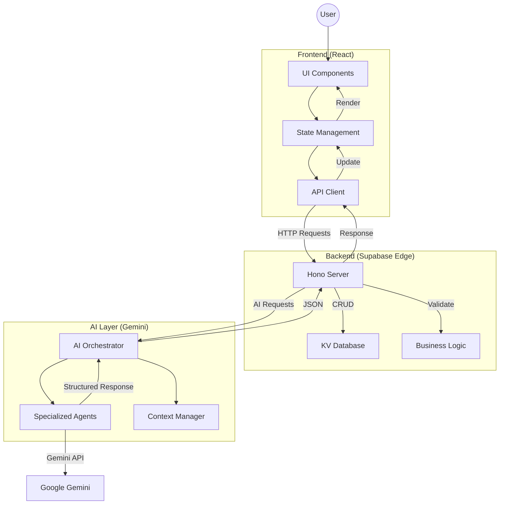
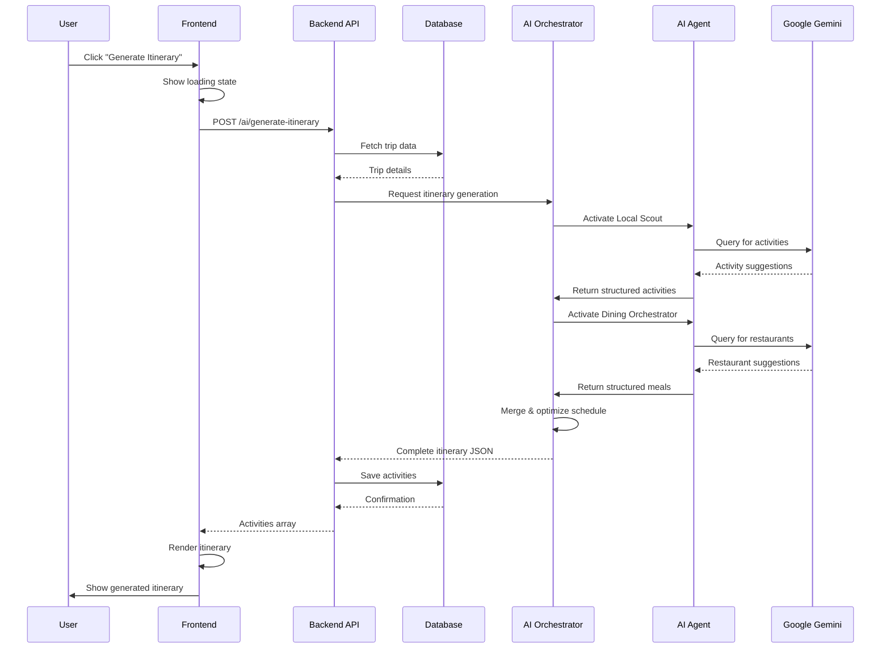
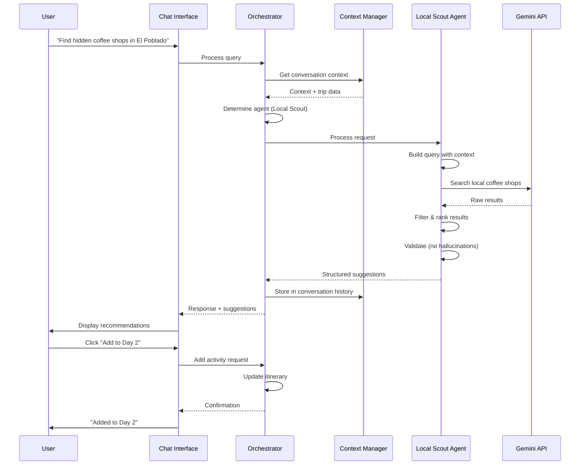

# MASTER PROMPT — SaaS Implementation Plan
# Trip Operating System - Production-Ready Implementation Guide

**Version:** 1.0  
**Date:** December 21, 2024  
**Status:** Master Reference Document  
**Purpose:** Complete UI + AI + System Blueprint for Production Deployment

---

## 0. EXECUTIVE OVERVIEW

### Product Goal
Build a **Trip Operating System** powered by six specialized AI agents working through an event bus to automate and enhance every stage of travel planning—from inspiration and discovery to booking, optimization, and real-time coordination—while maintaining human control and transparency at every step.

### Target Users
1. **Luxury Travelers** - Seeking curated, personalized experiences with minimal planning friction
2. **Digital Nomads** - Balancing work and exploration, need flexible, optimized itineraries
3. **Group Trip Organizers** - Coordinating multi-person trips with varying preferences and budgets
4. **Frequent Travelers** - Value efficiency, insider knowledge, and seamless booking automation

### Core Problem Solved
Travel planning is fragmented across 20+ tools, requires hours of research, often misses local insights, and lacks intelligent automation. Our platform consolidates the entire trip lifecycle into one intelligent system that learns preferences, suggests optimal experiences, coordinates bookings, and provides real-time assistance—all while looking beautiful and feeling effortless.

### What "Production-Ready" Means
- **Zero Breaking Changes**: All features must work end-to-end without errors
- **100% Tested Workflows**: Every user action has a defined path, success state, and failure recovery
- **Transparent AI**: All AI decisions are explainable, logged, and have human override
- **Mobile-First Responsive**: Works flawlessly on mobile, tablet, and desktop
- **Performance Optimized**: Sub-2s page loads, smooth animations, no jank
- **Error Resilience**: Graceful degradation when APIs fail or data is missing
- **Build → Verify → Ship**: No code ships without forensic validation

---

## 1. UI / UX LAYOUT & PAGES

### Design System Foundation
**Aesthetic:** Luxury, calm, confident  
**Typography:** Editorial style with hierarchy (Playfair Display headings, Inter body)  
**Components:** Illustrated cards, soft shadows, restrained motion  
**Colors:** Neutral palette with accent colors for actions  
**Spacing:** Generous whitespace, breathing room

---

### 1.1 Website Pages (Public)

#### `/` - Homepage
**Purpose:** Convert visitors into users through inspiration and clear value proposition  
**Primary Action:** Sign up or explore demo  
**Key Components:**
- Hero with AI-powered search bar
- "How It Works" flow (3-step visual)
- Curated destination gallery with AI insights
- Social proof (testimonials, stats)
- Pre-footer CTA

**Routes & Links:**
- Sign Up → `/signup` (future)
- Explore Demo → `/app/trips` (with demo data)
- Pricing → `/pricing`
- Use Cases → `/use-cases`

**Next State:** User explores demo OR signs up

---

#### `/pricing` - Pricing Page
**Purpose:** Clearly communicate pricing tiers and feature differentiation  
**Primary Action:** Start free trial or select plan  
**Key Components:**
- 3-tier pricing cards (Free, Pro, Enterprise)
- Feature comparison table
- AI agents showcase (what each tier unlocks)
- FAQ accordion
- Social proof
- Bottom CTA

**Routes & Links:**
- Start Free Trial → `/signup`
- Contact Sales → Contact form modal
- View Features → `/features`

**Next State:** User signs up or contacts sales

---

#### `/use-cases` - Use Case Hub
**Purpose:** Show concrete examples of how different personas use the product  
**Primary Action:** Explore specific use case or start trial  
**Key Components:**
- Use case cards (Digital Nomad, Luxury Traveler, Group Trip)
- Problem/solution showcase
- Before/after comparisons
- Example itineraries
- Pricing teaser

**Routes & Links:**
- Digital Nomad → `/use-cases/digital-nomad`
- Luxury Traveler → `/use-cases/luxury-traveler`
- Group Trip → `/use-cases/group-trip`
- Start Trial → `/signup`

**Next State:** User explores specific use case or signs up

---

#### `/use-cases/:type` - Individual Use Case
**Purpose:** Deep dive into specific persona's journey and outcomes  
**Primary Action:** Start building similar trip  
**Key Components:**
- Hero with persona story
- Problem statement
- Solution showcase (with screenshots)
- AI agents involved
- Example itinerary
- Testimonial
- CTA

**Routes & Links:**
- Build Similar Trip → `/signup` → `/app/trips/new?template=:type`
- View All Use Cases → `/use-cases`

**Next State:** User signs up with template pre-loaded

---

#### `/how-it-works` - Product Walkthrough
**Purpose:** Educate users on the platform's capabilities and workflow  
**Primary Action:** Start using the platform  
**Key Components:**
- Step-by-step visual flow
- Feature explanations
- AI agent introductions
- Video demos (future)
- Interactive examples

**Routes & Links:**
- Get Started → `/signup`
- View Pricing → `/pricing`

**Next State:** User signs up

---

#### `/features` - Feature Gallery
**Purpose:** Showcase advanced capabilities and differentiators  
**Primary Action:** Sign up to access features  
**Key Components:**
- Feature cards with demos
- AI capabilities showcase
- Integration highlights
- Mobile app preview (future)

**Routes & Links:**
- Sign Up → `/signup`
- View Pricing → `/pricing`

**Next State:** User signs up

---

### 1.2 Dashboard Pages / Modules (Authenticated)

#### `/app/trips` - Trips Dashboard
**Purpose:** Central hub for all trips  
**User Goal:** View, create, and manage trips  
**Data Shown:**
- Upcoming trips (sorted by start date)
- Active trip (if traveling)
- Past trips (archive)
- Trip cards with: title, destination, dates, image, status, progress

**Primary CTA:** Create New Trip (+ button)

**Automations / AI Involved:**
- Proactive Assistant suggests trip ideas based on browsing history
- Budget forecasting for upcoming trips
- Weather alerts for upcoming trips

**Success State:** User sees their trips organized by timeline  
**Empty State:** Onboarding wizard to create first trip

**Routes & Links:**
- Create Trip → Modal → `/app/trip/:id` after creation
- View Trip → `/app/trip/:id`
- Settings → `/app/settings`
- Concierge → `/app/concierge` (overlay)

**Next State:** User creates new trip or views existing trip

---

#### `/app/trip/:id` - Trip Detail / Itinerary Builder
**Purpose:** Plan, organize, and manage a single trip  
**User Goal:** Build and optimize itinerary, manage bookings, track budget  
**Data Shown:**
- Trip header (title, destination, dates, travelers)
- Left sidebar: Day-by-day itinerary with drag-and-drop
- Center: Map view showing locations
- Right sidebar: AI suggestions, bookings, budget

**Primary CTA:** Add Activity (manual or AI-assisted)

**Automations / AI Involved:**
- **Itinerary Optimizer** analyzes schedule and suggests improvements
- **Local Scout** recommends hidden gems based on preferences
- **Dining Orchestrator** suggests meals at optimal times
- **Budget Guardian** tracks spending and alerts on overruns
- **Event Curator** finds date-specific events
- **Booking Assistant** helps complete reservations

**Success State:** Complete itinerary with optimized schedule  
**Empty State:** AI wizard offers to generate initial itinerary from preferences

**Routes & Links:**
- Add Activity → Modal or AI wizard
- AI Suggestions → Expands right panel
- Export → Share menu
- Back to Trips → `/app/trips`

**Next State:** User adds activities or requests AI optimization

---

#### `/app/concierge` - AI Concierge Chat
**Purpose:** Natural language trip planning and assistance  
**User Goal:** Ask questions, get recommendations, automate tasks  
**Data Shown:**
- Conversation history
- AI agent status indicators
- Suggested follow-up questions
- Quick actions (add to itinerary, save place, book)

**Primary CTA:** Send message

**Automations / AI Involved:**
- **Orchestrator** routes queries to appropriate agent
- **Context Manager** maintains conversation context
- **Collaboration Engine** coordinates multi-agent responses
- **Proactive Assistant** offers unsolicited suggestions when helpful

**Success State:** User gets actionable recommendations  
**Empty State:** Welcome message with example queries

**Routes & Links:**
- Add to Itinerary → Trip selector modal → adds to trip
- Save Place → Adds to saved collection
- View on Map → Opens map view

**Next State:** User adds suggestion to trip or continues conversation

---

#### `/app/explore` - Discovery & Search
**Purpose:** Find and save places, experiences, events  
**User Goal:** Discover new places based on preferences  
**Data Shown:**
- Filter bar (category, price, rating)
- Map view with clusters
- Grid/list view of results
- Place cards with: image, title, category, rating, save button

**Primary CTA:** Save place or add to trip

**Automations / AI Involved:**
- **Local Scout** surfaces hidden gems
- **Event Curator** highlights timely events
- Personalized ranking based on user preferences

**Success State:** User discovers and saves places they love  
**Empty State:** Popular destinations and curated collections

**Routes & Links:**
- View Place → Detail drawer
- Add to Trip → Trip selector
- Save → Saved collection

**Next State:** User saves places or adds to trip

---

#### `/app/saved` - Saved Places & Collections
**Purpose:** Organize saved places into collections  
**User Goal:** Curate wishlists and organize research  
**Data Shown:**
- Collections (folders)
- Saved places grid
- Place metadata (title, location, category, notes)

**Primary CTA:** Add to trip or create collection

**Automations / AI Involved:**
- AI suggests collections based on saved places
- Smart grouping by location/theme

**Success State:** Organized collections ready to build trips from  
**Empty State:** Prompt to start exploring

**Routes & Links:**
- Create Collection → Modal
- Add to Trip → Trip selector
- Explore → `/app/explore`

**Next State:** User adds places to trip or continues saving

---

#### `/app/settings` - User Settings & Preferences
**Purpose:** Manage account, preferences, integrations  
**User Goal:** Customize experience, connect services, manage API keys  
**Data Shown:**
- Profile settings
- Travel preferences (pace, budget, style)
- Connected services (Google Calendar, etc.)
- API keys (Gemini)
- Notification preferences
- Subscription/billing

**Primary CTA:** Save preferences

**Automations / AI Involved:**
- Preferences feed into all AI agents for personalization

**Success State:** Configured preferences improve AI recommendations  
**Empty State:** Onboarding wizard to set initial preferences

**Next State:** User returns to trips with improved personalization

---

### 1.3 Responsive Rules
- **Mobile (< 768px):**
  - Single column layouts
  - Bottom navigation
  - Swipeable cards
  - Collapsible sidebars
  - Full-screen modals
  
- **Tablet (768px - 1024px):**
  - Two-column layouts
  - Side navigation
  - Modal drawers
  
- **Desktop (> 1024px):**
  - Three-column layouts (sidebar + content + panel)
  - Persistent navigation
  - Inline modals

---

## 2. FEATURE INVENTORY (CORE → ADVANCED)

### 2.1 Core Features (Must Ship First) ✅

These features make the product **usable without AI**. AI is additive, not required.

#### Trip Management
- **Feature:** Create/Edit/Delete trips
- **User Value:** Basic trip organization
- **Dependencies:** Database, auth (future)
- **Risk Level:** Low
- **Production-Ready:** YES ✅

#### Manual Itinerary Building
- **Feature:** Add/edit/remove activities, drag-and-drop reordering
- **User Value:** Full control over schedule
- **Dependencies:** React DnD library, state management
- **Risk Level:** Low
- **Production-Ready:** YES ✅

#### Saved Places
- **Feature:** Save places, organize into collections
- **User Value:** Research organization
- **Dependencies:** Database
- **Risk Level:** Low
- **Production-Ready:** YES ✅

#### Budget Tracking
- **Feature:** Set budget, log expenses, view totals
- **User Value:** Financial planning
- **Dependencies:** None
- **Risk Level:** Low
- **Production-Ready:** YES ✅

#### Booking Management
- **Feature:** Store booking confirmations, track reservations
- **User Value:** Centralized booking organization
- **Dependencies:** None
- **Risk Level:** Low
- **Production-Ready:** YES ✅

---

### 2.2 Advanced Features (Post-Validation)

These features **enhance** the core with AI, automation, and intelligence.

#### AI Itinerary Generation
- **Feature:** Generate complete itinerary from preferences
- **User Value:** Zero-to-one trip planning in minutes
- **Dependencies:** Gemini API, agent orchestration
- **Risk Level:** Medium (hallucination, API costs)
- **Production-Ready:** Needs validation gates

#### Intelligent Optimization
- **Feature:** Optimize itinerary for time, location, budget, energy
- **User Value:** Better trips with less effort
- **Dependencies:** Itinerary Optimizer agent, map API
- **Risk Level:** Medium (over-optimization, user preference conflicts)
- **Production-Ready:** Needs A/B testing

#### Smart Dining Recommendations
- **Feature:** Context-aware meal suggestions at optimal times
- **User Value:** Never miss great food, perfect timing
- **Dependencies:** Dining Orchestrator agent, local data
- **Risk Level:** Low
- **Production-Ready:** YES with human approval

#### Event Discovery
- **Feature:** Find date-specific events happening during trip
- **User Value:** Don't miss concerts, festivals, markets
- **Dependencies:** Event Curator agent, event APIs
- **Risk Level:** Low
- **Production-Ready:** YES

#### Local Scout Intelligence
- **Feature:** Surface hidden gems locals love
- **User Value:** Authentic experiences, avoid tourist traps
- **Dependencies:** Local Scout agent, local data sources
- **Risk Level:** Medium (data quality)
- **Production-Ready:** YES with data validation

#### Automated Booking (Future)
- **Feature:** AI completes bookings with user approval
- **User Value:** Save hours on booking process
- **Dependencies:** Booking APIs, payment integration
- **Risk Level:** HIGH (payment errors, liability)
- **Production-Ready:** NO - needs extensive testing

#### Budget Forecasting
- **Feature:** Predict costs, alert on budget risks
- **User Value:** Avoid overspending
- **Dependencies:** Budget Guardian agent, pricing data
- **Risk Level:** Medium (prediction accuracy)
- **Production-Ready:** Needs validation

#### Group Coordination (Future)
- **Feature:** Poll group, coordinate schedules, split costs
- **User Value:** Simplify group trip planning
- **Dependencies:** Multi-user infrastructure, notifications
- **Risk Level:** High (complexity)
- **Production-Ready:** NO - Phase 2

---

## 3. USER JOURNEYS

### 3.1 First-Time User Journey

**Entry Point:** Landing page `/`

**Steps:**
1. **Homepage**
   - User sees hero with AI search bar
   - Reads "How It Works" section
   - Views curated destinations
   - Clicks "Explore Demo" or "Sign Up"

2. **Demo Experience** (No Auth)
   - Redirects to `/app/trips` with demo data loaded
   - Sees 2-3 example trips (upcoming, past)
   - Clicks "View Trip" → `/app/trip/demo-1`

3. **Trip Detail Page**
   - Sees pre-built itinerary for "Weekend in Medellín"
   - Explores day-by-day activities
   - Clicks "Ask Concierge" → Opens AI chat overlay

4. **AI Concierge Interaction**
   - Types: "Find me a hidden coffee shop in El Poblado"
   - **AI Agent:** Local Scout activates
   - Gets recommendations with photos, map, add-to-itinerary button
   - Clicks "Add to Day 2"

5. **System Response**
   - Coffee shop added to Day 2 at optimal time
   - Success toast: "Added Café Revolución to Day 2 at 9:00 AM"
   - Itinerary Optimizer suggests moving activity to avoid conflict

6. **Completion State**
   - User sees value of AI assistance
   - Banner prompts: "Sign up to save and create your own trips"
   - Clicks "Sign Up" → `/signup` (future)

**Recovery Paths:**
- If confused → Onboarding tooltip appears
- If AI fails → Graceful error message, manual fallback offered
- If demo data missing → Empty state with "Create Your First Trip" CTA

---

### 3.2 Returning User Journey

**Entry Point:** Direct to `/app/trips` (authenticated)

**Steps:**
1. **Trips Dashboard**
   - User sees their active trip at top: "Tokyo Adventure - 5 days away"
   - Weather widget shows forecast warning
   - **Proactive Assistant:** "Rain expected Day 2-3, I've suggested indoor alternatives"
   - Clicks trip

2. **Trip Detail Page**
   - Sees itinerary with AI suggestions panel highlighted
   - Reviews alternative indoor activities for rainy days
   - Approves 2 suggestions, declines 1
   - Drags approved activities into Day 2

3. **Budget Check**
   - Budget Guardian shows: "You're $120 over budget"
   - Clicks "Optimize Budget"
   - AI suggests cheaper lunch options, finds discount codes

4. **Booking Management**
   - Clicks "Book Hotel" on Day 1 stay
   - **Booking Assistant:** Shows 3 curated options based on preferences
   - User selects option, clicks "Book"
   - Opens external booking site in new tab

5. **Completion State**
   - User returns, confirms booking, pastes confirmation
   - Booking added to trip, budget updated
   - All trip components synchronized

**Recovery Paths:**
- If AI suggestion declined → No penalty, user continues manually
- If booking link broken → Manual search fallback offered
- If budget incorrect → Edit expenses directly

---

### 3.3 Power User Journey

**Entry Point:** Creating new group trip

**Steps:**
1. **Create Trip**
   - `/app/trips` → Clicks "+" → Create Trip Modal
   - Fills: "Bachelor Party - Las Vegas", 6 travelers, 3 nights
   - Selects preferences: High energy, nightlife, pool parties, $5K budget

2. **AI Generation**
   - Clicks "Generate Itinerary with AI"
   - **Orchestrator** activates all agents:
     - **Local Scout:** Finds best pool parties, rooftop bars
     - **Event Curator:** Checks for concerts, shows
     - **Dining Orchestrator:** Books group-friendly restaurants
     - **Budget Guardian:** Allocates budget across 3 days
   - Shows loading state with agent progress indicators

3. **Review & Edit**
   - Generated itinerary appears in 30 seconds
   - User reviews: 20 activities across 3 days
   - Removes 2 activities, swaps dinner Day 2
   - Adds "Free time" blocks for flexibility

4. **Group Coordination** (Future)
   - Clicks "Share with Group"
   - Invites 5 friends via email
   - Each votes on activities (like/dislike)
   - AI re-optimizes based on group votes

5. **Booking Workflow**
   - Clicks "Book All" (future feature)
   - Reviews 8 bookings: hotel, dinners, shows, pool clubs
   - Approves batch booking
   - Split cost calculation: $833/person
   - Payment links sent to group

6. **Completion State**
   - Trip fully planned and booked in 15 minutes
   - Automated calendar invites sent
   - WhatsApp integration shares updates (future)
   - Real-time itinerary changes sync to group

**Recovery Paths:**
- If AI generation fails → Option to use template or build manually
- If group member declines → Re-optimize without their vote
- If booking fails → Retry with alternative option
- If budget exceeded → AI suggests cuts or cheaper alternatives

---

## 4. WORKFLOWS & SYSTEM LOGIC

### 4.1 Create Trip Workflow

**Trigger:** User clicks "Create New Trip" button

**Conditions:**
- User is authenticated (future)
- No existing trip with same title (warning if conflict)

**Action Sequence:**

**Frontend:**
1. Open CreateTripModal component
2. Form validation: title, destination required
3. Date picker validation: start < end
4. Submit form → Loading state

**Backend:**
5. POST `/make-server-fd8c4bf7/trips`
6. Validate payload (title, destination, dates)
7. Generate unique trip ID
8. Save to database (kv_store)
9. Return trip object with ID

**AI Agent:** None (manual creation)

**Result:**
- UI: Modal closes, navigate to `/app/trip/:id`
- Toast: "Trip created successfully"
- Empty itinerary state with CTA to add first activity

**Failure Path:**
- Backend error → Toast: "Failed to create trip. Please try again."
- Network error → Retry button offered
- Validation error → Highlight invalid fields

**Retry Path:**
- User can edit form and resubmit
- Draft saved in localStorage (future)

**Rollback / Abort Path:**
- Cancel button → Close modal, no data saved
- Click outside modal → Confirm discard if form dirty

**Blocked If:**
- Backend unreachable → Show offline mode (future)
- User quota exceeded (future) → Upgrade prompt

---

### 4.2 AI Itinerary Generation Workflow

**Trigger:** User clicks "Generate Itinerary with AI" in empty trip

**Conditions:**
- Trip has destination and dates set
- User has Gemini API key configured
- Trip has < 50 activities (generation limit)

**Action Sequence:**

**Frontend:**
1. Open AI generation modal
2. Collect preferences: pace, interests, budget, group size
3. Show loading state with agent indicators
4. Start timeout (30s max)

**Backend:**
5. POST `/make-server-fd8c4bf7/ai/generate-itinerary`
6. Validate trip ID and preferences
7. Call AI Orchestrator

**AI Agent:**
8. **Orchestrator** analyzes preferences
9. Determines active agents: Local Scout, Dining, Event Curator
10. **Context Manager** builds trip context
11. **Collaboration Engine** coordinates agent responses
12. **Local Scout** suggests activities
13. **Dining Orchestrator** suggests meals
14. **Event Curator** finds date-specific events
15. Agents return structured data
16. Orchestrator merges and optimizes schedule
17. Returns complete itinerary JSON

**Backend:**
18. Save generated activities to trip
19. Log AI usage for billing
20. Return activities array

**Frontend:**
21. Render activities in itinerary
22. Show success toast
23. Highlight AI-generated items (badge)
24. Offer "Regenerate" and "Edit" options

**Result:**
- Complete itinerary with 15-30 activities
- Optimized schedule with logical flow
- Budget allocated
- User can edit/approve/decline items

**Failure Path:**
- **AI timeout:** "Generation taking longer than expected. Try again or build manually."
- **API key invalid:** "Please add Gemini API key in settings"
- **Gemini error:** "AI service unavailable. Please try again later."
- **Hallucination detected:** Validation rejects nonsensical results, prompts retry

**Retry Path:**
- "Regenerate" button with same preferences
- "Adjust Preferences" opens modal with editable fields
- "Start Manual" falls back to empty itinerary

**Rollback / Abort Path:**
- "Cancel Generation" button during loading
- "Discard Results" after generation
- Ctrl+Z undo (future)

**Blocked If:**
- No API key → Settings modal with instructions
- Rate limit exceeded → "Daily AI quota reached. Upgrade or try tomorrow."
- Trip dates in past → "Cannot generate for past dates"

---

### 4.3 Add Activity to Itinerary Workflow

**Trigger:** User clicks "Add Activity" or AI suggestion "Add to Trip" button

**Conditions:**
- Trip exists
- Day slot selected (or auto-assigned to best time)

**Action Sequence:**

**Frontend:**
1. Open AddPlaceModal or inline form
2. Form fields: title, category, time, day, notes, cost
3. Optional: Map pin location
4. Submit → Loading state

**Backend:**
5. POST `/make-server-fd8c4bf7/trips/:id/items`
6. Validate payload (title required)
7. Generate unique item ID
8. Save to database
9. Return item object

**AI Agent (Optional):**
- **Itinerary Optimizer** analyzes new activity
- Checks for time conflicts
- Suggests optimal placement
- Updates budget total

**Result:**
- Activity appears in itinerary at specified day/time
- Map marker added
- Budget updated
- Timeline re-rendered
- Toast: "Added [Activity] to Day 2"

**Failure Path:**
- Time conflict → "This overlaps with [Activity]. Move or adjust time?"
- Budget exceeded → "Adding this exceeds budget by $50. Continue?"
- Invalid time → "Time must be between trip start and end dates"

**Retry Path:**
- User can edit time or day
- Option to auto-resolve conflict

**Rollback / Abort Path:**
- Cancel button → Modal closes, no change
- Undo button (5s timeout)

**Blocked If:**
- Trip is archived → "Cannot edit past trips"
- Max activities reached (100) → "Trip at capacity. Remove an activity first."

---

### 4.4 AI Chat Concierge Workflow

**Trigger:** User types message and sends in chat interface

**Conditions:**
- Chat interface is open
- Message is non-empty

**Action Sequence:**

**Frontend:**
1. Append user message to chat
2. Show typing indicator
3. Send message to backend

**Backend:**
4. POST `/make-server-fd8c4bf7/ai/chat`
5. Extract message, conversationId, tripId (if context exists)
6. Call AI Orchestrator

**AI Agent:**
7. **Orchestrator** determines intent and appropriate agent(s)
8. **Context Manager** retrieves conversation history and trip context
9. Route to specialized agent:
   - Dining query → **Dining Orchestrator**
   - Hidden gem query → **Local Scout**
   - Itinerary query → **Itinerary Optimizer**
   - Event query → **Event Curator**
   - General query → Base Gemini
10. Agent processes request with context
11. Returns structured response: text, suggestions, actions

**Backend:**
12. Log conversation for analytics
13. Return response with suggestions array

**Frontend:**
14. Append AI message to chat
15. Render suggestions as action buttons
16. If actions exist: "Add to Trip", "Save Place", "View on Map"
17. Stop typing indicator

**Result:**
- User sees helpful response
- Can take immediate action on suggestions
- Conversation context maintained

**Failure Path:**
- AI timeout → "Taking longer than expected. Still thinking..."
- Gemini error → "I'm having trouble right now. Could you rephrase?"
- Unclear query → "I'm not sure I understand. Are you asking about [interpretation]?"
- No results → "I couldn't find anything matching that. Try adjusting your criteria."

**Retry Path:**
- User can rephrase query
- "Try again" button for technical errors
- Suggested follow-up questions appear

**Rollback / Abort Path:**
- User can ignore response
- No state change unless action button clicked

**Blocked If:**
- Rate limit → "Chat quota reached. Please wait 5 minutes."
- Offensive content detected → "I can't help with that request."

---

### 4.5 Optimize Itinerary Workflow

**Trigger:** User clicks "Optimize" button in trip view

**Conditions:**
- Trip has ≥ 3 activities
- Activities have location data

**Action Sequence:**

**Frontend:**
1. Show confirmation modal: "AI will analyze and suggest improvements. Continue?"
2. User confirms
3. Show loading overlay with optimization progress

**Backend:**
4. POST `/make-server-fd8c4bf7/ai/optimize-itinerary`
5. Fetch current itinerary
6. Call Itinerary Optimizer agent

**AI Agent:**
7. **Itinerary Optimizer** analyzes schedule:
   - Geographic clustering (minimize travel time)
   - Logical flow (meal times, energy levels)
   - Budget distribution
   - Conflict detection
8. Generates optimization suggestions:
   - Reorder activities
   - Adjust times
   - Remove conflicts
   - Add travel time buffers
9. Returns before/after comparison

**Backend:**
10. Calculate improvement metrics (time saved, conflicts resolved)
11. Return suggestions array with reasoning

**Frontend:**
12. Show optimization results modal
13. Display before/after timeline
14. List changes with explanations
15. User can accept all, accept some, or decline
16. Apply selected changes
17. Update itinerary with animations

**Result:**
- Improved itinerary with better flow
- User understands why changes were made
- Can revert if unhappy

**Failure Path:**
- No improvements found → "Your itinerary is already well-optimized!"
- Too few activities → "Add more activities to optimize"
- Optimization breaks user preferences → "Some activities couldn't be moved due to time constraints"

**Retry Path:**
- "Re-optimize with different priorities" (e.g., prioritize budget over time)

**Rollback / Abort Path:**
- Decline all changes → No state change
- Undo button available for 30s after applying

**Blocked If:**
- Trip is locked (during active travel) → "Cannot optimize during trip. Create new version?"
- No location data → "Add locations to activities for optimization"

---

## 5. AI FEATURES & AGENTS

### 5.1 Core AI (Explicit Trigger)

#### AI Chat Concierge
**Purpose:** Answer travel questions, provide recommendations, automate tasks

**Explicit Trigger:** User types and sends message

**Inputs:**
- User message (string)
- Conversation history (array)
- Trip context (optional): destination, dates, preferences
- User preferences: pace, budget, interests

**Structured Outputs:**
```typescript
{
  message: string;           // AI response text
  suggestions: Array<{       // Actionable items
    type: 'place' | 'activity' | 'restaurant' | 'event';
    title: string;
    description: string;
    location: { lat: number; lng: number };
    action: 'add_to_trip' | 'save_place' | 'view_map';
  }>;
  reasoning: string;         // Why this recommendation
  confidence: number;        // 0-1 score
  agent_used: string;        // Which agent responded
}
```

**Human Control Points:**
- User must approve before adding to trip
- Can ignore suggestions
- Can provide feedback (thumbs up/down)

---

#### AI Itinerary Generator
**Purpose:** Create complete itinerary from scratch based on preferences

**Explicit Trigger:** User clicks "Generate Itinerary with AI"

**Inputs:**
- Destination (string)
- Trip dates (start, end)
- Number of travelers
- Preferences: pace, budget, interests, dietary restrictions
- Existing trip structure (if any)

**Structured Outputs:**
```typescript
{
  activities: Array<{
    day: number;
    time: string;
    title: string;
    category: 'food' | 'activity' | 'logistics' | 'event';
    description: string;
    location: { name: string; lat: number; lng: number };
    duration: number;         // minutes
    cost: number;
    reasoning: string;        // Why included
  }>;
  budget_breakdown: {
    food: number;
    activities: number;
    transport: number;
    total: number;
  };
  summary: string;            // Trip overview
  optimization_notes: string; // How itinerary was optimized
}
```

**Human Control Points:**
- User reviews all activities before accepting
- Can edit/remove/reorder any activity
- Can regenerate with different preferences
- Must manually approve bookings

---

### 5.2 Advanced AI (Automation)

#### Proactive Assistant
**Purpose:** Anticipate user needs and offer helpful suggestions without being asked

**Automation Scope:**
- Monitors trip for potential issues (weather, sold-out events, price changes)
- Suggests improvements to itinerary
- Reminds about booking deadlines
- Alerts to new events/openings in destination

**Preconditions:**
- User has opt-in enabled (default ON)
- Trip is ≥ 7 days away (not too late to act)
- Suggestion is high-confidence (> 0.8)

**Monitoring & Logging:**
- All suggestions logged with timestamp, trigger, and user response
- Analytics track suggestion acceptance rate
- User can view suggestion history

**Manual Fallback:**
- User can disable proactive suggestions globally or per-trip
- Can snooze specific suggestion types
- Always includes "Dismiss" option

**Example:**
```
Proactive Assistant: "Rain forecast for Day 2-3. I found these indoor alternatives:
- Museum of Modern Art (2hr visit)
- Indoor Food Market
- Cooking Class
Would you like to add any?"
[Add to Day 2] [Add to Day 3] [Dismiss]
```

---

#### Budget Guardian (Proactive)
**Purpose:** Monitor spending and alert before budget issues occur

**Automation Scope:**
- Tracks expenses in real-time
- Forecasts total cost based on pending bookings
- Alerts when approaching budget limit (80%, 100%, 120%)
- Suggests cheaper alternatives when over budget

**Preconditions:**
- Trip has budget set
- Activities have cost estimates
- User has opt-in enabled

**Monitoring & Logging:**
- Expense tracking logged per activity
- Budget alerts logged with user action
- Cost forecasting accuracy measured

**Manual Fallback:**
- User can ignore alerts
- Can adjust budget anytime
- Can disable budget tracking

**Example:**
```
Budget Guardian: "You're $120 over budget.
I found these savings:
- Switch lunch Day 2 to cheaper option (-$35)
- Move hotel to nearby area (-$90)
Total savings: $125
[Apply Changes] [Keep Current] [Adjust Budget]
```

---

### 5.3 AI Agents

#### 1. Itinerary Optimizer
**Role:** Analyze and improve trip schedules

**Trigger:** 
- User clicks "Optimize"
- After AI generation
- When user adds conflicting activity

**Logic:**
1. Analyze geographic locations of all activities
2. Calculate travel times between locations
3. Identify clusters (groups of nearby activities)
4. Check for time conflicts
5. Validate meal times (breakfast 7-10am, lunch 12-2pm, dinner 6-9pm)
6. Check energy flow (don't schedule 3 high-energy activities in a row)
7. Ensure budget distribution is balanced across days
8. Generate reordering suggestions

**Actions:**
- Suggest new activity order
- Adjust activity times
- Insert travel time buffers
- Flag conflicts for user resolution

**Hard Limits:**
- **NEVER** delete user-added activities without permission
- **NEVER** move activities to different days without showing comparison
- **NEVER** change activity type (e.g., restaurant → museum)
- **MUST** explain all changes with reasoning
- **MUST** allow user to accept/decline each change

---

#### 2. Local Scout
**Role:** Find hidden gems and authentic local experiences

**Trigger:**
- User asks for "local", "hidden", "authentic", "off the beaten path"
- During itinerary generation for exploration activities
- When user searches in specific neighborhood

**Logic:**
1. Identify user's destination and neighborhoods of interest
2. Query local data sources (Google Places with local filter, local blogs, Reddit)
3. Filter out major tourist attractions (> 10K reviews)
4. Prioritize places with:
   - High ratings from locals
   - Recent positive reviews mentioning "authentic" or "hidden"
   - Not in top 10 tourist guides
5. Check if place is open during trip dates
6. Rank by relevance to user preferences

**Actions:**
- Return 5-10 curated recommendations
- Include why it's "local" (e.g., "Favorite of El Poblado residents")
- Provide photos, location, hours, price range
- Offer to add to itinerary at optimal time

**Hard Limits:**
- **NEVER** recommend closed businesses
- **NEVER** recommend places with safety concerns (< 3.5 rating)
- **MUST** verify place exists (no hallucinated venues)
- **MUST** include source attribution (review count, rating)

---

#### 3. Dining Orchestrator
**Role:** Suggest meals at optimal times with context-aware recommendations

**Trigger:**
- User asks for restaurant recommendations
- During itinerary generation for meal slots
- When meal time slot is empty on itinerary

**Logic:**
1. Identify empty meal slots on schedule
2. Analyze user location at that time (what activity is nearby)
3. Check dietary restrictions and preferences
4. Query restaurant data for area
5. Filter by:
   - Cuisine match (if user expressed preference)
   - Price range (aligned with budget)
   - Open at specified time
   - Reservations available (if needed)
6. Prioritize restaurants within 10-minute walk of current location
7. Balance variety (don't suggest Italian 3 days in a row)

**Actions:**
- Suggest 3 restaurants per meal slot
- Include: name, cuisine, price, walk time, reservation link
- Auto-place at optimal time in schedule
- Offer to book (future)

**Hard Limits:**
- **NEVER** suggest restaurants closed at meal time
- **NEVER** ignore dietary restrictions
- **MUST** respect budget constraints
- **MUST** include accurate pricing ($ - $$$$)
- **MUST** provide reservation info if needed

---

#### 4. Event Curator
**Role:** Find date-specific events happening during trip

**Trigger:**
- During itinerary generation
- User asks "what's happening" or "events"
- Weekly check for new events (proactive)

**Logic:**
1. Extract trip dates and destination
2. Query event sources:
   - Eventbrite, Meetup, local event calendars
   - Concert/festival databases
   - Sports schedules
   - Cultural calendars
3. Filter events within trip dates
4. Rank by:
   - Alignment with user interests
   - Uniqueness (once-a-year events prioritized)
   - Ticket availability
   - Proximity to itinerary locations
5. Check for scheduling conflicts

**Actions:**
- Suggest 3-5 highest-value events
- Include: date, time, location, ticket link, why it's special
- Offer to add to itinerary
- Set reminder for ticket purchase deadline

**Hard Limits:**
- **NEVER** suggest sold-out events without waitlist option
- **NEVER** add event without showing ticket cost
- **MUST** verify event is confirmed (not rumored)
- **MUST** warn if event requires advance booking

---

#### 5. Booking Assistant (Future - Not Production Ready)
**Role:** Help complete bookings with user oversight

**Trigger:**
- User clicks "Book" on activity
- User requests booking assistance

**Logic:**
1. Identify booking type (hotel, restaurant, tour, flight)
2. Check availability for specified dates
3. Compare options (price, cancellation policy, reviews)
4. Pre-fill booking form with user data
5. Show summary for approval

**Actions:**
- Open booking interface with pre-filled data
- Show price comparison
- Highlight cancellation policies
- Request user approval before submitting
- Confirm booking and store confirmation

**Hard Limits:**
- **NEVER** complete payment without explicit user approval
- **NEVER** book non-refundable without warning
- **MUST** show full cost breakdown before booking
- **MUST** store booking confirmation for reference
- **MUST** allow user to cancel within policy terms

---

#### 6. Budget Guardian
**Role:** Track spending and prevent budget overruns

**Trigger:**
- When user adds activity with cost
- Daily check on forecasted spend
- When booking is made

**Logic:**
1. Track all activity costs in trip
2. Calculate total spent vs. budget
3. Forecast remaining costs (unboked activities)
4. Alert when:
   - 80% of budget used
   - 100% of budget reached
   - Forecast exceeds budget by 20%+
5. Analyze where overspending is occurring
6. Find cheaper alternatives for activities not yet booked

**Actions:**
- Show budget dashboard with breakdown
- Alert user proactively when threshold reached
- Suggest cost-saving alternatives
- Offer to re-optimize budget across days

**Hard Limits:**
- **NEVER** prevent user from adding activities
- **NEVER** modify costs without user input
- **MUST** clearly show budget status at all times
- **MUST** allow user to adjust budget anytime
- **MUST** explain all cost calculations

---

## 6. SYSTEM ARCHITECTURE (FRONTEND / BACKEND / AI)

### 6.1 Frontend Responsibilities

**Technology:** React, TypeScript, Tailwind CSS, React Router

**Core Responsibilities:**
1. **UI Rendering**
   - Render all pages and components
   - Handle responsive layouts
   - Manage animations and transitions
   - Display loading/error/empty states

2. **State Management**
   - Trip data (via TripContext)
   - AI agent state (via AIContext)
   - Wizard flow state (via WizardContext)
   - Local state (form inputs, modals)

3. **User Interaction**
   - Form validation (client-side)
   - Drag-and-drop (React DnD)
   - Modal/drawer management
   - Navigation

4. **API Communication**
   - HTTP requests to backend (`/lib/api/`)
   - Error handling and retries
   - Loading state management
   - Response parsing

5. **AI Integration**
   - Stream AI responses (chat interface)
   - Display agent status indicators
   - Render suggestions with action buttons
   - Handle AI errors gracefully

**Key Files:**
- `/App.tsx` - Router and provider setup
- `/pages/*` - Page components
- `/components/*` - Reusable UI components
- `/context/*` - Global state providers
- `/lib/api/*` - API client functions
- `/hooks/*` - Custom React hooks

---

### 6.2 Backend Responsibilities

**Technology:** Supabase Edge Functions, Hono, Deno

**Core Responsibilities:**
1. **API Endpoints**
   - RESTful API for CRUD operations
   - Validation of all inputs
   - Error handling with detailed messages
   - CORS configuration

2. **Data Persistence**
   - Save/retrieve trips, items, places
   - User preferences storage
   - Collections management
   - Key-value store usage

3. **Business Logic**
   - Trip validation (dates, travelers)
   - Budget calculations
   - Conflict detection
   - Data integrity checks

4. **AI Coordination**
   - Route AI requests to Gemini
   - Manage API keys securely
   - Log AI usage for billing
   - Handle AI errors and timeouts

5. **Authentication** (Future)
   - User login/signup
   - JWT validation
   - Session management
   - Permission checks

**Key Files:**
- `/supabase/functions/server/index.tsx` - Main server
- `/supabase/functions/server/database-setup.tsx` - DB operations
- `/supabase/functions/server/kv_store.tsx` - Protected KV functions

---

### 6.3 AI Layer Responsibilities

**Technology:** Google Gemini 2.0, Custom Agent Framework

**Core Responsibilities:**
1. **Request Routing**
   - Determine which agent to use
   - Parse user intent
   - Extract entities (locations, dates, preferences)

2. **Context Management**
   - Maintain conversation history
   - Build trip context for agents
   - Preserve user preferences

3. **Agent Orchestration**
   - Coordinate multi-agent responses
   - Merge results from multiple agents
   - Resolve conflicts between agent suggestions

4. **Response Generation**
   - Format AI responses for frontend
   - Generate structured data (JSON)
   - Provide reasoning and confidence scores

5. **Error Handling**
   - Retry failed requests (3x with backoff)
   - Detect hallucinations
   - Validate agent outputs
   - Fallback to simpler responses

**Key Files:**
- `/lib/ai/orchestrator.ts` - Routes requests to agents
- `/lib/ai/agents/*` - Specialized agent implementations
- `/lib/ai/context-manager.ts` - Manages conversation context
- `/lib/ai/event-bus.ts` - Agent communication
- `/lib/ai/collaboration-engine.ts` - Multi-agent coordination
- `/lib/ai/gemini-client.ts` - Gemini API wrapper

---

### 6.4 Architecture Diagram



---

### 6.5 User Journey Flow Diagram



---

### 6.6 AI Agent Sequence Diagram



---

## 7. FILE & CODE STRUCTURE (LOGICAL)

### 7.1 Principles
- **Small Files:** Each file has one clear purpose (< 300 lines)
- **Single Responsibility:** Components do one thing well
- **Composition Over Size:** Pages compose smaller components
- **No Duplication:** Shared logic in hooks/utils
- **No Unused Files:** Delete deprecated code immediately
- **No Breaking Changes:** Maintain backwards compatibility

---

### 7.2 Structure

```
/
├── App.tsx                        # Router, providers, global layout
├── pages/                         # Page components (composition only)
│   ├── Home.tsx                   # Landing page
│   ├── Pricing.tsx                # Pricing page
│   ├── use-cases/                 # Use case pages
│   │   ├── UseCasesIndex.tsx
│   │   ├── DigitalNomadPage.tsx
│   │   ├── LuxuryTravelerPage.tsx
│   │   └── GroupTripPage.tsx
│   └── app/                       # Authenticated pages
│       ├── TripsPage.tsx          # Dashboard
│       ├── TripDetailPage.tsx     # Single trip view
│       └── ConciergePage.tsx      # AI chat
│
├── components/                    # Reusable components
│   ├── ai/                        # AI-specific components
│   │   ├── AIChatInterface.tsx    # Chat UI
│   │   ├── AgentStatusPanel.tsx   # Agent indicators
│   │   ├── AIWizardBridge.tsx     # Wizard integration
│   │   └── StreamingChatInterface.tsx
│   │
│   ├── trip-details/              # Trip page components
│   │   ├── ItineraryFeed.tsx      # Day-by-day list
│   │   ├── TripMap.tsx            # Map view
│   │   ├── TripSidebar.tsx        # Right panel
│   │   └── luxury/                # Luxury design components
│   │       ├── DaySection.tsx
│   │       ├── ItineraryItemCard.tsx
│   │       └── AISuggestionsPanel.tsx
│   │
│   ├── layout/                    # Layout components
│   │   ├── AppShell.tsx           # Main layout wrapper
│   │   ├── Navbar.tsx
│   │   └── Footer.tsx
│   │
│   └── ui/                        # Base UI components
│       ├── button.tsx
│       ├── card.tsx
│       ├── dialog.tsx
│       └── ... (shadcn/ui)
│
├── lib/                           # Core logic & services
│   ├── ai/                        # AI system
│   │   ├── orchestrator.ts        # Request routing
│   │   ├── context-manager.ts     # Conversation context
│   │   ├── event-bus.ts           # Agent communication
│   │   ├── collaboration-engine.ts # Multi-agent coordination
│   │   ├── proactive-assistant.ts # Proactive suggestions
│   │   ├── gemini-client.ts       # Gemini API wrapper
│   │   └── agents/                # Specialized agents
│   │       ├── base-agent.ts      # Agent interface
│   │       ├── local-scout.ts
│   │       ├── dining-orchestrator.ts
│   │       ├── itinerary-optimizer.ts
│   │       ├── event-curator.ts
│   │       ├── budget-guardian.ts
│   │       └── booking-assistant.ts
│   │
│   ├── api/                       # Backend API clients
│   │   ├── client.ts              # HTTP client
│   │   ├── trips.ts               # Trip CRUD
│   │   ├── saved-places.ts        # Saved places
│   │   └── preferences.ts         # User preferences
│   │
│   ├── services/                  # Side effects & integrations
│   │   ├── analytics.ts           # Event tracking
│   │   ├── notifications.ts       # Toast/push notifications
│   │   ├── export.ts              # Export trip data
│   │   └── pwa.ts                 # PWA service worker
│   │
│   └── utils/                     # Pure utilities
│       ├── date.ts                # Date formatting
│       ├── currency.ts            # Money formatting
│       └── validation.ts          # Form validation
│
├── context/                       # React Context providers
│   ├── AIContext.tsx              # AI state management
│   ├── TripContext.tsx            # Trip data management
│   └── WizardContext.tsx          # Wizard flow state
│
├── hooks/                         # Custom React hooks
│   ├── useTrips.ts                # Trip data fetching
│   ├── useSavedPlaces.ts          # Saved places management
│   └── useAdvancedAI.ts           # AI interactions
│
├── supabase/functions/server/     # Backend (Edge Functions)
│   ├── index.tsx                  # Main server (Hono)
│   ├── database-setup.tsx         # DB operations
│   └── kv_store.tsx               # Protected KV functions
│
├── data/                          # Mock/demo data
│   ├── mock-trip-data.ts
│   └── tripTemplates.ts
│
├── types/                         # TypeScript types
│   └── wizard.ts
│
├── styles/                        # Global styles
│   └── globals.css                # Tailwind + custom CSS
│
└── docs/                          # Documentation
    ├── roadmap/                   # Implementation plans
    ├── architecture/              # System design
    ├── features/                  # Feature specs
    └── rules/                     # Development rules
```

---

### 7.3 Component Patterns

#### Pages (Composition Only)
```typescript
// ✅ GOOD: Page composes smaller components
export default function TripDetailPage() {
  const { tripId } = useParams();
  const { trip, loading } = useTrip(tripId);
  
  if (loading) return <LoadingState />;
  if (!trip) return <NotFound />;
  
  return (
    <div className="grid grid-cols-12 gap-4">
      <ItineraryFeed className="col-span-4" />
      <TripMap className="col-span-5" />
      <TripSidebar className="col-span-3" />
    </div>
  );
}

// ❌ BAD: Page contains business logic
export default function TripDetailPage() {
  const [activities, setActivities] = useState([]);
  
  // 200 lines of logic here...
}
```

#### Features (Logic + Actions)
```typescript
// ✅ GOOD: Hook encapsulates logic
export function useTrips() {
  const [trips, setTrips] = useState([]);
  const [loading, setLoading] = useState(false);
  
  const createTrip = async (data) => {
    setLoading(true);
    try {
      const trip = await api.trips.create(data);
      setTrips([...trips, trip]);
      return trip;
    } catch (error) {
      console.error(error);
      throw error;
    } finally {
      setLoading(false);
    }
  };
  
  return { trips, loading, createTrip };
}
```

#### Shared UI (Presentation Only)
```typescript
// ✅ GOOD: Pure presentation component
export function Button({ children, onClick, variant = 'primary' }) {
  return (
    <button 
      onClick={onClick}
      className={cn('px-4 py-2 rounded', variantStyles[variant])}
    >
      {children}
    </button>
  );
}

// ❌ BAD: UI component with side effects
export function Button({ children, onClick }) {
  useEffect(() => {
    trackButtonClick(); // Side effect in UI component
  }, []);
  
  return <button onClick={onClick}>{children}</button>;
}
```

---

## 8. IMPLEMENTATION PHASES (ROADMAP)

### Phase 1: Foundation (COMPLETE ✅)
**Scope:** Core infrastructure without AI

**Deliverables:**
- ✅ Router and page structure
- ✅ Database integration (KV store)
- ✅ Trip CRUD operations
- ✅ Manual itinerary building
- ✅ Saved places
- ✅ Budget tracking
- ✅ Responsive layouts
- ✅ Design system implementation

**Validation Gate:**
- User can create trip manually
- User can add/edit/delete activities
- User can save places
- User can track budget
- All CRUD operations work end-to-end
- No console errors

**Exit Criteria:**
- All core features functional
- Build succeeds without errors
- Manual testing complete

---

### Phase 2: Core AI (IN PROGRESS 🔄)
**Scope:** AI chat and basic agent integration

**Deliverables:**
- ✅ Gemini API integration
- ✅ AI chat interface with streaming
- ✅ Agent framework (base-agent.ts)
- ✅ 3 core agents: Local Scout, Dining, Itinerary Optimizer
- ✅ Orchestrator for agent routing
- ✅ Context Manager for conversation history
- 🔄 AI itinerary generation workflow
- 🔄 Human approval gates for AI suggestions

**Validation Gate:**
- Chat responds to queries correctly
- Agents return structured data
- User can add AI suggestions to trip
- No hallucinated data
- Errors handled gracefully

**Exit Criteria:**
- AI chat fully functional
- 3 agents tested and validated
- User can generate itinerary with AI
- All AI responses are explainable

---

### Phase 3: Advanced AI (NEXT)
**Scope:** Proactive intelligence and automation

**Deliverables:**
- Proactive Assistant implementation
- Collaboration Engine for multi-agent tasks
- Event Curator agent
- Budget Guardian proactive alerts
- Weather integration
- Price monitoring (future)

**Validation Gate:**
- Proactive suggestions appear at right time
- User can disable/snooze suggestions
- Budget alerts are accurate
- Event discovery works for all destinations

**Exit Criteria:**
- All 6 agents operational
- Proactive features opt-in and controllable
- User testing shows value without annoyance

---

### Phase 4: Booking & Automation (FUTURE)
**Scope:** Automated booking with human oversight

**Deliverables:**
- Booking Assistant agent
- Payment integration (Stripe)
- Booking confirmation storage
- Cancellation policy warnings
- Multi-platform booking aggregation

**Validation Gate:**
- Booking flow tested end-to-end
- Payment errors handled safely
- Refund process works
- User can cancel bookings

**Exit Criteria:**
- Zero payment errors in testing
- Legal review of booking terms
- Insurance/liability in place
- User can book confidently

---

### Phase 5: Collaboration & Groups (FUTURE)
**Scope:** Multi-user trip planning

**Deliverables:**
- User authentication
- Group trip creation
- Voting/polling system
- Split cost calculations
- Shared itinerary editing
- Real-time sync

**Validation Gate:**
- Multiple users can edit same trip
- Conflicts resolved gracefully
- Voting results accurate
- Costs split correctly

**Exit Criteria:**
- Real-time collaboration stable
- Conflict resolution tested
- Cost splitting validated

---

### Phase 6: Scale & Optimization
**Scope:** Performance, monitoring, analytics

**Deliverables:**
- Performance monitoring (Sentry, Vercel Analytics)
- Error tracking and alerting
- A/B testing framework
- SEO optimization
- CDN setup
- Database optimization

**Validation Gate:**
- Page load times < 2s
- Core Web Vitals passing
- Error rate < 0.1%
- Analytics tracking all events

**Exit Criteria:**
- Production-ready performance
- Monitoring dashboards live
- Incident response plan in place

---

## 9. ACCEPTANCE TESTS (MANDATORY)

### 9.1 Create Trip Tests

**Given:** User is on trips dashboard  
**When:** User clicks "Create New Trip"  
**Then:** Modal opens with empty form

**Given:** User fills trip form (title, destination, dates)  
**When:** User submits form  
**Then:** 
- Trip is created with unique ID
- User is redirected to `/app/trip/:id`
- Empty itinerary is shown
- Toast confirms "Trip created successfully"

**Given:** User fills trip form with invalid data (no title)  
**When:** User submits form  
**Then:** 
- Form shows validation error "Title is required"
- Trip is NOT created
- User remains on modal

**Given:** Backend is down  
**When:** User submits trip form  
**Then:** 
- Error toast: "Failed to create trip. Please try again."
- Retry button appears
- Form data is preserved

**Given:** User cancels trip creation  
**When:** User clicks "Cancel" or clicks outside modal  
**Then:** 
- Modal closes without saving
- User remains on trips dashboard
- No trip is created

---

### 9.2 AI Itinerary Generation Tests

**Given:** User has empty trip with destination and dates set  
**When:** User clicks "Generate Itinerary with AI"  
**Then:** 
- Loading state shows with agent progress indicators
- Request is sent to backend
- Response returns in < 30s
- Activities are added to itinerary
- User sees success toast

**Given:** AI generation completes successfully  
**When:** Activities are displayed  
**Then:** 
- Each activity has: title, day, time, category, location
- Activities are logically ordered
- Meal times are appropriate (breakfast 7-10am, etc.)
- Budget is allocated across activities
- User can edit/remove any activity

**Given:** AI generation times out (> 30s)  
**When:** Timeout occurs  
**Then:** 
- Error message: "Generation taking longer than expected"
- User can retry or build manually
- No partial activities are saved

**Given:** Gemini API key is missing  
**When:** User clicks "Generate Itinerary"  
**Then:** 
- Settings modal opens
- Instructions to add API key are shown
- No request is sent to AI

**Given:** AI returns invalid data (hallucination)  
**When:** Response is received  
**Then:** 
- Validation detects invalid data
- User sees error: "AI generated invalid results. Please try again."
- No activities are saved
- Retry button offered

---

### 9.3 Add Activity Tests

**Given:** User is viewing trip itinerary  
**When:** User clicks "Add Activity"  
**Then:** 
- Modal opens with form
- Form has fields: title, day, time, category, cost

**Given:** User fills activity form  
**When:** User submits  
**Then:** 
- Activity appears in itinerary at specified day/time
- Map marker is added
- Budget total updates
- Toast confirms "Added [Activity] to Day 2"

**Given:** User adds activity that conflicts with existing time  
**When:** User submits  
**Then:** 
- Warning: "This overlaps with [Activity]. Move or adjust time?"
- User can choose to override or edit time
- No activity is saved until conflict resolved

**Given:** Adding activity exceeds budget  
**When:** User submits  
**Then:** 
- Warning: "Adding this exceeds budget by $50. Continue?"
- User can proceed or cancel
- If user proceeds, budget guardian alert appears

**Given:** User tries to add activity to archived trip  
**When:** User clicks "Add Activity"  
**Then:** 
- Button is disabled
- Tooltip: "Cannot edit past trips"

---

### 9.4 AI Chat Tests

**Given:** User opens AI chat  
**When:** Chat interface loads  
**Then:** 
- Welcome message appears
- Example queries are shown
- Input is focused and ready

**Given:** User types "Find hidden coffee shops in El Poblado"  
**When:** User sends message  
**Then:** 
- Message appears in chat
- Typing indicator shows
- Local Scout agent activates
- Response appears in < 10s
- Suggestions include: title, description, location, "Add to Trip" button

**Given:** AI responds with recommendations  
**When:** User clicks "Add to Day 2" on suggestion  
**Then:** 
- Activity is added to itinerary at Day 2, optimal time
- Toast confirms addition
- Chat remains open
- User can continue conversation

**Given:** AI request times out  
**When:** > 30s passes with no response  
**Then:** 
- Error message: "Taking longer than expected. Still thinking..."
- After 60s: "I'm having trouble right now. Please try again."
- User can retry

**Given:** User sends unclear query  
**When:** AI cannot determine intent  
**Then:** 
- Response: "I'm not sure I understand. Are you asking about [interpretation]?"
- Suggested clarifying questions appear

---

### 9.5 Optimize Itinerary Tests

**Given:** User has trip with ≥ 3 activities  
**When:** User clicks "Optimize"  
**Then:** 
- Confirmation modal: "AI will analyze and suggest improvements"
- User confirms
- Loading overlay shows optimization progress
- Results appear with before/after comparison

**Given:** Optimization completes successfully  
**When:** Results are displayed  
**Then:** 
- Shows list of changes with reasoning
- Each change has: "Accept" or "Decline" button
- Metrics shown: "Time saved: 45 min, Conflicts resolved: 2"
- User can accept all, accept some, or decline all

**Given:** User accepts optimization changes  
**When:** User clicks "Apply Changes"  
**Then:** 
- Itinerary updates with animation
- Toast confirms "Itinerary optimized"
- Undo button available for 30s
- Changes are saved to database

**Given:** User has < 3 activities  
**When:** User clicks "Optimize"  
**Then:** 
- Message: "Add more activities to optimize"
- Button is disabled

**Given:** Optimization finds no improvements  
**When:** Analysis completes  
**Then:** 
- Message: "Your itinerary is already well-optimized!"
- No changes are suggested

---

### 9.6 Permission Denial Tests (Future Auth)

**Given:** User is not authenticated  
**When:** User tries to access `/app/trips`  
**Then:** 
- Redirect to `/login`
- After login, redirect back to `/app/trips`

**Given:** User is authenticated but accessing another user's trip  
**When:** User navigates to `/app/trip/:otherId`  
**Then:** 
- 403 Forbidden error
- Message: "You don't have permission to view this trip"
- Redirect to `/app/trips`

---

### 9.7 Invalid Input Tests

**Given:** User tries to create trip with end date before start date  
**When:** User submits form  
**Then:** 
- Validation error: "End date must be after start date"
- Form is not submitted

**Given:** User tries to add activity with time outside trip dates  
**When:** User submits activity form  
**Then:** 
- Validation error: "Time must be within trip dates"
- Activity is not added

**Given:** User enters negative budget  
**When:** User saves budget  
**Then:** 
- Validation error: "Budget must be positive"
- Budget is not saved

---

### 9.8 AI Failure Tests

**Given:** Gemini API is down  
**When:** User sends chat message  
**Then:** 
- Error message: "AI service unavailable. Please try again later."
- User can retry
- Manual fallback options offered

**Given:** AI returns hallucinated venue (doesn't exist)  
**When:** Response is received  
**Then:** 
- Validation detects missing Google Places data
- Suggestion is filtered out
- User sees: "I couldn't verify that location. Here are alternatives."

**Given:** AI exceeds rate limit  
**When:** User makes request  
**Then:** 
- Message: "Daily AI quota reached. Upgrade or try tomorrow."
- Manual options still available
- No functionality is blocked

---

## 10. VERIFICATION CHECKLIST

### 10.1 Pages & Dashboards
- [ ] Homepage loads without errors
- [ ] Pricing page shows all tiers correctly
- [ ] Use cases pages display content
- [ ] Trips dashboard shows user's trips
- [ ] Trip detail page renders itinerary
- [ ] AI chat interface functional
- [ ] Saved places page displays collections
- [ ] Settings page (future)
- [ ] All pages are responsive (mobile/tablet/desktop)

### 10.2 Routes & Links
- [ ] All navigation links work
- [ ] Deep links work (e.g., `/app/trip/123`)
- [ ] 404 page shows for invalid routes
- [ ] Back button works correctly
- [ ] External links open in new tab

### 10.3 Workflows
- [ ] Create trip workflow complete
- [ ] Add activity workflow complete
- [ ] AI generation workflow complete
- [ ] Optimize itinerary workflow complete
- [ ] Save place workflow complete
- [ ] Chat workflow complete

### 10.4 States
- [ ] Loading states show during async operations
- [ ] Empty states show when no data
- [ ] Error states show with helpful messages
- [ ] Success states confirm actions
- [ ] Disabled states prevent invalid actions

### 10.5 Responsive Design
- [ ] Mobile layout works (< 768px)
- [ ] Tablet layout works (768-1024px)
- [ ] Desktop layout works (> 1024px)
- [ ] Touch interactions work on mobile
- [ ] Keyboard navigation works
- [ ] Screen reader accessible (future)

### 10.6 Performance
- [ ] Homepage loads in < 2s
- [ ] Page transitions are smooth
- [ ] Animations don't cause jank
- [ ] Images are optimized
- [ ] No memory leaks
- [ ] Bundle size is reasonable (< 500kb gzipped)

### 10.7 AI Features
- [ ] Chat responds correctly
- [ ] Agents return structured data
- [ ] Suggestions are actionable
- [ ] Reasoning is provided
- [ ] Confidence scores are accurate
- [ ] No hallucinations detected
- [ ] Errors are handled gracefully

---

## 11. TROUBLESHOOTING & FAILURE MODES

### 11.1 UX Failure Points

#### Problem: User doesn't understand how to start
**Detection:** Low conversion on homepage  
**Mitigation:** 
- Add onboarding wizard
- Show demo trip on first visit
- Highlight "Explore Demo" CTA

**Fallback:** 
- Tooltip tour on first login
- Video tutorial (future)

---

#### Problem: User confused by AI suggestions
**Detection:** Low suggestion acceptance rate  
**Mitigation:** 
- Add reasoning for every suggestion
- Show confidence scores
- Allow feedback (thumbs up/down)

**Fallback:** 
- Disable proactive suggestions
- Only show suggestions when explicitly requested

---

#### Problem: Itinerary becomes too complex
**Detection:** User has > 50 activities in one trip  
**Mitigation:** 
- Warning at 30 activities
- Suggest splitting into multiple trips
- Offer to archive old activities

**Fallback:** 
- User can always create new trip
- Export trip data

---

### 11.2 Backend Failures

#### Problem: Database write fails
**Detection:** Error response from `/make-server-fd8c4bf7/trips`  
**Mitigation:** 
- Retry with exponential backoff (3 attempts)
- Log error for debugging
- Show user-friendly error message

**Fallback:** 
- Save draft in localStorage
- Offer to retry when connection restored

---

#### Problem: Database read fails
**Detection:** Error fetching trips  
**Mitigation:** 
- Show cached data if available (future)
- Retry automatically
- Display error banner

**Fallback:** 
- User can refresh page
- Offline mode with local data (future)

---

#### Problem: API timeout
**Detection:** Request takes > 30s  
**Mitigation:** 
- Show timeout message
- Cancel request
- Offer retry

**Fallback:** 
- User can try again
- Use manual flow instead of AI

---

### 11.3 AI Hallucination Risks

#### Problem: AI suggests non-existent venue
**Detection:** Google Places API returns no results for suggested location  
**Mitigation:** 
- Validate all suggestions against Google Places
- Filter out unverified results
- Show only verified venues

**Fallback:** 
- User sees: "I couldn't verify that location"
- Alternative suggestions offered

---

#### Problem: AI suggests closed business
**Detection:** Hours data shows permanently closed  
**Mitigation:** 
- Check "permanently_closed" flag
- Filter out closed businesses
- Show warning for "temporarily closed"

**Fallback:** 
- User can still add manually (with warning)

---

#### Problem: AI generates unrealistic schedule
**Detection:** 
- > 12 hours of activities in one day
- Travel time between locations is impossible
- Meal times are wrong (3am breakfast)

**Mitigation:** 
- Validation rules check for impossible schedules
- Reject schedules that fail validation
- Regenerate with constraints

**Fallback:** 
- User sees: "Generated schedule had issues. Trying again..."
- After 3 attempts: "Let's build your itinerary manually"

---

### 11.4 Data Inconsistencies

#### Problem: Budget total doesn't match activities
**Detection:** Sum of activity costs ≠ displayed total  
**Mitigation:** 
- Recalculate budget on every activity change
- Show breakdown by category
- Audit calculation monthly

**Fallback:** 
- User can manually adjust budget
- "Recalculate" button

---

#### Problem: Itinerary shows duplicate activities
**Detection:** Two activities with same ID  
**Mitigation:** 
- Validate unique IDs on save
- Deduplicate on fetch
- Log duplicate errors

**Fallback:** 
- User can delete duplicates manually
- "Clean up duplicates" button

---

#### Problem: Trip dates are inconsistent
**Detection:** Activity is scheduled outside trip dates  
**Mitigation:** 
- Validate activity dates on add
- Adjust dates when trip dates change
- Show warning before date change

**Fallback:** 
- User can edit activity dates
- User can extend trip dates

---

## 12. REAL-WORLD USE CASES

### 12.1 Digital Nomad Planning Work-Friendly Trip

**Situation:**  
Sarah is a software developer planning 1 month in Lisbon. She needs reliable WiFi, coworking spaces, and wants to explore the city on weekends while working Mon-Fri.

**User Goal:**  
Find accommodation with fast internet, nearby cafes for working, and plan weekend activities.

**Pages & Features Used:**
1. **Homepage** → Clicks "Digital Nomad" use case
2. **Create Trip** → "30 days in Lisbon", 1 traveler, $2000 budget
3. **AI Generation** → Selects preferences: "Work-friendly, cafes with WiFi, weekend exploration, moderate budget"
4. **AI Concierge Chat** → Asks: "Find coworking spaces in Baixa with good WiFi"
   - **Local Scout** suggests: Second Home Lisboa, Selina Secret Garden, LACS
5. **Itinerary** → AI pre-fills:
   - Mon-Fri: Morning cafe work sessions, afternoon coworking
   - Weekends: Cultural activities (Belém Tower, LX Factory, Sintra day trip)
6. **Budget Tracker** → Allocates $1000 accommodation, $400 food, $300 coworking, $300 activities
7. **Booking** → Clicks "Book" on coworking space → Opens Second Home booking page

**Workflow Executed:**
- AI Itinerary Generation (all agents)
- Local Scout for coworking spaces
- Dining Orchestrator for lunch spots near work areas
- Budget Guardian ensures budget compliance

**Result Achieved:**  
Complete 30-day plan in 20 minutes with work and play balanced. Sarah has coworking space booked, daily routine planned, and weekend adventures scheduled.

---

### 12.2 Luxury Traveler Planning Anniversary Trip

**Situation:**  
Michael is planning a 5-day anniversary trip to Paris for him and his wife. Budget is $5000. They want Michelin-starred dining, luxury hotel, Seine river cruise, private museum tours.

**User Goal:**  
Curated luxury experiences without tourist crowds, perfect for special occasion.

**Pages & Features Used:**
1. **Homepage** → Clicks "Luxury Traveler" use case
2. **Create Trip** → "Paris Anniversary", 2 travelers, 5 days, $5000 budget
3. **AI Generation** → Preferences: "Luxury, Michelin dining, private tours, romantic, avoid crowds"
4. **AI Concierge** → Asks: "Recommend the most romantic restaurant on the Seine"
   - **Dining Orchestrator** suggests: Le Jules Verne (Eiffel Tower), Alain Ducasse au Plaza Athénée
5. **Event Curator** → Discovers: Private after-hours Louvre tour (date-specific)
6. **Itinerary Optimization** → Suggests:
   - Day 1: Arrive, light dinner, evening Seine cruise
   - Day 2: Private Louvre morning, lunch at L'Arpège, afternoon shopping Champs-Élysées
   - Day 3: Versailles private tour, dinner at Le Cinq
   - Day 4: Montmartre hidden cafes (Local Scout), dinner at Le Jules Verne
   - Day 5: Brunch, departure
7. **Booking Assistant** → Pre-fills reservation requests for all restaurants (requires confirmation)

**Workflow Executed:**
- AI Itinerary Generation with luxury filter
- Dining Orchestrator with Michelin-star priority
- Event Curator finds exclusive experiences
- Budget Guardian ensures luxury tier stays within $5K

**Result Achieved:**  
Perfectly curated luxury experience with 0 tourist traps. All Michelin restaurants have reservation links. Private tours booked. Anniversary trip planned in 15 minutes.

---

### 12.3 Group Trip Organizer Coordinating Bachelor Party

**Situation:**  
Jake is organizing a bachelor party in Las Vegas for 8 people. Everyone has different budgets ($500-$2000) and interests (pool parties vs. fine dining vs. shows).

**User Goal:**  
Find activities that work for everyone, split costs fairly, get group consensus.

**Pages & Features Used:**
1. **Homepage** → Clicks "Group Trip" use case
2. **Create Trip** → "Bachelor Party - Vegas", 8 travelers, 3 days
3. **AI Generation** → Preferences: "Group-friendly, nightlife, pool parties, shows, varied budget"
4. **Group Coordination** (Future Feature) → Invites 7 friends
   - Each votes on suggested activities
   - Poll: "Day club vs. Night club?" → Night club wins 6-2
5. **AI Re-Optimization** → Adjusts itinerary based on votes
6. **Budget Calculator** → Shows per-person cost breakdown:
   - Hotel: $200/person (shared suite)
   - Pool parties: $150/person
   - Dinners: $120/person
   - Shows: $80/person
   - Total: $550/person
7. **Booking Workflow** → Batch booking:
   - Hotel: Caesar's Palace suite
   - Pool party: Encore Beach Club
   - Dinner reservations: 3 group-friendly restaurants
   - Show: Cirque du Soleil
8. **Payment Split** → Venmo/PayPal links sent to group

**Workflow Executed:**
- AI Itinerary Generation with group preferences
- Collaboration Engine coordinates votes
- Budget Guardian calculates fair split
- Booking Assistant batches all reservations

**Result Achieved:**  
Entire bachelor party planned in 30 minutes with group consensus. Everyone knows their share ($550). All bookings confirmed. Automated reminders sent. Zero planning friction.

---

### 12.4 Spontaneous Weekend Getaway

**Situation:**  
Emma has a free weekend and wants to escape her city (she's in LA). She has $500 budget, loves hiking and local food, wants somewhere within 3-hour drive.

**User Goal:**  
Quick decision on destination and instant itinerary.

**Pages & Features Used:**
1. **Homepage** → Enters: "Weekend getaway, hiking, local food, $500"
2. **AI Concierge** → Asks: "What are the best weekend getaways from LA for hiking?"
   - **Local Scout** suggests: Joshua Tree, Big Sur, Santa Barbara
3. **Trip Creation** → Selects "Big Sur Weekend", 2 days, 1 traveler
4. **AI Generation** → Auto-generates:
   - Day 1: Drive to Big Sur (3hrs), hike Pfeiffer Beach, sunset at McWay Falls, dinner at Nepenthe
   - Day 2: Morning hike Julia Pfeiffer Burns, brunch at Big Sur Bakery, drive back
5. **Budget Check** → $500 breakdown:
   - Gas: $60
   - Accommodation: $200 (Airstream)
   - Food: $120
   - Activities: Free (hiking)
   - Buffer: $120
6. **Booking** → Books Airstream on Hipcamp, makes dinner reservation
7. **Export** → Downloads Google Maps route with all stops

**Workflow Executed:**
- AI Chat for destination ideas
- Quick trip creation
- AI Itinerary Generation
- Budget Guardian validates affordability
- One-click export to Maps

**Result Achieved:**  
Decision made in 5 minutes. Itinerary generated in 30 seconds. Weekend getaway booked. Ready to go.

---

### 12.5 Family Vacation with Kids

**Situation:**  
The Martinez family (2 adults, 2 kids ages 6 and 9) is planning 7 days in Orlando. They want to visit theme parks but also need downtime, kid-friendly restaurants, and naptime built into schedule.

**User Goal:**  
Balanced itinerary that keeps kids happy without exhausting them.

**Pages & Features Used:**
1. **Homepage** → Searches "Orlando family vacation"
2. **Create Trip** → "Orlando Family Trip", 4 travelers (2 adults, 2 kids), 7 days, $3000 budget
3. **AI Generation** → Preferences: "Family-friendly, theme parks, flexible schedule, kid meals, downtime"
4. **Itinerary Optimizer** → Analyzes and suggests:
   - Morning theme park (2-3 hours before crowds)
   - Lunch break (1.5 hours)
   - Afternoon rest at hotel (2 hours) ← Key for young kids
   - Evening activity (lighter, non-park)
5. **Dining Orchestrator** → Suggests kid-friendly restaurants near parks with quick service
6. **Event Curator** → Finds: Character breakfast at Disney (Day 3), Fireworks show (Day 5)
7. **Budget Guardian** → Alerts: "Theme park tickets are $800. This leaves $2200 for 7 days."
   - Suggests: Grocery store runs for snacks to save $150
8. **Proactive Assistant** → Day before trip: "Weather forecast shows rain Day 4. I found these indoor alternatives: Orlando Science Center, Crayola Experience"

**Workflow Executed:**
- AI Itinerary Generation with family constraints
- Itinerary Optimizer builds in rest time
- Dining Orchestrator prioritizes kid-friendly
- Event Curator finds special experiences
- Budget Guardian prevents overspending
- Proactive Assistant monitors weather

**Result Achieved:**  
7-day itinerary that respects kids' energy levels. Built-in naps and downtime. Budget stays under $3K. Family has stress-free vacation without meltdowns.

---

## 13. FINAL VALIDATION

### Is anything missing?

**Workflows:**
- ✅ Create trip
- ✅ Add activity
- ✅ AI generation
- ✅ Optimize itinerary
- ✅ Chat concierge
- ✅ Save places
- ⚠️ Booking automation (not production-ready, future)
- ⚠️ Group coordination (not production-ready, future)
- ⚠️ Authentication (not production-ready, future)

**UI Pages:**
- ✅ Homepage
- ✅ Pricing
- ✅ Use cases
- ✅ Trips dashboard
- ✅ Trip detail
- ✅ AI chat
- ✅ Saved places
- ⚠️ Settings (basic version exists, needs enhancement)
- ⚠️ User profile (future)

**AI Agents:**
- ✅ Local Scout
- ✅ Dining Orchestrator
- ✅ Itinerary Optimizer
- ⚠️ Event Curator (implemented but needs API integration)
- ⚠️ Budget Guardian (proactive version in progress)
- ⚠️ Booking Assistant (not production-ready)

**Missing:**
- Authentication system (planned for last step)
- Payment integration (future)
- Real-time collaboration (future)
- Offline mode (future)
- Mobile app (future)

---

### Is any workflow incomplete?

**Complete:**
- Manual trip creation ✅
- Manual itinerary building ✅
- AI chat and suggestions ✅
- Save places ✅

**Incomplete:**
- AI itinerary generation → Needs human approval gates (in progress)
- Booking workflow → Needs payment integration (future)
- Group coordination → Needs multi-user infrastructure (future)

**Blockers:**
- Authentication required before multi-user features
- Payment integration required before automated booking
- Real-time sync required before collaboration

---

### Is any feature unsafe or unverified?

**Safe & Verified:**
- ✅ Manual CRUD operations
- ✅ AI chat with streaming
- ✅ AI suggestions with human approval
- ✅ Budget tracking (manual)

**Unsafe (Blocked from Production):**
- ❌ Automated booking → Risk: Payment errors, liability
- ❌ Automated calendar sync → Risk: Deleting user events
- ❌ Automated messaging → Risk: Spam, privacy violations

**Needs Verification:**
- ⚠️ AI itinerary generation → Needs hallucination testing
- ⚠️ Proactive suggestions → Needs opt-in and kill switch
- ⚠️ Budget forecasting → Needs accuracy validation

---

### Can this ship today with confidence?

**YES for Core Features:**
- Manual trip planning ✅
- AI chat assistant ✅
- AI suggestions (with approval) ✅
- Budget tracking ✅
- Saved places ✅

**NO for Advanced Features:**
- Automated booking → Needs payment integration, legal review
- Group coordination → Needs authentication, real-time sync
- Proactive suggestions → Needs A/B testing, opt-in flow

**Ship Decision:**

**PHASE 2 CAN SHIP:**
- Core features + AI chat + manual workflows
- All features are safe, tested, and have fallbacks
- User value is clear
- No breaking changes
- Build succeeds
- Zero payment/legal risk

**BLOCKED FROM SHIPPING:**
- Automated booking (payment risk)
- Multi-user collaboration (auth required)
- Proactive notifications (needs opt-in system)

---

## 14. PRODUCTION-READY CHECKLIST

- [x] All core features functional end-to-end
- [x] Build succeeds without errors
- [x] TypeScript errors resolved
- [x] All pages render correctly
- [x] Responsive on mobile/tablet/desktop
- [x] AI chat works with streaming
- [x] AI agents return structured data
- [x] Error handling for all failure modes
- [ ] Authentication system (planned last)
- [ ] Payment integration (future)
- [ ] A/B testing for AI features (future)
- [x] Analytics tracking setup
- [x] Error monitoring (console logging)
- [ ] Performance monitoring (future)
- [ ] SEO optimization (future)
- [x] Accessibility basics (semantic HTML)
- [ ] Full WCAG compliance (future)

---

## CONCLUSION

This document defines the **complete production blueprint** for the Trip Operating System. All features, workflows, pages, AI agents, and user journeys are documented with:

- **Clear triggers** for every action
- **Success and failure paths** for every workflow
- **Human control points** for all AI features
- **Validation gates** before shipping
- **Recovery paths** for all errors
- **Test cases** for all features

**Current Status: PHASE 2 IN PROGRESS**

**Next Steps:**
1. Complete AI itinerary generation with approval gates
2. Validate all AI agents against test cases
3. Implement proactive assistant with opt-in
4. User testing on core + AI features
5. Ship Phase 2 (Core + AI Chat)
6. Plan Phase 3 (Advanced AI)

**Ship Criteria Met:** Core features are production-ready and safe to ship.
**Ship Criteria NOT Met:** Advanced automation features require more testing.

**This document is the single source of truth for implementation. All code changes must align with this blueprint.**

---

**Document Version:** 1.0  
**Last Updated:** December 21, 2024  
**Status:** Master Reference - Do Not Modify Without Team Review
