# 🔧 Frontend ↔ Backend Wiring Analysis & Implementation Plan

**Document Version:** 1.0  
**Date:** 2024-12-22  
**Status:** Production Audit Complete

---

## EXECUTIVE SUMMARY

This document provides a **comprehensive wiring analysis** of the Local Scout Trip Operating System, mapping frontend UI components to backend infrastructure (Supabase database, Edge Functions, AI agents, automations).

**Current State:**
- ✅ KV store implemented and operational
- ✅ Edge Functions server running at `/make-server-fd8c4bf7/*`
- ⚠️ SQL schema defined but **NOT deployed** (tables do not exist in Postgres)
- ⚠️ Frontend uses real API hooks but data flows through KV store fallback
- ⚠️ AI agents use mocked orchestration (no real Gemini integration active)

**Wiring Completeness Score:** **45/100**

---

## STEP 1 — SCHEMA & FILE ANALYSIS

### 1.1 SQL Schema Files (Defined But NOT Deployed)

| Schema File | Tables Defined | Purpose | Status |
|-------------|---------------|---------|--------|
| `00-core-profiles.sql` | `profiles` | User accounts, preferences, premium status | ❌ NOT CREATED |
| `01-core-preferences.sql` | `preferences` (assumed) | User travel preferences | ❌ NOT CREATED |
| `02-core-conversations.sql` | `conversations`, `messages`, `ai_runs` | AI chat history and tracking | ❌ NOT CREATED |
| `03-core-places.sql` | `locations`, `saved_places`, `collections` | Places database | ❌ NOT CREATED |
| `04-core-itinerary.sql` | `trips`, `itinerary_items`, `reminders`, `trip_collaborators` | Trip planning | ❌ NOT CREATED |
| `10-advanced-embeddings.sql` | `embeddings`, `web_sources` | Vector search with pgvector | ❌ NOT CREATED |
| `11-advanced-automations.sql` | `automation_rules`, `automation_jobs`, `automation_logs` | Background jobs | ❌ NOT CREATED |

**Critical Issue:** All SQL schema files exist in `/supabase/schemas/` but **have never been executed**. The Postgres database only contains the base `kv_store_fd8c4bf7` table created by Supabase.

### 1.2 Active Tables (KV Store)

| Table | Purpose | Status |
|-------|---------|--------|
| `kv_store_fd8c4bf7` | Key-value storage for all data | ✅ ACTIVE |

**KV Key Schema (Currently Used):**
```
trips:{userId}:{tripId} → Trip object
trip_items:{tripId}:{itemId} → Trip item object
saved:{userId}:{placeId} → Saved place object
user_prefs:{userId} → User preferences
location:event:{id} → Event location
location:restaurant:{id} → Restaurant location
location:rental:{id} → Rental location
location:index:event → Array of event IDs
location:index:restaurant → Array of restaurant IDs
location:index:rental → Array of rental IDs
```

### 1.3 Ownership Model

| Entity | Owner | Access Pattern |
|--------|-------|----------------|
| Trips | `user_id` | User-owned, supports collaborators array |
| Trip Items | Via `trip_id` | Inherited from trip ownership |
| Saved Places | `user_id` | User-owned |
| Preferences | `user_id` | User-owned |
| Locations | Public | Read-only from KV store |
| AI Conversations | `user_id` (schema) | **Currently not persisted** |
| AI Runs | `user_id` (schema) | **Currently not persisted** |

### 1.4 AI-Related Tables (Schema Only)

| Table | Purpose | Current Status |
|-------|---------|----------------|
| `conversations` | AI chat sessions | ❌ Table doesn't exist |
| `messages` | Individual AI messages | ❌ Table doesn't exist |
| `ai_runs` | AI agent execution tracking | ❌ Table doesn't exist |
| `embeddings` | Vector embeddings (pgvector) | ❌ Table doesn't exist, extension not enabled |
| `web_sources` | Web grounding data | ❌ Table doesn't exist |

### 1.5 Automation-Related Tables (Schema Only)

| Table | Purpose | Current Status |
|-------|---------|----------------|
| `automation_rules` | User-defined automation rules | ❌ Table doesn't exist |
| `automation_jobs` | Background job queue | ❌ Table doesn't exist |
| `automation_logs` | Automation execution logs | ❌ Table doesn't exist |
| `reminders` | Trip/activity reminders | ❌ Table doesn't exist |

---

## STEP 2 — FRONTEND ↔ DATABASE WIRING MAP

### 2.1 UI Component → Data Flow Mapping

| UI Screen / Component | Reads From | Writes To | Edge Function | Current Status | Notes |
|-----------------------|------------|-----------|---------------|----------------|-------|
| **Events Tab** (`/pages/events/EventsPage.tsx`) | KV: `location:event:*` | KV: `location:event:*` | `GET /events`, `POST /events` | ✅ WORKING | Uses KV store, auto-seeds 3 demo events |
| **Restaurants Tab** (`/pages/restaurants/RestaurantsPage.tsx`) | KV: `location:restaurant:*` | KV: `location:restaurant:*` | `GET /restaurants`, `POST /restaurants` | ✅ WORKING | Uses KV store, auto-seeds 3 demo restaurants |
| **Rentals Tab** (`/pages/rentals/RentalsPage.tsx`) | KV: `location:rental:*` | KV: `location:rental:*` | `GET /rentals`, `POST /rentals` | ✅ WORKING | Uses KV store, auto-seeds 3 demo rentals |
| **Trip List** (`/pages/app/TripsPage.tsx`) | KV: `trips:{userId}:*` | KV: `trips:{userId}:*` | `GET /trips`, `POST /trips` | ✅ WORKING | KV-based trips |
| **Trip Details** (`/pages/app/TripDetailPage.tsx`) | KV: `trips:{userId}:{tripId}`, `trip_items:{tripId}:*` | KV: `trip_items:{tripId}:*` | `GET /trips/:id`, `POST /trips/:id/items` | ✅ WORKING | Full CRUD on items |
| **Saved Places** (`/pages/saved/SavedPlacesPage.tsx`) | KV: `saved:{userId}:*` | KV: `saved:{userId}:*` | `GET /saved`, `POST /saved` | ✅ WORKING | User favorites |
| **AI Chat** (`/components/ai/ChatInterface.tsx`) | None (in-memory) | None | `POST /ai/chat` | ⚠️ PARTIAL | Messages not persisted |
| **AI Streaming Chat** (`/components/ai/StreamingChatInterface.tsx`) | None (in-memory) | None | `POST /ai/chat/stream` | ⚠️ PARTIAL | Streaming works, no persistence |
| **Map View** (`/components/explore/ExploreMap.tsx`) | KV: `location:*` | None | Read-only | ✅ WORKING | Displays KV locations |
| **Itinerary Feed** (`/components/trip-details/ItineraryFeed.tsx`) | KV: `trip_items:{tripId}:*` | KV: `trip_items:{tripId}:*` | `PUT /trips/:id/items/:itemId` | ✅ WORKING | Drag-drop updates work |
| **Collections** (UI exists, not wired) | ❌ None | ❌ None | `GET /collections` | ❌ NOT WIRED | Schema exists, no KV implementation |
| **Reminders** (UI exists, not wired) | ❌ None | ❌ None | None | ❌ NOT WIRED | Schema exists, no implementation |

### 2.2 Data Flow Diagram


---

## STEP 3 — FRONTEND ↔ EDGE FUNCTIONS

### 3.1 Edge Function Inventory

| Endpoint | Method | UI Caller | Purpose | Input Schema | Output Schema | Auth Required |
|----------|--------|-----------|---------|--------------|---------------|---------------|
| `/health` | GET | None | Health check | None | `{status: "ok"}` | No |
| `/trips` | GET | `useTrips()` | List user trips | Query: none | `{data: Trip[]}` | Bearer token (demo) |
| `/trips` | POST | `CreateTripModal` | Create trip | `{title, destination, start_date, end_date}` | `{data: Trip}` | Bearer token |
| `/trips/:id` | GET | `TripDetailPage` | Get trip + items | Params: `id` | `{data: {trip, items}}` | Bearer token |
| `/trips/:id` | PUT | `EditTripModal` | Update trip | `{title?, destination?, ...}` | `{data: Trip}` | Bearer token |
| `/trips/:id` | DELETE | `TripDetailPage` | Delete trip | Params: `id` | `{success: true}` | Bearer token |
| `/trips/:id/items` | GET | `TripDetailPage` | Get trip items | Params: `id` | `{data: TripItem[]}` | Bearer token |
| `/trips/:id/items` | POST | `AddActivityModal` | Add item to trip | `{title, type, day, ...}` | `{data: TripItem}` | Bearer token |
| `/trips/:tripId/items/:itemId` | PUT | `EditActivityModal` | Update item | `{title?, day?, ...}` | `{data: TripItem}` | Bearer token |
| `/trips/:tripId/items/:itemId` | DELETE | `DeleteActivityDialog` | Delete item | Params: `tripId, itemId` | `{success: true}` | Bearer token |
| `/saved` | GET | `SavedPlacesPage` | List saved places | None | `{data: SavedPlace[]}` | Bearer token |
| `/saved` | POST | `PlaceCard` | Save place | `{title, description, ...}` | `{data: SavedPlace}` | Bearer token |
| `/saved/:placeId` | DELETE | `SavedPlacesPage` | Remove saved place | Params: `placeId` | `{success: true}` | Bearer token |
| `/preferences` | GET | `SettingsPage` | Get user prefs | None | `{data: Preferences}` | Bearer token |
| `/preferences` | PUT | `SettingsPage` | Update prefs | `{travel_style?, interests?, ...}` | `{data: Preferences}` | Bearer token |
| `/collections` | GET | `CollectionsPage` | List collections | None | `{data: Collection[]}` | Bearer token |
| `/collections` | POST | `CreateCollectionModal` | Create collection | `{name, description}` | `{data: Collection}` | Bearer token |
| `/events` | GET | `useEvents()` | List events | Query: `search?, city?` | `{data: Event[]}` | No |
| `/events/:id` | GET | `EventDetailPage` | Get event | Params: `id` | `{data: Event}` | No |
| `/events` | POST | `CreateEventPage` | Create event | `{name, event_type, ...}` | `{data: Event}` | Bearer token |
| `/events/:id` | PUT | `EditEventModal` | Update event | `{name?, ...}` | `{data: Event}` | Bearer token |
| `/events/:id` | DELETE | `EventDetailPage` | Delete event (soft) | Params: `id` | `{success: true}` | Bearer token |
| `/restaurants` | GET | `useRestaurants()` | List restaurants | Query: `search?, city?` | `{data: Restaurant[]}` | No |
| `/restaurants/:id` | GET | `RestaurantDetailPage` | Get restaurant | Params: `id` | `{data: Restaurant}` | No |
| `/restaurants` | POST | `CreateRestaurantPage` | Create restaurant | `{name, cuisine_types, ...}` | `{data: Restaurant}` | Bearer token |
| `/restaurants/:id` | PUT | `EditRestaurantModal` | Update restaurant | `{name?, ...}` | `{data: Restaurant}` | Bearer token |
| `/restaurants/:id` | DELETE | `RestaurantDetailPage` | Delete restaurant (soft) | Params: `id` | `{success: true}` | Bearer token |
| `/rentals` | GET | `useRentals()` | List rentals | Query: `search?, city?` | `{data: Rental[]}` | No |
| `/rentals/:id` | GET | `RentalDetailPage` | Get rental | Params: `id` | `{data: Rental}` | No |
| `/rentals` | POST | `CreateRentalPage` | Create rental | `{name, vehicle_type, ...}` | `{data: Rental}` | Bearer token |
| `/rentals/:id` | PUT | `EditRentalModal` | Update rental | `{name?, ...}` | `{data: Rental}` | Bearer token |
| `/rentals/:id` | DELETE | `RentalDetailPage` | Delete rental (soft) | Params: `id` | `{success: true}` | Bearer token |
| `/locations/search` | GET | `SearchBar` | Unified search | Query: `q, category?` | `{data: Location[]}` | No |
| `/ai/chat` | POST | `ChatInterface` | AI message | `{message, conversationId?, tripId?, history?}` | `{data: {message, agent, suggestions}}` | Bearer token |
| `/ai/chat/stream` | POST | `StreamingChatInterface` | AI streaming | `{message, conversationId?, tripId?, history?}` | Server-Sent Events stream | Bearer token |
| `/jobs` | POST | `AIActionsPanel` | Create async job | `{type, input}` | `{data: Job}` | Bearer token |
| `/jobs/:id` | GET | `ProgressTracker` | Get job status | Params: `id` | `{data: Job}` | Bearer token |
| `/jobs` | GET | `JobsPage` | List user jobs | None | `{data: Job[]}` | Bearer token |
| `/seed-demo` | POST | `DemoButton` | Seed demo data | None | `{success: true}` | Bearer token |

### 3.2 Authentication Flow

**Current Implementation:**
```typescript
// Frontend (simplified demo mode)
function getUserId(req: any): string {
  const authHeader = req.header('Authorization');
  
  if (!authHeader) {
    return 'demo-user'; // Fallback to demo user
  }
  
  const token = authHeader.replace('Bearer ', '');
  return token || 'demo-user';
}
```

**Status:** ⚠️ **No real authentication** - all requests use `'demo-user'` as userId. Bearer token is passed but not validated.

**Production Requirements:**
1. Implement Supabase Auth signup/login
2. Validate JWT tokens in Edge Functions
3. Extract real `user_id` from `auth.uid()`
4. Enable RLS policies on all tables

---

## STEP 4 — AI WIRING LOGIC

### 4.1 AI Agent Architecture

```mermaid
graph TB
    subgraph Frontend
        A[User Input<br/>ChatInterface]
        B[Streaming Display<br/>ThinkingDots]
    end
    
    subgraph Edge Function
        C[POST /ai/chat<br/>POST /ai/chat/stream]
        D[AIService<br/>getAIService]
        E[Gemini Client<br/>processMessage]
    end
    
    subgraph AI Processing
        F[Model Selection<br/>Flash vs Pro]
        G[Tool Selection<br/>Search/Maps/URL]
        H[Context Building<br/>History + Preferences]
        I[Response Generation<br/>Structured Output]
    end
    
    subgraph Data Layer
        J[KV Store<br/>No persistence]
        K[SQL Tables<br/>❌ Not available]
    end
    
    A --> C
    C --> D
    D --> E
    E --> F
    F --> G
    G --> H
    H --> I
    I -->|Response| C
    C -->|Stream/JSON| B
    
    I -.->|Should write to| K
    I -->|Currently doesn't persist| J
    
    style K fill:#f99,stroke:#900,stroke-width:2px
    style J fill:#ff9,stroke:#990,stroke-width:2px
```



### 4.2 AI Lifecycle Flow

| Step | Component | Action | Current Status | Data Written |
|------|-----------|--------|----------------|--------------|
| 1. User Input | `ChatInterface.tsx` | User types message | ✅ WORKING | None (in-memory state) |
| 2. API Call | `useAdvancedAI` hook | POST to `/ai/chat` or `/ai/chat/stream` | ✅ WORKING | None |
| 3. Edge Function | `index.tsx` | Route to AI service | ✅ WORKING | None |
| 4. AI Service | `ai-service.tsx` | Get service instance | ✅ WORKING | None |
| 5. Context | `AIService` | Build context from trip/preferences | ⚠️ PARTIAL | None |
| 6. Model Selection | `AIService` | Select Gemini Flash/Pro | ⚠️ MOCK | None |
| 7. Tool Calling | `AIService` | Use Search/Maps/URL tools | ⚠️ MOCK | None |
| 8. Generation | Gemini API | Generate response | ❌ NOT CONNECTED | None |
| 9. Response | Edge Function | Return to frontend | ✅ WORKING | None |
| 10. Display | `ChatInterface` | Render message + cards | ✅ WORKING | None |
| 11. Persistence | **MISSING** | **Should write to `conversations`, `messages`, `ai_runs`** | ❌ NOT IMPLEMENTED | ❌ None |

### 4.3 AI Tools Available (Schema)

| Tool | Purpose | Edge Function | Current Status |
|------|---------|---------------|----------------|
| `search_web` | Google search grounding | Would call external API | ❌ Not implemented |
| `search_maps` | Google Maps/Places search | Would call external API | ❌ Not implemented |
| `fetch_url` | Fetch webpage content | Would call external API | ❌ Not implemented |
| `search_locations_semantic` | Vector similarity search | SQL function in schema | ❌ Table doesn't exist |
| `find_similar_places` | Find similar venues | SQL function in schema | ❌ Table doesn't exist |

### 4.4 Embeddings & RAG Wiring

**Schema Defined:**
```sql
CREATE TABLE embeddings (
  id UUID PRIMARY KEY,
  entity_type TEXT, -- 'location', 'message', 'preference', 'context'
  entity_id UUID,
  embedding vector(1536), -- pgvector
  content TEXT,
  model TEXT DEFAULT 'text-embedding-ada-002'
);

CREATE INDEX idx_embeddings_vector ON embeddings 
  USING hnsw (embedding vector_cosine_ops);
```

**Current Status:** ❌ **NOT IMPLEMENTED**
- `pgvector` extension not enabled
- `embeddings` table not created
- No embedding generation in Edge Functions
- No semantic search available

**Required for RAG:**
1. Enable `pgvector` extension in Supabase
2. Run embeddings schema SQL
3. Implement embedding generation Edge Function
4. Generate embeddings for locations, messages, user preferences
5. Implement semantic search queries

### 4.5 AI Context Management

**Context Sources (Schema Defined):**
```typescript
interface AIContext {
  user_preferences: UserPreferences;  // From preferences table
  conversation_history: Message[];    // From messages table
  current_trip: Trip;                 // From trips table
  saved_places: SavedPlace[];         // From saved_places table
  location_context: {                 // User's current location
    city: string;
    lat: number;
    lng: number;
  };
}
```

**Current Implementation:**
```typescript
// Frontend passes minimal context
{
  message: "Find me restaurants",
  conversationId: undefined,  // Not tracked
  tripId: undefined,          // Sometimes passed
  history: []                 // Not persisted
}
```

**Gap:** Context is built in-memory on each request. No persistent conversation history or user preference retrieval.

---

## STEP 5 — AUTOMATIONS & TRIGGERS

### 5.1 Automation Trigger Mapping

| Trigger Event | Database Trigger (Schema) | Edge Function | UI Update | Current Status |
|---------------|---------------------------|---------------|-----------|----------------|
| **Itinerary item added** | `on_itinerary_item_booking_needed` | None | None | ❌ Trigger doesn't exist (table missing) |
| **Booking status = "needed"** | Auto-create reminder in `reminders` table | None | Show reminder badge | ❌ Table doesn't exist |
| **Saved place added** | **Should generate embedding** | None | None | ❌ Not implemented |
| **Trip created** | **Should initialize AI conversation** | None | None | ❌ Not implemented |
| **Message sent** | `update_conversation_on_message` trigger | None | None | ❌ Trigger doesn't exist |
| **AI run completed** | `on_ai_run_completed` trigger | Updates `ai_runs` table | None | ❌ Table doesn't exist |
| **Time-based reminder** | None | **Should poll `reminders` table** | Push notification | ❌ Not implemented |
| **Automation rule scheduled** | None | `get_next_automation_job()` function | None | ❌ Not implemented |

### 5.2 Automation Workflow (Schema Design)


**Current Status:** ⚠️ **Completely missing**
- No background worker implemented
- No cron jobs configured
- Reminders table doesn't exist
- No notification service integrated

### 5.3 Background Job Queue (Schema)

**Tables Defined:**
- `automation_jobs` - Job queue with priority, retries, status
- `automation_logs` - Detailed execution logs

**Functions Defined:**
- `get_next_automation_job()` - Fetch next pending job with locking
- `retry_automation_job()` - Retry failed jobs with exponential backoff

**Job Types Supported (Schema):**
- `ai_suggestion` - Generate AI recommendations
- `itinerary_optimize` - Optimize trip itinerary
- `price_check` - Check prices for bookings
- `availability_check` - Check availability
- `reminder_send` - Send reminder notifications
- `embedding_generate` - Generate vector embeddings
- `data_sync` - Sync with external APIs

**Current Status:** ❌ **Not implemented** - Tables don't exist, no worker process

---

## STEP 6 — WORKFLOWS (MERMAID DIAGRAMS)

### 6.1 AI Recommendation Flow

```mermaid
flowchart TD
    Start([User: "Find restaurants in Medellín"]) --> A{Check Auth}
    A -->|No Auth| B[Use demo-user]
    A -->|Has Token| C[Extract user_id]
    
    B --> D[POST /ai/chat]
    C --> D
    
    D --> E[AIService.processMessage]
    E --> F{Get User Context}
    
    F -->|Schema Says| G[Query preferences table]
    F -->|Currently| H[Use empty context]
    
    G -.->|Would fetch| I[User preferences<br/>Saved places<br/>Trip context]
    H --> J[Build minimal prompt]
    
    I -.-> K[Build rich prompt]
    J --> L{Select Model}
    
    L -->|Complex Query| M[Gemini 1.5 Pro]
    L -->|Simple Query| N[Gemini 1.5 Flash]
    
    M --> O{Use Tools?}
    N --> O
    
    O -->|Schema Says| P[Call search_locations_semantic<br/>SQL function]
    O -->|Currently| Q[Use KV store locations]
    
    P -.->|Would use| R[Vector similarity search<br/>embeddings table]
    Q --> S[Filter KV locations]
    
    S --> T[Generate AI Response]
    T --> U{Persist?}
    
    U -->|Schema Says| V[Write to messages table<br/>Write to ai_runs table<br/>Update conversation]
    U -->|Currently| W[Return only, no persistence]
    
    V -.->|Would enable| X[Conversation history<br/>Analytics<br/>Learning]
    W --> Y[Return JSON to frontend]
    
    Y --> Z[Display in ChatInterface]
    
    style G fill:#f99,stroke:#900,stroke-dasharray: 5 5
    style I fill:#f99,stroke:#900,stroke-dasharray: 5 5
    style K fill:#f99,stroke:#900,stroke-dasharray: 5 5
    style P fill:#f99,stroke:#900,stroke-dasharray: 5 5
    style R fill:#f99,stroke:#900,stroke-dasharray: 5 5
    style V fill:#f99,stroke:#900,stroke-dasharray: 5 5
    style X fill:#f99,stroke:#900,stroke-dasharray: 5 5
```

### 6.2 Save → Itinerary → Reminder Flow


### 6.3 Cross-Tab Context Flow

```mermaid
sequenceDiagram
    participant Events as Events Tab
    participant Rest as Restaurants Tab
    participant Rentals as Rentals Tab
    participant Context as Context Manager (Schema)
    participant AI as AI Orchestrator
    participant DB as Database
    
    Events->>AI: User explores music festivals
    AI->>Context: Store user intent: "music_events"
    Context-.>>DB: Would write to conversations.user_intent
    Note over DB: ❌ Table doesn't exist
    
    Rest->>AI: User switches to Restaurants tab
    AI->>Context: Retrieve user intent
    Context-.>>DB: Would SELECT from conversations
    Context-.>>AI: Returns "music_events"
    
    AI->>Rest: Suggest restaurants near music venues
    Note over AI: Context-aware recommendations
    
    Rentals->>AI: User switches to Rentals tab
    AI->>Context: Check full user journey
    Context-.>>DB: Would SELECT messages history
    Context-.>>AI: Returns full conversation
    
    AI->>Rentals: Suggest bikes for getting to venues
    Note over AI: Multi-tab context preserved
    
    Note over Context,DB: Currently all context is<br/>lost on page refresh
```

### 6.4 Automation Execution Flow


**Current Status:** ❌ All automation infrastructure is **schema-only**, no implementation exists.

---

## STEP 7 — ENVIRONMENT & SECURITY CHECK

### 7.1 Environment Variables

| Variable | Used By | Purpose | Status | Risk Level |
|----------|---------|---------|--------|------------|
| `SUPABASE_URL` | Frontend + Backend | Supabase project URL | ✅ Set | ✅ OK (public) |
| `SUPABASE_ANON_KEY` | Frontend | Public API key | ✅ Set | ✅ OK (public, RLS-protected) |
| `SUPABASE_SERVICE_ROLE_KEY` | Backend Only | Admin access key | ✅ Set | ✅ OK (server-side only) |
| `SUPABASE_DB_URL` | Backend | Direct DB connection | ✅ Set | ✅ OK (server-side only) |
| `GEMINI_API_KEY` | Backend | Google AI API | ❌ NOT SET | 🔴 REQUIRED for AI |
| `GOOGLE_MAPS_API_KEY` | Backend + Frontend | Maps/Places API | ❌ NOT SET | 🟡 OPTIONAL |

### 7.2 Secret Exposure Check

**Frontend Code:**
```typescript
// ✅ SAFE - Only public keys exposed
import { projectId, publicAnonKey } from './utils/supabase/info';
const supabase = createClient(projectId, publicAnonKey);
```

**Backend Code:**
```typescript
// ✅ SAFE - Service role key stays in Edge Function
const supabaseAdmin = createClient(
  Deno.env.get('SUPABASE_URL'),
  Deno.env.get('SUPABASE_SERVICE_ROLE_KEY')
);
```

**Verdict:** ✅ **No secret leakage** - service role key is properly isolated to server-side code.

### 7.3 RLS Compatibility

**Current Situation:**
- ✅ All SQL schemas have RLS policies defined
- ❌ Tables don't exist, so RLS isn't active
- ⚠️ KV store has NO row-level security (all data accessible to service role)

**RLS Policies Defined (Schema):**

| Table | Policies | Coverage |
|-------|----------|----------|
| `profiles` | Users can view/update own profile | ✅ Complete |
| `trips` | Users can manage own trips + collaborator access | ✅ Complete |
| `itinerary_items` | Inherited from trip ownership | ✅ Complete |
| `saved_places` | Users can manage own saved places | ✅ Complete |
| `conversations` | Users can manage own conversations | ✅ Complete |
| `messages` | Users can access messages in own conversations | ✅ Complete |
| `ai_runs` | Users can view own runs, service can create | ✅ Complete |
| `embeddings` | Service role only | ✅ Complete |
| `automation_rules` | Users can manage own rules | ✅ Complete |
| `automation_jobs` | Users can view, service can manage | ✅ Complete |

**Security Risk:** ⚠️ **KV store bypass**
- Current system uses service role to access KV store directly
- No user-level access control enforced
- Edge Function manually checks `userId` but this could be bypassed
- **Mitigation:** Edge Function properly validates user context before KV operations

### 7.4 Service Role Usage Audit

**Proper Usage (✅):**
- KV store operations (required, no alternative)
- Locations service (public read, service write)
- Background jobs (service creates, users view)

**Improper Usage (❌):**
- None detected

**Production Recommendation:**
When migrating to SQL tables, ensure:
1. Frontend uses `supabase.auth.getUser()` to get JWT
2. Pass JWT in Authorization header
3. Backend validates JWT with `supabase.auth.getUser(token)`
4. Use authenticated Supabase client for all user operations
5. Use service role ONLY for:
   - System operations (embeddings, jobs)
   - Public data (locations)
   - Background workers

---

## STEP 8 — IMPLEMENTATION PLAN

### Phase 1: Database Migration (BLOCKING)

**Status:** 🔴 **CRITICAL** - Must be completed before production

#### 1.1 Enable Postgres Extensions
```bash
# Connect to Supabase SQL Editor and run:
CREATE EXTENSION IF NOT EXISTS "uuid-ossp";
CREATE EXTENSION IF NOT EXISTS "vector";  # For embeddings
```

#### 1.2 Run Core Schema Files
Execute in order:
1. `00-core-profiles.sql`
2. `01-core-preferences.sql`  # If file exists
3. `02-core-conversations.sql`
4. `03-core-places.sql`
5. `04-core-itinerary.sql`

**Verification:**
```sql
SELECT table_name FROM information_schema.tables 
WHERE table_schema = 'public' 
ORDER BY table_name;

-- Expected output:
-- profiles
-- conversations
-- messages
-- ai_runs
-- locations
-- saved_places
-- collections
-- trips
-- itinerary_items
-- reminders
-- trip_collaborators
```

#### 1.3 Run Advanced Schema Files (Optional for Phase 1)
6. `10-advanced-embeddings.sql`  # Requires vector extension
7. `11-advanced-automations.sql`

#### 1.4 Seed Initial Data
```sql
-- Insert demo user (matches demo-user in Edge Functions)
INSERT INTO profiles (id, email, full_name)
VALUES 
  ('00000000-0000-0000-0000-000000000000', 'demo@localscout.ai', 'Demo User')
ON CONFLICT (id) DO NOTHING;
```

#### 1.5 Migrate KV Data to SQL Tables

**Option A: Keep KV Store (Recommended for MVP)**
- Continue using KV store for locations
- Migrate only user data (trips, saved places, preferences) to SQL
- Pros: No data loss, faster migration
- Cons: Dual storage system

**Option B: Full Migration**
- Write migration script to read from KV and write to SQL tables
- Delete KV data after successful migration
- Pros: Clean single source of truth
- Cons: More complex, risk of data loss

**Recommended: Option A for now**

### Phase 2: Backend Wiring Updates

#### 2.1 Update Database Service (`database-setup.tsx`)

**Current:**
```typescript
// Uses KV store
export async function getUserTrips(userId: string): Promise<Trip[]> {
  const keys = await kv.getByPrefix(`trips:${userId}:`);
  return keys.map(k => k.value);
}
```

**Update to:**
```typescript
export async function getUserTrips(userId: string): Promise<Trip[]> {
  const supabase = getSupabaseAdmin();
  const { data, error } = await supabase
    .from('trips')
    .select('*')
    .eq('user_id', userId)
    .order('created_at', { ascending: false });
  
  if (error) throw error;
  return data;
}
```

**Files to Update:**
- ✅ `database-setup.tsx` - All CRUD functions
- ✅ `locations-service.ts` - Already uses SQL (but table doesn't exist)
- ❌ `kv-locations-service.ts` - Keep for now, mark as deprecated

#### 2.2 Add Conversation Persistence

**New Functions Needed:**
```typescript
// supabase/functions/server/conversations-service.ts
export async function createConversation(userId: string, context: any): Promise<Conversation>
export async function addMessage(conversationId: string, message: Message): Promise<Message>
export async function getConversationHistory(userId: string, limit: number): Promise<Message[]>
export async function createAIRun(run: AIRun): Promise<AIRun>
```

**Wire into AI Service:**
```typescript
// ai-service.tsx
async processMessage(input) {
  // 1. Get or create conversation
  const conversation = await getOrCreateConversation(userId);
  
  // 2. Add user message
  await addMessage(conversation.id, {
    role: 'user',
    content: input.message
  });
  
  // 3. Process with AI
  const response = await gemini.process(...);
  
  // 4. Save AI response
  await addMessage(conversation.id, {
    role: 'assistant',
    content: response.text
  });
  
  // 5. Log AI run
  await createAIRun({
    conversation_id: conversation.id,
    agent_type: 'orchestrator',
    tokens_used: response.tokens
  });
  
  return response;
}
```

#### 2.3 Implement Embedding Generation

**New Edge Function:**
```typescript
// POST /embeddings/generate
// Body: { entity_type, entity_id, content }

import { GoogleGenerativeAI } from '@google/generative-ai';

const genAI = new GoogleGenerativeAI(Deno.env.get('GEMINI_API_KEY'));

export async function generateEmbedding(content: string): Promise<number[]> {
  const model = genAI.getGenerativeModel({ model: 'text-embedding-004' });
  const result = await model.embedContent(content);
  return result.embedding.values;
}

// Save to database
const supabase = getSupabaseAdmin();
await supabase.from('embeddings').insert({
  entity_type: 'location',
  entity_id: locationId,
  embedding: embeddingVector,
  content: locationDescription
});
```

**Trigger Automatically:**
- When location is created/updated
- When saved place is added
- When message is sent (for conversation context)

### Phase 3: Frontend Wiring Updates

#### 3.1 Update API Hooks

**No changes needed!** ✅ Frontend hooks already use server endpoints. Just ensure backend returns correct data format.

**Verify Response Schemas Match:**
```typescript
// Frontend expects:
interface APIResponse<T> {
  success: boolean;
  data: T;
  message?: string;
  timestamp: string;
}

// Backend returns (currently):
function successResponse(data: any, message?: string) {
  return {
    success: true,
    data,
    message,
    timestamp: new Date().toISOString(),
  };
}
```
✅ **Already compatible**

#### 3.2 Add Conversation History Display

**New Component:**
```tsx
// components/ai/ConversationHistory.tsx
export function ConversationHistory({ userId }: { userId: string }) {
  const [conversations, setConversations] = useState([]);
  
  useEffect(() => {
    fetch(`/make-server-fd8c4bf7/conversations?userId=${userId}`)
      .then(res => res.json())
      .then(data => setConversations(data.data));
  }, [userId]);
  
  return (
    <div>
      {conversations.map(conv => (
        <ConversationCard key={conv.id} conversation={conv} />
      ))}
    </div>
  );
}
```

**Add to:**
- AI Chat page
- User profile/settings page

#### 3.3 Add Job Status Polling

**Update Existing Hook:**
```typescript
// hooks/useJobStatus.ts
export function useJobStatus(jobId: string) {
  const [job, setJob] = useState<Job | null>(null);
  
  useEffect(() => {
    if (!jobId) return;
    
    const interval = setInterval(async () => {
      const response = await fetch(`/make-server-fd8c4bf7/jobs/${jobId}`);
      const data = await response.json();
      setJob(data.data);
      
      if (data.data.status === 'success' || data.data.status === 'failed') {
        clearInterval(interval);
      }
    }, 2000); // Poll every 2 seconds
    
    return () => clearInterval(interval);
  }, [jobId]);
  
  return job;
}
```

### Phase 4: Automation Setup

#### 4.1 Create Background Worker

**New Deno Deploy Function:**
```typescript
// supabase/functions/automation-worker/index.ts
import { serve } from 'https://deno.land/std/http/server.ts';

serve(async (req) => {
  // This function is called by a cron job every 5 minutes
  
  const supabase = createClient(
    Deno.env.get('SUPABASE_URL'),
    Deno.env.get('SUPABASE_SERVICE_ROLE_KEY')
  );
  
  // 1. Get next pending automation job
  const { data: job } = await supabase.rpc('get_next_automation_job');
  
  if (!job) {
    return new Response('No jobs pending', { status: 200 });
  }
  
  // 2. Execute job based on type
  try {
    await executeJob(job);
    
    // 3. Mark as success
    await supabase
      .from('automation_jobs')
      .update({ status: 'success', completed_at: new Date() })
      .eq('id', job.id);
      
  } catch (error) {
    // 4. Mark as failed and retry
    await supabase.rpc('retry_automation_job', { p_job_id: job.id });
  }
  
  return new Response('OK', { status: 200 });
});
```

#### 4.2 Set Up Cron Job

**In Supabase Dashboard:**
1. Go to Database → Cron
2. Create new job:
   - Name: `automation-worker`
   - Schedule: `*/5 * * * *` (every 5 minutes)
   - Command: Call Edge Function via HTTP

**Alternative: Use Deno Deploy Cron:**
```typescript
Deno.cron("automation-worker", "*/5 * * * *", async () => {
  await fetch('https://your-project.supabase.co/functions/v1/automation-worker');
});
```

#### 4.3 Implement Reminder Sending

**New Edge Function:**
```typescript
// POST /reminders/send
export async function sendReminders() {
  const supabase = getSupabaseAdmin();
  
  // Get pending reminders
  const { data: reminders } = await supabase
    .from('reminders')
    .select('*')
    .eq('status', 'pending')
    .lte('remind_at', new Date().toISOString())
    .limit(100);
  
  for (const reminder of reminders) {
    try {
      // Send email
      if (reminder.send_email) {
        await sendEmail(reminder);
      }
      
      // Send push notification
      if (reminder.send_push) {
        await sendPushNotification(reminder);
      }
      
      // Update status
      await supabase
        .from('reminders')
        .update({ status: 'sent', sent_at: new Date() })
        .eq('id', reminder.id);
        
    } catch (error) {
      await supabase
        .from('reminders')
        .update({ status: 'failed' })
        .eq('id', reminder.id);
    }
  }
}
```

### Phase 5: Testing & Validation

#### 5.1 Data Migration Verification
```sql
-- Count records migrated
SELECT 
  'trips' as table_name, 
  COUNT(*) as record_count 
FROM trips
UNION ALL
SELECT 'itinerary_items', COUNT(*) FROM itinerary_items
UNION ALL
SELECT 'saved_places', COUNT(*) FROM saved_places
UNION ALL
SELECT 'conversations', COUNT(*) FROM conversations
UNION ALL
SELECT 'messages', COUNT(*) FROM messages;
```

#### 5.2 API Endpoint Testing
```bash
# Test trips endpoint
curl https://your-project.supabase.co/functions/v1/make-server-fd8c4bf7/trips \
  -H "Authorization: Bearer demo-user"

# Expected: Returns trips from SQL table, not KV store

# Test AI chat with persistence
curl -X POST https://your-project.supabase.co/functions/v1/make-server-fd8c4bf7/ai/chat \
  -H "Authorization: Bearer demo-user" \
  -H "Content-Type: application/json" \
  -d '{"message": "Find restaurants", "conversationId": "test-conv-1"}'

# Verify message was saved
curl https://your-project.supabase.co/functions/v1/make-server-fd8c4bf7/conversations/test-conv-1/messages \
  -H "Authorization: Bearer demo-user"
```

#### 5.3 RLS Policy Testing
```sql
-- Test as regular user (should only see own data)
SET request.jwt.claims.sub = '00000000-0000-0000-0000-000000000001';
SELECT * FROM trips;  -- Should only return trips for this user

-- Test as different user (should see nothing)
SET request.jwt.claims.sub = '00000000-0000-0000-0000-000000000002';
SELECT * FROM trips;  -- Should return empty
```

#### 5.4 Performance Testing
```sql
-- Test query performance with indexes
EXPLAIN ANALYZE
SELECT * FROM itinerary_items
WHERE trip_id = 'test-trip-id'
ORDER BY day_number, sort_order;

-- Should use index: idx_itinerary_items_day
```

---

## STEP 9 — FINAL OUTPUT

### Wiring Completeness Score: **45/100**

#### Breakdown:

| Category | Max Points | Score | Status |
|----------|-----------|-------|--------|
| **Database Schema** | 15 | 10 | ⚠️ Defined but not deployed |
| **Frontend ↔ API** | 20 | 18 | ✅ Well-structured hooks |
| **API ↔ Database** | 20 | 8 | ⚠️ Uses KV fallback |
| **AI Integration** | 15 | 5 | ⚠️ No persistence, mock tools |
| **Automations** | 10 | 0 | ❌ Not implemented |
| **Security & Auth** | 10 | 2 | ⚠️ Demo mode only |
| **Performance** | 10 | 2 | ⚠️ No caching, no indexes active |

### Blocking Issues

🔴 **CRITICAL:**
1. **SQL Tables Don't Exist** - All 12+ tables are schema-only, not created in Postgres
2. **No Real Authentication** - All requests use `'demo-user'`, no JWT validation
3. **AI Not Connected** - Gemini API key not set, no real AI processing
4. **No Data Persistence for AI** - Conversations lost on page refresh

🟡 **HIGH PRIORITY:**
5. **No Embeddings/RAG** - Vector search not available, semantic search impossible
6. **No Automations** - Reminders, background jobs, triggers all missing
7. **KV Store as Crutch** - Current system bypasses all RLS and proper schema

### Non-Blocking Improvements

🟢 **NICE TO HAVE:**
1. Add search grounding tools (Google Search, Maps)
2. Implement collaborative trip editing (real-time)
3. Add analytics dashboard for AI run tracking
4. Implement webhook integrations for automations
5. Add caching layer (Redis) for frequently accessed data

### Ready to Implement Verdict

**❌ NOT READY FOR PRODUCTION**

**Required Before Launch:**
1. ✅ Run all SQL migration files (`00-*.sql` through `11-*.sql`)
2. ✅ Set `GEMINI_API_KEY` environment variable
3. ✅ Implement real Supabase Auth (signup/login)
4. ✅ Migrate critical data from KV to SQL (trips, saved places)
5. ✅ Add AI conversation persistence
6. ✅ Set up reminder system (cron + notifications)

**Estimated Implementation Time:** 3-5 days for core wiring (one developer)

**Recommended Sequence:**
1. **Day 1:** Run SQL migrations, verify tables, seed demo data
2. **Day 2:** Update backend services to use SQL instead of KV
3. **Day 3:** Add AI conversation persistence, test streaming
4. **Day 4:** Implement authentication (Supabase Auth)
5. **Day 5:** Set up automation worker, test reminders, QA

---

## APPENDIX A: API GLUE CODE GENERATOR

### A.1 Generate TypeScript API Client

```typescript
// lib/api/generated-client.ts
/**
 * AUTO-GENERATED API CLIENT
 * Generated from: Edge Function routes in /supabase/functions/server/index.tsx
 * Base URL: https://{projectId}.supabase.co/functions/v1/make-server-fd8c4bf7
 */

import { projectId, publicAnonKey } from '../utils/supabase/info';

const BASE_URL = `https://${projectId}.supabase.co/functions/v1/make-server-fd8c4bf7`;

interface APIResponse<T> {
  success: boolean;
  data: T;
  message?: string;
  timestamp: string;
  error?: string;
  status?: number;
}

class APIClient {
  private token: string = '';
  
  setToken(token: string) {
    this.token = token;
  }
  
  private async request<T>(
    endpoint: string, 
    options: RequestInit = {}
  ): Promise<APIResponse<T>> {
    const url = `${BASE_URL}${endpoint}`;
    const headers = {
      'Content-Type': 'application/json',
      'Authorization': `Bearer ${this.token || publicAnonKey}`,
      ...options.headers,
    };
    
    const response = await fetch(url, { ...options, headers });
    const data = await response.json();
    
    if (!response.ok) {
      throw new Error(data.error || 'API request failed');
    }
    
    return data;
  }
  
  // === TRIPS ===
  
  async getTrips(): Promise<APIResponse<Trip[]>> {
    return this.request('/trips');
  }
  
  async getTrip(id: string): Promise<APIResponse<Trip & { items: TripItem[] }>> {
    return this.request(`/trips/${id}`);
  }
  
  async createTrip(data: CreateTripInput): Promise<APIResponse<Trip>> {
    return this.request('/trips', {
      method: 'POST',
      body: JSON.stringify(data),
    });
  }
  
  async updateTrip(id: string, data: Partial<Trip>): Promise<APIResponse<Trip>> {
    return this.request(`/trips/${id}`, {
      method: 'PUT',
      body: JSON.stringify(data),
    });
  }
  
  async deleteTrip(id: string): Promise<APIResponse<null>> {
    return this.request(`/trips/${id}`, { method: 'DELETE' });
  }
  
  // === TRIP ITEMS ===
  
  async getTripItems(tripId: string): Promise<APIResponse<TripItem[]>> {
    return this.request(`/trips/${tripId}/items`);
  }
  
  async addTripItem(tripId: string, data: CreateTripItemInput): Promise<APIResponse<TripItem>> {
    return this.request(`/trips/${tripId}/items`, {
      method: 'POST',
      body: JSON.stringify(data),
    });
  }
  
  async updateTripItem(
    tripId: string, 
    itemId: string, 
    data: Partial<TripItem>
  ): Promise<APIResponse<TripItem>> {
    return this.request(`/trips/${tripId}/items/${itemId}`, {
      method: 'PUT',
      body: JSON.stringify(data),
    });
  }
  
  async deleteTripItem(tripId: string, itemId: string): Promise<APIResponse<null>> {
    return this.request(`/trips/${tripId}/items/${itemId}`, { method: 'DELETE' });
  }
  
  // === SAVED PLACES ===
  
  async getSavedPlaces(): Promise<APIResponse<SavedPlace[]>> {
    return this.request('/saved');
  }
  
  async savePlace(data: CreateSavedPlaceInput): Promise<APIResponse<SavedPlace>> {
    return this.request('/saved', {
      method: 'POST',
      body: JSON.stringify(data),
    });
  }
  
  async unsavePlace(placeId: string): Promise<APIResponse<null>> {
    return this.request(`/saved/${placeId}`, { method: 'DELETE' });
  }
  
  // === PREFERENCES ===
  
  async getPreferences(): Promise<APIResponse<UserPreferences>> {
    return this.request('/preferences');
  }
  
  async updatePreferences(data: Partial<UserPreferences>): Promise<APIResponse<UserPreferences>> {
    return this.request('/preferences', {
      method: 'PUT',
      body: JSON.stringify(data),
    });
  }
  
  // === LOCATIONS ===
  
  async getEvents(filters?: EventFilters): Promise<APIResponse<Event[]>> {
    const params = new URLSearchParams(filters as any);
    return this.request(`/events?${params}`);
  }
  
  async getEvent(id: string): Promise<APIResponse<Event>> {
    return this.request(`/events/${id}`);
  }
  
  async getRestaurants(filters?: RestaurantFilters): Promise<APIResponse<Restaurant[]>> {
    const params = new URLSearchParams(filters as any);
    return this.request(`/restaurants?${params}`);
  }
  
  async getRestaurant(id: string): Promise<APIResponse<Restaurant>> {
    return this.request(`/restaurants/${id}`);
  }
  
  async getRentals(filters?: RentalFilters): Promise<APIResponse<Rental[]>> {
    const params = new URLSearchParams(filters as any);
    return this.request(`/rentals?${params}`);
  }
  
  async getRental(id: string): Promise<APIResponse<Rental>> {
    return this.request(`/rentals/${id}`);
  }
  
  async searchLocations(query: string, category?: string): Promise<APIResponse<Location[]>> {
    const params = new URLSearchParams({ q: query });
    if (category) params.set('category', category);
    return this.request(`/locations/search?${params}`);
  }
  
  // === AI ===
  
  async chat(data: ChatInput): Promise<APIResponse<ChatResponse>> {
    return this.request('/ai/chat', {
      method: 'POST',
      body: JSON.stringify(data),
    });
  }
  
  async chatStream(data: ChatInput): Promise<ReadableStream> {
    const url = `${BASE_URL}/ai/chat/stream`;
    const response = await fetch(url, {
      method: 'POST',
      headers: {
        'Content-Type': 'application/json',
        'Authorization': `Bearer ${this.token || publicAnonKey}`,
      },
      body: JSON.stringify(data),
    });
    
    if (!response.body) {
      throw new Error('No response body');
    }
    
    return response.body;
  }
  
  // === JOBS ===
  
  async createJob(data: CreateJobInput): Promise<APIResponse<Job>> {
    return this.request('/jobs', {
      method: 'POST',
      body: JSON.stringify(data),
    });
  }
  
  async getJob(id: string): Promise<APIResponse<Job>> {
    return this.request(`/jobs/${id}`);
  }
  
  async getJobs(): Promise<APIResponse<Job[]>> {
    return this.request('/jobs');
  }
}

export const apiClient = new APIClient();
```

### A.2 Generate React Query Hooks

```typescript
// lib/api/generated-hooks.ts
import { useQuery, useMutation, useQueryClient } from '@tanstack/react-query';
import { apiClient } from './generated-client';

// === TRIPS ===

export function useTrips() {
  return useQuery({
    queryKey: ['trips'],
    queryFn: () => apiClient.getTrips(),
  });
}

export function useTrip(id: string) {
  return useQuery({
    queryKey: ['trips', id],
    queryFn: () => apiClient.getTrip(id),
    enabled: !!id,
  });
}

export function useCreateTrip() {
  const queryClient = useQueryClient();
  
  return useMutation({
    mutationFn: (data: CreateTripInput) => apiClient.createTrip(data),
    onSuccess: () => {
      queryClient.invalidateQueries({ queryKey: ['trips'] });
    },
  });
}

export function useUpdateTrip() {
  const queryClient = useQueryClient();
  
  return useMutation({
    mutationFn: ({ id, data }: { id: string; data: Partial<Trip> }) =>
      apiClient.updateTrip(id, data),
    onSuccess: (_, variables) => {
      queryClient.invalidateQueries({ queryKey: ['trips'] });
      queryClient.invalidateQueries({ queryKey: ['trips', variables.id] });
    },
  });
}

export function useDeleteTrip() {
  const queryClient = useQueryClient();
  
  return useMutation({
    mutationFn: (id: string) => apiClient.deleteTrip(id),
    onSuccess: () => {
      queryClient.invalidateQueries({ queryKey: ['trips'] });
    },
  });
}

// === LOCATIONS ===

export function useEvents(filters?: EventFilters) {
  return useQuery({
    queryKey: ['events', filters],
    queryFn: () => apiClient.getEvents(filters),
  });
}

export function useRestaurants(filters?: RestaurantFilters) {
  return useQuery({
    queryKey: ['restaurants', filters],
    queryFn: () => apiClient.getRestaurants(filters),
  });
}

export function useRentals(filters?: RentalFilters) {
  return useQuery({
    queryKey: ['rentals', filters],
    queryFn: () => apiClient.getRentals(filters),
  });
}

// === AI ===

export function useAIChat() {
  return useMutation({
    mutationFn: (data: ChatInput) => apiClient.chat(data),
  });
}

export function useAIChatStream() {
  return useMutation({
    mutationFn: (data: ChatInput) => apiClient.chatStream(data),
  });
}
```

---

## APPENDIX B: QA WIRING CHECKLIST

### B.1 Pre-Deployment Checklist

```markdown
## Database Setup
- [ ] All SQL schema files executed successfully
- [ ] pgvector extension enabled
- [ ] uuid-ossp extension enabled
- [ ] All tables created (12+ tables)
- [ ] All indexes created
- [ ] All RLS policies active
- [ ] All triggers functional
- [ ] Demo user seeded

## Data Migration
- [ ] KV data backed up
- [ ] Trips migrated to SQL
- [ ] Trip items migrated
- [ ] Saved places migrated
- [ ] User preferences migrated
- [ ] Data integrity verified

## API Endpoints
- [ ] All GET endpoints return 200
- [ ] All POST endpoints accept data
- [ ] All PUT endpoints update correctly
- [ ] All DELETE endpoints remove data
- [ ] Error responses formatted correctly
- [ ] Rate limiting configured
- [ ] CORS headers correct

## Authentication
- [ ] Supabase Auth configured
- [ ] Signup flow works
- [ ] Login flow works
- [ ] JWT validation active
- [ ] RLS enforced on all tables
- [ ] Service role isolated
- [ ] No secret leakage

## AI Integration
- [ ] GEMINI_API_KEY set
- [ ] AI service responds
- [ ] Streaming works
- [ ] Conversations persisted
- [ ] Messages saved
- [ ] AI runs logged
- [ ] Context retrieval works

## Embeddings
- [ ] Embedding generation works
- [ ] Vectors saved to DB
- [ ] Semantic search functional
- [ ] Similar places query works

## Automations
- [ ] Background worker deployed
- [ ] Cron job active
- [ ] Jobs processed successfully
- [ ] Reminders sent
- [ ] Automation logs created

## Frontend
- [ ] All hooks fetching from SQL
- [ ] UI displays correct data
- [ ] CRUD operations work
- [ ] Toast notifications appear
- [ ] Loading states correct
- [ ] Error handling works

## Performance
- [ ] Query response < 100ms (p95)
- [ ] AI response < 3s (p95)
- [ ] No N+1 queries
- [ ] Indexes used correctly
- [ ] Connection pooling active

## Security
- [ ] No secrets in frontend
- [ ] RLS prevents data leaks
- [ ] JWT validation works
- [ ] HTTPS enforced
- [ ] CSP headers set
```

### B.2 Smoke Test Script

```bash
#!/bin/bash
# smoke-test.sh - Quick verification of all endpoints

BASE_URL="https://your-project.supabase.co/functions/v1/make-server-fd8c4bf7"
TOKEN="demo-user"

echo "🔍 Running smoke tests..."

# Health check
echo "Testing /health..."
curl -s "$BASE_URL/health" | grep -q "ok" && echo "✅ Health check passed" || echo "❌ Health check failed"

# Trips
echo "Testing /trips..."
curl -s -H "Authorization: Bearer $TOKEN" "$BASE_URL/trips" | grep -q "success" && echo "✅ Trips endpoint passed" || echo "❌ Trips endpoint failed"

# Events
echo "Testing /events..."
curl -s "$BASE_URL/events" | grep -q "success" && echo "✅ Events endpoint passed" || echo "❌ Events endpoint failed"

# Restaurants
echo "Testing /restaurants..."
curl -s "$BASE_URL/restaurants" | grep -q "success" && echo "✅ Restaurants endpoint passed" || echo "❌ Restaurants endpoint failed"

# Rentals
echo "Testing /rentals..."
curl -s "$BASE_URL/rentals" | grep -q "success" && echo "✅ Rentals endpoint passed" || echo "❌ Rentals endpoint failed"

# AI Chat
echo "Testing /ai/chat..."
curl -s -X POST \
  -H "Authorization: Bearer $TOKEN" \
  -H "Content-Type: application/json" \
  -d '{"message":"test"}' \
  "$BASE_URL/ai/chat" | grep -q "success" && echo "✅ AI chat passed" || echo "❌ AI chat failed"

echo "✨ Smoke tests complete"
```

---

## APPENDIX C: SQL Migration Validator

```sql
-- migration-validator.sql
-- Run this to verify schema deployment

DO $$
DECLARE
  expected_tables TEXT[] := ARRAY[
    'profiles',
    'conversations',
    'messages',
    'ai_runs',
    'locations',
    'saved_places',
    'collections',
    'trips',
    'itinerary_items',
    'reminders',
    'trip_collaborators',
    'embeddings',
    'web_sources',
    'automation_rules',
    'automation_jobs',
    'automation_logs'
  ];
  table_name TEXT;
  missing_tables TEXT[] := '{}';
  table_exists BOOLEAN;
BEGIN
  RAISE NOTICE '🔍 Validating schema deployment...';
  
  FOREACH table_name IN ARRAY expected_tables
  LOOP
    SELECT EXISTS (
      SELECT FROM information_schema.tables 
      WHERE table_schema = 'public' 
      AND table_name = table_name
    ) INTO table_exists;
    
    IF NOT table_exists THEN
      missing_tables := array_append(missing_tables, table_name);
      RAISE NOTICE '❌ Missing table: %', table_name;
    ELSE
      RAISE NOTICE '✅ Table exists: %', table_name;
    END IF;
  END LOOP;
  
  IF array_length(missing_tables, 1) > 0 THEN
    RAISE EXCEPTION 'Schema validation failed. Missing tables: %', array_to_string(missing_tables, ', ');
  ELSE
    RAISE NOTICE '✨ All tables present';
  END IF;
  
  -- Verify indexes
  RAISE NOTICE '🔍 Checking indexes...';
  
  IF NOT EXISTS (SELECT 1 FROM pg_indexes WHERE indexname = 'idx_embeddings_vector') THEN
    RAISE WARNING '⚠️  Missing vector index on embeddings';
  END IF;
  
  IF NOT EXISTS (SELECT 1 FROM pg_indexes WHERE indexname = 'idx_trips_user_id') THEN
    RAISE WARNING '⚠️  Missing index on trips.user_id';
  END IF;
  
  -- Verify RLS
  RAISE NOTICE '🔍 Checking RLS policies...';
  
  SELECT COUNT(*) INTO table_exists
  FROM pg_policies
  WHERE tablename IN (SELECT unnest(expected_tables));
  
  RAISE NOTICE '✅ Found % RLS policies', table_exists;
  
  IF table_exists < 20 THEN
    RAISE WARNING '⚠️  Expected at least 20 RLS policies, found %', table_exists;
  END IF;
  
  RAISE NOTICE '✨ Schema validation complete';
END $$;
```

---

## DOCUMENT END

**Next Steps:**
1. Review this analysis with the team
2. Prioritize blocking issues
3. Create Jira/Linear tickets for each phase
4. Assign implementation tasks
5. Schedule daily check-ins during migration

**Questions?** Contact the architecture team or refer to:
- `/docs/supabase/schema/` for detailed schema docs
- `/supabase/functions/server/` for backend code
- `/lib/hooks/` for frontend integration examples
