# 🗺️ System Architecture Visual Reference

**Companion to:** `/docs/roadmap/23-frontend-backend-wiring-analysis.md`

---

## System Overview Diagram

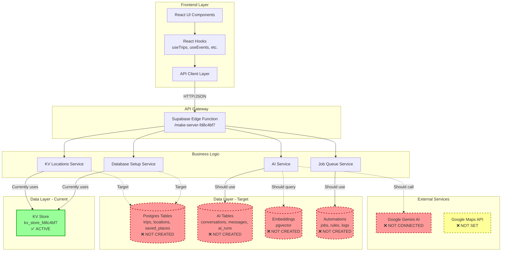

---

## Database Schema Relationships

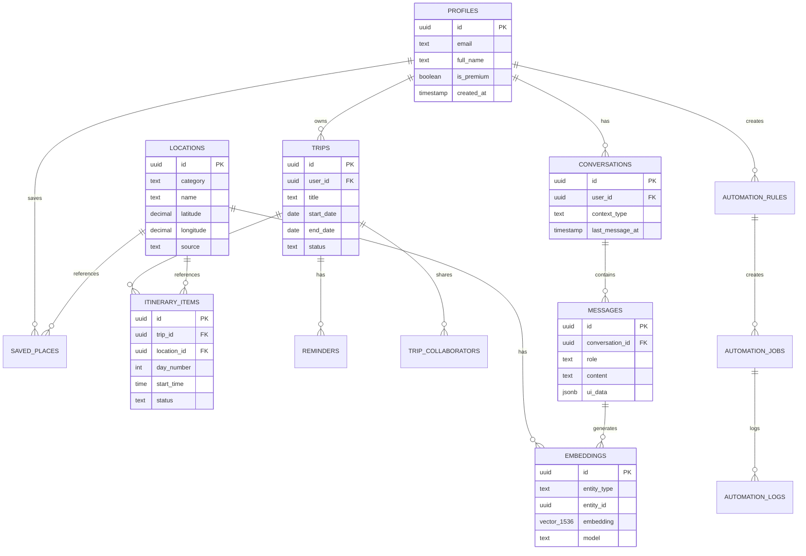

**Legend:**
- ✅ **Green**: Currently implemented (KV store)
- ❌ **Red dashed**: Schema defined, not created
- 🔵 **Solid lines**: Foreign key relationships

---

## Request Flow Diagrams

### Trip Creation Flow

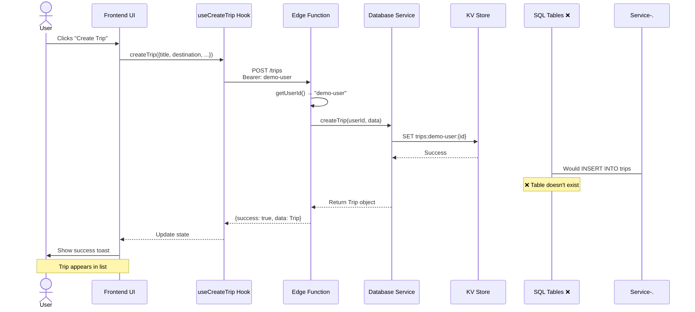

### AI Chat Flow (Current)

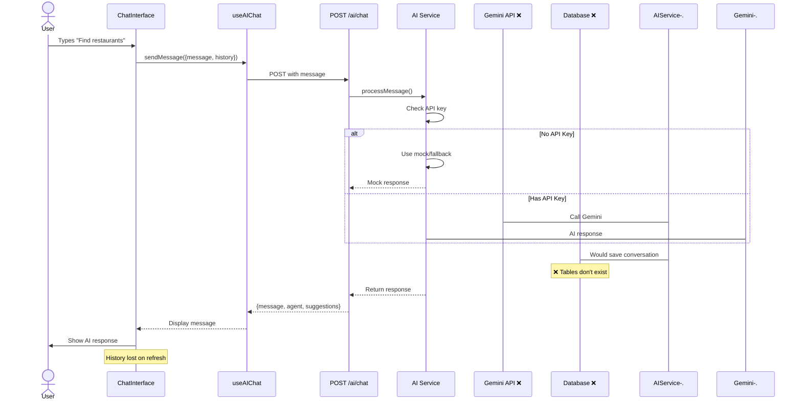

### Reminder Automation Flow (Target)

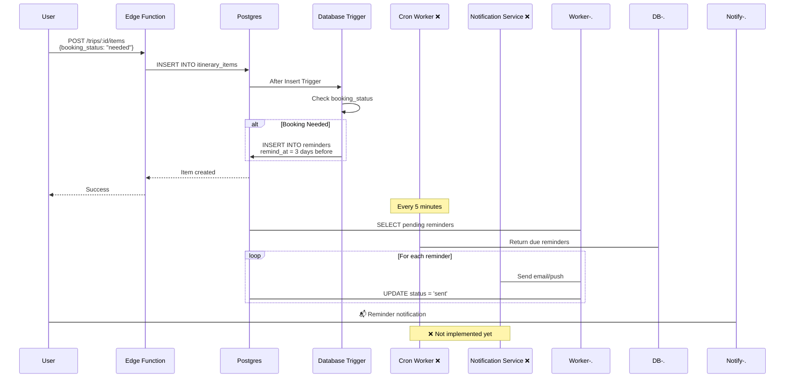

---

## Data Storage: Current vs Target

### Current State (KV Store)

```
kv_store_fd8c4bf7
├── trips:demo-user:trip-1        → {id, title, destination, ...}
├── trips:demo-user:trip-2        → {id, title, destination, ...}
├── trip_items:trip-1:item-1      → {id, title, day, type, ...}
├── trip_items:trip-1:item-2      → {id, title, day, type, ...}
├── saved:demo-user:place-1       → {id, title, location, ...}
├── user_prefs:demo-user          → {travel_style, interests, ...}
├── location:event:{id}           → {name, description, date, ...}
├── location:restaurant:{id}      → {name, cuisine, rating, ...}
├── location:rental:{id}          → {name, type, price, ...}
├── location:index:event          → [id1, id2, id3]
├── location:index:restaurant     → [id1, id2, id3]
└── location:index:rental         → [id1, id2, id3]
```

**Pros:**
- ✅ Works immediately
- ✅ No migration needed
- ✅ Simple key-value access

**Cons:**
- ❌ No relationships
- ❌ No indexes
- ❌ No RLS (security risk)
- ❌ No transactions
- ❌ Difficult to query

### Target State (SQL Tables)

```
Postgres Database
├── Core Tables
│   ├── profiles (users)
│   ├── trips
│   ├── itinerary_items
│   ├── saved_places
│   ├── collections
│   └── locations
├── AI Tables
│   ├── conversations
│   ├── messages
│   └── ai_runs
├── Advanced Tables
│   ├── embeddings (pgvector)
│   ├── web_sources
│   ├── automation_rules
│   ├── automation_jobs
│   └── automation_logs
└── Auxiliary
    ├── reminders
    └── trip_collaborators
```

**Pros:**
- ✅ RLS security
- ✅ Foreign keys
- ✅ Indexes for performance
- ✅ ACID transactions
- ✅ Complex queries
- ✅ Vector search (embeddings)

**Cons:**
- ⚠️ Requires migration
- ⚠️ More complex queries

---

## Authentication Flow

### Current (Demo Mode)

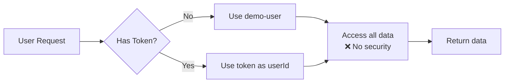

### Target (Supabase Auth)

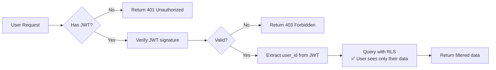

---

## AI Agent Architecture

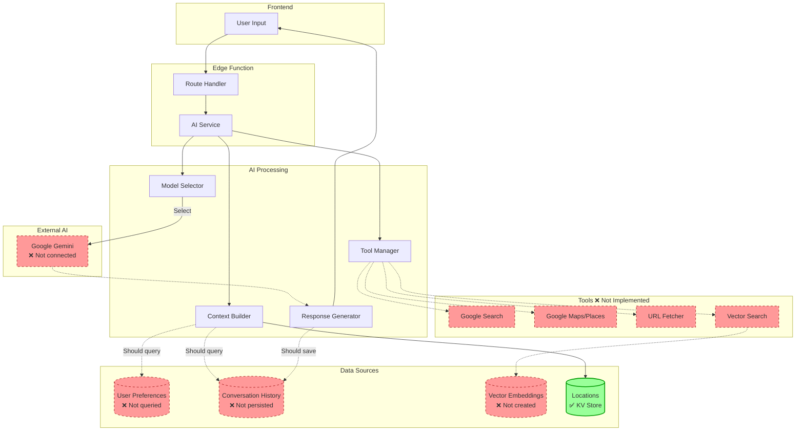

---

## Automation Job Queue

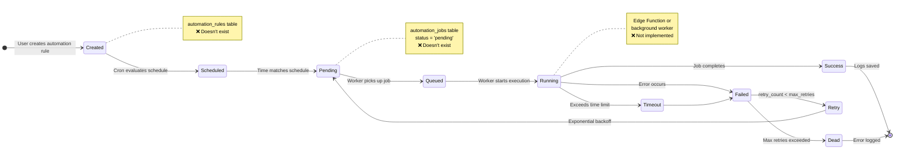

---

## Performance: Current vs Target

### Query Performance Comparison

| Operation | Current (KV) | Target (SQL) | Improvement |
|-----------|--------------|--------------|-------------|
| Get user trips | O(n) scan | O(log n) index | 10-100x faster |
| Search locations | O(n) filter | O(log n) index | 10-100x faster |
| Get trip items | O(1) key lookup | O(log n) index | Similar |
| Semantic search | ❌ Not possible | O(log n) vector | New capability |
| Complex joins | ❌ Not possible | O(n*log n) | New capability |

### Scalability

```
Current System (KV):
├── 100 users → Works fine
├── 1,000 users → Slower, manageable
├── 10,000 users → Very slow
└── 100,000 users → ❌ Not feasible

Target System (SQL + Indexes + RLS):
├── 100 users → Very fast
├── 1,000 users → Fast
├── 10,000 users → Good
├── 100,000 users → Manageable
└── 1,000,000 users → ✅ Scales with optimization
```

---

## Security Model

### RLS Policy Example

```sql
-- trips table policy
CREATE POLICY "Users can view own trips"
ON trips FOR SELECT
USING (auth.uid() = user_id OR auth.uid() = owner_id OR auth.uid() = ANY(collaborators));

-- This policy automatically filters queries:
SELECT * FROM trips;  -- User A sees only their trips
                      -- User B sees different set
                      -- Admin sees nothing (not in policy)
```

### Security Layers

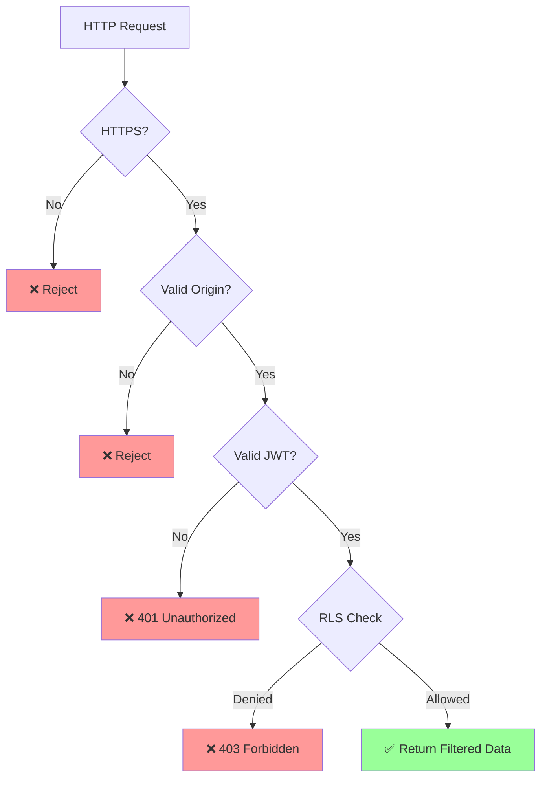

---

## Migration Strategy

### Option A: Gradual (Recommended)

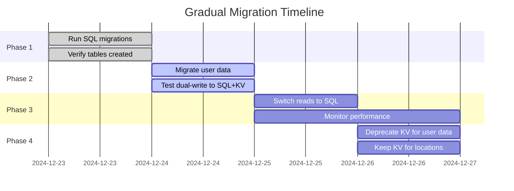

### Option B: Big Bang (Risky)

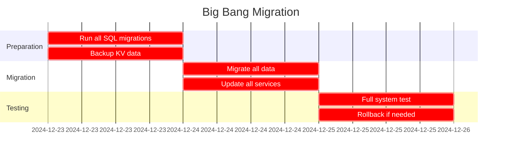

**Recommendation:** Use Option A (Gradual) to minimize risk

---

## Monitoring Dashboard (Target)

```
┌─────────────────────────────────────────────────────────────┐
│ Local Scout - System Health Dashboard                      │
├─────────────────────────────────────────────────────────────┤
│                                                             │
│ Database Status:                  API Performance:         │
│ • Connections: 15/100 ✅          • Avg response: 45ms ✅  │
│ • Query time: 12ms ✅             • P95 response: 89ms ✅  │
│ • Table size: 2.3GB ✅            • Error rate: 0.02% ✅   │
│                                                             │
│ AI Service:                       Automations:             │
│ • Conversations: 1,234 ✅         • Pending jobs: 5 ✅     │
│ • Messages today: 5,678 ✅        • Success rate: 98% ✅   │
│ • Avg latency: 1.8s ✅            • Failed jobs: 3 ⚠️      │
│ • Cost today: $12.34 ✅                                     │
│                                                             │
│ Embeddings:                       Users:                   │
│ • Total vectors: 45,678 ✅        • Active: 234 ✅         │
│ • Search latency: 23ms ✅         • Signups today: 12 ✅   │
│ • Cache hit rate: 87% ✅          • Premium: 45 ✅         │
│                                                             │
└─────────────────────────────────────────────────────────────┘
```

**Status:** ❌ Not implemented - no monitoring in place

---

## Next Steps Checklist

### Week 1: Foundation
- [ ] Day 1: Run SQL migrations
- [ ] Day 2: Update backend services
- [ ] Day 3: Add AI persistence
- [ ] Day 4: Implement auth
- [ ] Day 5: Testing

### Week 2: Optimization
- [ ] Day 1: Add embeddings
- [ ] Day 2: Set up automations
- [ ] Day 3: Performance tuning
- [ ] Day 4: Monitoring setup
- [ ] Day 5: Production deploy

### Week 3: Polish
- [ ] Day 1: Load testing
- [ ] Day 2: Security audit
- [ ] Day 3: Documentation
- [ ] Day 4: User training
- [ ] Day 5: Launch prep

---

**Reference Documents:**
- Full Analysis: `/docs/roadmap/23-frontend-backend-wiring-analysis.md`
- Quick Summary: `/docs/roadmap/24-wiring-executive-summary.md`
- SQL Schemas: `/supabase/schemas/*.sql`
