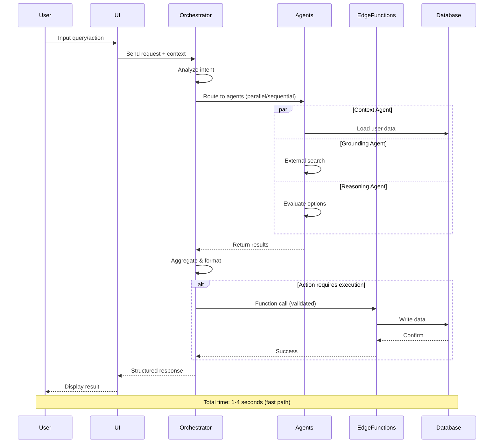
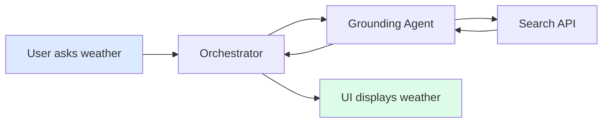
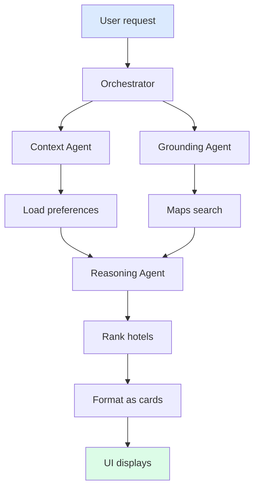
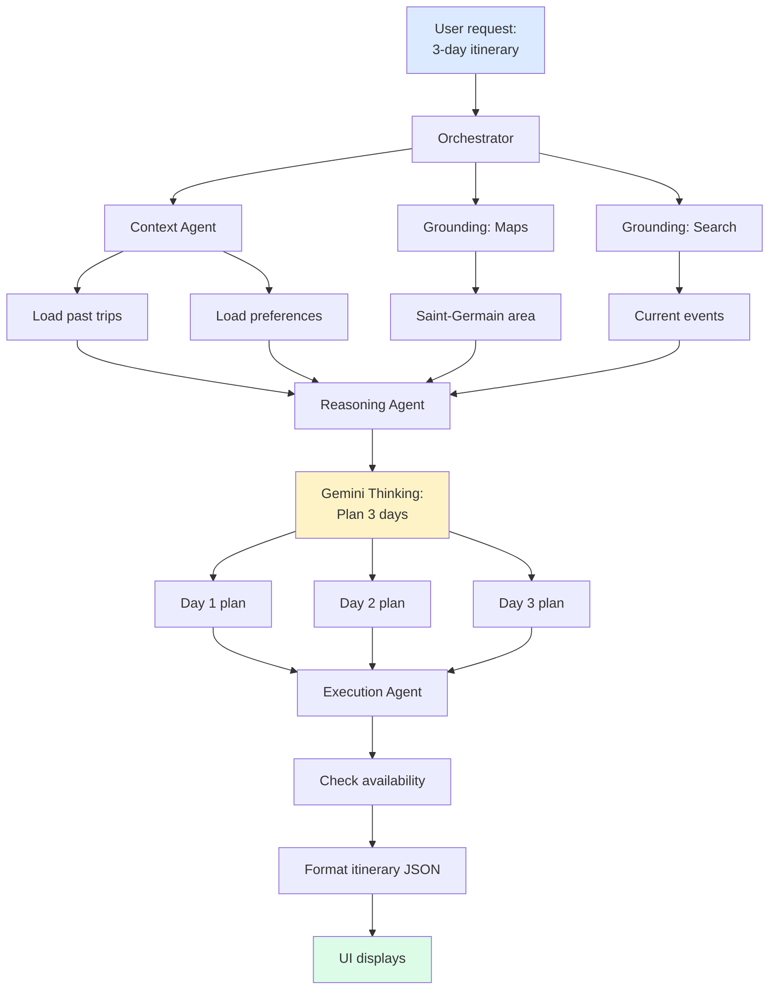
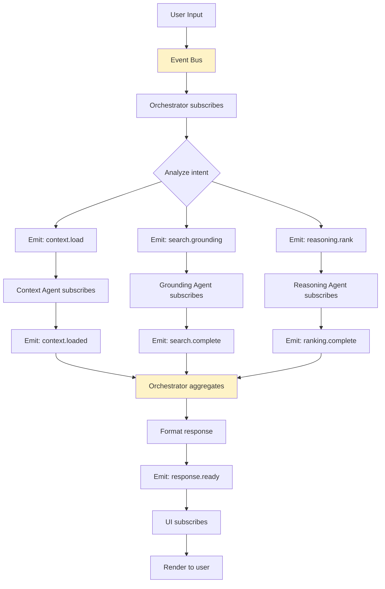
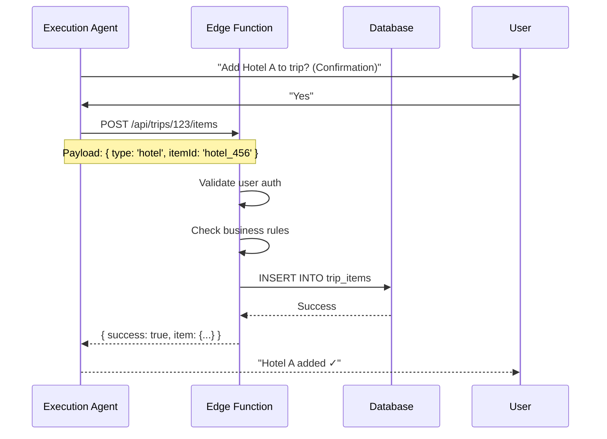

# AI Agents System

**Purpose:** Define how AI works end-to-end in the product  
**Audience:** Designers, engineers, product managers  
**Approach:** Concise, logical, production-ready

---

## SYSTEM OVERVIEW

This product uses **six specialized AI agents** working through an **event bus** to automate travel planning. Each agent has a specific role. They communicate through structured messages and are orchestrated by a central coordinator.

**Core Principle:** AI assists and automates, but the backend enforces all rules. The user always has final control.

---

## AI MODEL STRATEGY

### When to Use Which Gemini Capability

| Capability | When to Use | Why | Example |
|------------|-------------|-----|---------|
| **Gemini 3 Flash** | UI responses, chat, quick help | Fast, low latency | Answering "What's the weather?" |
| **Gemini 3 Pro** | Multi-step planning, reasoning | Deep thinking, complex logic | Planning a 7-day itinerary |
| **Gemini Thinking** | Decision trees, trade-offs | Structured reasoning process | Choosing between 3 hotels |
| **Function Calling** | Backend actions (book, save, update) | Safe, validated execution | Adding item to trip |
| **Structured Outputs** | Database writes, UI updates | Predictable, typed responses | Creating itinerary JSON |
| **Search Grounding** | Live events, current prices | Fresh external data | "Find concerts this weekend" |
| **Maps Grounding** | Location queries, directions | Geo-aware responses | "Hotels near Eiffel Tower" |
| **File Search (RAG)** | User docs, past trips, preferences | Internal knowledge retrieval | "Show my saved Paris spots" |
| **URL Context** | Linked content (blogs, reviews) | Understanding external pages | "Add this restaurant to trip" |
| **Interactions API** | Multi-turn workflows | Stateful conversations | Booking flow with confirmations |
| **Deep Research** | Long-running analysis | Complex queries (5-10 min) | "Compare all beach resorts in Bali" |
| **Code Execution** | Calculations, validations | Math, data transformation | "Calculate total trip cost" |

**Decision Matrix:**

```
User Query → Orchestrator analyzes intent
    ↓
Is it simple fact?        → Flash (fast response)
Does it need reasoning?   → Pro (plan first)
Does it need live data?   → Pro + Search Grounding
Does it need location?    → Pro + Maps Grounding
Does it modify data?      → Pro + Function Calling
Does it need user docs?   → Pro + RAG
Is it multi-step?         → Pro + Interactions API
Is it complex research?   → Deep Research (async)
```

---

## CORE AI AGENTS

### 1. Orchestrator Agent

**Role:** Traffic controller for all AI requests

**Trigger:** Every user input (chat, search, action)

**Input:**
- User query (text, voice)
- Session context (location, preferences, current trip)
- UI state (what's visible, what user just did)

**Action:**
1. Analyze intent (question vs. command vs. exploration)
2. Determine required agents (1-6 agents)
3. Sequence execution order
4. Aggregate results
5. Format for UI

**Output:**
- Agent execution plan
- Routed messages to specific agents

**Model:** Gemini 3 Pro (reasoning required)

**Example:**
```
User: "Find me a romantic dinner spot in Paris tomorrow night"

Orchestrator reasoning:
1. Intent: Restaurant recommendation
2. Constraints: Paris, romantic, tomorrow night
3. Agents needed:
   - Context Agent (load Paris trip, preferences)
   - Search Agent (find restaurants)
   - Reasoning Agent (rank by "romantic" + preferences)
   - Booking Agent (check availability)
4. Sequence: Context → Search → Reasoning → Booking
```

---

### 2. Context & Memory Agent

**Role:** Maintain conversation continuity and user state

**Trigger:** Before every agent execution

**Input:**
- User ID
- Session ID
- Current conversation thread

**Action:**
1. Load user profile (preferences, past trips, saved places)
2. Retrieve conversation history (last 10 exchanges)
3. Extract relevant context (e.g., "Paris trip Dec 15-20")
4. Provide to other agents

**Output:**
- Enriched context object
- Prevents redundant questions

**Model:** Gemini 3 Flash + RAG (file search on user data)

**Example:**
```
User: "Show me hotels"

Without Context Agent:
AI: "Where are you traveling?"

With Context Agent:
AI: "Here are hotels in Paris for Dec 15-20 (from your active trip):"
```

---

### 3. Retrieval (RAG) Agent

**Role:** Pull internal and external knowledge

**Trigger:** When query needs facts not in model training data

**Input:**
- User query
- Search scope (user docs, public guides, reviews)

**Action:**
1. Embed query into vector
2. Search knowledge base (user's saved data + public guides)
3. Retrieve top 5 relevant chunks
4. Ground AI response with citations

**Output:**
- Relevant documents/snippets
- Source citations

**Model:** Gemini 3 Pro + File Search (RAG)

**Example:**
```
User: "What did I like about my last Tokyo trip?"

RAG Agent:
1. Searches user's past trip notes
2. Finds: "Loved the ramen at Ichiran, Shinjuku. 5-star experience."
3. Returns: "You loved the ramen at Ichiran in Shinjuku (from your Feb 2024 trip)."
```

---

### 4. Reasoning Agent

**Role:** Evaluate options, make trade-off decisions

**Trigger:** When multiple choices exist

**Input:**
- Set of options (e.g., 10 hotels)
- User preferences (budget, location, style)
- Constraints (dates, availability)

**Action:**
1. Score each option against preferences
2. Explain trade-offs
3. Rank recommendations
4. Provide rationale

**Output:**
- Ranked list with confidence scores
- Explanation of reasoning

**Model:** Gemini 3 Pro + Thinking (structured reasoning)

**Example:**
```
User: "Choose between Hotel A ($300, downtown) and Hotel B ($200, suburbs)"

Reasoning Agent (Gemini Thinking):
1. User preference: Prefers walkability (weight: 0.8)
2. Budget concern: Medium (weight: 0.5)
3. Score Hotel A: 0.8 (location) - 0.3 (price) = 0.5
4. Score Hotel B: 0.2 (location) + 0.5 (price) = 0.7

Wait, reverse logic. User values walkability highly.
- Hotel A: High walkability (0.9), Higher price (0.6) → 0.75
- Hotel B: Low walkability (0.3), Lower price (0.9) → 0.6

Recommendation: Hotel A (better walkability aligns with user priority)
```

---

### 5. Execution Agent

**Role:** Perform actions that modify system state

**Trigger:** User confirms an action (book, save, delete)

**Input:**
- Action intent (validated by user)
- Required parameters (itemId, date, quantity)
- User authorization token

**Action:**
1. Validate action is safe (no destructive side effects)
2. Call Edge Function via function calling
3. Handle errors gracefully
4. Confirm success

**Output:**
- Success/failure status
- Updated data
- UI feedback message

**Model:** Gemini 3 Pro + Function Calling

**Example:**
```
User: "Add this hotel to my trip"

Execution Agent:
1. Extract hotel ID, trip ID
2. Call Edge Function: POST /api/trips/{tripId}/items
3. Payload: { type: 'hotel', itemId: 'hotel_123', dates: [...] }
4. Backend validates, writes to DB
5. Returns: { success: true, item: {...} }
6. UI updates with confirmation toast
```

---

### 6. Grounding Agent (External Data)

**Role:** Fetch live, external information

**Trigger:** When query needs current data

**Input:**
- Search query
- Data source (Google Search, Google Maps)

**Action:**
1. Determine data source
2. Execute grounded search
3. Filter results
4. Return structured data

**Output:**
- Live data (events, prices, reviews, locations)

**Model:** Gemini 3 Pro + Search Grounding + Maps Grounding

**Example:**
```
User: "Are there any jazz concerts in New Orleans this weekend?"

Grounding Agent:
1. Uses Search Grounding
2. Query: "jazz concerts New Orleans [current_date + 2 days]"
3. Returns: [
     { name: "Preservation Hall", date: "Sat 8pm", price: "$30" },
     { name: "Snug Harbor", date: "Sun 7pm", price: "$25" }
   ]
4. AI formats for UI
```

---

## UI ↔ AI ↔ BACKEND ARCHITECTURE

### System Flow



### Component Responsibilities

**Frontend (UI):**
- Capture user input (chat, clicks, forms)
- Show loading states
- Display AI responses
- Handle user confirmations before actions

**Orchestrator:**
- Parse intent
- Route to agents
- Coordinate execution
- Format responses

**AI Agents:**
- Specialized tasks (context, search, reasoning, execution, grounding)
- Stateless (no memory between requests)
- Communicate via event bus

**Edge Functions:**
- Execute backend actions
- Enforce business rules
- Validate permissions
- Write to database

**Database:**
- Store user data (trips, preferences, history)
- Provide vector search (RAG)
- Maintain state

---

## WORKFLOWS

### Simple Workflow: Single Action

**User Action:** "What's the weather in Paris tomorrow?"

**AI Reasoning:**
1. Orchestrator: Intent = weather query
2. Grounding Agent: Use Search Grounding
3. Query: "weather Paris [tomorrow's date]"
4. Return: "Sunny, 72°F, 10% rain"

**Tools Used:**
- Gemini 3 Flash (fast response)
- Search Grounding

**Result:**
- UI shows weather card
- Time: <1 second

**Diagram:**


---

### Medium Workflow: Plan + Execute

**User Action:** "Find a hotel in Paris under $200/night for Dec 15-20, near the Louvre"

**AI Reasoning:**
1. Orchestrator: Intent = hotel search with constraints
2. Context Agent: Load user preferences (style, past stays)
3. Grounding Agent: Search hotels via Maps Grounding
   - Query: "hotels near Louvre Paris"
   - Filter: price ≤ $200, dates Dec 15-20
4. Reasoning Agent: Rank by distance + reviews + user style
5. Return top 3 options

**Tools Used:**
- Gemini 3 Pro (reasoning)
- Maps Grounding (location)
- RAG (user preferences)
- Structured Outputs (hotel cards)

**Result:**
- UI shows 3 hotel cards
- Each with: image, price, distance, reviews, "Add to trip" button
- Time: 2-3 seconds

**Diagram:**


---

### Complex Workflow: Multi-Agent + Grounding

**User Action:** "Plan a 3-day Paris itinerary focused on art and food, staying near Saint-Germain"

**AI Reasoning:**
1. Orchestrator: Intent = multi-day planning
2. Context Agent: Load user profile
   - Past trips: Loved museums, Michelin restaurants
   - Budget: Mid-range ($150-300/day)
3. Grounding Agent (Maps): Find area boundaries (Saint-Germain)
4. Grounding Agent (Search): Current events, exhibitions
5. Reasoning Agent:
   - Day 1: Louvre (morning), lunch at bistro, Musée d'Orsay (afternoon)
   - Day 2: Rodin Museum, Seine walk, dinner reservation
   - Day 3: Marais galleries, food market, wine tasting
6. Execution Agent: Pre-check restaurant availability
7. Return structured itinerary

**Tools Used:**
- Gemini 3 Pro (orchestration + reasoning)
- Gemini Thinking (day-by-day planning)
- Maps Grounding (locations)
- Search Grounding (events)
- RAG (user preferences)
- Function Calling (check availability)
- Structured Outputs (itinerary JSON)

**Result:**
- UI shows day-by-day itinerary
- Each item: time, place, description, map pin
- "Save to trip" button
- Time: 4-6 seconds

**Diagram:**


---

## REAL-WORLD EXAMPLES

### Example 1: Location-Based Recommendation

**Scenario:** User is walking through Rome and asks, "What's nearby?"

**AI Process:**
1. UI sends GPS coordinates + query
2. Context Agent: Load user preferences (likes history, avoids crowds)
3. Grounding Agent (Maps): Search "attractions near [lat,lng]"
4. Returns: Pantheon (200m), Trevi Fountain (500m), Piazza Navona (300m)
5. Reasoning Agent: Filter by "less crowded" (time of day)
6. Recommend: "Pantheon is 200m away and less crowded at 4pm"

**Time Saved:** 10 minutes of manual searching

**Clarity Gained:** Personalized to user's "avoid crowds" preference

**Tools:** Maps Grounding + RAG + Reasoning

---

### Example 2: Document Analysis with RAG

**Scenario:** User uploads PDF of hotel confirmation, asks "When is check-in?"

**AI Process:**
1. File uploaded to Edge Function
2. RAG Agent: Extract text from PDF, embed, store
3. User query: "When is check-in?"
4. RAG searches PDF content
5. Finds: "Check-in: 3:00 PM, December 15, 2024"
6. Returns structured answer

**Time Saved:** 2 minutes of manual reading

**Clarity Gained:** Instant answer with source citation

**Tools:** File Search (RAG) + Gemini 3 Flash

---

### Example 3: Multi-Step Automation

**Scenario:** User says "Book the hotel we discussed earlier and add it to my trip"

**AI Process:**
1. Context Agent: Retrieve conversation history
2. Find hotel mentioned 3 messages ago: "Hotel Artemide, Rome"
3. Reasoning Agent: Confirm it matches intent
4. Execution Agent: Function call to booking API
5. Execution Agent: Function call to add item to trip
6. Both succeed
7. Return: "Hotel Artemide booked for Dec 15-20 and added to your Rome trip ✓"

**Time Saved:** 5 minutes of navigating booking flow

**Clarity Gained:** No repeated input, context remembered

**Tools:** Context + RAG + Function Calling + Structured Outputs

---

## PROMPT ENGINEERING RULES

### How Prompts Are Written

**1. Goal-First**

❌ Bad:
```
"You are a helpful travel assistant."
```

✅ Good:
```
"Your goal: Recommend 3 hotels that match the user's budget, location preference, and style. Prioritize walkability to attractions."
```

**2. Explicit Inputs**

Always provide:
- User query
- User context (preferences, past behavior)
- Constraints (budget, dates, location)
- Output format (JSON schema)

Example:
```
Input:
- Query: "Find a romantic restaurant"
- User preferences: { cuisine: ["Italian", "French"], budget: "$$-$$$" }
- Location: Paris, near user's hotel (Lat: 48.8566, Lng: 2.3522)
- Constraints: Open tonight, reservations available

Output format:
{
  "restaurants": [
    {
      "name": string,
      "cuisine": string,
      "priceRange": string,
      "distance": number (km),
      "reservationUrl": string
    }
  ]
}
```

**3. Structured Outputs**

Use Gemini's Structured Output mode:
- Define JSON schema
- Enforce types
- Validate before UI render

**4. Validation Before Execution**

For any action (book, delete, update):
1. Show user a confirmation
2. Explain what will happen
3. Wait for explicit "yes"
4. Then execute via Function Calling

Example:
```
AI: "I found Hotel Artemide for $180/night, Dec 15-20. 
     This will charge your card ending in 1234. 
     Confirm booking?"
     
User: "Yes"

AI: [Calls function: bookHotel()]

AI: "Booked ✓ Confirmation #ABC123 sent to your email."
```

---

## SYSTEM GUARANTEES

### 1. No Execution Without Validation

- All function calls require user confirmation
- No silent actions (no "I booked it for you" without asking)
- Exception: Read-only queries (search, recommend)

### 2. AI Decisions Are Explainable

- Every recommendation includes reasoning
- User can ask "Why did you suggest this?"
- AI shows: preference match score, trade-offs, alternatives

Example:
```
AI: "I recommended Hotel A because:
     ✓ Matches your 'boutique' style preference (90% match)
     ✓ Within budget ($180 vs. $200 max)
     ✓ Walking distance to Louvre (0.5 km)
     ⚠ Slightly higher price than Hotel B, but better location"
```

### 3. Backend Is Authoritative

- AI suggestions are proposals
- Backend enforces:
  - Permissions (can this user book?)
  - Business rules (is hotel available?)
  - Data integrity (valid dates, prices)
- If backend rejects, AI explains why

### 4. User Can Always Override AI

- Every AI action has manual alternative
- User can ignore suggestions
- User can edit AI-generated itineraries
- User can undo AI actions (within policy)

---

## EVENT BUS ARCHITECTURE

### How Agents Communicate



**Benefits:**
- Agents are decoupled (no direct dependencies)
- Easy to add new agents
- Easy to test agents in isolation
- Parallel execution where possible

---

## EDGE FUNCTIONS INTEGRATION

### When AI Calls Edge Functions

**Read-Only (No confirmation needed):**
- `GET /api/trips/:id` → Fetch trip data
- `GET /api/search/hotels` → Search hotels
- `GET /api/user/preferences` → Load preferences

**Write Operations (Confirmation required):**
- `POST /api/trips/:id/items` → Add item to trip
- `DELETE /api/trips/:id/items/:itemId` → Remove item
- `PUT /api/bookings` → Create booking
- `POST /api/share` → Share trip

**Edge Function Flow:**



**Safety Checks in Edge Functions:**
1. User authentication (valid token)
2. Authorization (user owns this trip)
3. Data validation (valid hotel ID, dates)
4. Rate limiting (prevent abuse)
5. Idempotency (don't double-book)

---

## AI FEATURE MATRIX

| Feature | AI Agent(s) | Gemini Capability | Edge Function | User Benefit |
|---------|-------------|-------------------|---------------|--------------|
| Chat Q&A | Orchestrator, Context | Flash + RAG | None | Instant answers |
| Hotel search | Grounding, Reasoning | Pro + Maps | None | Personalized results |
| Itinerary builder | Orchestrator, Reasoning | Pro + Thinking | None | Multi-day plans |
| Add to trip | Execution | Pro + Function Call | POST /trips/:id/items | One-click save |
| Document upload | RAG | Pro + File Search | POST /documents | Auto-extract info |
| Price alerts | Grounding, Execution | Pro + Search + Function Call | POST /alerts | Notify on price drop |
| Group voting | Orchestrator, Reasoning | Pro + Interactions API | PUT /trips/:id/votes | Consensus building |
| Weather-aware | Grounding, Reasoning | Pro + Search | None | Adaptive suggestions |

---

## SUCCESS CRITERIA

### Designer Perspective

- [ ] I understand where AI appears in the UI (chat, cards, suggestions)
- [ ] I know what loading states to design (typing indicator, skeleton cards)
- [ ] I know what confirmation flows to design (modals, inline confirmations)
- [ ] I understand AI can fail and need error states

### Backend Engineer Perspective

- [ ] I understand when AI can call my Edge Functions
- [ ] I know AI never bypasses validation
- [ ] I know how to structure function call schemas
- [ ] I understand the event bus pattern

### AI Engineer Perspective

- [ ] I understand each agent's role and trigger
- [ ] I know when to use Flash vs. Pro vs. Thinking
- [ ] I know how to use grounding safely
- [ ] I understand prompt structure and validation

### Product Perspective

- [ ] The system feels coherent, not magical
- [ ] Users understand what AI can and can't do
- [ ] AI speeds up workflows without removing control
- [ ] Every AI action is explainable

---

## ANTI-PATTERNS (AVOID)

❌ **Silent Actions**
```
Bad: AI books hotel without asking
Good: AI shows booking, waits for confirmation
```

❌ **Opaque Reasoning**
```
Bad: "I chose Hotel A for you."
Good: "I chose Hotel A because it's 0.5km from Louvre (your priority) and within budget."
```

❌ **Ignoring Context**
```
Bad: Asking user's budget every time
Good: Remember budget from profile, confirm if changed
```

❌ **No Fallback**
```
Bad: AI fails → blank screen
Good: AI fails → show manual search option
```

❌ **Over-Automation**
```
Bad: AI changes itinerary without asking
Good: AI suggests changes, user approves
```

---

## PRODUCTION CHECKLIST

```
AI AGENTS
[ ] All 6 agents defined and implemented
[ ] Event bus configured
[ ] Agent roles documented
[ ] Error handling for each agent

GEMINI INTEGRATION
[ ] Flash for fast queries (<1s)
[ ] Pro for reasoning (2-4s)
[ ] Thinking for complex decisions
[ ] Function calling with validation
[ ] Structured outputs enforced
[ ] Search grounding rate-limited
[ ] Maps grounding tested
[ ] RAG with user data working

EDGE FUNCTIONS
[ ] Read endpoints callable by AI
[ ] Write endpoints require confirmation
[ ] All endpoints validate auth
[ ] All endpoints return structured JSON
[ ] Error responses are AI-readable

UI INTEGRATION
[ ] Chat interface connected
[ ] Loading states for all AI actions
[ ] Confirmation modals for writes
[ ] Error states with fallback options
[ ] Explainability UI (show reasoning)

SAFETY & QUALITY
[ ] No silent actions
[ ] All AI decisions explainable
[ ] User can override AI
[ ] Reduced motion for animations
[ ] Accessibility (screen reader support)
[ ] Rate limiting on AI calls
[ ] Cost monitoring (Gemini API usage)
```

---

**END OF DOCUMENT**

This system is production-ready when:
1. Every AI feature maps to a clear agent
2. Every agent has a defined trigger and output
3. UI and backend trust each other
4. Users feel empowered, not replaced
