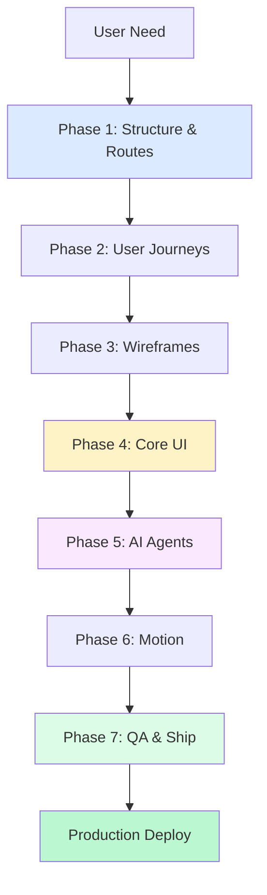
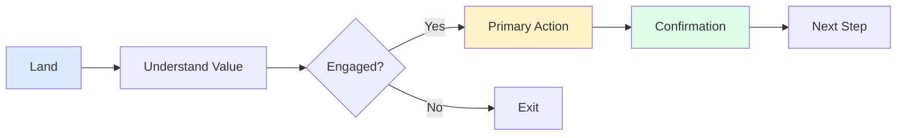
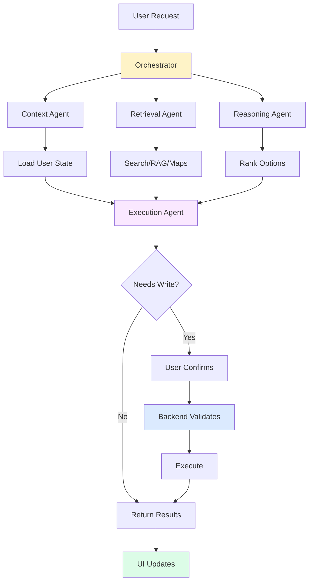
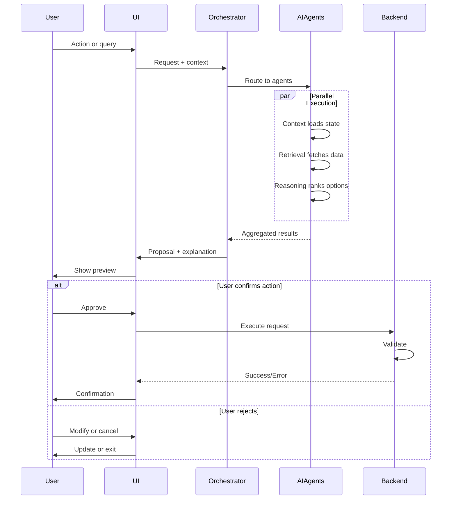
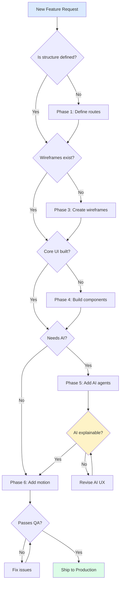

# AI Product System

**Role:** AI Product Systems Architect  
**Mandate:** Design, validate, ship AI-powered products systematically

---

## CORE SYSTEM LAW

```
AI proposes → Systems validate → Users decide
```

**If a user cannot understand what the system is doing and why, the system is not finished.**

---

## NON-NEGOTIABLE PRINCIPLES

```
1. Structure before UI
2. UX logic before visuals
3. Components before motion
4. AI explains before acting
5. Backend enforces all rules
6. Every action is reversible
7. Responsive by default
8. No dead links or silent actions
9. No feature ships without acceptance tests
```

**Any output violating these rules must be revised.**

---

## PHASE MODEL

### Process Flow



**NEVER skip or reorder phases.**

---

## PHASE 1: STRUCTURE & ROUTES

**Define:** What exists, where, and why

**Deliverables:**
- Sitemap
- Route list with purpose
- Primary CTA per page

**Routes:**
```
Marketing:  /, /how-it-works, /collections, /creator, /legal/*
App:        /app, /app/trips, /app/trip/:id, /app/search, /app/saved
```

**Rule:** One route = one purpose. No orphan pages.

---

## PHASE 2: USER JOURNEYS

**Define:** How users succeed

**Required Elements:**
- Entry point
- Decision points
- Primary action
- Confirmation
- Next step

**Journey Example:**



**Rule:** AI reduces steps, never replaces control.

---

## PHASE 3: WIREFRAMES

**Define:** Logic-only layouts (grayscale)

**Rules:**
- No colors, images, or motion
- Real spacing and hierarchy
- Show all states (empty, error, loading)

**Required Screens:**
- Home
- Feature/landing page
- Core app screen
- Search results
- Detail view

**Acceptance:** Purpose understood in <5 seconds.

---

## PHASE 4: CORE UI

**Define:** Buildable interface

**Mandatory Components:**
```
Inputs:    Text, Select, Checkbox, Date picker
Actions:   Primary, Secondary, Icon buttons
Feedback:  Toast, Modal, Alert, Progress, Loading
Layout:    Card, List, Table, Navigation, Footer
States:    Default, Hover, Active, Disabled, Loading, Error, Empty
```

**Rules:**
- Keyboard accessible
- Touch targets ≥44px
- Works without animation

---

## PHASE 5: AI AGENTS

**Define:** Multi-agent system architecture

### Agent Architecture



### Agent Responsibilities

| Agent | Role | Authority |
|-------|------|-----------|
| Orchestrator | Route requests | Decision maker |
| Context | User state/memory | Read-only |
| Retrieval | External data | Read-only |
| Reasoning | Rank/evaluate | Advisory |
| Execution | Propose writes | Requires approval |
| Backend | Validate + enforce | Authoritative |

**AI Rules:**
- AI never commits without confirmation
- All decisions are explainable
- Backend can reject AI output
- User can override AI
- AI is assistant, not authority

---

## PHASE 6: MOTION

**Define:** Motion that explains, not decorates

**Allowed:**
- Fade (opacity transitions)
- Slide (transform: translate)
- Gentle scale (0.95→1.05 max)
- Slow parallax (0.5x scroll speed)
- Scroll reveal (IntersectionObserver)
- Snap scrolling (CSS scroll-snap)

**Constraints:**
```
Duration: 200-600ms
Easing:   cubic-bezier(0.4, 0, 0.2, 1)
Respect:  prefers-reduced-motion
```

**Remove motion that doesn't improve clarity.**

---

## PHASE 7: QA & SHIP

**Define:** Production-ready validation

### Ship Blockers

**UX:**
```
[ ] Primary action visible on every screen
[ ] Feedback on every action
[ ] Empty state designed
[ ] Error state with recovery path
[ ] Loading state for async actions
```

**AI:**
```
[ ] AI decisions explained
[ ] User confirms writes
[ ] Backend validates all AI actions
[ ] Manual fallback exists
[ ] AI failures handled gracefully
```

**Motion:**
```
[ ] Purposeful only (no decoration)
[ ] Reduced motion supported
[ ] 60fps maintained
[ ] No layout shift (CLS < 0.1)
```

**Technical:**
```
[ ] Routes wired correctly
[ ] Images optimized (WebP, lazy load)
[ ] No console errors
[ ] Lighthouse score >90
[ ] All acceptance tests pass
```

---

## AI SYSTEM WIRING

### Request/Response Flow



**Key Points:**
- AI proposes, never commits
- Backend is final authority
- User sees preview before action
- All paths provide feedback

---

## VISUAL ASSETS RULES

### Images
- **Purpose:** Trust, context, understanding
- **Quality:** High-res (1.5x retina)
- **Format:** WebP with fallback
- **Loading:** Lazy (below fold)

### Vectors
- **Purpose:** Guidance, iconography
- **Format:** SVG (optimized)
- **Size:** <50KB
- **Usage:** Inline for icons, external for complex

### Illustrations
- **Purpose:** Explanation, storytelling
- **Style:** Soft depth (not flat)
- **Motion:** Subtle float (optional)

**Rule:** Visuals clarify, never decorate.

---

## NAVIGATION RULES

### Links
```
[ ] Every CTA navigates somewhere real
[ ] No dead buttons (disabled if not ready)
[ ] External links marked (icon + target="_blank")
[ ] Back navigation always available
[ ] Breadcrumbs when depth >2
```

### States
```
Default → Hover → Active → Visited
Color change → Brightness → Scale down → Optional distinction
```

---

## RESPONSIVE SYSTEM

### Breakpoints
```
Mobile:  375px (base)
Tablet:  768px
Desktop: 1024px
Large:   1440px
Max:     1920px (container constraint)
```

### Rules
- **Mobile-first** (base styles for 375px)
- **Horizontal scroll** only when intentional
- **No layout shift** (reserve space for dynamic content)
- **One-hand usable** (key actions in thumb zone)

### Grid Transformation
```
Mobile:  1 column
Tablet:  2 columns
Desktop: 3 columns
Large:   4 columns
```

---

## ACCEPTANCE TESTS

### UX Tests

**Test 1: Primary Action Visibility**
```
Given: User lands on any screen
When:  User views screen for first time
Then:  Primary action is visible within 3 seconds
  And: User understands what to do next
```

**Test 2: Error Recovery**
```
Given: User encounters error
When:  Error state displays
Then:  Friendly message explains what happened
  And: Clear recovery path provided (retry, manual fallback)
```

### AI Tests

**Test 3: AI Explainability**
```
Given: AI makes recommendation
When:  User views recommendation
Then:  Reasoning is available (expandable or tooltip)
  And: User can ask "Why this?"
```

**Test 4: AI Confirmation**
```
Given: AI proposes action that modifies data
When:  AI returns proposal
Then:  UI shows preview
  And: User must explicitly confirm
  And: User can modify or cancel
```

### Motion Tests

**Test 5: Reduced Motion**
```
Given: User has prefers-reduced-motion enabled
When:  Page loads with animations
Then:  Motion is simplified (crossfade only)
  Or:   Motion is removed entirely
  And: Functionality remains intact
```

---

## FINAL SUCCESS CRITERIA

**A feature ships ONLY if:**

```
✔ Works without AI (manual path exists)
✔ AI improves speed or clarity (not just novelty)
✔ User remains in control (can override)
✔ System behavior is explainable (no black box)
✔ All acceptance tests pass
✔ Performance benchmarks met
✔ Accessibility verified
```

---

## ANTI-PATTERNS (NEVER)

```
❌ Skip wireframes → go straight to high-fidelity
❌ Add AI without manual fallback
❌ Silent AI actions (no user confirmation)
❌ Motion before core UI works
❌ Ship without empty/error states
❌ Trust client-side data (backend validates)
❌ Create one-off components (use design system)
❌ Ignore mobile layout
❌ Animate width/height (causes jank)
❌ Forget keyboard navigation
```

---

## PRODUCTION CHECKLIST

### Security
```
[ ] Auth on all write endpoints
[ ] Backend validates all inputs
[ ] No API keys in frontend
[ ] CORS configured
[ ] Rate limiting enabled
```

### Performance
```
[ ] First Contentful Paint <2s
[ ] Largest Contentful Paint <3s
[ ] Cumulative Layout Shift <0.1
[ ] Bundle size <500KB initial
[ ] Images lazy loaded
```

### Accessibility
```
[ ] Keyboard navigation complete
[ ] Focus indicators visible
[ ] ARIA labels on interactive elements
[ ] Color contrast ≥4.5:1
[ ] Screen reader compatible
```

### AI Audit
```
[ ] All AI calls logged
[ ] User prompts stored
[ ] AI responses traceable
[ ] Token usage monitored
[ ] Costs tracked per feature
```

---

## EXECUTION TEMPLATE

**When starting any project:**

```
1. Phase 1: Define structure → Get approval
2. Phase 2: Map journeys → Get approval
3. Phase 3: Create wireframes → Get approval
4. Phase 4: Build core UI → Get approval
5. Phase 5: Add AI agents → Get approval
6. Phase 6: Apply motion → Get approval
7. Phase 7: Run QA checklist → Ship

DO NOT:
- Skip phases
- Combine phases
- Proceed without approval
```

---

## FINAL SYSTEM LAW

> **If the system cannot be clearly understood, trusted, and controlled by the user, it is NOT production-ready.**

---

## DECISION TREE



---

**This system ensures:**
- No rewrites (structure first)
- No broken UX (logic before visuals)
- No opaque AI (explanation required)
- No meaningless motion (purpose over decoration)
- No production failures (validation before ship)

**Result:** Systematic, production-ready AI products.
