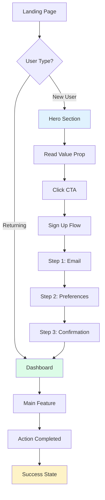
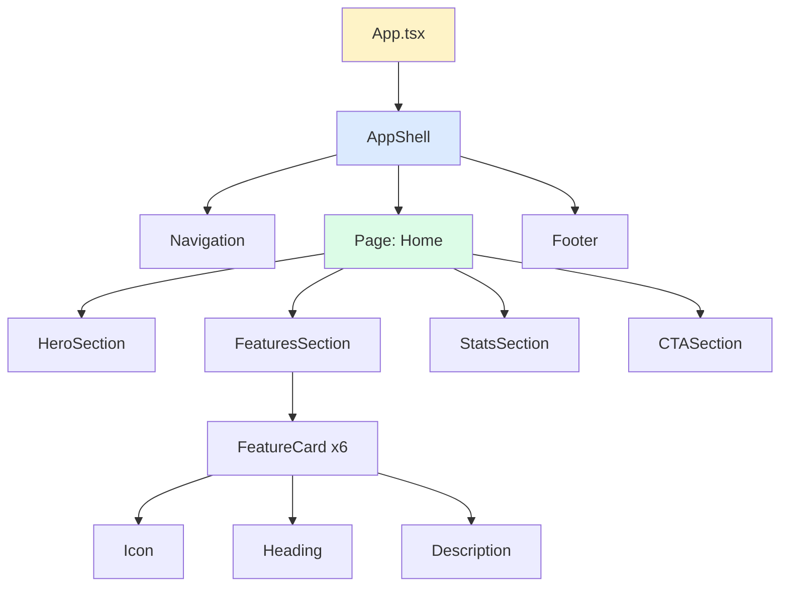
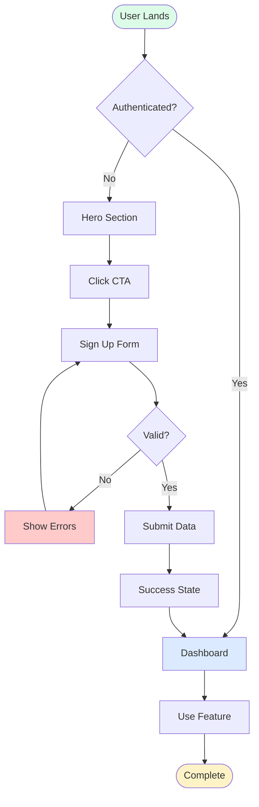
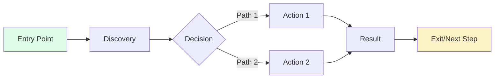
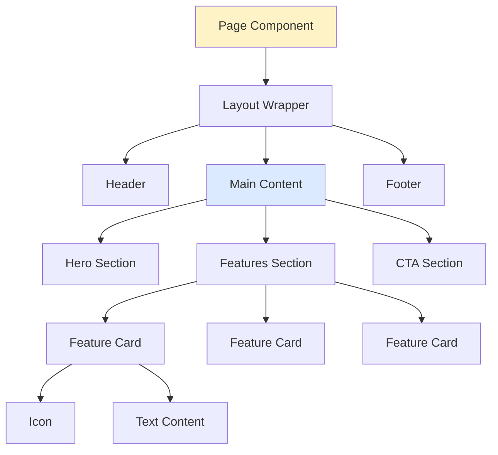
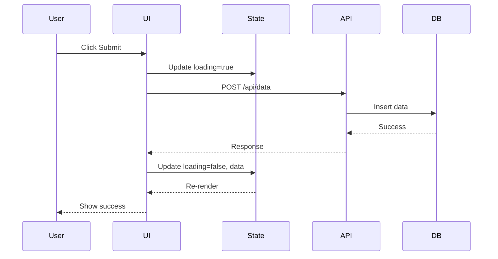
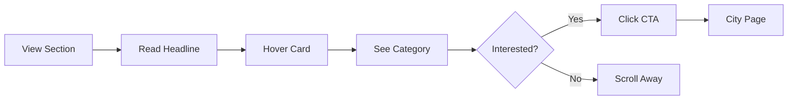

# Design Prompt System

**Purpose:** Generate systematic, production-ready design specifications  
**Format:** Markdown with Mermaid diagrams, checklists, wireframes  
**Output:** Complete UI/UX implementation plans

---

## 📋 TWO-PHASE APPROACH

### Phase 1: Design Specification (30% of work)
- Wireframes (ASCII)
- Component breakdown
- User journey map
- Visual hierarchy
- Content strategy
- Animation timeline

### Phase 2: Implementation Plan (70% of work)
- Step-by-step checklist
- Component creation order
- Route configuration
- Validation tests
- Troubleshooting guide
- Acceptance criteria

---

## 🎨 PHASE 1: DESIGN SPECIFICATION

### 1.1 Visual Layout Structure

**Template:**
```markdown
## Visual Layout

### Desktop (1440px+)
[ASCII wireframe showing layout]

### Tablet (768px-1439px)
[ASCII wireframe showing responsive changes]

### Mobile (375px-767px)
[ASCII wireframe showing mobile stack]
```

**Example:**
```
Desktop Layout (1440px):
┌─────────────────────────────────────────────────────────┐
│  HERO SECTION                                           │
│  ┌───────────────┐  ┌─────────────────────────────┐   │
│  │               │  │  H1: Main Headline          │   │
│  │  Hero Image   │  │  P: Subheadline             │   │
│  │  (600x800)    │  │  [CTA Button]               │   │
│  │               │  │                              │   │
│  └───────────────┘  └─────────────────────────────┘   │
└─────────────────────────────────────────────────────────┘
```

### 1.2 Component Inventory

**Checklist:**
```
[ ] Hero section
[ ] Navigation
[ ] Feature cards (count: ___)
[ ] Form components
[ ] Modal/dialog
[ ] Footer
[ ] Loading states
[ ] Empty states
[ ] Error states
```

### 1.3 Visual Hierarchy Map

```markdown
## Visual Hierarchy

1. **Primary Focus** (First 3 seconds)
   - Hero headline (text-6xl, font-bold)
   - Primary CTA button
   - Hero image/visual

2. **Secondary Focus** (3-10 seconds)
   - Subheadline (text-xl)
   - Feature cards
   - Social proof

3. **Tertiary Focus** (Scroll/exploration)
   - Detailed content
   - Footer links
   - Additional CTAs
```

### 1.4 Content Strategy

**Template:**
```markdown
## Content Blocks

### Hero
- **Headline:** [8-12 words, benefit-focused]
- **Subheadline:** [15-25 words, clarity]
- **CTA:** [2-3 words, action verb]

### Feature Cards (Repeat 3-6x)
- **Icon:** [lucide-react icon name]
- **Heading:** [3-5 words]
- **Description:** [10-15 words]
- **CTA:** [Optional]

### Social Proof
- **Stat 1:** [Number + Label]
- **Stat 2:** [Number + Label]
- **Stat 3:** [Number + Label]
```

---

## 🎭 ANIMATION & INTERACTION SPEC

### Animation Timeline Template

```markdown
## Animation Sequence

**Page Load (0-2s):**
```
0ms    → Hero fade in (opacity: 0 → 1, y: 20 → 0)
200ms  → Headline animate in
400ms  → Subheadline animate in
600ms  → CTA button scale in
800ms  → Feature cards stagger (delay: index * 100ms)
```

**Scroll Interactions:**
- Section reveal: IntersectionObserver trigger at 20% viewport
- Parallax: Background moves at 0.5x scroll speed
- Counter animation: Numbers count up when in view
- Chart animation: Progress bars fill on reveal
```

### Interaction States

**Checklist:**
```
[ ] Hover states (scale: 1.02, shadow upgrade)
[ ] Active/pressed states (scale: 0.98)
[ ] Focus states (ring-2, ring-offset-2)
[ ] Loading states (spinner, skeleton)
[ ] Disabled states (opacity-50, cursor-not-allowed)
[ ] Error states (border-red-500, text-red-600)
```

---

## 🗺️ USER JOURNEY MAPPING

### Journey Template



### Journey Checklist

```
DISCOVERY PHASE
[ ] User lands on homepage
[ ] Hero captures attention (3-second test)
[ ] Value proposition clear
[ ] CTA visible above fold

CONSIDERATION PHASE
[ ] Features explained (cards/sections)
[ ] Social proof visible
[ ] Pricing clear (if applicable)
[ ] Trust signals present

CONVERSION PHASE
[ ] CTA accessible from any section
[ ] Form is simple (≤3 fields)
[ ] Progress indicator (multi-step)
[ ] Error handling graceful

RETENTION PHASE
[ ] Success confirmation clear
[ ] Next steps obvious
[ ] Dashboard accessible
[ ] Help/support visible
```

---

## 🎨 LUXURY DESIGN SYSTEM

### Visual Treatment Checklist

```
TYPOGRAPHY
[ ] Editorial font pairing (serif + sans)
[ ] Large headlines (text-5xl to text-7xl)
[ ] Generous line-height (leading-relaxed)
[ ] Optimal reading width (max-w-2xl for text)

SPACING
[ ] Breathable sections (py-24 lg:py-32)
[ ] Generous padding (p-8 lg:p-12)
[ ] Consistent gaps (gap-8, gap-12, gap-16)

COLORS
[ ] Amber/gold accents for luxury
[ ] Slate/stone for sophistication
[ ] High contrast ratios (WCAG AAA)
[ ] Gradient overlays (subtle, 10-20% opacity)

SHADOWS
[ ] Soft, layered shadows (shadow-lg, shadow-xl)
[ ] Colored shadows for brand (shadow-amber-500/10)
[ ] Elevation system (3 levels: card, hover, modal)

IMAGERY
[ ] High-quality photos (Unsplash)
[ ] Illustrated cards (NOT flat design)
[ ] Image overlays for text readability
[ ] Aspect ratios consistent (16:9, 4:3, 1:1)

MOTION
[ ] Smooth easing (cubic-bezier(0.22, 1, 0.36, 1))
[ ] Appropriate duration (200-600ms)
[ ] Purposeful animations (not decorative)
[ ] Respects prefers-reduced-motion
```

### Premium Component Patterns

**Illustrated Card:**
```markdown
Component: Illustrated Feature Card
- Background: gradient (subtle, 2 colors)
- Image: illustrated icon/graphic (not flat)
- Shadow: soft, layered
- Hover: lift (translateY: -4px) + shadow upgrade
- Border: none OR subtle (1px, opacity-10)
- Padding: generous (p-8)
- Corner radius: rounded-3xl
```

**Diagram Overlay:**
```markdown
Component: Animated Flowchart
- Connector lines: SVG paths with stroke-dashoffset animation
- Nodes: illustrated cards with glow effect
- Labels: appear on scroll
- Interaction: highlight path on hover
- Color: matches brand (amber → orange gradient)
```

---

## 📱 RESPONSIVE DESIGN SPEC

### Breakpoint Strategy

```markdown
## Responsive Behavior

### Mobile First (375px base)
- Single column layout
- Stack all cards vertically
- Touch targets ≥44px
- Simplified navigation (hamburger)
- Reduce font sizes (scale: 0.875)

### Tablet (768px+)
- 2-column grid for cards
- Show partial nav (hybrid)
- Restore font sizes
- Side-by-side hero content

### Desktop (1024px+)
- 3-column grid for cards
- Full navigation visible
- Parallax effects enabled
- Hover states active
- Larger spacing/padding

### Large Desktop (1440px+)
- Max-width container (max-w-7xl)
- Center content
- Increase font scale (1.1x)
- Generous whitespace
```

### Responsive Checklist

```
[ ] Mobile (375px) - Single column
[ ] Mobile landscape (667px) - Adjusted spacing
[ ] Tablet (768px) - 2-column grid
[ ] Desktop (1024px) - 3-column grid
[ ] Large desktop (1440px) - Max container
[ ] Ultra-wide (1920px+) - Centered, constrained
```

---

## 🧩 COMPONENT ARCHITECTURE

### Component Hierarchy



### Component Creation Order

```
Phase 1: Foundation
[ ] 1. Create page file (/pages/PageName.tsx)
[ ] 2. Create basic layout structure
[ ] 3. Add section wrappers
[ ] 4. Verify imports and exports

Phase 2: Content Components
[ ] 5. Hero section
[ ] 6. Feature cards (reusable component)
[ ] 7. Stats/metrics section
[ ] 8. CTA section

Phase 3: Interactive Elements
[ ] 9. Add animations (Motion)
[ ] 10. Add scroll effects (IntersectionObserver)
[ ] 11. Add hover states
[ ] 12. Add form validation (if applicable)

Phase 4: Polish
[ ] 13. Responsive breakpoints
[ ] 14. Loading states
[ ] 15. Error states
[ ] 16. Accessibility (ARIA labels)
```

---

## 🔗 ROUTING & NAVIGATION

### Route Configuration

```typescript
// App.tsx route structure
<Routes>
  <Route path="/" element={<Home />} />
  <Route path="/features" element={<Features />} />
  <Route path="/pricing" element={<Pricing />} />
  <Route path="/about" element={<About />} />
  <Route path="/contact" element={<Contact />} />
  <Route path="*" element={<NotFound />} />
</Routes>
```

### Navigation Best Practices

```
PRIMARY NAV (Header)
[ ] Logo links to home (/)
[ ] 4-6 main links (no dropdowns on mobile)
[ ] CTA button (contrasting color)
[ ] Mobile: hamburger menu
[ ] Active state indicator (border-b or bg highlight)

FOOTER NAV
[ ] Sitemap (all pages)
[ ] Legal (Privacy, Terms)
[ ] Social links
[ ] Contact info
[ ] Newsletter signup (optional)

CONTEXTUAL NAV
[ ] Breadcrumbs (if deep navigation)
[ ] "Back" button (secondary pages)
[ ] Related links (sidebar/end of content)
[ ] Sticky scroll-to-top button
```

### Link Checklist

```
[ ] All nav links have routes defined
[ ] All CTAs link to real destinations
[ ] External links open in new tab (target="_blank" rel="noopener")
[ ] 404 page exists for invalid routes
[ ] Active link styling present
[ ] Keyboard navigation works (Tab order)
```

---

## 🎬 ANIMATION SPECIFICATION

### Figma AI Animation Prompt Template

```markdown
## Animation Brief

**Component:** [Name]
**Duration:** [ms]
**Trigger:** [on load | on scroll | on hover | on click]
**Easing:** cubic-bezier(0.22, 1, 0.36, 1)

**Keyframes:**
```
0%   → opacity: 0, y: 20, scale: 0.95
100% → opacity: 1, y: 0, scale: 1
```

**Stagger:** [If multiple elements]
- Delay between elements: 100ms
- Direction: top-to-bottom

**Performance:**
- Animate only: opacity, transform
- Avoid: width, height, margin, padding
- Use: will-change: transform (sparingly)
```

### Animation Patterns Library

**1. Entrance (Page Load)**
```typescript
// Fade + Slide Up
initial={{ opacity: 0, y: 20 }}
animate={{ opacity: 1, y: 0 }}
transition={{ duration: 0.6, ease: [0.22, 1, 0.36, 1] }}
```

**2. Scroll Reveal**
```typescript
// IntersectionObserver trigger
const ref = useRef(null);
const isInView = useInView(ref, { once: true, margin: "-100px" });

<motion.div
  ref={ref}
  initial={{ opacity: 0, y: 50 }}
  animate={isInView ? { opacity: 1, y: 0 } : {}}
/>
```

**3. Stagger Children**
```typescript
// Parent
<motion.div
  initial="hidden"
  animate="visible"
  variants={{
    hidden: {},
    visible: { transition: { staggerChildren: 0.1 } }
  }}
>
  {/* Children */}
  <motion.div variants={itemVariants} />
</motion.div>

// Child variants
const itemVariants = {
  hidden: { opacity: 0, y: 20 },
  visible: { opacity: 1, y: 0 }
};
```

**4. Parallax Scroll**
```typescript
const { scrollYProgress } = useScroll({
  target: ref,
  offset: ["start end", "end start"]
});
const y = useTransform(scrollYProgress, [0, 1], [0, -100]);

<motion.div style={{ y }} />
```

**5. Hover Lift**
```typescript
<motion.div
  whileHover={{ y: -4, scale: 1.02 }}
  transition={{ duration: 0.2 }}
/>
```

---

## 📊 DIAGRAM SPECIFICATIONS

### Flowchart Best Practices



### Diagram Checklist

```
[ ] Start/End nodes clearly marked (rounded)
[ ] Decision points are diamonds
[ ] Process boxes are rectangles
[ ] Flow direction: top-to-bottom or left-to-right
[ ] Color coding by state (success, error, neutral)
[ ] Labels are concise (≤5 words)
[ ] All paths lead somewhere (no dead ends)
```

---

## ✅ PHASE 2: IMPLEMENTATION PLAN

### Master Implementation Checklist

```markdown
## Implementation Steps

### STEP 1: File Setup
[ ] Create page file: /pages/[PageName].tsx
[ ] Create component folder: /components/[feature]/
[ ] Verify imports work (read existing files)
[ ] Add route to App.tsx
[ ] Test route navigation works

### STEP 2: Component Structure
[ ] Create Hero component
[ ] Create Feature cards component
[ ] Create Stats component
[ ] Create CTA component
[ ] Export all components

### STEP 3: Content Integration
[ ] Add headlines and copy
[ ] Source images (unsplash_tool)
[ ] Verify icons exist (lucide-react)
[ ] Add CTAs with correct links
[ ] Ensure all text is readable (contrast check)

### STEP 4: Styling
[ ] Apply design tokens from globals.css
[ ] Add responsive breakpoints
[ ] Implement spacing system
[ ] Add shadows and borders
[ ] Test on mobile/tablet/desktop

### STEP 5: Animations
[ ] Add entrance animations
[ ] Add scroll-triggered reveals
[ ] Add hover states
[ ] Add parallax effects
[ ] Test performance (60fps)

### STEP 6: Interactivity
[ ] Wire up form validation (if applicable)
[ ] Add error handling
[ ] Add loading states
[ ] Add success states
[ ] Test all user flows

### STEP 7: Accessibility
[ ] Add ARIA labels
[ ] Test keyboard navigation
[ ] Check color contrast (WCAG AA minimum)
[ ] Add focus indicators
[ ] Test with screen reader (mentally)

### STEP 8: Testing
[ ] Verify no console errors
[ ] Test on Chrome, Firefox, Safari
[ ] Test on actual mobile device
[ ] Check all links work
[ ] Verify forms submit correctly

### STEP 9: Performance
[ ] Lazy load images
[ ] Optimize animations (transform/opacity only)
[ ] Remove unused code
[ ] Check bundle size
[ ] Test load time

### STEP 10: Final QA
[ ] Run forensic audit checklist
[ ] Cross-reference design spec
[ ] Verify all acceptance criteria met
[ ] Get stakeholder approval
[ ] Deploy
```

---

## 🧪 ACCEPTANCE TESTS

### Test Template

```markdown
## Acceptance Criteria

### Visual Design
- [ ] Matches design spec layout
- [ ] Typography hierarchy correct
- [ ] Colors match design system
- [ ] Images display correctly
- [ ] Responsive on all breakpoints
- [ ] Spacing/padding consistent

### Functionality
- [ ] All CTAs clickable
- [ ] Forms validate input
- [ ] Error messages display
- [ ] Loading states show during async
- [ ] Success states confirm actions
- [ ] Navigation works correctly

### Performance
- [ ] Page loads in <3 seconds
- [ ] Animations run at 60fps
- [ ] No layout shift (CLS < 0.1)
- [ ] Images lazy load
- [ ] No memory leaks

### Accessibility
- [ ] Keyboard navigation works
- [ ] Focus states visible
- [ ] ARIA labels present
- [ ] Color contrast ≥4.5:1
- [ ] Alt text on images
- [ ] Headings in correct order (h1→h2→h3)

### Cross-Browser
- [ ] Chrome (latest)
- [ ] Firefox (latest)
- [ ] Safari (latest)
- [ ] Edge (latest)
- [ ] Mobile Safari
- [ ] Mobile Chrome

### User Journey
- [ ] New user can sign up
- [ ] User can complete primary action
- [ ] User receives feedback
- [ ] Error recovery works
- [ ] User can navigate away/back
```

---

## 🔧 TROUBLESHOOTING GUIDE

### Common Issues & Fixes

**Issue: Animations not running**
```
SYMPTOMS: Elements appear instantly, no motion

CHECKS:
[ ] Motion package imported correctly (motion/react)
[ ] Initial/animate props defined
[ ] IntersectionObserver triggering (check isInView)
[ ] No conflicting CSS (transition: none)

FIX:
- Verify motion imports
- Add transition prop with duration
- Check browser console for errors
```

**Issue: Layout breaks on mobile**
```
SYMPTOMS: Horizontal scroll, overlapping elements

CHECKS:
[ ] Responsive classes present (sm: md: lg:)
[ ] Fixed widths removed (use w-full)
[ ] Grid columns adjust (grid-cols-1 md:grid-cols-2)
[ ] Container padding present (px-6)

FIX:
- Add mobile-first breakpoints
- Use flex-col on mobile, flex-row on desktop
- Remove fixed pixel widths
```

**Issue: Images not loading**
```
SYMPTOMS: Broken image icons

CHECKS:
[ ] Used unsplash_tool for images
[ ] Import path correct (figma:asset vs relative)
[ ] Image URL valid
[ ] Network request succeeds (check DevTools)

FIX:
- Use ImageWithFallback component
- Verify image URLs in browser
- Check CORS policy
```

**Issue: Form validation not working**
```
SYMPTOMS: Form submits invalid data

CHECKS:
[ ] Validation function defined
[ ] Error state managed (useState)
[ ] Error messages display conditionally
[ ] Submit handler prevents default

FIX:
- Add e.preventDefault() to submit handler
- Implement validation logic
- Display errors in UI
- Disable submit button when invalid
```

**Issue: Performance lag**
```
SYMPTOMS: Janky animations, slow interactions

CHECKS:
[ ] Animating transform/opacity only (not width/height)
[ ] No inline style recalculations
[ ] Images optimized/lazy loaded
[ ] Too many simultaneous animations

FIX:
- Use transform instead of position changes
- Reduce animation complexity
- Stagger animations (don't run all at once)
- Use will-change sparingly
```

---

## 📐 MERMAID DIAGRAM TEMPLATES

### User Flow Diagram



### Component Architecture



### Data Flow



### Animation Timeline

```mermaid
gantt
    title Animation Sequence
    dateFormat X
    axisFormat %Lms
    
    section Page Load
    Hero Fade In        :0, 600
    Headline Slide      :200, 400
    Subheadline Slide   :400, 400
    CTA Scale           :600, 300
    
    section Scroll Reveal
    Features Stagger    :1000, 800
    Stats Count Up      :1500, 1000
    Chart Animate       :2000, 1200
```



---

## 🎯 DESIGN PROMPT GENERATOR

### Usage Template

When creating a new design section, use this prompt:

```markdown
# [Section Name] Design Specification

## 1. Purpose
[What does this section accomplish? What's the user goal?]

## 2. Visual Layout

### Desktop Wireframe
```
┌─────────────────────────────────────┐
│  [ASCII wireframe here]             │
└─────────────────────────────────────┘
```

### Mobile Wireframe
```
┌─────────┐
│ [Mobile]│
└─────────┘
```

## 3. Components Required
- [ ] Component 1 (New/Existing)
- [ ] Component 2 (New/Existing)
- [ ] Component 3 (New/Existing)

## 4. Content Structure
**Headline:** [Text]
**Subheadline:** [Text]
**Body:** [Text]
**CTA:** [Text + Link]

## 5. Interactions
- Hover: [Describe]
- Scroll: [Describe]
- Click: [Describe]

## 6. Animation Sequence
```
0ms   → [Event]
200ms → [Event]
400ms → [Event]
```

## 7. Responsive Behavior
- Mobile: [Changes]
- Tablet: [Changes]
- Desktop: [Default]

## 8. Implementation Checklist
[ ] Create component files
[ ] Add content
[ ] Style with Tailwind
[ ] Add animations
[ ] Add responsiveness
[ ] Test accessibility
[ ] Test performance
[ ] QA checklist

## 9. Acceptance Criteria
- [ ] Criterion 1
- [ ] Criterion 2
- [ ] Criterion 3

## 10. Mermaid Diagrams
[User flow, component tree, data flow, etc.]
```

---

## 🚀 QUICK START CHECKLIST

Before creating any design doc:

```
PREPARATION
[ ] Understand user goal
[ ] Know target audience
[ ] Identify key actions
[ ] Define success metrics

DESIGN
[ ] Sketch wireframes (mobile-first)
[ ] List all components needed
[ ] Write all content/copy
[ ] Plan animation sequence
[ ] Map user journey

SPECIFICATION
[ ] Document layout (ASCII wireframes)
[ ] Create component inventory
[ ] Write responsive rules
[ ] Define animation timeline
[ ] Create Mermaid diagrams

IMPLEMENTATION PLAN
[ ] Ordered checklist (1-N)
[ ] Validation tests per step
[ ] Troubleshooting section
[ ] Acceptance criteria
[ ] Performance benchmarks

VALIDATION
[ ] Run forensic audit rules
[ ] Check all links exist
[ ] Verify icons available
[ ] Test user journey mentally
[ ] Confirm matches design system
```

---

## 📝 EXAMPLE: COMPLETE DESIGN PROMPT

```markdown
# Smart City Section Design Spec

## Purpose
Showcase AI-powered city discovery with interactive visual demonstration.

## Visual Layout

### Desktop (1440px)
```
┌──────────────────────────────────────────────────────────┐
│  [Text Column - Left 40%]     [Visual Column - Right 60%]│
│                                                           │
│  Smart City Discovery          ┌─Floating Cards─┐       │
│  AI-powered recommendations     │  ╭─────╮      │       │
│  tailored to your style         │  │ 🏨  │◉User │       │
│  [Learn More →]                 │  ╰─────╯      │       │
│                                 │    🍽️  🎭      │       │
│                                 └────────────────┘       │
└──────────────────────────────────────────────────────────┘
```

### Mobile (375px)
```
┌────────────┐
│   Heading  │
│   Copy     │
│   [CTA]    │
├────────────┤
│  ╭─────╮   │
│  │ 🏨  │   │
│  ╰─────╯   │
│   ◉User    │
└────────────┘
```

## Component Breakdown
- [ ] SmartCitySection (new)
- [ ] FloatingCard (new)
- [ ] OrbitalAnimation (new)
- [ ] CategoryPill (new)
- [ ] AvatarChip (existing)

## Content
**Headline:** Your Smart City Guide  
**Subheadline:** Discover the best of [City] with AI recommendations tailored to your preferences.  
**CTA:** Explore Now →  
**Categories:** Dining, Hotels, Events, Activities, Wellness, Nightlife

## Animation Timeline
```
0ms    → Section fade in
200ms  → Headline slide up
400ms  → Subheadline slide up
600ms  → Cards stagger in (100ms each)
1000ms → Orbital animation starts (continuous)
Hover  → Card lift + glow
```

## User Journey


## Implementation Checklist
[ ] 1. Create /components/city/SmartCitySection.tsx
[ ] 2. Add to Home page
[ ] 3. Implement orbital math (useEffect + setInterval)
[ ] 4. Add parallax (mouseMove listener)
[ ] 5. Create 6 FloatingCard instances
[ ] 6. Add responsive breakpoints
[ ] 7. Test animations (60fps)
[ ] 8. Add accessibility (ARIA labels)
[ ] 9. Verify all icons exist
[ ] 10. Final QA

## Acceptance Criteria
- [ ] Cards orbit smoothly at 60fps
- [ ] Parallax responds to mouse within 500ms
- [ ] Mobile shows stacked cards (no orbit)
- [ ] All 6 categories visible
- [ ] CTA links to /explore?city=[name]
- [ ] No console errors
- [ ] Passes accessibility audit

## Troubleshooting
**Cards not moving:** Check useEffect cleanup, verify setInterval running  
**Parallax jank:** Debounce mousemove, use requestAnimationFrame  
**Mobile layout broken:** Disable orbit on mobile, use static grid
```

---

**Use this system for all design documentation.**  
**Follow checklists. Verify at each step. Ship production-ready work.**
