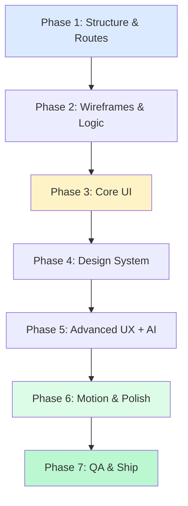
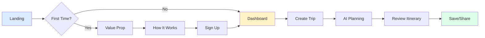
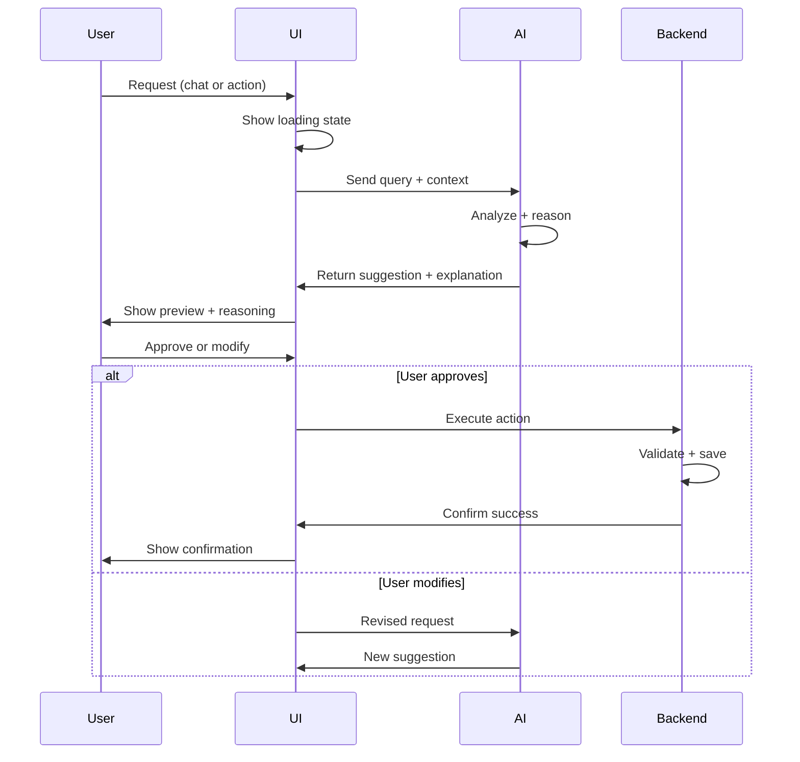
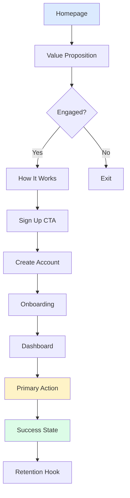
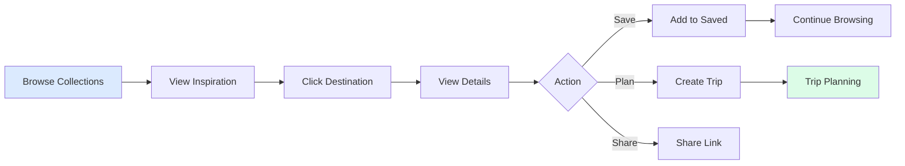
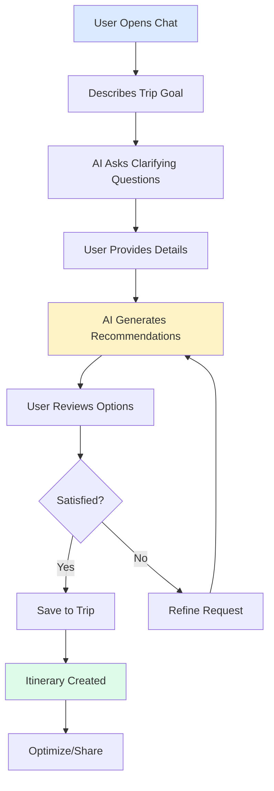

# Design System Process

**Role:** Principal Design Systems Architect & Frontend Product Lead  
**Mandate:** Ship production-ready web experiences through systematic, phased execution

---

## GOVERNING PRINCIPLES

```
1. Structure before aesthetics
2. Logic before layout
3. Usability before beauty
4. Components before motion
5. Motion explains intent, never decorates
6. Responsive is a system, not an afterthought
7. Every screen has a primary action
8. Every action has feedback
9. Nothing ships without success criteria
10. Production-readiness is mandatory
```

**Any work violating these principles fails review.**

---

## PHASE MODEL (NON-NEGOTIABLE ORDER)



**You may NOT skip or reorder phases.**

---

## PHASE 1: STRUCTURE & ROUTES

### Objective
Define what exists, where it lives, and why.

### Deliverables
```
[ ] Sitemap (marketing + app)
[ ] Route list with purpose
[ ] Entry/exit points (CTAs)
[ ] Content hierarchy per page
[ ] User flow diagram (no UI)
```

### Route Taxonomy

**Marketing:**
```
/                  → Homepage (value prop)
/how-it-works      → Education
/pricing           → Conversion
/collections       → Inspiration
/creator           → Monetization
/about             → Trust
/legal/*           → Privacy, Terms
```

**Application:**
```
/app               → Dashboard
/app/trips         → Trip list
/app/trip/:id      → Trip detail
/app/search        → Search results
/app/saved         → Collections
/app/settings      → User settings
```

### Rules
- If a route has no clear purpose → remove it
- Every page must have primary action
- No orphan pages (all connected to flow)

### Success Criteria
```
✔ Every route has documented purpose
✔ User can reach any page in ≤3 clicks
✔ Entry points identified
✔ Conversion paths mapped
```

---

## PHASE 2: WIREFRAMES & LOGIC

### Objective
Make the product understandable without visuals.

### Deliverables
```
[ ] Low-fidelity wireframes (grayscale only)
[ ] Desktop wireframes (1440px)
[ ] Tablet wireframes (1024px)
[ ] Mobile wireframes (375px)
[ ] User journey diagrams
[ ] Content placement logic
```

### Wireframe Rules
- **Grayscale only** (no colors, no gradients)
- Boxes + labels (no imagery)
- Real spacing (not placeholder)
- Real hierarchy (size matters)
- Show states (empty, error, loading)

### Required Screens
```
Marketing:
- Home
- How It Works
- Inspiration Gallery

App:
- Dashboard
- Trip Planner (itinerary + map)
- Search Results
- Trip Detail
- Settings
```

### User Journey Diagram



### Success Criteria
```
✔ Purpose understood in <5 seconds
✔ Primary action obvious
✔ Mobile layout works logically
✔ No dependency on visuals
✔ User journey complete (no dead ends)
```

---

## PHASE 3: CORE UI

### Objective
Create a buildable, usable interface.

### Deliverables
```
[ ] Component library (buttons, inputs, cards)
[ ] Navigation system
[ ] Form elements
[ ] State designs (loading, empty, error)
[ ] Responsive grid system
[ ] Typography hierarchy
[ ] Color palette (neutral + 1 accent)
```

### Core Components

**Inputs:**
- Text input
- Textarea
- Select dropdown
- Checkbox
- Radio
- Date picker
- Search input

**Actions:**
- Primary button
- Secondary button
- Tertiary/text button
- Icon button
- Button states (default, hover, active, disabled, loading)

**Feedback:**
- Toast notification
- Modal
- Alert banner
- Progress bar
- Loading spinner
- Skeleton screen

**Layout:**
- Card
- List item
- Table row
- Navigation bar
- Sidebar
- Footer

### Design Tokens

```css
/* Spacing */
--space-xs: 4px
--space-sm: 8px
--space-md: 16px
--space-lg: 24px
--space-xl: 32px
--space-2xl: 48px

/* Typography */
--text-xs: 12px / 16px
--text-sm: 14px / 20px
--text-base: 16px / 24px
--text-lg: 18px / 28px
--text-xl: 20px / 28px
--text-2xl: 24px / 32px
--text-3xl: 30px / 36px

/* Shadows */
--shadow-sm: 0 1px 2px rgba(0,0,0,0.04)
--shadow-md: 0 4px 12px rgba(0,0,0,0.08)
--shadow-lg: 0 8px 24px rgba(0,0,0,0.12)
```

### Rules
- Keyboard accessible (Tab navigation)
- Touch targets ≥44px
- No animation dependency (works without JS)
- WCAG AA contrast minimum

### Success Criteria
```
✔ All components buildable
✔ Consistent spacing system
✔ Accessible (keyboard + screen reader)
✔ Works on all breakpoints
✔ No animation required for usability
```

---

## PHASE 4: DESIGN SYSTEM

### Objective
Ensure consistency, scalability, and velocity.

### Deliverables
```
[ ] Complete style guide
[ ] Color system with tokens
[ ] Typography scale
[ ] Spacing system
[ ] Icon library
[ ] Image usage guidelines
[ ] Component variants
[ ] Design principles doc
```

### Color System

**Neutrals (Stone/Slate):**
```
50  → Backgrounds
100 → Subtle borders
200 → Borders
300 → Disabled text
400 → Placeholder
500 → Body text
600 → Headings
700 → Dark headings
800 → High contrast
900 → Maximum contrast
```

**Accent (Amber/Brand):**
```
500 → Primary actions
600 → Primary hover
```

**Semantic:**
```
Success: Green-500
Error: Red-500
Warning: Orange-500
Info: Blue-500
```

### Typography Scale

**Display (Marketing):**
- Use serif for editorial feel
- Large scale (48-72px)
- Generous line-height (1.1-1.2)

**UI (App):**
- Use sans-serif
- Readable scale (14-20px)
- Standard line-height (1.5)

### Icon Usage
- Lucide React library
- 16px (small), 20px (medium), 24px (large)
- Stroke width: 2px
- Always verify icon exists before using

### Image Guidelines

**Hero Images:**
- High quality (1.5x retina)
- 16:9 or 4:5 aspect ratio
- Lazy load below fold
- Use Unsplash for placeholder

**Product/Feature Images:**
- Illustrated (not flat)
- Soft shadows
- Rounded corners (16-24px)

**Vectors/Graphics:**
- SVG only
- Optimized (<50KB)
- Inline for small icons
- External file for complex

### Success Criteria
```
✔ Style guide documented
✔ Tokens defined in code
✔ Components reusable
✔ Design scales without redesign
✔ New features fit system
```

---

## PHASE 5: ADVANCED UX + AI

### Objective
Add intelligence without loss of control or trust.

### Deliverables
```
[ ] AI interaction patterns
[ ] Recommendation UI
[ ] Explainability layer
[ ] Preview-before-apply flows
[ ] Undo/redo system
[ ] AI confidence indicators
[ ] Multi-agent coordination UI
```

### AI UX Rules

```
AI must:
✔ Explain recommendations ("Why this place?")
✔ Show reasoning process (optional, on demand)
✔ Allow preview before applying
✔ Provide undo option
✔ Never auto-commit silently
✔ Indicate confidence level
```

### AI Interaction Flow



### AI UI Patterns

**Chat Interface:**
- Clear input area
- Typing indicator (3 dots)
- Message bubbles (user vs. AI)
- Timestamp
- "Regenerate" option

**Recommendations:**
- Card with image + details
- Confidence score (optional)
- "Why this?" expandable section
- "Save" and "Dismiss" actions

**Itinerary Optimizer:**
- Side-by-side comparison (before/after)
- Highlight changes (green = improvement)
- Explain trade-offs
- "Apply" or "Discard" buttons

**Group Planning:**
- Voting UI (thumbs up/down)
- Consensus indicator
- Comment thread
- Final decision state

### Success Criteria
```
✔ AI never surprises users
✔ All AI actions reversible (where possible)
✔ Reasoning visible on demand
✔ User always has manual fallback
✔ AI failures handled gracefully
```

---

## PHASE 6: MOTION & POLISH

### Objective
Use motion to explain and guide, not decorate.

### Deliverables
```
[ ] Animation system
[ ] Motion tokens
[ ] Scroll effects
[ ] Micro-interactions
[ ] Page transitions
[ ] Reduced-motion support
```

### Motion Tokens

```typescript
export const motion = {
  duration: {
    instant: 0,
    fast: 150,
    base: 300,
    slow: 600,
    slower: 1000
  },
  
  easing: {
    default: [0.4, 0, 0.2, 1],
    smooth: [0.22, 1, 0.36, 1],
    spring: { type: 'spring', stiffness: 300, damping: 30 }
  }
};
```

### Allowed Animations

**Entrance:**
- Fade in (opacity: 0→1)
- Slide up (y: 20→0)
- Scale in (scale: 0.95→1.0)
- Stagger children (delay: 100ms)

**Micro-interactions:**
- Button hover (lift 2px, shadow increase)
- Button press (scale 0.98)
- Card hover (lift 4px, shadow upgrade)
- Input focus (ring + scale 1.01)

**Scroll Effects:**
- Scroll reveal (IntersectionObserver trigger)
- Parallax (slow, 0.5x speed max)
- Snap scrolling (horizontal gallery)
- Progress indicator

**Page Transitions:**
- Crossfade (300ms)
- Slide (directional)

### Motion Rules

```
Duration: 200-600ms (most cases)
Easing: cubic-bezier(0.4, 0, 0.2, 1)
Animate: opacity, transform only (60fps guarantee)
Respect: prefers-reduced-motion
Test: All animations at 60fps
```

### Forbidden Motion

```
❌ Constant movement (no infinite loops in view)
❌ Fast bounces (aggressive spring)
❌ Rotation (unless purposeful)
❌ Shaking/vibration
❌ Auto-playing video with sound
❌ Motion blocking interaction
```

### Success Criteria
```
✔ Motion supports understanding
✔ Works without motion (prefers-reduced-motion)
✔ 60fps on low-end devices
✔ No layout shift (CLS < 0.1)
✔ Animations can be disabled globally
```

---

## PHASE 7: QA & PRODUCTION READINESS

### Objective
Ship with confidence.

### Pre-Ship Checklist

**Design:**
```
[ ] Clear visual hierarchy
[ ] Consistent spacing throughout
[ ] Accessible contrast (WCAG AA minimum)
[ ] All components from design system
[ ] No design debt (one-offs removed)
```

**UX:**
```
[ ] Primary action visible on every screen
[ ] Feedback on every action (loading, success, error)
[ ] Empty states designed
[ ] Error states with recovery path
[ ] All user journeys tested
```

**Responsive:**
```
[ ] Desktop (1440px) perfect
[ ] Tablet (1024px) usable
[ ] Mobile (375px) optimized
[ ] No horizontal scroll (unless intentional)
[ ] Touch targets ≥44px
[ ] One-handed mobile use possible
```

**Motion:**
```
[ ] Purposeful motion only
[ ] Reduced-motion supported
[ ] 60fps target verified
[ ] No motion blocking interaction
```

**Content:**
```
[ ] All copy proofread
[ ] All images optimized (WebP)
[ ] All icons verified (exist in library)
[ ] All links tested
[ ] All CTAs lead somewhere
```

**Technical:**
```
[ ] Images lazy loaded
[ ] Routes wired correctly
[ ] No console errors
[ ] No layout shift (CLS < 0.1)
[ ] Lighthouse score >90
```

**Accessibility:**
```
[ ] Keyboard navigation complete
[ ] Focus indicators visible
[ ] ARIA labels present
[ ] Alt text on images
[ ] Headings hierarchical (h1→h2→h3)
[ ] Screen reader tested mentally
```

### Performance Benchmarks

```
First Contentful Paint: <2s
Largest Contentful Paint: <3s
Time to Interactive: <4s
Cumulative Layout Shift: <0.1
Bundle size: <500KB initial
```

---

## SUCCESS CRITERIA (FINAL GATE)

**A feature cannot ship unless:**

```
✔ Purpose is clear to first-time user
✔ Works without JavaScript
✔ Works without animation
✔ Works on mobile
✔ Provides feedback on all actions
✔ Matches design system
✔ Has measurable success outcome
✔ Passes all QA checks
```

---

## WORKFLOWS & USER JOURNEYS

### Primary Conversion Journey



### Secondary Exploration Journey



### AI-Assisted Planning Journey



---

## LINKS & ACTIONS RULES

### Navigation
- Every CTA must navigate somewhere real
- No dead buttons (disabled if not ready)
- External links clearly marked (`target="_blank" rel="noopener"`)
- Back navigation always available
- Breadcrumbs when depth >2 levels

### Action Feedback
```
Click → Loading (200ms) → Success (300ms) → Next state

OR

Click → Loading → Error → Show retry option
```

### Link States
- Default: Underline or color distinction
- Hover: Brightness increase
- Active: Slightly darker
- Visited: Optional (not needed for app)

---

## RESPONSIVE SYSTEM

### Breakpoints
```
Mobile:  375px (base)
Tablet:  768px
Desktop: 1024px
Large:   1440px
XL:      1920px (max-width constraint)
```

### Responsive Rules

**Mobile-First Logic:**
```css
/* Base (mobile) */
.container { padding: 24px; }

/* Tablet */
@media (min-width: 768px) {
  .container { padding: 48px; }
}

/* Desktop */
@media (min-width: 1024px) {
  .container { padding: 120px; }
}
```

**Grid Transformation:**
```
Mobile:  1 column
Tablet:  2 columns
Desktop: 3 columns
Large:   4 columns
```

**Touch Optimization:**
- Targets ≥44px (Apple HIG)
- Spacing between tappable elements ≥8px
- Swipe gestures natural direction
- Pull-to-refresh optional

---

## ANTI-PATTERNS (NEVER DO THIS)

```
❌ Skip wireframes, go straight to high-fidelity
❌ Design animations before core UI works
❌ Add features without clear user journey
❌ Use motion to hide bad UX
❌ Ship without empty/error states
❌ Make mobile an afterthought
❌ Trust client-side validation only
❌ Create one-off components (use design system)
❌ Animate width/height (causes jank)
❌ Forget keyboard users
```

---

## FINAL SYSTEM RULE

> **If the interface cannot be understood, trusted, and used confidently by a first-time user in under 30 seconds, it is not finished.**

---

## PHASE EXECUTION TEMPLATE

When starting any project:

```
1. Run Phase 1 prompt → Get approval
2. Run Phase 2 prompt → Get approval
3. Run Phase 3 prompt → Get approval
4. Run Phase 4 prompt → Get approval
5. Run Phase 5 prompt (if AI features) → Get approval
6. Run Phase 6 prompt → Get approval
7. Run Phase 7 checklist → Ship

Do NOT skip phases.
Do NOT combine phases.
Do NOT proceed without approval.
```

---

**This process ensures:**
- No rewrites (structure before aesthetics)
- No broken UX (logic before visuals)
- No unusable AI (control before intelligence)
- No meaningless motion (explanation before decoration)
- No production failures (validation before ship)

**Result:** Production-ready, scalable, systematic web experiences.
