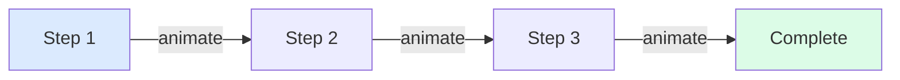
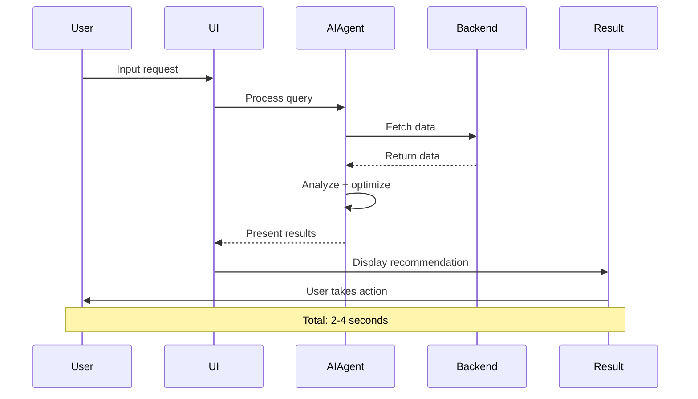
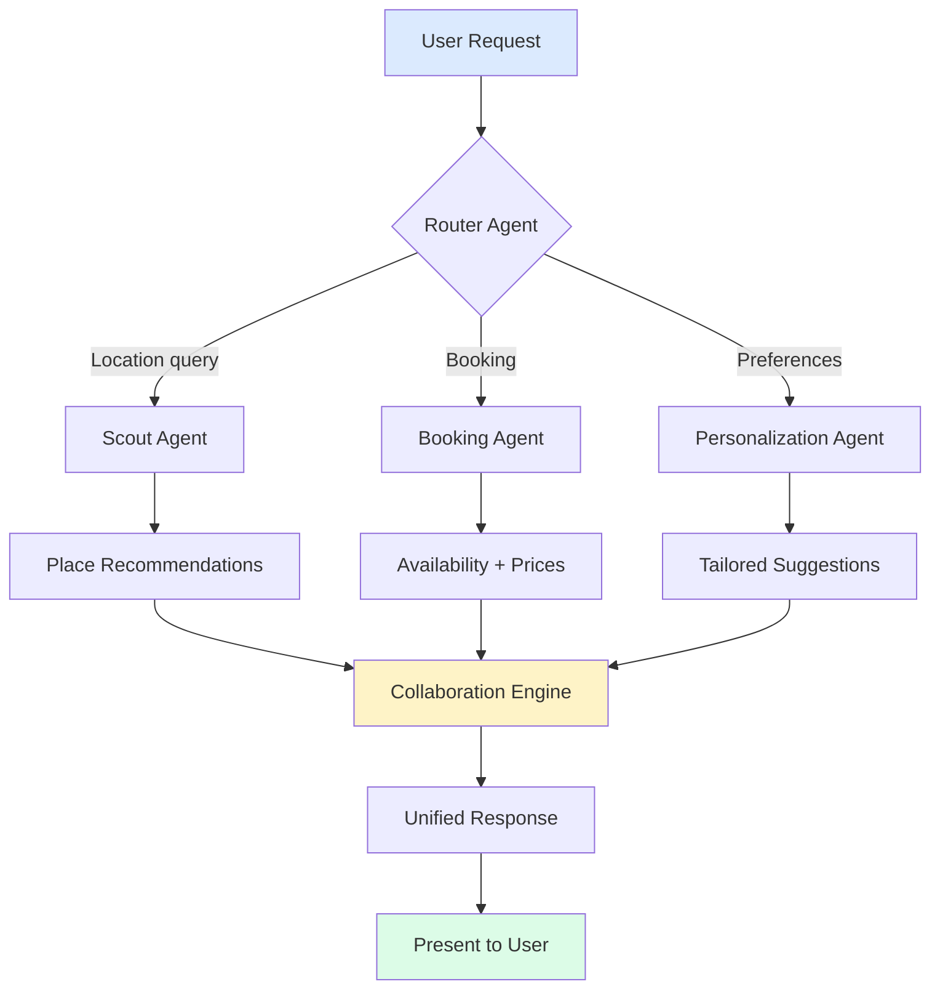
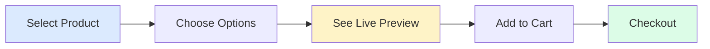

# Design UI Prompt System

**Purpose:** Generate complete, production-ready UI/UX specifications  
**Max Length:** 500 lines (concise, actionable)  
**Output:** Wireframes, flows, animations, components

---

## 🎯 PROMPT TEMPLATE (COPY & USE)

```markdown
# [Feature Name] - UI/UX Specification

**Purpose:** [One sentence: what this accomplishes]  
**Tone:** Luxury · Premium · Editorial · Trust-first  
**Audience:** [Primary user persona]

---

## 1. WIREFRAMES

### Desktop (1440px)
[ASCII wireframe - show layout, spacing, components]

### Tablet (768px)
[ASCII wireframe - show responsive changes]

### Mobile (375px)
[ASCII wireframe - mobile-first approach]

---

## 2. VISUAL HIERARCHY

**Primary Focus (0-3s):**
- [What users see first]

**Secondary Focus (3-10s):**
- [Supporting elements]

**Tertiary Focus (Exploration):**
- [Details, additional content]

---

## 3. COMPONENT BREAKDOWN

[Mermaid diagram showing component tree]

**Components Required:**
- [ ] Component 1 (new/existing)
- [ ] Component 2 (new/existing)

---

## 4. CONTENT STRATEGY

**Headlines:** [Text + tone]  
**CTAs:** [Action-focused, 2-3 words]  
**Body Copy:** [Editorial, calm]

---

## 5. ANIMATION TIMELINE

[Mermaid Gantt chart showing animation sequence]

**Motion Details:**
- Duration: [ms]
- Easing: cubic-bezier(0.4, 0, 0.2, 1)
- Trigger: [on load, scroll, hover, click]

---

## 6. USER JOURNEY

[Mermaid flowchart showing user path]

---

## 7. ROUTES & NAVIGATION

**Routes:**
- `/path` → Description
- `/path/:id` → Description

**Links:**
- [ ] All nav links defined
- [ ] CTAs link to correct routes

---

## 8. RESPONSIVE BEHAVIOR

**Mobile:** [Changes from desktop]  
**Tablet:** [Intermediate adjustments]  
**Desktop:** [Default state]

---

## 9. ACCEPTANCE CRITERIA

- [ ] Visual design matches spec
- [ ] All animations smooth (60fps)
- [ ] Responsive on all breakpoints
- [ ] Accessibility verified
- [ ] Performance optimized

---

## 10. IMPLEMENTATION CHECKLIST

**Phase 1: Structure**
- [ ] Create component files
- [ ] Set up routes
- [ ] Import dependencies

**Phase 2: Visual**
- [ ] Apply design tokens
- [ ] Add images
- [ ] Style components

**Phase 3: Motion**
- [ ] Entrance animations
- [ ] Scroll effects
- [ ] Micro-interactions

**Phase 4: Verification**
- [ ] Cross-browser test
- [ ] Mobile device test
- [ ] Accessibility audit
- [ ] Performance check
```

---

## 📐 WIREFRAME TEMPLATES

### Hero Section
```
Desktop (1440px):
┌────────────────────────────────────────────────────────┐
│  [LOGO]                    [NAV LINKS]      [CTA BTN]  │
│                                                [80px]  │
│  ┌──────────────────┐  ┌─────────────────────────┐    │
│  │                  │  │  Headline (text-6xl)    │    │
│  │  Hero Image      │  │  Subheadline (text-xl)  │    │
│  │  600×800         │  │                         │    │
│  │                  │  │  [Primary CTA]          │    │
│  │                  │  │  [Secondary CTA]        │    │
│  └──────────────────┘  └─────────────────────────┘    │
│                                               [120px]  │
└────────────────────────────────────────────────────────┘

Mobile (375px):
┌──────────────────────┐
│  [LOGO]    [MENU ☰]  │
│               [24px] │
│  Headline            │
│  Subheadline         │
│               [32px] │
│  ┌────────────────┐ │
│  │  Hero Image    │ │
│  │  327×400       │ │
│  └────────────────┘ │
│               [24px] │
│  [Primary CTA]       │
│  [Secondary CTA]     │
│               [40px] │
└──────────────────────┘
```

### Feature Cards (3-Column)
```
Desktop:
┌────────────────────────────────────────────────┐
│  Features                           [48px]    │
│                                                │
│  ┌──────────┐  ┌──────────┐  ┌──────────┐    │
│  │  Icon    │  │  Icon    │  │  Icon    │    │
│  │          │  │          │  │          │    │
│  │  Title   │  │  Title   │  │  Title   │    │
│  │  Text    │  │  Text    │  │  Text    │    │
│  │          │  │          │  │          │    │
│  │  [CTA]   │  │  [CTA]   │  │  [CTA]   │    │
│  └──────────┘  └──────────┘  └──────────┘    │
│                                       [80px]  │
└────────────────────────────────────────────────┘

Mobile (Stack):
┌──────────────────────┐
│  Features     [32px] │
│  ┌────────────────┐ │
│  │  Icon          │ │
│  │  Title         │ │
│  │  Text          │ │
│  │  [CTA]         │ │
│  └────────────────┘ │
│            [24px]   │
│  ┌────────────────┐ │
│  │  Card 2...     │ │
│  └────────────────┘ │
└──────────────────────┘
```

### Horizontal Scroll Gallery
```
Desktop:
┌────────────────────────────────────────────────────────┐
│  Gallery Title                              [48px]    │
│  ┌─────┐  ┌─────┐  ┌─────┐  ┌─────┐  ┌─────┐        │
│  │ IMG │  │ IMG │  │ IMG │  │ IMG │  │ IMG │    →   │
│  │320× │  │320× │  │320× │  │320× │  │320× │        │
│  │400  │  │400  │  │400  │  │400  │  │400  │        │
│  └─────┘  └─────┘  └─────┘  └─────┘  └─────┘        │
│  ← scroll / drag →                         [80px]    │
└────────────────────────────────────────────────────────┘

Mobile (Swipe):
┌──────────────────────┐
│  Gallery      [32px] │
│  ┌────────────────┐ │
│  │    IMAGE       │ │
│  │    280×350     │ │
│  └────────────────┘ │
│    ◉  ○  ○  ○  ○    │
│            [40px]   │
└──────────────────────┘
```

---

## 🎨 LUXURY DESIGN SYSTEM

### Illustrated Cards (Not Flat)

```css
.luxury-card {
  background: white;
  border-radius: 24px;
  box-shadow: 
    0 1px 3px rgba(0,0,0,0.04),
    0 8px 24px rgba(0,0,0,0.08),
    0 16px 48px rgba(0,0,0,0.06);
  padding: 32px;
  position: relative;
  overflow: hidden;
}

/* Gradient overlay */
.luxury-card::before {
  content: '';
  position: absolute;
  top: 0;
  left: 0;
  right: 0;
  height: 200px;
  background: linear-gradient(
    135deg,
    rgba(251,207,232,0.3) 0%,
    rgba(224,242,254,0.3) 100%
  );
  opacity: 0.5;
}

/* Depth layer */
.luxury-card::after {
  content: '';
  position: absolute;
  bottom: -50%;
  right: -20%;
  width: 300px;
  height: 300px;
  background: radial-gradient(
    circle,
    rgba(147,197,253,0.2) 0%,
    transparent 70%
  );
  filter: blur(40px);
}
```

**Card Checklist:**
- [ ] Soft gradient background (2+ colors, 10-20% opacity)
- [ ] Layered shadows (3 levels)
- [ ] Rounded corners (16-32px)
- [ ] Depth blur elements
- [ ] Hover: lift + shadow upgrade

---

## 🎬 ANIMATION SYSTEM

### Scroll-Driven Storytelling

**Pattern: Progressive Reveal**

```mermaid
gantt
    title Section Reveal Animation
    dateFormat X
    axisFormat %Lms
    
    Viewport reaches 30%: milestone, 0, 0
    Background fade in: 0, 400
    Headline slide up: 200, 600
    Subhead fade: 400, 800
    Visual element 1: 600, 1000
    Visual element 2: 800, 1200
    CTA scale in: 1000, 1400
```



**Implementation:**
```typescript
const { ref, isInView } = useScrollAnimation();

<motion.section
  ref={ref}
  initial="hidden"
  animate={isInView ? "visible" : "hidden"}
  variants={sectionVariants}
>
  {/* Content */}
</motion.section>

const sectionVariants = {
  hidden: {},
  visible: {
    transition: {
      staggerChildren: 0.2,
      delayChildren: 0.1
    }
  }
};
```

### Animated Connector Lines

**Flowchart with Motion:**



**CSS Animation:**
```css
.connector-line {
  stroke-dasharray: 1000;
  stroke-dashoffset: 1000;
  animation: drawLine 2s ease-out forwards;
}

@keyframes drawLine {
  to {
    stroke-dashoffset: 0;
  }
}

/* Stagger delays */
.line-1 { animation-delay: 0s; }
.line-2 { animation-delay: 0.5s; }
.line-3 { animation-delay: 1s; }
```

### Animated Charts

**Progress Bar with Count-Up:**

```typescript
function AnimatedProgress({ target }: { target: number }) {
  const [progress, setProgress] = useState(0);
  const isInView = useInView(ref, { once: true });

  useEffect(() => {
    if (!isInView) return;
    
    const duration = 2000;
    const start = Date.now();
    
    const animate = () => {
      const now = Date.now();
      const elapsed = now - start;
      const percentage = Math.min(elapsed / duration, 1);
      
      // Ease-out
      const eased = 1 - Math.pow(1 - percentage, 3);
      setProgress(Math.floor(eased * target));
      
      if (percentage < 1) requestAnimationFrame(animate);
    };
    
    requestAnimationFrame(animate);
  }, [isInView]);

  return (
    <div>
      <div className="text-4xl font-bold">{progress}%</div>
      <div className="h-2 bg-stone-200 rounded-full overflow-hidden">
        <motion.div
          initial={{ width: 0 }}
          animate={{ width: `${progress}%` }}
          className="h-full bg-gradient-to-r from-amber-500 to-orange-500"
        />
      </div>
    </div>
  );
}
```

---

## 🔄 WORKFLOWS & USER JOURNEYS

### AI Agent Workflow Template



**States to Design:**
1. **Input State** (empty, focused, typing)
2. **Processing State** (loading, AI thinking)
3. **Results State** (cards, list, visualization)
4. **Action State** (save, share, export)
5. **Success State** (confirmation, next steps)

### Multi-Agent System



**Design Requirements:**
- [ ] Visual indicator for active agent
- [ ] Progress bar for multi-step process
- [ ] Agent handoff animation
- [ ] Confidence score display (optional)
- [ ] Explain-ability layer (show reasoning)

---

## 🎯 MICRO-INTERACTIONS

### Button States

```css
/* Default */
.btn-primary {
  background: linear-gradient(135deg, #f59e0b 0%, #d97706 100%);
  box-shadow: 0 4px 12px rgba(245,158,11,0.3);
  transition: all 200ms cubic-bezier(0.4, 0, 0.2, 1);
}

/* Hover */
.btn-primary:hover {
  transform: translateY(-2px);
  box-shadow: 0 8px 24px rgba(245,158,11,0.4);
}

/* Active/Click */
.btn-primary:active {
  transform: translateY(0);
  box-shadow: 0 2px 8px rgba(245,158,11,0.3);
}

/* Loading */
.btn-primary.loading::before {
  content: '';
  width: 16px;
  height: 16px;
  border: 2px solid white;
  border-top-color: transparent;
  border-radius: 50%;
  animation: spin 600ms linear infinite;
}

/* Success (morph) */
.btn-primary.success {
  background: #10b981;
  width: 48px; /* circular */
}
```

### Save/Like Animation

```typescript
function SaveButton({ itemId }) {
  const [saved, setSaved] = useState(false);

  return (
    <motion.button
      onClick={() => setSaved(!saved)}
      whileTap={{ scale: 0.9 }}
    >
      <motion.svg
        animate={{
          scale: saved ? [1, 1.3, 1] : 1,
          fill: saved ? '#ef4444' : 'none'
        }}
        transition={{ duration: 0.3 }}
      >
        <path d="M12 21.35l-1.45-1.32C5.4 15.36 2 12.28 2 8.5 2 5.42 4.42 3 7.5 3c1.74 0 3.41.81 4.5 2.09C13.09 3.81 14.76 3 16.5 3 19.58 3 22 5.42 22 8.5c0 3.78-3.4 6.86-8.55 11.54L12 21.35z"/>
      </motion.svg>
    </motion.button>
  );
}
```

---

## 📱 RESPONSIVE DESIGN RULES

### Breakpoint Strategy

```css
/* Mobile-first approach */
.container {
  padding: 24px;
  max-width: 100%;
}

/* Tablet */
@media (min-width: 768px) {
  .container {
    padding: 60px;
    max-width: 904px;
  }
}

/* Desktop */
@media (min-width: 1024px) {
  .container {
    padding: 120px;
    max-width: 1200px;
  }
}

/* Large desktop */
@media (min-width: 1440px) {
  .container {
    max-width: 1400px;
  }
}
```

### Grid Transformation

```
Mobile (375px):    1 column
Tablet (768px):    2 columns
Desktop (1024px):  3 columns
Large (1440px):    4 columns

Gap progression:
Mobile:   16px
Tablet:   24px
Desktop:  32px
```

---

## 🎨 STYLE GUIDE TEMPLATE

### Typography

```css
/* Display (Headlines) */
--font-display: 'Playfair Display', serif;
--text-7xl: 72px / 80px;
--text-6xl: 60px / 64px;

/* Body (Content) */
--font-body: 'Inter', sans-serif;
--text-lg: 18px / 28px;
--text-base: 16px / 24px;

/* Usage */
.headline { 
  font-family: var(--font-display);
  font-size: var(--text-6xl);
  font-weight: 400;
  letter-spacing: -0.02em;
}
```

### Color System

```css
/* Neutrals (Stone) */
--stone-50: #fafaf9;
--stone-900: #1c1917;

/* Primary (Amber) */
--amber-500: #f59e0b;
--amber-600: #d97706;

/* Semantic */
--success: #10b981;
--error: #ef4444;
--info: #3b82f6;

/* Depth */
--shadow-luxury: 
  0 1px 3px rgba(0,0,0,0.04),
  0 8px 24px rgba(0,0,0,0.08),
  0 16px 48px rgba(0,0,0,0.06);
```

### Content Template

**Hero Headline:**
- Length: 4-8 words
- Tone: Confident, benefit-focused
- Example: "Plan your perfect journey with AI"

**Subheadline:**
- Length: 12-20 words
- Tone: Clarifying, supportive
- Example: "Our intelligent assistant creates personalized itineraries based on your preferences and style."

**CTAs:**
- Primary: 2-3 words, action verb
  - "Start planning"
  - "Explore now"
  - "Try it free"
- Secondary: Supportive, low commitment
  - "Learn more"
  - "See how it works"

---

## 🔗 ROUTES & NAVIGATION

### Route Structure

```typescript
const routes = {
  public: {
    '/': 'Homepage',
    '/how-it-works': 'Explainer',
    '/pricing': 'Pricing',
    '/about': 'About',
    '/blog': 'Blog Index',
    '/blog/:slug': 'Blog Post'
  },
  
  app: {
    '/app': 'Dashboard',
    '/app/trip/:id': 'Trip Detail',
    '/app/search': 'Search',
    '/app/collections': 'Collections',
    '/app/settings': 'Settings'
  },
  
  auth: {
    '/login': 'Login',
    '/signup': 'Sign Up',
    '/reset-password': 'Password Reset'
  }
};
```

### Navigation Patterns

**Header (Desktop):**
```
[Logo] [Product] [How It Works] [Pricing]     [Login] [Start Free →]
```

**Header (Mobile):**
```
[Logo]                                          [☰ Menu]
```

**Footer:**
```
Product        Company        Resources       Legal
- Features     - About        - Blog          - Privacy
- Pricing      - Careers      - Help          - Terms
- Roadmap      - Press        - API Docs      - Security
```

---

## 🎭 FIGMA AI ANIMATION PROMPTS

### Entrance Animation

```
Create an entrance animation for a feature card:
- Start state: opacity 0, 30px below final position, scale 0.95
- End state: opacity 1, final position, scale 1.0
- Duration: 500ms
- Easing: cubic-bezier(0.4, 0, 0.2, 1)
- Trigger: When card is 40% visible in viewport
- Additional: Slight shadow increase during animation
```

### Hover Interaction

```
Design a hover interaction for a product card:
- Default: Card at Y: 0, shadow blur 24px
- Hover: Card lifts to Y: -8px, shadow blur 48px
- Image inside: Scales from 1.0 to 1.05 (contained, no overflow)
- Duration: 300ms
- Easing: ease-out
- Cursor: Changes to pointer
- Additional: Show overlay with product name fading in (200ms delay)
```

### Loading State

```
Create a loading animation for AI processing:
- Element: Circular spinner, 24px diameter
- Animation: Rotate 360° continuously
- Speed: 1 rotation per second
- Style: 2px border, top border transparent (gives spinner effect)
- Color: Amber gradient
- Container: Pulsing background (opacity 0.5 to 1.0, 1.5s cycle)
- Text: "Analyzing your preferences..." with dot-dot-dot animation
```

### Success State

```
Design a success confirmation animation:
- Stage 1: Button morphs from rectangle to circle (300ms)
- Stage 2: Checkmark draws in using path animation (400ms)
- Stage 3: Circular ripple expands from center (600ms)
- Stage 4: Hold for 2000ms
- Stage 5: Return to original state (300ms)
- Colors: Primary → Success green
- Scale: Brief overshoot (1.0 → 1.1 → 1.0)
```

---

## 💼 REAL-WORLD EXAMPLES

### Travel Platform: AI Itinerary Builder

**User Journey:**
1. User arrives → Chat interface prominent
2. User types "Plan a trip to Paris"
3. AI shows typing indicator (3 dots pulsing)
4. Results appear as cards (stagger animation)
5. User clicks "Add to trip"
6. Button morphs to success state
7. Trip panel slides in from right
8. Itinerary updates with smooth reorder

**Animations:**
- Chat bubble slide-in (200ms)
- Typing dots pulse (800ms loop)
- Card stagger reveal (100ms delay each)
- Button morph (300ms)
- Panel slide (400ms ease-out)
- List reorder (300ms with layout animation)

### E-commerce: Product Configurator

**Flow:**


**Micro-interactions:**
- Option selection: Radio button scale pulse
- Color swatch: Border glow + shadow
- Preview: Image crossfade (300ms)
- Price update: Number count-up animation
- Add to cart: Button → Loading → Success

---

## ✅ FINAL CHECKLIST

```
DESIGN COMPLETE
[ ] All wireframes created (desktop/tablet/mobile)
[ ] Component tree documented
[ ] Content strategy defined
[ ] Animation timeline specified
[ ] User journey mapped
[ ] Routes planned
[ ] Style guide created

IMPLEMENTATION READY
[ ] Components listed with new/existing status
[ ] Animation code snippets provided
[ ] Responsive breakpoints defined
[ ] Image requirements specified
[ ] Performance considerations noted

QUALITY VERIFIED
[ ] Accessibility considered
[ ] Motion respects reduced-motion
[ ] Loading states designed
[ ] Error states designed
[ ] Success states designed
[ ] Empty states designed

LUXURY STANDARDS
[ ] Soft shadows (3 levels)
[ ] Gradient overlays (subtle)
[ ] Rounded corners (16-32px)
[ ] Generous spacing (never cramped)
[ ] Editorial typography
[ ] Calm motion (no aggressive effects)
[ ] High-quality images (1.5x retina)
```

---

**USE THIS SYSTEM FOR ALL DESIGN DOCS**

1. Copy prompt template
2. Fill in each section
3. Create wireframes (ASCII)
4. Add Mermaid diagrams
5. Specify animations
6. Define content
7. List routes
8. Create checklist
9. Verify quality
10. Ship

**Max 500 lines per doc. Be concise. Be actionable. Ship production-ready designs.**
