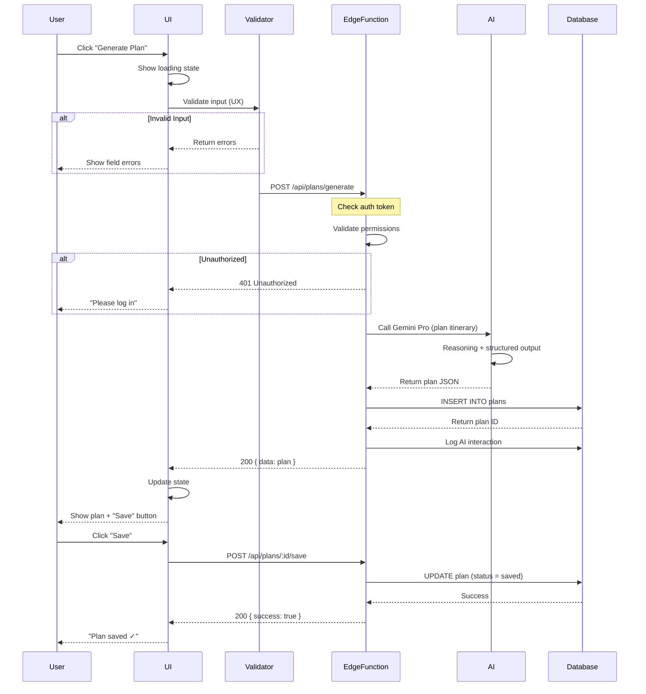

# Frontend ↔ Backend Wiring

**Purpose:** Define how UI safely connects to backend and AI  
**Audience:** Full-stack engineers, AI integrators  
**Status:** Production-ready ruleset

---

## 1. PURPOSE

**Wiring** means the complete path from user action to system response:

```
User clicks → UI validates → API request → Edge Function → 
Database write → AI (optional) → Response → UI updates
```

**Core principle:** Frontend proposes, backend enforces, AI assists.

All AI actions execute through backend boundaries. No client-side AI can modify system state.

---

## 2. SYSTEM COMPONENTS

| Component | Responsibility | Examples |
|-----------|---------------|----------|
| **Frontend** | Capture input, show state, handle UX errors | Screens, forms, loading states |
| **Backend** | Enforce auth, business rules, data integrity | Supabase Auth, Postgres, RLS |
| **Edge Functions** | Safe action layer, validation boundary | `/api/trips`, `/api/bookings` |
| **AI Layer** | Reasoning, recommendations, generation | Gemini Pro, Flash, Function Calling |
| **Logging** | Audit trail, debugging, analytics | Supabase logs, error tracking |
| **Storage** | Files, media, user uploads | Supabase Storage (private buckets) |

**Ownership:**
- Frontend owns: UI state, form validation (UX), optimistic updates
- Backend owns: Data truth, permissions, business rules
- AI owns: Recommendations, generation (never direct writes)

---

## 3. WIRING RULES (NON-NEGOTIABLE)

### Auth First
- Every Edge Function checks `Authorization` header
- Frontend sends access token (from Supabase Auth)
- Backend validates token before any action
- No public write endpoints (except signup)

### Backend is Authoritative
- Frontend predictions are optimistic only
- Backend response = source of truth
- If backend rejects, frontend reverts
- Example: Add to trip → UI shows immediately → Backend rejects → UI removes item + shows error

### One Source of Truth
- Database owns all IDs, timestamps, statuses
- Frontend never generates IDs (use temp IDs, swap on save)
- Status transitions happen server-side only
- Example: `status: 'pending'` → Backend changes to `'completed'` → UI polls or listens

### Validation Boundaries
- **Frontend validates:** UX (field format, required, character limits)
- **Backend validates:** Truth (exists in DB? user owns it? business rule satisfied?)
- Both can reject, but backend rejection is final

### Idempotency
- All write operations are idempotent (safe to retry)
- Use idempotency keys for critical actions (bookings, payments)
- Example: POST with `idempotencyKey: uuid()` → Backend checks if already processed

### Error Contracts
- Backend returns structured errors (type, message, field)
- Frontend shows user-friendly message
- Developer logs include request ID for tracing
- Example: `{ error: { type: 'validation', field: 'email', message: 'Email already exists' } }`

### No Direct DB Writes
- Frontend never calls `supabase.from('table').insert()`
- All writes go through Edge Functions
- Edge Functions enforce RLS policies + business logic

### AI Cannot Perform Side Effects
- AI outputs are proposals only
- User must confirm before execution
- Execution happens via Edge Function (not AI SDK)
- Example: AI suggests hotel → User clicks "Book" → Edge Function creates booking

### AI Traceability
- Log every AI call: input, model, tool calls, output
- Store in DB for audit trail
- User can view AI reasoning
- Required fields: `{ userId, prompt, model, response, timestamp }`

---

## 4. REQUEST/RESPONSE CONTRACTS

### Standard Request

**Required Inputs:**
- `Authorization: Bearer <token>` (header)
- Valid JSON body (if POST/PUT)
- Idempotency key (for critical writes)

**Optional Inputs:**
- Query params (filters, pagination)
- File upload (multipart/form-data)

### Standard Response

**Success (200-201):**
```
{
  "success": true,
  "data": { ... },
  "metadata": {
    "timestamp": "2024-12-21T10:00:00Z",
    "requestId": "req_abc123"
  }
}
```

**Error (400-500):**
```
{
  "success": false,
  "error": {
    "type": "validation" | "auth" | "not_found" | "server",
    "message": "User-friendly message",
    "field": "email" (optional),
    "code": "EMAIL_EXISTS"
  },
  "metadata": {
    "requestId": "req_abc123"
  }
}
```

### Status Lifecycle

```
created → validating → processing → completed
                    ↓
                  failed (with reason)
```

**UI Shows:**
- `created`: "Saving..."
- `validating`: "Checking..."
- `processing`: "Working on it..." (with progress if available)
- `completed`: "Done ✓"
- `failed`: "Failed: [reason]" + retry button

---

## 5. EVENT FLOW (UI → BACKEND → UI)

### Complete Wiring Path



### Key Validation Points

1. **Frontend (UX):** Required fields, format, length
2. **Edge Function (Auth):** Valid token, user exists
3. **Edge Function (Permission):** User owns resource
4. **Edge Function (Business):** Dates valid, inventory available
5. **Database (Constraints):** Foreign keys, uniqueness

---

## 6. EDGE FUNCTION RULES

### Design Principles

**One Function = One Responsibility**
- `/api/trips/create` → Create trip only
- `/api/trips/:id/items/add` → Add item only
- No mega-functions that do multiple things

**Input Validation & Permission Checks**
```
1. Parse request body
2. Validate auth token
3. Check user owns resource (if updating)
4. Validate business rules
5. Execute action
6. Log result
7. Return response
```

**Consistent Naming**
- Resource-based: `/api/[resource]/[action]`
- Examples:
  - POST `/api/trips` → Create
  - GET `/api/trips/:id` → Read
  - PUT `/api/trips/:id` → Update
  - DELETE `/api/trips/:id` → Delete
  - POST `/api/trips/:id/items` → Add item

**Stable Outputs**
- Same request = same response shape
- Add new fields, never remove
- Version breaking changes (`/api/v2/trips`)

**Logging Required**
```
Log every request:
- Timestamp
- User ID
- Action
- Input (sanitized)
- Result (success/error)
- Duration
```

**Timeouts & Fallback**
- Fast operations: 5s timeout
- AI operations: 30s timeout
- Long-running: Return job ID, poll for status
- If timeout: Return 202 Accepted + job ID

**Async Workflow Pattern**
```
User triggers → Edge Function creates job → Returns job ID →
UI polls /api/jobs/:id → Job completes → UI shows result
```

---

## 7. AI WIRING RULES

### Model Selection

| Use Case | Model | Reason | Timeout |
|----------|-------|--------|---------|
| Chat response | Flash | Fast (<1s) | 5s |
| Form help | Flash | Fast | 5s |
| Recommendation | Pro | Reasoning | 10s |
| Itinerary planning | Pro + Thinking | Multi-step logic | 30s |
| Deep research | Pro + Deep Research | Complex analysis | 5-10 min |

### Tool Selection

| Tool | When to Use | Example |
|------|-------------|---------|
| Function Calling | User confirms action | "Book this hotel" → calls `bookHotel()` |
| Structured Outputs | UI needs typed data | Return `{ hotels: Hotel[] }` for cards |
| Search Grounding | Need fresh data | "Events this weekend" |
| Maps Grounding | Location queries | "Hotels near Louvre" |
| RAG (File Search) | User docs/past trips | "What did I do in Tokyo?" |
| Code Execution | Math/validation | "Calculate total cost" |

### Explicit Triggers Only

**AI runs when:**
- User clicks "Ask AI" button
- User submits chat message
- User clicks "Generate [thing]"
- User confirms action in modal

**AI never runs:**
- On page load (without user action)
- Silently in background
- Without user awareness

### AI Action Flow

```
User clicks → UI shows confirmation modal →
User confirms → UI calls Edge Function →
Edge Function calls AI with function calling →
AI returns function call → Edge Function executes function →
Edge Function returns result → UI updates
```

**Example:**
```
User: "Book Hotel Artemide"
UI: Shows modal "Book Hotel Artemide for $180/night, Dec 15-20?"
User: Confirms
UI: POST /api/bookings/create
Edge Function: Calls AI with bookHotel() tool
AI: Returns { functionCall: bookHotel, params: {...} }
Edge Function: Executes bookHotel() function
Edge Function: Returns { success: true, confirmationId: "ABC123" }
UI: "Booked ✓ Confirmation #ABC123"
```

---

## 8. WORKFLOWS

### Simple Workflow: Immediate Response

**Scenario:** User searches for hotels

**Screens:**
- Search screen (input + filters)

**Validation:**
- Frontend: Location required, dates valid
- Backend: None (read-only)

**Flow:**
1. User enters "Paris" + dates
2. UI validates (required fields)
3. UI calls `GET /api/search/hotels?location=Paris&dates=...`
4. Edge Function calls AI (Gemini Pro + Maps Grounding)
5. AI returns structured hotel list
6. Edge Function returns hotels
7. UI shows hotel cards

**Failure Modes:**
- No results → Show "No hotels found" + adjust filters
- API timeout → Show "Search taking too long, try again"
- Invalid dates → Show "Dates must be in future"

**Success Criteria:**
- Hotels displayed in <3s
- Results are relevant to location
- Cards show price, rating, distance

---

### Medium Workflow: Plan + Execute

**Scenario:** User generates itinerary and saves it

**Screens:**
- Trip planning screen
- Itinerary preview
- Trip detail screen

**Validation:**
- Frontend: Destination, dates, traveler count required
- Backend: Dates valid (not in past), user owns trip

**Flow:**
1. User fills form (destination, dates, preferences)
2. UI validates fields
3. User clicks "Generate Itinerary"
4. UI calls `POST /api/itineraries/generate`
5. Edge Function calls AI (Gemini Pro + Thinking)
6. AI plans 3-day itinerary (reasoning process visible)
7. Edge Function stores plan (status: draft)
8. Edge Function returns plan JSON
9. UI shows itinerary preview
10. User reviews, clicks "Save to Trip"
11. UI calls `POST /api/trips/:id/itinerary`
12. Edge Function updates trip (status: active)
13. UI navigates to trip detail screen

**Failure Modes:**
- AI timeout → Show partial plan + "Finish manually" option
- Save fails → Keep preview, show "Save failed, retry?"
- Invalid dates → Show error before calling AI

**Success Criteria:**
- Itinerary generated in <10s
- All days have activities
- User can edit before saving
- Saved itinerary appears in trip list

---

### Complex Workflow: Multi-Step Job with Progress

**Scenario:** User triggers deep research (compare all beach resorts in Bali)

**Screens:**
- Search screen
- Job status screen (progress tracker)
- Results screen

**Validation:**
- Frontend: Search query required
- Backend: User has quota for deep research

**Flow:**
1. User enters complex query
2. UI calls `POST /api/research/start`
3. Edge Function creates job (status: queued)
4. Edge Function returns job ID
5. UI navigates to job status screen
6. UI polls `GET /api/jobs/:id` every 2s
7. Backend updates job status:
   - `queued` (0%) → "Starting..."
   - `processing` (25%) → "Searching resorts..."
   - `processing` (50%) → "Analyzing reviews..."
   - `processing` (75%) → "Ranking options..."
   - `completed` (100%) → "Done"
8. When completed, UI navigates to results screen
9. Results screen shows ranked resorts with reasoning

**Partial Saves:**
- At 25%, 50%, 75%: Save intermediate results
- If job fails at 60%: User still gets partial data

**Failure Modes:**
- Job timeout (10 min) → Show partial results + "Continue manually"
- Job fails → Show error + option to retry
- User closes tab → Job continues, resume on return

**Success Criteria:**
- Progress updates every 2s
- User can cancel job
- Partial results saved
- Final report downloadable

---

## 9. REAL-WORLD EXAMPLES

### Example 1: Generate Recommendations and Save

**User Action:** "Show me romantic restaurants in Paris"

**UI Trigger:**
- User types in chat input
- Clicks "Send" or presses Enter

**Backend Actions:**
1. `POST /api/chat/message`
2. Edge Function validates auth
3. Edge Function calls Gemini Pro + Maps Grounding
4. AI searches "romantic restaurants Paris"
5. AI returns structured list (3 restaurants)
6. Edge Function stores chat message + AI response in DB
7. Edge Function returns recommendations

**AI Role:**
- Maps Grounding: Find restaurants near Paris
- Reasoning: Filter by "romantic" (ambiance, reviews)
- Structured Output: Return typed `Restaurant[]` object

**Final UI:**
- Chat shows AI response with 3 restaurant cards
- Each card has: name, rating, price, distance, photo
- "Save to trip" button on each card
- User clicks "Save" → calls `POST /api/trips/:id/items`

**Time:** 2-3 seconds

---

### Example 2: Upload Docs → RAG Summary → Dashboard Updates

**User Action:** Upload hotel confirmation PDF

**UI Trigger:**
- User clicks "Upload Document"
- Selects PDF file
- Clicks "Analyze"

**Backend Actions:**
1. `POST /api/documents/upload` (multipart form-data)
2. Edge Function uploads file to Supabase Storage (private bucket)
3. Edge Function extracts text from PDF
4. Edge Function calls Gemini Pro + File Search (RAG)
5. AI analyzes document, extracts:
   - Hotel name
   - Check-in date
   - Check-out date
   - Confirmation number
   - Total price
6. Edge Function stores extracted data in `trip_items` table
7. Edge Function returns summary

**AI Role:**
- File Search (RAG): Read PDF content
- Structured Output: Extract fields into typed object
- Reasoning: Understand context (this is a hotel booking)

**Final UI:**
- Upload screen shows "Analyzing..."
- After 3-5s: Shows extracted data
- "Add to Trip?" confirmation
- User confirms → Item added to dashboard
- Dashboard shows new hotel item with dates

**Time:** 3-5 seconds

---

### Example 3: Multi-Step Automation with Progress

**User Action:** "Optimize my 7-day Italy itinerary"

**UI Trigger:**
- User opens trip detail screen
- Clicks "Optimize Itinerary"
- Confirms in modal

**Backend Actions:**
1. `POST /api/trips/:id/optimize`
2. Edge Function creates optimization job
3. Edge Function returns job ID
4. UI polls `GET /api/jobs/:id`
5. Background job runs:
   - Step 1: Load current itinerary (10%)
   - Step 2: Call AI to analyze inefficiencies (30%)
   - Step 3: AI suggests reordering (50%)
   - Step 4: Check availability for changes (70%)
   - Step 5: Generate optimized plan (90%)
   - Step 6: Save as draft (100%)
6. Job completes, returns optimized itinerary
7. UI shows side-by-side comparison (old vs. optimized)
8. User reviews, clicks "Apply Changes"
9. `PUT /api/trips/:id/itinerary` updates trip

**AI Role:**
- Gemini Thinking: Multi-step reasoning
- Maps Grounding: Check distances, travel times
- Function Calling: Validate availability

**Final UI:**
- Progress screen: "Analyzing day 3..." (live updates)
- Comparison view: Old itinerary | New itinerary
- Highlight changes (green = improvement)
- "Apply" or "Discard" buttons
- If applied: Navigate to updated trip

**Time:** 30-60 seconds

---

## 10. TESTING & VALIDATION

### Auth & Permission Tests

**Test 1: Unauthorized Access**
```
Given: User is not logged in
When: User calls POST /api/trips/create
Then: Returns 401 Unauthorized
  And: UI shows "Please log in"
```

**Test 2: Insufficient Permissions**
```
Given: User A owns Trip 1
  And: User B is logged in
When: User B calls DELETE /api/trips/1
Then: Returns 403 Forbidden
  And: UI shows "You don't have permission"
```

### Network Failure & Retry Tests

**Test 3: Network Timeout**
```
Given: User submits form
  And: Edge Function takes >30s
When: Request times out
Then: UI shows "Request timed out"
  And: UI shows "Retry" button
  And: Retry uses same idempotency key
```

**Test 4: Partial Failure**
```
Given: Multi-step job at 60%
When: Network disconnects
Then: Job continues on backend
  And: UI shows "Reconnecting..."
  And: On reconnect, resume polling
  And: UI shows progress from 60%
```

### Idempotency Tests

**Test 5: Double-Click Submit**
```
Given: User clicks "Book Hotel"
  And: Request includes idempotencyKey: "abc123"
When: User double-clicks (sends same key twice)
Then: First request processes
  And: Second request returns cached result
  And: No duplicate booking created
  And: UI shows success once
```

### AI Failure Fallback Tests

**Test 6: AI Timeout**
```
Given: User requests itinerary
When: AI takes >30s (timeout)
Then: Edge Function returns 202 Accepted
  And: UI shows "Taking longer than expected"
  And: UI offers "Create manually" button
  And: Job continues in background
  And: UI polls for completion
```

**Test 7: AI Invalid Output**
```
Given: User requests recommendations
When: AI returns malformed JSON
Then: Edge Function catches error
  And: Returns fallback (manual search)
  And: UI shows "AI unavailable, showing search"
  And: Logs error for debugging
```

### Data Consistency Tests

**Test 8: ID Consistency**
```
Given: UI creates item with temp ID "temp_123"
When: Backend saves and returns real ID "item_456"
Then: UI replaces temp ID with real ID
  And: All references update
  And: Subsequent calls use real ID
```

**Test 9: Status Consistency**
```
Given: Backend changes status to "completed"
  And: UI has stale "processing" state
When: UI polls for status
Then: UI updates to "completed"
  And: Shows success message
  And: Enables next action
```

**Test 10: Timestamp Consistency**
```
Given: User creates trip at 10:00 AM local time
When: Backend saves with UTC timestamp
Then: UI converts to user's timezone
  And: Displays "10:00 AM" consistently
  And: Sorts by UTC for accuracy
```

---

## 11. PRODUCTION CHECKLIST

### Security

```
[ ] All Edge Functions check auth token
[ ] Row-level security (RLS) enabled on all tables
[ ] No public write access to database
[ ] CORS configured (whitelist frontend domain)
[ ] API rate limiting enabled
[ ] Sensitive data encrypted at rest
[ ] Access logs enabled
[ ] No API keys in frontend code
```

### Logging & Observability

```
[ ] Every Edge Function logs:
    - Request ID
    - User ID
    - Action
    - Input (sanitized)
    - Result (success/error)
    - Duration
[ ] AI calls logged:
    - Prompt
    - Model
    - Tools used
    - Response
    - Token usage
[ ] Error tracking configured (Sentry/similar)
[ ] Performance monitoring enabled
[ ] Dashboards for:
    - API response times
    - Error rates
    - AI usage/costs
```

### UI States

```
[ ] Every screen has:
    - Loading state (skeleton/spinner)
    - Empty state ("No items yet")
    - Error state (friendly message + retry)
    - Success state (confirmation)
[ ] All async actions show progress
[ ] Network errors handled gracefully
[ ] Offline mode (show cached data)
```

### Mobile & Responsiveness

```
[ ] All screens tested on:
    - Mobile (375px)
    - Tablet (768px)
    - Desktop (1440px)
[ ] Touch targets ≥44px
[ ] Forms usable on mobile keyboard
[ ] No horizontal scroll
[ ] Images optimized (WebP)
[ ] Lazy loading for below-fold content
```

### AI Actions

```
[ ] All AI actions auditable:
    - Stored in DB (user, prompt, response, timestamp)
    - Retrievable for user review
    - Traceable for debugging
[ ] AI outputs validated before storage
[ ] AI failures have manual fallback
[ ] User can undo AI actions (where applicable)
[ ] AI reasoning visible to user (optional "Why?")
```

### Data Integrity

```
[ ] All writes are idempotent
[ ] Transactions used for multi-step updates
[ ] Foreign keys enforced
[ ] Unique constraints on critical fields
[ ] Soft deletes for user data (retain for audit)
[ ] Backups enabled (daily minimum)
```

### Performance

```
[ ] API response time <1s for reads
[ ] API response time <3s for writes
[ ] AI responses <5s (Flash) / <10s (Pro)
[ ] Database queries indexed
[ ] N+1 queries eliminated
[ ] Images CDN-hosted
[ ] Bundle size <500KB (initial load)
```

---

## SUCCESS CRITERIA

### Developer Perspective

- [ ] I can trace any user action from UI to DB
- [ ] I know where to add a new feature (routing clear)
- [ ] I can test any endpoint in isolation
- [ ] I can debug failures with request ID
- [ ] I know when to call AI vs. direct API

### User Perspective

- [ ] UI never shows blank screens
- [ ] Errors are understandable (no tech jargon)
- [ ] Actions feel instant (optimistic updates)
- [ ] I can retry if something fails
- [ ] I trust the system (no silent failures)

### System Perspective

- [ ] Auth enforced on all writes
- [ ] Data consistency maintained
- [ ] Failures logged and traceable
- [ ] AI costs controlled (model selection)
- [ ] System scales (stateless Edge Functions)

---

## ANTI-PATTERNS (AVOID)

### ❌ Frontend Generates IDs
```
Bad: const id = uuid(); saveTrip({ id, ...data });
Good: const { id } = await saveTrip(data); // Backend returns ID
```

### ❌ Silent Failures
```
Bad: try { await save() } catch {}
Good: try { await save() } catch (e) { showError(e); logError(e); }
```

### ❌ AI Direct Writes
```
Bad: AI calls supabase.from('trips').insert()
Good: AI returns proposal → User confirms → Edge Function writes
```

### ❌ No Loading States
```
Bad: <button onClick={save}>Save</button>
Good: <button disabled={loading}>{loading ? 'Saving...' : 'Save'}</button>
```

### ❌ Trusting Client Input
```
Bad: Edge Function: const { userId } = request.body; // User can fake ID
Good: Edge Function: const userId = getAuthUser(token); // Trust token only
```

---

**This system is production-ready when all checklists pass and all anti-patterns are eliminated.**
