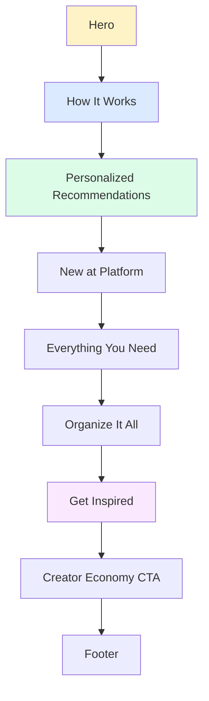
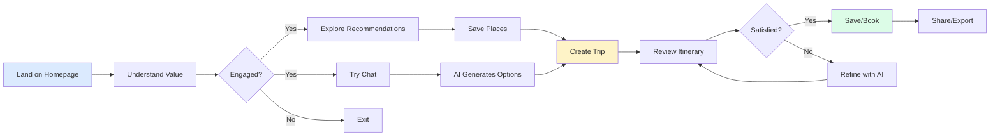
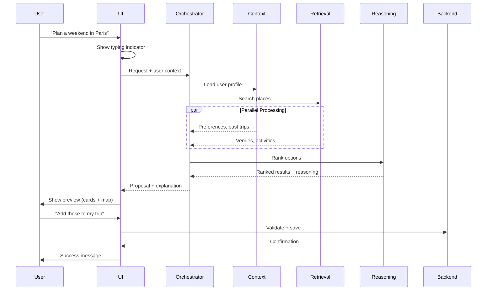
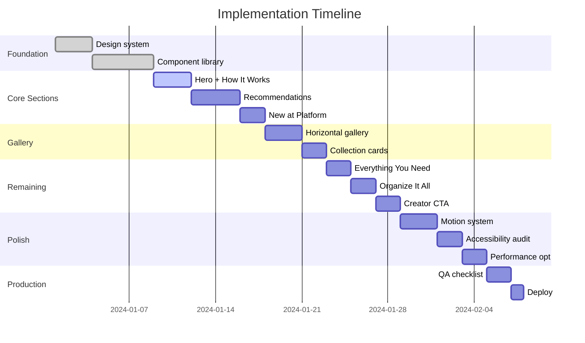

# Master Design Specification — Luxury AI Travel Platform

**Document Type:** Production-Ready Design + Implementation Specification  
**Audience:** Design, Frontend, Backend, AI Teams  
**Execution Model:** Systematic, Phase-Based

---

## CORE PRINCIPLES (NON-NEGOTIABLE)

```
1. Luxury clarity over visual noise
2. One purpose per section, one primary action
3. AI feels like a concierge, not a chatbot
4. Trust first: transparency, ratings, explainability
5. Mobile-first, desktop-polished
6. Every feature maps to a user action and outcome
```

**Design Mandate:** If a user cannot understand what to do within 5 seconds, the design fails.

---

## PHASE 1 — FOUNDATION

### Product Goal

**Problem:**  
Travel planning is fragmented (Google Maps + TripAdvisor + booking sites + spreadsheets). Users need intelligent, consolidated, trustworthy planning.

**User:**  
Travelers (25-45) seeking curated, personalized experiences without manual research overhead.

**Success Metric:**  
User creates complete trip itinerary in <10 minutes (vs. hours manually).

### Design Principles

| Principle | Expression |
|-----------|------------|
| **Luxury** | Editorial typography, generous whitespace, soft depth |
| **Calm** | Muted palette, slow motion, no visual noise |
| **Editorial** | Magazine-quality imagery, narrative rhythm |
| **Trust** | Ratings visible, AI reasoning available, real reviews |
| **Intelligent** | AI suggests, user decides, system explains |

### Grid System

**Desktop (1440px):**
```
Container: 1280px max-width
Columns:   12
Gutter:    24px
Margin:    80px
```

**Tablet (768px):**
```
Columns:   8
Gutter:    16px
Margin:    40px
```

**Mobile (375px):**
```
Columns:   4
Gutter:    16px
Margin:    24px
```

### Color System

**Neutrals (Stone/Warm Gray):**
```
50  (#fafaf9)  → Backgrounds
100 (#f5f5f4)  → Subtle surfaces
200 (#e7e5e4)  → Borders
300 (#d6d3d1)  → Disabled
500 (#78716c)  → Body text
700 (#44403c)  → Headings
900 (#1c1917)  → High contrast
```

**Accent (Amber/Gold):**
```
500 (#f59e0b)  → Primary actions
600 (#d97706)  → Hover states
```

**Semantic:**
```
Success: Emerald-600
Error:   Red-600
Warning: Orange-500
Info:    Blue-600
```

### Typography System

**Font Families:**
```
Display:  Canela (serif, editorial headlines)
UI:       Inter (sans-serif, body + interface)
Code:     Jetbrains Mono (technical data)
```

**Scale:**
```
Hero:     72px / 80px  (1.111 line-height)
H1:       48px / 56px  (1.167)
H2:       36px / 44px  (1.222)
H3:       24px / 32px  (1.333)
Body-L:   18px / 28px  (1.556)
Body:     16px / 24px  (1.5)
Body-S:   14px / 20px  (1.429)
Caption:  12px / 16px  (1.333)
```

**Weight:**
```
Light:   300 (large display only)
Regular: 400 (body text)
Medium:  500 (UI elements)
Semibold: 600 (headings)
Bold:    700 (emphasis)
```

### Motion Philosophy

**Principles:**
- Motion explains structure and relationships
- Motion rewards interaction
- Motion is calm, not aggressive
- Motion respects `prefers-reduced-motion`

**Tokens:**
```
Duration:
  instant: 0ms
  fast:    150ms
  base:    300ms
  slow:    600ms

Easing:
  default:  cubic-bezier(0.4, 0, 0.2, 1)
  smooth:   cubic-bezier(0.22, 1, 0.36, 1)
  entrance: cubic-bezier(0.16, 1, 0.3, 1)
```

**Allowed Animations:**
- Fade in/out
- Slide (Y axis, 20-40px)
- Gentle scale (0.95-1.05)
- Stagger (100ms delay between children)
- Scroll reveal (IntersectionObserver)
- Parallax (0.3-0.5x scroll speed, sparingly)

**Forbidden:**
- Aggressive bounces
- Rotation (unless purposeful)
- Shaking/vibration
- Constant movement (no infinite loops in view)

### Accessibility Baseline

**WCAG AA Compliance:**
```
[ ] Contrast ratio ≥4.5:1 (text)
[ ] Contrast ratio ≥3:1 (UI components)
[ ] Touch targets ≥44x44px
[ ] Keyboard navigation complete
[ ] Focus indicators visible (2px outline)
[ ] ARIA labels on interactive elements
[ ] Alt text on all images
[ ] Reduced-motion support
```

**Outcome:** Shared visual + interaction language documented.

---

## PHASE 2 — CORE SECTIONS (HOMEPAGE)

### Section Architecture



---

### 1. Hero Section

**Purpose:** Immediate value proposition + entry to AI experience.

**Layout:**

**Desktop:**
```
[Hero Image: 100vh, parallax background]
[Centered Content:]
  - Headline (72px, Canela)
  - Subheadline (18px, Inter)
  - Primary CTA: "Plan Your Trip" (amber-500)
  - Secondary: "Explore Collections"
[Scroll indicator (animated)]
```

**Mobile:**
```
[Hero Image: 60vh]
[Content: centered, padding 24px]
  - Headline (36px)
  - Subheadline (16px)
  - CTA stack (full-width)
```

**Key Components:**
- Hero background (image + gradient overlay)
- Text lockup (headline + subheadline)
- Button group
- Scroll indicator (chevron down, fade pulse)

**Primary CTA:** "Plan Your Trip" → `/app/trips/new`

**AI Involvement:** None (pure entry point).

---

### 2. How It Works

**Purpose:** Explain AI concierge value without intimidation.

**Layout:**

**Desktop:**
```
[Section Header]
  - Overline: "How It Works" (12px, uppercase, tracking-wide)
  - Headline: "Travel planning, simplified" (48px)
  - Subheadline: "Our AI concierge..." (18px)

[Content Grid: 3 columns, 24px gap]
  Column 1: [Icon] + Title + Description
  Column 2: [Icon] + Title + Description
  Column 3: [Icon] + Title + Description

[Interactive Demo: Chat Input (anchored)]
  - "Ask me anything about your trip..."
  - Live preview of AI capabilities
```

**Mobile:**
```
[Vertical stack, 24px gaps]
[Chat input at bottom (sticky)]
```

**Key Components:**
- Section header (overline + headline + subhead)
- Feature card (icon + title + description)
- Chat input (with placeholder animation)

**Primary CTA:** Try chat input inline.

**AI Involvement:**  
- Chat input shows AI responsiveness
- Placeholder examples: "Plan a weekend in Barcelona", "Find hidden gems in Tokyo"

---

### 3. Personalized Recommendations

**Purpose:** Build trust with curated, transparent suggestions.

**Layout:**

**Desktop:**
```
[Section Header]
  - Headline: "Personalized for you"
  - Subheadline: "Based on your interests and travel style"

[Card Grid: 4 columns, responsive]
Each card:
  - Image (4:5 ratio, rounded-xl)
  - Badge (category, top-left overlay)
  - Rating (stars + count, top-right)
  - Title (semibold, 18px)
  - Location (14px, muted)
  - Price indicator ($ - $$$$)
  - Action row:
    - Save (icon button, heart)
    - Add to Trip (text button)
    - Book (primary button)
```

**Mobile:**
```
[Horizontal scroll, snap-scroll]
[Cards: 280px wide, 16px gap]
```

**Key Components:**
- Recommendation card (illustrated style, soft shadow)
- Rating badge
- Price indicator
- Multi-action CTA row

**Primary CTA:** "Add to Trip" (most common action).

**AI Involvement:**  
- Cards show "Why this?" tooltip (AI reasoning)
- Recommendations adapt to user profile

---

### 4. New at Platform

**Purpose:** Feature discovery without overwhelming.

**Layout:**

**Desktop:**
```
[Section Header: centered]
  - Headline: "New at [Platform]"

[Bento Grid: 2x2 or asymmetric]
  - Large feature (2x size)
  - 3 smaller features
Each tile:
  - Background image or gradient
  - Title
  - Description (optional)
  - "Learn More" link
```

**Mobile:**
```
[Vertical carousel, swipeable]
[Full-width cards, snap-scroll]
```

**Key Components:**
- Bento grid container
- Feature tile (image + text overlay)
- "Learn More" CTA (subtle)

**Primary CTA:** "Learn More" → feature detail page.

**AI Involvement:** Optional (AI-powered features highlighted).

---

### 5. Everything You Need

**Purpose:** Show platform completeness (no need for other tools).

**Layout:**

**Desktop:**
```
[Section Header: centered]
  - Headline: "Everything you need to plan, book, and explore"

[Icon Grid: 6 columns, 3 rows]
Each item:
  - Icon (24px, stroke-2)
  - Label (14px, semibold)
  - Sub-label (12px, muted)

Features:
  - Photos & Videos
  - Maps & Directions
  - Reviews & Ratings
  - Booking & Reservations
  - Itinerary Builder
  - Group Planning
  - AI Recommendations
  - Local Insights
  - Weather & Best Times
  - Budget Tracking
  - Offline Access
  - Sharing & Collaboration
```

**Mobile:**
```
[3 columns, scrollable]
```

**Key Components:**
- Icon grid container
- Feature item (icon + label)

**Primary CTA:** None (informational).

**AI Involvement:** "AI Recommendations" item highlighted.

---

### 6. Organize It All

**Purpose:** Show organizational clarity (categories, lists, trips).

**Layout:**

**Desktop:**
```
[Split Layout: 50/50]

Left:
  - Headline: "Organize everything in one place"
  - Description
  - Category pills:
    - Restaurants
    - Hotels
    - Activities
    - Transportation
    - Shopping
  - CTA: "Start Planning"

Right:
  - Screenshot or illustration of app (itinerary view)
  - Subtle parallax on scroll
```

**Mobile:**
```
[Vertical stack]
[Image first, content below]
```

**Key Components:**
- Split layout container
- Category pill (rounded-full, hover state)
- App screenshot (with soft shadow)

**Primary CTA:** "Start Planning" → `/app/trips/new`.

**AI Involvement:** None (organizational feature).

---

### 7. Get Inspired (Horizontal Gallery)

**Purpose:** Scroll-driven exploration of destinations.

**Layout:**

**Desktop:**
```
[Full-width section, no container constraint]
[Horizontal scroll: snap-scroll, smooth]

[Section Header: left-aligned, margin-left]
  - Headline: "Get inspired"
  - Subheadline: "Explore curated collections from experts"

[Gallery:]
  - Cards: 320px wide, 400px tall
  - Gap: 24px
  - Padding: 0 80px
  - Snap points: center-aligned

Each card:
  - Image (full-cover)
  - Gradient overlay (bottom)
  - Title (24px, white, semibold)
  - Subtitle (14px, white/80)
  - Save icon (top-right)
  - CTA: Hover reveals "Explore Collection"
```

**Mobile:**
```
[Same structure, smaller cards]
[Cards: 280px wide, 350px tall]
[Padding: 0 24px]
```

**Key Components:**
- Horizontal scroll container
- Collection card (image + gradient + text)
- Scroll indicator (optional progress bar)

**Primary CTA:** Click card → collection detail page.

**AI Involvement:** Collections can be AI-curated ("Based on your interests").

---

### 8. Creator Economy CTA

**Purpose:** Monetization opportunity for power users.

**Layout:**

**Desktop:**
```
[Split Layout: 40/60]

Left:
  - Headline: "Share your expertise, earn income"
  - Description: "Create and sell curated travel guides..."
  - CTA: "Become a Creator"
  - Secondary: "Learn More"

Right:
  - Image: Creator using platform (aspirational)
  - Metric callouts:
    - "10,000+ active creators"
    - "Avg. $500/month"
    - "Top creator: $5k/month"
```

**Mobile:**
```
[Vertical stack]
[Image first, content below]
[Metrics: horizontal scroll]
```

**Key Components:**
- Split layout
- Metric badge (number + label)
- Aspirational image

**Primary CTA:** "Become a Creator" → `/creator/signup`.

**AI Involvement:** Optional ("AI helps format your guides").

---

### Footer

**Purpose:** Navigation, legal, trust signals.

**Layout:**

**Desktop:**
```
[4-column grid]

Column 1: Logo + tagline
Column 2: Product (links)
Column 3: Company (links)
Column 4: Support (links)

[Bottom Bar:]
  - Copyright
  - Legal links (Privacy, Terms)
  - Social icons
```

**Mobile:**
```
[Accordion sections]
[Logo at top]
[Legal + social at bottom]
```

**Key Components:**
- Footer nav column
- Link list
- Social icon row

**Primary CTA:** None (navigation).

---

## PHASE 3 — COMPONENT SYSTEM

### Component Hierarchy

```
Sections (Layouts)
├─ HeroSection
├─ FeatureSection
├─ GridSection
├─ GallerySection
└─ SplitSection

Cards (Content)
├─ RecommendationCard
├─ CollectionCard
├─ FeatureTile
└─ CategoryCard

Primitives (UI)
├─ Button (primary, secondary, tertiary, icon)
├─ Input (text, search, textarea)
├─ Badge (category, rating, price)
├─ Icon (lucide-react)
└─ Avatar

Animations (Wrappers)
├─ FadeIn
├─ SlideUp
├─ Stagger
└─ ScrollReveal
```

---

### Section Components

#### `<HeroSection>`

**Props:**
```typescript
{
  backgroundImage: string;
  headline: string;
  subheadline: string;
  primaryCTA: { label: string; href: string };
  secondaryCTA?: { label: string; href: string };
  showScrollIndicator?: boolean;
}
```

**Behavior:**
- Parallax background (0.5x scroll speed)
- Fade out content on scroll (opacity: 1 → 0 at 50vh)
- Scroll indicator disappears at 20vh

---

#### `<FeatureSection>`

**Props:**
```typescript
{
  overline?: string;
  headline: string;
  subheadline?: string;
  features: Array<{
    icon: string;
    title: string;
    description: string;
  }>;
  layout: 'grid' | 'list';
}
```

**Layout:**
- Desktop: 3-column grid
- Tablet: 2-column grid
- Mobile: 1-column stack

---

#### `<GridSection>`

**Props:**
```typescript
{
  headline: string;
  items: Array<{
    id: string;
    component: ReactNode;
  }>;
  columns: { desktop: number; tablet: number; mobile: number };
  gap: number;
}
```

**Behavior:**
- Responsive column count
- Staggered entrance animation (100ms delay)

---

#### `<GallerySection>`

**Props:**
```typescript
{
  headline: string;
  subheadline?: string;
  items: Array<{
    id: string;
    image: string;
    title: string;
    subtitle: string;
    href: string;
  }>;
  cardWidth: number;
}
```

**Behavior:**
- Horizontal scroll with snap points
- Scroll indicator (progress bar)
- Drag to scroll (desktop)
- Touch scroll (mobile)

---

### Card Components

#### `<RecommendationCard>`

**Props:**
```typescript
{
  id: string;
  image: string;
  category: string;
  title: string;
  location: string;
  rating: number;
  reviewCount: number;
  priceLevel: 1 | 2 | 3 | 4;
  onSave: () => void;
  onAddToTrip: () => void;
  onBook: () => void;
  aiReasoning?: string;
}
```

**States:**
- Default
- Hover (lift 4px, shadow upgrade)
- Saved (heart filled)

**Layout:**
```
[Image: 4:5 ratio]
[Badge: category (top-left)]
[Rating: stars + count (top-right)]
[Content padding: 16px]
  - Title (18px, semibold)
  - Location (14px, muted)
  - Price ($ icons)
  - Action row:
    - Save (icon button)
    - Add to Trip (secondary button)
    - Book (primary button, conditional)
```

---

#### `<CollectionCard>`

**Props:**
```typescript
{
  id: string;
  image: string;
  title: string;
  subtitle: string;
  itemCount: number;
  href: string;
}
```

**States:**
- Default
- Hover (image scale 1.05, gradient darkens)

**Layout:**
```
[Image: full-cover, 320x400px]
[Gradient overlay: bottom]
[Content: absolute bottom, padding 24px]
  - Title (24px, white, semibold)
  - Subtitle (14px, white/80)
  - Item count (12px, white/60)
```

---

### UI Primitives

#### `<Button>`

**Variants:**
```typescript
type Variant = 'primary' | 'secondary' | 'tertiary' | 'icon';

// Primary: amber-500, white text, shadow-md
// Secondary: white, stone-700 text, border
// Tertiary: transparent, stone-700 text, underline on hover
// Icon: transparent, hover bg-stone-100
```

**Sizes:**
```typescript
type Size = 'sm' | 'md' | 'lg';

// sm: 32px height, 12px padding, 14px text
// md: 44px height, 16px padding, 16px text
// lg: 56px height, 24px padding, 18px text
```

**States:**
- Default
- Hover (brightness 110%, lift 2px)
- Active (scale 0.98)
- Disabled (opacity 50%, cursor not-allowed)
- Loading (spinner replaces text)

---

#### `<Input>`

**Variants:**
```typescript
type Variant = 'text' | 'search' | 'textarea';
```

**Props:**
```typescript
{
  label?: string;
  placeholder: string;
  value: string;
  onChange: (value: string) => void;
  error?: string;
  icon?: ReactNode;
}
```

**States:**
- Default (border-stone-200)
- Focus (border-amber-500, ring-4 amber-500/20)
- Error (border-red-500, text-red-600)
- Disabled (bg-stone-50, cursor not-allowed)

---

#### `<Badge>`

**Variants:**
```typescript
type Variant = 'category' | 'rating' | 'price' | 'status';

// Category: bg-amber-100, text-amber-800, rounded-full
// Rating: stars + number, inline
// Price: $ symbols, stone-500
// Status: semantic colors (success, error, warning)
```

---

### Animation Wrappers

#### `<FadeIn>`

**Props:**
```typescript
{
  children: ReactNode;
  duration?: number; // default 300ms
  delay?: number;
}
```

**Animation:**
```css
opacity: 0 → 1
```

---

#### `<SlideUp>`

**Props:**
```typescript
{
  children: ReactNode;
  distance?: number; // default 20px
  duration?: number; // default 300ms
  delay?: number;
}
```

**Animation:**
```css
opacity: 0 → 1
transform: translateY(20px) → translateY(0)
```

---

#### `<Stagger>`

**Props:**
```typescript
{
  children: ReactNode[];
  staggerDelay?: number; // default 100ms
}
```

**Behavior:**
- Each child animates with incremental delay
- Uses `<SlideUp>` internally

---

#### `<ScrollReveal>`

**Props:**
```typescript
{
  children: ReactNode;
  threshold?: number; // default 0.2
  triggerOnce?: boolean; // default true
}
```

**Behavior:**
- Triggers when element enters viewport (IntersectionObserver)
- Animates with `<SlideUp>`

---

### State Patterns

#### Loading State

**Pattern:**
```tsx
{isLoading ? (
  <SkeletonCard />
) : (
  <RecommendationCard {...props} />
)}
```

**Skeleton Rules:**
- Match component dimensions
- Subtle pulse animation (opacity 0.5 ↔ 1.0, 1.5s)
- Rounded rectangles for text
- Circles for avatars

---

#### Empty State

**Pattern:**
```tsx
<EmptyState
  icon={<MapPin />}
  title="No trips yet"
  description="Start planning your next adventure"
  cta={{
    label: "Create Trip",
    href: "/app/trips/new"
  }}
/>
```

**Layout:**
- Centered vertically + horizontally
- Icon (48px, stone-300)
- Title (20px, semibold)
- Description (14px, muted)
- CTA button (primary)

---

#### Error State

**Pattern:**
```tsx
<ErrorState
  title="Something went wrong"
  description="We couldn't load your recommendations"
  actions={[
    { label: "Try Again", onClick: retry },
    { label: "Go Home", href: "/" }
  ]}
/>
```

**Layout:**
- Similar to empty state
- Red accent color
- Retry action always available

---

## PHASE 4 — AI & USER FLOWS

### Primary User Journey



**Journey Steps:**

1. **Land** → Hero + value prop (5 seconds to understand)
2. **Understand** → "How It Works" section (AI introduction)
3. **Engage** → Try chat OR browse recommendations
4. **Explore** → Save interesting places
5. **Plan** → Create trip (manual or AI-assisted)
6. **Review** → Itinerary view (map + timeline)
7. **Refine** → AI optimizes (user confirms)
8. **Save/Book** → Finalize trip, export, or book
9. **Share** → Collaborate or publish

**Success:** User completes trip creation in <10 minutes.

---

### AI Interaction Flow



**Key Points:**

1. **User inputs query** (natural language)
2. **UI shows loading state** (typing indicator, subtle)
3. **Orchestrator routes request** to agents
4. **Agents work in parallel:**
   - Context loads user profile (preferences, past trips)
   - Retrieval searches places (maps, reviews, photos)
   - Reasoning ranks options (based on preferences)
5. **AI returns proposal** with explanation
6. **UI shows preview** (cards + map, not committed)
7. **User confirms or modifies**
8. **Backend validates** (ensures data integrity)
9. **System executes** + confirms to user

---

### When AI Suggests vs. Executes

#### AI Suggests (Read-Only)

**Scenarios:**
- Search results
- Recommendations
- Itinerary optimization
- Alternative options
- "You might like..."

**UX Pattern:**
```
AI shows → User reviews → User decides
```

**No confirmation needed** (non-destructive).

---

#### AI Executes (Write)

**Scenarios:**
- Add place to trip
- Rearrange itinerary
- Book reservation (future)
- Share trip with group

**UX Pattern:**
```
AI proposes → User previews → User confirms → System executes
```

**Confirmation required** (data changes).

---

### User Control Mechanisms

**1. Preview Before Apply**
```
AI: "I optimized your day to reduce travel time"
UI: Shows before/after comparison (side-by-side)
User: Clicks "Apply" or "Discard"
```

**2. Undo/Redo**
```
Action: User accidentally deletes place
UI: Toast notification with "Undo" button (5 seconds)
User: Clicks "Undo" → place restored
```

**3. Manual Override**
```
AI: Suggests 9am start time
User: Drags event to 11am
System: Respects user override (AI adapts)
```

**4. Explainability**
```
AI: Recommends restaurant
UI: Shows "Why this?" tooltip
Content: "Based on your love of Italian cuisine and high ratings"
```

**5. Opt-Out**
```
User: Disables AI suggestions in settings
System: Falls back to manual planning (no AI prompts)
```

---

## PHASE 5 — MOTION & INTERACTIONS

### Entrance Animations

#### Page Load Sequence

```typescript
1. Hero (immediate)
   - Background image (0ms)
   - Text content (fade in, 300ms, delay 100ms)
   - CTA buttons (slide up, 300ms, delay 200ms)

2. Sections (staggered, scroll-based)
   - Trigger: When section enters viewport (20% visible)
   - Animation: Fade + slide up (300ms)
   - Stagger: 100ms between child elements
```

**Implementation:**
```tsx
<ScrollReveal threshold={0.2}>
  <Stagger staggerDelay={100}>
    <FeatureCard />
    <FeatureCard />
    <FeatureCard />
  </Stagger>
</ScrollReveal>
```

---

#### Card Entrance

**Grid of Cards:**
```typescript
1. Container fades in (300ms)
2. Cards stagger in (100ms delay each)
3. Animation: fade + slide up (20px)
```

**Example:**
```tsx
<GridSection columns={{ desktop: 4, tablet: 2, mobile: 1 }}>
  {cards.map((card, index) => (
    <SlideUp key={card.id} delay={index * 100}>
      <RecommendationCard {...card} />
    </SlideUp>
  ))}
</GridSection>
```

---

### Hover & Tap Feedback

#### Button Hover

```css
Default:
  background: amber-500
  shadow: md (0 4px 12px rgba(0,0,0,0.08))
  transform: translateY(0)

Hover:
  background: amber-600 (or brightness 110%)
  shadow: lg (0 8px 24px rgba(0,0,0,0.12))
  transform: translateY(-2px)
  transition: all 200ms cubic-bezier(0.4, 0, 0.2, 1)
```

---

#### Card Hover

```css
Default:
  shadow: md
  transform: translateY(0)
  image scale: 1.0

Hover:
  shadow: lg
  transform: translateY(-4px)
  image scale: 1.05 (Ken Burns effect)
  transition: all 300ms cubic-bezier(0.22, 1, 0.36, 1)
```

---

#### Input Focus

```css
Default:
  border: 1px solid stone-200

Focus:
  border: 1px solid amber-500
  ring: 4px amber-500/20 (box-shadow)
  transform: scale(1.01)
  transition: all 200ms
```

---

### Parallax & Depth

#### Hero Parallax

**Rule:** Background scrolls slower than content.

```typescript
Background scroll speed: 0.5x
Content scroll speed: 1.0x
Fade out: opacity 1.0 → 0 (0vh → 50vh)
```

**Implementation:**
```tsx
const scrollY = useScrollY();
const backgroundY = useTransform(scrollY, [0, 500], [0, 250]); // 0.5x
const opacity = useTransform(scrollY, [0, 300], [1, 0]);

<motion.div style={{ y: backgroundY }}>
  <HeroBackground />
</motion.div>
<motion.div style={{ opacity }}>
  <HeroContent />
</motion.div>
```

---

#### Card Depth (Subtle)

**Rule:** On hover, create depth with shadow + lift.

```css
/* No parallax on individual cards (too much motion) */
/* Use shadow + transform only */

Hover:
  transform: translateY(-4px) scale(1.01)
  shadow: 0 12px 32px rgba(0,0,0,0.15)
```

---

### Scroll Effects

#### Horizontal Gallery

**Behavior:**
- Snap to center of each card
- Smooth scroll (CSS `scroll-behavior: smooth`)
- Drag to scroll (desktop)
- Progress indicator (optional)

```css
.gallery-container {
  display: flex;
  overflow-x: auto;
  scroll-snap-type: x mandatory;
  scroll-behavior: smooth;
  -webkit-overflow-scrolling: touch;
}

.gallery-card {
  scroll-snap-align: center;
  flex-shrink: 0;
}
```

---

#### Scroll Progress Indicator

**Use Case:** Long-form content, galleries.

```tsx
const { scrollYProgress } = useScroll();

<motion.div
  style={{
    scaleX: scrollYProgress,
    transformOrigin: 'left',
    position: 'fixed',
    top: 0,
    left: 0,
    right: 0,
    height: 4,
    background: 'amber-500',
    zIndex: 100
  }}
/>
```

---

#### Scroll-Triggered Animations

**Rule:** Animate on entrance, not during scroll.

```typescript
IntersectionObserver triggers animation when:
- threshold: 0.2 (20% of element visible)
- triggerOnce: true (animate once, not on every scroll)
```

---

### Reduced-Motion Support

**Critical:** All animations must respect `prefers-reduced-motion`.

```css
@media (prefers-reduced-motion: reduce) {
  * {
    animation-duration: 0.01ms !important;
    animation-iteration-count: 1 !important;
    transition-duration: 0.01ms !important;
  }
}
```

**React Implementation:**
```tsx
const prefersReducedMotion = window.matchMedia(
  '(prefers-reduced-motion: reduce)'
).matches;

const duration = prefersReducedMotion ? 0 : 300;
```

---

## PHASE 6 — IMPLEMENTATION PLAN

### Phased Execution



---

### Phase 1: Foundation (8 days)

**Tasks:**
```
[ ] Define design tokens in CSS/Tailwind
[ ] Create typography scale
[ ] Build color system (neutrals + accent)
[ ] Set up motion tokens (duration, easing)
[ ] Create base layout (header, footer, container)
[ ] Build primitive components (Button, Input, Badge)
[ ] Set up animation wrappers (FadeIn, SlideUp, Stagger)
```

**Validation:**
```
[ ] Tokens accessible globally
[ ] Components reusable
[ ] Motion respects prefers-reduced-motion
[ ] Accessibility baseline met (focus indicators, keyboard nav)
```

**Completion Criteria:**
- Design system documented
- Component library functional
- No visual inconsistencies

---

### Phase 2: Core Sections (9 days)

**Tasks:**
```
[ ] Build Hero section (parallax background, CTAs)
[ ] Build How It Works section (3-column grid)
[ ] Add chat input (placeholder only, no AI yet)
[ ] Build Recommendations section (4-column card grid)
[ ] Create RecommendationCard component
[ ] Add empty/loading states for recommendations
```

**Validation:**
```
[ ] Hero visible on all devices
[ ] Parallax smooth (60fps)
[ ] Cards responsive (4 → 2 → 1 columns)
[ ] Empty state shows when no data
```

**Completion Criteria:**
- Hero + first 2 sections complete
- Responsive on mobile, tablet, desktop
- Performance: LCP <3s

---

### Phase 3: Gallery + Recommendations (5 days)

**Tasks:**
```
[ ] Build horizontal gallery (snap-scroll)
[ ] Create CollectionCard component
[ ] Add drag-to-scroll (desktop)
[ ] Add touch scroll (mobile)
[ ] Implement New at Platform (bento grid)
[ ] Add lazy loading for images
```

**Validation:**
```
[ ] Gallery scrolls smoothly (60fps)
[ ] Snap points work on all browsers
[ ] Images lazy load (below fold)
[ ] No layout shift when images load
```

**Completion Criteria:**
- Gallery functional on all devices
- Bento grid responsive
- Performance: CLS <0.1

---

### Phase 4: Remaining Sections (6 days)

**Tasks:**
```
[ ] Build Everything You Need (icon grid)
[ ] Build Organize It All (split layout)
[ ] Build Creator Economy CTA (split layout)
[ ] Add app screenshot illustrations
[ ] Build footer (4-column layout)
```

**Validation:**
```
[ ] Icon grid responsive (6 → 3 → 2 columns)
[ ] Split layouts stack on mobile
[ ] Footer accordion works on mobile
```

**Completion Criteria:**
- All homepage sections complete
- No dead links
- Footer functional

---

### Phase 5: Polish & Accessibility (7 days)

**Tasks:**
```
[ ] Add scroll-triggered animations (IntersectionObserver)
[ ] Implement staggered card entrance
[ ] Add hover states to all interactive elements
[ ] Audit keyboard navigation
[ ] Add focus indicators (2px outline)
[ ] Add ARIA labels to buttons/links
[ ] Test with screen reader (mentally verify)
[ ] Add skip-to-content link
```

**Validation:**
```
[ ] All animations trigger on scroll
[ ] Hover states feel responsive
[ ] Tab navigation complete (no skipped elements)
[ ] Focus indicators visible (2px amber-500)
[ ] ARIA labels present on icon buttons
```

**Completion Criteria:**
- WCAG AA compliance
- All animations smooth (60fps)
- Reduced-motion support verified

---

### Phase 6: Production Readiness (5 days)

**Tasks:**
```
[ ] Optimize images (WebP, correct sizes)
[ ] Lazy load all below-fold images
[ ] Run Lighthouse audit (target: >90)
[ ] Fix CLS issues (reserve space for images)
[ ] Fix any console errors
[ ] Test on real devices (iPhone, Android, tablet)
[ ] Verify all links work
[ ] Add meta tags (SEO)
```

**Validation:**
```
[ ] Lighthouse Performance >90
[ ] Lighthouse Accessibility >95
[ ] Lighthouse Best Practices >90
[ ] No console errors
[ ] Works on Safari, Chrome, Firefox, Edge
```

**Completion Criteria:**
- Production-ready
- Performance targets met
- No blocking issues

---

## PHASE 7 — QUALITY & ACCEPTANCE

### Visual Quality Checklist

**Typography:**
```
[ ] Hierarchy clear (H1 > H2 > H3 > Body)
[ ] Line-height consistent (1.5 for body, 1.2 for headings)
[ ] Font weights used correctly (400 body, 600 headings)
[ ] No orphaned text (widow/orphan control)
[ ] Responsive sizes (smaller on mobile)
```

**Spacing:**
```
[ ] Consistent vertical rhythm (multiples of 4px)
[ ] Section padding generous (80px desktop, 40px mobile)
[ ] Card padding consistent (16-24px)
[ ] No awkward gaps or overlaps
```

**Color:**
```
[ ] Contrast ratio ≥4.5:1 (body text)
[ ] Contrast ratio ≥3:1 (UI elements)
[ ] Color used purposefully (not decorative)
[ ] Semantic colors consistent (success = green, error = red)
```

**Imagery:**
```
[ ] Images high-quality (1.5x retina)
[ ] Aspect ratios consistent (4:5 for cards, 16:9 for hero)
[ ] No pixelation or artifacts
[ ] Alt text on all images
[ ] Lazy loading below fold
```

---

### UX Clarity Checklist

**Navigation:**
```
[ ] Primary action obvious on every screen
[ ] Back navigation available (breadcrumbs, back button)
[ ] Footer navigation complete
[ ] No dead links (all CTAs go somewhere)
[ ] External links marked (icon, target="_blank")
```

**Feedback:**
```
[ ] Loading states for async actions (spinner, skeleton)
[ ] Success confirmation after actions (toast, modal)
[ ] Error states with recovery path (retry button)
[ ] Empty states when no data (friendly message + CTA)
```

**Affordances:**
```
[ ] Buttons look clickable (shadow, hover state)
[ ] Links underlined or distinct color
[ ] Interactive elements have hover states
[ ] Forms have clear labels + placeholders
[ ] Required fields marked (asterisk)
```

---

### AI Usefulness Checklist

**Explainability:**
```
[ ] AI recommendations show reasoning ("Why this?")
[ ] AI actions preview before executing
[ ] AI errors handled gracefully (fallback to manual)
[ ] User can disable AI (settings)
```

**Control:**
```
[ ] User confirms before writes (no silent actions)
[ ] User can undo AI changes (toast with "Undo")
[ ] User can override AI suggestions (drag to reorder)
[ ] Manual fallback always available
```

**Performance:**
```
[ ] AI responses <3 seconds (target <2s)
[ ] AI loading states clear (typing indicator, progress)
[ ] AI errors don't break UI (show error state)
[ ] AI requests logged (for debugging)
```

---

### Performance Checklist

**Core Web Vitals:**
```
[ ] First Contentful Paint (FCP) <2s
[ ] Largest Contentful Paint (LCP) <3s
[ ] Cumulative Layout Shift (CLS) <0.1
[ ] First Input Delay (FID) <100ms
[ ] Time to Interactive (TTI) <4s
```

**Optimization:**
```
[ ] Images optimized (WebP, correct size)
[ ] Images lazy loaded (below fold)
[ ] Fonts preloaded (WOFF2 format)
[ ] Critical CSS inlined
[ ] JS code split (lazy load routes)
[ ] Bundle size <500KB initial
```

**Rendering:**
```
[ ] No layout shift when images load (aspect-ratio reserved)
[ ] No flash of unstyled content (FOUC)
[ ] Animations 60fps (GPU-accelerated)
[ ] Scroll smooth (no jank)
```

---

### Accessibility Checklist

**Keyboard:**
```
[ ] Tab navigation complete (all interactive elements)
[ ] Focus indicators visible (2px outline)
[ ] Skip-to-content link (first tab stop)
[ ] No keyboard traps (can exit modals)
[ ] Logical tab order (left-to-right, top-to-bottom)
```

**Screen Reader:**
```
[ ] ARIA labels on icon buttons
[ ] ARIA live regions for dynamic content
[ ] Alt text on images (descriptive, not "image of...")
[ ] Headings hierarchical (h1 → h2 → h3, no skips)
[ ] Form labels associated with inputs
```

**Visual:**
```
[ ] Color contrast ≥4.5:1 (body text)
[ ] Color contrast ≥3:1 (UI elements)
[ ] Text resizable (up to 200% without breaking layout)
[ ] No color-only indicators (use icon + color)
[ ] Focus indicators high contrast
```

**Motion:**
```
[ ] Reduced-motion support (prefers-reduced-motion)
[ ] Animations disable-able (user setting)
[ ] No auto-playing video with sound
[ ] No flashing content (seizure risk)
```

---

### Responsiveness Checklist

**Breakpoints:**
```
[ ] Desktop (1440px): All sections visible
[ ] Tablet (768px): Grid collapses (4→2 columns)
[ ] Mobile (375px): Stack layout (2→1 column)
[ ] Large (1920px): Container max-width enforced
```

**Touch:**
```
[ ] Touch targets ≥44x44px
[ ] Spacing between tappable elements ≥8px
[ ] Swipe gestures natural (horizontal gallery)
[ ] No hover-dependent functionality
[ ] One-handed usability (key actions in thumb zone)
```

**Layout:**
```
[ ] No horizontal scroll (unless intentional)
[ ] Text readable without zoom (≥16px body)
[ ] Images scale proportionally
[ ] Videos responsive (max-width: 100%)
[ ] Modals full-screen on mobile
```

---

### Troubleshooting: Common Issues

#### Issue: Layout Shift When Images Load

**Symptom:** Content jumps as images load (high CLS).

**Solution:**
```tsx
// Reserve space with aspect-ratio
<div style={{ aspectRatio: '4/5' }}>
  
</div>

// Or use explicit width/height

```

---

#### Issue: Animations Janky (Not 60fps)

**Symptom:** Stuttering, laggy animations.

**Solution:**
```css
/* Only animate transform and opacity (GPU-accelerated) */
.element {
  transition: transform 300ms, opacity 300ms;
}

/* Avoid animating width, height, top, left */
/* Use transform: scale() and translate() instead */
```

---

#### Issue: Parallax Causing Scroll Lag

**Symptom:** Slow scroll performance with parallax.

**Solution:**
```tsx
// Use CSS transform (not top/left)
// Use passive event listeners
useEffect(() => {
  const handleScroll = () => {
    requestAnimationFrame(() => {
      // Update transform here
    });
  };
  window.addEventListener('scroll', handleScroll, { passive: true });
  return () => window.removeEventListener('scroll', handleScroll);
}, []);
```

---

#### Issue: Horizontal Gallery Not Snapping

**Symptom:** Cards don't center on scroll.

**Solution:**
```css
.gallery-container {
  scroll-snap-type: x mandatory;
  scroll-padding: 0 80px; /* Account for side padding */
}

.gallery-card {
  scroll-snap-align: center;
}
```

---

#### Issue: AI Responses Too Slow

**Symptom:** Users wait >3 seconds for AI.

**Solution:**
- Show loading state immediately (typing indicator)
- Stream responses (show partial results)
- Cache common queries
- Optimize AI prompts (reduce token count)
- Add timeout (fallback after 5s)

---

#### Issue: Focus Indicators Not Visible

**Symptom:** Can't see where keyboard focus is.

**Solution:**
```css
*:focus-visible {
  outline: 2px solid amber-500;
  outline-offset: 2px;
}

/* Remove default outline */
*:focus {
  outline: none;
}
```

---

## SUCCESS CRITERIA

### The product is ready to ship when:

**Design:**
```
✓ Visual hierarchy clear (5-second test passes)
✓ Design system consistent (no one-offs)
✓ Responsive on all devices (mobile, tablet, desktop)
✓ Accessibility baseline met (WCAG AA)
```

**UX:**
```
✓ Primary action obvious on every screen
✓ Feedback on all actions (loading, success, error)
✓ Empty and error states friendly
✓ AI feels helpful, not intrusive
```

**AI:**
```
✓ AI explains recommendations (reasoning visible)
✓ User confirms before writes (preview → approve)
✓ Manual fallback always available
✓ AI errors handled gracefully
```

**Performance:**
```
✓ Lighthouse score >90 (all categories)
✓ LCP <3s, FCP <2s, CLS <0.1
✓ Animations 60fps (no jank)
✓ Bundle size <500KB initial
```

**Trust:**
```
✓ Ratings and reviews visible
✓ Pricing transparent
✓ Privacy policy linked
✓ No dark patterns (honest UI)
```

---

## FINAL VALIDATION

**Ask these questions:**

1. **Can a first-time user understand the product in 5 seconds?**  
   → If no: simplify hero, clarify value prop.

2. **Does the product work without AI?**  
   → If no: add manual paths.

3. **Can every action be reversed?**  
   → If no: add undo/redo.

4. **Does motion improve understanding?**  
   → If no: remove motion.

5. **Is the product accessible to keyboard users?**  
   → If no: fix tab navigation + focus indicators.

6. **Is the product production-ready?**  
   → If no: revisit quality checklist.

---

**If all answers are "yes," the product ships.**

---

## APPENDIX: REFERENCE IMAGE

The attached reference image shows a Mindtrip-style luxury travel platform with:
- Clean, editorial hero with strong typography
- How It Works section with visual explanation
- Personalized recommendation cards (ratings, images, CTAs)
- Feature discovery (New at Platform)
- Everything You Need (icon grid)
- Organized categories
- Horizontal gallery (Get Inspired)
- Creator economy CTA
- Footer

This specification codifies those patterns into a systematic, production-ready framework.

---

**END OF SPECIFICATION**
