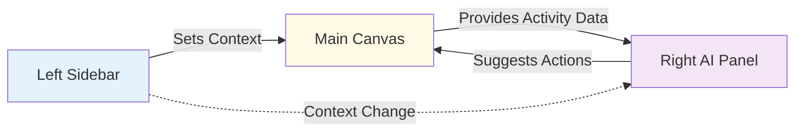
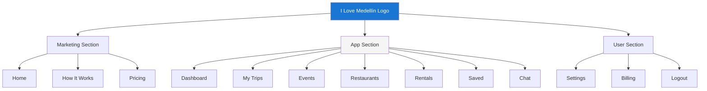
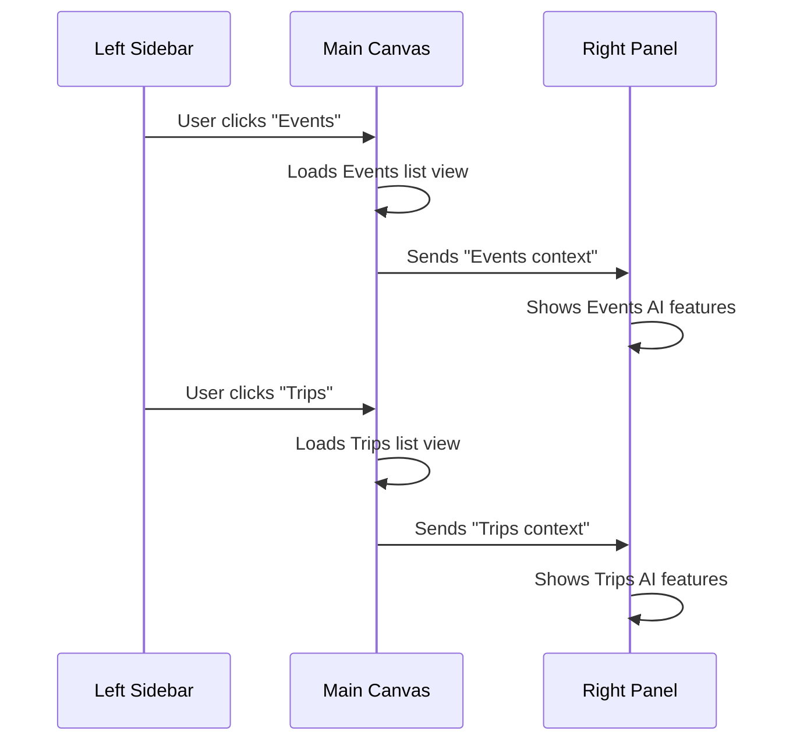
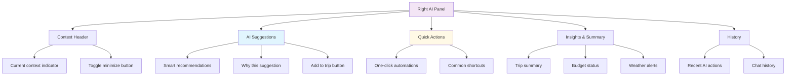
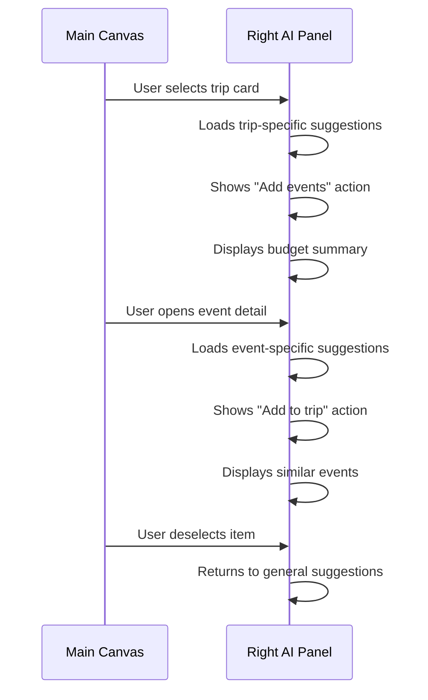
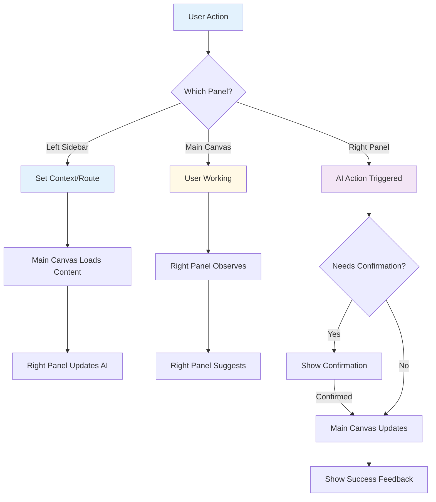
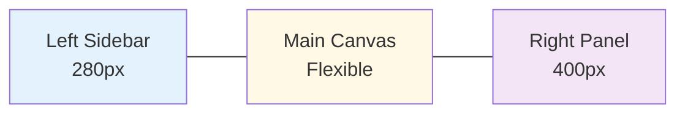
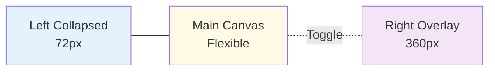
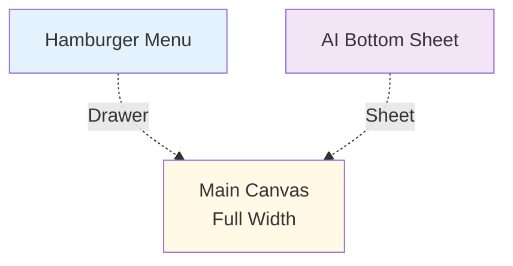

# DASHBOARD SYSTEM - 3-PANEL ARCHITECTURE
## Design Prompts for Left Sidebar + Main Canvas + Right AI Panel

**Document:** 08-dashboard-system.md  
**Phase:** Design System Definition  
**Purpose:** Production-ready prompts for building consistent 3-panel dashboard  
**Last Updated:** December 24, 2024

---

## 1) SYSTEM MENTAL MODEL PROMPT

### Prompt: Understand the 3-Panel Dashboard Architecture

**Context:**  
You are designing a dashboard system for I Love Medellín, a trip planning platform. The interface uses a three-panel layout that separates concerns clearly.

**The Three Panels:**

**LEFT SIDEBAR - Navigation & Scope**  
This panel answers: "Where am I in the system?"  
Responsibilities: Global navigation, module switching, context selection, user identity.  
Never contains: Forms, data entry, AI output, detailed content, action buttons beyond navigation.

**MAIN CANVAS - Execution Area**  
This panel answers: "What am I working on?"  
Responsibilities: Primary work surface, lists, details, forms, wizards, dashboards, user's active task.  
Never contains: Navigation that changes modules, AI suggestions (those go right), redundant controls.

**RIGHT SIDEBAR - AI Intelligence Layer**  
This panel answers: "What should I know or do next?"  
Responsibilities: AI suggestions, context-aware actions, insights, next steps, automations, explanations.  
Never contains: Required workflow steps, primary navigation, core CRUD forms.

**Panel Communication Model:**

**Key Principles:**

**Separation of Concerns**  
Each panel has one clear job. No overlap. If you're unsure where something goes, ask: "Is this navigation, execution, or intelligence?"

**Information Flow**  
Left sidebar sets scope → Main canvas shows work → Right panel observes and assists. Never reverse this flow.

**User Control**  
Human always in driver's seat. Left sidebar is user's GPS. Main canvas is user's workspace. Right panel is user's co-pilot but never the pilot.

**Scalability**  
New modules (Events, Restaurants, Rentals) follow same pattern. Left adds nav item. Main shows module content. Right provides module-specific AI.

**What This Means for Designers:**  
Never blur panel boundaries. Each panel has distinct visual language. Left is utilitarian. Main is spacious. Right is assistive.

**What This Means for Engineers:**  
State management reflects panel separation. Left manages route/context. Main manages data. Right manages suggestions. No shared state across boundaries.

**What This Means for AI Agents:**  
AI observes Main canvas activity. AI outputs to Right panel only. AI never hijacks Left sidebar or Main canvas without explicit user trigger.

---

## 2) LEFT SIDEBAR SETUP PROMPT

### Prompt: Design the Left Sidebar (Navigation & Scope)

**Objective:**  
Create a persistent navigation sidebar that helps users understand where they are in the system and move between major sections.

**Core Requirements:**

**Visual Hierarchy**  
Top section: Brand logo and app name.  
Middle section: Primary navigation organized by context (Marketing, App, Modules).  
Bottom section: User menu, settings, logout.

**Navigation Structure:**

**Component Specifications:**

**Logo Area (Top)**  
Height: 64 pixels.  
Content: Logo icon + "I Love Medellín" wordmark.  
Background: Primary brand color or white.  
Behavior: Clicking logo returns to default landing (/ if logged out, /app if logged in).

**Navigation Items**  
Each item: Icon (24px) + Label (14px).  
Spacing: 8px vertical padding per item.  
Icon position: Left-aligned, 16px from sidebar edge.  
Label position: 12px to right of icon.

**States:**

**Default State**  
Background: Transparent.  
Text color: Neutral 600.  
Icon color: Neutral 500.

**Hover State**  
Background: Neutral 50.  
Text color: Neutral 900.  
Icon color: Primary 600.  
Transition: 150ms ease.

**Active State**  
Background: Primary 50.  
Text color: Primary 700.  
Icon color: Primary 600.  
Left border: 3px solid Primary 600.  
Font weight: 600 (semibold).

**Collapsed State**  
Width: 72px (icons only).  
Labels hidden.  
Tooltip on hover showing label.  
Toggle button at bottom to expand.

**Nested Sections Rules:**

**When to Nest**  
Use nested navigation only when module has clear sub-sections (e.g., Trips → My Trips, Archived Trips).  
Maximum nesting depth: 2 levels.  
Nested items indented 32px from parent.

**When NOT to Nest**  
Don't nest if sub-items are equal importance.  
Don't nest for filters or views (those go in Main canvas).  
Don't nest to save space (use modules instead).

**Mobile Behavior:**

**Drawer Pattern**  
On screens under 768px, sidebar becomes drawer.  
Drawer triggered by hamburger menu in header.  
Drawer slides in from left with backdrop overlay.  
Backdrop click or close button dismisses drawer.  
Drawer includes all navigation items in same hierarchy.

**Data the Sidebar Controls:**

**Active Route**  
Sidebar sets current route via React Router.  
Route change triggers Main canvas content switch.  
Route change resets AI context in Right panel.

**Module Context**  
Clicking "Trips" sets module context to trips.  
Clicking "Events" sets module context to events.  
Main canvas shows module-specific content.  
Right panel shows module-specific AI features.

**User Session**  
User menu shows current user name and avatar.  
Logout clears session and redirects to marketing homepage.

**What Sidebar Must NEVER Contain:**

Never include: Search bars (those go in Main canvas header).  
Never include: Action buttons like "Create New Trip" (those go in Main canvas).  
Never include: Filters or sorting controls (those go in Main canvas).  
Never include: AI chat interface (that goes in Right panel).  
Never include: Notifications list (use icon with badge, detail view in Main or Right).  
Never include: Forms or data entry (Main canvas only).  
Never include: Analytics or dashboards (Main canvas content).

**Spacing & Dimensions:**

**Desktop**  
Width when expanded: 280px.  
Width when collapsed: 72px.  
Background: White or Neutral 50.  
Right border: 1px solid Neutral 200.

**Tablet**  
Same as desktop but defaults to collapsed state.  
Expands on hover or click.

**Mobile**  
Full width drawer (320px max).  
No collapsed state (drawer is binary: open or closed).

**Accessibility Requirements:**

Keyboard navigation: Tab through nav items, Enter to activate.  
Screen reader: Announce active route, module context.  
ARIA labels: aria-current="page" on active item.  
Focus visible: Clear focus ring on keyboard navigation.  
Contrast: WCAG AA minimum (4.5:1 for text).

---

## 3) MAIN CANVAS SETUP PROMPT

### Prompt: Design the Main Canvas (Execution Area)

**Objective:**  
Create a flexible, spacious work area where users complete their primary tasks: viewing lists, editing details, creating trips, managing bookings.

**Core Principles:**

**Spaciousness**  
Main canvas is generous with whitespace. Never cramped.  
Content max-width: 1200px on large screens.  
Margins: Minimum 32px on desktop, 16px on mobile.

**Focus**  
One primary task at a time.  
Clear page headers indicate current task.  
Hierarchy guides eye from header → content → actions.

**Adaptability**  
Canvas layout changes based on content type: list, detail, wizard, dashboard.  
Canvas scrolls independently from sidebars.  
Canvas responds to sidebar state changes (collapsed = more space).

**Layout Patterns:**

**List View Pattern**  
Page header: Title + description + primary action (e.g., "Create New Trip").  
Filters bar: Search, category filters, sort dropdown.  
Content area: Grid or list of cards.  
Empty state: Centered message + illustration + CTA.  
Pagination: Bottom center or infinite scroll.

**Detail View Pattern**  
Page header: Back button + title + actions (Edit, Delete).  
Content sections: Organized by related information.  
Tabs: If detail has multiple views (Overview, Itinerary, Budget).  
Sticky header: Header stays visible on scroll.  
Related items: Sidebar or bottom section.

**Wizard Pattern**  
Step indicator: Top center showing progress (Step 2 of 5).  
Form sections: One section per screen, clear labels.  
Navigation: Previous + Next buttons at bottom.  
Validation: Inline errors, Next disabled until valid.  
Progress saved: Auto-save or explicit save points.

**Dashboard Pattern**  
Greeting: Personalized welcome message.  
Stats cards: 2-4 key metrics in card grid.  
Activity feed: Recent trips, events, updates.  
Quick actions: Shortcuts to common tasks.  
Sections: Organized by priority (Upcoming, Recommendations, Recent).

**Page Header Rules:**

**Always Include**  
Page title (h1 or h2).  
Breadcrumbs if nested (Home → Trips → Trip Name).  
Primary action button if applicable.

**Optionally Include**  
Description or subtitle.  
Secondary actions (Export, Share).  
Context indicators (date range, selected filters).

**Never Include**  
Navigation that duplicates sidebar.  
AI suggestions (those go Right panel).  
Unrelated content.

**Action Placement Rules:**

**Primary Actions**  
Top right of page header.  
Large, high contrast button.  
One primary action per page maximum.  
Examples: "Create Trip", "Save Changes", "Book Now".

**Secondary Actions**  
Next to primary but less prominent (outline or ghost button).  
Or in overflow menu (three dots).  
Examples: "Export PDF", "Share Link", "Duplicate".

**Inline Actions**  
Within cards or list items.  
Icon buttons or small text buttons.  
Examples: Edit, Delete, Add to Trip.

**Scroll Behavior:**

**Independent Scrolling**  
Main canvas scrolls independently from sidebars.  
Sidebars remain fixed (or sticky) while canvas scrolls.  
This allows long content without losing navigation context.

**Sticky Elements**  
Page header can stick to top on scroll.  
Action buttons can stick to bottom on mobile.  
Tabbed navigation sticks below header.

**Scroll to Top**  
Provide floating "Scroll to Top" button when user scrolls deep.  
Appears bottom right corner after scrolling 500px.

**Empty States:**

**When to Show**  
No trips created yet.  
No search results found.  
No events in selected date range.  
Feature not yet configured.

**Components**  
Illustration or icon (large, centered).  
Heading: Friendly message ("No trips yet!").  
Description: Brief explanation.  
Primary action: "Create Your First Trip" button.  
Secondary link: "Learn More" or "See Examples".

**Tone**  
Encouraging, not discouraging.  
Actionable, not dead-end.  
Clear next step.

**Loading States:**

**Initial Load**  
Skeleton screens matching content layout.  
Card skeletons for lists.  
Text skeletons for details.  
Pulse animation to indicate loading.

**Partial Load**  
Show loaded content immediately.  
Spinner or skeleton for loading sections.  
Never block entire page for partial data.

**Optimistic Updates**  
Show user action result immediately.  
Revert if API call fails.  
Show inline error on failure.

**Error States:**

**Network Error**  
Full-page error: "Connection lost. Check your internet and try again."  
Retry button.  
Option to view cached content if available.

**Not Found Error**  
404 page: "Trip not found."  
Breadcrumbs showing where user is.  
Link back to trips list.

**Permission Error**  
403 page: "You don't have access to this resource."  
Link to contact support or request access.

**Validation Error**  
Inline field errors (red text below input).  
Error summary at top of form.  
Disable submit until errors resolved.

**Canvas Reactions to Sidebar Changes:**

**Context Switch Behavior**  
When user clicks different module in Left sidebar, Main canvas loads that module's default view (usually list).  
Previous module's state is not preserved (unless explicitly saved).  
Right panel updates to show module-specific AI features.

**Selection Behavior**  
When user selects item in Main canvas (e.g., trip card), Right panel updates with item-specific suggestions.  
Selection can trigger detail view in Main canvas or modal overlay.

**Responsive Canvas Layout:**

**Desktop (1200px+)**  
Max content width: 1200px centered.  
Generous margins: 48px minimum.  
Multi-column grids: 3-4 columns for cards.

**Tablet (768px - 1199px)**  
Content fills available width.  
Margins: 32px.  
Grid: 2 columns.

**Mobile (<768px)**  
Full width (minus 16px margins).  
Single column layout.  
Stack all elements vertically.  
Action buttons full width or near-full width.

---

## 4) RIGHT SIDEBAR SETUP PROMPT

### Prompt: Design the Right Sidebar (AI Intelligence Layer)

**Objective:**  
Create an assistive panel that provides AI-powered suggestions, insights, and actions without interrupting the user's primary workflow.

**Philosophy:**  
The Right panel is a co-pilot, not the pilot. It observes what the user is doing in Main canvas and offers helpful suggestions, but never forces itself on the user.

**Core Sections:**

**Context Header Section:**

**What It Shows**  
Current context: "Planning: Tokyo Trip" or "Browsing: Events in Medellín".  
AI status: "AI is ready" or "AI is thinking..." with spinner.  
Minimize/maximize toggle button.

**Visual Design**  
Sticky header at top of panel.  
Clear typography showing context.  
Subtle background to differentiate from content below.

**AI Suggestions Section:**

**What It Shows**  
Contextual recommendations based on current Main canvas activity.  
Examples: "Add this event to your trip", "Similar restaurants nearby", "Budget tip: Book now to save 20%".

**Card Design**  
Each suggestion is a card with icon, title, brief description.  
Explanation: "Why this suggestion?" expandable text.  
Action button: "Add to Trip" or "Learn More".  
Dismiss button: X icon to hide suggestion.

**Ordering**  
Most relevant suggestion first.  
Maximum 3-5 suggestions visible at once.  
"Show more" link if more exist.

**Freshness**  
Suggestions update when Main canvas selection changes.  
Suggestions update when Left sidebar context changes.  
Stale suggestions auto-dismiss after 5 minutes.

**Quick Actions Section:**

**What It Shows**  
One-click shortcuts for common tasks.  
Examples: "Optimize route", "Check weather", "Find nearby restaurants", "Export itinerary".

**Button Design**  
Small action buttons (outline or ghost style).  
Icon + label.  
Grouped by category (Planning, Logistics, Sharing).

**Behavior**  
Clicking action may open modal, trigger automation, or navigate to relevant screen.  
Actions are always safe (read-only or require confirmation).  
Actions reflect current context (only show relevant actions).

**Insights & Summary Section:**

**What It Shows**  
High-level insights about current item.  
Examples for a trip: "5 activities planned", "$450 under budget", "Peak season: Book soon".

**Visual Design**  
Stats cards or compact info rows.  
Icons for visual differentiation.  
Color coding: Green for positive, Yellow for warning, Red for urgent.

**Update Frequency**  
Real-time updates when user makes changes in Main canvas.  
Cached data acceptable for non-critical insights.

**History Section:**

**What It Shows**  
Recent AI actions taken (last 10).  
Recent chat messages with AI.  
Suggested changes user accepted or dismissed.

**Use Case**  
User can review what AI recommended.  
User can undo or revisit AI actions.  
Provides transparency into AI behavior.

**Visibility Rules:**

**When Panel is Visible**  
User is authenticated and in app section (not marketing pages).  
Current screen has AI features available.  
User hasn't explicitly minimized panel.

**When Panel is Hidden**  
User is on marketing pages (/, /pricing, /how-it-works).  
User is on auth pages (/login, /signup).  
User is on mobile device (panel becomes bottom drawer or modal).  
User has minimized panel via toggle button.

**Reaction to Main Canvas Activity:**

**Selection Updates**  
When user clicks trip in list, Right panel shows trip-specific AI.  
When user opens event detail, Right panel shows event-specific AI.  
When user has nothing selected, Right panel shows general dashboard suggestions.

**Helpfulness vs Noise:**

**Helpful Panel Feels Like**  
Quietly observing and ready to help.  
Suggestions are relevant and timely.  
Easy to dismiss without guilt.  
Explains reasoning clearly.  
Actions save time.

**Noisy Panel Feels Like**  
Constantly interrupting.  
Suggestions are irrelevant or redundant.  
Hard to dismiss or keeps coming back.  
Vague or confusing explanations.  
Actions feel forced.

**Design Rules to Stay Helpful**  
Maximum 5 suggestions at a time.  
No auto-playing videos or sounds.  
No pop-ups or takeovers from this panel.  
Dismissing a suggestion removes it permanently (or for 24 hours).  
Clear "Turn off AI suggestions" setting.

**Panel Width & Spacing:**

**Desktop**  
Width: 400px when open.  
Width: 0px when minimized (completely hidden, Main canvas expands).  
Padding: 24px internal padding.  
Border: 1px left border, Neutral 200.

**Tablet**  
Width: 320px when open.  
Optional by default (user can toggle).

**Mobile**  
No fixed right panel.  
AI features accessible via:  
Bottom sheet drawer triggered by AI button in header.  
Or inline cards within Main canvas content.  
Or dedicated AI chat screen.

**Accessibility:**

Keyboard navigation: Tab into panel, Tab through suggestions.  
Screen reader: Announce new suggestions, clearly label actions.  
Focus management: Opening panel doesn't steal focus from Main canvas.  
Reduced motion: Respect prefers-reduced-motion for animations.

---

## 5) INTERACTION RULES PROMPT

### Prompt: Define Panel Communication & Interaction Rules

**Objective:**  
Establish clear cause-and-effect rules for how the three panels communicate and respond to user actions.

**Rule Format:**  
User action in Panel X → Effect in Panel Y

**Left Sidebar Interactions:**

**Rule 1: Sidebar Navigation Click**  
User clicks "Trips" in Left sidebar →  
Main canvas navigates to Trips list view →  
Right panel updates to show Trips-specific AI suggestions →  
Previous Main canvas state is not preserved.

**Rule 2: Sidebar Collapse Toggle**  
User clicks collapse button in Left sidebar →  
Left sidebar collapses to icon-only mode (72px width) →  
Main canvas expands to fill reclaimed space →  
Right panel unchanged.

**Rule 3: Sidebar Module Switch**  
User switches from "Events" to "Restaurants" in Left sidebar →  
Main canvas loads Restaurants default view →  
Right panel AI context resets to Restaurants mode →  
Any active selections or filters cleared.

**Main Canvas Interactions:**

**Rule 4: Item Selection**  
User clicks trip card in Main canvas →  
Trip card shows selected state (border or background) →  
Right panel updates with trip-specific suggestions →  
Right panel shows "Add to trip" actions if applicable.

**Rule 5: Item Deselection**  
User clicks away or presses Escape in Main canvas →  
Selected item deselects →  
Right panel returns to general module suggestions →  
Selection-specific actions disappear.

**Rule 6: Detail View Navigation**  
User clicks "View Details" on trip card in Main canvas →  
Main canvas navigates to trip detail page →  
Right panel loads trip detail AI features (optimize, weather, tips) →  
Breadcrumbs update in Main canvas header.

**Rule 7: Form Submission**  
User submits form in Main canvas →  
Form shows loading state (disabled, spinner on button) →  
On success: Navigate to success view or list with success toast →  
On error: Show inline errors, keep form data, enable retry.

**Rule 8: Bulk Selection**  
User selects multiple items (checkboxes) in Main canvas →  
Main canvas shows bulk action toolbar →  
Right panel shows bulk-specific suggestions ("Add all to trip") →  
Bulk actions prioritize user control (confirmation required).

**Right Panel Interactions:**

**Rule 9: AI Suggestion Click**  
User clicks "Add to trip" in Right panel suggestion →  
Right panel shows confirmation dialog OR →  
Main canvas immediately reflects change (optimistic update) →  
Success toast appears confirming action.

**Rule 10: AI Action Execution**  
User clicks "Optimize route" quick action in Right panel →  
Right panel shows processing state →  
Main canvas updates with optimized itinerary →  
Right panel shows before/after comparison and undo option.

**Rule 11: Suggestion Dismissal**  
User clicks X to dismiss suggestion in Right panel →  
Suggestion fades out and removes from panel →  
Dismissed suggestion tracked (won't show again today) →  
No effect on Main canvas.

**Rule 12: Panel Minimize**  
User clicks minimize button in Right panel →  
Right panel collapses completely (width: 0) →  
Main canvas expands to fill space →  
Small AI button appears in header to restore panel.

**Cross-Panel Interactions:**

**Rule 13: Context Cascade**  
Left sidebar sets module context ("Events") →  
Main canvas loads module content (events list) →  
Right panel loads module AI features (event recommendations) →  
All three panels reflect same module context.

**Rule 14: Selection Cascade**  
Left sidebar context: Trips →  
Main canvas selection: Specific trip card →  
Right panel context: Suggestions for that specific trip →  
Hierarchy: Module > Item > Details.

**Rule 15: AI Action to Main Canvas**  
Right panel AI suggests: "Add Hotel Del Parque restaurant" →  
User confirms in Right panel →  
Main canvas updates trip itinerary with new item →  
Right panel shows confirmation and next suggestion.

**State Reset Rules:**

**Rule 16: Module Change Resets Selection**  
User changes module in Left sidebar →  
Main canvas selection clears →  
Right panel resets to module-level suggestions →  
Filters and sorts reset to defaults.

**Rule 17: Logout Resets All**  
User clicks logout in Left sidebar →  
Session cleared →  
Navigate to marketing homepage →  
All panels reset to default state →  
Right panel hidden.

**Rule 18: Error Does Not Change Context**  
API error occurs in Main canvas →  
Error state shown in Main canvas →  
Left sidebar context unchanged →  
Right panel suggestions unchanged (or shows error-recovery actions).

**Navigation & History:**

**Rule 19: Browser Back Button**  
User clicks browser back →  
Left sidebar active item updates to previous route →  
Main canvas loads previous view →  
Right panel updates to match previous context.

**Rule 20: Deep Link**  
User visits direct URL (e.g., /app/trips/123) →  
Left sidebar highlights "Trips" →  
Main canvas loads trip 123 detail →  
Right panel loads trip-specific AI.

**Performance Rules:**

**Rule 21: Lazy Loading**  
User navigates to new route →  
Main canvas shows skeleton screen immediately →  
Right panel can load suggestions asynchronously (non-blocking) →  
Main canvas data loads first, AI suggestions load second.

**Rule 22: Debounced Updates**  
User types in search field in Main canvas →  
Search updates debounced (300ms delay) →  
Main canvas results update after debounce →  
Right panel suggestions update after results load.

**Interaction Flow Diagram:**

---

## 6) RESPONSIVENESS PROMPT

### Prompt: Define Responsive Behavior Across Devices

**Objective:**  
Ensure the 3-panel dashboard adapts gracefully to different screen sizes without losing functionality or clarity.

**Breakpoint Strategy:**

**Desktop Large (1440px and above)**  
All three panels visible.  
Left sidebar: 280px expanded.  
Main canvas: Flexible (fills remaining space).  
Right panel: 400px.  
Layout: Generous spacing, multi-column grids.

**Desktop Standard (1024px - 1439px)**  
All three panels visible.  
Left sidebar: 280px or 72px collapsed.  
Main canvas: Flexible.  
Right panel: 360px.  
Layout: Standard spacing, 2-3 column grids.

**Tablet Landscape (768px - 1023px)**  
Two panels primary, third optional.  
Left sidebar: 72px collapsed by default, expands on hover to 280px.  
Main canvas: Flexible, takes majority of space.  
Right panel: Hidden by default, toggle button to show as overlay.  
Layout: 2-column grids, some sections stack.

**Tablet Portrait (600px - 767px)**  
One primary panel, others as overlays.  
Left sidebar: Hidden, access via hamburger menu (drawer).  
Main canvas: Full width.  
Right panel: Hidden, access via AI button (bottom sheet).  
Layout: Single column, cards stack vertically.

**Mobile (below 600px)**  
Single panel view with smart navigation.  
Left sidebar: Drawer pattern (slides from left).  
Main canvas: Full screen.  
Right panel: Bottom sheet or dedicated AI screen.  
Layout: Fully linear, no grids.

**Panel Priority Rules:**

**What Always Stays Visible**  
Main canvas is always the primary visible panel.  
User's work is never hidden or obscured.  
Even on smallest screens, Main canvas takes full viewport.

**What Becomes Optional**  
Left sidebar becomes hamburger menu on mobile.  
Right AI panel becomes bottom sheet or separate screen.  
Secondary actions move to overflow menus.

**What Never Happens**  
Never show all three panels on mobile (not enough space, too cluttered).  
Never hide navigation completely (always provide hamburger icon).  
Never make AI panel required to complete tasks.

**Responsive Layout Diagrams:**

**Desktop Layout**

**Tablet Layout**

**Mobile Layout**

**Interaction Adaptations:**

**Desktop Interactions**  
Click to navigate, select, act.  
Hover states show additional info.  
Tooltips on icon-only elements.  
Drag and drop enabled (e.g., itinerary reordering).

**Tablet Interactions**  
Touch targets minimum 44x44px.  
Hover states less important (touch doesn't hover).  
Swipe gestures for dismissing, scrolling.  
Tap-and-hold for context menus.

**Mobile Interactions**  
Touch targets minimum 48x48px.  
No hover states.  
Swipe gestures primary (swipe to dismiss, swipe between views).  
Bottom sheet for secondary actions.  
Thumb-friendly placement (important actions bottom 1/3 of screen).

**Navigation Adaptations:**

**Desktop**  
Full sidebar with nested sections.  
Active state shows left border and background.  
Tooltips on collapsed state.

**Tablet**  
Collapsed sidebar with expand on hover.  
Or drawer pattern with hamburger icon.  
Active state shows icon highlight.

**Mobile**  
Hamburger menu opens full-screen drawer.  
Active route highlighted in drawer.  
Close drawer auto after navigation (or provide close button).

**AI Panel Adaptations:**

**Desktop**  
Fixed right panel, always visible (unless minimized).  
Suggestions, actions, insights all in panel.  
Panel scrolls independently.

**Tablet**  
AI panel hidden by default.  
Toggle button in header shows/hides panel as overlay.  
Panel slides over Main canvas (doesn't push content).  
Backdrop click closes panel.

**Mobile**  
AI button in header (sparkle icon or "AI" label).  
Tapping button opens bottom sheet from bottom.  
Bottom sheet shows suggestions and actions.  
Swipe down or backdrop tap closes sheet.  
Alternative: Dedicated /app/ai route for full-screen AI interface.

**Content Adaptations:**

**Multi-Column Grids**  
Desktop: 3-4 columns.  
Tablet: 2 columns.  
Mobile: 1 column.  
Use CSS Grid with responsive breakpoints.

**Cards**  
Desktop: Horizontal cards with image left, content right.  
Mobile: Vertical cards with image top, content bottom.  
Adjust padding and font sizes.

**Forms**  
Desktop: Two-column forms for efficiency.  
Mobile: Single-column forms for clarity.  
Full-width input fields on mobile.

**Data Tables**  
Desktop: Full table with all columns.  
Tablet: Hide less important columns.  
Mobile: Card view instead of table, or horizontal scroll.

**Typography Scaling:**

**Headings**  
Desktop: H1 = 48px, H2 = 36px, H3 = 28px.  
Tablet: H1 = 40px, H2 = 32px, H3 = 24px.  
Mobile: H1 = 32px, H2 = 24px, H3 = 20px.

**Body Text**  
Desktop: 16px.  
Tablet: 16px.  
Mobile: 16px (don't shrink body text below 16px for readability).

**Spacing Scaling:**

**Section Spacing**  
Desktop: 64px between major sections.  
Tablet: 48px.  
Mobile: 32px.

**Component Spacing**  
Desktop: 24px between cards/components.  
Tablet: 20px.  
Mobile: 16px.

**Testing Requirements:**

**Devices to Test**  
Desktop: 1920x1080, 1440x900.  
Laptop: 1366x768.  
Tablet: iPad (1024x768), iPad Pro (1366x1024).  
Mobile: iPhone (375x667), Android (360x640), Plus sizes (414x896).

**Browser Dev Tools**  
Use responsive mode to test all breakpoints.  
Test orientation changes (portrait to landscape).  
Test zoom levels (125%, 150% for accessibility).

**Performance on Mobile**  
Lazy load images.  
Reduce animations or simplify.  
Defer non-critical JavaScript.  
Minimize panel transition animations on lower-end devices.

---

## 7) DESIGN CONSISTENCY & GUARDRAILS PROMPT

### Prompt: Enforce Design System Rules & Prevent Drift

**Objective:**  
Establish non-negotiable design rules that keep the 3-panel system consistent, scalable, and maintainable.

**The 12 Commandments of Dashboard Design:**

**Commandment 1: Respect Panel Boundaries**  
Never put navigation in Main canvas.  
Never put primary work in Left sidebar.  
Never put required actions in Right AI panel.  
Each panel has one job. Honor it.

**Commandment 2: Consistent Panel Widths**  
Left sidebar: 280px (expanded) or 72px (collapsed). No exceptions.  
Right panel: 400px (desktop), 360px (tablet). No exceptions.  
Main canvas: Flexible but never below 600px usable width.  
No custom widths per page.

**Commandment 3: Spacing Tokens Only**  
Use spacing scale: 4px, 8px, 12px, 16px, 24px, 32px, 48px, 64px.  
No arbitrary pixel values like 23px or 17px.  
Consistent spacing creates rhythm and calm.

**Commandment 4: Typography Hierarchy**  
One H1 per page (page title).  
H2 for major sections.  
H3 for subsections.  
Body text: 16px default.  
No H4, H5, H6 unless absolutely necessary (use bold body instead).

**Commandment 5: Color Constraints**  
Primary color: Brand primary (blue or defined color).  
Neutral scale: Neutral 50, 100, 200, 300, 400, 500, 600, 700, 800, 900.  
Semantic colors: Success (green), Warning (yellow), Error (red), Info (blue).  
No neon colors. No random hex codes. No designer picking colors on a whim.

**Commandment 6: Maximum 3 Actions Per Context**  
Page header: 1 primary action, 2 secondary actions max.  
Card: 2-3 actions max (edit, delete, view).  
More actions = overflow menu (three dots).  
Too many actions = decision paralysis.

**Commandment 7: Dividers with Purpose**  
Use 1px dividers to separate distinct sections.  
Divider color: Neutral 200 (subtle, not harsh).  
Don't overuse dividers (whitespace can divide too).  
Dividers should guide, not clutter.

**Commandment 8: Shadows for Elevation Only**  
Cards: shadow-sm or shadow-md.  
Modals and dialogs: shadow-lg or shadow-xl.  
Don't use shadows for decoration.  
Elevation indicates hierarchy and layer.

**Commandment 9: Icons with Labels (Usually)**  
Icons in Left sidebar: Always have labels (except collapsed state).  
Icons in buttons: Label unless universally understood (e.g., X for close).  
Icons in Right panel: Label for clarity.  
Icon-only is not clever if it confuses users.

**Commandment 10: No One-Off Layouts**  
Every page uses List, Detail, Wizard, or Dashboard pattern.  
No custom layout just for one feature.  
Patterns create familiarity and reduce cognitive load.  
If you need a new pattern, it must apply to at least 3 use cases.

**Commandment 11: Mobile-First Mindset**  
Design mobile layout first.  
Add complexity for larger screens, don't remove from mobile.  
If it doesn't work on mobile, rethink it.

**Commandment 12: Accessibility is Non-Negotiable**  
Color contrast: WCAG AA minimum (4.5:1).  
Keyboard navigation: Everything accessible via Tab, Enter, Escape.  
Screen reader: Proper ARIA labels and semantic HTML.  
Focus visible: Clear focus indicators.  
No accessibility hacks or afterthoughts.

**Visual Consistency Checklist:**

**Spacing**  
- [ ] All margins and padding use spacing tokens
- [ ] No random pixel values
- [ ] Consistent spacing between similar elements

**Typography**  
- [ ] One H1 per page
- [ ] Clear hierarchy (H1 > H2 > H3 > Body)
- [ ] Font sizes from defined scale
- [ ] Line heights readable (1.5 for body, 1.2 for headings)

**Color**  
- [ ] Only colors from design system palette
- [ ] No custom hex codes without approval
- [ ] Semantic colors used correctly
- [ ] No neon or overly bright colors

**Components**  
- [ ] Using shadcn/ui components consistently
- [ ] Not reinventing components per page
- [ ] Props match design system patterns
- [ ] Hover, active, disabled states defined

**Layout**  
- [ ] Using approved layout patterns
- [ ] Panel widths match system
- [ ] Responsive breakpoints consistent
- [ ] Grids and spacing aligned

**Guardrail Enforcement Mechanisms:**

**Design Reviews**  
Every new screen reviewed against 12 Commandments.  
Checklist completed before implementation.  
Team member flags violations.

**Code Reviews**  
Engineer checks Tailwind classes match design tokens.  
PR description references layout pattern used.  
No inline styles unless exceptional case with comment.

**Automated Linting**  
Stylelint rules enforce spacing tokens.  
ESLint checks for unused Tailwind classes.  
TypeScript enforces component prop types.

**Design System Documentation**  
Living style guide shows all components.  
Usage examples for each pattern.  
Do's and Don'ts with visual examples.

**When to Break the Rules:**

**Acceptable Exceptions**  
User research shows rule causes usability issue.  
Technical constraint makes rule impossible.  
Accessibility requirement conflicts with rule (accessibility wins).

**Process for Exceptions**  
Document why exception needed.  
Get approval from design lead or team.  
Add comment in code explaining exception.  
Update design system if exception becomes pattern.

---

## 8) VALIDATION CHECKLIST PROMPT

### Prompt: Verify 3-Panel Dashboard System Quality

**Objective:**  
Provide a comprehensive checklist to validate that the dashboard system is production-ready, consistent, and scalable.

**Panel Responsibility Validation:**

**Left Sidebar Checks**  
- [ ] Left sidebar only contains navigation items
- [ ] No forms or data entry in Left sidebar
- [ ] No AI output in Left sidebar
- [ ] Active route clearly highlighted
- [ ] Nested navigation (if any) max 2 levels deep
- [ ] Collapsed state shows icons with tooltips
- [ ] Mobile shows hamburger menu drawer
- [ ] User menu at bottom with logout option
- [ ] Clicking nav item navigates to correct route
- [ ] Left sidebar sets context, doesn't execute actions

**Main Canvas Checks**  
- [ ] Main canvas is primary work area
- [ ] No global navigation duplicated from Left sidebar
- [ ] Page header includes title and breadcrumbs
- [ ] Primary action clearly visible (top right)
- [ ] Content uses approved layout pattern (List, Detail, Wizard, Dashboard)
- [ ] Empty states provide clear next step
- [ ] Loading states use skeleton screens
- [ ] Error states provide retry options
- [ ] Main canvas scrolls independently from sidebars
- [ ] Responsive: Mobile shows single column layout

**Right AI Panel Checks**  
- [ ] Right panel only shows AI suggestions and insights
- [ ] No required workflow steps in Right panel
- [ ] Suggestions are relevant to current context
- [ ] Suggestions include "why" explanations
- [ ] Dismissing suggestion removes it
- [ ] Quick actions are optional shortcuts
- [ ] Panel can be minimized without losing functionality
- [ ] Mobile shows AI in bottom sheet or separate screen
- [ ] Panel updates when Main canvas selection changes
- [ ] Panel feels helpful, not noisy

**Panel Communication Validation:**

**Navigation Flow Checks**  
- [ ] Left sidebar click → Main canvas loads content
- [ ] Main canvas selection → Right panel updates
- [ ] AI action → Main canvas reflects change (after confirmation)
- [ ] Module switch → All panels update to new context
- [ ] Browser back button updates all panels correctly

**State Management Checks**  
- [ ] Left sidebar manages route and module context
- [ ] Main canvas manages data and selections
- [ ] Right panel manages AI suggestions (read-only of Main state)
- [ ] No shared state causing race conditions
- [ ] Context changes reset stale data

**Consistency & Scalability Validation:**

**Design System Checks**  
- [ ] All spacing uses tokens (4, 8, 12, 16, 24, 32, 48, 64px)
- [ ] Typography follows hierarchy (one H1, H2 for sections, etc)
- [ ] Colors only from defined palette
- [ ] No neon colors anywhere
- [ ] Shadows used for elevation only
- [ ] Components use shadcn/ui consistently

**Layout Pattern Checks**  
- [ ] Every page uses approved pattern (List, Detail, Wizard, Dashboard)
- [ ] No one-off custom layouts
- [ ] Panel widths match system (Left: 280px, Right: 400px)
- [ ] Responsive breakpoints consistent
- [ ] Mobile adapts to single-panel view

**Responsive Checks**  
- [ ] Desktop: All 3 panels visible
- [ ] Tablet: Left collapses, Right toggleable
- [ ] Mobile: Drawers for Left and Right, Main full screen
- [ ] Touch targets 48x48px minimum on mobile
- [ ] No critical features hidden on mobile

**User Experience Validation:**

**Navigation Predictability Checks**  
- [ ] User can always tell where they are (active state clear)
- [ ] User can always get to main sections (nav always accessible)
- [ ] Back button behaves as expected
- [ ] Deep links work correctly
- [ ] Breadcrumbs show path for nested pages

**AI Panel UX Checks**  
- [ ] AI panel never blocks core tasks
- [ ] AI suggestions feel timely, not spammy
- [ ] User can dismiss AI panel without consequence
- [ ] AI actions require confirmation for destructive operations
- [ ] AI explains why suggestions are relevant
- [ ] Users can turn off AI features in settings

**Accessibility Validation**  
- [ ] All panels keyboard navigable (Tab, Enter, Escape)
- [ ] Focus visible on all interactive elements
- [ ] Screen reader announces context changes
- [ ] Color contrast WCAG AA (4.5:1 minimum)
- [ ] No information conveyed by color alone
- [ ] ARIA labels on icon-only buttons
- [ ] Skip navigation link for keyboard users

**Performance Checks**  
- [ ] Main canvas renders before AI suggestions load
- [ ] Skeleton screens appear immediately
- [ ] No blocking API calls preventing UI render
- [ ] Images lazy loaded
- [ ] Large lists virtualized or paginated
- [ ] Animations don't cause jank (60fps)

**Error Handling Validation**  
- [ ] Network errors show friendly message and retry option
- [ ] 404 errors show helpful navigation back
- [ ] Form validation errors clear and actionable
- [ ] API errors don't crash app, show error boundary
- [ ] Offline mode shows cached content when possible

**Scalability Validation:**

**New Module Test**  
- [ ] Adding new module requires:
  - One new nav item in Left sidebar
  - New route configuration
  - Main canvas pages following existing patterns
  - Right panel AI features following template
- [ ] No core system changes needed
- [ ] Module follows same patterns as existing modules

**New Feature Test**  
- [ ] New feature fits into existing panel structure
- [ ] No need to break panel boundaries
- [ ] Uses existing components and patterns
- [ ] Doesn't introduce new colors or spacing
- [ ] Accessible via existing navigation

**Calmness & Confidence Validation:**

**Visual Calm Checks**  
- [ ] Generous whitespace throughout
- [ ] No cluttered or crowded sections
- [ ] Soft shadows, not harsh borders
- [ ] Muted color palette, no neon
- [ ] Smooth transitions, not jarring
- [ ] Typography is readable and calm

**User Confidence Checks**  
- [ ] Clear next steps always provided
- [ ] Undo available for destructive actions
- [ ] Changes saved or auto-saved with feedback
- [ ] Loading states show progress
- [ ] Success feedback confirms actions completed
- [ ] Error messages explain what happened and how to fix

**Final Ship Checklist:**

**Pre-Launch Validation**  
- [ ] All panel responsibility checks passing
- [ ] All panel communication checks passing
- [ ] All consistency checks passing
- [ ] All UX checks passing
- [ ] All accessibility checks passing
- [ ] All performance checks passing
- [ ] All scalability checks passing
- [ ] All calmness checks passing

**Documentation Complete**  
- [ ] Design system documented
- [ ] Component library up to date
- [ ] Pattern library shows all layouts
- [ ] Responsive behavior documented
- [ ] AI features documented
- [ ] Accessibility guidelines documented

**Team Alignment**  
- [ ] Designers understand 3-panel model
- [ ] Engineers understand panel responsibilities
- [ ] Product team understands AI philosophy
- [ ] QA team has testing checklist
- [ ] Documentation reviewed and approved

**If Checklist Passes:**  
System is production-ready. Ship with confidence.

**If Checklist Fails:**  
Identify failing items. Prioritize by severity. Fix critical items before launch. Document known issues for post-launch improvement.

---

**Document Status:** ✅ Complete  
**Purpose:** Production prompts for 3-panel dashboard system  
**Next Action:** Use these prompts to design and implement dashboard  
**Related Documents:** 09-ai-system.md (AI layer prompts)
