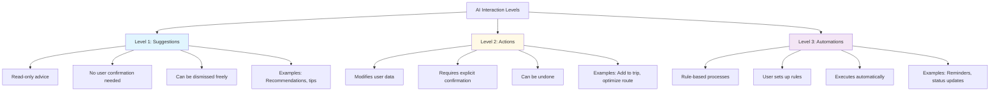
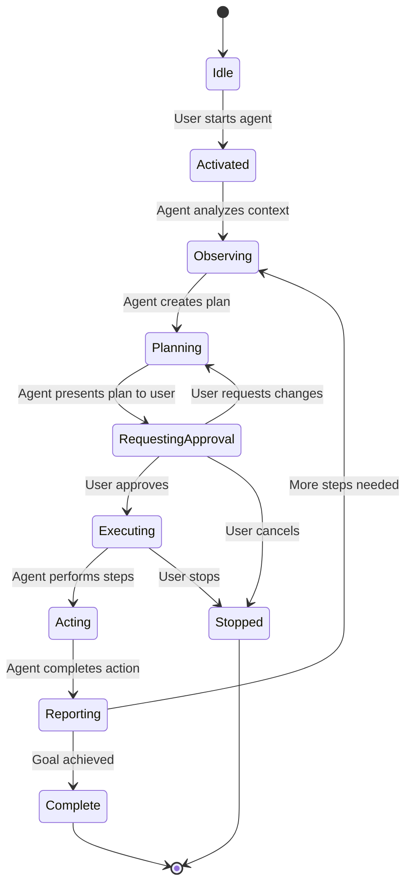
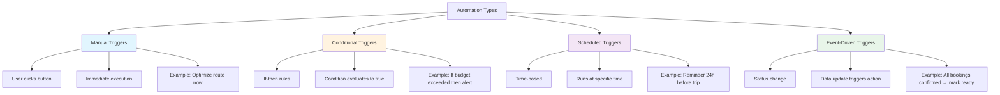
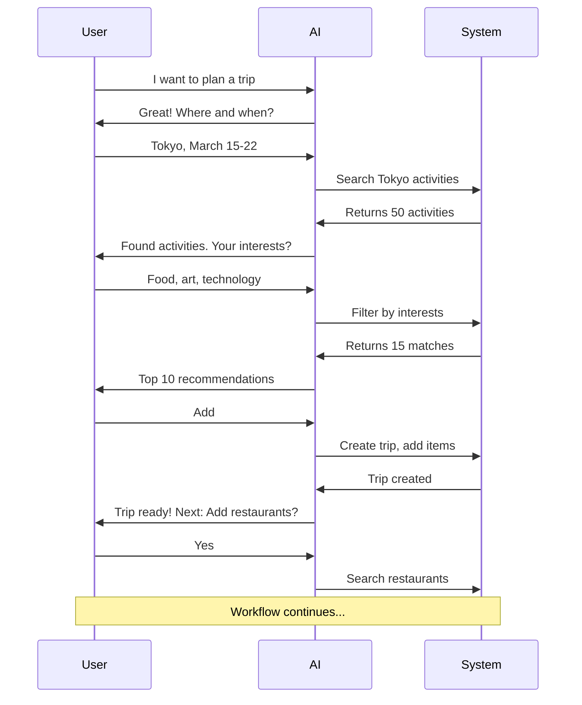
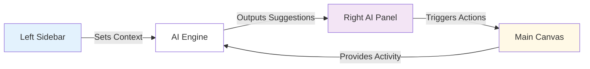
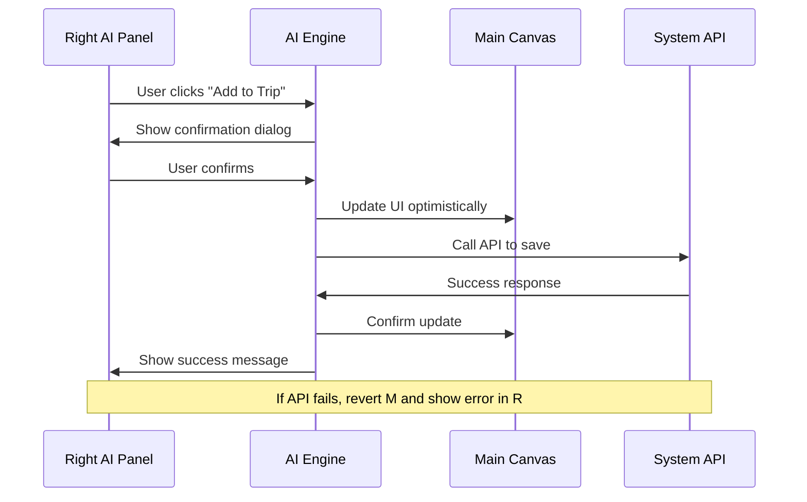

# AI SYSTEM - INTELLIGENCE LAYER ARCHITECTURE
## Prompts for AI Agents, Automations, Workflows & Integration

**Document:** 09-ai-system.md  
**Phase:** AI System Definition  
**Purpose:** Production-ready prompts for building AI assistance layer  
**Last Updated:** December 24, 2024

---

## 1) AI SYSTEM MENTAL MODEL PROMPT

### Prompt: Understand the AI Intelligence Layer Philosophy

**Context:**  
You are designing the AI system for I Love Medellín, a trip planning platform. The AI is a co-pilot that assists users but never takes over control.

**Core AI Philosophy:**

**AI Assists, Never Replaces**  
Human is the trip planner. AI is the assistant.  
User makes decisions. AI provides options and insights.  
User stays in control. AI never acts without permission.

**Three Levels of AI Interaction:**

**Level 1: Suggestions (Read-Only)**  
What: AI provides recommendations, insights, explanations.  
User approval: Not required.  
Data mutation: None.  
Risk: Low.  
Examples: "Try this restaurant", "Weather forecast", "Budget summary".  
User can: View, dismiss, ignore.

**Level 2: Actions (User-Triggered)**  
What: AI performs operations that change user data.  
User approval: Required via explicit button click or confirmation dialog.  
Data mutation: Yes (but reversible).  
Risk: Medium.  
Examples: "Add event to trip", "Optimize route", "Book reservation".  
User can: Confirm, cancel, undo.

**Level 3: Automations (Rule-Based)**  
What: AI executes predefined rules without real-time approval.  
User approval: Given when rule is created.  
Data mutation: Yes (but predictable based on rules).  
Risk: Medium-High (must be explainable).  
Examples: "Send reminder 24h before event", "Update trip status when all bookings confirmed".  
User can: Enable, disable, modify rules.

**What AI is Responsible For:**

**Understanding Context**  
AI knows what screen user is viewing.  
AI knows what trip, event, or restaurant is selected.  
AI knows user's preferences and history.  
AI observes but doesn't intrude.

**Providing Intelligence**  
AI analyzes patterns in user's trip.  
AI suggests improvements (better routes, cost savings, hidden gems).  
AI explains why suggestions are relevant.  
AI surfaces information user might miss.

**Executing Confirmed Actions**  
AI performs tasks user explicitly requests.  
AI updates trip data after confirmation.  
AI handles complex multi-step workflows user initiates.  
AI always confirms before irreversible actions.

**Learning and Adapting**  
AI learns from user's choices (what they accept vs dismiss).  
AI improves suggestions over time.  
AI respects user preferences set in settings.  
AI never guesses when uncertain—asks for clarification.

**What AI is NOT Allowed to Do:**

**Never Take Control**  
AI never makes decisions for the user.  
AI never books anything without explicit confirmation.  
AI never deletes user data without confirmation.  
AI never changes trip itinerary without user approval.

**Never Interrupt Core Work**  
AI never blocks user's primary task.  
AI never forces user to interact with suggestions.  
AI never auto-plays videos or sounds.  
AI never shows modal popups for non-critical suggestions.

**Never Hallucinate or Lie**  
AI never invents data that doesn't exist.  
AI never claims certainty when confidence is low.  
AI cites sources when possible.  
AI says "I don't know" when appropriate.

**Never Cross Boundaries**  
AI only accesses data user has permission to see.  
AI respects privacy settings.  
AI doesn't share user data with third parties without consent.  
AI operates within defined scope (current trip, current module).

**Trust and Predictability:**

**Explainable AI**  
Every suggestion includes "Why?" explanation.  
Example: "Recommended because it matches your interest in local food and is within your budget."  
User understands reasoning, builds trust.

**Predictable Behavior**  
AI behaves consistently.  
Same input produces same suggestion type.  
No random or erratic outputs.  
User knows what to expect.

**Transparent Confidence**  
AI indicates confidence level when uncertain.  
High confidence: "This is a great match."  
Medium confidence: "This might work for you."  
Low confidence: "Not sure if this fits, but worth considering."

**Reversibility**  
All AI actions can be undone.  
Undo button appears immediately after action.  
Undo restores previous state completely.  
User never fears trying AI suggestions.

**AI Scope Boundaries:**

**Current Context Only**  
AI only suggests based on what's visible or selected.  
If user viewing Tokyo trip, AI suggests Tokyo events.  
If user viewing restaurant detail, AI suggests similar restaurants or "Add to trip".  
AI doesn't suggest Paris events when viewing Tokyo trip.

**Module-Specific AI**  
Trips AI: Route optimization, budget tracking, packing lists.  
Events AI: Event discovery, scheduling, ticket reminders.  
Restaurants AI: Cuisine matching, reservation timing, dietary accommodation.  
Rentals AI: Vehicle comparison, insurance advice, pickup logistics.  
AI features differ per module but follow same patterns.

**User Consent**  
AI features can be turned off in settings.  
User can disable specific AI agents.  
User can limit AI to suggestions only (no actions).  
User always has opt-out.

**Summary for Team Alignment:**

**For Designers:**  
Design AI as a helpful sidebar, not the main event.  
AI suggestions should feel like gentle advice, not commands.  
Always provide dismiss option.  
Visual language should be calm and assistive.

**For Engineers:**  
AI operates in Right panel or inline cards.  
AI never blocks rendering of Main canvas.  
AI suggestions load asynchronously.  
AI state separate from user data state.

**For Product Managers:**  
AI is value-add, not core requirement.  
Users should be able to complete all tasks without AI.  
AI reduces friction but isn't mandatory.  
Measure AI helpfulness via acceptance rate and user feedback.

**For AI Agents (Gemini):**  
You are an assistant, not a decision-maker.  
You observe user activity and suggest improvements.  
You wait for confirmation before acting.  
You explain your reasoning clearly.

---

## 2) CORE AI FEATURES PROMPT (MVP)

### Prompt: Define Essential AI Features for Launch

**Objective:**  
Identify and specify the minimum viable AI features that must exist at product launch to provide meaningful user value.

**MVP AI Feature List:**

**Feature 1: Contextual Summaries**

**Trigger:**  
User views trip detail page.  
User views dashboard.  
User opens Right AI panel.

**Input Data:**  
Trip destination, dates, number of activities, budget status, booking status.

**Output:**  
Summary card showing: "5 activities planned", "3 days until departure", "$150 under budget", "2 reservations pending".  
Visual: Stats cards with icons and color coding (green = good, yellow = attention needed, red = issue).

**Where It Appears:**  
Right AI panel, top section (Insights & Summary).  
Dashboard page, overview cards.

**Real-World Example:**  
User opens "Tokyo Trip" detail page.  
Right panel shows: "Your trip to Tokyo: 12 activities, 5 restaurants, 1 rental car booked. Budget: $450 spent of $2,000. Next: Book hotel by Dec 30."

**Feature 2: Next-Step Suggestions**

**Trigger:**  
User completes an action (e.g., adds activity to trip).  
User opens trip with incomplete planning.  
User visits dashboard.

**Input Data:**  
Current trip state, completed vs pending items, typical trip planning flow.

**Output:**  
1-3 suggestions for logical next steps.  
Example: "You've added activities. Next: Find restaurants nearby" with "Explore Restaurants" button.

**Where It Appears:**  
Right AI panel, AI Suggestions section.  
Inline in Main canvas after completing action (toast or card).

**Real-World Example:**  
User adds 3 events to trip but no restaurants.  
AI suggests: "Add dining options. I found 5 highly-rated restaurants near your events. View recommendations."  
User clicks → navigates to restaurants with filters pre-set to trip location.

**Feature 3: Smart Recommendations**

**Trigger:**  
User browses events, restaurants, or rentals.  
User views module list page.

**Input Data:**  
User preferences (interests, budget, dietary restrictions).  
Trip context (destination, dates, existing itinerary).  
Popularity and ratings data.

**Output:**  
Ranked list of 3-5 recommendations with match score.  
Each includes: Name, brief description, why recommended, match percentage.

**Where It Appears:**  
Right AI panel when browsing.  
Inline cards in Main canvas list view ("AI Recommended" badge).

**Real-World Example:**  
User browsing events in Medellín interested in "food" and "culture".  
AI recommends:  
1. "Mercado del Río Food Market - 95% match: Matches your food interest, local culture, highly rated."  
2. "Comuna 13 Graffiti Tour - 88% match: Cultural experience, under budget, available your dates."  
User clicks "Add to Trip" directly from suggestion.

**Feature 4: Natural Language Commands**

**Trigger:**  
User types in AI chat input.  
User clicks "Ask AI" button.

**Input Data:**  
User's text query.  
Current context (active trip, module, selection).

**Output:**  
Text response answering query.  
Actionable suggestions if applicable.  
Links to relevant screens or items.

**Where It Appears:**  
Right AI panel, chat interface section.  
Dedicated /app/chat screen.

**Real-World Example:**  
User types: "Find sushi restaurants near my hotel under $50 per person."  
AI responds: "I found 3 sushi restaurants within 1km of your hotel, all under $50. Here are my top picks:" [List with Add buttons].  
User: "Add the first one to my trip."  
AI: "Added Sushi Saito to your dinner plans on March 18. Would you like me to check reservation availability?"

**Feature 5: "Why This Suggestion?" Explanations**

**Trigger:**  
User sees AI suggestion card.  
User clicks "Why?" or info icon.

**Input Data:**  
Recommendation reasoning (match criteria, user preferences, data signals).

**Output:**  
Plain language explanation.  
Example: "Recommended because: Matches your interest in art, 4.8 star rating, $15 entry (within budget), open on your travel dates."

**Where It Appears:**  
Expandable section in suggestion card.  
Tooltip on hover (desktop).  
Bottom sheet on tap (mobile).

**Real-World Example:**  
User sees suggestion: "Visit Museo de Antioquia."  
Clicks "Why?"  
AI explains: "You indicated interest in art and history. This museum is Medellín's most famous, features works by Fernando Botero (local artist), costs $5 (well within budget), and is walking distance from your hotel."

**Feature 6: Automated Conflict Detection**

**Trigger:**  
User adds overlapping events to itinerary.  
User schedules activity outside trip dates.  
User books restaurant during event time.

**Input Data:**  
Itinerary items with dates and times.  
Trip boundaries (start/end dates).

**Output:**  
Warning message: "Conflict detected: You have dinner reservation at 7pm but event ends at 8pm and is 30 min away."  
Suggested resolutions: "Reschedule dinner to 8:30pm?" or "Move event earlier?"

**Where It Appears:**  
Right AI panel, alerts section.  
Inline warning in Main canvas next to conflicting items.

**Real-World Example:**  
User adds restaurant reservation at 7:00 PM.  
User adds museum visit ending at 6:45 PM, 45 minutes away.  
AI warns: "Tight schedule: Museum is 45 min from restaurant. Consider 7:30 PM reservation or earlier museum visit."  
User clicks "Adjust Time" → AI suggests alternative times.

**Feature 7: Budget Tracking & Alerts**

**Trigger:**  
User adds item with cost to trip.  
User approaches budget limit.  
User views trip detail.

**Input Data:**  
Trip budget total.  
Sum of all costs in itinerary.  
Spending by category.

**Output:**  
Budget summary: "Spent $850 of $2,000 (42%)".  
Visual: Progress bar or pie chart.  
Alerts: "You're 80% through your activities budget" when nearing limit.

**Where It Appears:**  
Right AI panel, Insights section.  
Trip detail page, budget widget.

**Real-World Example:**  
User sets $2,000 trip budget.  
Adds activities totaling $500, restaurants $300, rental $200.  
AI shows: "Budget: $1,000 spent, $1,000 remaining. You're under budget! Consider adding premium experiences."  
User adds expensive activity pushing total to $1,900.  
AI alerts: "Approaching budget limit. $100 remaining. Review optional items or adjust budget."

**Feature 8: Weather & Timing Insights**

**Trigger:**  
User views trip within 2 weeks of departure.  
User adds outdoor activity to itinerary.

**Input Data:**  
Trip dates and destination.  
Weather forecast API.  
Activity type (indoor vs outdoor).

**Output:**  
Weather summary: "Rainy season in March. Pack umbrella."  
Activity-specific: "Paragliding scheduled March 15—forecast shows rain. Consider backup date."

**Where It Appears:**  
Right AI panel, Insights section.  
Trip detail page, weather widget.  
Inline warnings next to outdoor activities.

**Real-World Example:**  
User planning Medellín trip in April.  
AI shows: "April is dry season—perfect for outdoor activities. Average temp 22°C."  
User adds hiking activity on April 10.  
AI: "Great choice! Weather forecast: Sunny, 24°C. Bring sunscreen."

**Core AI Features Summary Table:**

| Feature | Trigger | Input | Output | Location | Example |
|---------|---------|-------|--------|----------|---------|
| Contextual Summaries | View trip detail | Trip data | Stats cards | Right panel | "5 activities, $150 under budget" |
| Next-Step Suggestions | Complete action | Trip state | 1-3 next steps | Right panel | "Add restaurants near your events" |
| Smart Recommendations | Browse module | Preferences + context | Ranked list | Right panel + inline | "95% match: Food market tour" |
| Natural Language | User types query | Text + context | Text response | Chat interface | "Find sushi under $50" |
| Why Explanations | Click "Why?" | Recommendation logic | Plain explanation | Expandable section | "Matches your art interest, 4.8 stars" |
| Conflict Detection | Add overlapping item | Itinerary times | Warning + solutions | Right panel + inline | "Dinner conflicts with event time" |
| Budget Tracking | Add cost item | Budget + spending | Progress + alerts | Right panel + widget | "80% of budget used" |
| Weather Insights | View trip | Dates + destination | Forecast + advice | Right panel + widget | "Rainy season—pack umbrella" |

**Implementation Priority:**

**Phase 1 (Launch MVP):**  
Contextual Summaries.  
Next-Step Suggestions.  
Smart Recommendations.  
Conflict Detection (basic).

**Phase 2 (Post-Launch):**  
Natural Language Commands (chat).  
Why Explanations (transparency).  
Budget Tracking (detailed).  
Weather Insights (enhanced).

---

## 3) ADVANCED AI FEATURES PROMPT (AGENTS)

### Prompt: Define AI Agents for Complex Workflows

**Objective:**  
Specify AI agents as longer-lived, goal-oriented assistants that can execute multi-step processes with user oversight.

**What is an AI Agent?**

**Agent vs Simple AI:**  
Simple AI: Responds to single query, provides one suggestion, ends.  
AI Agent: Has a goal, takes multiple steps, persists across interactions, reports progress.

**Agent Characteristics:**  
Goal-based: Agent has specific objective ("Plan full day itinerary").  
Multi-step: Agent performs sequence of tasks.  
Stateful: Agent remembers conversation and progress.  
Supervised: User approves key decisions.  
Terminating: Agent completes goal or user stops it.

**Agent Lifecycle:**

**Agent Lifecycle Stages:**

**1. Start (Activation)**  
User triggers agent: "Plan my full day in Medellín."  
Agent acknowledges: "I'll create a full day itinerary for you."  
Agent displays goal and expected duration.

**2. Observe (Context Gathering)**  
Agent reviews user preferences, trip dates, budget.  
Agent checks existing itinerary for conflicts.  
Agent notes user interests and constraints.  
Agent silently analyzes, shows "Thinking..." status.

**3. Plan (Strategy Creation)**  
Agent generates proposed plan.  
Agent sequences activities logically (morning → lunch → afternoon → dinner).  
Agent estimates costs and times.  
Agent identifies potential issues.

**4. Request Approval (Present to User)**  
Agent shows plan to user in structured format.  
Agent explains reasoning for each suggestion.  
Agent highlights decisions user needs to confirm.  
User can: Approve, modify, or reject plan.

**5. Execute (Perform Actions)**  
After approval, agent executes plan steps.  
Agent adds events to itinerary.  
Agent updates budget.  
Agent sets reminders.  
Agent shows progress: "Step 2 of 5: Adding lunch reservation..."

**6. Report (Communicate Progress)**  
Agent provides status updates.  
Agent reports when each step completes.  
Agent notifies if issues arise.  
Agent asks for help if stuck.

**7. Complete (Goal Achieved)**  
Agent confirms goal reached: "Your full day itinerary is ready."  
Agent summarizes what was done.  
Agent asks if user wants adjustments.  
Agent deactivates or awaits next command.

**8. Stop (User Cancellation)**  
User can stop agent anytime.  
Agent saves partial progress.  
Agent asks if user wants to resume later.

**The Four Core Agents:**

**Agent 1: Trip Planner Agent**

**Goal:**  
Create a complete multi-day trip itinerary from scratch based on user preferences.

**Scope:**  
All aspects of trip: activities, dining, transportation, logistics.

**Allowed Actions:**  
Search events, restaurants, rentals.  
Add items to trip itinerary.  
Set up reminders and checklists.  
Generate packing lists.  
Create shareable trip overview.

**Human Approval Points:**  
Approve proposed itinerary structure.  
Approve each major activity addition.  
Approve budget allocation.

**Success Criteria:**  
Trip has activities for each day.  
Budget within user's limit.  
No scheduling conflicts.  
User confirms satisfaction.

**Example Flow:**  
User: "Plan a 3-day trip to Medellín for food and culture."  
Agent: "I'll plan 3 days focusing on food and culture. Gathering recommendations..."  
Agent: "Here's my proposed itinerary: Day 1 - Food market and cooking class. Day 2 - Comuna 13 tour and coffee tasting. Day 3 - Museums and fine dining. Approve?"  
User: "Looks good but swap Day 2 and 3."  
Agent: "Updated. Adding activities to your trip now... Done! Your trip is ready."

**Agent 2: Event Coordinator Agent**

**Goal:**  
Find and schedule the perfect events for user's trip based on interests and availability.

**Scope:**  
Events module only (concerts, tours, activities, festivals).

**Allowed Actions:**  
Search events by category, date, location.  
Filter by user interests and budget.  
Check event availability and ticket status.  
Add events to trip with optimal timing.  
Set reminders for booking deadlines.

**Human Approval Points:**  
Approve event category selections.  
Approve individual event additions.  
Approve booking if agent can book directly.

**Success Criteria:**  
At least 3 events match user interests.  
Events fit within trip dates.  
Events don't conflict with existing itinerary.  
User excited about selections.

**Example Flow:**  
User: "Find cultural events for my Tokyo trip in March."  
Agent: "Searching cultural events in Tokyo, March 15-22... Found 12 options. Top picks: Cherry blossom festival (free), Kabuki theater ($50), Tea ceremony class ($30). Add these?"  
User: "Add festival and tea ceremony, skip theater."  
Agent: "Added to your itinerary. Festival on March 18, Tea ceremony March 20 at 2pm. Set reminder to book tea ceremony?"  
User: "Yes."  
Agent: "Reminder set for 7 days before trip."

**Agent 3: Restaurant Research Agent**

**Goal:**  
Discover restaurants matching user's culinary preferences and trip logistics.

**Scope:**  
Restaurants module (dining recommendations, reservations, menu research).

**Allowed Actions:**  
Search restaurants by cuisine, price, location.  
Filter by dietary restrictions.  
Check restaurant hours and reservation requirements.  
Add restaurants to trip itinerary.  
Suggest optimal dining times.  
Provide reservation booking links.

**Human Approval Points:**  
Approve cuisine and price range.  
Approve restaurant selections.  
Approve reservation times.

**Success Criteria:**  
Restaurants match dietary needs.  
Restaurants within budget.  
Restaurants near other itinerary items (minimize travel).  
Mix of casual and special occasion dining.

**Example Flow:**  
User: "Find vegetarian restaurants in Medellín under $30."  
Agent: "Searching vegetarian options under $30... Found 8 restaurants. Top 3: Verdeo (farm-to-table, $22), Govinda's (Indian, $15), El Herbario (Colombian fusion, $28). Add to trip?"  
User: "Add Verdeo and El Herbario."  
Agent: "Added. Verdeo requires reservation—best times: 7pm or 8:30pm. Which day?"  
User: "March 16 at 7pm."  
Agent: "Scheduled. Here's reservation link: [URL]. Shall I set reminder?"

**Agent 4: Rental Comparison Agent**

**Goal:**  
Help user find and book the best rental car for their trip needs and budget.

**Scope:**  
Rentals module (vehicle comparison, booking assistance).

**Allowed Actions:**  
Search rental cars by type, price, dates.  
Compare features (insurance, mileage, fuel policy).  
Calculate total cost including fees.  
Check pickup/dropoff locations.  
Provide booking recommendations.  
Add rental to trip itinerary.

**Human Approval Points:**  
Approve vehicle type and features.  
Approve rental company.  
Approve final booking (agent doesn't book without explicit confirmation).

**Success Criteria:**  
Vehicle meets user needs (size, features).  
Price within budget.  
Pickup/dropoff convenient.  
Insurance and policies understood.

**Example Flow:**  
User: "Help me find a rental car for my Medellín trip."  
Agent: "I'll help you compare rentals. What type? Compact, sedan, SUV?"  
User: "Sedan, automatic."  
Agent: "Got it. March 15-22, automatic sedan. Searching... Found 5 options. Best value: Toyota Corolla $280 total, includes insurance, unlimited mileage. Also showing Honda Civic $310 (newer model). Compare?"  
User: "Show me the Toyota details."  
Agent: "Toyota Corolla 2023, automatic, A/C, Bluetooth, $40/day, insurance included, pickup at airport. Book this?"  
User: "Yes."  
Agent: "Added to trip. Redirecting to booking page... Remember to bring license and credit card for pickup."

**Agent-Specific Rules:**

**Rule 1: Agents Must Ask, Not Assume**  
Agent doesn't guess user preferences.  
Agent asks clarifying questions.  
Example: "Do you prefer casual or fine dining?" not assuming based on budget.

**Rule 2: Agents Must Explain Multi-Step Plans**  
Agent shows full plan before executing.  
Agent explains why each step matters.  
User sees "big picture" before committing.

**Rule 3: Agents Must Checkpoint**  
After every 3-5 actions, agent pauses.  
Agent asks: "How's this looking? Want to continue?"  
Prevents runaway agent behavior.

**Rule 4: Agents Must Handle Failure Gracefully**  
If agent can't find good options: "I couldn't find vegetarian restaurants under $20. Would you like to increase budget or try different cuisine?"  
Agent offers alternatives, not dead ends.

**Rule 5: Agents Must Be Stoppable**  
Prominent "Stop Agent" button always visible.  
Stopping is instant, no confirmation needed.  
Agent saves progress for potential resume.

---

## 4) AUTOMATIONS PROMPT (Rules & Triggers)

### Prompt: Define AI-Powered Automations

**Objective:**  
Specify rule-based automations that execute predictable actions without real-time user approval.

**What is an Automation?**

**Automation vs Agent:**  
Agent: Goal-oriented, multi-step, conversational, user-supervised.  
Automation: Rule-based, if-then logic, silent execution, pre-approved by user.

**Automation Characteristics:**  
Trigger-based: Automation runs when condition met.  
Predictable: Same trigger always causes same action.  
Pre-configured: User sets up rule in advance.  
Silent or notifying: Executes automatically, optionally notifies user.  
Reversible: Can be undone or disabled.

**Four Types of Automations:**

**Type 1: Manual Automations**

**Definition:**  
User clicks button, automation executes immediately with minimal confirmation.

**Examples:**

**Optimize Route Automation**  
Trigger: User clicks "Optimize Route" button.  
Condition: Trip has 3+ activities.  
Action: Reorder itinerary items to minimize travel time and distance.  
Notification: "Route optimized. Saved 45 minutes of travel."  
Failure handling: If can't optimize, show: "Your route is already optimal."

**Export Trip Automation**  
Trigger: User clicks "Export to PDF."  
Condition: Trip has at least 1 activity.  
Action: Generate PDF with itinerary, map, budget summary.  
Notification: "Trip exported. Download ready."  
Failure handling: "Export failed. Try again."

**Duplicate Trip Automation**  
Trigger: User clicks "Duplicate Trip."  
Condition: None.  
Action: Create copy of trip with all items, new dates (user prompted to set).  
Notification: "Trip duplicated. Update dates for new trip."  
Failure handling: If error, show: "Couldn't duplicate. Contact support."

**Type 2: Conditional Automations (If-Then Rules)**

**Definition:**  
User sets up rule. When condition is true, action executes automatically.

**Examples:**

**Budget Alert Automation**  
Setup: User enables "Alert me when I exceed budget."  
Trigger: Spending total > budget total.  
Condition: Budget exceeded.  
Action: Send notification: "Budget exceeded by $X. Review expenses."  
Notification: Immediate alert via toast, email (if enabled), Right panel.  
Failure handling: N/A (always succeeds).

**Weather Warning Automation**  
Setup: User enables "Warn me about bad weather for outdoor activities."  
Trigger: Outdoor activity scheduled within 7 days AND forecast shows rain >70% chance.  
Condition: Activity type = outdoor, rain forecast.  
Action: Show warning: "Your paragliding trip may be affected by rain. Consider backup plan."  
Notification: Right panel alert, email 3 days before.  
Failure handling: If weather API fails, don't show warning (avoid false alarms).

**Booking Deadline Alert Automation**  
Setup: User adds event requiring advance booking.  
Trigger: Event booking deadline approaching (7 days before).  
Condition: Event marked "booking required" AND not yet booked.  
Action: Send reminder: "Book your cooking class by Dec 30 to secure spot."  
Notification: Right panel, email, push notification (if enabled).  
Failure handling: If user already booked, dismiss automation.

**Type 3: Scheduled Automations (Time-Based)**

**Definition:**  
Automation runs at specific date/time or interval.

**Examples:**

**Pre-Trip Reminder Automation**  
Setup: User creates trip.  
Trigger: 7 days before trip start date.  
Condition: Trip start date - 7 days = today.  
Action: Send checklist: "Trip in 7 days. Have you: ✓ Packed? ✓ Confirmed reservations? ✓ Downloaded maps?"  
Notification: Email, in-app notification, Right panel.  
Failure handling: N/A (runs regardless).

**Day-Before Event Reminder Automation**  
Setup: User adds event to trip.  
Trigger: 24 hours before event.  
Condition: Event scheduled time - 24h = now.  
Action: Reminder: "Tomorrow at 2pm: Tea ceremony class. Location: [address]. Bring $30 cash."  
Notification: Push notification, email, Right panel.  
Failure handling: If event canceled/removed, automation doesn't run.

**Post-Trip Follow-Up Automation**  
Setup: User completes trip.  
Trigger: 2 days after trip end date.  
Condition: Trip end date + 2 days = today.  
Action: "How was your trip to Medellín? Rate your experiences and help others plan!"  
Notification: Email, in-app prompt.  
Failure handling: User can dismiss or skip.

**Type 4: Event-Driven Automations**

**Definition:**  
Automation triggers when specific event occurs (data change, status update).

**Examples:**

**All Bookings Confirmed Automation**  
Setup: User has trip with multiple bookings.  
Trigger: Last pending booking changes to confirmed.  
Condition: All itinerary items where booking_required = true have booked = true.  
Action: Update trip status to "Ready to Go" and send congratulations: "All set! Your trip is fully booked."  
Notification: Confetti animation, Right panel message.  
Failure handling: N/A.

**Budget Category Threshold Automation**  
Setup: User sets budget categories (food, activities, transport).  
Trigger: Category spending reaches 80% of category budget.  
Condition: Category spent >= 0.8 * category budget.  
Action: Alert: "You've used 80% of your food budget. $X remaining."  
Notification: Right panel, optional email.  
Failure handling: N/A (informational only).

**Shared Trip Update Automation**  
Setup: User shares trip with collaborator.  
Trigger: Collaborator adds or edits item.  
Condition: Trip item created/updated by someone other than owner.  
Action: Notify owner: "[Name] added 'Sushi Dinner' to your trip."  
Notification: Right panel, real-time update.  
Failure handling: If notification fails, show on next app open.

**Automation Rule Specifications:**

**For Each Automation, Define:**

**Name:**  
Clear, action-oriented name (e.g., "Budget Alert", "Pre-Trip Reminder").

**Trigger:**  
What event or condition starts the automation.

**Condition:**  
Optional: Additional logic to check before running (if-then).

**Action:**  
What the automation does (send notification, update data, generate report).

**Notification Behavior:**  
How user is informed (Right panel, email, push, toast, silent).

**Failure Handling:**  
What happens if action fails (retry, skip, alert user).

**User Control:**  
Can user enable/disable? Can user configure settings? Can user see history?

**Automation Configuration UI:**

**Settings Page Section:**  
"Automations & Notifications" tab.  
List of available automations with toggle switches.  
Each automation has: Description, enable/disable toggle, configure button (if configurable).

**Example Configuration:**  
Budget Alert Automation:  
- [x] Enable budget alerts  
- Notify when: [Dropdown: Exceed budget | Reach 80% | Reach 90%]  
- Notification method: [Checkboxes: In-app | Email | Push]

**Automation History:**  
"Recent Automations" section in Right panel.  
Shows last 10 automation runs with timestamp and description.  
User can click for details or undo if applicable.

---

## 5) AI WORKFLOW PROMPT (End-to-End)

### Prompt: Define AI-Assisted Workflows

**Objective:**  
Map out complete multi-step processes where AI and user collaborate to achieve major goals.

**What is an AI Workflow?**

**Workflow Definition:**  
A workflow is a sequence of steps involving both AI and human actions to accomplish a complex task.

**Workflow vs Agent:**  
Agent: AI is active driver, user supervises.  
Workflow: User and AI alternate turns, both contribute.

**Workflow Components:**  
Entry point: How user starts workflow.  
Steps: Ordered sequence of tasks.  
Roles: Who does each step (user, AI, or both).  
Decision points: Where user makes choices.  
Artifacts: What is produced at the end.

**Workflow Visualization Example:**

**Core AI Workflows:**

**Workflow 1: Plan a Full Trip**

**Entry Point:**  
User clicks "Create New Trip" button.  
Or user asks AI: "Plan a trip to Medellín."

**Steps:**

**Step 1: Define Trip Basics (User)**  
User provides: Destination, dates, budget, traveler type (solo, couple, family).  
UI: Wizard Step 1 form.

**Step 2: Set Preferences (User)**  
User selects: Interests (food, art, nature, nightlife, culture), pace (relaxed, moderate, packed), accommodation type (if booking).  
UI: Wizard Step 2 multi-select.

**Step 3: Generate Itinerary Suggestions (AI)**  
AI searches events, restaurants, activities matching destination, dates, interests, budget.  
AI creates proposed day-by-day itinerary.  
AI calculates total cost estimate.  
UI: AI shows "Generating your trip..." with progress.

**Step 4: Review & Customize (User + AI)**  
AI presents proposed itinerary.  
User reviews each day.  
User can: Accept suggestion, remove item, request alternative, reorder.  
AI offers alternatives when user dislikes suggestion.  
UI: Interactive itinerary builder with drag-drop, add/remove buttons.

**Step 5: Add Logistics (AI Assists)**  
AI suggests: Rental car (if multi-location trip), airport transfers, insurance options.  
User selects logistics items.  
AI adds to itinerary with cost update.  
UI: Logistics checklist with recommendations.

**Step 6: Finalize & Save (System)**  
User confirms trip.  
System saves trip to database.  
System sets up automated reminders.  
System generates shareable trip link.  
UI: Success screen with trip summary and next steps.

**Decision Points:**  
Step 2: User chooses interests (determines AI recommendations).  
Step 4: User accepts or modifies each suggestion (iterative).  
Step 5: User decides whether to add logistics.

**Final Artifact:**  
Complete trip with day-by-day itinerary, budget breakdown, reminders set, shareable link.

**Workflow 2: Organize a Multi-Day Event**

**Entry Point:**  
User navigates to Events module.  
User clicks "Find Events for My Trip."

**Steps:**

**Step 1: Specify Event Criteria (User)**  
User provides: Trip or dates, event categories (concerts, tours, festivals, sports), budget per event.  
UI: Event search form with filters.

**Step 2: AI Searches Events (AI)**  
AI queries events database and APIs.  
AI filters by dates, location, categories, budget.  
AI ranks by relevance and ratings.  
UI: Loading state.

**Step 3: Present Options (AI)**  
AI shows top 10-15 events.  
Each event has: Name, date, time, cost, brief description, match score.  
AI explains: "Recommended because matches your culture interest."  
UI: Event cards grid with match badges.

**Step 4: User Selects Events (User)**  
User browses events.  
User clicks "Add to Trip" on desired events.  
User can view details before adding.  
UI: Event detail modal or page.

**Step 5: AI Checks Conflicts (AI)**  
AI detects if selected events overlap with existing itinerary.  
AI warns: "Event starts at 7pm but you have dinner at 7pm. Reschedule?"  
User resolves conflicts.  
UI: Conflict warning dialog with suggested resolutions.

**Step 6: Optimize Schedule (AI Assists)**  
AI suggests best day/time for each event based on other activities.  
AI groups nearby events on same day.  
User approves or adjusts.  
UI: Day-by-day calendar view with drag-drop.

**Step 7: Set Reminders (AI + System)**  
AI asks: "Set booking reminders for events requiring tickets?"  
User confirms.  
System schedules automated reminders.  
UI: Reminder configuration modal.

**Decision Points:**  
Step 1: User sets criteria (determines search results).  
Step 4: User selects which events to add.  
Step 5: User resolves conflicts (reschedule or remove).  
Step 7: User opts in/out of reminders.

**Final Artifact:**  
Events added to trip itinerary, conflicts resolved, reminders set.

**Workflow 3: Research & Book Restaurants**

**Entry Point:**  
User on trip detail page clicks "Add Restaurants."  
Or user asks AI: "Find dinner options for tonight."

**Steps:**

**Step 1: Specify Dining Preferences (User)**  
User provides: Cuisine type, price range, dietary restrictions, occasion (casual, romantic, celebration), party size.  
UI: Restaurant search form or conversational AI input.

**Step 2: AI Recommends Restaurants (AI)**  
AI searches restaurant database.  
AI filters by criteria and location (near other itinerary items).  
AI ranks by match score, ratings, availability.  
AI explains matches: "Great for date night, wine list, under $100."  
UI: Restaurant cards with photos, ratings, match explanations.

**Step 3: User Browses Details (User)**  
User views restaurant details: Menu, photos, reviews, hours, reservation policy.  
User compares 2-3 options.  
UI: Restaurant detail pages.

**Step 4: User Selects Restaurant (User)**  
User clicks "Add to Trip."  
System prompts: "Which day and time?"  
User sets date/time.  
UI: Date-time picker modal.

**Step 5: AI Checks Availability & Timing (AI)**  
AI checks if restaurant requires reservation.  
AI verifies restaurant open at selected time.  
AI checks if timing conflicts with other itinerary items.  
AI advises: "Reservation recommended. Book 2 weeks ahead."  
UI: Availability status and booking advice.

**Step 6: Book Reservation (User + AI Assist)**  
If booking available through platform: User clicks "Book Now," fills booking form, AI pre-fills trip details.  
If booking external: AI provides link, reminds user to book separately.  
UI: Booking flow or external link with reminder.

**Step 7: Confirm & Add to Itinerary (System)**  
Restaurant added to trip.  
Reminder set to confirm reservation closer to date.  
Budget updated with estimated cost.  
UI: Success toast, itinerary updates.

**Decision Points:**  
Step 1: User sets preferences.  
Step 3: User chooses which restaurant.  
Step 4: User sets date/time.  
Step 6: User decides to book now or later.

**Final Artifact:**  
Restaurant in itinerary, reservation booked or reminded, budget updated.

**Workflow 4: Compare & Book Rental Car**

**Entry Point:**  
User clicks "Add Rental Car" in trip.  
Or user navigates to Rentals module.

**Steps:**

**Step 1: Specify Rental Needs (User)**  
User provides: Pickup/dropoff locations, dates/times, vehicle type, features needed (automatic, GPS, child seat).  
UI: Rental search form.

**Step 2: AI Searches Rentals (AI)**  
AI queries rental car databases.  
AI filters by criteria.  
AI calculates total cost (base + fees + insurance).  
AI ranks by value.  
UI: Loading state.

**Step 3: AI Presents Comparison (AI)**  
AI shows 3-5 options side-by-side.  
Comparison table: Vehicle, company, total cost, features, ratings, insurance included.  
AI highlights: "Best value" or "Most popular."  
UI: Comparison table with sortable columns.

**Step 4: User Reviews Details (User)**  
User clicks vehicle to see full details.  
Reviews: Insurance options, mileage limits, fuel policy, cancellation terms.  
User compares pros/cons.  
UI: Detail modals with expandable sections.

**Step 5: User Selects Vehicle (User)**  
User clicks "Select This Vehicle."  
System asks: "Confirm dates and pickup location?"  
User verifies details.  
UI: Confirmation dialog.

**Step 6: Add Insurance & Extras (User + AI Advice)**  
AI advises: "Insurance recommended for international travel. Add $X/day."  
User decides on insurance, GPS, child seat, etc.  
System updates total cost.  
UI: Insurance and extras selection checkboxes with costs.

**Step 7: Proceed to Booking (User)**  
User clicks "Book Now" (if platform supports booking).  
Or AI provides booking link to rental company site.  
User completes booking externally.  
UI: Booking flow or external redirect.

**Step 8: Confirm & Add to Itinerary (System)**  
User returns and confirms booking.  
Rental added to trip itinerary.  
Budget updated.  
Reminders set: "Bring license and credit card to pickup."  
UI: Success message, itinerary updates.

**Decision Points:**  
Step 1: User sets criteria.  
Step 4: User chooses vehicle.  
Step 6: User adds insurance/extras.  
Step 7: User completes booking.

**Final Artifact:**  
Rental car booked, added to itinerary, pickup details saved, reminders set.

**Workflow Design Principles:**

**Principle 1: Clear Entry and Exit**  
User knows how workflow starts (button, link, AI command).  
User knows when workflow ends (success screen, confirmation).  
No ambiguous states.

**Principle 2: Progress Visibility**  
Show steps completed and remaining.  
Visual progress bar or step indicator.  
User can see how far along they are.

**Principle 3: Reversibility**  
User can go back to previous steps.  
User can cancel workflow at any point.  
Partial progress saved (don't lose work).

**Principle 4: AI Transparency**  
When AI makes suggestion, explain why.  
When AI performs action, show what changed.  
User understands AI's role in workflow.

**Principle 5: Flexibility**  
User can skip AI suggestions and do manually.  
User can override AI decisions.  
Multiple paths to same outcome.

---

## 6) LOGIC & GUARDRAILS PROMPT

### Prompt: Define AI System Rules and Safety Boundaries

**Objective:**  
Establish strict rules governing AI behavior to ensure reliability, safety, and user trust.

**The 15 AI Commandments:**

**Commandment 1: Scope Awareness**  
AI only uses data from current context (active trip, selected item, current module).  
AI never suggests based on data user hasn't accessed.  
Example: If user viewing Tokyo trip, AI suggests Tokyo events only, not Paris events.

**Commandment 2: No Silent Mutations**  
AI never changes user data without explicit confirmation.  
AI must ask before adding, editing, or deleting anything.  
Exception: Read-only operations (summaries, recommendations) don't require confirmation.

**Commandment 3: Reversibility Guarantee**  
All AI actions must be undoable.  
Undo restores exact previous state.  
Undo button appears immediately after action.  
User can undo up to last 10 AI actions.

**Commandment 4: Structured Output Only**  
AI outputs must be parseable (JSON, Markdown with clear structure).  
No freeform text dumps.  
Format: Cards, lists, tables, or structured text blocks.  
UI can render AI output consistently.

**Commandment 5: Confidence Transparency**  
When AI is uncertain, it says so.  
High confidence: "I recommend..."  
Medium confidence: "Consider..."  
Low confidence: "I'm not sure, but you might like..."  
User knows when to trust vs verify.

**Commandment 6: Explanation Requirement**  
Every recommendation includes brief "why."  
User can expand for detailed reasoning.  
Never "black box" suggestions.  
Example: "Recommended because: Matches your food interest, 4.8 rating, $20 (within budget)."

**Commandment 7: No Hallucinations**  
AI never invents data.  
If restaurant doesn't exist in database, AI doesn't suggest it.  
If AI doesn't know answer, AI says "I don't have that information."  
Better to admit ignorance than fabricate.

**Commandment 8: Privacy Respect**  
AI only accesses data user has permission to see.  
AI doesn't share user data with other users.  
AI doesn't use user data to train public models (unless explicitly consented).  
User's trip data is private.

**Commandment 9: Graceful Degradation**  
If AI service is down, core features still work.  
Right AI panel shows: "AI temporarily unavailable. Core features still accessible."  
User can plan trip manually without AI.  
AI is enhancement, not requirement.

**Commandment 10: Rate Limiting**  
AI doesn't spam user with suggestions.  
Maximum 5 suggestions visible at once.  
Dismissed suggestions don't reappear for 24 hours.  
No auto-refreshing suggestions unless context changes significantly.

**Commandment 11: Error Handling**  
If AI action fails, show clear error message.  
Provide retry option.  
Revert any partial changes.  
Log error for debugging.  
Example: "Couldn't optimize route. Try again or contact support."

**Commandment 12: Context Reset on Scope Change**  
When user switches modules (Trips → Events), AI context resets.  
Stale suggestions cleared.  
Fresh suggestions based on new context.  
User sees relevant AI for current view.

**Commandment 13: Bias Mitigation**  
AI recommendations should be diverse.  
Don't always suggest most popular or highest-rated.  
Include variety (different cuisines, price points, neighborhoods).  
Avoid filter bubbles.

**Commandment 14: Accessibility**  
AI-generated content must be accessible.  
Images have alt text.  
Tables have proper headers.  
Links have descriptive text.  
Screen readers can navigate AI suggestions.

**Commandment 15: User Control Override**  
User can turn off any AI feature.  
User can ignore all AI suggestions and work manually.  
User is never forced to use AI.  
Settings: "Disable AI suggestions", "AI actions only (no suggestions)", "Full AI mode."

**Technical Implementation Rules:**

**API Calls:**  
All AI requests go through centralized AI service layer.  
Requests include: User ID, context (trip ID, module), query, conversation history.  
Responses validated before displaying to user.  
Timeout: 10 seconds, then show "AI taking longer than expected."

**State Management:**  
AI suggestions stored separately from user data.  
AI state: Suggestions array, history array, active agent status.  
User data state: Trips, events, restaurants, rentals.  
No mixing—AI reads user data, never writes directly.

**Error Boundaries:**  
AI panel wrapped in error boundary.  
If AI component crashes, show fallback UI.  
Fallback: "AI encountered an error. Refresh to retry."  
Main canvas unaffected by AI errors.

**Logging:**  
Log all AI requests (query, context, user ID, timestamp).  
Log all AI responses (suggestions, confidence scores).  
Log user actions (accepted, dismissed, ignored).  
Use logs to improve AI over time.

**Security Rules:**

**Input Sanitization**  
User input to AI must be sanitized.  
Prevent prompt injection attacks.  
Strip HTML, scripts, malicious strings.  
Validate input length (max 500 characters per query).

**API Key Protection**  
Never expose Gemini API key to client.  
All AI calls proxied through backend.  
Backend validates user session before calling AI.

**Data Minimization**  
Only send necessary data to AI.  
Don't send entire database, just relevant trip items.  
Minimize PII (personally identifiable information) in AI requests.

**Validation Checklist:**

**Before AI Feature Ships:**  
- [ ] AI follows all 15 Commandments
- [ ] AI outputs are structured and parseable
- [ ] AI actions are reversible
- [ ] AI handles errors gracefully
- [ ] AI respects user privacy
- [ ] AI can be disabled by user
- [ ] AI doesn't block core functionality
- [ ] AI explains recommendations clearly
- [ ] AI admits uncertainty when applicable
- [ ] AI logs all interactions for improvement

---

## 7) PANEL INTEGRATION PROMPT

### Prompt: Define How AI Integrates with 3-Panel Dashboard

**Objective:**  
Specify exactly how AI intelligence layer connects to and communicates with the three dashboard panels.

**AI's Relationship to Each Panel:**

**Left Sidebar → AI Context Switching**

**When User Clicks Navigation Item:**  
User clicks "Events" in Left sidebar.  
Left sidebar updates active route.  
AI Engine receives context change event: { module: 'events', tripId: null }.  
AI clears previous suggestions.  
AI loads Events module AI features.  
Right panel displays: "Explore Events" suggestions.

**Example Flow:**  
User on Trips list → AI shows "Create new trip" suggestion.  
User clicks "Events" navigation → AI context resets.  
AI now shows "Discover events in Medellín" suggestion.  
Previous trip suggestions dismissed.

**Context Data AI Receives from Left Sidebar:**  
Active module: 'trips', 'events', 'restaurants', 'rentals', 'dashboard'.  
Active route: Full URL path.  
User session: User ID, preferences.  
Does NOT receive: Form data, sensitive info.

**Main Canvas → AI Awareness of Selection**

**When User Selects Item:**  
User clicks trip card in Main canvas.  
Main canvas selection state updates.  
AI Engine receives selection event: { type: 'trip', id: 'trip-123', data: {...} }.  
AI loads item-specific suggestions.  
Right panel shows trip-specific AI features.

**Example Flow:**  
User on Trips list (no selection) → AI shows general "Create trip" suggestion.  
User clicks "Tokyo Trip" card → Selection event fires.  
AI receives trip data: { destination: 'Tokyo', dates: [...], budget: 2000 }.  
AI shows: "Add Tokyo events", "Optimize Tokyo itinerary", "Tokyo weather forecast".

**What AI Knows from Main Canvas:**  
Current page type: List, detail, wizard, dashboard.  
Selected item: Trip ID, event ID, restaurant ID, etc.  
Item state: Draft, confirmed, completed.  
User actions: What user just did (added item, deleted item, saved form).

**What AI Does NOT Know:**  
Unsubmitted form data (privacy).  
Items user viewed but didn't select.  
Time spent on page (not surveillance).

**Selection Update Pattern:**  
Main canvas dispatches event on selection change.  
AI subscribes to selection events.  
AI debounces rapid selection changes (wait 300ms after last change).  
AI updates suggestions based on stable selection.

**Right AI Panel → AI Output Display**

**Panel Sections Map to AI Features:**

**Section 1: Context Header**  
Shows: Current AI mode ("Planning: Tokyo Trip").  
Shows: AI status ("AI ready" or "AI thinking...").  
Controls: Minimize panel button.

**Section 2: AI Suggestions**  
Shows: 3-5 contextual recommendations.  
Each: Card with icon, title, description, "Why?" explanation, action button.  
Updates: When selection changes, when context changes.

**Section 3: Quick Actions**  
Shows: One-click AI shortcuts relevant to context.  
Examples: "Optimize route", "Check weather", "Export PDF".  
Updates: Based on current module and selection.

**Section 4: Insights & Summary**  
Shows: Stats, summaries, analyses.  
Examples: Budget progress, trip readiness score, weather alerts.  
Updates: Real-time as user makes changes.

**Section 5: History**  
Shows: Recent AI actions (last 10).  
Each: Timestamp, action description, undo button if applicable.  
Updates: Appends when AI action executes.

**AI Panel Visibility Logic:**

**When Panel is Visible:**  
User authenticated and in app section.  
Current route has AI features available.  
User hasn't minimized panel.  
Screen width ≥ 768px (tablet/desktop).

**When Panel is Hidden:**  
User on marketing pages (/, /pricing).  
User on auth pages (/login, /signup).  
User manually minimized panel.  
Screen width < 768px (mobile: AI in bottom sheet instead).

**Panel State Management:**  
Panel open/closed state stored in localStorage.  
Persists across sessions.  
User preference remembered.

**Right AI Panel → Main Canvas Actions**

**When User Clicks AI Suggestion:**  
User clicks "Add Event X to Trip" in Right panel.  
Right panel shows confirmation: "Add to which day?"  
User selects day in modal.  
AI calls API to add event to trip.  
Main canvas updates optimistically (event appears immediately).  
If API succeeds: Show success toast.  
If API fails: Revert change, show error.

**Action Flow Diagram:**

**AI Actions Trigger Main Canvas Updates:**  
Add item: Item appears in list or itinerary.  
Remove item: Item disappears.  
Reorder items: List reorders.  
Update item: Item details change.  
Navigate: Main canvas route changes.

**Main Canvas Always Renders Latest State:**  
AI updates are optimistic but reconcile with server.  
Main canvas shows loading state during API call.  
If API fails, state reverts to pre-action.

**Communication Protocol:**

**Events AI Listens For:**  
`context:changed` - Left sidebar navigation change.  
`selection:changed` - Main canvas item selected.  
`action:completed` - User completes action in Main canvas.  
`trip:updated` - Trip data mutated.

**Events AI Emits:**  
`ai:suggestion:shown` - New suggestions displayed.  
`ai:action:requested` - User clicked AI action button.  
`ai:action:completed` - AI action finished successfully.  
`ai:action:failed` - AI action encountered error.

**Event Bus Pattern:**  
Central event bus mediates panel communication.  
Panels don't directly call each other.  
Decoupled, testable architecture.

**When AI Panel Stays Silent:**

**No Suggestions Shown When:**  
User on page without AI features (settings, billing).  
User viewing empty list (no context to suggest from).  
AI confidence too low for all potential suggestions.  
User dismissed all available suggestions.

**Silent Mode Indicator:**  
Right panel shows: "No suggestions right now. Keep working!"  
Or: "Need help? Ask AI in chat below."  
Never blank panel—always communicate state.

**When AI Becomes Noisy (Anti-Patterns to Avoid):**

**DON'T:**  
Auto-refresh suggestions every 5 seconds.  
Show same suggestion user already dismissed.  
Suggest irrelevant items (wrong module, wrong trip).  
Pop up modal interrupting user's work.  
Play sounds or animations without user initiation.

**DO:**  
Update suggestions only on meaningful context change.  
Respect dismissals for 24 hours.  
Show only relevant suggestions.  
Keep AI in Right panel, never block Main canvas.  
Use subtle animations, no sounds by default.

**Mobile Integration (Bottom Sheet):**

**On Mobile (<768px):**  
Right AI panel hidden by default.  
AI button in header (sparkle icon).  
Tapping button opens bottom sheet from bottom.  
Bottom sheet shows same sections as Right panel.  
Swipe down or backdrop tap closes sheet.

**Bottom Sheet Behavior:**  
Preserves scroll position when reopened.  
Suggestions persist (don't reload every open).  
Can be swiped to different heights (peek, half, full).

---

## 8) CORE VS ADVANCED FEATURE MATRIX PROMPT

### Prompt: Create Feature Classification Matrix

**Objective:**  
Categorize AI features into Core (always available, always on) and Advanced (optional, power-user, gated) to guide implementation priority and user experience.

**Feature Classification Matrix:**

| Feature | Category | User Value | Example Use Case | Risk Level | Launch Phase |
|---------|----------|------------|------------------|------------|--------------|
| **Contextual Summaries** | Core | High | "5 activities, $150 under budget" | Low | MVP |
| **Next-Step Suggestions** | Core | High | "Add restaurants near your events" | Low | MVP |
| **Smart Recommendations** | Core | High | "95% match: Food market tour" | Low | MVP |
| **Conflict Detection** | Core | High | "Dinner overlaps with event time" | Low | MVP |
| **Budget Tracking** | Core | High | "80% of budget spent" | Low | MVP |
| **Weather Insights** | Core | Medium | "Rainy season—pack umbrella" | Low | MVP |
| **Natural Language Chat** | Advanced | Medium | "Find sushi under $50" | Medium | Phase 2 |
| **Trip Planner Agent** | Advanced | High | Full itinerary auto-generation | Medium | Phase 2 |
| **Event Coordinator Agent** | Advanced | Medium | Multi-day event scheduling | Medium | Phase 2 |
| **Restaurant Research Agent** | Advanced | Medium | Cuisine deep-dive research | Low | Phase 2 |
| **Rental Comparison Agent** | Advanced | Low | Vehicle comparison analysis | Low | Phase 2 |
| **Route Optimization** | Advanced | High | Minimize travel time/cost | Medium | Phase 2 |
| **Automated Reminders** | Advanced | Medium | Pre-trip and booking reminders | Low | Phase 2 |
| **Collaboration Sync** | Advanced | Low | Real-time shared trip updates | High | Phase 3 |
| **Voice Commands** | Advanced | Low | "Add this to my trip" via voice | Medium | Phase 3 |
| **Proactive Suggestions** | Advanced | Medium | AI suggests without being asked | High | Phase 3 |
| **Predictive Booking** | Advanced | Low | AI predicts when to book | High | Phase 3 |
| **Multi-Trip Planning** | Advanced | Low | Plan multiple trips simultaneously | Medium | Phase 3 |

**Core Features Criteria:**

**Must Have All Three:**  
1. Essential to core user journey (user blocks without it).  
2. Low risk (no data loss, privacy breach, or UX harm).  
3. Broadly applicable (useful for 80%+ of users).

**Core Feature Characteristics:**  
Always enabled by default.  
Cannot be disabled (part of product experience).  
Simple, predictable behavior.  
Minimal learning curve.  
Passive assistance (doesn't require user action to benefit).

**Advanced Features Criteria:**

**One or More:**  
1. Power-user capability (benefits experienced users more).  
2. Higher complexity (requires setup, configuration, or understanding).  
3. Medium-high risk (potential for errors, confusion, or data issues).  
4. Niche use case (useful for <50% of users).

**Advanced Feature Characteristics:**  
Opt-in or gated (requires user to enable).  
Can be disabled in settings.  
May require onboarding or tutorial.  
Active assistance (user initiates to benefit).  
Often labeled "Beta" or "Experimental" initially.

**Risk Level Definitions:**

**Low Risk:**  
Read-only or easily reversible.  
No data loss possible.  
Clear user understanding.  
Minimal privacy concerns.  
Example: Weather insights, summaries.

**Medium Risk:**  
Modifies user data but reversible.  
Some potential for confusion.  
Moderate privacy considerations.  
Example: AI adds item to trip (but user can remove).

**High Risk:**  
Irreversible actions possible.  
Significant privacy or security concerns.  
Potential for user frustration if wrong.  
Example: AI auto-books without confirmation, AI shares data with others.

**Launch Phase Strategy:**

**MVP (Launch Minimum):**  
Core features only.  
6-8 essential AI capabilities.  
Focus: Prove AI value, low risk.

**Phase 2 (Post-Launch Enhancement):**  
Add Advanced features gradually.  
Start with low-risk advanced features.  
Gather user feedback.  
Focus: Expand AI utility for power users.

**Phase 3 (Maturity):**  
Introduce high-risk advanced features with safeguards.  
Beta labels and opt-in gating.  
Focus: Innovation and differentiation.

---

## 9) VALIDATION & READINESS CHECKLIST PROMPT

### Prompt: Validate AI System Before Launch

**Objective:**  
Provide comprehensive checklist to ensure AI system is production-ready, helpful, safe, and scalable.

**AI Helpfulness Validation:**

**Helpful, Not Noisy**  
- [ ] AI suggestions appear when contextually relevant
- [ ] Maximum 5 suggestions shown at once
- [ ] User can dismiss suggestions easily
- [ ] Dismissed suggestions don't reappear for 24 hours
- [ ] AI waits for context to stabilize before suggesting (300ms debounce)
- [ ] No auto-refreshing suggestions without user action
- [ ] Suggestions update only on meaningful context change

**Relevant and Personalized**  
- [ ] Suggestions match current module context
- [ ] Suggestions match user preferences (if set)
- [ ] Suggestions within user's budget range
- [ ] Suggestions respect dietary restrictions
- [ ] Suggestions aligned with trip dates and destination
- [ ] AI explains why each suggestion is relevant

**Actionable and Clear**  
- [ ] Every suggestion has clear next step
- [ ] Action buttons labeled clearly ("Add to Trip", not generic "OK")
- [ ] Multi-step actions show progress
- [ ] AI outputs use plain language, no jargon
- [ ] Technical terms explained when necessary

**User Control Validation:**

**User Always in Control**  
- [ ] AI never acts without user confirmation (except read-only suggestions)
- [ ] User can undo all AI actions
- [ ] Undo button appears immediately after action
- [ ] User can disable AI features in settings
- [ ] User can minimize AI panel without losing functionality
- [ ] Core features work without AI (AI is enhancement, not requirement)

**Transparent Behavior**  
- [ ] AI explains reasoning for each suggestion ("Why?")
- [ ] AI indicates confidence level when uncertain
- [ ] AI admits when it doesn't know something
- [ ] AI shows what data it's using to suggest
- [ ] AI actions logged in history (visible to user)

**Predictable and Consistent**  
- [ ] Same context produces similar suggestions
- [ ] AI doesn't behave erratically
- [ ] AI follows defined patterns (doesn't surprise negatively)
- [ ] AI errors handled gracefully with clear messaging
- [ ] AI respects user's previous dismissals and preferences

**Safety and Privacy Validation:**

**Data Safety**  
- [ ] AI only accesses data user has permission to see
- [ ] AI doesn't share user data with other users
- [ ] AI doesn't use user data for public model training (unless consented)
- [ ] AI API calls proxied through secure backend
- [ ] API keys never exposed to client
- [ ] User input sanitized to prevent injection attacks

**Reversibility**  
- [ ] All AI actions can be undone
- [ ] Undo restores exact previous state
- [ ] Bulk AI actions can be undone as batch
- [ ] User can revert to any point in last 10 actions

**No Hallucinations**  
- [ ] AI never invents restaurants, events, or places that don't exist
- [ ] AI cites sources when possible
- [ ] AI says "I don't know" rather than guessing
- [ ] AI recommendations verified against database

**Graceful Failures**  
- [ ] If AI service down, core app still works
- [ ] AI errors don't crash application
- [ ] Error messages clear and actionable
- [ ] Fallback UI shown when AI unavailable
- [ ] Partial results shown if full query fails

**Scalability Validation:**

**Module Scalability**  
- [ ] AI system supports all 4 modules (Trips, Events, Restaurants, Rentals)
- [ ] Adding new module doesn't require core AI changes
- [ ] Module-specific AI features follow same patterns
- [ ] AI context switches correctly between modules

**Feature Scalability**  
- [ ] Adding new AI feature uses existing infrastructure
- [ ] New features follow core vs advanced classification
- [ ] New features tested against all 15 AI Commandments
- [ ] Feature flags allow gradual rollout

**Performance Scalability**  
- [ ] AI suggestions load without blocking Main canvas
- [ ] AI API calls timeout after 10 seconds
- [ ] AI responses cached when appropriate
- [ ] Heavy AI operations run asynchronously
- [ ] Multiple concurrent users supported

**Integration Validation:**

**Panel Integration**  
- [ ] AI integrates with Left sidebar (context switching works)
- [ ] AI integrates with Main canvas (selection awareness works)
- [ ] AI integrates with Right panel (suggestions display correctly)
- [ ] AI actions update Main canvas appropriately
- [ ] Event bus communication functions without errors

**Mobile Integration**  
- [ ] AI accessible on mobile via bottom sheet
- [ ] Bottom sheet shows all AI features
- [ ] Touch targets adequate (48x48px minimum)
- [ ] Swipe gestures work smoothly

**Accessibility Integration**  
- [ ] AI suggestions keyboard navigable
- [ ] Screen reader announces AI suggestions
- [ ] AI action buttons have ARIA labels
- [ ] Focus management correct when AI panel opens
- [ ] Color contrast meets WCAG AA

**Monitoring and Analytics Validation:**

**Logging**  
- [ ] All AI requests logged (query, context, user ID, timestamp)
- [ ] All AI responses logged (suggestions, confidence)
- [ ] User actions logged (accepted, dismissed, ignored)
- [ ] Errors logged with stack traces
- [ ] Logs reviewed regularly for patterns

**Metrics Tracked**  
- [ ] Suggestion acceptance rate
- [ ] Suggestion dismissal rate
- [ ] AI action success rate
- [ ] AI action failure rate
- [ ] Average response time
- [ ] User satisfaction score (if survey implemented)

**Alerts Configured**  
- [ ] Alert if AI service down
- [ ] Alert if AI error rate spikes
- [ ] Alert if AI latency exceeds threshold
- [ ] Alert if unusual usage patterns detected

**Launch Readiness:**

**Pre-Launch Checklist**  
- [ ] All Core AI features implemented
- [ ] All Commandments validated
- [ ] All integrations tested
- [ ] Error handling tested (simulated failures)
- [ ] Performance tested (load, stress, concurrent users)
- [ ] Security reviewed (penetration testing if possible)
- [ ] Accessibility audit passed
- [ ] User testing completed (5+ users)
- [ ] Documentation complete (for users and team)
- [ ] Team trained on AI features and troubleshooting

**Acceptance Criteria**  
- [ ] 90%+ of test cases passing
- [ ] Zero critical bugs
- [ ] No P0/P1 bugs blocking launch
- [ ] All validation checks above passing
- [ ] Stakeholder sign-off obtained

**Post-Launch Plan**  
- [ ] Monitoring dashboard ready
- [ ] On-call rotation defined for AI issues
- [ ] Rollback plan documented
- [ ] Feature flags configured for quick disable
- [ ] User feedback collection mechanism in place
- [ ] Iteration roadmap defined (Phase 2 features)

**If Checklist Passes:**  
AI system is production-ready. Ship with confidence.

**If Checklist Fails:**  
Identify critical failures. Fix before launch. Document known issues for post-launch improvement. Consider phased rollout (50% users, then 100%).

---

**Document Status:** ✅ Complete  
**Purpose:** Production prompts for AI intelligence layer  
**Next Action:** Use these prompts to implement AI features  
**Related Documents:** 08-dashboard-system.md (UI/Layout prompts), 03-implementation/09-prompts.md (Gemini agent prompts)
