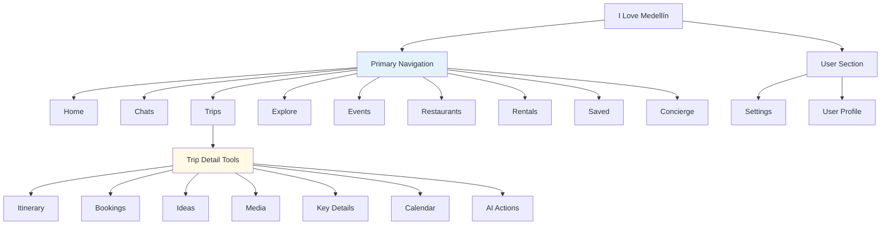
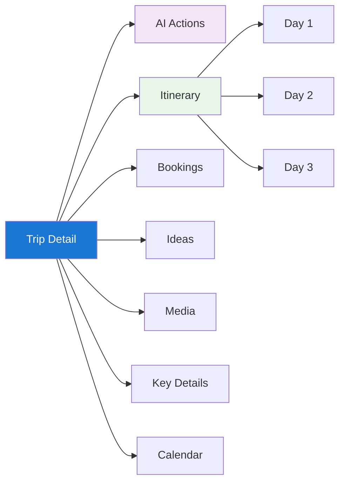
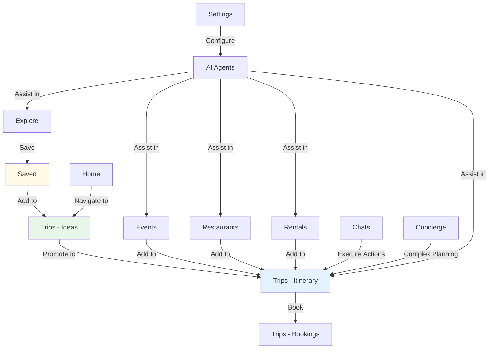

# COMPLETE NAVIGATION & FEATURES MAP
## Comprehensive Guide to Every Section, Feature, and Capability

**Document:** 10-navigation-features.md  
**Phase:** Complete System Definition  
**Purpose:** Master reference for all navigation sections, features, AI agents, and user workflows  
**Last Updated:** December 24, 2024

---

## TABLE OF CONTENTS

1. [Navigation Overview](#navigation-overview)
2. [Section-by-Section Breakdown](#section-by-section-breakdown)
3. [Trip Tools Deep Dive](#trip-tools-deep-dive)
4. [Core vs Advanced Features Matrix](#core-vs-advanced-features-matrix)
5. [AI Agents by Section](#ai-agents-by-section)
6. [Complete User Workflows](#complete-user-workflows)
7. [Integration Points](#integration-points)

---

## NAVIGATION OVERVIEW

### Left Sidebar Navigation Structure

### Navigation Hierarchy Rules

**Top Level (Always Visible)**  
Home, Chats, Trips, Explore, Events, Restaurants, Rentals, Saved, Concierge  
These are global sections accessible from anywhere.

**Second Level (Context-Dependent)**  
Trip Tools appear only when viewing specific trip detail.  
Settings and user menu at bottom, always accessible.

**Third Level (Nested Within Context)**  
Day-by-day itinerary items, booking details, saved collections.  
These appear within their parent sections.

---

## SECTION-BY-SECTION BREAKDOWN

### 1) HOME

**Route:** `/app` or `/app/home`

**Purpose:**  
Dashboard landing page. Overview of user's entire travel ecosystem. Starting point for new users.

**What It Shows:**

**Welcome Section**  
Personalized greeting: "Welcome back, Alex!"  
Current date and location if shared.  
Quick stats: X trips planned, Y events saved, Z restaurants bookmarked.

**Upcoming Section**  
Next 3 upcoming trips with dates and countdowns.  
Next 5 upcoming events or reservations.  
Weather alerts for imminent trips.

**Activity Feed**  
Recent actions: "You saved Carmen Restaurant", "You added Comuna 13 Tour to Tokyo Trip".  
AI suggestions: "Finish planning your Medellín trip" with CTA.  
Collaboration updates if trip shared: "Maria added Hotel Poblado to shared trip".

**Quick Actions**  
Large "Create New Trip" button.  
"Explore Medellín" button.  
"Chat with AI Concierge" button.

**Insights Cards**  
Budget summary across all trips.  
Travel streak or statistics: "You've visited 5 cities this year!"  
Recommendations: "Based on your Tokyo trip, consider Osaka next."

**Core Features:**  
Dashboard overview.  
Trip and event previews.  
Quick access to common actions.  
Activity and notification feed.

**Advanced Features:**  
Personalized travel insights.  
Trend analysis (favorite cuisines, preferred activities).  
Social features (friends' trips, shared itineraries).

**AI Agent:**  
Dashboard Concierge Agent.  
Provides daily briefing, suggests next actions, highlights urgent items.

**User Journey:**  
User logs in → Sees Home → Scans upcoming trips → Clicks trip to view details OR clicks Create New Trip.

---

### 2) CHATS

**Route:** `/app/chat` or `/app/chat/:conversationId`

**Purpose:**  
Conversational AI interface. Natural language interaction with AI agents. Context-aware assistance.

**What It Shows:**

**Conversation List (Sidebar or Left)**  
All chat conversations (grouped by trip or general).  
Each: Conversation title, last message preview, timestamp, unread badge.  
"New Conversation" button at top.

**Active Conversation (Main)**  
Message thread with user and AI messages.  
Input field at bottom for typing queries.  
Suggested quick questions as chips above input.  
AI typing indicator when processing.

**Context Panel (Right - if not in Right AI Panel)**  
Current context: Which trip or section AI is referencing.  
Attachments: Images, trip data, links shared in chat.  
Actions taken: Items added, bookings made via chat.

**What You Can Do:**

**Ask Questions**  
"Find vegan restaurants in Medellín under $20."  
"What's the weather in Tokyo next week?"  
"Show me my trip budget breakdown."

**Get Recommendations**  
"Suggest activities for a rainy day in Tokyo."  
"What restaurants should I try near my hotel?"

**Execute Actions**  
"Add Museo de Antioquia to my trip."  
"Book a table at El Cielo for Saturday at 7pm."  
"Optimize my route for Day 2."

**Troubleshoot Issues**  
"My event times conflict, help me fix it."  
"I'm over budget, where can I save money?"

**Core Features:**  
Natural language chat interface.  
Context-aware responses (knows current trip, user preferences).  
Action execution from chat ("Add to trip", "Create reminder").  
Conversation history persistence.

**Advanced Features:**  
Multi-turn complex queries (planning entire trip via chat).  
Voice input (speech-to-text).  
Image recognition (send photo, AI identifies restaurant or landmark).  
Proactive suggestions (AI initiates conversation with tips).

**AI Agents:**  
General Concierge (routes to specialist agents).  
All 6 specialist agents accessible via chat.  
Conversation Manager (maintains context across turns).

**User Journey:**  
User asks question → AI responds → User refines → AI provides options → User selects → AI executes action.

---

### 3) TRIPS

**Route:** `/app/trips` (list) or `/app/trips/:tripId` (detail)

**Purpose:**  
Manage all user's trips. Central hub for trip planning and organization.

**What It Shows (List View):**

**Trips Grid**  
All trips as cards.  
Each card: Destination, dates, hero image, status (Planning, Confirmed, Completed), activity count, budget status.  
Tabs: Upcoming, Past, Drafts.

**Filters & Sort**  
Filter by destination, date range, status.  
Sort by date, name, budget, activity count.  
Search trips by name or destination.

**Create Button**  
Large "Create New Trip" button.  
Quick-create: Destination, dates, go.  
Full wizard: Multi-step planning process.

**What It Shows (Detail View):**  
SEE TRIP TOOLS SECTION BELOW for complete breakdown.

**Core Features:**  
Trip list with visual cards.  
Create, read, update, delete trips.  
Trip status management (Draft → Planning → Confirmed → Completed).  
Trip sharing (invite collaborators).

**Advanced Features:**  
Trip templates (duplicate successful trips).  
Trip comparison (compare costs, activities across trips).  
Trip archive and history.  
Multi-trip view (planning multiple trips simultaneously).

**AI Agents:**  
Trip Planner Agent (creates full itinerary).  
Itinerary Optimizer Agent (improves existing trips).  
Budget Guardian Agent (tracks spending).

**User Journey:**  
User clicks Trips → Sees trip list → Clicks trip → Views trip detail with all tools → Makes changes → Saves.

---

### 4) EXPLORE

**Route:** `/app/explore`

**Purpose:**  
Discover new destinations, activities, and inspiration. Location-aware browsing. Curated content.

**What It Shows:**

**Location Header**  
"Exploring: El Poblado" (current location or selected city).  
Change location button/dropdown.  
Current weather and conditions.

**Contextual Banner**  
Time-based suggestions: "Thursday Afternoon in Poblado - Perfect for walking tour or rooftop coffee."  
Event alerts: "Cherry blossom season starts in 2 weeks!"

**Search Bar**  
"Search places, vibes, or cravings..."  
Auto-complete with suggestions.  
Voice search option.

**Category Tabs**  
All, Restaurants, Things to Do, Stays, Coffee, Nightlife.  
Horizontal scrolling tabs.

**Content Cards Grid**  
Large illustrated cards showing places/activities.  
Each card: Photo, name, rating, price level, distance, AI match score, quick description.  
"Must-visit for molecular gastronomy lovers" tag.  
"Perfect for date night. Reserve patio seating." AI tip.

**Collections Section**  
Curated lists: "Top 10 in Medellín", "Hidden Gems", "Local Favorites".  
User-created collections visible if public.

**Map Integration**  
Toggle map view showing all cards as pins.  
Cluster markers for density.

**Core Features:**  
Location-based discovery.  
Search and filter by category, price, rating.  
AI-powered recommendations with match scores.  
Save items for later.

**Advanced Features:**  
Vibe-based search ("romantic dinner", "adventure activities").  
Visual search (upload photo, find similar places).  
AR view (point camera, see nearby places overlaid).  
Social discovery (see what friends saved).

**AI Agents:**  
Local Scout Agent (destination insights and recommendations).  
Discovery Agent (personalized content curation).

**User Journey:**  
User explores destination → Sees recommendations → Filters by category → Views place detail → Saves to Ideas OR adds directly to trip.

---

### 5) EVENTS

**Route:** `/app/events` (browse) or `/app/events/:eventId` (detail)

**Purpose:**  
Discover and book events, activities, tours, and experiences. Time-sensitive opportunities.

**What It Shows (Browse View):**

**Event Categories**  
Cultural, Entertainment, Festivals, Outdoor, Workshops, Nightlife, Sports.  
Icon-based navigation.

**Date Filter**  
Date range picker.  
Quick filters: This Weekend, Next Week, This Month.  
Calendar view option.

**Events Grid**  
Event cards with large images.  
Each: Event name, date/time, location, price, category badge, availability status.  
"Selling Fast" or "Last Tickets" urgency indicators.

**Calendar View**  
Month calendar with event dots on dates.  
Click date to see events that day.  
Color-coded by category.

**Map View**  
Events as pins on map.  
Click pin to see event preview, click card to see detail.

**What It Shows (Detail View):**

**Event Hero**  
Large cover image or video.  
Event name, category badge.  
Date, time, duration.  
Location with map preview.

**Event Details**  
Full description.  
What's included.  
What to bring.  
Age restrictions.  
Accessibility information.

**Pricing**  
Ticket tiers (General, VIP, Group).  
Pricing per person.  
Total calculator if multiple tickets.

**Actions**  
"Add to Trip" (select which trip, which day).  
"Save for Later" (adds to Saved section).  
"Share Event" (link, social media).  
"Book Tickets" (external link or integrated booking).

**Similar Events**  
3-5 related events.  
"If you like this, you might like..."

**Core Features:**  
Event browsing and search.  
Filter by category, date, price, location.  
Event details with booking information.  
Add events to trip itinerary.  
Calendar view of events.

**Advanced Features:**  
Event reminders (notify when tickets go on sale).  
Group booking coordination.  
Event attendance tracking (mark as attended).  
Post-event reviews and photos.

**AI Agents:**  
Event Curator Agent (finds and recommends events).  
Booking Assistant Agent (helps with reservations).

**User Journey:**  
User browses events → Filters by date and category → Views event detail → Adds to trip → Sets reminder to book tickets.

---

### 6) RESTAURANTS

**Route:** `/app/restaurants` (search) or `/app/restaurants/:restaurantId` (detail)

**Purpose:**  
Discover restaurants, make reservations, track dining experiences. Cuisine-based exploration.

**What It Shows (Search View):**

**Search & Filters**  
Search bar: "Search by cuisine, dish, or vibe."  
Filters: Cuisine type, price level, dietary restrictions, distance, rating, features (outdoor seating, live music).

**Restaurant Cards**  
Photo carousel (3-5 images).  
Restaurant name, cuisine, price level.  
Rating (stars), review count.  
Distance from current location or hotel.  
AI match score: "95% match - Matches your food preferences."  
Quick tags: "Vegan options", "Reservation required", "Romantic".

**Map View Toggle**  
Switch to map showing restaurant pins.  
Cluster markers in dense areas.

**Collections**  
"Must-Try in Medellín", "Date Night Spots", "Budget-Friendly Eats".  
User can create custom collections.

**What It Shows (Detail View):**

**Restaurant Hero**  
Photo gallery or 360° virtual tour.  
Restaurant name, cuisine, price level.  
Rating, review count, awards (Michelin, etc).

**Key Information**  
Address with map.  
Hours of operation.  
Phone number.  
Website link.  
Reservation policy.

**Menu Preview**  
Sample menu items with prices.  
Chef specialties highlighted.  
Dietary options noted.

**Reviews Summary**  
Overall rating breakdown.  
Recent reviews (3-5 most recent).  
"Read all reviews" link.

**Ambiance & Features**  
Dress code.  
Noise level.  
Good for: Dates, families, groups, business.  
Features: Outdoor seating, bar, live music, parking.

**Actions**  
"Add to Trip" (select day, meal type).  
"Reserve Table" (integrated or external link).  
"Save for Later".  
"Share Restaurant".  
"Directions" (opens map app).

**Similar Restaurants**  
3-5 restaurants with similar cuisine or vibe.

**Core Features:**  
Restaurant search with robust filters.  
Cuisine and dietary restriction matching.  
Restaurant details with menu and reviews.  
Reservation booking or linking.  
Add to trip itinerary with meal type.

**Advanced Features:**  
AI-powered cuisine recommendations.  
Dietary restriction cross-referencing (allergies).  
Reservation availability checking.  
Post-dining review prompts.  
Wine pairing suggestions.

**AI Agents:**  
Dining Orchestrator Agent (restaurant matching).  
Reservation Assistant Agent (booking help).

**User Journey:**  
User searches restaurants → Filters by cuisine and price → Views details → Checks menu → Adds to trip → Books reservation.

---

### 7) RENTALS (REAL ESTATE / CAR RENTALS)

**Route:** `/app/rentals` (browse) or `/app/rentals/:rentalId` (detail)

**Purpose:**  
Find and book rental cars, vacation homes, or temporary accommodations. Logistics planning.

**What It Shows (Browse View):**

**Rental Type Toggle**  
Tabs: Vehicles, Homes, Other.  
Switch between rental categories.

**Search Parameters**  
Pickup/dropoff location and dates (for vehicles).  
Destination and dates (for homes).  
Number of guests (for homes).  
Vehicle type (compact, sedan, SUV, luxury).

**Rental Cards**  
Vehicle: Photo, make/model, year, transmission, fuel type, price per day, total cost.  
Home: Photos, property type, bedrooms, bathrooms, amenities, price per night, total cost.  
Rating, review count, company/host.

**Comparison Tool**  
Select 2-3 rentals to compare side-by-side.  
Feature comparison table.

**What It Shows (Detail View - Vehicle):**

**Vehicle Details**  
Photo gallery.  
Make, model, year.  
Transmission, fuel type, seats, luggage capacity.  
Features: GPS, Bluetooth, USB, child seat available.

**Rental Terms**  
Price breakdown: Daily rate, taxes, fees, insurance.  
Total cost calculation.  
Mileage limit (unlimited or per-day limit).  
Fuel policy (full-to-full, etc).

**Pickup/Dropoff**  
Locations and hours.  
Map showing both locations.  
Airport pickup option.

**Insurance Options**  
Basic included.  
Premium options with coverage details.  
Add insurance to total cost.

**Actions**  
"Add to Trip".  
"Reserve Now" (external or integrated).  
"Save for Later".  
"Compare" (add to comparison).

**What It Shows (Detail View - Home):**

**Property Details**  
Photo gallery or virtual tour.  
Property type, bedrooms, bathrooms, guests capacity.  
Amenities: WiFi, kitchen, pool, parking, etc.

**Host Information**  
Host name, rating, response time.  
House rules, check-in/out times.

**Location**  
Map showing property location.  
Nearby attractions and transit.

**Pricing**  
Nightly rate, cleaning fee, service fee.  
Total cost for selected dates.  
Cancellation policy.

**Actions**  
"Add to Trip".  
"Book Now" (external platform).  
"Contact Host".  
"Save for Later".

**Core Features:**  
Vehicle and property rental search.  
Filter by type, price, features, dates.  
Comparison tool for side-by-side evaluation.  
Cost breakdown with fees and insurance.  
Add to trip with pickup/check-in details.

**Advanced Features:**  
Insurance recommendation based on trip.  
Cross-rental comparison (vehicle vs public transit cost).  
Automatic pickup/dropoff time optimization.  
Host messaging for homes.

**AI Agents:**  
Rental Comparison Agent (evaluates options).  
Logistics Coordinator Agent (integrates with trip schedule).

**User Journey:**  
User sets dates and location → Browses options → Compares 2-3 rentals → Views full details → Adds to trip → Books externally.

---

### 8) SAVED

**Route:** `/app/saved`

**Purpose:**  
Centralized repository for all saved items. Inspiration and planning staging area.

**What It Shows:**

**Collections Grid**  
User-created collections: "Tokyo Food Tour", "Adventure Activities", "Romantic Date Ideas".  
Each collection: Name, cover image (from first item), item count.  
"Create Collection" button.

**All Saved Items View**  
Unified view of all saved items across types.  
Tabs: All, Restaurants, Events, Rentals, Places, Ideas.  
Each item card shows: Type badge, photo, name, quick details, "Add to Trip" button.

**Quick Actions**  
Bulk select items.  
"Add All to Trip" action.  
"Move to Collection".  
"Remove from Saved".

**Search & Filter**  
Search within saved items.  
Filter by type, destination, date saved.  
Sort by date saved, alphabetical, price.

**What You Can Do:**

**Organize Saved Items**  
Create collections for different trip themes.  
Move items between collections.  
Tag items with custom labels.

**Plan from Saved**  
Select items and add all to new or existing trip.  
Share collection with friends or travel companions.

**Discovery**  
Revisit saved inspiration.  
Find items saved months ago for future trips.

**Core Features:**  
Save items from any module (Explore, Events, Restaurants, Rentals).  
Organize into collections.  
Search and filter saved items.  
Add saved items to trips easily.

**Advanced Features:**  
Smart collections (auto-populate based on criteria).  
Shared collections (collaborative inspiration boards).  
Collection templates (start from curated collections).  
Export collections as PDFs or shareable links.

**AI Agent:**  
Saved Items Organizer Agent (suggests collections, identifies duplicates, recommends items to add to trips).

**User Journey:**  
User explores → Saves interesting items → Returns to Saved → Organizes into collection → Creates trip → Adds collection items to trip.

---

### 9) CONCIERGE

**Route:** `/app/concierge`

**Purpose:**  
Premium AI assistant for complex requests, VIP services, and personalized planning. Human-AI collaboration hub.

**What It Shows:**

**Concierge Dashboard**  
"How can I assist you today?" welcome message.  
Active requests with status (In Progress, Completed, Pending).  
Request history (last 10 interactions).

**Request Categories**  
Special Planning (multi-day itinerary, theme trip).  
VIP Services (private tours, exclusive reservations).  
Problem Solving (cancellations, changes, emergencies).  
Research (destination deep-dive, activity sourcing).

**Chat Interface**  
Similar to Chats section but elevated for complex queries.  
Concierge avatar/persona.  
Ability to escalate to human concierge if available (premium feature).

**What You Can Request:**

**Complex Planning**  
"Plan a 7-day cultural immersion trip to Medellín with cooking classes, art galleries, and local neighborhoods."  
AI creates multi-day detailed itinerary with bookings.

**Special Accommodations**  
"I have a wheelchair user in our group. Find accessible restaurants and activities in Tokyo."  
AI filters and recommends only verified accessible options.

**Exclusive Access**  
"Get reservation at El Cielo for Saturday night, sold out online."  
AI attempts alternative booking methods or waitlist management.

**Emergency Assistance**  
"My flight was cancelled. Rebook and adjust my trip."  
AI provides rebooking options and updates trip.

**Research Projects**  
"I want to learn about coffee culture in Medellín. Create a coffee tour itinerary."  
AI researches farms, roasters, cafes, and plans tour.

**Core Features:**  
Natural language complex request handling.  
Multi-turn conversation for refinement.  
Request tracking and status updates.  
Integration with all modules (can execute actions across system).

**Advanced Features:**  
Human concierge escalation (premium tier).  
24/7 availability.  
Priority response times.  
Dedicated account manager (highest tier).

**AI Agents:**  
General Concierge Agent (primary interface).  
All specialist agents accessible via delegation.  
VIP Services Agent (handles premium requests).

**User Journey:**  
User has complex need → Opens Concierge → Describes request in detail → AI clarifies and confirms → AI executes multi-step plan → User reviews and approves → Request completed.

---

### 10) SETTINGS

**Route:** `/app/settings`

**Purpose:**  
User account configuration, preferences, app customization, subscription management.

**What It Shows:**

**Settings Categories (Tabs or Sections):**

**Account**  
Profile information (name, email, phone, avatar).  
Password change.  
Connected accounts (Google, GitHub OAuth).  
Account deletion.

**Preferences**  
Travel style (luxury, moderate, budget).  
Interests (food, art, nature, nightlife, culture).  
Dietary restrictions (vegetarian, vegan, gluten-free, allergies).  
Accessibility needs.

**Notifications**  
Email notifications (trip updates, reminders, marketing).  
Push notifications (mobile app).  
In-app notifications.  
Notification frequency (immediate, daily digest, weekly).

**Privacy**  
Data sharing preferences.  
Trip visibility (private, friends, public).  
Analytics opt-in/out.  
Data export request.

**AI Settings**  
AI suggestions toggle (on/off).  
AI agents configuration (enable/disable specific agents).  
AI chat history retention.  
AI personality tuning (formal, casual, enthusiastic).

**Subscription & Billing**  
Current plan (Free, Pro, Team).  
Payment method.  
Billing history.  
Upgrade/downgrade options.  
Cancel subscription.

**Integrations**  
Connected calendar (Google Calendar, iCal).  
Map provider (Google Maps, Apple Maps).  
Booking platforms (OpenTable, Airbnb, etc).  
Export integrations (TripIt, Google Trips).

**Appearance**  
Theme (light, dark, auto).  
Language preference.  
Date/time format.  
Currency preference.

**Core Features:**  
Profile and account management.  
Notification preferences.  
Privacy controls.  
Subscription management.

**Advanced Features:**  
Granular AI configuration.  
Integration with external services.  
Data export and portability.  
Advanced privacy settings.

**User Journey:**  
User clicks Settings → Navigates to relevant section → Updates preferences → Saves changes → Returns to app with updated settings.

---

## TRIP TOOLS DEEP DIVE

**Context:** These tools appear when viewing a specific trip detail page. They provide specialized views and actions for managing the trip.

### TRIP TOOLS NAVIGATION

---

### 1) AI ACTIONS (Trip Tool)

**Purpose:**  
Quick access to AI-powered trip optimization and automation features.

**What It Shows:**

**Smart Optimizations Section**  
"Optimize Route" button with description: "Reorder activities to minimize travel time."  
"Balance Budget" button: "Reallocate spending across categories."  
"Improve Pacing" button: "Ensure mix of relaxing and intense activities."  
"Weather Prep" button: "Adjust outdoor activities based on forecast."

**Suggested Actions**  
AI-generated action cards based on trip state.  
Examples:  
"Add 2 more restaurants for dinner variety."  
"Book tickets for Museo de Antioquia (required reservation)."  
"Set reminders for all unconfirmed bookings."

**Automation Setup**  
Configure automations for this trip.  
Budget alerts threshold.  
Booking deadline reminders.  
Shared trip update notifications.

**Batch Actions**  
"Export Trip to PDF."  
"Share Trip Link."  
"Duplicate Trip."  
"Archive Trip."

**Core Features:**  
One-click route optimization.  
Budget rebalancing suggestions.  
Weather-based activity adjustments.  
Automated reminders setup.

**Advanced Features:**  
Pacing analysis (activity intensity over days).  
Travel time vs activity time ratio optimization.  
Cost-per-experience analysis.  
Alternative activity suggestions for conflicts.

**AI Agent:**  
Itinerary Optimizer Agent.  
Budget Guardian Agent.  
Weather Advisor Agent.

**User Journey:**  
User opens trip → Clicks AI Actions → Reviews suggestions → Clicks "Optimize Route" → Reviews proposed changes → Confirms → Itinerary updates.

---

### 2) ITINERARY (Trip Tool)

**Purpose:**  
Day-by-day plan of all trip activities. Core trip planning interface.

**What It Shows:**

**Day Selector**  
Tabs or buttons for each day: Day 1, Day 2, Day 3.  
Shows date for each day.  
Shows day summary: 5 activities, 2 meals, $150 budget for day.

**Day View (Active Day)**  
Timeline layout showing activities chronologically.  
Each activity card: Time, title, location, duration, cost, type icon.  
Drag handles for reordering.  
"Add Activity" button at bottom or between time slots.

**Activity Cards**  
Compact view: Icon, time, title, location.  
Expanded view (on click): Full details, notes, booking status, directions, AI suggestions.  
Actions: Edit, delete, mark complete, add notes, add to bookings.

**Day Summary Sidebar**  
Total activities for day.  
Total time allocated.  
Total cost for day.  
Travel time between activities.  
Map preview showing route.

**Multi-Day View Toggle**  
Switch to see all days at once in column layout.  
Helpful for spotting patterns or gaps.

**What You Can Do:**

**Add Activities**  
Click "Add" → Search or select from Ideas → Set time → Add to day.  
Drag from Ideas panel directly into day.

**Reorder Activities**  
Drag and drop to change order.  
AI warns if reorder creates conflicts.  
Auto-recalculate route and travel time.

**Edit Activities**  
Click activity → Edit time, duration, notes, cost.  
Mark as tentative or confirmed.

**Delete Activities**  
Click delete icon → Confirm → Removed from day and budget.

**Move to Different Day**  
Drag activity to different day tab.  
Or use "Move to..." dropdown.

**Core Features:**  
Day-by-day activity list.  
Drag-and-drop reordering.  
Add, edit, delete activities.  
Time and budget tracking per day.

**Advanced Features:**  
Template days (save Day 1 as template for future trips).  
Day comparison (compare activity density across days).  
Auto-scheduling (AI fills in optimal times based on opening hours and distances).  
Buffer time insertion (add 30-min buffer between activities).

**AI Agent:**  
Itinerary Optimizer Agent (suggests reordering).  
Conflict Detector Agent (warns of overlaps).

**User Journey:**  
User views trip → Clicks Itinerary → Clicks Day 2 → Sees 4 activities → Drags activity to reorder → Adds new restaurant → Day updates with new travel time.

---

### 3) BOOKINGS (Trip Tool)

**Purpose:**  
Track all reservations, tickets, and bookings for the trip. Confirmation and reminder management.

**What It Shows:**

**Bookings List**  
All bookings grouped by type: Flights, Stays, Tickets, Restaurants, Rentals.  
Each booking card: Type icon, name, date/time, status (Confirmed, Pending, Cancelled), confirmation number.

**Booking Card Details**  
Expand to see full details.  
Confirmation number.  
Booking reference link (email, external site).  
Cost.  
Cancellation policy.  
Add to calendar button.  
Attach file (upload confirmation email/PDF).

**Status Indicators**  
Confirmed (green checkmark).  
Pending (yellow clock).  
Cancelled (red X).  
Needs Action (orange alert): "Booking deadline in 3 days."

**Quick Stats**  
Total bookings count.  
Confirmed vs pending ratio.  
Total booked cost vs trip budget.

**What You Can Do:**

**Add Booking Manually**  
Click "Add Booking" → Select type → Fill details (name, date, confirmation number, cost) → Save.

**Import Booking**  
Forward confirmation email to special email address.  
AI extracts booking details and adds to trip.  
Or upload PDF/screenshot, AI parses.

**Edit Booking**  
Update details, change status, add notes.

**Cancel Booking**  
Mark as cancelled, optionally remove from budget.

**Set Reminders**  
Remind to confirm booking.  
Remind to check-in.  
Remind to bring documents.

**Core Features:**  
Centralized booking tracker.  
Manual entry and import.  
Status tracking (confirmed, pending, cancelled).  
Confirmation number storage.  
Reminders for booking actions.

**Advanced Features:**  
Email forwarding auto-import.  
PDF/screenshot parsing with OCR.  
Calendar integration (auto-add to Google Calendar).  
Cancellation policy alerts.  
Travel insurance recommendations.

**AI Agent:**  
Booking Manager Agent (parses confirmations, sets reminders, tracks status).

**User Journey:**  
User books restaurant externally → Forwards confirmation email → AI adds to Bookings → User reviews → Sets reminder to confirm 24h before.

---

### 4) IDEAS (Trip Tool)

**Purpose:**  
Staging area for potential trip activities. Inspiration and research collection.

**What It Shows:**

**Ideas Grid**  
All saved or suggested items not yet added to itinerary.  
Each idea card: Photo, name, type, quick description, AI match score, "Add to Trip" button.

**Idea Sources**  
Saved from Explore/Events/Restaurants (marked with "Saved" badge).  
AI suggestions (marked with "AI Recommended" badge).  
Manually added (marked with "Custom" badge).

**Categories**  
Filter ideas by type: All, Restaurants, Events, Activities, Places, Custom Notes.

**Bulk Actions**  
Select multiple ideas.  
"Add All to Itinerary" → AI suggests best days for each.  
"Remove from Ideas".

**What You Can Do:**

**Add to Itinerary**  
Click "Add to Trip" → Choose day → Set time → Moves from Ideas to Itinerary.

**Remove from Ideas**  
Click remove icon → Deleted from Ideas (but still in Saved if originally saved).

**View Details**  
Click idea card → Opens detail modal or page with full info.  
From detail view, can add to trip or remove.

**Add Custom Idea**  
Click "Add Custom" → Enter name, type, notes, link → Saves to Ideas.  
Example: "Bring picnic to Parque Arvi" (custom activity).

**Organize Ideas**  
Tag ideas (e.g., "Rainy Day Backup", "If We Have Time").  
Sort by match score, price, or custom order.

**Core Features:**  
Saved items staging area.  
AI-suggested activities based on trip.  
Quick add to itinerary.  
Custom idea creation.

**Advanced Features:**  
Smart categorization (AI groups similar ideas).  
Alternative suggestions (if idea unavailable, AI suggests similar).  
Idea expiration (remove outdated events).  
Idea sharing (send ideas to collaborators for voting).

**AI Agent:**  
Discovery Agent (populates with relevant suggestions).  
Relevance Ranker Agent (sorts by match score).

**User Journey:**  
User saves restaurants while exploring → Returns to trip → Clicks Ideas → Sees 12 saved items → Selects 5 best matches → Adds all to itinerary → AI suggests best days for each.

---

### 5) MEDIA (Trip Tool)

**Purpose:**  
Store and organize photos, screenshots, and media related to trip. Visual trip memory.

**What It Shows:**

**Media Gallery**  
Grid of all uploaded images and videos.  
Each item: Thumbnail, date added, caption (if any).  
Click to view full size.

**Media Types**  
Photos (user-uploaded from phone or computer).  
Screenshots (saved from browsing).  
Documents (PDFs like tickets, maps, guides).  
Videos (short clips).

**Albums/Tags**  
Auto-organized by date or day.  
User-created albums: "Food Photos", "Accommodation Screenshots", "Tickets & Confirmations".

**Upload Methods**  
Click "Upload" → Select files from device.  
Drag and drop into gallery.  
Mobile: Take photo directly from app.  
Import from Google Drive, Dropbox.

**What You Can Do:**

**Add Media**  
Upload photos, videos, PDFs.  
Screenshot directly within app (browser extension).

**Organize Media**  
Create albums or tags.  
Move media between albums.  
Add captions and descriptions.

**Link Media to Activities**  
Attach media to specific itinerary items.  
Example: Attach restaurant photos to dinner reservation.

**Share Media**  
Share album with trip collaborators.  
Export media to zip file.

**Delete Media**  
Remove unwanted items.

**Core Features:**  
Photo and document upload.  
Gallery view with thumbnails.  
Basic organization (albums, tags).  
Link media to itinerary items.

**Advanced Features:**  
AI-powered organization (auto-tag by content: "food", "sunset", "architecture").  
Duplicate detection (don't upload same photo twice).  
Image search (find photo by description).  
Automatic trip recap video generation from photos.

**AI Agent:**  
Media Organizer Agent (tags photos, suggests albums, creates recaps).

**User Journey:**  
User returns from trip → Uploads 50 photos → AI auto-tags by content → User creates "Best Food" album → Shares album with travel companion.

---

### 6) KEY DETAILS (Trip Tool)

**Purpose:**  
Essential trip logistics and preferences. Central reference for important information.

**What It Shows:**

**Trip Overview**  
Trip name (editable).  
Destination.  
Travel dates (editable).  
Duration (calculated).  
Traveler count.

**Budget Section**  
Total budget.  
Budget by category (accommodation, food, activities, transport).  
Current spending.  
Remaining budget.  
Edit budget button.

**Preferences**  
Travel style (luxury, moderate, budget).  
Interests (tags: food, art, nature, etc).  
Dietary restrictions.  
Accessibility needs.  
Pace preference (relaxed, moderate, packed).

**Logistics**  
Accommodation details (hotel name, address, check-in/out times).  
Transportation (flight numbers, rental car details).  
Emergency contacts.  
Insurance information.  
Packing list.

**Notes Section**  
Free-form text area for trip notes.  
Reminders, special considerations, links.

**What You Can Do:**

**Edit Trip Basics**  
Change trip name, dates, traveler count.

**Update Budget**  
Increase/decrease budget.  
Reallocate across categories.

**Set Preferences**  
Change interests, dietary needs, style.  
AI uses updated preferences for suggestions.

**Add Logistics**  
Enter accommodation details.  
Add flight information.  
Add emergency contacts.

**Manage Packing List**  
Add items to pack.  
Check off items as packed.  
AI suggests items based on destination and activities.

**Core Features:**  
Trip metadata editing.  
Budget configuration.  
Preference management.  
Logistics tracking.  
Packing list.

**Advanced Features:**  
Multi-currency budget tracking.  
Automatic logistics import (forward flight confirmation, AI extracts).  
Smart packing list (AI suggests based on weather and activities).  
Shared logistics (collaborators see accommodation and emergency info).

**AI Agent:**  
Trip Coordinator Agent (manages logistics, suggests packing items).

**User Journey:**  
User creates trip → Enters destination and dates → Sets budget $2000 → Adds dietary restriction (vegetarian) → AI uses these details to filter all recommendations throughout trip planning.

---

### 7) CALENDAR (Trip Tool)

**Purpose:**  
Calendar view of trip itinerary. Visual time management.

**What It Shows:**

**Calendar Grid**  
Month or week view showing trip dates.  
Each day shows all activities as blocks or dots.  
Color-coded by activity type (event, restaurant, rental, custom).

**Day Drill-Down**  
Click day to expand and see full schedule.  
Shows timeline with hour markers.  
Activities positioned at their scheduled times.

**Multi-Trip View**  
If user has multiple trips in same timeframe, show all on calendar.  
Distinguish trips by color.

**What You Can Do:**

**View Schedule**  
See all activities in calendar format.  
Spot busy days vs free days.

**Add Activity**  
Click time slot → Quick-add activity modal.  
Specify type, name, duration.

**Move Activity**  
Drag activity to different time or day.  
Calendar updates itinerary.

**Sync with External Calendar**  
Export trip to Google Calendar, iCal.  
Two-way sync if enabled (changes in Google Calendar reflect in app).

**Core Features:**  
Calendar view of itinerary.  
Day and week views.  
Add and move activities via calendar interface.  
Export to external calendars.

**Advanced Features:**  
Two-way calendar sync.  
Time zone management (for international trips).  
Availability blocking (mark personal time off).  
Multi-trip overlay.

**AI Agent:**  
Calendar Optimizer Agent (suggests best times for activities based on opening hours, crowd data).

**User Journey:**  
User opens Calendar → Sees 3-day trip overview → Notices Day 2 is packed, Day 3 is empty → Drags one activity from Day 2 to Day 3 → Itinerary updates automatically.

---

## CORE VS ADVANCED FEATURES MATRIX

### Complete Feature Classification

| Section | Feature | Core/Advanced | User Value | Example | Risk |
|---------|---------|---------------|------------|---------|------|
| **Home** | Dashboard overview | Core | High | See upcoming trips and events | Low |
| Home | Quick actions | Core | High | "Create New Trip" button | Low |
| Home | Activity feed | Core | Medium | Recent saves and updates | Low |
| Home | Travel insights | Advanced | Medium | "You prefer coastal destinations" | Low |
| Home | Social features | Advanced | Low | Friends' trip shares | Medium |
| **Chats** | Natural language chat | Core | High | "Find vegan restaurants" | Low |
| Chats | Context awareness | Core | High | AI knows current trip | Low |
| Chats | Action execution | Core | High | Add to trip from chat | Medium |
| Chats | Voice input | Advanced | Medium | Speech-to-text queries | Medium |
| Chats | Image recognition | Advanced | Low | Photo of restaurant → details | High |
| **Trips** | Trip list/grid | Core | High | See all trips | Low |
| Trips | Create/edit/delete | Core | High | CRUD operations | Low |
| Trips | Drag-drop itinerary | Core | High | Reorder activities | Low |
| Trips | Budget tracking | Core | High | Monitor spending | Low |
| Trips | Trip sharing | Advanced | Medium | Collaborate with others | Medium |
| Trips | Trip templates | Advanced | Low | Duplicate trips | Low |
| **Explore** | Location discovery | Core | High | Browse Medellín places | Low |
| Explore | Category filters | Core | High | Filter by restaurants, events | Low |
| Explore | AI match scores | Core | High | "95% match" indicators | Low |
| Explore | Vibe search | Advanced | Medium | "romantic dinner spots" | Medium |
| Explore | Visual search | Advanced | Low | Upload photo, find similar | High |
| Explore | AR view | Advanced | Low | Point camera, see overlays | High |
| **Events** | Event browsing | Core | High | Discover activities | Low |
| Events | Date filtering | Core | High | This weekend, next month | Low |
| Events | Add to trip | Core | High | Schedule events | Low |
| Events | Calendar view | Advanced | Medium | Month view with event dots | Low |
| Events | Group booking | Advanced | Low | Coordinate group tickets | Medium |
| **Restaurants** | Search & filter | Core | High | Find by cuisine, price | Low |
| Restaurants | Dietary matching | Core | High | Vegan, gluten-free options | Low |
| Restaurants | Reservation linking | Core | Medium | Book via OpenTable | Medium |
| Restaurants | Menu preview | Advanced | Medium | See sample dishes | Low |
| Restaurants | Wine pairing AI | Advanced | Low | Suggest wines for meal | Medium |
| **Rentals** | Vehicle search | Core | High | Find rental cars | Low |
| Rentals | Cost comparison | Core | High | Compare total costs | Low |
| Rentals | Add to trip | Core | High | Schedule rental | Low |
| Rentals | Insurance advice | Advanced | Medium | Recommend coverage | Medium |
| Rentals | Vacation home search | Advanced | Medium | Find Airbnbs | Low |
| **Saved** | Save items | Core | High | Bookmark for later | Low |
| Saved | Collections | Core | Medium | Organize by theme | Low |
| Saved | Add to trip | Core | High | Move from Saved to trip | Low |
| Saved | Smart collections | Advanced | Low | Auto-populate collections | Medium |
| Saved | Shared collections | Advanced | Low | Collaborate on boards | Medium |
| **Concierge** | Complex requests | Advanced | High | Multi-day planning | Medium |
| Concierge | VIP services | Advanced | Medium | Exclusive reservations | High |
| Concierge | Human escalation | Advanced | Low | Talk to real concierge | High |
| **Settings** | Account management | Core | High | Profile, password | Low |
| Settings | Preferences | Core | High | Interests, dietary | Low |
| Settings | Notifications | Core | Medium | Email, push settings | Low |
| Settings | AI configuration | Advanced | Medium | Enable/disable agents | Low |
| Settings | Integrations | Advanced | Low | Connect external apps | Medium |
| **Trip Tools: AI Actions** | Optimize route | Core | High | Minimize travel time | Medium |
| Trip Tools: AI Actions | Balance budget | Core | High | Reallocate spending | Medium |
| Trip Tools: AI Actions | Weather prep | Advanced | Medium | Adjust outdoor activities | Low |
| Trip Tools: AI Actions | Export trip | Advanced | Medium | PDF generation | Low |
| **Trip Tools: Itinerary** | Day-by-day view | Core | High | See schedule | Low |
| Trip Tools: Itinerary | Drag-drop | Core | High | Reorder activities | Low |
| Trip Tools: Itinerary | Add/edit/delete | Core | High | Manage activities | Low |
| Trip Tools: Itinerary | Auto-scheduling | Advanced | Medium | AI fills optimal times | Medium |
| Trip Tools: Itinerary | Template days | Advanced | Low | Save day as template | Low |
| **Trip Tools: Bookings** | Track bookings | Core | High | Centralized tracker | Low |
| Trip Tools: Bookings | Manual entry | Core | High | Add confirmations | Low |
| Trip Tools: Bookings | Set reminders | Core | Medium | Booking deadlines | Low |
| Trip Tools: Bookings | Email import | Advanced | High | Forward to auto-add | Medium |
| Trip Tools: Bookings | PDF parsing | Advanced | Medium | Upload confirmation PDF | High |
| **Trip Tools: Ideas** | Saved staging | Core | High | Pre-itinerary collection | Low |
| Trip Tools: Ideas | AI suggestions | Core | High | Recommended activities | Low |
| Trip Tools: Ideas | Add to itinerary | Core | High | Promote to schedule | Low |
| Trip Tools: Ideas | Smart categorization | Advanced | Low | AI groups ideas | Low |
| **Trip Tools: Media** | Upload photos | Core | Medium | Store trip photos | Low |
| Trip Tools: Media | Gallery view | Core | Medium | Browse media | Low |
| Trip Tools: Media | Albums/tags | Core | Medium | Organize photos | Low |
| Trip Tools: Media | AI tagging | Advanced | Low | Auto-tag by content | Medium |
| Trip Tools: Media | Recap video | Advanced | Low | Auto-generate highlights | High |
| **Trip Tools: Key Details** | Edit basics | Core | High | Name, dates, budget | Low |
| Trip Tools: Key Details | Set preferences | Core | High | Style, interests, dietary | Low |
| Trip Tools: Key Details | Logistics | Core | Medium | Hotel, flights | Low |
| Trip Tools: Key Details | Packing list | Advanced | Medium | AI-suggested items | Low |
| **Trip Tools: Calendar** | Calendar view | Core | Medium | Visual schedule | Low |
| Trip Tools: Calendar | Export to Google Cal | Core | Medium | Sync with external | Medium |
| Trip Tools: Calendar | Two-way sync | Advanced | Low | Changes sync both ways | High |

---

## AI AGENTS BY SECTION

### Agent Assignment Map

```mermaid
graph TD
    A[User Sections] --> B[Home]
    A --> C[Chats]
    A --> D[Trips]
    A --> E[Explore]
    A --> F[Events]
    A --> G[Restaurants]
    A --> H[Rentals]
    A --> I[Saved]
    A --> J[Concierge]
    
    B --> B1[Dashboard Concierge]
    C --> C1[General Concierge]
    C --> C2[All Specialist Agents]
    D --> D1[Trip Planner]
    D --> D2[Itinerary Optimizer]
    D --> D3[Budget Guardian]
    E --> E1[Local Scout]
    E --> E2[Discovery Agent]
    F --> F1[Event Curator]
    F --> F2[Booking Assistant]
    G --> G1[Dining Orchestrator]
    G --> G2[Reservation Assistant]
    H --> H1[Rental Comparison]
    H --> H2[Logistics Coordinator]
    I --> I1[Saved Organizer]
    J --> J1[VIP Concierge]
    
    style A fill:#1976d2,color:#fff
    style C fill:#f3e5f5
```

### Detailed Agent Descriptions

**Dashboard Concierge Agent**  
Section: Home  
Purpose: Provides daily briefing, highlights urgent items, suggests next actions.  
Example: "Good morning! Your Tokyo trip is in 5 days. You have 2 unconfirmed bookings. Would you like me to send reminders?"

**General Concierge Agent**  
Section: Chats  
Purpose: Routes user queries to specialist agents, handles multi-domain requests.  
Example: User asks "Plan a food-focused day in Medellín" → Routes to Dining Orchestrator + Event Curator.

**Trip Planner Agent**  
Section: Trips  
Purpose: Creates complete multi-day itineraries from scratch based on preferences.  
Example: "Plan 3 days in Medellín with focus on culture and food, budget $500."

**Itinerary Optimizer Agent**  
Section: Trips (AI Actions)  
Purpose: Analyzes existing itinerary for inefficiencies, suggests improvements.  
Example: "Reorder Day 2 activities to reduce travel time from 90min to 30min."

**Budget Guardian Agent**  
Section: Trips (Key Details, AI Actions)  
Purpose: Tracks spending, alerts when approaching limits, suggests cost savings.  
Example: "You're 80% through your food budget with 40% of trip remaining. Consider casual dining tonight."

**Local Scout Agent**  
Section: Explore  
Purpose: Provides destination insights, cultural guidance, hidden gems.  
Example: "Most tourists miss the Fushimi sake district in Kyoto. Here's why you should go..."

**Discovery Agent**  
Section: Explore  
Purpose: Curates personalized content based on user interests and behavior.  
Example: "Based on your love of art in Tokyo, you might enjoy Museo de Antioquia in Medellín."

**Event Curator Agent**  
Section: Events  
Purpose: Discovers events matching user interests, optimizes event scheduling.  
Example: "Found 5 cultural events during your Tokyo trip. Cherry blossom festival (free) is must-see."

**Booking Assistant Agent**  
Section: Events, Restaurants  
Purpose: Helps with reservations, tracks booking deadlines, provides confirmation management.  
Example: "El Cielo requires 2-week advance reservation. Book now to secure your March 18 dinner."

**Dining Orchestrator Agent**  
Section: Restaurants  
Purpose: Matches restaurants to preferences, occasions, and logistics.  
Example: "For your anniversary dinner, I recommend El Cielo: molecular gastronomy, $150, romantic ambiance, matches your food adventurousness."

**Reservation Assistant Agent**  
Section: Restaurants, Events  
Purpose: Assists with booking process, checks availability, sets reminders.  
Example: "I'll check OpenTable for 7pm availability... Found 8:30pm slot. Book now?"

**Rental Comparison Agent**  
Section: Rentals  
Purpose: Evaluates rental options, explains cost breakdowns, recommends best value.  
Example: "Toyota Corolla $280 total vs Honda Civic $310. Corolla offers better value: newer, includes insurance."

**Logistics Coordinator Agent**  
Section: Rentals, Trips  
Purpose: Integrates rentals with trip schedule, optimizes pickup/dropoff times.  
Example: "Schedule rental pickup at 9am (after hotel checkout), dropoff at 6pm (before flight)."

**Saved Organizer Agent**  
Section: Saved  
Purpose: Suggests collections, identifies duplicates, recommends adding items to trips.  
Example: "You have 5 restaurants saved in your 'Tokyo Food' collection. Add them to your Tokyo trip?"

**VIP Concierge Agent**  
Section: Concierge  
Purpose: Handles complex, high-touch requests, coordinates premium services.  
Example: "I'll contact El Cielo directly to request their sold-out tasting menu. Expect response in 24h."

---

## COMPLETE USER WORKFLOWS

### Workflow 1: Plan Entire Trip from Scratch

**Entry Point:** Home → "Create New Trip" button

**Steps:**

**Step 1: Trip Wizard - Basics (User)**  
User enters: Destination (Medellín), dates (March 15-22), trip name (Medellín Adventure).  
System creates draft trip.

**Step 2: Trip Wizard - Preferences (User)**  
User selects: Travel style (Moderate), interests (Food, Culture, Nightlife), budget ($2000), dietary (Vegetarian).  
System saves preferences to trip.

**Step 3: AI Generates Itinerary (AI)**  
Trip Planner Agent analyzes preferences.  
Searches Events, Restaurants, Rentals matching criteria.  
Creates 3-day proposed itinerary with 12 activities.  
Presents to user in Wizard - Review step.

**Step 4: User Reviews & Customizes (User + AI)**  
User reviews Day 1: Approves 2 activities, removes 1, requests alternative.  
AI suggests replacement activity.  
User approves replacement.  
Repeat for Day 2 and Day 3.

**Step 5: Finalize Trip (System)**  
User clicks "Finish Planning".  
System saves itinerary.  
System creates Ideas list with additional suggestions.  
System sets up automated reminders.

**Step 6: Ongoing Management (User)**  
User navigates to Trips → Medellín Adventure.  
Uses Itinerary to view/edit daily schedule.  
Uses Bookings to track reservations.  
Uses AI Actions to optimize route.

**Outcome:** Complete 3-day trip with scheduled activities, saved ideas, budget tracking, and automated reminders.

---

### Workflow 2: Discover and Add Restaurant

**Entry Point:** Explore → Search "vegan restaurants"

**Steps:**

**Step 1: Search (User)**  
User types "vegan restaurants" in Explore search.  
Filters by price: $$ (Moderate).  
Dining Orchestrator Agent searches database.

**Step 2: Browse Results (AI → User)**  
AI shows 8 restaurants ranked by match score.  
Top result: Verdeo (Farm-to-table, $22, 95% match).  
User clicks Verdeo card.

**Step 3: View Details (User)**  
Restaurant detail page opens.  
User sees photos, menu, reviews, location on map.  
AI explains match: "Matches your vegetarian diet, moderate budget, near your hotel."

**Step 4: Save for Later (User)**  
User clicks "Save for Later".  
Verdeo added to Saved section and trip's Ideas list.

**Step 5: Add to Trip (User)**  
Later, user opens trip → Ideas.  
Sees Verdeo in Ideas list.  
Clicks "Add to Trip" → Selects Day 2, Dinner → Saves.

**Step 6: Set Reservation Reminder (AI)**  
Booking Assistant Agent detects reservation required.  
Suggests: "Verdeo recommends 1-week advance reservation. Set reminder?"  
User confirms.  
Reminder created for March 8 (1 week before trip).

**Outcome:** Restaurant discovered, saved, added to itinerary, reminder set for booking.

---

### Workflow 3: Optimize Existing Trip

**Entry Point:** Trip detail → AI Actions → "Optimize Route"

**Steps:**

**Step 1: User Requests Optimization (User)**  
User has created 3-day trip with 15 activities but notices lots of back-and-forth travel.  
Clicks AI Actions → "Optimize Route".

**Step 2: AI Analyzes Itinerary (AI)**  
Itinerary Optimizer Agent reviews all activity locations and times.  
Calculates current total travel time: 4 hours over 3 days.  
Identifies inefficiencies: Day 2 has zigzag pattern.

**Step 3: AI Proposes Changes (AI → User)**  
Agent shows before/after comparison:  
Before: Activity A → C → B → D (2 hours travel).  
After: Activity A → B → C → D (45 min travel).  
Highlights: "Save 75 minutes by reordering."

**Step 4: User Reviews (User)**  
User sees proposed reorder.  
Checks that time slots still work (opening hours, event times).  
Approves changes.

**Step 5: System Applies Changes (System)**  
Itinerary updates with new order.  
Map and timeline refresh.  
Budget unchanged (same activities, different order).

**Step 6: Confirmation (System → User)**  
Success message: "Route optimized! Saved 75 minutes of travel time."  
Undo button available if user wants to revert.

**Outcome:** Itinerary reordered for efficiency, travel time reduced, user confirmed changes.

---

### Workflow 4: Emergency Trip Adjustment

**Entry Point:** Concierge → "My flight was cancelled"

**Steps:**

**Step 1: User Reports Issue (User)**  
User's flight to Medellín cancelled day before departure.  
User opens Concierge chat.  
Types: "My flight was cancelled. Help me rebook and adjust my trip."

**Step 2: Concierge Gathers Info (AI)**  
VIP Concierge Agent asks:  
"Which flight? What date? Do you have alternative flight options?"  
User provides flight number and cancellation details.

**Step 3: AI Searches Alternatives (AI)**  
Agent searches available flights same route, next 24 hours.  
Finds 3 options with different departure times and prices.  
Presents to user with recommendations.

**Step 4: User Selects Rebooking (User)**  
User chooses new flight departing 6 hours later than original.  
Agent provides booking link or contacts airline (if premium service).

**Step 5: AI Adjusts Trip Itinerary (AI)**  
Agent updates trip start time.  
Adjusts Day 1 itinerary: Removes morning activity (now arriving afternoon).  
Suggests alternative activity for evening.  
Updates hotel check-in time in Bookings.

**Step 6: Notify Collaborators (System)**  
If trip shared, system notifies collaborators of change.  
"Flight rescheduled: Now arriving at 3pm instead of 9am. Day 1 updated."

**Step 7: Confirmation (System → User)**  
Concierge confirms: "Trip updated. Your new itinerary starts at 3pm. All bookings adjusted."  
Provides summary of changes.

**Outcome:** Flight rebooked, trip itinerary adjusted, collaborators notified, stress reduced.

---

### Workflow 5: Collaborative Trip Planning

**Entry Point:** Trips → Share trip with friend

**Steps:**

**Step 1: User Shares Trip (User)**  
User creates trip "Medellín with Maria".  
Clicks "Share Trip" in Settings or Key Details.  
Enters Maria's email.  
Selects permissions: Can edit (vs view-only).

**Step 2: Invite Sent (System)**  
Maria receives email invitation.  
Clicks link, opens trip in her account.  
Trip appears in her Trips list with "Shared" badge.

**Step 3: Maria Adds Ideas (User 2)**  
Maria browses Restaurants, finds El Herbario.  
Clicks "Add to Trip" → Selects shared trip.  
El Herbario added to trip's Ideas.

**Step 4: User Notified (System → User 1)**  
Original user sees notification: "Maria added El Herbario to Ideas."  
Activity feed shows update.

**Step 5: Discussion via Chat (User 1 + User 2)**  
Users open trip Chat (shared conversation).  
Maria: "What do you think about El Herbario for Day 2 dinner?"  
Original user: "Looks great! Adding to itinerary."

**Step 6: Finalize Together (User 1)**  
Original user moves El Herbario from Ideas to Day 2, 7pm.  
Both users see update in real-time.

**Step 7: Book Together (User 1 + User 2)**  
Users decide to book.  
One user makes reservation for 2.  
Adds to Bookings with both names.  
Reminder sent to both.

**Outcome:** Trip collaboratively planned, ideas shared, itinerary finalized, booking confirmed for both travelers.

---

## INTEGRATION POINTS

### How Sections Connect

### Cross-Section Data Flow

**Explore → Saved → Trips**  
User discovers restaurant in Explore → Saves to Saved → Later adds from Saved to trip Ideas → Finally schedules in Itinerary.

**Events → Trips → Bookings**  
User finds event in Events module → Adds directly to trip Itinerary → Books tickets → Confirmation tracked in Bookings.

**Chats → Any Section**  
User asks AI in Chats "Add sushi restaurant to trip" → AI searches Restaurants → Adds to trip Itinerary → Confirms in chat.

**Settings → All Sections**  
User sets dietary restriction (Vegetarian) in Settings → All recommendations in Explore, Events, Restaurants filter automatically.

**Concierge → Trips**  
User requests complex planning in Concierge → Concierge creates multi-day itinerary → Saves to new trip → User reviews in Trips.

---

## SUMMARY

### What Each Section Does (One-Sentence)

**Home:** Dashboard showing upcoming trips, activity feed, and quick actions.  
**Chats:** Natural language AI interface for questions, requests, and actions.  
**Trips:** Manage all trips with tools for itinerary, bookings, ideas, media, details, calendar.  
**Explore:** Discover places and activities in specific location with AI recommendations.  
**Events:** Browse and add events, activities, tours to trips with calendar view.  
**Restaurants:** Search restaurants, filter by cuisine/diet, make reservations, add to trips.  
**Rentals:** Find and compare rental cars or vacation homes, add to trips.  
**Saved:** Centralized collection of all saved items organized into collections.  
**Concierge:** Premium AI assistant for complex requests and VIP services.  
**Settings:** Configure account, preferences, notifications, AI, integrations, subscription.

**Trip Tools:**  
**AI Actions:** One-click optimizations and automations for trip.  
**Itinerary:** Day-by-day schedule with drag-drop reordering.  
**Bookings:** Track all reservations and confirmations.  
**Ideas:** Staging area for potential trip activities.  
**Media:** Store trip photos, videos, documents.  
**Key Details:** Trip metadata, budget, logistics, preferences.  
**Calendar:** Visual calendar view of itinerary.

---

**Document Status:** ✅ Complete  
**Purpose:** Master reference for all navigation, features, AI agents, and workflows  
**Next Action:** Use as blueprint for implementation and design  
**Related Documents:** 08-dashboard-system.md, 09-ai-system.md
