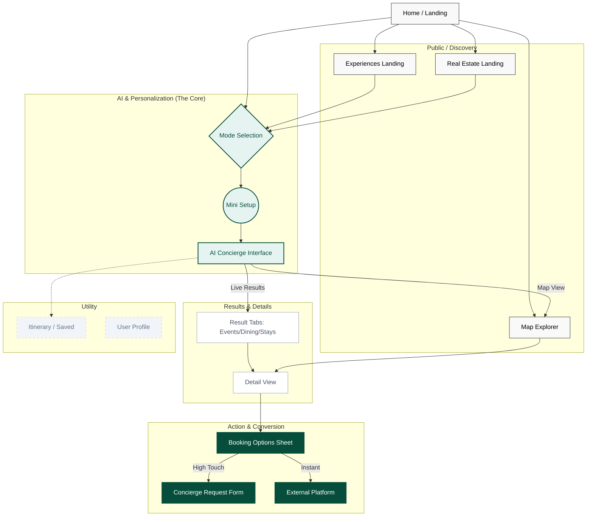

# Sitemap & User Flow Architecture
**Product:** I Love Medellín — Luxury AI Concierge  
**Role:** Senior UX Architect  
**Date:** December 17, 2025  

## Strategic Overview
This sitemap deviates from traditional SaaS hierarchies. Instead of a deep tree structure, it utilizes a **Hub-and-Spoke** model where the `AI Concierge` acts as the central operating system. Users may enter through traditional "Discovery" pages (SEO) but are funnelled into the "Concierge" for personalization and transaction.

---

## 1. High-Level Visual Sitemap
This diagram illustrates the structural hierarchy and navigation paths.

---

## 2. Core User Flow (The "Golden Path")
The primary interaction model: **Discover → Decide → Book**.

```mermaid
sequenceDiagram
    participant User
    participant Home
    participant Mode as Mode Selection
    participant AI as AI Concierge
    participant Detail
    participant Booking

    User->>Home: Lands on platform
    User->>Mode: Clicks "Ask Concierge" / CTA
    
    rect rgb(240, 253, 244)
        Note over Mode, AI: The "Mini-Wizard" Phase
        Mode->>User: "How can I help?" (Dining, Stays, Events)
        User->>Mode: Selects "Dining"
        Mode->>AI: Activates Context
        AI->>User: "Any specific cuisine or vibe?" (Mini Qs)
        User->>AI: "Rooftop, Modern Colombian"
    end

    rect rgb(255, 255, 255)
        Note over AI, Detail: Discovery Phase
        AI->>User: Shows Split View (Chat + Results Cards)
        User->>Detail: Clicks "La Deriva" Card
        Detail->>User: Views Photos, Menu, Vibe
    end

    rect rgb(6, 78, 59)
        Note over Detail, Booking: Conversion Phase
        User->>Booking: Clicks "Reserve Table"
        Booking->>User: Choices: "Book via WhatsApp" or "OpenTable"
    end
```

---

## 3. Page Inventory & Purpose

### Public / Discovery Layer
*Designed for SEO entry and casual browsing.*
- **`/` (Home):** Editorial landing. Hooks the user with "Why Us" and drives them to the AI Concierge.
- **`/experiences/medellin`:** A visual catalog of categories (Nightlife, Gastronomy, Culture).
- **`/map`:** The Map Explorer. Allows geospatial discovery independent of the chat.
- **`/real-estate`:** Dedicated landing for high-ticket property rentals/sales.

### The AI Engine (Restricted)
*The core application experience.*
- **`/concierge`:** The main single-page application (SPA) view.
    - **State: Empty:** Triggers `<ModeSelection />`.
    - **State: Active:** Split screen. Left = Chat (`<AIConcierge />`), Right = Results/Map.
    - **Overlay:** `<ConciergeOverlay />` (for quick access from other pages).

### Detail Views (Dynamic Routes)
*Where the decision happens.*
- **`/experiences/:id`:** Events and Tours. Focus on timing, price, and "Vibe Check".
- **`/restaurants/:id`:** Dining. Focus on cuisine, reservations, and dress code.
- **`/rentals/:id`:** Properties. Focus on amenities, rooms, and location.

### Transaction Layer (Modals/Actions)
*Conversion points.*
- **Booking Sheet:** A bottom sheet (mobile) or modal (desktop) presenting options.
- **Concierge Request Form:** For high-touch/high-value requests (e.g., "Plan my whole weekend").
- **External Redirect:** Direct links to Fever, OpenTable, or Airbnb when applicable.

### Utility & Profile
- **`/itinerary`:** A timeline view of saved/booked items.
- **`/profile`:** User preferences and past chat history.
- **Login/Auth:** Handled via Supabase Auth UI (Modal).

---

## 4. Internal (Ops Only)
*Not visible to standard users.*
- **`/admin/dashboard`:** Metrics (Active chats, conversion rates).
- **`/admin/requests`:** Inbox for "Concierge Request Forms".
- **`/admin/logs`:** AI Chat logs for quality assurance.
