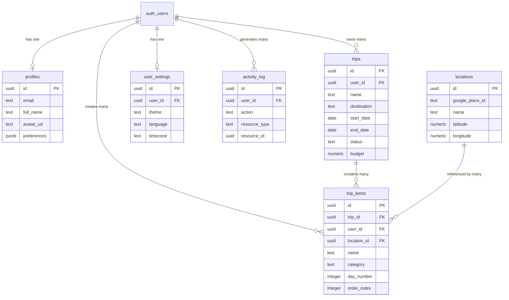

# Stage 1 — Core Schema

**Stage:** 1 of 5  
**Purpose:** Foundational database structure for MVP  
**Timeline:** Week 1-2  
**Dependencies:** None  
**Status:** 🔴 Required for MVP

---

## Overview

The Core Schema provides the **minimum viable database structure** needed to ship the Trip Operating System. It includes user profiles, trips, itineraries, basic location data, and user preferences.

**This stage must be deployed first.** All other stages depend on it.

**Tables:** 6  
**Estimated rows (10K users, 1 year):** ~560K  
**Storage:** ~250 MB

---

## Tables

### profiles
**Purpose:** Extended user information beyond auth.users

**Schema:**
```sql
create table public.profiles (
  id uuid primary key references auth.users(id) on delete cascade,
  email text unique not null,
  full_name text,
  avatar_url text,
  preferences jsonb default '{}'::jsonb,
  created_at timestamptz default now(),
  updated_at timestamptz default now()
);
```

**Fields:**
- `id` - References auth.users (one-to-one)
- `email` - Cached from auth for convenience
- `full_name` - Display name
- `avatar_url` - Link to storage bucket
- `preferences` - User settings (theme, notifications, etc.)

**Indexes:**
```sql
create index idx_profiles_email on public.profiles(email);
```

---

### trips
**Purpose:** Core trip entity

**Schema:**
```sql
create table public.trips (
  id uuid primary key default gen_random_uuid(),
  user_id uuid not null references auth.users(id) on delete cascade,
  name text not null,
  destination text,
  description text,
  start_date date,
  end_date date,
  status text not null default 'planning' check (status in ('planning', 'booked', 'in_progress', 'completed', 'cancelled', 'archived')),
  budget numeric(10, 2),
  currency text default 'USD',
  travelers integer default 1 check (travelers > 0),
  cover_image_url text,
  metadata jsonb default '{}'::jsonb,
  created_at timestamptz default now(),
  updated_at timestamptz default now()
);
```

**Fields:**
- `user_id` - Trip owner
- `name` - Trip title
- `destination` - Primary destination
- `description` - Trip notes
- `start_date` / `end_date` - Trip dates
- `status` - Workflow state
- `budget` / `currency` - Budget tracking
- `travelers` - Number of people
- `metadata` - Flexible data (weather, timezone, etc.)

**Indexes:**
```sql
create index idx_trips_user_id on public.trips(user_id);
create index idx_trips_status on public.trips(status);
create index idx_trips_user_status on public.trips(user_id, status);
create index idx_trips_dates on public.trips(start_date, end_date);
```

---

### trip_items
**Purpose:** Itinerary items (places, activities, etc.)

**Schema:**
```sql
create table public.trip_items (
  id uuid primary key default gen_random_uuid(),
  trip_id uuid not null references public.trips(id) on delete cascade,
  user_id uuid not null references auth.users(id) on delete cascade,
  name text not null,
  category text not null default 'other' check (category in ('accommodation', 'activity', 'restaurant', 'transport', 'flight', 'other')),
  description text,
  day_number integer check (day_number > 0),
  start_time time,
  end_time time,
  duration_minutes integer,
  order_index integer not null default 0,
  price numeric(10, 2),
  currency text default 'USD',
  booking_status text default 'not_booked' check (booking_status in ('not_booked', 'pending', 'confirmed', 'cancelled')),
  booking_reference text,
  location_id uuid references public.locations(id) on delete set null,
  address text,
  latitude numeric(10, 8),
  longitude numeric(11, 8),
  website_url text,
  phone text,
  notes text,
  metadata jsonb default '{}'::jsonb,
  created_at timestamptz default now(),
  updated_at timestamptz default now()
);
```

**Fields:**
- `trip_id` - Parent trip
- `user_id` - Item creator (for multi-user trips)
- `category` - Item type
- `day_number` - Which day of trip (1-indexed)
- `start_time` / `end_time` - Scheduled times
- `order_index` - Display order within day
- `location_id` - Optional link to locations table
- `latitude` / `longitude` - GPS coordinates
- `booking_status` - Reservation state
- `metadata` - Additional data (confirmations, etc.)

**Indexes:**
```sql
create index idx_trip_items_trip_id on public.trip_items(trip_id);
create index idx_trip_items_user_id on public.trip_items(user_id);
create index idx_trip_items_location_id on public.trip_items(location_id);
create index idx_trip_items_itinerary on public.trip_items(trip_id, day_number, order_index);
create index idx_trip_items_category on public.trip_items(category);
```

---

### locations
**Purpose:** Reusable place database (restaurants, hotels, attractions)

**Schema:**
```sql
create table public.locations (
  id uuid primary key default gen_random_uuid(),
  google_place_id text unique,
  name text not null,
  category text not null default 'other' check (category in ('accommodation', 'restaurant', 'attraction', 'transport', 'shopping', 'other')),
  address text,
  city text,
  country text,
  latitude numeric(10, 8) not null,
  longitude numeric(11, 8) not null,
  rating numeric(2, 1) check (rating >= 0 and rating <= 5),
  price_level integer check (price_level >= 1 and price_level <= 4),
  phone text,
  website_url text,
  opening_hours jsonb,
  photos jsonb default '[]'::jsonb,
  metadata jsonb default '{}'::jsonb,
  created_at timestamptz default now(),
  updated_at timestamptz default now()
);
```

**Fields:**
- `google_place_id` - Google Maps reference (if applicable)
- `name` - Place name
- `category` - Place type
- `latitude` / `longitude` - GPS coordinates (required)
- `rating` - 0-5 stars
- `price_level` - 1-4 ($-$$$$)
- `opening_hours` - Structured hours
- `photos` - Array of image URLs

**Indexes:**
```sql
create index idx_locations_google_place_id on public.locations(google_place_id);
create index idx_locations_category on public.locations(category);
create index idx_locations_coords on public.locations(latitude, longitude);
create index idx_locations_city on public.locations(city);
```

---

### user_settings
**Purpose:** Per-user application preferences

**Schema:**
```sql
create table public.user_settings (
  id uuid primary key default gen_random_uuid(),
  user_id uuid unique not null references auth.users(id) on delete cascade,
  theme text default 'light' check (theme in ('light', 'dark', 'system')),
  language text default 'en',
  timezone text default 'UTC',
  currency text default 'USD',
  distance_unit text default 'km' check (distance_unit in ('km', 'mi')),
  notifications_enabled boolean default true,
  email_notifications boolean default true,
  push_notifications boolean default true,
  created_at timestamptz default now(),
  updated_at timestamptz default now()
);
```

**Fields:**
- `user_id` - One-to-one with users
- `theme` - UI theme preference
- `language` - Preferred language
- `timezone` - User timezone
- `currency` - Default currency
- `distance_unit` - Metric vs imperial
- `notifications_enabled` - Master switch
- `email_notifications` / `push_notifications` - Channel toggles

**Indexes:**
```sql
create index idx_user_settings_user_id on public.user_settings(user_id);
```

---

### activity_log
**Purpose:** Audit trail for important user actions

**Schema:**
```sql
create table public.activity_log (
  id uuid primary key default gen_random_uuid(),
  user_id uuid not null references auth.users(id) on delete cascade,
  action text not null,
  resource_type text not null,
  resource_id uuid,
  metadata jsonb default '{}'::jsonb,
  ip_address inet,
  user_agent text,
  created_at timestamptz default now()
);
```

**Fields:**
- `user_id` - Who performed action
- `action` - What happened (e.g., 'created', 'updated', 'deleted')
- `resource_type` - Table name (e.g., 'trips', 'trip_items')
- `resource_id` - Affected record
- `metadata` - Additional context
- `ip_address` / `user_agent` - Client info

**Indexes:**
```sql
create index idx_activity_log_user_id on public.activity_log(user_id);
create index idx_activity_log_created_at on public.activity_log(created_at desc);
create index idx_activity_log_resource on public.activity_log(resource_type, resource_id);
```

---

## Relationships



**Key Relationships:**
- Users → Profiles (1:1)
- Users → Trips (1:N)
- Trips → Trip Items (1:N)
- Locations → Trip Items (1:N)
- Users → User Settings (1:1)
- Users → Activity Log (1:N)

---

## Indexes

### Primary Indexes (Automatic)
- All `id` columns (primary keys)
- All foreign key columns

### Custom Indexes

**Performance-critical:**
```sql
-- User's trips
create index idx_trips_user_id on public.trips(user_id);

-- User's active trips
create index idx_trips_user_status on public.trips(user_id, status);

-- Itinerary ordering
create index idx_trip_items_itinerary on public.trip_items(trip_id, day_number, order_index);

-- Location lookups
create index idx_locations_coords on public.locations(latitude, longitude);
```

**Query optimization:**
```sql
-- Time-based queries
create index idx_trips_dates on public.trips(start_date, end_date);
create index idx_activity_log_created_at on public.activity_log(created_at desc);

-- Category filters
create index idx_trip_items_category on public.trip_items(category);
create index idx_locations_category on public.locations(category);
```

---

## RLS Strategy

### Principle: **Users own their data**

All tables use RLS to ensure users can only access their own records.

### profiles

```sql
alter table public.profiles enable row level security;

create policy "Users can view their own profile"
  on public.profiles for select
  to authenticated
  using ( id = auth.uid() );

create policy "Users can update their own profile"
  on public.profiles for update
  to authenticated
  using ( id = auth.uid() )
  with check ( id = auth.uid() );

create policy "Users can insert their own profile"
  on public.profiles for insert
  to authenticated
  with check ( id = auth.uid() );
```

---

### trips

```sql
alter table public.trips enable row level security;

create policy "Users can view their own trips"
  on public.trips for select
  to authenticated
  using ( user_id = auth.uid() );

create policy "Users can create their own trips"
  on public.trips for insert
  to authenticated
  with check ( user_id = auth.uid() );

create policy "Users can update their own trips"
  on public.trips for update
  to authenticated
  using ( user_id = auth.uid() )
  with check ( user_id = auth.uid() );

create policy "Users can delete their own trips"
  on public.trips for delete
  to authenticated
  using ( user_id = auth.uid() );
```

---

### trip_items

```sql
alter table public.trip_items enable row level security;

create policy "Users can view items from their trips"
  on public.trip_items for select
  to authenticated
  using (
    trip_id in (
      select id from public.trips where user_id = auth.uid()
    )
  );

create policy "Users can create items for their trips"
  on public.trip_items for insert
  to authenticated
  with check (
    trip_id in (
      select id from public.trips where user_id = auth.uid()
    )
  );

create policy "Users can update items from their trips"
  on public.trip_items for update
  to authenticated
  using (
    trip_id in (
      select id from public.trips where user_id = auth.uid()
    )
  )
  with check (
    trip_id in (
      select id from public.trips where user_id = auth.uid()
    )
  );

create policy "Users can delete items from their trips"
  on public.trip_items for delete
  to authenticated
  using (
    trip_id in (
      select id from public.trips where user_id = auth.uid()
    )
  );
```

---

### locations

```sql
alter table public.locations enable row level security;

-- Locations are globally readable (public place database)
create policy "Anyone can view locations"
  on public.locations for select
  to authenticated
  using ( true );

-- Only service role can insert/update locations
-- (via Edge Functions that pull from Google Maps)
```

---

### user_settings

```sql
alter table public.user_settings enable row level security;

create policy "Users can view their own settings"
  on public.user_settings for select
  to authenticated
  using ( user_id = auth.uid() );

create policy "Users can update their own settings"
  on public.user_settings for update
  to authenticated
  using ( user_id = auth.uid() )
  with check ( user_id = auth.uid() );

create policy "Users can insert their own settings"
  on public.user_settings for insert
  to authenticated
  with check ( user_id = auth.uid() );
```

---

### activity_log

```sql
alter table public.activity_log enable row level security;

create policy "Users can view their own activity"
  on public.activity_log for select
  to authenticated
  using ( user_id = auth.uid() );

-- Insert only via database triggers or service role
```

---

## Edge Functions

**Stage 1 requires NO Edge Functions.**

All operations can be performed directly via Supabase client with RLS.

**Potential future enhancements:**
- `fetch-google-place` - Populate locations table
- `optimize-trip-route` - Reorder itinerary items

---

## Realtime Usage

### Enabled Tables

**trips:**
```sql
alter publication supabase_realtime add table public.trips;
```

**Purpose:** Real-time updates when trip details change (useful for future collaboration)

---

**trip_items:**
```sql
alter publication supabase_realtime add table public.trip_items;
```

**Purpose:** Live itinerary updates when items are added/reordered

---

### Client Subscription Example

```typescript
// Subscribe to user's trips
const tripsSubscription = supabase
  .channel('user-trips')
  .on(
    'postgres_changes',
    {
      event: '*',
      schema: 'public',
      table: 'trips',
      filter: `user_id=eq.${userId}`
    },
    (payload) => {
      console.log('Trip changed:', payload);
    }
  )
  .subscribe();

// Subscribe to trip items
const itemsSubscription = supabase
  .channel('trip-items')
  .on(
    'postgres_changes',
    {
      event: '*',
      schema: 'public',
      table: 'trip_items',
      filter: `trip_id=eq.${tripId}`
    },
    (payload) => {
      console.log('Item changed:', payload);
    }
  )
  .subscribe();
```

---

## Storage Usage

### Buckets

**user-avatars:**
```sql
insert into storage.buckets (id, name, public)
values ('user-avatars', 'user-avatars', true);
```

**RLS:**
```sql
create policy "Users can upload their own avatar"
  on storage.objects for insert
  to authenticated
  with check (
    bucket_id = 'user-avatars' and
    (storage.foldername(name))[1] = auth.uid()::text
  );

create policy "Anyone can view avatars"
  on storage.objects for select
  to authenticated
  using ( bucket_id = 'user-avatars' );

create policy "Users can update their own avatar"
  on storage.objects for update
  to authenticated
  using (
    bucket_id = 'user-avatars' and
    (storage.foldername(name))[1] = auth.uid()::text
  );
```

---

**trip-images:**
```sql
insert into storage.buckets (id, name, public)
values ('trip-images', 'trip-images', false);
```

**RLS:**
```sql
create policy "Users can upload to their trips"
  on storage.objects for insert
  to authenticated
  with check (
    bucket_id = 'trip-images' and
    (storage.foldername(name))[1] in (
      select id::text from public.trips where user_id = auth.uid()
    )
  );

create policy "Users can view their trip images"
  on storage.objects for select
  to authenticated
  using (
    bucket_id = 'trip-images' and
    (storage.foldername(name))[1] in (
      select id::text from public.trips where user_id = auth.uid()
    )
  );
```

---

## Migration Notes

### Initial Setup

**Step 1: Create schema files**

File: `supabase/schemas/001_core_tables.sql`
```sql
-- profiles
create table public.profiles (...);

-- trips
create table public.trips (...);

-- trip_items
create table public.trip_items (...);

-- locations
create table public.locations (...);

-- user_settings
create table public.user_settings (...);

-- activity_log
create table public.activity_log (...);
```

File: `supabase/schemas/002_core_indexes.sql`
```sql
-- All index definitions
create index idx_trips_user_id on public.trips(user_id);
-- ... etc
```

File: `supabase/schemas/003_core_rls.sql`
```sql
-- All RLS policies
alter table public.profiles enable row level security;
create policy "Users can view their own profile" ...;
-- ... etc
```

---

### Step 2: Generate migration

```bash
supabase stop
supabase db diff -f core_schema_v1
supabase start
```

---

### Step 3: Verify

```sql
-- Check tables
select table_name from information_schema.tables
where table_schema = 'public';

-- Check RLS
select tablename, rowsecurity
from pg_tables
where schemaname = 'public';

-- Check policies
select schemaname, tablename, policyname
from pg_policies
where schemaname = 'public';
```

---

### Step 4: Seed data (optional)

```sql
-- Create test user profile
insert into public.profiles (id, email, full_name)
values (auth.uid(), 'test@example.com', 'Test User');

-- Create test trip
insert into public.trips (user_id, name, destination, status)
values (auth.uid(), 'Paris Vacation', 'Paris, France', 'planning');
```

---

## Database Functions

### Auto-update updated_at

```sql
create or replace function public.update_updated_at_column()
returns trigger
language plpgsql
security invoker
set search_path = ''
as $$
begin
  new.updated_at = now();
  return new;
end;
$$;

-- Apply to all tables
create trigger update_profiles_updated_at
  before update on public.profiles
  for each row execute function public.update_updated_at_column();

create trigger update_trips_updated_at
  before update on public.trips
  for each row execute function public.update_updated_at_column();

create trigger update_trip_items_updated_at
  before update on public.trip_items
  for each row execute function public.update_updated_at_column();

create trigger update_locations_updated_at
  before update on public.locations
  for each row execute function public.update_updated_at_column();

create trigger update_user_settings_updated_at
  before update on public.user_settings
  for each row execute function public.update_updated_at_column();
```

---

### Auto-create user profile

```sql
create or replace function public.handle_new_user()
returns trigger
language plpgsql
security definer
set search_path = ''
as $$
begin
  insert into public.profiles (id, email, full_name, avatar_url)
  values (
    new.id,
    new.email,
    new.raw_user_meta_data->>'full_name',
    new.raw_user_meta_data->>'avatar_url'
  );
  
  insert into public.user_settings (user_id)
  values (new.id);
  
  return new;
end;
$$;

create trigger on_auth_user_created
  after insert on auth.users
  for each row execute function public.handle_new_user();
```

---

## Testing Checklist

### Schema Tests
- [ ] All tables created
- [ ] Foreign keys enforced
- [ ] Check constraints work
- [ ] Default values set
- [ ] Indexes exist

### RLS Tests
- [ ] Users can't see other users' data
- [ ] Users can create their own records
- [ ] Users can update their own records
- [ ] Users can delete their own records
- [ ] Unauthenticated users blocked

### Function Tests
- [ ] updated_at auto-updates
- [ ] Profile created on signup
- [ ] Settings created on signup

### Performance Tests
- [ ] Queries use indexes (EXPLAIN ANALYZE)
- [ ] No N+1 queries
- [ ] Joins optimized

---

## 🔗 Related Documentation

- **[Stage 2 - Advanced Schema](/docs/supabase/schema/02-advanced-schema.md)**
- **[Creating Migrations](/docs/supabase/03-creating-migrations.md)**
- **[Creating RLS Policies](/docs/supabase/04-creating-rls-policies.md)**

---

**Status:** ✅ Ready for implementation  
**Dependencies:** None  
**Next Stage:** Advanced Features (Stage 2)
