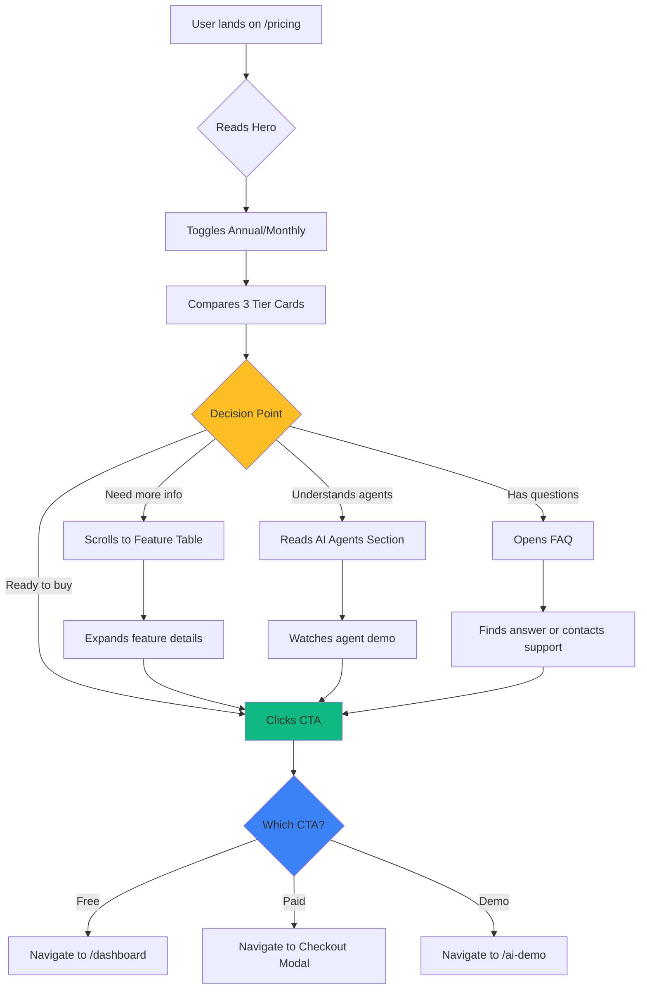

# 01 — Pricing Page: Luxury SaaS Pricing with AI Agent Tiers

**Status:** 🔴 Not Started (0%)  
**Priority:** High  
**Estimated Lines:** 500-700 (Page + Components)  
**Route:** `/pricing`  
**Dependencies:** None

---

## 📊 Overview

Create a stunning, conversion-optimized pricing page that showcases the AI-powered Trip Operating System with three tiers: Explorer (Free), Curator ($29/mo), and Concierge ($79/mo). The page should feel premium, intelligent, and clearly communicate value through AI agent capabilities.

---

## 🎨 Design Philosophy

**Visual Identity:**
- Luxury tier cards with glassmorphism and subtle gradients
- Premium dark mode toggle
- Animated feature comparisons
- Interactive AI agent indicators showing which agents are included
- Scroll-triggered animations for engagement
- Mobile-first responsive design with tablet and desktop optimizations

**Color Palette:**
- Primary: Emerald 800-900 (luxury green)
- Secondary: Slate 50-900 (sophistication)
- Accent: Amber 400-600 (premium highlights)
- Success: Emerald 500
- Premium: Gold gradient (#FFD700 to #FFA500)

---

## 📐 Page Structure & Wireframe

```
┌─────────────────────────────────────────────────┐
│  HERO SECTION                                   │
│  ├─ Tagline: "Choose Your Intelligence Level"  │
│  ├─ Subtitle: AI agents that work for you      │
│  └─ Annual/Monthly Toggle (15% savings badge)  │
├─────────────────────────────────────────────────┤
│  PRICING CARDS (3-Column Grid)                  │
│  ├─ EXPLORER (Free)                             │
│  │   ├─ Icon: Compass                           │
│  │   ├─ Price: $0/month                         │
│  │   ├─ 2 AI Agents included                    │
│  │   ├─ Feature list (8 items)                  │
│  │   └─ CTA: "Start Free"                       │
│  ├─ CURATOR (Most Popular Badge)                │
│  │   ├─ Icon: Sparkles (animated)               │
│  │   ├─ Price: $29/month                        │
│  │   ├─ 4 AI Agents included                    │
│  │   ├─ Feature list (12 items)                 │
│  │   ├─ Popular glow effect                     │
│  │   └─ CTA: "Start 14-Day Trial"               │
│  └─ CONCIERGE (Premium)                         │
│      ├─ Icon: Crown (gold)                      │
│      ├─ Price: $79/month                        │
│      ├─ All 6 AI Agents + Priority              │
│      ├─ Feature list (15 items)                 │
│      ├─ Premium border gradient                 │
│      └─ CTA: "Get Concierge Access"             │
├─────────────────────────────────────────────────┤
│  FEATURE COMPARISON TABLE                       │
│  ├─ Sticky header with plan names               │
│  ├─ Categories: AI Agents, Trip Planning,       │
│  │   Booking, Collaboration, Support            │
│  ├─ Checkmarks with animations on scroll        │
│  └─ Expandable rows for details                 │
├─────────────────────────────────────────────────┤
│  AI AGENTS SHOWCASE                              │
│  ├─ Visual cards for each agent                 │
│  ├─ Shows which tier unlocks each agent         │
│  ├─ Animated icons + descriptions               │
│  └─ "See Agent in Action" demo links            │
├─────────────────────────────────────────────────┤
│  FAQ SECTION                                     │
│  ├─ Accordion with 8-10 common questions        │
│  ├─ Smooth expand/collapse animations           │
│  └─ "Still have questions? Chat with AI"        │
├─────────────────────────────────────────────────┤
│  SOCIAL PROOF                                    │
│  ├─ Testimonials slider (3 reviews)             │
│  ├─ Trust badges (Secure, 14-day trial, etc)    │
│  └─ Usage stats (2,000+ travelers, etc)         │
├─────────────────────────────────────────────────┤
│  FINAL CTA                                       │
│  ├─ Dark section with gradient background       │
│  ├─ "Ready to upgrade your travel planning?"    │
│  ├─ Dual CTAs: Start Free / See Demo            │
│  └─ No credit card required badge               │
└─────────────────────────────────────────────────┘
```

---

## 🔄 User Journey Flow



---

## 🎯 Pricing Tiers Definition

### Explorer (Free Tier)
**Target Audience:** Solo travelers, first-time users, budget planners

**Pricing:**
- $0/month
- Forever free

**AI Agents Included:**
- ✅ Local Scout (basic)
- ✅ Dining Orchestrator (basic)

**Features:**
- ✓ Create up to 3 trips
- ✓ Basic AI recommendations
- ✓ Manual itinerary building
- ✓ Mobile app access
- ✓ Community support
- ✓ Export to PDF
- ✗ Advanced AI optimization
- ✗ Real-time collaboration
- ✗ Priority booking
- ✗ Budget tracking

**CTA:** "Start Free" → Routes to `/dashboard` with signup prompt

---

### Curator ($29/month) — MOST POPULAR
**Target Audience:** Regular travelers, couples, small groups

**Pricing:**
- $29/month (billed monthly)
- $24/month (billed annually, save 17%)

**AI Agents Included:**
- ✅ Local Scout (advanced)
- ✅ Dining Orchestrator (advanced)
- ✅ Itinerary Optimizer
- ✅ Budget Guardian

**Features:**
- ✓ Unlimited trips
- ✓ Advanced AI recommendations
- ✓ Automatic route optimization
- ✓ Real-time budget tracking
- ✓ Conflict detection
- ✓ Collaboration for up to 4 people
- ✓ Priority email support
- ✓ Export to PDF, JSON, Calendar
- ✓ Mobile notifications
- ✗ Booking Assistant automation
- ✗ Event Curator
- ✗ Priority phone support
- ✗ Dedicated account manager

**Badge:** "Most Popular" (emerald badge, animated pulse)

**CTA:** "Start 14-Day Trial" → Routes to checkout with trial

---

### Concierge ($79/month) — PREMIUM
**Target Audience:** Luxury travelers, travel agencies, corporate

**Pricing:**
- $79/month (billed monthly)
- $67/month (billed annually, save 15%)

**AI Agents Included:**
- ✅ All 6 AI Agents
  - Local Scout (premium)
  - Dining Orchestrator (premium)
  - Itinerary Optimizer (premium)
  - Budget Guardian (premium)
  - Booking Assistant
  - Event Curator

**Features:**
- ✓ Everything in Curator, plus:
- ✓ Automated booking management
- ✓ Price monitoring & alerts
- ✓ Exclusive event access
- ✓ White-glove concierge chat
- ✓ Unlimited collaboration
- ✓ API access for integrations
- ✓ Priority phone + chat support
- ✓ Dedicated account manager
- ✓ Custom trip templates
- ✓ Advanced analytics dashboard

**Badge:** "Premium" (gold gradient badge with crown icon)

**CTA:** "Get Concierge Access" → Routes to checkout, no trial

---

## 🧩 Component Breakdown

### 1. PricingHero Component
**File:** `/components/pricing/PricingHero.tsx`

**Features:**
- Animated headline with gradient text
- Billing toggle (Monthly/Annual) with savings badge
- Subtle mesh gradient background
- Scroll indicator

**Props:**
```typescript
interface PricingHeroProps {
  billingCycle: 'monthly' | 'annual';
  onToggleBilling: () => void;
}
```

---

### 2. PricingCard Component
**File:** `/components/pricing/PricingCard.tsx`

**Features:**
- Glass card with backdrop blur
- Tier icon animation on hover
- Feature list with checkmarks
- CTA button with hover effects
- Badge for "Most Popular" or "Premium"
- Price animation when toggling billing cycle

**Props:**
```typescript
interface PricingCardProps {
  tier: 'explorer' | 'curator' | 'concierge';
  title: string;
  price: {
    monthly: number;
    annual: number;
  };
  icon: React.ReactNode;
  badge?: string;
  features: {
    included: string[];
    excluded?: string[];
  };
  agentCount: number;
  ctaText: string;
  ctaLink: string;
  isPopular?: boolean;
  isPremium?: boolean;
}
```

**Visual States:**
- Default: White card, subtle shadow
- Popular: Emerald glow, scale 1.05, "Most Popular" badge
- Premium: Gold border gradient, crown icon, premium shine effect

---

### 3. FeatureComparisonTable Component
**File:** `/components/pricing/FeatureComparisonTable.tsx`

**Features:**
- Sticky header on scroll
- Category groupings (collapsible on mobile)
- Animated checkmarks on scroll into view
- Tooltip for feature explanations
- Responsive: horizontal scroll on mobile, full table on desktop

**Structure:**
```typescript
interface ComparisonFeature {
  category: 'AI Agents' | 'Trip Planning' | 'Booking' | 'Collaboration' | 'Support';
  name: string;
  description: string;
  explorer: boolean | string;
  curator: boolean | string;
  concierge: boolean | string;
}
```

**Categories:**
1. **AI Agents:**
   - Local Scout
   - Dining Orchestrator
   - Itinerary Optimizer
   - Budget Guardian
   - Booking Assistant
   - Event Curator

2. **Trip Planning:**
   - Number of trips
   - AI recommendations
   - Route optimization
   - Conflict detection
   - Real-time collaboration
   - Custom templates

3. **Booking & Reservations:**
   - Manual booking links
   - Price monitoring
   - Automated booking
   - Waitlist management

4. **Data & Export:**
   - PDF export
   - JSON export
   - Calendar sync
   - API access

5. **Support:**
   - Community forum
   - Email support
   - Priority support
   - Phone support
   - Dedicated manager

---

### 4. AIAgentsShowcase Component
**File:** `/components/pricing/AIAgentsShowcase.tsx`

**Features:**
- 6 agent cards in 2-row grid (3 columns)
- Each card shows:
  - Agent icon (animated)
  - Agent name
  - One-line description
  - Which tier unlocks it (badge)
  - "See in Action" demo link
- Staggered animation on scroll

**Agent Data:**
```typescript
const agents = [
  {
    id: 'local-scout',
    name: 'Local Scout',
    icon: <Compass />,
    description: 'Discovers hidden gems and local events',
    demoLink: '/ai-demo?agent=local-scout',
    availableIn: ['explorer', 'curator', 'concierge']
  },
  {
    id: 'dining-orchestrator',
    name: 'Dining Orchestrator',
    icon: <Utensils />,
    description: 'Finds perfect restaurants matching your taste',
    demoLink: '/ai-demo?agent=dining',
    availableIn: ['explorer', 'curator', 'concierge']
  },
  {
    id: 'itinerary-optimizer',
    name: 'Itinerary Optimizer',
    icon: <Route />,
    description: 'Optimizes routes and saves travel time',
    demoLink: '/ai-demo?agent=optimizer',
    availableIn: ['curator', 'concierge']
  },
  {
    id: 'budget-guardian',
    name: 'Budget Guardian',
    icon: <DollarSign />,
    description: 'Tracks spending and finds savings',
    demoLink: '/ai-demo?agent=budget',
    availableIn: ['curator', 'concierge']
  },
  {
    id: 'booking-assistant',
    name: 'Booking Assistant',
    icon: <Calendar />,
    description: 'Automates reservations and monitors prices',
    demoLink: '/ai-demo?agent=booking',
    availableIn: ['concierge']
  },
  {
    id: 'event-curator',
    name: 'Event Curator',
    icon: <Ticket />,
    description: 'Finds exclusive events and experiences',
    demoLink: '/ai-demo?agent=events',
    availableIn: ['concierge']
  }
];
```

---

### 5. PricingFAQ Component
**File:** `/components/pricing/PricingFAQ.tsx`

**Features:**
- Accordion with smooth animations
- Icon rotates on expand
- Search filter (optional enhancement)
- "Still have questions?" CTA at bottom

**FAQ Content:**
```typescript
const faqs = [
  {
    question: 'What is the 14-day free trial?',
    answer: 'Try Curator or Concierge risk-free for 14 days. No credit card required. Cancel anytime.'
  },
  {
    question: 'Can I switch plans later?',
    answer: 'Yes! Upgrade or downgrade anytime. Your data stays with you, and pricing is prorated.'
  },
  {
    question: 'What are AI Agents?',
    answer: 'AI Agents are specialized assistants that handle specific tasks: finding restaurants, optimizing routes, tracking budgets, booking reservations, and more. Each tier unlocks more agents.'
  },
  {
    question: 'Do I need a credit card for the free plan?',
    answer: 'No. The Explorer plan is completely free forever. No credit card required.'
  },
  {
    question: 'How does billing work?',
    answer: 'You can pay monthly or annually. Annual plans save 15-17%. Billing happens automatically, and you can cancel anytime from your account settings.'
  },
  {
    question: 'Can I collaborate with friends on the free plan?',
    answer: 'The free plan is single-user. Curator allows up to 4 collaborators. Concierge has unlimited collaboration.'
  },
  {
    question: 'What payment methods do you accept?',
    answer: 'We accept all major credit cards (Visa, Mastercard, Amex, Discover) via Stripe.'
  },
  {
    question: 'Is my data secure?',
    answer: 'Yes. We use bank-level encryption (SSL/TLS), and all data is stored securely on Supabase. We never share your data with third parties.'
  },
  {
    question: 'What happens if I cancel?',
    answer: 'You can export all your trip data before canceling. Your account remains active until the end of your billing period.'
  },
  {
    question: 'Do you offer refunds?',
    answer: 'Yes. If you\'re not satisfied within the first 30 days, contact us for a full refund.'
  }
];
```

---

### 6. PricingSocialProof Component
**File:** `/components/pricing/PricingSocialProof.tsx`

**Features:**
- Testimonial carousel (auto-rotate every 5 seconds)
- Avatar, name, role, quote
- Star ratings
- Trust badges (Secure, 14-day trial, No CC required)

**Testimonials:**
```typescript
const testimonials = [
  {
    quote: 'The AI agents saved me 15+ hours of research. Worth every penny.',
    author: 'Sarah Chen',
    role: 'Digital Nomad',
    avatar: 'https://i.pravatar.cc/100?img=25',
    rating: 5,
    plan: 'curator'
  },
  {
    quote: 'Booking Assistant got me a reservation at a fully booked restaurant. Magic!',
    author: 'Marcus Johnson',
    role: 'Travel Blogger',
    avatar: 'https://i.pravatar.cc/100?img=32',
    rating: 5,
    plan: 'concierge'
  },
  {
    quote: 'Started with the free plan, upgraded to Curator after one trip. Game changer.',
    author: 'Elena Rodriguez',
    role: 'Frequent Traveler',
    avatar: 'https://i.pravatar.cc/100?img=47',
    rating: 5,
    plan: 'curator'
  }
];
```

---

### 7. PricingCTA Component
**File:** `/components/pricing/PricingCTA.tsx`

**Features:**
- Dark section (slate-900) with gradient overlay
- Large headline: "Ready to upgrade your travel planning?"
- Dual CTAs: "Start Free" (primary) and "See Demo" (secondary)
- "No credit card required" badge
- Scroll-triggered fade-in animation

---

## 🎨 Animations & Interactions

### Scroll Animations
```typescript
// All components use Framer Motion
import { motion, useInView } from 'motion/react';

// Fade up on scroll
const fadeUpVariant = {
  hidden: { opacity: 0, y: 30 },
  visible: { opacity: 1, y: 0 }
};

// Stagger children
const containerVariant = {
  hidden: { opacity: 0 },
  visible: {
    opacity: 1,
    transition: { staggerChildren: 0.1 }
  }
};
```

### Hover Effects
- **Cards:** Lift (translateY: -8px), shadow increase
- **CTAs:** Scale 1.05, glow effect
- **Features:** Checkmark color change, subtle pulse
- **Agent cards:** Icon rotation, background gradient shift

### Billing Toggle Animation
- Price numbers animate when toggling
- Savings badge pulses on annual selection
- Smooth color transition

---

## 📝 Content & Copywriting

### Hero Section
**Headline:** "Choose Your Intelligence Level"  
**Subtitle:** "AI agents that work for you — from free to full concierge"  
**Supporting Text:** "All plans include the core trip planner. Unlock more AI power as you grow."

### Section Headlines
- **Feature Table:** "Compare Every Feature"
- **AI Agents:** "Meet Your AI Travel Team"
- **FAQ:** "Questions? We've Got Answers."
- **Social Proof:** "Loved by 2,000+ Travelers"
- **Final CTA:** "Ready to Upgrade Your Travel Planning?"

### Microcopy
- Billing toggle: "Save 15% with annual billing"
- Free trial badge: "14 days free, then $X/month"
- No CC badge: "No credit card required"
- Money-back: "30-day money-back guarantee"

---

## 🔗 Routes & Links

### Primary Navigation
- From navbar: `/pricing` (add to main nav)
- From footer: `/pricing`
- From home CTA: `/pricing`
- From dashboard upgrade prompt: `/pricing?highlight=curator`

### CTAs Routing
- "Start Free" → `/dashboard` (with signup modal if not authenticated)
- "Start 14-Day Trial" → Checkout modal (Curator)
- "Get Concierge Access" → Checkout modal (Concierge)
- "See Demo" → `/ai-demo`
- Agent demo links → `/ai-demo?agent={id}`

### URL Parameters
- `?plan=curator` - Highlights Curator plan
- `?plan=concierge` - Highlights Concierge plan
- `?billing=annual` - Defaults to annual toggle
- `?highlight={plan}` - Adds glow effect to specific plan

---

## 🛠️ Implementation Prompts

### PROMPT 1: Create PricingPage.tsx Layout
```
Create /pages/Pricing.tsx with the following structure:

Import statements for all pricing components and icons from lucide-react.

State management:
- billingCycle: 'monthly' | 'annual' (default: 'monthly')
- highlightedPlan: string | null (from URL params)

Layout sections in order:
1. PricingHero with billing toggle
2. 3-column grid of PricingCard components
3. FeatureComparisonTable
4. AIAgentsShowcase
5. PricingFAQ
6. PricingSocialProof
7. PricingCTA

Add smooth scroll behavior and fade-in animations for each section.
Apply emerald-900/slate color scheme matching the existing design system.
Ensure mobile responsiveness with stacked cards on small screens.
```

### PROMPT 2: Create PricingCard Component
```
Create /components/pricing/PricingCard.tsx:

A glassmorphism card with:
- Backdrop blur and subtle white/10 background
- Conditional styling for isPopular (emerald glow) and isPremium (gold border gradient)
- Tier icon in a colored circle at top
- Badge for "Most Popular" or "Premium" (positioned absolutely, top-right)
- Large price display with animated number when billing cycle changes
- "per month" label with small "billed annually" note if applicable
- Agent count indicator with Sparkles icon
- Feature list with green checkmarks for included, gray X for excluded
- CTA button with appropriate styling per tier
- Hover effects: lift card, increase shadow, scale CTA button

Use Framer Motion for all animations.
Make the price number animate smoothly when billingCycle changes using AnimatePresence.
```

### PROMPT 3: Create FeatureComparisonTable Component
```
Create /components/pricing/FeatureComparisonTable.tsx:

Desktop layout:
- Sticky header with 4 columns: Feature | Explorer | Curator | Concierge
- Grouped by category (AI Agents, Trip Planning, Booking, Support)
- Category headers with background color
- Each row: feature name (with tooltip icon) | checkmark or text value for each plan
- Animate checkmarks on scroll into view (scale + opacity)

Mobile layout:
- Tabs for each plan (Explorer, Curator, Concierge)
- Show only selected plan's features in a list
- Toggle between plans with animated transition

Use Framer Motion useInView hook to trigger checkmark animations.
Add Tooltip component from shadcn/ui for feature descriptions.
Make header sticky on scroll (position: sticky, top: 0).
```

### PROMPT 4: Create AIAgentsShowcase Component
```
Create /components/pricing/AIAgentsShowcase.tsx:

Section with:
- Section heading: "Meet Your AI Travel Team"
- Subtitle: "Each agent specializes in a different aspect of travel planning"
- 2x3 grid of agent cards (3 columns on desktop, 2 on tablet, 1 on mobile)

Each card contains:
- Animated icon (rotate on hover)
- Agent name
- One-line description
- Availability badge showing which tiers include it
  - Badge colors: gray (Explorer), emerald (Curator), gold (Concierge)
- "See in Action" link → routes to /ai-demo with agent query param
- Card hover: lift, glow border matching tier color

Use staggered animation when cards scroll into view.
Icons from lucide-react: Compass, Utensils, Route, DollarSign, Calendar, Ticket
```

### PROMPT 5: Create PricingFAQ Component
```
Create /components/pricing/PricingFAQ.tsx:

Use Accordion component from shadcn/ui.

Features:
- Section heading: "Questions? We've Got Answers."
- 10 FAQ items in accordion format
- Smooth expand/collapse with rotating chevron icon
- Open one item at a time (type="single")
- Footer section: "Still have questions? Chat with our AI Concierge" with link to /concierge

Styling:
- White background cards with border
- Emerald text for active question
- Smooth height transition

Add to bottom:
- Button: "Chat with AI Concierge" → opens AI chat overlay
```

### PROMPT 6: Create PricingHero Component
```
Create /components/pricing/PricingHero.tsx:

Hero section with:
- Mesh gradient background (emerald-100/amber-100 blur)
- Centered content with max-w-4xl
- Badge: "Pricing" with Sparkles icon
- Large headline: "Choose Your Intelligence Level" (font-serif, text-5xl)
- Subtitle: "AI agents that work for you — from free to full concierge"
- Billing cycle toggle switch:
  - Monthly | Annual
  - "Save 15%" badge when annual selected
  - Animated switch with emerald background
  - Use Switch component from shadcn/ui
- Scroll indicator arrow at bottom (animate bounce)

All text should fade in with stagger effect.
```

### PROMPT 7: Create PricingSocialProof Component
```
Create /components/pricing/PricingSocialProof.tsx:

Section with:
- Carousel of 3 testimonials (auto-rotate every 5 seconds)
- Each testimonial card:
  - Large quote in serif font
  - 5-star rating (filled stars in amber)
  - Author avatar (circular image)
  - Author name and role
  - Small badge showing which plan they use
- Navigation dots below carousel
- Trust badges row:
  - "Secure Payment" with lock icon
  - "14-Day Free Trial" with calendar icon
  - "No Credit Card" with shield icon
  - "30-Day Refund" with checkmark icon

Use react-slick for carousel or build custom with Framer Motion AnimatePresence.
Auto-advance every 5 seconds with pause on hover.
```

### PROMPT 8: Create PricingCTA Component
```
Create /components/pricing/PricingCTA.tsx:

Dark section (bg-slate-900) with:
- Gradient overlay (radial gradient with emerald/30)
- Centered content (max-w-3xl)
- Icon: Zap in emerald-400
- Headline: "Ready to Upgrade Your Travel Planning?"
- Subtitle: "Start free and unlock AI agents as you grow. No credit card required."
- Dual CTA buttons:
  - Primary: "Start Free" → /dashboard
  - Secondary: "See Demo" → /ai-demo
- Small text: "No credit card required • 14-day free trial on paid plans"

Scroll-triggered fade-in animation.
Buttons should have strong hover effects (glow, scale).
```

### PROMPT 9: Add Pricing Route to App.tsx
```
Add pricing route to App.tsx:

Import: import Pricing from './pages/Pricing';

Add route in Routes component:
<Route path="/pricing" element={<Pricing />} />

Update navbar to include pricing link in navigation menu.
Add pricing link to footer.
```

### PROMPT 10: Create Checkout Modal (Future Enhancement)
```
Create /components/pricing/CheckoutModal.tsx:

Modal that opens when clicking paid plan CTAs.

Features:
- Plan summary (name, price, features)
- Billing cycle selector (if applicable)
- Payment form (Stripe elements placeholder)
- Promo code input
- Total calculation
- Terms acceptance checkbox
- "Subscribe" button

For now, use mock data and toast notification.
In production, integrate with Stripe Checkout.

Use Dialog component from shadcn/ui for modal.
```

---

## ✅ Acceptance Criteria

**Visual:**
- [ ] Page matches luxury design aesthetic (glassmorphism, gradients, animations)
- [ ] All 3 pricing tiers clearly differentiated
- [ ] "Most Popular" badge on Curator plan is prominent
- [ ] Responsive on mobile (320px), tablet (768px), desktop (1280px+)
- [ ] All icons animate on hover
- [ ] Scroll animations trigger at correct positions

**Functional:**
- [ ] Billing toggle switches between monthly/annual pricing
- [ ] All CTAs route to correct destinations
- [ ] FAQ accordion expands/collapses smoothly
- [ ] Feature comparison table is readable on mobile
- [ ] Agent showcase cards link to demo page with correct query params
- [ ] URL parameters (?plan=curator) highlight correct plan

**Content:**
- [ ] All pricing is accurate and matches business model
- [ ] Feature lists are comprehensive and correct per tier
- [ ] FAQ answers common objections
- [ ] Testimonials feel authentic
- [ ] Microcopy is clear and conversion-optimized

**Performance:**
- [ ] Page loads in under 2 seconds
- [ ] Animations are smooth (60fps)
- [ ] Images are optimized (WebP, lazy loading)
- [ ] No layout shift on load

---

## 🚀 Launch Checklist

- [ ] All components created and tested
- [ ] Route added to App.tsx
- [ ] Navigation links updated (navbar, footer)
- [ ] Mobile responsiveness verified on real devices
- [ ] Accessibility: keyboard navigation, screen reader labels
- [ ] SEO: meta tags, title, description
- [ ] Analytics tracking: page view, CTA clicks, plan selection
- [ ] A/B test variations documented (if applicable)

---

**Estimated Development Time:** 8-12 hours  
**Designer:** 3-4 hours for high-fidelity mockups  
**Developer:** 5-8 hours for implementation + testing  

**Dependencies:**
- None (can be built in parallel with other features)

**Related Docs:**
- Design system: `/docs/style-guide.md`
- Component library: `/components/ui/*`
