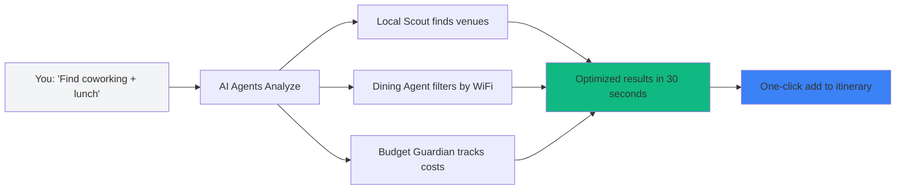
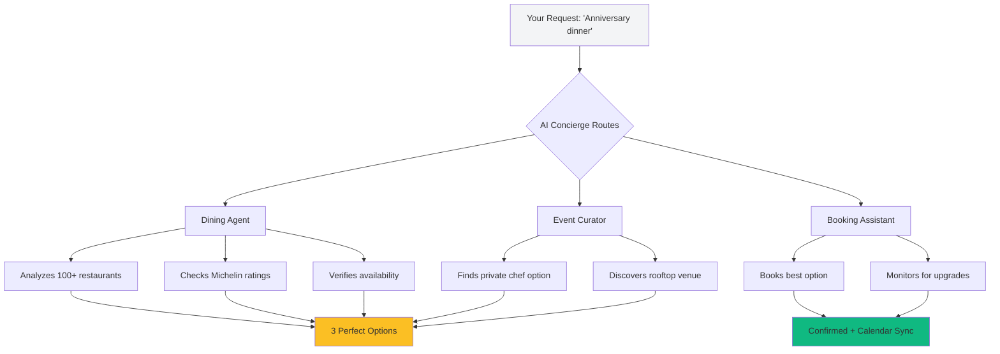
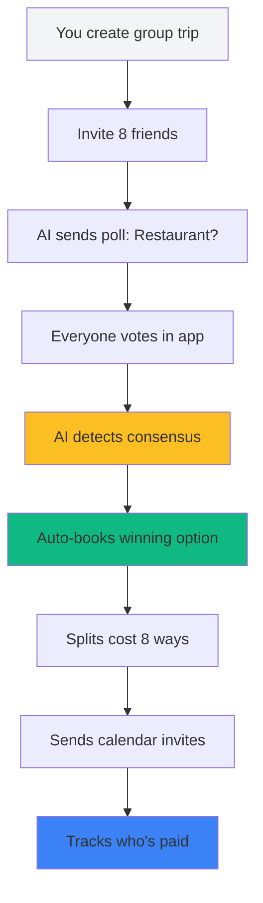

# 02 — Use Case Landing Pages: Targeted Journey Stories

**Status:** 🔴 Not Started (0%)  
**Priority:** Medium-High  
**Estimated Lines:** 600-800 per use case (3 pages total)  
**Routes:** `/use-cases/digital-nomad`, `/use-cases/luxury-traveler`, `/use-cases/group-trip`  
**Dependencies:** None

---

## 📊 Overview

Create three highly targeted landing pages that tell specific user journey stories. Each page demonstrates how the AI Trip Operating System solves real problems for different traveler personas. These pages serve as conversion funnels from ad campaigns, SEO, and social media.

---

## 🎯 Three Use Cases to Build

1. **Digital Nomad** — Solo traveler working remotely, needs flexibility
2. **Luxury Traveler** — High-end experiences, concierge-level service
3. **Group Trip Organizer** — Coordinating multiple people, split costs, consensus

Each use case gets its own dedicated landing page with:
- Hero section with persona-specific headline
- Problem/Solution storytelling
- AI Agent showcase (which agents solve this persona's problems)
- Visual journey flow (before/after comparison)
- Real-world example itinerary
- Testimonials from similar users
- Conversion CTA (personalized to use case)

---

## 🎨 Design Philosophy

**Visual Storytelling:**
- Illustrated journey cards showing user progression
- Before/After comparison sections
- Animated flowcharts showing AI automation
- Scroll-driven narrative (sections reveal as user scrolls)
- Persona-specific color accents

**Responsive Design:**
- Mobile-first with vertical storytelling
- Desktop expands to side-by-side comparisons
- Tablet optimized for reading flow

**Luxury Premium Aesthetic:**
- High-quality lifestyle photography
- Glassmorphism cards
- Smooth parallax effects
- Premium micro-interactions (hover glows, card lifts)

---

## 📐 Universal Page Structure (All Use Cases)

```
┌─────────────────────────────────────────────────┐
│  HERO SECTION                                   │
│  ├─ Persona badge (e.g., "For Digital Nomads") │
│  ├─ Problem-focused headline                    │
│  ├─ Lifestyle image (full-width, parallax)      │
│  ├─ One-line solution statement                 │
│  └─ Primary CTA: "See How It Works"             │
├─────────────────────────────────────────────────┤
│  PROBLEM STATEMENT                               │
│  ├─ "The Challenge" heading                     │
│  ├─ 3-column pain points (icons + text)         │
│  ├─ Relatable scenario story (2-3 sentences)    │
│  └─ Transition: "There's a better way →"        │
├─────────────────────────────────────────────────┤
│  SOLUTION SHOWCASE                               │
│  ├─ "How [Product] Helps" heading               │
│  ├─ Animated flowchart (User → AI → Result)     │
│  ├─ Key features grid (4 features)              │
│  └─ Live demo screenshot/video                  │
├─────────────────────────────────────────────────┤
│  AI AGENTS IN ACTION                             │
│  ├─ "Your AI Team" heading                      │
│  ├─ 2-3 agent cards relevant to persona         │
│  ├─ Each shows: How it helps this persona       │
│  └─ Interactive demo link                       │
├─────────────────────────────────────────────────┤
│  BEFORE/AFTER COMPARISON                         │
│  ├─ Split screen design                         │
│  ├─ LEFT: "Without AI" (pain, manual work)      │
│  ├─ RIGHT: "With AI" (automated, easy)          │
│  └─ Visual comparison with checkmarks/X marks   │
├─────────────────────────────────────────────────┤
│  REAL EXAMPLE ITINERARY                          │
│  ├─ "Sample 7-Day Trip" heading                 │
│  ├─ Carousel of day-by-day cards                │
│  ├─ Shows AI recommendations in action          │
│  └─ "Create Your Own" CTA                       │
├─────────────────────────────────────────────────┤
│  TESTIMONIAL SECTION                             │
│  ├─ Large quote from similar user               │
│  ├─ Avatar, name, persona label                 │
│  ├─ Star rating                                 │
│  └─ Link to more reviews                        │
├─────────────────────────────────────────────────┤
│  PRICING TEASER                                  │
│  ├─ Recommended plan for this persona           │
│  ├─ Key features highlighted                    │
│  ├─ Price + trial offer                         │
│  └─ CTA: "Start Free Trial"                     │
├─────────────────────────────────────────────────┤
│  FINAL CTA                                       │
│  ├─ Strong headline: "Ready to [outcome]?"      │
│  ├─ Dual CTAs: "Start Planning" / "See Pricing" │
│  └─ No CC required badge                        │
└─────────────────────────────────────────────────┘
```

---

## 🧑‍💻 Use Case 1: Digital Nomad

**Route:** `/use-cases/digital-nomad`  
**Target Persona:** Remote workers, 25-40 years old, budget-conscious, needs flexibility

### Hero Section
**Badge:** "For Digital Nomads"  
**Headline:** "Work from anywhere. Plan trips that fit your workflow."  
**Subheadline:** "AI that understands your schedule, budget, and need for fast WiFi."  
**Image:** Person working on laptop at a café overlooking Medellín cityscape  
**CTA:** "See How It Works" → Scrolls to solution section

### Problem Statement
**Heading:** "The Digital Nomad Challenge"

**Pain Points:**
1. **Time-Consuming Research**
   - Icon: Clock
   - "Spending evenings researching instead of exploring"

2. **Budget Uncertainty**
   - Icon: DollarSign
   - "Tracking expenses across currencies and platforms"

3. **Connectivity Anxiety**
   - Icon: Wifi
   - "Never knowing if your Airbnb has reliable internet"

**Scenario Story:**
"You've just landed in Medellín for a 3-month stay. Between client calls, you need to find coworking spaces, affordable eats, and weekend adventures. But every Google search leads to 47 open tabs and decision paralysis."

### Solution Showcase
**Heading:** "How I Love Medellín Helps Digital Nomads"

**Flowchart:**


**Key Features:**
1. **WiFi-First Filtering**
   - "Every venue shows internet speed ratings from real nomads"

2. **Budget Dashboard**
   - "Real-time spending tracker across all your bookings"

3. **Flexible Scheduling**
   - "Drag-and-drop itinerary that adjusts for work calls"

4. **Nomad Community**
   - "Connect with other remote workers in Medellín"

### AI Agents In Action
**Agents Highlighted:**
1. **Local Scout** → "Finds coworking spaces with fast WiFi and power outlets"
2. **Dining Orchestrator** → "Recommends cafés with laptop-friendly vibes"
3. **Budget Guardian** → "Tracks daily spend and alerts you to save money"

### Before/After Comparison

**WITHOUT AI:**
- ❌ 5+ hours researching coworking spaces
- ❌ Spreadsheets to track expenses
- ❌ Missed happy hour deals
- ❌ Overpaid for slow WiFi Airbnb
- ❌ Ate at touristy overpriced spots

**WITH AI:**
- ✅ 10 minutes to plan entire week
- ✅ Auto budget tracking
- ✅ Daily alerts for nomad events
- ✅ WiFi speed verified before booking
- ✅ Local spots with laptop seating

### Example Itinerary: "7-Day Nomad Welcome Week"
**Day 1:** Arrival + WiFi Setup
- Morning: Airport → Poblado Airbnb (WiFi: 100 Mbps verified)
- Afternoon: Coworking day pass at Selina (AI recommended)
- Evening: Welcome dinner at Mondongo's (budget-friendly, local)

**Day 2:** Work + Explore
- 9 AM - 2 PM: Deep work at Atom House coworking
- 2 PM: Lunch at Café Zorba (WiFi + healthy menu)
- 4 PM: Walking tour of Comuna 13 (AI suggested, $15)

**Day 3-5:** Work Week
- Daily coworking rotation (AI optimizes for variety)
- Budget lunches under $5 (tracked automatically)
- Evening language exchange (free event discovered by AI)

**Day 6:** Weekend Adventure
- Day trip to Guatapé (AI planned route + timing)
- All bookings done via AI assistant

**Day 7:** Recovery + Planning
- Café hopping (AI route optimized for 3 spots)
- Plan next 3 weeks with AI suggestions

**Total Cost:** $385 (AI saved $120 vs manual planning)

### Testimonial
**Quote:** "I used to spend Sunday evenings planning the week ahead. Now the AI does it in 10 minutes, and I actually enjoy my weekends."

**Author:** Jake Morrison  
**Role:** Software Engineer & Digital Nomad  
**Avatar:** Young professional working at a café  
**Rating:** ⭐⭐⭐⭐⭐  
**Plan:** Curator ($29/month)

### Pricing Teaser
**Recommended Plan:** Curator ($29/month)

**Why This Plan:**
- ✓ Unlimited trips (plan month-to-month)
- ✓ Budget Guardian for expense tracking
- ✓ WiFi ratings on all venues
- ✓ Coworking space database
- ✓ Nomad community events

**CTA:** "Start 14-Day Free Trial"

### Final CTA
**Headline:** "Ready to work from paradise?"  
**CTAs:**
- Primary: "Start Planning Your Nomad Life"
- Secondary: "Join 500+ Digital Nomads"

---

## 🥂 Use Case 2: Luxury Traveler

**Route:** `/use-cases/luxury-traveler`  
**Target Persona:** High-net-worth individuals, 35-65 years old, values time and experiences

### Hero Section
**Badge:** "For Luxury Travelers"  
**Headline:** "White-glove service. AI-powered precision."  
**Subheadline:** "Your personal concierge that never sleeps, never forgets, and always delivers."  
**Image:** Rooftop infinity pool overlooking Medellín at sunset  
**CTA:** "Experience Concierge-Level AI" → Scrolls to solution

### Problem Statement
**Heading:** "The Luxury Travel Challenge"

**Pain Points:**
1. **Time is Your Most Valuable Asset**
   - Icon: Clock
   - "Wasting hours coordinating reservations"

2. **Inconsistent Service Quality**
   - Icon: AlertCircle
   - "One bad restaurant ruins the entire trip"

3. **Missing Exclusive Experiences**
   - Icon: Lock
   - "Not knowing about private events and hidden gems"

**Scenario Story:**
"You're planning a milestone anniversary trip to Medellín. You want Michelin-quality dining, private tours, and seamless logistics. But you don't have time to vet 50 options or haggle with booking agents."

### Solution Showcase
**Heading:** "Your AI Concierge Team"

**Flowchart:**


**Key Features:**
1. **Curated Exclusivity**
   - "Only top 5% of venues make it into our recommendations"

2. **Automated Booking**
   - "AI handles reservations, confirmations, and reminders"

3. **Price Monitoring**
   - "Get alerts when better rates or upgrades are available"

4. **24/7 Concierge Chat**
   - "White-glove support whenever you need it"

### AI Agents In Action
**Agents Highlighted:**
1. **Dining Orchestrator (Premium)** → "Secures reservations at fully-booked restaurants"
2. **Event Curator** → "Finds private tastings, exclusive clubs, VIP access"
3. **Booking Assistant** → "Handles all coordination while you relax"

### Before/After Comparison

**WITHOUT AI:**
- ❌ 8+ hours calling restaurants
- ❌ Missed private wine tasting (didn't know it existed)
- ❌ Paid $200 for mediocre "tourist trap" dinner
- ❌ Spent trip coordinating logistics
- ❌ No concierge at boutique hotel

**WITH AI:**
- ✅ All reservations confirmed in 2 hours
- ✅ Private coffee farm tour (AI discovered it)
- ✅ Chef's table at El Cielo ($180, perfect)
- ✅ Itinerary managed automatically
- ✅ 24/7 AI concierge via chat

### Example Itinerary: "5-Day Luxury Escape"
**Day 1:** VIP Arrival
- Private airport transfer (AI pre-booked)
- Check-in at The Charlee Hotel (rooftop pool)
- Sunset cocktails at Envy Rooftop (AI reserved best table)
- Dinner at Carmen (Michelin-recommended, AI booked)

**Day 2:** Coffee & Culture
- Private coffee farm tour (AI found exclusive tour)
- Lunch at Hacienda (traditional, AI verified quality)
- Afternoon: Botero Plaza private guide (AI matched expert)
- Evening: Salsa class + dinner at Mondongo's VIP

**Day 3:** Wellness & Indulgence
- Morning spa at The Charlee (AI booked treatments)
- Healthy lunch at Verde (AI knows your preferences)
- Private helicopter tour (AI discovered via Event Curator)
- Chef's table at El Cielo (AI secured reservation 3 weeks in advance)

**Day 4:** Adventure + Wine
- Day trip to Guatapé with private driver (AI coordinated)
- Wine tasting at vineyard (AI found hidden gem)
- Return dinner at rooftop (AI adjusted for late arrival)

**Day 5:** Departure + Gifts
- Morning: Shopping at Oviedo Mall (AI suggested best stores)
- Gourmet lunch at Oci.Mde (AI reservation)
- Private transfer to airport (AI scheduled based on flight)
- All receipts organized for expense report (AI tracked)

**Total Investment:** $4,200 for 2 people  
**Value Delivered:** Priceless memories with zero stress

### Testimonial
**Quote:** "This isn't just an app. It's like having a personal assistant who knows Medellín better than the concierge at a 5-star hotel."

**Author:** Victoria Lawson  
**Role:** CEO & Luxury Travel Enthusiast  
**Avatar:** Elegant woman at rooftop dinner  
**Rating:** ⭐⭐⭐⭐⭐  
**Plan:** Concierge ($79/month)

### Pricing Teaser
**Recommended Plan:** Concierge ($79/month)

**Why This Plan:**
- ✓ All 6 AI agents (including Booking Assistant)
- ✓ Automated reservation management
- ✓ Exclusive event access
- ✓ Priority phone support
- ✓ Dedicated account manager
- ✓ White-glove concierge chat

**ROI Calculation:**
"One missed reservation or bad restaurant can cost $300+. Concierge plan pays for itself in one trip."

**CTA:** "Get Concierge Access"

### Final CTA
**Headline:** "Ready for effortless luxury?"  
**CTAs:**
- Primary: "Start Your VIP Experience"
- Secondary: "Schedule a Concierge Demo"

---

## 👥 Use Case 3: Group Trip Organizer

**Route:** `/use-cases/group-trip`  
**Target Persona:** Organizing trips for 4-12 people, needs consensus and cost splitting

### Hero Section
**Badge:** "For Group Organizers"  
**Headline:** "Stop herding cats. Let AI coordinate your group."  
**Subheadline:** "Polls, splits, shared itineraries — all automated so you can actually enjoy the trip."  
**Image:** Group of friends laughing at a restaurant  
**CTA:** "See How It Works for Groups" → Scrolls to solution

### Problem Statement
**Heading:** "The Group Trip Headache"

**Pain Points:**
1. **Endless Group Chats**
   - Icon: MessageCircle
   - "47 messages just to pick a restaurant"

2. **Budget Chaos**
   - Icon: Calculator
   - "Who paid what? Who owes who?"

3. **Planning Falls on One Person**
   - Icon: User
   - "You do all the work while everyone 'approves'"

**Scenario Story:**
"You're organizing a bachelor party for 8 friends. Every suggestion gets 3 thumbs up, 2 maybes, and 3 people who didn't see the message. By day 3, you're the only one who knows the plan."

### Solution Showcase
**Heading:** "How AI Coordinates Your Group"

**Flowchart:**


**Key Features:**
1. **One-Click Polls**
   - "AI suggests options, group votes, decision made in minutes"

2. **Smart Cost Splitting**
   - "Venmo/PayPal integration tracks who's paid"

3. **Shared Itinerary**
   - "Everyone sees the plan in real-time, no group chat confusion"

4. **Task Assignment**
   - "AI delegates: 'Sarah books hotels, Mike handles activities'"

### AI Agents In Action
**Agents Highlighted:**
1. **Local Scout** → "Finds group-friendly venues (table for 8+)"
2. **Budget Guardian** → "Splits costs fairly, tracks payments"
3. **Itinerary Optimizer** → "Ensures no one is left behind (routes for group size)"

### Before/After Comparison

**WITHOUT AI:**
- ❌ 3 weeks of group chat debates
- ❌ Excel spreadsheet to track who owes what
- ❌ One person does all planning (and gets blamed for issues)
- ❌ Half the group shows up late because they didn't see the plan
- ❌ Awkward "who's paying?" moments

**WITH AI:**
- ✅ Decisions made in 24 hours via polls
- ✅ Auto cost splitting with payment tracking
- ✅ Everyone contributes ideas (AI consolidates)
- ✅ Calendar sync ensures no one is late
- ✅ Clear receipts and split calculations

### Example Itinerary: "Bachelor Party Weekend (8 Guys)"
**Friday:**
- 6 PM: Arrival (AI sent calendar invites, everyone on time)
- 8 PM: Dinner at Herbario (AI polled group, booked table for 8)
- 10 PM: Nightlife in Parque Lleras (AI suggested 3 bars)
- **Cost:** $45/person, split via app

**Saturday:**
- 10 AM: Hungover breakfast at Pergamino (AI knows recovery food)
- 1 PM: ATV tour (AI found group activity, $60/person)
- 7 PM: BBQ at rooftop (AI coordinated private chef for group)
- 11 PM: Club (AI got group VIP table)
- **Cost:** $120/person, all tracked

**Sunday:**
- 11 AM: Recovery brunch (AI adjusted plan for late start)
- 2 PM: Pool day at hotel (free, AI knew this)
- 6 PM: Farewell dinner at Carmen (AI booked 3 weeks prior)
- **Cost:** $55/person

**Total:** $220/person all-in (AI split perfectly)  
**Payment Status:** 7/8 paid (AI sent reminders to last person)

### Testimonial
**Quote:** "Usually I'm the one stuck planning everything and getting complaints. This time, the AI did the heavy lifting and everyone thought I was a genius."

**Author:** Marcus Chen  
**Role:** Group Trip Organizer (3x/year)  
**Avatar:** Group photo at restaurant  
**Rating:** ⭐⭐⭐⭐⭐  
**Plan:** Curator ($29/month, splits with group)

### Pricing Teaser
**Recommended Plan:** Curator ($29/month)

**Why This Plan:**
- ✓ Collaborate with up to 4 people (or split cost for more)
- ✓ Budget Guardian for group expense tracking
- ✓ Polling and voting features
- ✓ Shared itinerary with real-time sync
- ✓ Payment reminders

**Pro Tip:** "Split the $29/month among the group. That's $3.60/person for zero planning stress."

**CTA:** "Start Free Trial for Your Group"

### Final CTA
**Headline:** "Ready to stop being the planner and start being the party?"  
**CTAs:**
- Primary: "Organize Your Group Trip"
- Secondary: "See Group Features"

---

## 🛠️ Implementation Prompts

### PROMPT 1: Create UseCaseLayout Component
```
Create /components/use-cases/UseCaseLayout.tsx:

A reusable layout for all use case pages with:
- Hero section (full-width, parallax background image)
- Content sections with max-w-7xl container
- Scroll-triggered fade-in animations for each section
- Floating CTA button (sticky on scroll)
- Breadcrumb navigation (Home > Use Cases > [Specific])

Props:
- persona: string (badge text)
- headline: string
- subheadline: string
- heroImage: string (Unsplash URL)
- primaryCTA: { text: string, link: string }
```

### PROMPT 2: Create ProblemStatement Component
```
Create /components/use-cases/ProblemStatement.tsx:

Section displaying 3 pain points in a grid:
- Icon (from lucide-react)
- Title
- Description text

Below pain points, add scenario story in a card with:
- Background: slate-50
- Serif font for story text
- Transition arrow: "There's a better way →"

Animate pain points with stagger effect on scroll.
```

### PROMPT 3: Create SolutionShowcase Component
```
Create /components/use-cases/SolutionShowcase.tsx:

Features:
- Section heading
- Mermaid diagram visualization (use  with mermaid chart URL or react-mermaid component)
- 4-column grid of key features (icon, title, description)
- Live demo screenshot (placeholder with ImageWithFallback)

On mobile, stack features vertically.
Animate features with fade-up on scroll.
```

### PROMPT 4: Create BeforeAfterComparison Component
```
Create /components/use-cases/BeforeAfterComparison.tsx:

Split-screen layout (desktop) or stacked (mobile):
- LEFT/TOP: "Without AI" section
  - Red X icons for each pain point
  - Muted colors (slate-400)
- RIGHT/BOTTOM: "With AI" section
  - Green checkmarks for benefits
  - Bright colors (emerald-600)

Add VS badge in the center (desktop) or between sections (mobile).
Animate sections sliding in from opposite sides.
```

### PROMPT 5: Create ExampleItinerary Component
```
Create /components/use-cases/ExampleItinerary.tsx:

Carousel of day cards:
- Each card: Day number, title, timeline of activities, cost summary
- Navigation arrows + dots
- Auto-advance every 8 seconds (pause on hover)
- Mobile: swipe gestures

At bottom, show total cost and AI savings calculation.
CTA: "Create Your Own Itinerary" → /dashboard
```

### PROMPT 6: Create UseCaseTestimonial Component
```
Create /components/use-cases/UseCaseTestimonial.tsx:

Large testimonial card with:
- Quote in large serif font (text-2xl)
- Author avatar (circular, 100px)
- Author name and role
- 5-star rating
- Plan badge (which tier they use)
- Background: gradient from white to slate-50

Center the card with max-w-4xl.
```

### PROMPT 7: Create PricingTeaser Component
```
Create /components/use-cases/PricingTeaser.tsx:

Compact pricing card for recommended plan:
- Plan name and badge
- Price (monthly/annual toggle optional)
- "Why This Plan" section with 5-6 key features
- ROI or value proposition
- CTA button: "Start Free Trial" or specific to plan

Style matches PricingCard from pricing page but condensed.
```

### PROMPT 8: Create Digital Nomad Page
```
Create /pages/use-cases/DigitalNomadPage.tsx:

Import UseCaseLayout and all use case components.

Content flow:
1. UseCaseLayout with hero (persona: "Digital Nomad", image: person at café)
2. ProblemStatement (3 pain points: time, budget, WiFi)
3. SolutionShowcase (flowchart, 4 features)
4. AI agents cards (Local Scout, Dining, Budget Guardian)
5. BeforeAfterComparison
6. ExampleItinerary (7-day nomad week)
7. UseCaseTestimonial (Jake Morrison quote)
8. PricingTeaser (Curator plan)
9. Final CTA section

Add route to App.tsx: /use-cases/digital-nomad
```

### PROMPT 9: Create Luxury Traveler Page
```
Create /pages/use-cases/LuxuryTravelerPage.tsx:

Similar structure to Digital Nomad but with:
- Gold accent colors instead of emerald
- Premium aesthetic (more white space, larger images)
- Flowchart emphasizes exclusivity
- Example itinerary: 5-day luxury escape
- Testimonial: Victoria Lawson
- Pricing teaser: Concierge plan with ROI calculation

Add route: /use-cases/luxury-traveler
```

### PROMPT 10: Create Group Trip Page
```
Create /pages/use-cases/GroupTripPage.tsx:

Emphasize collaboration features:
- Problem: group coordination chaos
- Solution: polls, cost splitting, shared itinerary
- Flowchart shows consensus automation
- Example: bachelor party weekend
- Testimonial: Marcus Chen (group organizer)
- Pricing teaser: Curator with cost-split suggestion

Add route: /use-cases/group-trip
```

### PROMPT 11: Create Use Cases Index Page
```
Create /pages/use-cases/UseCasesIndex.tsx:

Landing page at /use-cases showing all 3 use cases:
- Hero: "Find Your Travel Style"
- 3-column grid of use case cards:
  - Digital Nomad (image, title, description, "Learn More" link)
  - Luxury Traveler
  - Group Trip Organizer
- Each card has hover effect (lift, glow)
- CTA at bottom: "Not sure? Take our quiz" → future quiz feature

Add route: /use-cases
```

### PROMPT 12: Add Use Cases to Navigation
```
Update navbar to include "Use Cases" dropdown:
- Use Cases
  - Digital Nomads
  - Luxury Travelers
  - Group Trips
  - See All Use Cases

Update footer to include use case links in "Resources" section.

Add use case links to home page (new section: "Who Is This For?")
```

---

## ✅ Acceptance Criteria

**Visual:**
- [ ] All 3 use case pages match luxury design aesthetic
- [ ] Persona-specific colors (emerald for nomad, gold for luxury, blue for groups)
- [ ] Scroll animations smooth and performant
- [ ] Before/After comparisons are visually clear
- [ ] Example itineraries are easy to scan

**Functional:**
- [ ] All routes working (/use-cases, /use-cases/digital-nomad, etc.)
- [ ] Navigation includes use cases dropdown
- [ ] All CTAs route to correct destinations
- [ ] Testimonials feel authentic
- [ ] Pricing teasers show correct plan for persona

**Content:**
- [ ] Problem statements resonate with target persona
- [ ] Solution showcases clearly explain AI value
- [ ] Example itineraries are realistic and achievable
- [ ] Testimonials written in persona's voice
- [ ] Pricing recommendations make logical sense

**SEO & Performance:**
- [ ] Each page has unique meta title and description
- [ ] H1, H2, H3 hierarchy correct
- [ ] Images optimized (WebP, lazy loading)
- [ ] Page loads in under 2 seconds
- [ ] Mobile responsive on all devices

---

## 🚀 Launch Checklist

- [ ] All 3 use case pages created and tested
- [ ] Use cases index page created
- [ ] Routes added to App.tsx
- [ ] Navigation updated (navbar, footer)
- [ ] Analytics tracking added (page views, CTA clicks)
- [ ] A/B test variations documented
- [ ] Social sharing meta tags configured
- [ ] Ad campaign landing pages ready (if applicable)

---

**Estimated Development Time:** 12-16 hours total  
**Per Use Case:** 4-5 hours (design + implementation)  

**Dependencies:**
- Pricing page (for pricing teaser component reuse)
- Design system tokens

**Related Docs:**
- `/docs/style-guide.md`
- `/docs/tasks/01-pricing-page.md`
