# 04 — Dashboard Core Features: Production-Ready Trip Management

**Status:** 🟡 In Progress (60%)  
**Priority:** CRITICAL  
**Estimated Development Time:** 16-20 hours  
**Routes:** `/dashboard`, `/dashboard/trips`, `/dashboard/status`  
**Dependencies:** Supabase (schema ready), Auth (LAST), AIContext, TripContext

---

## 📊 Executive Summary

- **Current State:** Dashboard exists with localStorage, mock trips, basic trip cards
- **Core Goal:** Production-ready trip dashboard with Supabase sync, real data states, filters/sort, and AI-powered quick actions
- **Technical Debt:** localStorage-only, no error/offline states, no filters, no bulk actions, mock data mixing with real data
- **Success Metric:** User can create, view, filter, sort, and manage trips across devices with zero data loss
- **Production Readiness:** All CRUD operations with loading/error/empty/offline states, Supabase-ready data layer

---

## 🎯 Scope & Dependencies

### Core Features to Complete
1. **Trip Dashboard** — Main trips list view with Supabase sync
2. **Trip Cards** — Enhanced cards with real data schema, actions menu, status badges
3. **Empty States** — 4 variants: no trips, no results, offline, error
4. **Quick Actions** — Filter/sort controls, saved views, bulk operations
5. **Production Status** — Real feature flags, agent health, integration status
6. **Feature Gallery** — Categories, search, persona-based recommendations

### Dependencies
- ✅ **Supabase Schema:** Trips table with userId, title, dates, image, status, metadata
- ✅ **AIContext:** Agent orchestration already implemented
- ✅ **TripContext:** Trip state management exists
- 🔴 **Auth:** Build auth LAST (use mock userId: 'demo-user' for now)
- ✅ **Components:** EmptyState, TripCard, Button, Badge, Skeleton already exist

### Data Model (Supabase-ready)
```typescript
interface Trip {
  id: string;
  userId: string;
  title: string;
  destination: string;
  startDate: string; // ISO 8601
  endDate: string;
  image: string;
  status: 'draft' | 'planned' | 'active' | 'completed' | 'cancelled';
  days: number;
  budget?: number;
  collaborators?: string[]; // user IDs
  metadata: {
    createdAt: string;
    updatedAt: string;
    lastViewed?: string;
    aiGenerated?: boolean;
    templateId?: string;
  };
}
```

### Storage Strategy
- **Phase 1 (Current):** localStorage with manual sync
- **Phase 2 (Next Sprint):** Supabase with optimistic updates
- **Phase 3 (Production):** Real-time sync, offline queue, conflict resolution

---

## 📐 Screen List & Routes

| Route | Purpose | Data Source | States |
|-------|---------|-------------|--------|
| `/dashboard` | Main trips list, featured actions | Supabase → trips table | loading, empty, error, success, offline |
| `/dashboard/trips` | All trips with filters/sort | Supabase → trips table | loading, empty (no trips / no results), error |
| `/dashboard/status` | Production status panel | Mock → AI agents, features | loading, healthy, degraded, error |
| `/trip/:id` | Trip detail page | Supabase → trips + items | loading, not found, error |

---

## 🧩 Components List

### ✅ Existing Components (Reuse)
| Component | Location | Purpose |
|-----------|----------|---------|
| `EmptyState` | `/components/ui/EmptyState.tsx` | Generic empty state with icon, title, description, actions |
| `Button` | `/components/ui/button.tsx` | Shadcn button (all variants) |
| `Badge` | `/components/ui/badge.tsx` | Status badges (draft, planned, active, completed) |
| `Skeleton` | `/components/ui/skeleton.tsx` | Loading skeletons |
| `Card` | `/components/ui/card.tsx` | Base card component |
| `DropdownMenu` | `/components/ui/dropdown-menu.tsx` | Actions menu (3-dot) |
| `Dialog` | `/components/ui/dialog.tsx` | Modals (delete confirmation, create trip) |
| `CreateTripModal` | `/components/trip/CreateTripModal.tsx` | Trip creation flow |
| `ImageWithFallback` | `/components/figma/ImageWithFallback.tsx` | Image with error fallback |

### 🆕 New Components (Build)
| Component | File | Purpose |
|-----------|------|---------|
| `DashboardHeader` | `/components/dashboard/DashboardHeader.tsx` | Page header with title, stats, CTA |
| `TripCardEnhanced` | `/components/dashboard/TripCard.tsx` | Enhanced trip card with actions, status, AI badge |
| `TripFilters` | `/components/dashboard/TripFilters.tsx` | Filter bar (status, date, budget) |
| `TripSort` | `/components/dashboard/TripSort.tsx` | Sort dropdown (recent, date, name) |
| `TripGridView` | `/components/dashboard/TripGridView.tsx` | Grid layout with responsive columns |
| `TripListView` | `/components/dashboard/TripListView.tsx` | List/table view (desktop only) |
| `QuickActionsPanel` | `/components/dashboard/QuickActionsPanel.tsx` | Shortcuts (create trip, explore, saved places) |
| `EmptyStates` | `/components/dashboard/EmptyStates.tsx` | 4 variants: no trips, no results, offline, error |
| `LoadingStates` | `/components/dashboard/LoadingStates.tsx` | Skeleton grid for loading |
| `BulkActions` | `/components/dashboard/BulkActions.tsx` | Multi-select toolbar (delete, export) |

---

## 📊 Data States & Edge Cases

### State Matrix

| State | Condition | UI Display | Actions Available |
|-------|-----------|------------|-------------------|
| **Loading** | Initial fetch, refreshing | Skeleton grid (3 cards) | None |
| **Empty (No Trips)** | User has 0 trips | EmptyState with "Create Trip" CTA | Create new trip, Explore, Ask AI |
| **Empty (No Results)** | Filter returns 0 results | EmptyState with "Clear filters" button | Clear filters, Reset |
| **Success** | Trips loaded (1+) | Trip cards in grid/list | View, Edit, Delete, Filter, Sort |
| **Error** | API failure, network error | Error state with retry button | Retry, Go offline |
| **Offline** | No network, cached data shown | Offline banner + cached trips | View only (no edit/delete) |
| **Partial Load** | Some trips failed to load | Success + error toast | Show loaded trips, retry failed |

### Error Scenarios
1. **Network Timeout:** Show error state, "Check connection" message, Retry button
2. **Auth Expired:** Redirect to login (future), for now show "Session expired" error
3. **Supabase Down:** Fall back to localStorage cache, show "Using offline data" banner
4. **Invalid Data:** Skip invalid trips, log to console, show toast "Some trips couldn't load"
5. **Rate Limit:** Show "Too many requests, try again in 1 minute" with countdown timer

---

## 🛠️ Step-by-Step Implementation Prompts

### STEP 1 — Audit & Map Existing Components

**Figma Make Prompt:**
```
Read the existing Dashboard.tsx file at /pages/Dashboard.tsx and analyze:
1. What components already exist and are reused (Button, Card, EmptyState, etc.)
2. What data is stored in localStorage vs what should be in Supabase
3. What UI patterns are established (colors, spacing, typography, shadows)
4. What interactions exist (hover effects, click actions, modals)

Create a component reuse map:
- Components to keep as-is
- Components to enhance (add loading/error states)
- Components to create new

Output: Markdown table of components with "Status" column (Reuse, Enhance, Build New)
```

**Expected Output:**
```markdown
| Component | Location | Status | Notes |
|-----------|----------|--------|-------|
| Button | /components/ui/button.tsx | Reuse | Already matches design system |
| TripCard | Dashboard.tsx (inline) | Enhance | Extract to separate file, add actions menu, status badges |
| EmptyState | Dashboard.tsx (inline) | Enhance | Use generic EmptyState component, add variants |
| CreateTripModal | /components/trip/CreateTripModal.tsx | Reuse | Already production-ready |
```

---

### STEP 2 — Define Routes & Navigation

**Figma Make Prompt:**
```
Define the complete dashboard navigation structure for "I Love Medellín":

Routes needed:
- /dashboard (main trips list)
- /dashboard/trips (alias for main, future: archived trips)
- /dashboard/status (production status panel)
- /trip/:id (trip detail page, already exists)

Navigation rules:
- Dashboard is accessible from navbar "My Trips"
- Active trip highlights in navbar
- Bottom nav on mobile (home, explore, trips, saved, profile)
- Breadcrumbs on desktop (Home > Dashboard > Trip Detail)

Create a route table with:
- Route path
- Component file
- Auth required (yes/no)
- Mobile bottom nav icon
- Desktop navbar label
- Breadcrumb text

Also define navigation between related pages:
- Dashboard → Trip Detail (click card)
- Dashboard → Create Trip (click "+ Create New Trip")
- Dashboard → Explore (click "Explore Medellín" quick action)
- Dashboard → Saved Places (click "Saved Places" quick action)
```

**Expected Output:**
```markdown
| Route | Component | Auth | Mobile Nav | Desktop Nav | Breadcrumb |
|-------|-----------|------|------------|-------------|------------|
| /dashboard | Dashboard.tsx | Later | Trips icon | My Trips | My Trips |
| /dashboard/status | ProductionStatus.tsx | Later | — | — | My Trips > Status |
| /trip/:id | TripDetailsPage.tsx | Later | — | — | My Trips > [Trip Name] |
```

---

### STEP 3 — Screen Wireframes (Desktop + Mobile)

**Figma Make Prompt:**
```
Create detailed wireframes for the Dashboard Core screens matching the existing "I Love Medellín" design system (emerald-900, slate, serif headings, rounded-2xl cards).

Screens to wireframe:
1. Dashboard (Empty State - No Trips)
2. Dashboard (Loading State - Skeletons)
3. Dashboard (Success State - 6 trips in grid)
4. Dashboard (Error State - Network failure)
5. Dashboard (Offline State - Cached data)
6. Dashboard (Filtered State - No results)

For each wireframe, define:
- Layout grid (3 columns desktop, 2 tablet, 1 mobile)
- Header section (title, description, CTA button)
- Filter bar (if applicable)
- Content area (trip cards or empty state)
- Spacing (padding, gap between cards)
- Typography (font sizes, weights, line heights)
- Colors (background, text, borders)
- Interactions (hover states, click actions)

Use ASCII art wireframes like this:

Desktop (1280px+):
┌────────────────────────────────────────────────────────────┐
│  NAVBAR                                                    │
├────────────────────────────────────────────────────────────┤
│  ┌──────────────────────────────────────┐  ┌─────────────┐│
│  │  My Trips                            │  │ + Create    ││
│  │  Manage upcoming adventures          │  │   New Trip  ││
│  └──────────────────────────────────────┘  └─────────────┘│
│                                                            │
│  [Filter: All ▼] [Sort: Recent ▼]                         │
│                                                            │
│  ┌─────────┐  ┌─────────┐  ┌─────────┐                   │
│  │ [Image] │  │ [Image] │  │ [Image] │                   │
│  │ Title   │  │ Title   │  │ Title   │                   │
│  │ Dates   │  │ Dates   │  │ Dates   │                   │
│  │ Status  │  │ Status  │  │ Status  │                   │
│  └─────────┘  └─────────┘  └─────────┘                   │
│                                                            │
│  ┌─────────┐  ┌─────────┐  ┌─────────┐                   │
│  │ [Image] │  │ [Image] │  │ + New   │                   │
│  └─────────┘  └─────────┘  └─────────┘                   │
└────────────────────────────────────────────────────────────┘

Mobile (375px):
┌──────────────────────┐
│  [<] My Trips [+]    │
├──────────────────────┤
│  ┌────────────────┐  │
│  │ [Image]        │  │
│  │ Trip Title     │  │
│  │ Jan 15 - 20    │  │
│  │ [Draft] →      │  │
│  └────────────────┘  │
│                      │
│  ┌────────────────┐  │
│  │ [Image]        │  │
│  └────────────────┘  │
├──────────────────────┤
│ [Home] [Map] [Trips] │
└──────────────────────┘
```

---

### STEP 4 — High-Fidelity UI (Match Existing Style)

**Figma Make Prompt:**
```
Create the enhanced TripCard component matching the exact visual style of the existing "I Love Medellín" design system.

Reference design tokens from existing Dashboard.tsx:
- Card: bg-white, rounded-2xl, border border-slate-100, shadow-sm, hover:shadow-xl
- Image: aspect-[16/9], group-hover:scale-105 transition
- Title: font-serif, text-xl, text-slate-900, group-hover:text-emerald-800
- Dates: text-sm, text-slate-500, Calendar icon
- Badge: bg-white/90 backdrop-blur, rounded-full, text-xs font-bold
- Button: bg-emerald-900, text-white, hover:bg-emerald-800, rounded-xl

Enhance with:
1. Actions menu (3-dot icon, top-right, shown on hover)
   - Dropdown menu with: View, Edit, Duplicate, Delete
2. Status badge (bottom-left over image)
   - Draft (slate), Planned (emerald), Active (amber), Completed (green)
3. AI-generated badge (if trip.metadata.aiGenerated)
   - Sparkles icon, "AI Planned", emerald accent
4. Collaborators avatars (if trip.collaborators exists)
   - Stack of 3 avatars max, "+2 more" if more than 3
5. Last viewed timestamp (for sorting)

Create the TripCard component at /components/dashboard/TripCard.tsx with:
- All variants (draft, planned, active, completed)
- Hover states (lift card, show actions menu)
- Click actions (navigate to /trip/:id)
- Actions menu dropdown (view, edit, duplicate, delete)
- Responsive (full width on mobile, fixed aspect ratio desktop)

Use existing components:
- ImageWithFallback for image
- Badge for status
- DropdownMenu for actions
- Button for CTAs
- Avatar for collaborators (future)

Include TypeScript interface for TripCardProps.
```

---

### STEP 5 — States & Edge Cases

**Figma Make Prompt:**
```
Create the comprehensive empty and error state components for the Dashboard.

Build /components/dashboard/EmptyStates.tsx with 4 variants:

1. NoTripsEmptyState
   - Icon: MapIcon (emerald-600, w-10 h-10)
   - Title: "No trips planned yet"
   - Description: "Start planning your Medellín adventure. Create a new itinerary or ask the Concierge for help."
   - Primary action: "Create New Trip" (opens CreateTripModal)
   - Secondary action: "Explore Medellín" (navigate to /explore)
   - Tertiary action: "Ask AI Concierge" (opens AI chat)

2. NoResultsEmptyState
   - Icon: FilterX (slate-400)
   - Title: "No trips match your filters"
   - Description: "Try adjusting your filters or search terms to find what you're looking for."
   - Primary action: "Clear All Filters"
   - Secondary action: "Reset View"

3. OfflineEmptyState
   - Icon: WifiOff (amber-600)
   - Title: "You're offline"
   - Description: "Showing cached trips from your last sync. Changes won't be saved until you're back online."
   - Banner at top: Amber background, "Offline Mode" with sync icon
   - Action: "Retry Connection"

4. ErrorEmptyState
   - Icon: AlertCircle (red-600)
   - Title: "Something went wrong"
   - Description: "We couldn't load your trips. This might be a temporary issue."
   - Primary action: "Retry"
   - Secondary action: "Contact Support"
   - Show error message (if provided) in small text

Also create /components/dashboard/LoadingStates.tsx:
- Skeleton grid (3 columns desktop, 2 tablet, 1 mobile)
- Each skeleton card:
  - Rectangle for image (aspect-16/9, animate pulse)
  - 2 lines for title (w-3/4, w-1/2)
  - 1 line for dates (w-1/2)
  - 1 line for status (w-1/4)

Use Framer Motion for fade-in animations.
Reuse existing Skeleton component from shadcn/ui.
Match existing EmptyState visual style (emerald-50 icon circle, serif titles).
```

---

### STEP 6 — AI Features Integration

**Figma Make Prompt:**
```
Integrate AI features into the Dashboard to provide intelligent trip recommendations and quick actions.

AI Features to Add:

1. Smart Trip Suggestions (Empty State Enhancement)
   - When user has no trips, show AI-generated trip ideas
   - "Based on popular destinations" or "Recommended for first-timers"
   - 3 trip template cards:
     - "Weekend in El Poblado" (2 days, $300 budget)
     - "Coffee Region Adventure" (4 days, $600 budget)
     - "Cultural Immersion" (7 days, $900 budget)
   - Click "Use Template" → opens CreateTripModal with pre-filled data
   - Powered by: Template system + Local Scout agent

2. AI Quick Actions Panel
   - Location: Top of dashboard, below header
   - 4 quick action cards:
     - "Ask AI to Plan a Trip" → opens AI chat
     - "Find Events This Weekend" → Local Scout search
     - "Discover Hidden Gems" → Explore with AI filter
     - "Optimize Existing Trip" → Itinerary Optimizer
   - Each card: Icon, title, 1-line description, arrow
   - Hover effect: lift, gradient glow

3. AI Trip Health Score (on each TripCard)
   - Badge showing "Trip Health: 85%" (green if >70%, yellow 50-70%, red <50%)
   - Score based on:
     - Itinerary completeness (days filled)
     - Budget allocation (expenses tracked)
     - Booking confirmations (restaurants, activities)
     - Route optimization (travel time between places)
   - Click badge → shows breakdown in tooltip
   - Powered by: Itinerary Optimizer + Budget Guardian

4. Smart Filters (AI-Powered)
   - In filter bar, add "AI Suggestions" chip
   - When clicked, show recommended filter presets:
     - "Upcoming Trips" (next 30 days)
     - "Needs Attention" (incomplete itineraries)
     - "Over Budget" (expenses exceeding planned budget)
     - "Recently Viewed" (last 7 days)
   - Powered by: Context-aware filtering

Implementation steps:
1. Create /components/dashboard/AIQuickActions.tsx
2. Create /components/dashboard/TripTemplates.tsx
3. Add AI health score to TripCard component
4. Enhance TripFilters with AI suggestions
5. Connect to existing AI agents (Local Scout, Itinerary Optimizer)

Use existing AIContext for agent orchestration.
Show loading states while AI generates suggestions.
Fallback to static recommendations if AI fails.
```

---

### STEP 7 — Interaction & Motion Specs

**Figma Make Prompt:**
```
Define all interactions and motion specs for Dashboard components, matching the existing "I Love Medellín" animation patterns.

Existing Animation Patterns (from Dashboard.tsx):
- Card hover: translateY(-4px), shadow increase, duration-300
- Image zoom: scale-105, duration-700
- Text color: hover:text-emerald-800, transition-colors
- Stagger children: staggerChildren: 0.1

New Interactions to Define:

1. TripCard Interactions
   - Hover:
     - Card lifts: translateY(-8px), shadow-xl
     - Image zooms: scale-105
     - Actions menu fades in: opacity-0 → opacity-100
     - Arrow animates: translateX(0) → translateX(4px)
   - Click:
     - Slight scale down: scale-0.98, duration-150
     - Navigate to /trip/:id
   - Long press (mobile):
     - Vibrate, show actions menu

2. Filter/Sort Interactions
   - Filter chip click:
     - Active state: bg-emerald-900, text-white, scale-105
     - Inactive: bg-slate-100, text-slate-700, scale-100
   - Sort dropdown:
     - Slide down animation: y: -10 → y: 0, opacity: 0 → 1
     - Checkmark for active sort

3. Empty State Interactions
   - Fade in: opacity: 0 → 1, y: 20 → 0, duration-500
   - Button hover: scale-105, shadow increase
   - Icon pulse (subtle): scale: 1 → 1.05 → 1, repeat

4. Bulk Actions
   - Checkbox select:
     - Card border: border-slate-100 → border-emerald-500
     - Checkmark animation: scale-0 → scale-1, rotate
   - Bulk action toolbar:
     - Slide up from bottom: y: 100 → y: 0
     - Backdrop blur overlay
   - Delete confirmation:
     - Shake animation on trip cards to be deleted
     - Fade out on confirm: opacity: 1 → 0, duration-300

5. Loading States
   - Skeleton pulse: opacity: 0.5 → 1 → 0.5, repeat
   - Shimmer effect: linear gradient moving left to right
   - Stagger card appearance: delay based on index

6. AI Suggestions
   - Template cards slide in from right: x: 100 → x: 0
   - Health score badge pulse (if score < 50%)
   - Quick action cards scale on hover: 1 → 1.03

Create a motion configuration object:
```typescript
export const dashboardAnimations = {
  card: {
    hover: { y: -8, transition: { duration: 0.3 } },
    tap: { scale: 0.98 },
    initial: { opacity: 0, y: 20 },
    animate: { opacity: 1, y: 0 }
  },
  grid: {
    container: {
      animate: { transition: { staggerChildren: 0.1 } }
    }
  },
  emptyState: {
    initial: { opacity: 0, scale: 0.95 },
    animate: { opacity: 1, scale: 1 }
  }
};
```

Use Framer Motion for all animations.
Test animations at 60fps.
Reduce motion for accessibility (prefers-reduced-motion).
```

---

### STEP 8 — Accessibility & Responsive QA

**Figma Make Prompt:**
```
Ensure Dashboard components are fully accessible and responsive.

Accessibility Requirements:

1. Keyboard Navigation
   - Tab order: Header → Filters → Trip cards → Quick actions
   - Focus visible: outline-2, outline-emerald-600, outline-offset-2
   - Trip card: focusable, Enter to open, Space to select
   - Actions menu: Arrow keys to navigate, Enter to select, Esc to close
   - Skip to content link (for screen readers)

2. Screen Reader Support
   - Semantic HTML: <main>, <nav>, <article> for cards
   - ARIA labels:
     - Trip card: aria-label="Trip: {title}, {dates}, Status: {status}"
     - Actions menu: aria-label="Trip actions"
     - Filter: aria-label="Filter trips by {type}"
   - ARIA live regions:
     - Toast notifications: aria-live="polite"
     - Loading state: aria-busy="true"
     - Error messages: role="alert"

3. Color Contrast
   - Text on white: minimum 4.5:1 ratio
   - Status badges: ensure readable on image backgrounds
   - Focus outlines: 3:1 ratio against background
   - Error states: don't rely on color alone (use icons)

4. Responsive Breakpoints
   - Mobile (320px - 767px):
     - 1 column grid
     - Stacked header (title above button)
     - Bottom navigation visible
     - Filters as bottom sheet
   - Tablet (768px - 1023px):
     - 2 column grid
     - Header side-by-side
     - Filters as horizontal bar
   - Desktop (1024px+):
     - 3 column grid
     - Full filter bar
     - Hover states active

5. Touch Targets
   - Minimum 44px x 44px for interactive elements
   - Card clickable area: entire card
   - Actions menu button: 48px x 48px
   - Spacing between cards: 24px (prevents mis-taps)

6. Motion & Preferences
   - Respect prefers-reduced-motion
   - Disable hover animations on touch devices
   - Reduce animation duration if user prefers

Checklist:
- [ ] All interactive elements keyboard accessible
- [ ] Screen reader can navigate entire dashboard
- [ ] Focus indicators visible and high contrast
- [ ] Color contrast meets WCAG AA standards
- [ ] Responsive on 320px (iPhone SE) to 1920px (desktop)
- [ ] Touch targets meet minimum size
- [ ] Animations respect user preferences

Add to all interactive components:
- tabIndex={0} for focusable elements
- onKeyDown handlers for keyboard actions
- aria-label for context
- Focus trap in modals
```

---

### STEP 9 — Handoff Pack

**Figma Make Prompt:**
```
Create implementation handoff notes for developers.

Component Inventory:

1. /components/dashboard/DashboardHeader.tsx
   - Props: title, description, onCreateTrip
   - Reuses: Button, Badge (for stats)
   - Spacing: py-12, px-6, max-w-7xl mx-auto
   - Typography: text-3xl md:text-4xl font-serif

2. /components/dashboard/TripCard.tsx
   - Props: trip, onDelete, onDuplicate
   - Reuses: ImageWithFallback, Badge, DropdownMenu, Button
   - States: hover, loading, error
   - Animations: card lift, image zoom, actions fade

3. /components/dashboard/TripFilters.tsx
   - Props: activeFilters, onFilterChange
   - Reuses: Badge (for filter chips), Popover (for date picker)
   - State: activeFilters array
   - Persistence: save to localStorage

4. /components/dashboard/EmptyStates.tsx
   - Exports: NoTripsEmptyState, NoResultsEmptyState, OfflineEmptyState, ErrorEmptyState
   - Props: variant, onAction, onSecondaryAction
   - Reuses: EmptyState component, Button

5. /components/dashboard/LoadingStates.tsx
   - Exports: TripCardSkeleton, GridSkeleton
   - Reuses: Skeleton component
   - Animations: pulse, shimmer

Spacing Tokens (from existing design system):
- Container padding: px-6 lg:px-12
- Max width: max-w-7xl
- Grid gap: gap-8
- Section margin: mb-10
- Card padding: p-5

Color Tokens:
- Primary: emerald-900, emerald-800, emerald-600
- Neutral: slate-900, slate-700, slate-500, slate-400
- Background: bg-[#FAFAF9] (off-white)
- Card: bg-white
- Border: border-slate-100, border-slate-200

Typography:
- Heading 1: text-3xl md:text-4xl font-serif font-bold
- Heading 4: text-xl font-serif
- Body: text-base text-slate-500
- Small: text-sm text-slate-400

Shadow Tokens:
- Default: shadow-sm
- Hover: shadow-xl
- Card: shadow-lg shadow-emerald-900/10

Border Radius:
- Cards: rounded-2xl
- Buttons: rounded-xl
- Badges: rounded-full
- Images: rounded-lg

Data Fetching Pattern:
```typescript
// Example for Dashboard.tsx
const [trips, setTrips] = useState<Trip[]>([]);
const [loading, setLoading] = useState(true);
const [error, setError] = useState<Error | null>(null);

useEffect(() => {
  const fetchTrips = async () => {
    try {
      setLoading(true);
      // Phase 1: localStorage
      const cached = localStorage.getItem('trips');
      setTrips(cached ? JSON.parse(cached) : []);
      
      // Phase 2: Supabase (future)
      // const { data, error } = await supabase
      //   .from('trips')
      //   .select('*')
      //   .eq('userId', userId);
      // if (error) throw error;
      // setTrips(data);
      
      setLoading(false);
    } catch (err) {
      setError(err as Error);
      setLoading(false);
    }
  };
  
  fetchTrips();
}, []);
```

File Structure:
```
/pages/Dashboard.tsx                   (Main page component)
/components/dashboard/
  ├── DashboardHeader.tsx              (Header with title, stats, CTA)
  ├── TripCard.tsx                     (Enhanced trip card)
  ├── TripFilters.tsx                  (Filter bar)
  ├── TripSort.tsx                     (Sort dropdown)
  ├── TripGridView.tsx                 (Grid layout)
  ├── QuickActionsPanel.tsx            (AI quick actions)
  ├── EmptyStates.tsx                  (4 variants)
  ├── LoadingStates.tsx                (Skeletons)
  └── BulkActions.tsx                  (Multi-select toolbar)
```

Git Commit Strategy:
1. `feat(dashboard): extract TripCard component`
2. `feat(dashboard): add filter and sort controls`
3. `feat(dashboard): implement empty states (4 variants)`
4. `feat(dashboard): add loading skeletons`
5. `feat(dashboard): integrate AI quick actions`
6. `test(dashboard): add accessibility tests`

Testing Checklist:
- [ ] Load dashboard with 0 trips (empty state)
- [ ] Load dashboard with 20 trips (grid renders)
- [ ] Filter trips by status (draft, planned, active)
- [ ] Sort trips by date, name, recent
- [ ] Delete trip (confirmation modal)
- [ ] Create new trip (modal flow)
- [ ] Offline mode (show cached trips)
- [ ] Network error (show error state, retry works)
- [ ] Mobile responsive (320px to 768px)
- [ ] Keyboard navigation (tab through all elements)
- [ ] Screen reader (NVDA/JAWS can read all content)
```

---

## 🗺️ Mermaid Diagrams

### 1. Flowchart: Dashboard Navigation


### 2. Sequence Diagram: Trip CRUD Operations


### 3. User Journey: New User to First Trip

```mermaid
journey
    title New User Creates First Trip in "I Love Medellín"
    section Discovery
      User lands on homepage: 5: User
      Sees hero "Plan your Medellín adventure": 4: User
      Clicks "Start Planning": 5: User
    section Empty State
      Sees dashboard with no trips: 3: User
      Reads "No trips planned yet" message: 3: User
      Sees AI trip templates (Weekend, Adventure, Cultural): 4: User
      Hovers over "Weekend in El Poblado" template: 4: User
    section Create Trip
      Clicks "Use Template" button: 5: User
      Modal opens with pre-filled data: 5: User
      Edits title to "My Medellín Weekend": 5: User
      Selects dates (Jan 20-22): 4: User
      Clicks "Create Trip": 5: User
    section Success
      Modal closes, card animates in: 5: User
      Sees new trip card in dashboard: 5: User
      Clicks "View Details" on card: 5: User
      Navigates to trip detail page: 5: User
      Sees AI suggestions panel: 4: User
      Adds restaurant from AI recommendations: 5: User
    section Return Visit
      Returns to dashboard: 4: User
      Sees trip card with "Last viewed: Today" badge: 4: User
      Notices "Trip Health: 45%" (needs more activities): 3: User
      Clicks health badge to see breakdown: 4: User
      Clicks "Optimize Itinerary" quick action: 5: User
```



---

## ✅ Acceptance Tests

### Functional Tests
- [ ] **Create Trip:** User can create trip via "+ Create New Trip" button, modal opens, form validation works, trip appears in grid
- [ ] **View Trip:** Clicking trip card navigates to /trip/:id, back button returns to dashboard
- [ ] **Edit Trip:** Actions menu → Edit opens trip detail page, changes save to localStorage
- [ ] **Delete Trip:** Actions menu → Delete shows confirmation, confirming removes trip from grid with animation
- [ ] **Duplicate Trip:** Actions menu → Duplicate creates copy with "(Copy)" suffix, opens in edit mode
- [ ] **Filter Trips:** Clicking filter chips updates grid, "No results" state shows if empty
- [ ] **Sort Trips:** Sort dropdown changes order (Recent, Date, Name), persists in localStorage
- [ ] **Empty State:** No trips shows correct empty state with working CTAs
- [ ] **Loading State:** Initial load shows skeleton grid for 1-2 seconds
- [ ] **Error State:** Network error shows error message with retry button, retry works
- [ ] **Offline State:** Disconnecting network shows offline banner, cached trips visible, edits queued

### UI Tests
- [ ] **Responsive:** Grid adapts to 1/2/3 columns based on viewport (mobile/tablet/desktop)
- [ ] **Hover Effects:** Trip cards lift on hover, actions menu appears, image zooms
- [ ] **Animations:** Cards fade in with stagger, modals slide up, empty state fades in
- [ ] **Typography:** Matches design system (serif headings, correct font sizes)
- [ ] **Colors:** Emerald primary, slate neutrals, correct status badge colors
- [ ] **Spacing:** Consistent padding/margins, 24px gap between cards

### Accessibility Tests
- [ ] **Keyboard Navigation:** Can tab through all elements, Enter opens trip, Space selects checkbox
- [ ] **Focus Indicators:** Visible focus outline (emerald-600, 2px) on all interactive elements
- [ ] **Screen Reader:** NVDA/JAWS can read trip title, dates, status, actions
- [ ] **ARIA Labels:** All interactive elements have descriptive aria-labels
- [ ] **Color Contrast:** Text meets WCAG AA (4.5:1), status badges readable
- [ ] **Motion:** Animations respect prefers-reduced-motion

### Data Persistence Tests
- [ ] **localStorage:** Creating trip saves to localStorage immediately
- [ ] **localStorage Sync:** Refreshing page loads trips from localStorage
- [ ] **Supabase Ready:** Code structure allows easy Supabase integration (commented out API calls)
- [ ] **Offline Queue:** Actions while offline queue for sync when online (future)
- [ ] **Data Validation:** Invalid trip data doesn't crash, shows error toast

### Integration Tests
- [ ] **AI Quick Actions:** Clicking "Ask AI to Plan" opens AI Concierge overlay
- [ ] **Template System:** Using trip template pre-fills create modal with correct data
- [ ] **Health Score:** Trip health badge calculates correctly based on itinerary completeness
- [ ] **Navigation:** All links work (dashboard → trip detail, dashboard → explore)
- [ ] **Modals:** CreateTripModal, Delete confirmation, Actions menu all function correctly

---

## 💡 Implementation Handoff Notes

### Developer Instructions

**Priority Order:**
1. ✅ **High Priority (Sprint 1):**
   - Extract TripCard to separate component
   - Implement all 4 empty states
   - Add filter and sort controls
   - Create loading skeletons

2. 🟡 **Medium Priority (Sprint 2):**
   - Integrate AI quick actions
   - Add trip health score
   - Implement bulk actions
   - Add offline mode banner

3. 🔵 **Low Priority (Sprint 3):**
   - List view toggle (grid/list)
   - Saved filter views
   - Advanced sort (custom date ranges)
   - Export trips to PDF/Calendar

**Code Patterns:**
```typescript
// Trip state management
const [trips, setTrips] = useState<Trip[]>([]);
const [loading, setLoading] = useState(true);
const [error, setError] = useState<string | null>(null);
const [activeFilters, setActiveFilters] = useState<string[]>([]);
const [sortBy, setSortBy] = useState<'recent' | 'date' | 'name'>('recent');

// localStorage helper
const saveTrips = (trips: Trip[]) => {
  localStorage.setItem('trips', JSON.stringify(trips));
};

// Supabase helper (future)
const fetchTripsFromSupabase = async (userId: string) => {
  const { data, error } = await supabase
    .from('trips')
    .select('*')
    .eq('user_id', userId)
    .order('created_at', { ascending: false });
  
  if (error) throw error;
  return data;
};
```

**Testing Strategy:**
1. Unit tests for TripCard component (Vitest + React Testing Library)
2. Integration tests for Dashboard page (user flow: create → view → delete)
3. E2E tests for critical paths (Playwright)
4. Accessibility tests (axe-core, keyboard nav)

**Performance Targets:**
- First Contentful Paint: < 1.5s
- Time to Interactive: < 3s
- Lighthouse Score: > 90

**Deployment Checklist:**
- [ ] All TypeScript errors resolved
- [ ] No console errors or warnings
- [ ] All tests passing (unit, integration, a11y)
- [ ] Mobile responsive verified on real devices
- [ ] Lighthouse audit passed
- [ ] Code reviewed and approved
- [ ] Merged to main branch
- [ ] Deployed to staging for QA

---

## 🚀 Future Enhancements

**Post-MVP Features:**
1. **Real-time Collaboration:** Show when collaborators are viewing/editing trip
2. **Trip Analytics:** Views, saves, bookings per trip
3. **Smart Notifications:** "Your trip starts in 3 days, here's your checklist"
4. **Trip Insights:** AI-generated summary of trip (cost, duration, highlights)
5. **Social Sharing:** Share trip itinerary via link (view-only)
6. **Trip Comparison:** Compare 2 trips side-by-side
7. **Calendar Integration:** Sync trips to Google Calendar, Apple Calendar
8. **Budget Tracking:** Track expenses per trip, compare to planned budget

---

**Document Version:** 1.0  
**Last Updated:** December 20, 2024  
**Owner:** Product Design Team  
**Reviewers:** Engineering, QA, UX Research
