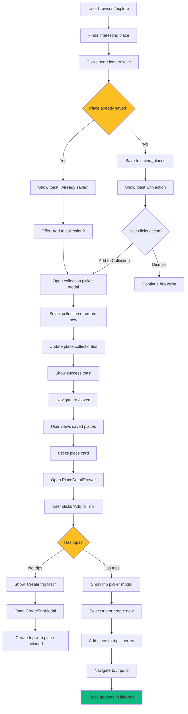
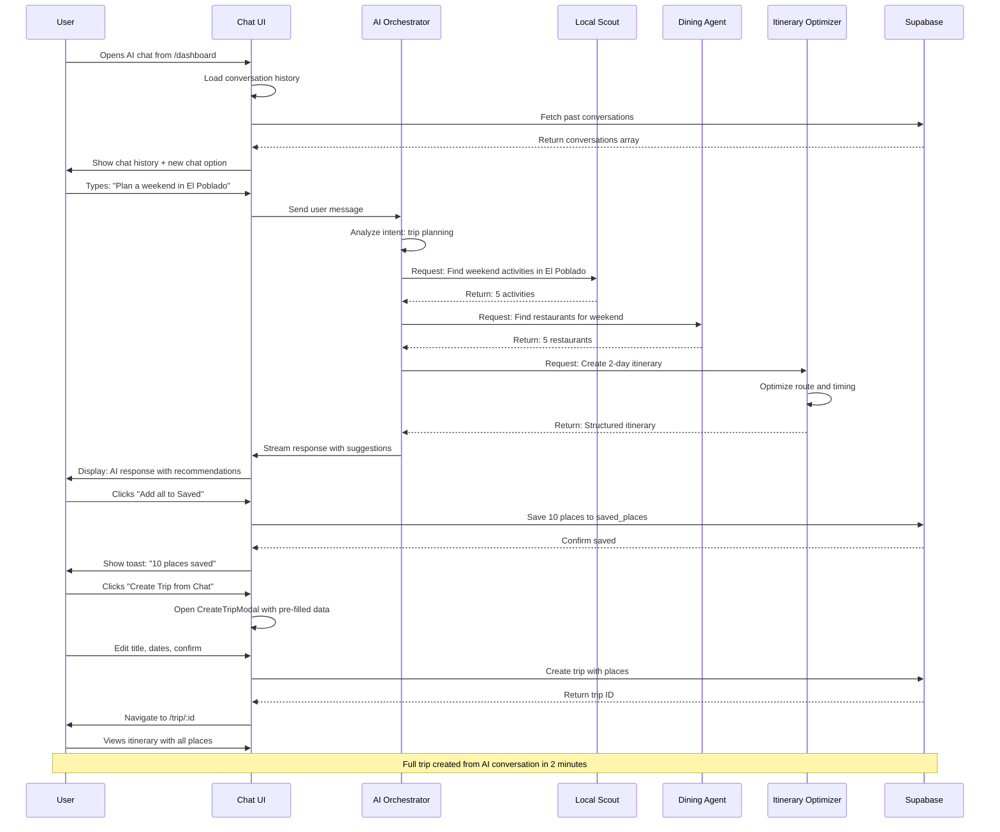
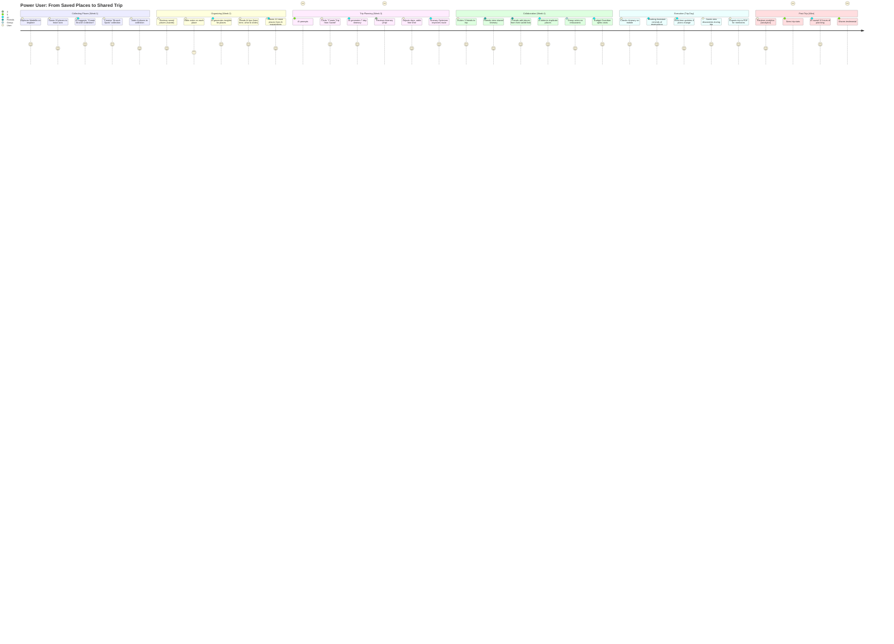

# 05 — Dashboard Advanced Features: AI-Powered Trip Intelligence

**Status:** 🟡 In Progress (40%)  
**Priority:** HIGH  
**Estimated Development Time:** 20-24 hours  
**Routes:** `/saved`, `/chats`, `/analytics`, `/settings`  
**Dependencies:** Supabase (schema ready), AI Agents (implemented), Auth (LAST)

---

## 📊 Executive Summary

- **Current State:** Saved places exist (localStorage), minimal chat UI, no analytics, partial settings
- **Advanced Goal:** Full-featured saved places with collections, conversational AI chat history, trip analytics dashboard, comprehensive settings panel
- **Technical Debt:** No Supabase sync, no search/filter for saved/chats, no data export, no privacy controls
- **Success Metric:** User can save/organize places, review AI conversations, track trip metrics, and manage preferences across devices
- **Production Readiness:** Real-time sync, offline support, data export, privacy compliance (GDPR-ready)

---

## 🎯 Scope & Dependencies

### Advanced Features to Complete

1. **Saved Places** — Collections, Supabase sync, "add to trip", AI notes, deduplication, sharing
2. **Explore Integration** — Real data wiring, filter persistence, map markers, saved places connection
3. **Chats/Conversations** — Full chat history, search, pin important chats, agent tags, citations, export
4. **Analytics Dashboard** — Trip stats, usage metrics, AI performance, conversion tracking
5. **Settings Panel** — Profile, preferences, privacy, API keys, notifications, data management

### Dependencies

- ✅ **Supabase Schema:** `saved_places`, `conversations`, `user_preferences` tables
- ✅ **AI Agents:** All 6 agents implemented, event bus ready
- ✅ **Context Managers:** AIContext, TripContext exist
- 🔴 **Auth:** Build LAST (use mock userId: 'demo-user')
- ✅ **Components:** EmptyState, Card, Badge, Tabs, Switch, Drawer already exist

### Data Models (Supabase-ready)

**Saved Places:**
```typescript
interface SavedPlace {
  id: string;
  userId: string;
  placeId: string; // External ID (Google Places, Foursquare, etc.)
  title: string;
  category: 'restaurant' | 'activity' | 'stay' | 'event' | 'other';
  address?: string;
  coordinates?: { lat: number; lng: number };
  image?: string;
  notes?: string; // User notes
  aiNotes?: string; // AI-generated insights
  collectionIds: string[]; // Array of collection IDs
  tags: string[];
  rating?: number;
  priceLevel?: 1 | 2 | 3 | 4;
  metadata: {
    savedAt: string;
    source: 'manual' | 'ai' | 'explore' | 'import';
    addedToTrips?: string[]; // Array of trip IDs
    lastUpdated: string;
  };
}

interface Collection {
  id: string;
  userId: string;
  name: string;
  description?: string;
  icon: string; // Emoji or icon name
  color: string; // Hex color
  placeCount: number;
  isPublic: boolean;
  sharedWith?: string[]; // User IDs
  createdAt: string;
  updatedAt: string;
}
```

**Conversations:**
```typescript
interface Conversation {
  id: string;
  userId: string;
  title: string; // Auto-generated from first message
  messages: Message[];
  agentTags: string[]; // Which agents were used
  isPinned: boolean;
  tripId?: string; // Associated trip (if any)
  metadata: {
    createdAt: string;
    lastMessageAt: string;
    messageCount: number;
    tokensUsed?: number;
  };
}

interface Message {
  id: string;
  role: 'user' | 'assistant' | 'system';
  content: string;
  agentName?: string; // Which agent responded
  citations?: Citation[];
  suggestedActions?: Action[];
  timestamp: string;
}
```

**Analytics:**
```typescript
interface UserAnalytics {
  userId: string;
  period: 'week' | 'month' | 'all';
  trips: {
    total: number;
    completed: number;
    active: number;
    draft: number;
  };
  savedPlaces: {
    total: number;
    byCategory: Record<string, number>;
    addedToTrips: number;
  };
  aiUsage: {
    totalQueries: number;
    byAgent: Record<string, number>;
    tokensUsed: number;
    savedTime: number; // Estimated hours saved
  };
  engagement: {
    activeMinutes: number;
    sessionsCount: number;
    lastActive: string;
  };
}
```

---

## 📐 Screen List & Routes

| Route | Purpose | Data Source | States |
|-------|---------|-------------|--------|
| `/saved` | Saved places with collections | Supabase → saved_places | loading, empty (no places / no collection), error, success |
| `/saved/:collectionId` | Collection detail view | Supabase → filtered places | loading, empty, error |
| `/chats` | Chat history list | Supabase → conversations | loading, empty (no chats), error, success |
| `/chats/:id` | Single conversation view | Supabase → messages | loading, not found, error |
| `/analytics` | Analytics dashboard | Supabase → aggregated stats | loading, insufficient data, error |
| `/settings` | User settings panel | Supabase → user_preferences | loading, error |
| `/settings/profile` | Profile settings | Supabase → user | loading, error |
| `/settings/privacy` | Privacy & data controls | Supabase → user_preferences | loading, error |

---

## 🧩 Components List

### ✅ Existing Components (Reuse)

| Component | Location | Purpose |
|-----------|----------|---------|
| `PlaceCard` | `/components/explore/PlaceCard.tsx` | Display place with image, title, rating |
| `EmptyState` | `/components/ui/EmptyState.tsx` | Generic empty state |
| `Tabs` | `/components/ui/tabs.tsx` | Tab navigation |
| `Switch` | `/components/ui/switch.tsx` | Toggle switches (settings) |
| `Badge` | `/components/ui/badge.tsx` | Category tags, agent badges |
| `Drawer` | `/components/ui/drawer.tsx` | Mobile bottom sheets |
| `Dialog` | `/components/ui/dialog.tsx` | Modals (create collection, delete confirmation) |
| `ChatBubble` | `/components/ai/ChatBubble.tsx` | Message display |
| `ChatInterface` | `/components/ai/ChatInterface.tsx` | Full chat UI |

### 🆕 New Components (Build)

| Component | File | Purpose |
|-----------|------|---------|
| `SavedPlacesGrid` | `/components/saved/SavedPlacesGrid.tsx` | Grid of saved place cards |
| `CollectionsList` | `/components/saved/CollectionsList.tsx` | List of collections with counts |
| `CreateCollectionModal` | `/components/saved/CreateCollectionModal.tsx` | Modal to create new collection |
| `PlaceDetailDrawer` | `/components/saved/PlaceDetailDrawer.tsx` | Bottom sheet with place details |
| `AddToTripSheet` | `/components/saved/AddToTripSheet.tsx` | Sheet to add place to trip |
| `SavedFilters` | `/components/saved/SavedFilters.tsx` | Filter by category, collection, tags |
| `ConversationsList` | `/components/chats/ConversationsList.tsx` | List of chat conversations |
| `ConversationDetail` | `/components/chats/ConversationDetail.tsx` | Full conversation view |
| `ChatSearch` | `/components/chats/ChatSearch.tsx` | Search through chat history |
| `ExportChatMenu` | `/components/chats/ExportChatMenu.tsx` | Export chat to PDF/TXT |
| `AnalyticsDashboard` | `/components/analytics/AnalyticsDashboard.tsx` | Main analytics layout |
| `TripStatsCard` | `/components/analytics/TripStatsCard.tsx` | Trip statistics widget |
| `AIUsageChart` | `/components/analytics/AIUsageChart.tsx` | AI agent usage chart |
| `EngagementMetrics` | `/components/analytics/EngagementMetrics.tsx` | User engagement stats |
| `SettingsLayout` | `/components/settings/SettingsLayout.tsx` | Settings page layout with sidebar |
| `ProfileSettings` | `/components/settings/ProfileSettings.tsx` | Profile edit form |
| `PreferencesSettings` | `/components/settings/PreferencesSettings.tsx` | App preferences (theme, language, etc.) |
| `PrivacySettings` | `/components/settings/PrivacySettings.tsx` | Privacy controls, data export/delete |
| `NotificationSettings` | `/components/settings/NotificationSettings.tsx` | Email/push notification preferences |
| `APIKeySettings` | `/components/settings/APIKeySettings.tsx` | Manage external API keys |

---

## 📊 Data States & Edge Cases

### Saved Places States

| State | Condition | UI Display | Actions Available |
|-------|-----------|------------|-------------------|
| **Loading** | Fetching from Supabase | Skeleton grid (8 cards) | None |
| **Empty (No Places)** | User has 0 saved places | EmptyState "Start saving places" | Explore, Ask AI |
| **Empty (No Collection)** | Collection has 0 places | EmptyState "Add places to this collection" | Browse all, Add place |
| **Success** | Places loaded | Grid of place cards | View, Edit notes, Add to trip, Delete |
| **Error** | API failure | Error state with retry | Retry, Use cached |
| **Offline** | No network | Show cached places + banner | View only |
| **Duplicate Warning** | User tries to save already-saved place | Toast "Already saved" + option to add to different collection | Add to collection |

### Chats States

| State | Condition | UI Display | Actions Available |
|-------|-----------|------------|-------------------|
| **Loading** | Fetching conversations | Skeleton list (5 items) | None |
| **Empty** | User has no chat history | EmptyState "Start a conversation" | New chat |
| **Success** | Conversations loaded | List of conversations | View, Pin, Delete, Export |
| **Streaming** | AI is responding | Typing indicator, streaming text | Stop generation |
| **Error** | Message failed to send | Retry button on message | Retry, Cancel |
| **Offline** | No network | Cached chats + offline banner | View only, no new messages |

### Analytics States

| State | Condition | UI Display | Actions Available |
|-------|-----------|------------|-------------------|
| **Loading** | Calculating metrics | Skeleton charts | None |
| **Insufficient Data** | User has < 1 trip | EmptyState "Create trips to see insights" | Create trip |
| **Success** | Metrics calculated | Charts and stats | Filter by period, Export |
| **Error** | Calculation failed | Error message | Retry |

### Settings States

| State | Condition | UI Display | Actions Available |
|-------|-----------|------------|-------------------|
| **Loading** | Fetching preferences | Skeleton form | None |
| **Success** | Preferences loaded | Form with current values | Edit, Save |
| **Saving** | Submitting changes | Loading spinner on save button | None |
| **Error** | Save failed | Error toast | Retry |

---

## 🛠️ Step-by-Step Implementation Prompts

### STEP 1 — Audit & Map Existing Components

**Figma Make Prompt:**
```
Analyze the existing "I Love Medellín" codebase for advanced dashboard features:

1. Saved Places:
   - Read /pages/saved/SavedPlacesPage.tsx
   - Read /components/explore/PlaceCard.tsx
   - Identify: What data structure is used? localStorage or Supabase?
   - Identify: What actions exist? (save, unsave, view)

2. Chats:
   - Read /pages/ChatsPage.tsx
   - Read /components/ai/ChatInterface.tsx
   - Identify: Is there conversation history or just single chat?
   - Identify: What AI agents are accessible?

3. Explore:
   - Read /pages/ExplorePage.tsx
   - Read /components/explore/ExploreMap.tsx
   - Identify: What data source? Mock or real API?
   - Identify: Is there a "Save" button on place cards?

4. Analytics:
   - Search for analytics-related files
   - Identify: Does analytics page exist?

5. Settings:
   - Read /components/settings/SettingsButton.tsx
   - Identify: What settings exist? Is there a full settings page?

Create a status table:
| Feature | Current Status | Data Storage | UI Components | Missing |
|---------|---------------|--------------|---------------|---------|
| Saved Places | Exists | localStorage | PlaceCard, SavedPlacesPage | Collections, notes, deduplication |
| Chats | Minimal | None (ephemeral) | ChatInterface | History, search, export |
| Explore | Exists | Mock data | ExploreMap, PlaceCard | Real API, save integration |
| Analytics | Not implemented | N/A | None | Entire dashboard |
| Settings | Partial | localStorage | SettingsButton, APIKeyModal | Full settings page |
```

---

### STEP 2 — Define Routes & Navigation

**Figma Make Prompt:**
```
Define comprehensive navigation for advanced dashboard features in "I Love Medellín":

Routes to add/update:
- /saved (main saved places page)
- /saved/collections (collections list view)
- /saved/:collectionId (single collection detail)
- /chats (chat history list)
- /chats/:id (single conversation)
- /analytics (analytics dashboard)
- /settings (main settings page)
- /settings/profile (profile settings)
- /settings/preferences (app preferences)
- /settings/privacy (privacy & data)
- /settings/notifications (notification preferences)

Navigation hierarchy:
1. Dashboard (/dashboard)
   ├── My Trips (main view)
   ├── Saved Places (→ /saved)
   ├── Chat History (→ /chats)
   ├── Analytics (→ /analytics)
   └── Settings (→ /settings)

2. Saved Places (/saved)
   ├── All Places (default view)
   ├── Collections (tab)
   └── [Collection Detail] (→ /saved/:id)

3. Chats (/chats)
   ├── All Conversations (list)
   └── [Conversation Detail] (→ /chats/:id)

4. Settings (/settings)
   ├── Profile (tab)
   ├── Preferences (tab)
   ├── Privacy (tab)
   ├── Notifications (tab)
   └── API Keys (tab)

Desktop navigation:
- Navbar: Dashboard (dropdown with Trips, Saved, Chats, Analytics)
- Settings: User avatar dropdown (top-right)

Mobile navigation:
- Bottom nav: Home, Explore, Trips, Saved, Profile
- Settings: Accessible from Profile tab

Create route definitions:
```typescript
const dashboardRoutes = [
  { path: '/dashboard', label: 'My Trips', icon: MapIcon },
  { path: '/saved', label: 'Saved Places', icon: BookmarkIcon },
  { path: '/chats', label: 'Conversations', icon: MessageCircleIcon },
  { path: '/analytics', label: 'Analytics', icon: BarChartIcon },
  { path: '/settings', label: 'Settings', icon: SettingsIcon }
];
```
```

---

### STEP 3 — Screen Wireframes (Desktop + Mobile)

**Figma Make Prompt:**
```
Create wireframes for advanced dashboard screens matching "I Love Medellín" design system.

SCREEN 1: Saved Places (/saved)

Desktop (1280px+):
┌────────────────────────────────────────────────────────────┐
│  NAVBAR                                                    │
├────────────────────────────────────────────────────────────┤
│  ┌──────────────┐  ┌──────────────────────────────────────┐│
│  │ SIDEBAR      │  │  MAIN CONTENT                        ││
│  │              │  │  ┌────────────────────────────────┐  ││
│  │ Collections  │  │  │ Saved Places     [+ New] [🔍]  │  ││
│  │ ──────────── │  │  │ 24 places • 3 collections      │  ││
│  │ ⭐ All (24)  │  │  └────────────────────────────────┘  ││
│  │ 🍴 Restaurants│ │  [All] [Restaurants] [Activities]    ││
│  │    (12)      │  │                                      ││
│  │ 🎭 Activities│  │  ┌─────┐ ┌─────┐ ┌─────┐ ┌─────┐  ││
│  │    (8)       │  │  │ IMG │ │ IMG │ │ IMG │ │ IMG │  ││
│  │ 🏨 Stays (4) │  │  │ Cafe│ │Rest.│ │ Tour│ │ Bar │  ││
│  │              │  │  │ ⭐4.5│ │ ⭐4.8│ │ ⭐5.0│ │ ⭐4.2│  ││
│  │ + New        │  │  │ $$ │ │ $$$ │ │ $  │ │ $$  │  ││
│  │              │  │  └─────┘ └─────┘ └─────┘ └─────┘  ││
│  └──────────────┘  │                                      ││
│                    │  ┌─────┐ ┌─────┐ ┌─────┐ ┌─────┐  ││
│                    │  │ ... │ │ ... │ │ ... │ │ ... │  ││
│                    │  └─────┘ └─────┘ └─────┘ └─────┘  ││
│                    └──────────────────────────────────────┘│
└────────────────────────────────────────────────────────────┘

Mobile (375px):
┌──────────────────────┐
│  Saved Places  [+][🔍]│
│  24 places           │
├──────────────────────┤
│  [All] [🍴] [🎭] [🏨] │
├──────────────────────┤
│  ┌────────────────┐  │
│  │ [Image]        │  │
│  │ Café Zorba     │  │
│  │ ⭐ 4.5 • $$    │  │
│  │ El Poblado     │  │
│  │ [Add to Trip] │  │
│  └────────────────┘  │
│  ┌────────────────┐  │
│  │ [Image]        │  │
│  └────────────────┘  │
├──────────────────────┤
│ [Home][Map][Trip][💾]│
└──────────────────────┘

SCREEN 2: Chats (/chats)

Desktop:
┌────────────────────────────────────────────────────────────┐
│  ┌──────────────┐  ┌──────────────────────────────────────┐│
│  │ CONVERSATIONS│  │  [Conversation Detail]               ││
│  │              │  │  ┌────────────────────────────────┐  ││
│  │ [Search...]  │  │  │ Plan weekend in El Poblado     │  ││
│  │              │  │  │ 12 messages • 3 agents used    │  ││
│  │ 📌 Pinned    │  │  └────────────────────────────────┘  ││
│  │ ──────────── │  │                                      ││
│  │ 🏖️ Plan...   │  │  [User bubble] Plan weekend trip   ││
│  │    Yesterday │  │                                      ││
│  │              │  │  [AI bubble - Local Scout]          ││
│  │ Recent       │  │  I can help! Here are top spots...  ││
│  │ ──────────── │  │  • Carmen Restaurant               ││
│  │ 🍴 Find rest.│  │  • Parque Lleras                   ││
│  │    2 days ago│  │  [Add to Trip] [See on Map]        ││
│  │              │  │                                      ││
│  │ 🗺️ Route opt│  │  [User] Tell me more about Carmen   ││
│  │    1 week ago│  │                                      ││
│  └──────────────┘  │  [AI bubble - Dining Agent]         ││
│                    │  Carmen is a Michelin-recommend...  ││
│                    └──────────────────────────────────────┘│
└────────────────────────────────────────────────────────────┘

SCREEN 3: Analytics (/analytics)

Desktop:
┌────────────────────────────────────────────────────────────┐
│  Analytics                              [Week ▼] [Export]  │
│  Track your trip planning progress                         │
├────────────────────────────────────────────────────────────┤
│  ┌───────────┐ ┌───────────┐ ┌───────────┐ ┌───────────┐ │
│  │ 12 Trips  │ │ 45 Places │ │ 120 Queries│ │ 15 Hours  │ │
│  │ Created   │ │ Saved     │ │ to AI     │ │ Saved     │ │
│  └───────────┘ └───────────┘ └───────────┘ └───────────┘ │
│                                                            │
│  Trip Status                    AI Agent Usage             │
│  ┌─────────────────────────┐  ┌─────────────────────────┐ │
│  │ 🟢 Active: 3            │  │ [Bar Chart]             │ │
│  │ 📝 Draft: 7             │  │ Local Scout: 45         │ │
│  │ ✅ Completed: 2         │  │ Dining: 38              │ │
│  │                         │  │ Itinerary: 22           │ │
│  │ [Pie Chart]             │  │ Budget: 10              │ │
│  └─────────────────────────┘  │ Booking: 3              │ │
│                                │ Events: 2               │ │
│                                └─────────────────────────┘ │
│                                                            │
│  Engagement Trend (Last 30 Days)                          │
│  ┌──────────────────────────────────────────────────────┐ │
│  │ [Line Chart showing daily active minutes]            │ │
│  │                                      Peak: 45min/day  │ │
│  └──────────────────────────────────────────────────────┘ │
└────────────────────────────────────────────────────────────┘

SCREEN 4: Settings (/settings)

Desktop:
┌────────────────────────────────────────────────────────────┐
│  ┌──────────────┐  ┌──────────────────────────────────────┐│
│  │ SETTINGS     │  │  Profile                             ││
│  │ SIDEBAR      │  │  ┌────────────────────────────────┐  ││
│  │              │  │  │ [Avatar] Change photo          │  ││
│  │ Profile      │  │  │                                │  ││
│  │ Preferences  │  │  │ Name: [John Doe]               │  ││
│  │ Privacy      │  │  │ Email: [john@email.com]        │  ││
│  │ Notifications│  │  │ Bio: [Optional]                │  ││
│  │ API Keys     │  │  │                                │  ││
│  │              │  │  │ [Save Changes]                 │  ││
│  │ ──────────── │  │  └────────────────────────────────┘  ││
│  │ Help         │  │                                      ││
│  │ Logout       │  │  Preferences                         ││
│  └──────────────┘  │  ┌────────────────────────────────┐  ││
│                    │  │ Language: [English ▼]          │  ││
│                    │  │ Theme: [🌞 Light] [🌙 Dark]    │  ││
│                    │  │ Currency: [USD ▼]              │  ││
│                    │  │ Distance: [⚪ Miles ⚫ Km]     │  ││
│                    │  └────────────────────────────────┘  ││
│                    └──────────────────────────────────────┘│
└────────────────────────────────────────────────────────────┘

For each screen, define:
- Component hierarchy
- Spacing (padding, gap)
- Typography sizes
- Interactive elements
- Responsive breakpoints
```

---

### STEP 4 — High-Fidelity UI (Match Existing Style)

**Figma Make Prompt:**
```
Create high-fidelity UI components for Saved Places feature matching "I Love Medellín" design system.

Component 1: SavedPlaceCard
File: /components/saved/SavedPlaceCard.tsx

Visual design:
- Card: bg-white, rounded-2xl, border border-slate-100, shadow-sm
- Image: aspect-square (1:1), rounded-t-2xl, object-cover
- Overlay on hover: bg-black/20 with actions (View, Add to Trip, Delete)
- Content padding: p-4
- Title: font-serif, text-lg, text-slate-900, line-clamp-1
- Category badge: top-right, bg-emerald-100, text-emerald-800, rounded-full, px-2 py-1, text-xs
- Rating: ⭐ icon, text-sm, text-slate-600
- Price: $, $$, $$$, text-sm, text-slate-500
- Notes preview: text-sm, text-slate-400, italic, line-clamp-2 (if user added notes)
- Tags: flex gap-1, bg-slate-100, rounded-full, px-2, text-xs
- Bottom actions: "Add to Trip" button (emerald), "..." menu (slate)

Hover state:
- Card lifts: translateY(-4px), shadow-lg
- Image darkens, actions appear
- Quick actions visible (heart, share, more)

Props:
```typescript
interface SavedPlaceCardProps {
  place: SavedPlace;
  onAddToTrip: (placeId: string) => void;
  onDelete: (placeId: string) => void;
  onEditNotes: (placeId: string) => void;
  onViewDetails: (placeId: string) => void;
}
```

Component 2: CollectionCard
File: /components/saved/CollectionCard.tsx

Visual design:
- Card: bg-gradient-to-br from-{color}-50 to-white, rounded-2xl, p-6
- Icon: Large emoji or lucide icon, 48px
- Name: font-serif, text-2xl, text-slate-900
- Description: text-sm, text-slate-600, line-clamp-2
- Place count: text-sm, text-slate-500, "12 places"
- Preview grid: 2x2 grid of place thumbnail images (if > 0 places)
- Bottom: "View Collection" link with arrow

Hover state:
- Gradient intensifies
- Card lifts
- Arrow animates right

Component 3: CreateCollectionModal
File: /components/saved/CreateCollectionModal.tsx

Modal content:
- Title: "Create Collection"
- Form fields:
  - Name (text input, required)
  - Description (textarea, optional)
  - Icon (emoji picker or icon selector)
  - Color (color swatches: emerald, blue, amber, rose, purple)
  - Privacy: Toggle (Public / Private)
- Actions: "Cancel", "Create Collection" (emerald button)

Component 4: PlaceDetailDrawer (Mobile Bottom Sheet)
File: /components/saved/PlaceDetailDrawer.tsx

Bottom sheet design:
- Drag handle at top
- Hero image: full width, aspect-video
- Content: p-6
- Title: font-serif, text-2xl
- Category badge + rating + price level
- Address with map icon
- User notes section (editable textarea)
- AI insights section (if available, expandable)
  - "AI Notes" header with sparkles icon
  - AI-generated tips (e.g., "Best time to visit: 11am-2pm")
- Tags row (editable, add/remove)
- Collections: Show which collections this place belongs to
- Actions:
  - "Add to Trip" (primary button)
  - "Share" (secondary)
  - "Remove from Saved" (destructive)

Use existing Drawer component from shadcn/ui.
Animate drawer slide up from bottom.
```

---

### STEP 5 — States & Edge Cases

**Figma Make Prompt:**
```
Create comprehensive state handling for Saved Places feature.

Build /components/saved/SavedPlacesStates.tsx with variants:

1. LoadingSavedPlaces
   - Skeleton grid: 8 cards (4 columns desktop, 2 tablet, 1 mobile)
   - Each skeleton: Rectangle for image, 2 lines for text
   - Animate pulse

2. EmptyNoPlaces
   - Icon: Bookmark (slate-300)
   - Title: "No saved places yet"
   - Description: "Start exploring Medellín and save places you want to visit"
   - Actions:
     - Primary: "Explore Medellín" → /explore
     - Secondary: "Ask AI for Recommendations" → open AI chat

3. EmptyCollection
   - Icon: Folder (slate-300)
   - Title: "This collection is empty"
   - Description: "Add places from your saved list or explore new ones"
   - Actions:
     - Primary: "Browse All Saved" → /saved
     - Secondary: "Explore" → /explore

4. ErrorLoadingPlaces
   - Icon: AlertCircle (red-500)
   - Title: "Couldn't load saved places"
   - Description: "Check your connection and try again"
   - Actions:
     - Primary: "Retry"
     - Secondary: "Use Offline Cache"

5. OfflineMode (Banner component)
   - Amber background, full width
   - Icon: WifiOff
   - Message: "You're offline. Showing cached places."
   - Action: "Refresh" (when back online)

6. DuplicateWarning (Toast component)
   - When user tries to save already-saved place
   - Message: "This place is already saved"
   - Action: "Add to different collection?" (opens collection picker)

Build /components/saved/SavedPlacesFilters.tsx:
- Filter chips: All, Restaurants, Activities, Stays, Events, Other
- Collection filter dropdown
- Search input (searches title, notes, tags)
- Sort dropdown: Recently Added, Name A-Z, Rating High-Low
- Clear filters button (only show when filters active)

Implement filtering logic:
```typescript
const filterPlaces = (
  places: SavedPlace[],
  filters: {
    category?: string;
    collectionId?: string;
    searchQuery?: string;
    sortBy?: 'recent' | 'name' | 'rating';
  }
) => {
  let filtered = [...places];
  
  if (filters.category) {
    filtered = filtered.filter(p => p.category === filters.category);
  }
  
  if (filters.collectionId) {
    filtered = filtered.filter(p => 
      p.collectionIds.includes(filters.collectionId)
    );
  }
  
  if (filters.searchQuery) {
    const query = filters.searchQuery.toLowerCase();
    filtered = filtered.filter(p => 
      p.title.toLowerCase().includes(query) ||
      p.notes?.toLowerCase().includes(query) ||
      p.tags.some(t => t.toLowerCase().includes(query))
    );
  }
  
  // Sort
  if (filters.sortBy === 'name') {
    filtered.sort((a, b) => a.title.localeCompare(b.title));
  } else if (filters.sortBy === 'rating') {
    filtered.sort((a, b) => (b.rating || 0) - (a.rating || 0));
  } else {
    // Default: recent
    filtered.sort((a, b) => 
      new Date(b.metadata.savedAt).getTime() - 
      new Date(a.metadata.savedAt).getTime()
    );
  }
  
  return filtered;
};
```

Deduplication logic:
- When user tries to save place, check if placeId already exists
- If exists, show toast: "Already saved. Add to collection?"
- If different collection, allow adding to multiple collections
- Update collectionIds array
```

---

### STEP 6 — AI Features Integration

**Figma Make Prompt:**
```
Integrate AI features into Saved Places and Chats for intelligent organization and insights.

AI Feature 1: Smart Collections (Auto-categorization)
Location: /components/saved/AISmartCollections.tsx

When user saves 10+ places, AI suggests collections:
- Analyze saved places by category, tags, location
- Suggest collections:
  - "Weekend Brunch Spots" (if multiple cafes/restaurants)
  - "Nightlife in El Poblado" (if bars/clubs in same area)
  - "Cultural Experiences" (if museums, galleries, tours)
- Show suggestion card:
  - Title: "AI Suggestion: Create 'Weekend Brunch' collection?"
  - Shows 5 places that would fit
  - Actions: "Create Collection" (pre-filled), "Dismiss"

Powered by: Local Scout agent (analyzes patterns)

AI Feature 2: Place Insights (Auto-generated notes)
Location: On each SavedPlaceCard

When user saves a place, AI generates insights:
- Best time to visit (based on reviews, crowd data)
- What to order (for restaurants)
- Pro tips (parking, dress code, reservations needed)
- Similar places you might like
- Estimated time to spend there

Display as:
- Expandable "AI Insights" section in PlaceDetailDrawer
- Sparkles icon + "AI analyzed 120 reviews"
- Bullet points with key insights
- "Last updated: 2 hours ago"

Powered by: Dining Orchestrator (for restaurants), Local Scout (for activities)

AI Feature 3: Trip Suggestions from Saved Places
Location: /saved page, banner at top

If user has 5+ saved places but 0 trips:
- Show banner: "You have enough places saved to plan a trip! 🎉"
- AI suggests trip structure:
  - "Weekend Trip: 2 days, 8 places" (shows mini itinerary preview)
  - "Week-Long Adventure: 7 days, 20 places"
- Click "Create Trip from Saved" → opens CreateTripModal with places pre-added

Powered by: Itinerary Optimizer (creates optimal route)

AI Feature 4: Conversation Summaries (Chat History)
Location: /components/chats/ConversationCard.tsx

For each conversation, AI generates summary:
- 1-sentence summary of conversation topic
- Key recommendations made (e.g., "3 restaurants, 2 activities")
- Agents involved (badges)
- Actions available: "Add all to Trip", "Create Trip from Chat"

Example summary:
"Planned a 3-day weekend in El Poblado with focus on food and nightlife. 5 recommendations made."

Powered by: Context Manager (summarizes conversation history)

AI Feature 5: Smart Search (Chats)
Location: /components/chats/ChatSearch.tsx

When user searches chat history:
- AI understands semantic queries:
  - "Where did I ask about coffee?" → finds coffee-related chats
  - "Recommendations for families" → finds family-friendly suggestions
  - "Budget-friendly activities" → finds budget discussions
- Highlight matching messages in search results
- Show context (message before/after)

Powered by: Vector search (future) or keyword search + AI filtering

Implementation:

1. Create /hooks/useSavedPlacesAI.ts
```typescript
export const useSavedPlacesAI = () => {
  const { triggerAgent } = useAI();
  
  const generatePlaceInsights = async (place: SavedPlace) => {
    const result = await triggerAgent('local-scout', {
      action: 'analyze-place',
      placeId: place.id,
      title: place.title,
      category: place.category
    });
    
    return result.insights;
  };
  
  const suggestCollections = async (places: SavedPlace[]) => {
    const result = await triggerAgent('local-scout', {
      action: 'suggest-collections',
      places: places.map(p => ({
        id: p.id,
        title: p.title,
        category: p.category,
        tags: p.tags
      }))
    });
    
    return result.suggestions;
  };
  
  return { generatePlaceInsights, suggestCollections };
};
```

2. Create /components/saved/AISuggestionsPanel.tsx
- Show at top of /saved page (dismissible)
- "AI Suggestions" heading with sparkles icon
- 2-3 suggestion cards:
  - Smart collection suggestions
  - Trip creation suggestions
  - Duplicate detection warnings
- Each card has: icon, title, description, primary action

3. Add AI insights to PlaceDetailDrawer
- Collapsible "AI Insights" section
- Loading state while AI generates (shimmer effect)
- Refresh button to regenerate insights
- Show timestamp "Last updated: X ago"
```

---

### STEP 7 — Interaction & Motion Specs

**Figma Make Prompt:**
```
Define interactions and animations for advanced dashboard features.

Saved Places Interactions:

1. Save Place Action (from Explore)
   - User clicks heart icon on PlaceCard
   - Icon animates: scale 0 → 1.2 → 1, fill color emerald
   - Haptic feedback (mobile)
   - Toast appears: "Saved! Add to collection?"
   - Toast action: "Add to Collection" (opens collection picker)

2. Add to Collection
   - Collection picker modal slides up
   - Collections shown as grid with preview images
   - Click collection: checkmark animates, modal closes
   - Toast: "Added to [Collection Name]"

3. Remove from Saved
   - Swipe left on mobile (reveals delete button)
   - Click delete: confirmation dialog
   - Confirm: card fades out (opacity 0), slides up (translateY: -100%)
   - Gap closes with smooth animation

4. Drag to Collection (Desktop)
   - User drags SavedPlaceCard
   - Card lifts, shadow increases, cursor changes
   - Collection highlights on hover (border-emerald-500)
   - Drop: card animates to collection, shrinks into collection card
   - Collection count increments with number animation

5. Bulk Actions
   - Long press card (mobile) or checkbox (desktop) to enter selection mode
   - Selected cards: border-emerald-500, checkmark badge
   - Toolbar slides up from bottom: "X selected", actions (Add to Collection, Delete)
   - Actions apply to all selected with stagger animation

Chats Interactions:

1. Conversation List
   - Pinned conversations at top (yellow pin icon)
   - Swipe right (mobile): Pin/Unpin
   - Swipe left: Delete
   - Click: Navigate to conversation with slide transition

2. Conversation Detail
   - Messages fade in with stagger (newest first)
   - Streaming AI response: typing indicator, then text appears word-by-word
   - Code blocks: syntax highlighting, copy button on hover
   - Citations: underlined, click to see source in popover
   - Suggested actions: buttons below AI message, click to trigger action

3. Search Chats
   - Search bar with debounced input (300ms)
   - Results highlight matching text (yellow background)
   - Click result: navigate to conversation, scroll to message, pulse highlight

Analytics Interactions:

1. Chart Interactions
   - Hover data point: tooltip with value
   - Click bar/slice: drill down (show detail modal)
   - Drag to select date range (line chart)
   - Zoom in/out (pinch on mobile, scroll on desktop)

2. Filter Period
   - Dropdown: Week, Month, Quarter, Year, All Time
   - Select: charts animate to new data (transition duration 500ms)
   - Loading: skeleton overlay with shimmer

3. Export
   - Click "Export": dropdown menu (PDF, CSV, JSON)
   - Select format: loading spinner
   - Download: success toast with download icon

Settings Interactions:

1. Form Fields
   - Input focus: border-emerald-500, outline-emerald-500/30
   - Invalid: border-red-500, shake animation
   - Valid: border-green-500, checkmark icon
   - Save: button shows spinner, success shows checkmark

2. Toggle Switches
   - Click: smooth slide animation (duration 200ms)
   - Haptic feedback (mobile)
   - Instant save (no save button needed)
   - Toast confirmation: "Preference saved"

3. Avatar Upload
   - Click avatar: file picker or camera (mobile)
   - Selected image: preview with crop tool
   - Upload: progress bar, blur effect
   - Success: new avatar fades in

Motion Configuration:
```typescript
export const advancedAnimations = {
  savedPlace: {
    save: {
      initial: { scale: 0, rotate: -180 },
      animate: { scale: [0, 1.2, 1], rotate: 0 },
      transition: { duration: 0.5 }
    },
    delete: {
      exit: { opacity: 0, y: -100, transition: { duration: 0.3 } }
    }
  },
  chat: {
    message: {
      initial: { opacity: 0, y: 20 },
      animate: { opacity: 1, y: 0 },
      transition: { duration: 0.3 }
    },
    streaming: {
      animate: { opacity: [0.5, 1, 0.5] },
      transition: { repeat: Infinity, duration: 1.5 }
    }
  },
  analytics: {
    chart: {
      initial: { opacity: 0, scale: 0.9 },
      animate: { opacity: 1, scale: 1 },
      transition: { duration: 0.5 }
    }
  }
};
```

Accessibility:
- All animations respect prefers-reduced-motion
- Keyboard shortcuts: Ctrl+S (save), Ctrl+F (search), Esc (close modal)
- Focus trap in modals and drawers
- Announce state changes to screen readers (aria-live)
```

---

### STEP 8 — Accessibility & Responsive QA

**Figma Make Prompt:**
```
Ensure advanced dashboard features are fully accessible and responsive.

Accessibility Audit:

1. Saved Places
   - [ ] All place cards keyboard navigable (Tab, Enter to open)
   - [ ] Collection cards have descriptive aria-labels
   - [ ] "Add to Collection" action accessible via keyboard
   - [ ] Delete action requires confirmation (prevent accidental deletion)
   - [ ] Screen reader announces: "Place saved to [Collection]"
   - [ ] Filter controls accessible with keyboard (Space to toggle)
   - [ ] Search input has proper label and placeholder

2. Chats
   - [ ] Conversation list keyboard navigable
   - [ ] Message history scrolls with keyboard (Arrow keys)
   - [ ] AI streaming text announced as "Loading response"
   - [ ] Copy button on code blocks keyboard accessible
   - [ ] Search results keyboard navigable with highlight on focus
   - [ ] Pin/Delete actions confirm before executing

3. Analytics
   - [ ] Chart data accessible via table (hidden visually, available to screen readers)
   - [ ] Period filter dropdown keyboard navigable
   - [ ] Export button keyboard accessible
   - [ ] Tooltips keyboard accessible (focus trigger)

4. Settings
   - [ ] All form fields have proper labels
   - [ ] Toggle switches keyboard accessible (Space to toggle)
   - [ ] Invalid fields announce error message to screen reader
   - [ ] Save button shows loading state with aria-busy
   - [ ] Success/error toasts announced as alerts

Responsive Breakpoints:

**Saved Places:**
- Mobile (320px - 767px):
  - 1 column grid
  - Collections as horizontal scroll carousel
  - Filters as bottom sheet
  - Search as separate page
  
- Tablet (768px - 1023px):
  - 2 column grid
  - Collections sidebar collapses to dropdown
  - Filters as top bar
  
- Desktop (1024px+):
  - 4 column grid
  - Persistent collections sidebar
  - Full filter bar

**Chats:**
- Mobile:
  - List view only (conversations list)
  - Conversation detail as full-screen page
  - Back button to return to list
  
- Tablet:
  - 2-column: list left, detail right
  - Swipe to collapse list (iPad)
  
- Desktop:
  - 3-column: collections (optional), list, detail
  - Resizable columns (drag divider)

**Analytics:**
- Mobile:
  - Stacked cards (1 column)
  - Charts: simplified, swipe for more
  - Period filter at top
  
- Tablet:
  - 2x2 grid of stat cards
  - Charts: 2 per row
  
- Desktop:
  - 4 stat cards in row
  - Charts: side-by-side
  - Full drill-down capabilities

**Settings:**
- Mobile:
  - Tabs at top (horizontal scroll)
  - Full-screen form
  - Sticky save button at bottom
  
- Tablet:
  - Sidebar navigation (persistent)
  - Form in main area
  
- Desktop:
  - Sidebar navigation (persistent, wider)
  - Multi-column form layout

Touch Targets:
- Minimum 48px x 48px for all interactive elements
- Swipe gestures have visual indicators
- Long press shows haptic feedback and visual cue

Performance:
- Lazy load images in saved places (Intersection Observer)
- Virtualize long lists (react-window for 100+ items)
- Debounce search input (300ms)
- Optimize re-renders (React.memo for card components)
```

---

### STEP 9 — Handoff Pack

**Figma Make Prompt:**
```
Create comprehensive implementation handoff for advanced dashboard features.

File Structure:
```
/pages/
  ├── saved/
  │   ├── SavedPlacesPage.tsx              (Main saved places page)
  │   └── CollectionDetailPage.tsx         (Single collection view)
  ├── ChatsPage.tsx                        (Chat history list)
  ├── ChatDetailPage.tsx                   (Single conversation)
  ├── AnalyticsPage.tsx                    (Analytics dashboard)
  └── SettingsPage.tsx                     (Settings with tabs)

/components/saved/
  ├── SavedPlacesGrid.tsx                  (Grid of place cards)
  ├── SavedPlaceCard.tsx                   (Individual place card)
  ├── CollectionsList.tsx                  (Collections sidebar)
  ├── CollectionCard.tsx                   (Collection card)
  ├── CreateCollectionModal.tsx            (Create/edit collection)
  ├── PlaceDetailDrawer.tsx                (Bottom sheet with details)
  ├── AddToTripSheet.tsx                   (Add place to trip)
  ├── SavedFilters.tsx                     (Filter bar)
  ├── AISuggestionsPanel.tsx               (AI suggestions)
  └── SavedPlacesStates.tsx                (Loading/empty/error states)

/components/chats/
  ├── ConversationsList.tsx                (List of conversations)
  ├── ConversationCard.tsx                 (Conversation list item)
  ├── ConversationDetail.tsx               (Full conversation view)
  ├── MessageBubble.tsx                    (Single message)
  ├── ChatSearch.tsx                       (Search chats)
  ├── ExportChatMenu.tsx                   (Export options)
  └── ConversationStates.tsx               (Loading/empty/error)

/components/analytics/
  ├── AnalyticsDashboard.tsx               (Main layout)
  ├── StatCard.tsx                         (Metric card)
  ├── TripStatsChart.tsx                   (Trip statistics chart)
  ├── AIUsageChart.tsx                     (AI agent usage chart)
  ├── EngagementChart.tsx                  (Engagement trend chart)
  ├── PeriodFilter.tsx                     (Date range selector)
  └── ExportAnalytics.tsx                  (Export controls)

/components/settings/
  ├── SettingsLayout.tsx                   (Layout with sidebar)
  ├── SettingsSidebar.tsx                  (Navigation sidebar)
  ├── ProfileSettings.tsx                  (Profile tab)
  ├── PreferencesSettings.tsx              (Preferences tab)
  ├── PrivacySettings.tsx                  (Privacy tab)
  ├── NotificationSettings.tsx             (Notifications tab)
  └── APIKeySettings.tsx                   (API keys tab)

/hooks/
  ├── useSavedPlaces.ts                    (Saved places CRUD)
  ├── useCollections.ts                    (Collections CRUD)
  ├── useConversations.ts                  (Chat history CRUD)
  ├── useAnalytics.ts                      (Fetch analytics data)
  └── useSavedPlacesAI.ts                  (AI features for saved)
```

Data Fetching Patterns:

**Saved Places (with Supabase):**
```typescript
// /hooks/useSavedPlaces.ts
export const useSavedPlaces = () => {
  const [places, setPlaces] = useState<SavedPlace[]>([]);
  const [loading, setLoading] = useState(true);
  const [error, setError] = useState<Error | null>(null);
  
  const fetchPlaces = async () => {
    try {
      // Phase 1: localStorage
      const cached = localStorage.getItem('savedPlaces');
      if (cached) {
        setPlaces(JSON.parse(cached));
      }
      
      // Phase 2: Supabase
      // const { data, error } = await supabase
      //   .from('saved_places')
      //   .select('*')
      //   .eq('user_id', userId);
      // if (error) throw error;
      // setPlaces(data);
      // localStorage.setItem('savedPlaces', JSON.stringify(data));
      
      setLoading(false);
    } catch (err) {
      setError(err as Error);
      setLoading(false);
    }
  };
  
  const savePlace = async (place: Omit<SavedPlace, 'id' | 'metadata'>) => {
    const newPlace: SavedPlace = {
      ...place,
      id: crypto.randomUUID(),
      metadata: {
        savedAt: new Date().toISOString(),
        source: 'manual',
        lastUpdated: new Date().toISOString()
      }
    };
    
    // Optimistic update
    setPlaces(prev => [newPlace, ...prev]);
    
    // Persist
    localStorage.setItem('savedPlaces', JSON.stringify([newPlace, ...places]));
    
    // Supabase sync (future)
    // await supabase.from('saved_places').insert(newPlace);
  };
  
  return { places, loading, error, fetchPlaces, savePlace };
};
```

**Conversations:**
```typescript
// /hooks/useConversations.ts
export const useConversations = () => {
  const fetchConversations = async () => {
    // Phase 1: localStorage
    const cached = localStorage.getItem('conversations');
    return cached ? JSON.parse(cached) : [];
    
    // Phase 2: Supabase
    // const { data } = await supabase
    //   .from('conversations')
    //   .select('*, messages(*)')
    //   .eq('user_id', userId)
    //   .order('last_message_at', { ascending: false });
    // return data;
  };
  
  const saveConversation = async (conversation: Conversation) => {
    // Save to localStorage
    const existing = JSON.parse(localStorage.getItem('conversations') || '[]');
    const updated = [conversation, ...existing.filter((c: Conversation) => c.id !== conversation.id)];
    localStorage.setItem('conversations', JSON.stringify(updated));
    
    // Supabase sync (future)
    // await supabase.from('conversations').upsert(conversation);
  };
  
  return { fetchConversations, saveConversation };
};
```

Testing Checklist:

**Saved Places:**
- [ ] Save place from Explore page (heart icon)
- [ ] Create new collection
- [ ] Add place to collection
- [ ] Remove place from collection
- [ ] Edit place notes
- [ ] View AI-generated insights
- [ ] Filter places by category
- [ ] Search places by name/notes
- [ ] Delete place (with confirmation)
- [ ] Duplicate detection works

**Chats:**
- [ ] Create new conversation
- [ ] View conversation history
- [ ] Search conversations
- [ ] Pin/unpin conversation
- [ ] Delete conversation
- [ ] Export chat to PDF
- [ ] Messages display correctly (user vs AI)
- [ ] Agent tags show correctly
- [ ] Citations clickable
- [ ] Streaming animation works

**Analytics:**
- [ ] Load analytics dashboard
- [ ] All metrics display correctly
- [ ] Charts render (trip stats, AI usage, engagement)
- [ ] Filter by period (week, month, all)
- [ ] Export to PDF/CSV
- [ ] Insufficient data state shows correctly
- [ ] Charts responsive on mobile

**Settings:**
- [ ] Load settings page
- [ ] All tabs accessible
- [ ] Edit profile (name, email, avatar)
- [ ] Change preferences (theme, language, currency)
- [ ] Toggle notifications
- [ ] Add/remove API keys
- [ ] Export user data
- [ ] Delete account (with confirmation)
- [ ] Changes save correctly

Git Commit Strategy:
1. `feat(saved): implement saved places grid and collections`
2. `feat(saved): add AI insights and smart collections`
3. `feat(chats): implement conversation history and search`
4. `feat(analytics): create analytics dashboard with charts`
5. `feat(settings): build comprehensive settings panel`
6. `test(advanced): add integration tests for all features`

Performance Targets:
- Saved Places page loads in < 2s (with 100 places)
- Chat history loads in < 1.5s (with 50 conversations)
- Analytics charts render in < 1s
- Settings page loads in < 1s
- All interactions feel instant (< 100ms)

Deployment Checklist:
- [ ] All features tested on mobile (320px) and desktop (1920px)
- [ ] Accessibility audit passed (WCAG AA)
- [ ] Lighthouse score > 90
- [ ] No console errors or warnings
- [ ] All data persists correctly (localStorage → Supabase)
- [ ] Offline mode works (cached data shown)
- [ ] AI features degrade gracefully if AI fails
- [ ] Error handling comprehensive
- [ ] Loading states smooth
- [ ] Animations performant (60fps)
```

---

## 🗺️ Mermaid Diagrams

### 1. Flowchart: Saved Places → Add to Trip Flow



### 2. Sequence Diagram: AI-Powered Chat to Trip Creation



### 3. User Journey: Power User Workflow



---

## ✅ Acceptance Tests

### Functional Tests: Saved Places
- [ ] Save place from Explore page, appears in /saved
- [ ] Create collection, appears in collections sidebar
- [ ] Add place to collection, place shows in collection detail
- [ ] Remove place from collection, updates count
- [ ] Delete place, confirms before removing
- [ ] Edit notes on place, saves correctly
- [ ] AI insights generate within 5 seconds
- [ ] Duplicate detection prevents saving same place twice
- [ ] Filter by category updates grid instantly
- [ ] Search by name/notes finds correct places
- [ ] Sort by recent/name/rating works correctly
- [ ] Add place to trip, place appears in trip itinerary

### Functional Tests: Chats
- [ ] Create new conversation, saves to history
- [ ] View conversation list, sorted by recent
- [ ] Open conversation, all messages display
- [ ] Pin conversation, moves to top
- [ ] Delete conversation, confirms before removing
- [ ] Search conversations, finds matching messages
- [ ] Export chat to PDF, download works
- [ ] Agent tags display correctly
- [ ] Citations clickable, open in popover
- [ ] Streaming animation smooth

### Functional Tests: Analytics
- [ ] Load dashboard, all metrics display
- [ ] Trip stats accurate (matches actual trips)
- [ ] AI usage chart shows correct agent counts
- [ ] Engagement chart renders trend
- [ ] Filter by period updates charts
- [ ] Export to PDF generates correctly
- [ ] Insufficient data shows empty state

### Functional Tests: Settings
- [ ] Load settings page, all tabs accessible
- [ ] Edit profile, changes save
- [ ] Upload avatar, image updates
- [ ] Change theme, UI updates instantly
- [ ] Toggle notifications, saves preference
- [ ] Add API key, encrypts and saves
- [ ] Export data, downloads JSON
- [ ] Delete account, shows confirmation

### UI/UX Tests
- [ ] All pages responsive (320px to 1920px)
- [ ] Animations smooth (60fps)
- [ ] Loading states show for all async actions
- [ ] Error states provide recovery actions
- [ ] Empty states encourage user action
- [ ] Toasts appear for all user actions
- [ ] Modals trap focus correctly
- [ ] Drawers slide smoothly

### Integration Tests
- [ ] Save place → Add to collection → View collection works end-to-end
- [ ] Chat → Create trip → View trip works end-to-end
- [ ] Saved places sync with trip itinerary
- [ ] Analytics reflect real user actions
- [ ] Settings changes persist after page refresh
- [ ] Offline mode shows cached data correctly

---

## 💡 Implementation Handoff Notes

**Priority Order:**

**Sprint 1 (High Priority):**
1. Saved Places enhancements (collections, notes, filters)
2. AI insights for saved places
3. Add to trip flow from saved places

**Sprint 2 (Medium Priority):**
1. Chat history and search
2. Analytics dashboard (MVP)
3. Settings panel (profile, preferences)

**Sprint 3 (Low Priority):**
1. Advanced analytics (charts, exports)
2. Privacy settings (data export/delete)
3. API key management
4. Notification preferences

**Future Enhancements:**
1. Real-time collaboration on saved collections
2. Social sharing of collections
3. AI-powered trip recaps (post-trip summary)
4. Integration with external booking APIs
5. Advanced search (vector search, semantic)

**Performance Targets:**
- Saved Places loads < 2s (100 places)
- Chats loads < 1.5s (50 conversations)
- Analytics renders < 1s
- All interactions < 100ms

---

**Document Version:** 1.0  
**Last Updated:** December 20, 2024  
**Owner:** Product Design Team  
**Reviewers:** Engineering, QA, UX Research
