# Luxury AI Travel Platform - Complete Design Specification

**Product:** Premium AI Travel Planner (Mindtrip-style)  
**Tone:** Luxury · Calm · Editorial · Trust-first · Intelligent  
**Date:** December 20, 2024

---

## TABLE OF CONTENTS

1. [Global Design Foundation](#global-design-foundation)
2. [Section 1: How It Works](#section-1-how-it-works)
3. [Section 2: Personalized Recommendations](#section-2-personalized-recommendations)
4. [Section 3: New at Mindtrip](#section-3-new-at-mindtrip)
5. [Section 4: Everything You Need](#section-4-everything-you-need)
6. [Section 5: Organize It All](#section-5-organize-it-all)
7. [Section 6: Get Inspired (Horizontal Gallery)](#section-6-get-inspired-gallery)
8. [Section 7: Creator Economy CTA](#section-7-creator-economy-cta)
9. [User Journey & Workflows](#user-journey-workflows)
10. [Component Architecture](#component-architecture)
11. [Animation System](#animation-system)
12. [Implementation Checklist](#implementation-checklist)

---

## GLOBAL DESIGN FOUNDATION

### Design Principles

```
LUXURY HIERARCHY
├─ Editorial Typography (large, generous leading)
├─ Soft Depth (subtle shadows, gradients)
├─ Generous Spacing (never crowded)
├─ Calm Motion (explains, never distracts)
└─ Trust Signals (reviews, ratings, transparency)
```

### Grid System

**Desktop (1440px):**
```
┌────────────────────────────────────────────────────────────────┐
│  [120px padding]                                [120px padding] │
│                                                                 │
│  ┌─────────────────────────────────────────────────────────┐  │
│  │                    Max-width: 1200px                     │  │
│  │                    12-column grid                        │  │
│  │                    Gap: 32px                             │  │
│  └─────────────────────────────────────────────────────────┘  │
│                                                                 │
└────────────────────────────────────────────────────────────────┘
```

**Tablet (1024px):**
```
┌──────────────────────────────────────────────────────┐
│  [60px padding]                      [60px padding]  │
│                                                      │
│  ┌────────────────────────────────────────────────┐ │
│  │          Max-width: 904px                      │ │
│  │          8-column grid, Gap: 24px              │ │
│  └────────────────────────────────────────────────┘ │
│                                                      │
└──────────────────────────────────────────────────────┘
```

**Mobile (375px):**
```
┌───────────────────────┐
│  [24px]       [24px]  │
│                       │
│  ┌─────────────────┐ │
│  │   Max: 327px    │ │
│  │   Single col    │ │
│  │   Gap: 16px     │ │
│  └─────────────────┘ │
│                       │
└───────────────────────┘
```

### Color Palette

```css
/* Neutrals */
--stone-50: #fafaf9;
--stone-100: #f5f5f4;
--stone-200: #e7e5e4;
--stone-800: #292524;
--stone-900: #1c1917;

/* Accent */
--amber-500: #f59e0b;
--amber-600: #d97706;

/* Trust */
--emerald-500: #10b981;
--blue-600: #2563eb;

/* Depth */
--shadow-sm: 0 1px 2px rgba(0,0,0,0.04);
--shadow-md: 0 4px 12px rgba(0,0,0,0.08);
--shadow-lg: 0 8px 24px rgba(0,0,0,0.12);
--shadow-xl: 0 16px 48px rgba(0,0,0,0.16);
```

### Typography Scale

```css
/* Editorial Headings */
--text-7xl: 72px / 80px (1.111 leading)
--text-6xl: 60px / 64px
--text-5xl: 48px / 52px
--text-4xl: 36px / 40px
--text-3xl: 30px / 36px
--text-2xl: 24px / 32px
--text-xl: 20px / 28px

/* Body */
--text-lg: 18px / 28px (1.556 leading)
--text-base: 16px / 24px (1.5 leading)
--text-sm: 14px / 20px
```

---

## SECTION 1: HOW IT WORKS

### Purpose
Introduce AI as a concierge, not a chatbot. Build trust through clarity and visual demonstration.

### Desktop Wireframe (1440px)
```
┌────────────────────────────────────────────────────────────────────┐
│                                                             [80px]  │
│  ┌──────────────────────────┐  ┌──────────────────────────────┐   │
│  │  LEFT COLUMN (45%)       │  │  RIGHT COLUMN (55%)          │   │
│  │  ─────────────────       │  │                              │   │
│  │                          │  │      ┌────────────┐          │   │
│  │  How It Works            │  │      │ 🏖️ Beach   │          │   │
│  │  ─────────────           │  │      └────────────┘          │   │
│  │                          │  │  ┌──────────┐                │   │
│  │  Start chatting          │  │  │ 🍽️ Dining│                │   │
│  │  with us.                │  │  └──────────┘      ◉         │   │
│  │                          │  │                  AI Avatar   │   │
│  │  Our AI assistant helps  │  │                              │   │
│  │  you create the perfect  │  │      ┌──────────┐            │   │
│  │  itinerary based on your │  │      │ 🎭 Tours │            │   │
│  │  preferences, style, and │  │      └──────────┘            │   │
│  │  travel goals.           │  │  ┌────────────┐              │   │
│  │                          │  │  │ 🧘 Wellness│              │   │
│  │                          │  │  └────────────┘              │   │
│  │  [Chat Input Anchored]   │  │                              │   │
│  │  ┌────────────────────┐  │  │  ┌─────────────────────────┐│   │
│  │  │ Ask us anything... │  │  │  │ Ask us anything...   [↑]││   │
│  │  └────────────────────┘  │  │  └─────────────────────────┘│   │
│  │                          │  │                              │   │
│  └──────────────────────────┘  └──────────────────────────────┘   │
│                                                            [120px]  │
└────────────────────────────────────────────────────────────────────┘
```

### Mobile Wireframe (375px)
```
┌─────────────────────────┐
│                  [40px] │
│  How It Works           │
│  ─────────────          │
│                  [24px] │
│  ┌────────────┐         │
│  │ 🏖️ Beach   │         │
│  └────────────┘         │
│      ┌──────────┐       │
│      │ 🍽️ Dining│       │
│      └──────────┘       │
│          ◉             │
│        AI Avatar       │
│  ┌──────────┐           │
│  │ 🎭 Tours │           │
│  └──────────┘           │
│      ┌────────────┐     │
│      │ 🧘 Wellness│     │
│      └────────────┘     │
│                  [32px] │
│  Start chatting         │
│  with us.               │
│                         │
│  Our AI assistant...    │
│                  [24px] │
│  ┌───────────────────┐ │
│  │ Ask us anything...│ │
│  └───────────────────┘ │
│                  [40px] │
└─────────────────────────┘
```

### Component Breakdown


### Animation Sequence


**Animation Details:**
```
0ms    → Section container fades in (opacity 0→1)
200ms  → Heading slides up (y: 20→0) + fade
400ms  → Body copy fades in
500ms  → AI Avatar scales in (scale: 0.8→1.0) with soft bounce
700ms  → Cards stagger into orbit positions (100ms delay each)
         - Start: opacity 0, scale 0.8, random offset
         - End: opacity 1, scale 1.0, orbital position
1400ms → Chat input fades in with cursor blink
∞      → Cards continue gentle orbital rotation (360° per 60s)
```

### Orbital Motion Logic

```typescript
// Orbital positions (6 cards, evenly distributed)
const orbitalRadius = 180; // pixels from center
const cards = [
  { angle: 0, icon: '🏖️', label: 'Beach' },
  { angle: 60, icon: '🍽️', label: 'Dining' },
  { angle: 120, icon: '🎭', label: 'Tours' },
  { angle: 180, icon: '🧘', label: 'Wellness' },
  { angle: 240, icon: '🦁', label: 'Wildlife' },
  { angle: 300, icon: '⚽', label: 'Sports' }
];

// Position calculation
x = centerX + Math.cos(angle * Math.PI / 180) * radius;
y = centerY + Math.sin(angle * Math.PI / 180) * radius;

// Continuous rotation
angle += 0.1 deg per frame (60fps) = 6° per second
```

### Content Specifications

**Heading:**
- Text: "How It Works"
- Font: text-2xl, font-normal
- Color: stone-800
- Margin: mb-12

**Subheading:**
- Text: "Start chatting with us."
- Font: text-5xl, leading-tight
- Color: stone-900
- Margin: mb-6

**Body:**
- Max width: 480px
- Font: text-lg, leading-relaxed
- Color: stone-600
- Copy: "Our AI assistant helps you create the perfect itinerary based on your preferences, style, and travel goals."

**Chat Input:**
- Width: 100% (max 560px)
- Height: 56px
- Placeholder: "Ask us anything..."
- Icon: Send arrow (right)
- Border: 1px stone-200
- Radius: 28px (pill shape)
- Shadow: shadow-md
- Focus: ring-2 blue-600

**Floating Cards:**
- Size: 80×80px
- Radius: 20px
- Shadow: shadow-lg
- Background: white
- Icon size: 32px
- Label: text-sm below card
- Hover: lift 4px, shadow-xl

---

## SECTION 2: PERSONALIZED RECOMMENDATIONS

### Purpose
Demonstrate AI intelligence through actionable, trustworthy recommendations.

### Desktop Wireframe (1440px)
```
┌────────────────────────────────────────────────────────────────────┐
│                                                            [120px]  │
│  ┌──────────────────────────┐  ┌──────────────────────────────┐   │
│  │  LEFT COLUMN (50%)       │  │  RIGHT COLUMN (50%)          │   │
│  │                          │  │                              │   │
│  │  ┌────────────────────┐  │  │  Get personalized           │   │
│  │  │                    │  │  │  recommendations             │   │
│  │  │  HOTEL CARD        │  │  │                              │   │
│  │  │  ┌──────────────┐  │  │  │  Our AI analyzes your       │   │
│  │  │  │ Image 400×300│  │  │  │  preferences, budget, and   │   │
│  │  │  └──────────────┘  │  │  │  travel style to suggest    │   │
│  │  │                    │  │  │  the perfect places.        │   │
│  │  │  The Luxury Inn    │  │  │                              │   │
│  │  │  ★★★★★ 4.9 (234)  │  │  │  Every recommendation is    │   │
│  │  │                    │  │  │  verified, rated, and        │   │
│  │  │  Dec 15-20, 2024   │  │  │  tailored to you.           │   │
│  │  │  2 travelers       │  │  │                              │   │
│  │  │                    │  │  │  ┌─────────┐  ┌──────────┐  │   │
│  │  │  $450 / night      │  │  │  │ ♡ Save  │  │ Add trip │  │   │
│  │  │                    │  │  │  └─────────┘  └──────────┘  │   │
│  │  │  ┌──────────────┐  │  │  │                              │   │
│  │  │  │ [Book Now]   │  │  │  │                              │   │
│  │  │  │ [Add to Trip]│  │  │  │                              │   │
│  │  │  └──────────────┘  │  │  │                              │   │
│  │  └────────────────────┘  │  │                              │   │
│  │                          │  │                              │   │
│  └──────────────────────────┘  └──────────────────────────────┘   │
│                                                            [120px]  │
└────────────────────────────────────────────────────────────────────┘
```

### Mobile Wireframe (375px)
```
┌─────────────────────────┐
│                  [40px] │
│  Get personalized       │
│  recommendations        │
│                  [24px] │
│  Our AI analyzes...     │
│                         │
│  Every recommendation...│
│                  [32px] │
│  ┌───────────────────┐ │
│  │                   │ │
│  │  HOTEL CARD       │ │
│  │  ┌─────────────┐  │ │
│  │  │ Image       │  │ │
│  │  │ 327×245     │  │ │
│  │  └─────────────┘  │ │
│  │                   │ │
│  │  The Luxury Inn   │ │
│  │  ★★★★★ 4.9       │ │
│  │                   │ │
│  │  Dec 15-20        │ │
│  │  2 travelers      │ │
│  │                   │ │
│  │  $450 / night     │ │
│  │                   │ │
│  │  [Book Now]       │ │
│  │  [Add to Trip]    │ │
│  └───────────────────┘ │
│                  [40px] │
└─────────────────────────┘
```

### Recommendation Card Component

```mermaid
graph TD
    A[RecommendationCard] --> B[ImageContainer]
    A --> C[ContentSection]
    A --> D[ActionsSection]
    
    B --> E[HotelImage 400×300]
    B --> F[SaveButton absolute]
    
    C --> G[Title: The Luxury Inn]
    C --> H[Rating: 4.9 stars]
    C --> I[DateRange]
    C --> J[Travelers]
    C --> K[Price]
    
    D --> L[BookButton primary]
    D --> M[AddToTripButton secondary]
    
    F --> N[Heart icon]
    F --> O[Saved state toggle]
    
    style A fill:#fef3c7
    style B fill:#dbeafe
    style D fill:#dcfce7
```



### Card Specifications

**Container:**
- Width: 440px (desktop), 100% (mobile)
- Background: white
- Border radius: 24px
- Shadow: shadow-lg
- Padding: 24px
- Hover: lift 4px, shadow-xl

**Image:**
- Aspect: 4:3
- Border radius: 16px
- Object-fit: cover
- Lazy load: true

**Save Button (Heart):**
- Position: absolute top-right of image
- Size: 40×40px
- Background: white with blur backdrop
- Icon: Heart outline → filled
- Animation: scale 1→1.3→1.0 (spring)

**Title:**
- Font: text-2xl, font-semibold
- Color: stone-900
- Margin: mt-4

**Rating:**
- Stars: 5 filled (amber-500)
- Score: 4.9 (stone-700)
- Reviews: (234) (stone-500)
- Font: text-sm

**Details:**
- Date range: text-base, stone-600
- Travelers: text-base, stone-600
- Icon prefix for each

**Price:**
- Font: text-3xl, font-bold
- Color: stone-900
- Suffix: "/ night" (text-base, stone-600)

**Buttons:**
- Book Now: Primary (amber-600 bg, white text)
- Add to Trip: Secondary (stone-200 bg, stone-900 text)
- Height: 48px
- Full width: true
- Gap: 12px
- Border radius: 12px

### Animation Behavior

**On Scroll Into View:**
```
Card slides in from left:
- Initial: opacity 0, x: -40
- Animate: opacity 1, x: 0
- Duration: 600ms
- Easing: cubic-bezier(0.4, 0, 0.2, 1)
```

**Save Button Click:**
```
Heart animation:
0ms   → Scale 1.0, outline
100ms → Scale 1.3, fill starts
200ms → Scale 1.0, filled red
300ms → Gentle pulse (scale 1.05→1.0)
```

**Add to Trip Success:**
```
Button morphs:
- Text: "Add to Trip" → "✓ Added"
- Background: stone-200 → emerald-500
- Text color: stone-900 → white
- Duration: 300ms
- Hold: 2000ms
- Revert: 300ms
```

---

## SECTION 3: NEW AT MINDTRIP

### Purpose
Highlight new capabilities in an approachable, non-overwhelming way.

### Desktop Wireframe (1440px)
```
┌────────────────────────────────────────────────────────────────────┐
│                                                            [120px]  │
│  New at Mindtrip                                                   │
│  ────────────────                                                  │
│                                                             [48px]  │
│  ┌──────────┐  ┌──────────┐  ┌──────────┐  ┌──────────┐          │
│  │          │  │          │  │          │  │          │          │
│  │  EVENTS  │  │  GOOGLE  │  │ COLLECT  │  │  START   │          │
│  │          │  │   PINS   │  │  -IONS   │  │ ANYWHERE │          │
│  │  ┌────┐  │  │  ┌────┐  │  │  ┌────┐  │  │  ┌────┐  │          │
│  │  │ UI │  │  │  │ UI │  │  │  │ UI │  │  │  │ UI │  │          │
│  │  │ Ill│  │  │  │ Ill│  │  │  │ Ill│  │  │  │ Ill│  │          │
│  │  └────┘  │  │  └────┘  │  │  └────┘  │  │  └────┘  │          │
│  │          │  │          │  │          │  │          │          │
│  │ Events   │  │  Google  │  │ Collec-  │  │  Start   │          │
│  │ near you │  │  Pins    │  │  tions   │  │ Anywhere │          │
│  │          │  │          │  │          │  │          │          │
│  │ Discover │  │ Import   │  │ Save &   │  │ Build    │          │
│  │ local... │  │ saved... │  │ share... │  │ from...  │          │
│  │          │  │          │  │          │  │          │          │
│  │ Try it → │  │ Try it → │  │ Try it → │  │ Try it → │          │
│  │          │  │          │  │          │  │          │          │
│  └──────────┘  └──────────┘  └──────────┘  └──────────┘          │
│                                                            [120px]  │
└────────────────────────────────────────────────────────────────────┘
```

### Mobile Wireframe (Carousel)
```
┌─────────────────────────┐
│                  [40px] │
│  New at Mindtrip        │
│  ────────────────       │
│                  [32px] │
│  ┌───────────────────┐ │
│  │                   │ │
│  │  EVENTS           │ │
│  │                   │ │
│  │  ┌─────────────┐  │ │
│  │  │  UI         │  │ │
│  │  │  Preview    │  │ │
│  │  └─────────────┘  │ │
│  │                   │ │
│  │  Events near you  │ │
│  │                   │ │
│  │  Discover local   │ │
│  │  happenings...    │ │
│  │                   │ │
│  │  Try it →         │ │
│  │                   │ │
│  └───────────────────┘ │
│                         │
│    ◉  ○  ○  ○          │
│                  [40px] │
└─────────────────────────┘
```

### Feature Card Component


### Card Specifications

**Container:**
- Width: 280px
- Height: 400px
- Border radius: 24px
- Padding: 32px
- Overflow: hidden

**Background Gradients:**
```css
/* Events */
background: linear-gradient(135deg, #fef3c7 0%, #fde68a 100%);

/* Google Pins */
background: linear-gradient(135deg, #dbeafe 0%, #bfdbfe 100%);

/* Collections */
background: linear-gradient(135deg, #fce7f3 0%, #fbcfe8 100%);

/* Start Anywhere */
background: linear-gradient(135deg, #dcfce7 0%, #bbf7d0 100%);
```

**Illustration Preview:**
- Width: 216px (fill container)
- Height: 180px
- Border radius: 16px
- Shadow: shadow-md
- Background: white
- Margin: mb-6

**Title:**
- Font: text-xl, font-semibold
- Color: stone-900
- Margin: mb-2

**Description:**
- Font: text-sm, leading-relaxed
- Color: stone-700
- Max lines: 3
- Margin: mb-4

**CTA Link:**
- Text: "Try it →"
- Font: text-sm, font-medium
- Color: stone-900
- Underline: on hover
- Icon: Arrow right (lucide-react)

### Animation Behavior

**On Page Load (Stagger):**
```
Card 1: delay 0ms
Card 2: delay 100ms
Card 3: delay 200ms
Card 4: delay 300ms

Each card:
- Initial: opacity 0, y: 30, scale: 0.95
- Animate: opacity 1, y: 0, scale: 1
- Duration: 500ms
- Easing: cubic-bezier(0.4, 0, 0.2, 1)
```

**Hover State:**
```
Card lifts:
- Transform: translateY(-8px)
- Shadow: shadow-lg → shadow-2xl
- Duration: 300ms

Illustration floats:
- Transform: translateY(-4px)
- Duration: 400ms
- Delay: 100ms (after card lift starts)
```

**Mobile Carousel:**
```
Swipe behavior:
- Snap to center
- Visible: 1.2 cards (show partial next)
- Snap duration: 400ms
- Easing: cubic-bezier(0.4, 0, 0.2, 1)
```

---

## SECTION 4: EVERYTHING YOU NEED

### Purpose
Communicate platform completeness through visual hierarchy.

### Desktop Wireframe (1440px)
```
┌────────────────────────────────────────────────────────────────────┐
│                                                            [120px]  │
│  Everything you need                                               │
│  ────────────────────                                              │
│                                                             [48px]  │
│  ┌────────────────────────────────────────────────────────────┐   │
│  │                                                            │   │
│  │  FEATURED CARD (Full width)                               │   │
│  │  Photos, maps + reviews                                   │   │
│  │                                                            │   │
│  │  ┌──────────────┐  ┌──────────────┐  ┌──────────────┐    │   │
│  │  │  Photo Grid  │  │  Map Preview │  │  Reviews     │    │   │
│  │  │  (3 images)  │  │  Pins + area │  │  ★★★★★      │    │   │
│  │  └──────────────┘  └──────────────┘  └──────────────┘    │   │
│  │                                                            │   │
│  │  Research, compare, and book all in one place             │   │
│  │                                                            │   │
│  └────────────────────────────────────────────────────────────┘   │
│                                                             [32px]  │
│  ┌────────────────────────────────┐  ┌──────────────────────────┐ │
│  │                                │  │                          │ │
│  │  Tailored recommendations      │  │  Customizable trip plans │ │
│  │                                │  │                          │ │
│  │  ┌──────────────────────────┐  │  │  ┌────────────────────┐ │ │
│  │  │  AI Smart Suggestions    │  │  │  │  Drag & Drop UI    │ │ │
│  │  │  Icon + mini cards       │  │  │  │  Calendar view     │ │ │
│  │  └──────────────────────────┘  │  │  └────────────────────┘ │ │
│  │                                │  │                          │ │
│  │  Powered by your preferences   │  │  Organize your way       │ │
│  │                                │  │                          │ │
│  └────────────────────────────────┘  └──────────────────────────┘ │
│                                                            [120px]  │
└────────────────────────────────────────────────────────────────────┘
```

### Component Structure


### Featured Card Specs

**Container:**
- Width: 100% (max-w-6xl)
- Height: 480px (desktop), auto (mobile)
- Background: white
- Border radius: 32px
- Padding: 48px
- Shadow: shadow-xl

**Visual Cluster:**
```
┌─────────────────────────────────────┐
│  ┌──────┐ ┌──────┐ ┌──────┐        │
│  │Photo1│ │Photo2│ │Photo3│ Map    │
│  └──────┘ └──────┘ └──────┘ Preview│
│                                     │
│  Reviews:                           │
│  ★★★★★ 4.8 "Perfect location..."   │
│  ★★★★★ 4.9 "Amazing experience..." │
│  ★★★★☆ 4.5 "Great value..."        │
└─────────────────────────────────────┘
```

**Photos:**
- Size: 180×180px each
- Gap: 16px
- Border radius: 16px
- Object-fit: cover

**Map:**
- Size: 280×280px
- Border radius: 16px
- Pins: 3-5 locations
- Style: Minimal, monochrome

**Reviews:**
- Max: 3 visible
- Font: text-sm
- Stars: amber-500
- Text: stone-600
- Truncate: 60 characters

---

## SECTION 5: ORGANIZE IT ALL

### Purpose
Show operational clarity and completeness of platform.

### Desktop Wireframe (Grid)
```
┌────────────────────────────────────────────────────────────────────┐
│                                                            [120px]  │
│  Organize it all in one place                                      │
│  ──────────────────────────────                                    │
│                                                             [48px]  │
│  ┌──────────┐  ┌──────────┐  ┌──────────┐  ┌──────────┐          │
│  │          │  │          │  │          │  │          │          │
│  │  🏨      │  │  🚗      │  │  ✈️      │  │  🍽️      │          │
│  │  Hotels  │  │  Car     │  │ Flights  │  │  Dining  │          │
│  │          │  │  Rental  │  │          │  │          │          │
│  │  Book... │  │          │  │  Search  │  │  Reserve │          │
│  │          │  │ [Coming] │  │  compare │  │  tables  │          │
│  │          │  │          │  │          │  │          │          │
│  └──────────┘  └──────────┘  └──────────┘  └──────────┘          │
│                                                                     ���
│  ┌──────────┐  ┌──────────┐                                       │
│  │          │  │          │                                       │
│  │  🎭      │  │  🎫      │                                       │
│  │ Experien │  │  Tours   │                                       │
│  │  -ces    │  │          │                                       │
│  │  Discover│  │ [Coming] │                                       │
│  │  unique  │  │          │                                       │
│  │          │  │          │                                       │
│  └──────────┘  └──────────┘                                       │
│                                                            [120px]  │
└────────────────────────────────────────────────────────────────────┘
```

### Category Card Component


### Card Specifications

**Container:**
- Width: 280px
- Height: 240px
- Background: white
- Border: 1px stone-200
- Border radius: 20px
- Padding: 32px
- Hover: border blue-600

**Icon:**
- Size: 48px (emoji size)
- Background: stone-100 circle, 80×80px
- Center alignment
- Margin: mb-4

**Title:**
- Font: text-xl, font-semibold
- Color: stone-900
- Margin: mb-2

**Description:**
- Font: text-sm
- Color: stone-600
- Lines: 2 max

**Badge ("Coming Soon"):**
- Position: absolute top-right
- Padding: 4px 12px
- Background: stone-100
- Color: stone-600
- Border radius: 12px
- Font: text-xs, font-medium

### Hover Animation

```
Icon bounces:
- Transform: translateY(0) → translateY(-4px) → translateY(0)
- Duration: 400ms
- Easing: cubic-bezier(0.4, 0, 0.2, 1)
```

---

## SECTION 6: GET INSPIRED (GALLERY)

### Purpose
Drive exploration through stunning visual gallery. **This is the horizontal scrolling section.**

### Desktop Wireframe (1440px)
```
┌────────────────────────────────────────────────────────────────────┐
│                                                            [120px]  │
│  Get Inspired                                                      │
│  ─────────────                                                     │
│                                                             [48px]  │
│  ┌──────────┐   ┌──────────┐   ┌──────────┐   ┌──────────┐       │
│  │          │   │          │   │          │   │          │       │
│  │  IMAGE   │   │  IMAGE   │   │  IMAGE   │   │  IMAGE   │   →   │
│  │  320×400 │   │  320×400 │   │  320×400 │   │  320×400 │       │
│  │          │   │          │   │          │   │          │       │
│  │          │   │          │   │          │   │          │       │
│  │  Paris:  │   │  Rome    │   │  Tokyo   │   │  Beach   │       │
│  │  A Local │   │  Culture │   │  Urban   │   │ Escapes  │       │
│  │  Guide   │   │          │   │          │   │          │       │
│  │          │   │          │   │          │   │          │       │
│  └──────────┘   └──────────┘   └──────────┘   └──────────┘       │
│   [24px gap]    [24px gap]    [24px gap]                          │
│                                                                     │
│  ← Scroll horizontally or drag →                                   │
│                                                            [120px]  │
└────────────────────────────────────────────────────────────────────┘
```

**This matches the reference image provided!**

### Gallery Data Structure

```typescript
interface InspirationItem {
  id: string;
  imageUrl: string;
  title: string;
  subtitle?: string;
  category: string;
  link: string;
}

const inspirationGallery: InspirationItem[] = [
  {
    id: '1',
    imageUrl: 'figma:asset/9efe36acc8b831fb7efa3e5824128b613457b8fe.png', // Fashion
    title: 'Paris',
    subtitle: 'A Local\'s Guide',
    category: 'City Guide',
    link: '/collections/paris-local'
  },
  {
    id: '2',
    imageUrl: '[watch-image]',
    title: 'Rome',
    subtitle: 'Culture & History',
    category: 'Heritage',
    link: '/collections/rome-culture'
  },
  {
    id: '3',
    imageUrl: '[lifestyle-image]',
    title: 'Tokyo',
    subtitle: 'Urban Adventures',
    category: 'Modern',
    link: '/collections/tokyo-urban'
  },
  {
    id: '4',
    imageUrl: '[packaging-image]',
    title: 'Beach Escapes',
    subtitle: 'Coastal Serenity',
    category: 'Relaxation',
    link: '/collections/beach-escapes'
  }
];
```

### Scroll Gallery Component Architecture

```mermaid
graph TD
    A[InspirationGallery] --> B[SectionHeader]
    A --> C[ScrollContainer]
    
    B --> D[Title: Get Inspired]
    B --> E[Optional subtitle]
    
    C --> F[GalleryCard x8]
    C --> G[ScrollIndicator]
    
    F --> H[Image 320×400]
    F --> I[HoverOverlay]
    
    I --> J[Title]
    I --> K[Subtitle]
    I --> L[SaveIcon]
    
    G --> M[ProgressBar]
    
    style A fill:#fef3c7
    style C fill:#dbeafe
    style F fill:#dcfce7
```



### Gallery Card Specifications

**Container:**
- Width: 320px
- Height: 400px (4:5 ratio)
- Border radius: 16px
- Overflow: hidden
- Shadow: shadow-lg
- Flex-shrink: 0 (prevent collapse)
- Scroll-snap-align: center

**Image:**
- Width: 100%
- Height: 100%
- Object-fit: cover
- High quality: 1.5x retina (480×600)

**Hover Overlay:**
```
Background:
linear-gradient(
  180deg,
  rgba(0,0,0,0) 0%,
  rgba(0,0,0,0.4) 60%,
  rgba(0,0,0,0.8) 100%
)
```

**Title:**
- Font: text-2xl, font-semibold
- Color: white
- Position: absolute bottom 24px, left 24px
- Margin: mb-1

**Subtitle:**
- Font: text-sm
- Color: white/80
- Position: below title

**Save Icon:**
- Position: absolute top-right 16px
- Size: 40×40px
- Background: white/20 backdrop-blur
- Icon: Bookmark (lucide-react)
- Hover: background white/40

### Scroll Behavior

**Desktop:**
```css
.scroll-container {
  display: flex;
  gap: 24px;
  overflow-x: auto;
  scroll-snap-type: x mandatory;
  scroll-behavior: smooth;
  padding: 0 120px; /* Align with grid */
  scrollbar-width: none;
  -webkit-overflow-scrolling: touch;
}

.scroll-container::-webkit-scrollbar {
  display: none;
}

.gallery-card {
  scroll-snap-align: center;
  scroll-snap-stop: always;
}
```

**Mobile:**
```css
.scroll-container {
  padding: 0 24px;
  gap: 16px;
}

.gallery-card {
  width: calc(100vw - 80px);
  max-width: 320px;
  scroll-snap-align: center;
}
```

### Animation Sequences

**Entrance (Stagger):**


```
Each card:
- Initial: opacity 0, x: 30, scale: 0.95
- Animate: opacity 1, x: 0, scale: 1
- Duration: 500ms
- Delay: index × 100ms
```

**Hover State:**
```
Image zooms:
- Transform: scale 1.0 → 1.04
- Duration: 600ms
- Easing: cubic-bezier(0.4, 0, 0.2, 1)

Overlay fades:
- Opacity: 0 → 1
- Duration: 300ms

Title slides:
- Transform: translateY(10px) → translateY(0)
- Duration: 400ms
- Delay: 100ms

Save icon appears:
- Opacity: 0 → 1
- Scale: 0.8 → 1.0
- Duration: 300ms
- Delay: 150ms
```

**Scroll Snap:**
```
Snap animation:
- Duration: 400ms
- Easing: cubic-bezier(0.4, 0, 0.2, 1)
- Align: center
- Behavior: smooth
```

### Scroll Indicator (Optional)

```
┌──────────────────────────────────────┐
│  [━━━━━━━━░░░░░░░░░░░░░░░░]          │
│   Progress: 25% (Card 2 of 8)        │
└──────────────────────────────────────┘
```

**Specs:**
- Width: 200px
- Height: 4px
- Background: stone-200
- Fill: stone-900
- Border radius: 2px
- Position: below gallery, centered
- Updates: on scroll

---

## SECTION 7: CREATOR ECONOMY CTA

### Purpose
Monetization + aspiration. Inspire users to become creators.

### Desktop Wireframe (1440px)
```
┌────────────────────────────────────────────────────────────────────┐
│                                                            [120px]  │
│  ┌────────────────────────────────────────────────────────────┐   │
│  │                                                            │   │
│  │  [Gradient Background: Amber to Orange]                   │   │
│  │                                                            │   │
│  │  ┌──────────┐     ┌──────────┐     ┌──────────┐          │   │
│  │  │ Floating │     │ Floating │     │ Floating │          │   │
│  │  │ Photo 1  │     │ Photo 2  │     │ Photo 3  │          │   │
│  │  └──────────┘     └──────────┘     └──────────┘          │   │
│  │                                                            │   │
│  │                  Create. Inspire. Earn.                   │   │
│  │                                                            │   │
│  │       Share your travel expertise and build your brand    │   │
│  │                                                            │   │
│  │              [Become a Creator →]                          │   │
│  │                                                            │   │
│  └────────────────────────────────────────────────────────────┘   │
│                                                            [120px]  │
└────────────────────────────────────────────────────────────────────┘
```

### Component Structure



```mermaid
graph TD
    A[CreatorCTASection] --> B[GradientBackground]
    A --> C[FloatingImages]
    A --> D[ContentCenter]
    
    B --> E[Linear gradient amber→orange]
    
    C --> F[Photo1 rotate -6deg]
    C --> G[Photo2 rotate 3deg]
    C --> H[Photo3 rotate -4deg]
    
    D --> I[Headline]
    D --> J[Subheadline]
    D --> K[CTAButton]
    
    style A fill:#fef3c7
    style B fill:#fed7aa
    style C fill:#dbeafe
```

### Specifications

**Container:**
- Height: 600px
- Background: `linear-gradient(135deg, #fef3c7 0%, #fed7aa 50%, #fdba74 100%)`
- Border radius: 32px
- Position: relative
- Overflow: hidden

**Floating Photos:**
- Size: 200×280px (varies)
- Border radius: 16px
- Shadow: shadow-2xl
- Position: absolute, random placement
- Rotation: -6° to +6°
- Opacity: 0.9

**Headline:**
- Text: "Create. Inspire. Earn."
- Font: text-6xl, font-bold
- Color: stone-900
- Text-align: center

**Subheadline:**
- Text: "Share your travel expertise and build your brand"
- Font: text-xl
- Color: stone-700
- Text-align: center
- Max-width: 600px

**CTA Button:**
- Text: "Become a Creator →"
- Background: stone-900
- Color: white
- Padding: 16px 32px
- Border radius: 12px
- Font: text-lg, font-semibold
- Hover: scale 1.05, shadow-xl

### Parallax Motion

```
On scroll:
Photo 1: moveY at 0.3x speed (slow)
Photo 2: moveY at 0.5x speed (medium)
Photo 3: moveY at 0.7x speed (fast)

Creates depth effect
```

**Animation:**
```
Photos float gently:
- translateY: 0 → -20px → 0
- Duration: 4000ms
- Easing: ease-in-out
- Loop: infinite
- Delay: stagger (0ms, 1000ms, 2000ms)
```

---

## USER JOURNEY & WORKFLOWS

### Primary User Journey


### AI Interaction Flow


### Conversion Funnel


---

## COMPONENT ARCHITECTURE

### Global Component Tree


### Reusable Component Library

```
/components/
  ├─ layout/
  │   ├─ Navigation.tsx
  │   ├─ Footer.tsx
  │   └─ Container.tsx
  │
  ├─ sections/
  │   ├─ HowItWorks.tsx
  │   ├─ Recommendations.tsx
  │   ├─ NewFeatures.tsx
  │   ├─ Everything.tsx
  │   ├─ Organize.tsx
  │   ├─ InspirationGallery.tsx
  │   └─ CreatorCTA.tsx
  │
  ├─ cards/
  │   ├─ RecommendationCard.tsx
  │   ├─ FeatureCard.tsx
  │   ├─ CategoryCard.tsx
  │   └─ GalleryCard.tsx
  │
  ├─ ui/
  │   ├─ Button.tsx
  │   ├─ Input.tsx
  │   ├─ Badge.tsx
  │   └─ Rating.tsx
  │
  └─ animations/
      ├─ FadeIn.tsx
      ├─ SlideIn.tsx
      ├─ StaggerChildren.tsx
      └─ ParallaxScroll.tsx
```

---

## ANIMATION SYSTEM

### Motion Tokens

```typescript
export const motionTokens = {
  // Durations
  duration: {
    instant: 0,
    fast: 150,
    normal: 300,
    slow: 600,
    slower: 1000
  },
  
  // Easing functions
  easing: {
    luxury: [0.4, 0, 0.2, 1], // cubic-bezier
    smooth: [0.22, 1, 0.36, 1],
    spring: { type: 'spring', stiffness: 300, damping: 30 }
  },
  
  // Common animations
  fadeIn: {
    initial: { opacity: 0 },
    animate: { opacity: 1 },
    transition: { duration: 0.4 }
  },
  
  slideUp: {
    initial: { opacity: 0, y: 20 },
    animate: { opacity: 1, y: 0 },
    transition: { duration: 0.5, ease: [0.4, 0, 0.2, 1] }
  },
  
  scaleIn: {
    initial: { opacity: 0, scale: 0.95 },
    animate: { opacity: 1, scale: 1 },
    transition: { duration: 0.4, ease: [0.4, 0, 0.2, 1] }
  },
  
  hoverLift: {
    whileHover: { y: -4 },
    transition: { duration: 0.2 }
  }
};
```

### Scroll-Triggered Animations

```typescript
// useScrollAnimation hook
function useScrollAnimation() {
  const ref = useRef(null);
  const isInView = useInView(ref, {
    once: true,
    margin: '-100px'
  });
  
  return { ref, isInView };
}

// Usage
const { ref, isInView } = useScrollAnimation();

<motion.div
  ref={ref}
  initial={{ opacity: 0, y: 50 }}
  animate={isInView ? { opacity: 1, y: 0 } : {}}
  transition={{ duration: 0.6, ease: [0.4, 0, 0.2, 1] }}
/>
```

### Stagger Pattern

```typescript
const containerVariants = {
  hidden: {},
  visible: {
    transition: {
      staggerChildren: 0.1,
      delayChildren: 0.3
    }
  }
};

const itemVariants = {
  hidden: { opacity: 0, y: 20 },
  visible: { opacity: 1, y: 0 }
};

<motion.div variants={containerVariants} initial="hidden" animate="visible">
  {items.map(item => (
    <motion.div key={item.id} variants={itemVariants}>
      {item.content}
    </motion.div>
  ))}
</motion.div>
```

### Reduced Motion Support

```typescript
import { useReducedMotion } from 'motion/react';

function Component() {
  const shouldReduceMotion = useReducedMotion();
  
  const animation = shouldReduceMotion
    ? { opacity: 1 } // Simple fade only
    : { opacity: 1, y: 0, scale: 1 }; // Full animation
  
  return <motion.div animate={animation} />;
}
```

---

## IMPLEMENTATION CHECKLIST

### Phase 1: Foundation (Week 1)

```
SETUP
[ ] Create Next.js/React project
[ ] Install dependencies (motion/react, lucide-react)
[ ] Set up Tailwind config with custom colors
[ ] Create component directory structure
[ ] Add example image from figma:asset

GLOBAL STYLES
[ ] Configure typography scale
[ ] Set up color palette (stone, amber)
[ ] Define shadow system
[ ] Create motion tokens
[ ] Add responsive breakpoints

LAYOUT
[ ] Navigation component
[ ] Footer component
[ ] Container wrapper (max-w, padding)
[ ] Page structure (App.tsx)
```

### Phase 2: Core Sections (Week 2)

```
SECTION 1: HOW IT WORKS
[ ] Create HowItWorksSection.tsx
[ ] Implement two-column layout
[ ] Add AI Avatar (centered)
[ ] Create FloatingCard component (6x)
[ ] Implement orbital animation logic
[ ] Add ChatInput with focus state
[ ] Entrance stagger animation
[ ] Responsive mobile stack

SECTION 2: RECOMMENDATIONS
[ ] Create RecommendationsSection.tsx
[ ] Build RecommendationCard component
[ ] Add hotel image + save button
[ ] Implement rating stars
[ ] Add "Book" + "Add to Trip" buttons
[ ] Save button heart animation
[ ] Success state feedback
[ ] Scroll-in animation
```

### Phase 3: Features & Gallery (Week 3)

```
SECTION 3: NEW FEATURES
[ ] Create NewFeaturesSection.tsx
[ ] Build FeatureCard component (4x)
[ ] Add gradient backgrounds (pastel)
[ ] Illustration preview areas
[ ] Hover lift animation
[ ] Mobile carousel with snap
[ ] Dot indicators
[ ] Swipe gestures

SECTION 6: INSPIRATION GALLERY ★
[ ] Create InspirationGallery.tsx
[ ] Build GalleryCard component
[ ] Implement horizontal scroll container
[ ] Add scroll-snap CSS
[ ] Image zoom on hover
[ ] Overlay with title/subtitle
[ ] Save/bookmark icon
[ ] Entrance stagger (cards)
[ ] Mobile swipe support
[ ] Progress indicator (optional)
```

### Phase 4: Remaining Sections (Week 4)

```
SECTION 4: EVERYTHING YOU NEED
[ ] Create EverythingSection.tsx
[ ] Featured card (photos + map + reviews)
[ ] Supporting cards (2x)
[ ] Visual cluster layout
[ ] Scroll animations

SECTION 5: ORGANIZE IT ALL
[ ] Create OrganizeSection.tsx
[ ] CategoryCard component (6x)
[ ] Icon + title + description
[ ] "Coming soon" badge
[ ] Icon bounce on hover
[ ] Grid layout (3x2)

SECTION 7: CREATOR CTA
[ ] Create CreatorCTA.tsx
[ ] Gradient background
[ ] Floating photos with parallax
[ ] Centered headline + CTA
[ ] Photo float animation (infinite loop)
[ ] Button hover effects
```

### Phase 5: Polish & Optimization (Week 5)

```
ANIMATIONS
[ ] Verify all entrance animations
[ ] Test scroll-triggered reveals
[ ] Check reduced-motion fallbacks
[ ] Smooth all transitions
[ ] Test hover states
[ ] Mobile gesture support

RESPONSIVE
[ ] Test all breakpoints (375, 768, 1024, 1440)
[ ] Mobile navigation
[ ] Gallery carousel on mobile
[ ] Stack layouts correctly
[ ] Touch targets ≥44px
[ ] Horizontal scroll containment

ACCESSIBILITY
[ ] Keyboard navigation (Tab, Arrow keys)
[ ] Focus indicators visible
[ ] ARIA labels on interactive elements
[ ] Alt text on all images
[ ] Color contrast check (WCAG AA)
[ ] Screen reader testing
```

### Phase 6: Production Ready (Week 6)

```
PERFORMANCE
[ ] Lazy load images (below fold)
[ ] Optimize image sizes (WebP)
[ ] Code splitting by route
[ ] Remove unused CSS
[ ] Lighthouse audit >90

VERIFICATION
[ ] Run forensic audit checklist
[ ] Cross-browser testing (Chrome, Safari, Firefox)
[ ] Mobile device testing (iOS, Android)
[ ] All links functional
[ ] Forms validated
[ ] Error states handled
[ ] Loading states present

FINAL QA
[ ] No console errors
[ ] Animations smooth (60fps)
[ ] Content proofread
[ ] SEO meta tags
[ ] Analytics tracking
[ ] Deploy to production
```

---

## ACCEPTANCE CRITERIA

### Visual Design

```
[ ] Matches luxury/editorial aesthetic
[ ] Typography scale correct (editorial sizing)
[ ] Color palette consistent (stone + amber)
[ ] Shadows soft and layered
[ ] Spacing generous (not cramped)
[ ] Gradients subtle (pastel)
[ ] Images high quality
[ ] Rounded corners (12-32px)
```

### Functionality

```
[ ] All sections render correctly
[ ] Chat input focusable
[ ] Buttons clickable with feedback
[ ] Cards interactive (hover/tap)
[ ] Gallery scrolls horizontally
[ ] Snap points work smoothly
[ ] Save/bookmark toggles work
[ ] Links navigate correctly
```

### Animation

```
[ ] Page load sequence smooth
[ ] Scroll reveals trigger at 50% viewport
[ ] Stagger delays correct (100ms)
[ ] Hover states responsive (200-300ms)
[ ] Orbital motion continuous
[ ] Image zoom contained (no overflow)
[ ] Reduced motion respected
[ ] 60fps maintained
```

### Responsive

```
[ ] Desktop: All sections full-width grid
[ ] Tablet: Adjusted columns (2-col)
[ ] Mobile: Single column stack
[ ] Gallery: Horizontal scroll on all sizes
[ ] Mobile: Swipe gestures natural
[ ] Navigation: Hamburger on mobile
[ ] No horizontal overflow
[ ] Touch targets adequate
```

### Accessibility

```
[ ] Keyboard navigation complete
[ ] Focus visible (2px ring)
[ ] ARIA labels present
[ ] Alt text descriptive
[ ] Color contrast ≥4.5:1
[ ] Headings hierarchical (h1→h2→h3)
[ ] No motion for reduced-motion users
```

### Performance

```
[ ] First Contentful Paint <2s
[ ] Largest Contentful Paint <3s
[ ] Cumulative Layout Shift <0.1
[ ] No memory leaks
[ ] Images lazy loaded
[ ] Code bundle optimized
```

---

## TROUBLESHOOTING

| Issue | Check | Fix |
|-------|-------|-----|
| Gallery doesn't scroll | `overflow-x: auto` set? | Add to container |
| Cards don't snap | `scroll-snap-type` missing? | Add `x mandatory` |
| Animations janky | Animating width/height? | Use `transform` only |
| Orbital motion stutters | Too many calculations? | Use `transform` CSS, reduce frequency |
| Hover doesn't work mobile | Using `:hover` CSS? | Use touch events or `@media (hover: hover)` |
| Images overflow on zoom | `overflow: hidden` missing? | Add to card container |
| Stagger not working | Parent variants missing? | Add `variants` to container |
| Focus not visible | Outline removed? | Add `ring-2` on focus |

---

**READY TO BUILD**

Follow implementation checklist step-by-step. Reference sections as needed. Verify at each phase. Ship only when 100% production-ready.

**Priority Order:**
1. Foundation + Layout
2. How It Works (AI intro)
3. Inspiration Gallery (horizontal scroll) ★
4. Recommendations (trust builder)
5. Remaining sections
6. Polish + accessibility

**End of Design Specification**
