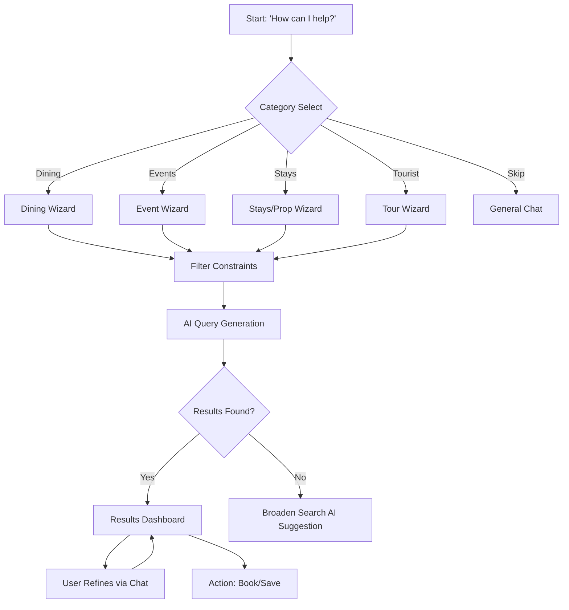
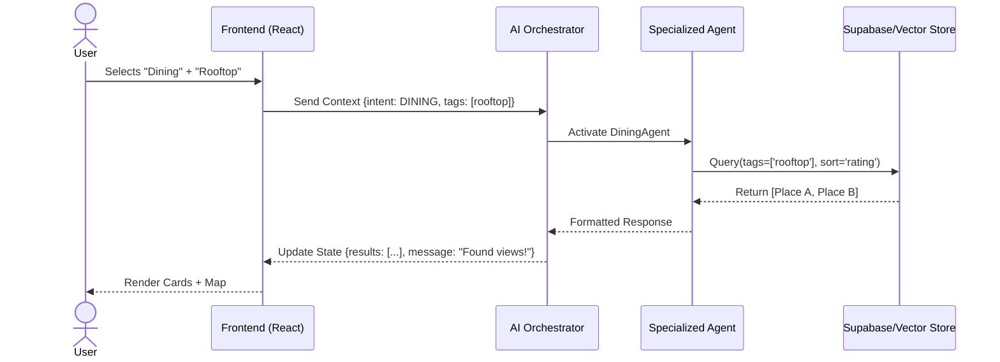

# AI Concierge Wizard: Implementation Plan

## Progress Tracker

| Phase | Status | Owner | Validation Check |
| :--- | :--- | :--- | :--- |
| **1. Design & Strategy** | **In Progress** | Design/UX | [ ] Wireframes Approved |
| **2. Core AI Logic** | Not Started | AI Lead | [ ] Agent Response Test |
| **3. Frontend Implementation** | Not Started | Frontend | [ ] Component Interaction |
| **4. Integration** | Not Started | Backend | [ ] Data Persistence |
| **5. QA & Polish** | Not Started | QA | [ ] User Acceptance |

---

## 1. Product Goal (Short Summary)

**Core Problem:** Visitors to Medellín struggle to filter through noise to find truly high-quality, safe, and luxury experiences tailored to their specific tastes.
**Primary Users:** High-net-worth individuals, expats, and luxury travelers seeking effortless planning.
**Desired Outcome:** A frictionless, "chat-optional" wizard that captures intent instantly and delivers curated, bookable itineraries.

**Success Metric:** Time-to-value (User lands → High-quality recommendation) < 30 seconds.

---

## 2. Feature & Task Matrix

| Feature | Type | User Value | AI Used | Screens Involved | Status |
| :--- | :--- | :--- | :--- | :--- | :--- |
| **Category Selection** | Core | Instant scoping of intent | Intent Classification | Entry (Mode Select) | Ready for Dev |
| **Context Filters** | Core | Refines search without typing | Context Injection | Event/Dining/Stay Filters | Planning |
| **AI Recommendation Engine** | Core | Personalized matching | Gemini 3 Flash/Pro | Results Dashboard | Planning |
| **Interactive Map** | Advanced | Spatial context for planning | Geospatial Grounding | Explorer / Results | Planning |
| **Natural Language Search** | Advanced | Handle complex queries | NLP / Semantic Search | Chat Overlay | Planning |
| **Itinerary Persistence** | Core | Save progress across sessions | LocalStorage/Supabase | Dashboard | In Progress |

---

## 3. User Journeys (Systematic)

### 1. First-Time User (The "Explorer")
- **Entry:** "How can I help you today?" Modal.
- **Flow:** Selects "Dining" → Selects "Rooftop" & "Tonight" → View Top 3 Recommendations.
- **User Actions:** Taps category, taps 2 filters, clicks "Reserve".
- **AI Actions:** Filters DB for 'Rooftop' + 'Open Tonight', ranks by luxury score.
- **Outcome:** A confirmed reservation suggestion in under 1 minute.

### 2. Returning User (The "Planner")
- **Entry:** Dashboard "My Trips".
- **Flow:** Clicks "Add to Trip" → Selects "Events" → Asks AI "What's good near my hotel?".
- **User Actions:** Contextual query, Drag-and-drop to itinerary.
- **AI Actions:** Retrieves hotel location context, performs geospatial search for events.
- **Outcome:** Seamless addition of an event to an existing plan.

### 3. Power User (The "Investor")
- **Entry:** "Stays" / Real Estate Mode.
- **Flow:** Selects "Purchase" → "El Poblado" → "High Yield".
- **User Actions:** filters by ROI, requests "Market Analysis Report".
- **AI Actions:** Generates dynamic ROI calculation, fetches market comps.
- **Outcome:** Detailed investment brief generated on the fly.

---

## 4. UI / UX Screens & Wireframes

### Screen 1: Category Selection (Entry)
*   **Purpose:** Disambiguate user intent immediately.
*   **Key Sections:**
    *   Header: "How can I help you today?"
    *   Grid: Dining, Events, Stays, Tourist.
    *   Footer: "Skip to General Chat".
*   **Primary CTA:** Category Card Tap.
*   **AI Feature:** Pre-loads context for the selected agent.
*   **Next Screen:** Specific Filter Wizard (e.g., Dining Preferences).

### Screen 2: Dynamic Filter Wizard
*   **Purpose:** Collect constraints without forcing text input.
*   **Key Sections:**
    *   Chips: "Tonight", "Weekend", "Vibe", "Price".
    *   Location: "Near Me" vs "Neighborhood".
    *   Smart Input: "Anything specific?" (Optional text).
*   **Primary CTA:** "Show Recommendations".
*   **AI Feature:** Gemini Flash for instant tag matching.
*   **Next Screen:** Results Dashboard.

### Screen 3: Results Dashboard (Map + List)
*   **Purpose:** Browsing and decision making.
*   **Key Sections:**
    *   Split View: Map (Left/Top) vs Cards (Right/Bottom).
    *   Chat Overlay: Floating AI assistant for refinements.
    *   Card Actions: Save, Book, Share.
*   **Primary CTA:** "Book Now" or "Add to Itinerary".
*   **AI Feature:** Ranking logic, dynamic "Why this matches" text.

---

## 5. Forms, Chatbots & AI Interaction

### Forms (The "No-Form" Form)
Instead of standard inputs, use **Progressive Disclosure**:
1.  **Tap:** "Dining"
2.  **Slide:** Budget Range
3.  **Tap:** "Sushi"
*   **AI Smart Autofill:** If user says "Dinner tonight in Poblado" in chat, auto-fill the form filters.

### Chatbots (Context-Aware Overlay)
*   **Role:** The "Concierge" that lives on top of the UI.
*   **Behavior:**
    *   Doesn't just talk; *drives* the UI.
    *   User: "Show me cheaper options." -> AI: Updates filters to $$ and re-renders list.
*   **Feedback:** "Searching top-rated spots..." (Spinner) -> "Found 3 hidden gems."

---

## 6. AI Features (Core vs Advanced)

### Core AI Features
1.  **Intent Classification:** Instantly routing "I'm hungry" to the Dining Agent.
2.  **Smart Filtering:** Converting natural language ("places with a view") into database queries (`tags: ['rooftop', 'scenic']`).
3.  **Personalized Ranking:** Sorting results based on user history (e.g., prefers quiet over loud).

### Advanced AI Features
1.  **Dynamic Itinerary Generation:** "Build me a full Saturday" -> Generates a time-slotted plan with travel times.
2.  **Investment Analysis Agent:** Real-time calculation of Cap Rates for properties based on scraped data.
3.  **Cross-Modal Grounding:** Verifying "Open Now" status via live Google Maps data API.

---

## 7. AI Agents, Functions & Tools

### Orchestrator Agent (Gemini 3 Flash)
*   **Trigger:** User Input or Mode Selection.
*   **Role:** Traffic controller. Decides if query is for Dining, Real Estate, or General.

### Specialized Agents
1.  **Dining Agent**
    *   **Tools:** `searchRestaurants(cuisine, location)`, `checkAvailability(id, time)`.
    *   **Output:** List of `Restaurant` objects.
2.  **Event Agent**
    *   **Tools:** `fetchEvents(date, type)`, `getTicketLink(id)`.
    *   **Output:** List of `Event` objects.
3.  **Property Agent**
    *   **Tools:** `searchProperties(price, type)`, `calculateROI(price, rent)`.
    *   **Output:** List of `Property` listings with financial data.

---

## 8. Workflows (End-to-End)

### Workflow A: "Tonight's Plan" (Simple)
1.  **User:** Taps "Events" -> "Nightlife" -> "Tonight".
2.  **Screen:** Filter Wizard.
3.  **AI:** Queries event DB for `date=today` AND `category=nightlife`.
4.  **Result:** Shows 3 VIP club events in El Poblado.

### Workflow B: "The Weekend Getaway" (Medium)
1.  **User:** Taps "Tourist" -> Selects "Guatapé" -> "Private Tour".
2.  **Screen:** Experience Detail.
3.  **AI:** Checks weather for Guatapé, suggests "Saturday is sunny".
4.  **Tool:** Calls `checkTourAvailability`.
5.  **Result:** "Private boat available Saturday 10 AM. Book?"

### Workflow C: "Relocation Scout" (Complex)
1.  **User:** Chat: "I want to buy a condo near a good gym and coworking."
2.  **Screen:** Real Estate Explorer (Map View).
3.  **AI:** 
    *   Identifies intent: `Buy`.
    *   Filters: `Condo`.
    *   Spatial Query: `Property` WITHIN 500m of `Gym` AND `Coworking`.
4.  **Result:** Map pins highlight 4 specific buildings matching criteria.

---

## 9. DIAGRAMS (MANDATORY)

### 1. Flowchart: High-Level User Flow

### 2. Sequence Diagram: Interaction Order

---

## 10. Real-World Use Cases

1.  **The "Last Minute" Diner:**
    *   *Situation:* It's 7 PM Friday. User needs a table for 4.
    *   *Goal:* Book immediately.
    *   *AI Action:* Filters for `reservations_available: true` instantly.

2.  **The "Digital Nomad" House Hunter:**
    *   *Situation:* Needs 1-month rental with fast WiFi.
    *   *Goal:* Secure accommodation.
    *   *AI Action:* Scans reviews for "WiFi speed" mentions and filters results.

3.  **The "Bachelor Party" Organizer:**
    *   *Situation:* Needs large group dinner + club entry.
    *   *Goal:* Build itinerary.
    *   *AI Action:* Suggests large-format steakhouses near top clubs.

4.  **The "Architecture Buff":**
    *   *Situation:* Wants to see specific building styles.
    *   *Goal:* Educational tour.
    *   *AI Action:* Filters Tourist spots by tag `Brutalist` or `Colonial`.

5.  **The "Crypto Investor":**
    *   *Situation:* Looking to park capital.
    *   *Goal:* High appreciation property.
    *   *AI Action:* Sorts properties by `price_per_sqm` ascending in high-growth zones.

---

## 11. Content & Microcopy

*   **Headline:** "Effortless Luxury. Intelligent Design."
*   **Helper Text:** "Tell us what you love, we'll handle the rest."
*   **Empty State:** "We couldn't find an exact match, but here are some popular alternatives."
*   **AI Thinking:** "Curating the best options for you..."
*   **CTA:** "Secure Your Spot" (Psychologically stronger than "Book").

---

## 12. Implementation Plan

### Phase 1: Core UI & Mode Selection (Current)
*   [ ] Implement `ModeSelection` Modal (Completed).
*   [ ] Build Wizard Container Component.
*   [ ] Create static data mocks for each category.

### Phase 2: Logic & State
*   [ ] Connect `AIContext` to Wizard selections.
*   [ ] Implement `useFilters` hook for managing constraints.
*   [ ] Build dynamic query generator (Filters -> AI Prompt).

### Phase 3: Integration (Supabase)
*   [ ] Create Tables: `properties`, `events`, `venues`.
*   [ ] Implement Vector Search for semantic matching.
*   [ ] Connect "Save" button to User Dashboard.

---

## 13. Acceptance Tests

*   **Given** a user is on the Mode Selection screen,
*   **When** they click "Dining",
*   **Then** the UI should transition to the Dining Filter Wizard without a full page reload.

*   **Given** a user has selected "Rooftop" filters,
*   **When** they click "Find",
*   **Then** the results list should only show venues with `tag: rooftop`.

---

## 14. Troubleshooting

*   **Issue:** AI returns hallucinations (fake restaurants).
*   **Fix:** Strict `Grounding` - AI only selects from the pre-approved database ID list.
*   **Issue:** Map pins don't load.
*   **Fallback:** Switch to List View automatically and show toast notification.

---

## 15. Production-Ready Checklist

*   [ ] **Responsive:** Tested on iPhone SE, Pixel, iPad, Desktop.
*   [ ] **Accessibility:** All form inputs have labels; Aria-live for AI updates.
*   [ ] **Performance:** Images lazy-loaded; Map loaded only on demand.
*   [ ] **Error Handling:** Graceful failure if AI API times out.
*   [ ] **Security:** RLS policies applied to all database queries.

---

## 16. Prompt List (Sequential)

1.  `Design the 'Category Selection' modal using Tailwind grid, ensuring a luxury 'Soft Cream' and 'Emerald' aesthetic.`
2.  `Create a React hook 'useWizardNavigation' to handle transitions between Filter steps and Results.`
3.  `Define a TypeScript interface for 'Venue' that includes AI-friendly tags and metadata.`
4.  `Generate a Mermaid.js flowchart showing the decision tree for the 'Dining' workflow.`
5.  `Write a System Prompt for the AI Concierge that enforces a 'premium, concise, and helpful' tone.`
