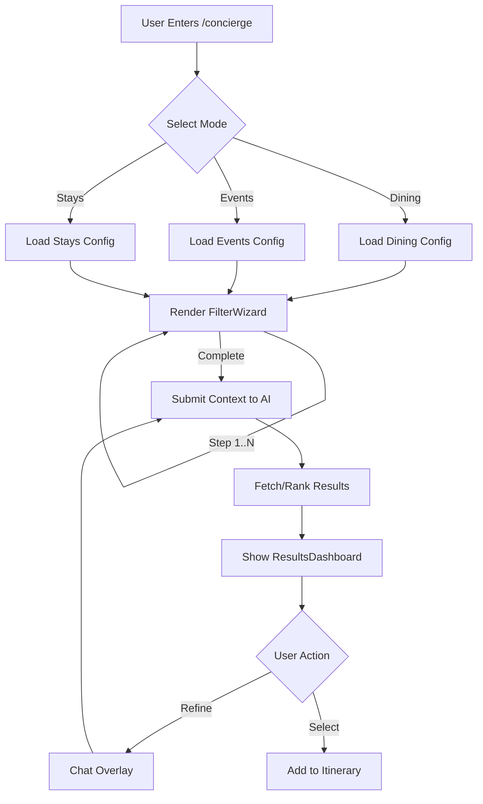
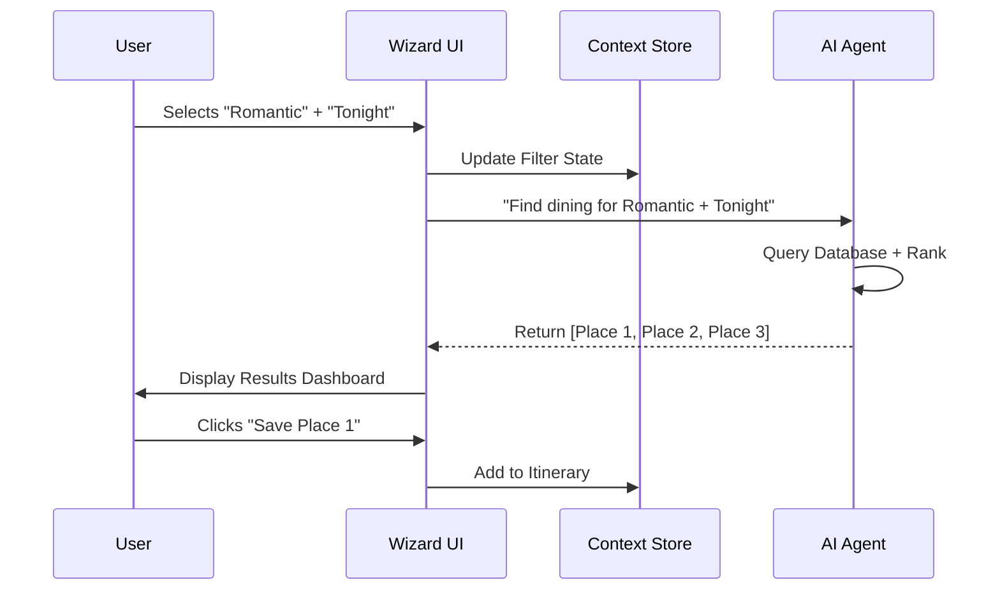

# AI Concierge Wizard: Mega-Prompt Sequence

## Progress Tracker

| Phase | Status | Owner | Validation Check |
| :--- | :--- | :--- | :--- |
| **1. Prompt Engineering** | **Complete** | AI Lead | [x] Sequential Logic Verified |
| **2. UI Generation** | Pending | Design | [ ] Components Rendered |
| **3. Logic Integration** | Pending | Backend | [ ] Workflows Tested |

---

## 1. Product Goal (Short Summary)
**Objective:** Generate a complete set of "Mega-Prompts" that will instruct an AI (or developer) to build the entire "Medellín AI Concierge" platform step-by-step.
**Strategy:** Each prompt is self-contained but builds on the previous one, covering Design System, Component Architecture, AI Logic, and Route Integration.
**Outcome:** A sequential execution plan that results in a fully functional, luxury React application.

---

## 2. Feature & Task Matrix (Prompt Strategy)

| Prompt ID | Target Feature | Type | Output |
| :--- | :--- | :--- | :--- |
| **P0** | Global State Schema | Architecture | `types/wizard.ts` + `store.ts` |
| **P1** | Design System | Foundation | Global CSS / Tailwind Config |
| **P2** | Layout Shell | UI Structure | `AppLayout.tsx` |
| **P3** | Wizard Engine | Core Logic | `useWizard.ts` + Context |
| **P4** | Category UI | UI Screen | `ModeSelection.tsx` |
| **P5** | Filter Flows | UI + Logic | `FilterSteps.tsx` |
| **P6** | Results & Map | Dashboard | `ResultsView.tsx` |
| **P7** | AI Integration | Backend/Context | `AIContext.tsx` Updates |

---

## 3. The Mega-Prompts (Sequential Execution)

### PROMPT 0: The State Architecture (Schema & Types)
> **Goal:** Define the single source of truth for the application state to prevent integration drift between Wizard, Results, Map, and Chat.

```markdown
**ACT AS:** System Architect & TypeScript Expert.
**TASK:** Define the global state schema and TypeScript interfaces for the "Medellín AI Concierge".
**OBJECTIVE:** Create a unified type system that ensures the Wizard, Results, Map, and Chat components speak the same language.
**REQUIREMENTS:**
1.  **UserIntent:** Define a union type for intents (DINING, EVENTS, STAYS, TOURIST, GENERAL).
2.  **Filters:** Create a flexible `FilterState` interface that supports:
    *   Tags (string[])
    *   DateRange (start/end)
    *   Budget (min/max)
    *   Location (lat/lng/radius)
3.  **Results:** Define the `Venue` entity interface including:
    *   Metadata (id, name, type)
    *   Rich Content (images, description, rating)
    *   AI Analysis (matchScore, reasoningText)
4.  **UIState:** Define interface for Wizard progress (currentStep, totalSteps, isComplete).
5.  **AIEvents:** Define the action types the AI can trigger (e.g., `SET_FILTERS`, `NAVIGATE_TO`, `SHOW_TOAST`).
**OUTPUT:** A single comprehensive `types/wizard.ts` file and a suggested Zustand or Context structure.
```

---

### PROMPT 1: The Luxury Foundation (Design System)
> **Goal:** Establish the visual language, typography, and core Tailwind classes for the "Soft Cream & Emerald" aesthetic.

```markdown
**ACT AS:** Senior UI/UX Designer & Frontend Architect.
**TASK:** Create the foundational Design System for "Medellín AI Concierge".
**STYLE:** Luxury, Minimalist, "Soft Cream" (#FDFBF7) background, "Emerald" (#064E3B) accents, Gold (#D97706) highlights.
**REQUIREMENTS:**
1.  **Typography:** Define a Serif font (e.g., 'Playfair Display') for Headings and Sans (e.g., 'Inter') for UI text.
2.  **Color Palette:** Extend Tailwind theme with `bg-cream`, `text-emerald-900`, `border-gold-500`.
3.  **Core Components:**
    *   `LuxuryCard`: A card with soft shadow, hover lift, and subtle border.
    *   `GlassButton`: A button with backdrop-blur and thin borders.
    *   `SectionHeading`: Standardized elegant headers.
4.  **Output:** Provide the raw CSS/Tailwind definitions and the React code for these 3 core components.
**CONSTRAINT:** Ensure all interactive elements have a "premium" feel (slow transitions, subtle scales).
```

---

### PROMPT 2: The Wizard Shell (Layout & Routes)
> **Goal:** Build the container that holds the application, ensuring responsive navigation and route structure.

```markdown
**ACT AS:** React Router Specialist.
**TASK:** Implement the core Application Shell and Routing structure.
**CONTEXT:** We are building a Wizard-based app.
**REQUIREMENTS:**
1.  **Routing:** Define routes for:
    *   `/` (Landing)
    *   `/concierge` (The Wizard Entry)
    *   `/itinerary` (Planning)
    *   `/results` (Dashboard)
2.  **Layout:** Create a `WizardLayout` component that includes:
    *   A persistent, elegant Progress Bar (top).
    *   A calm, distraction-free container for content.
    *   A "Quick Exit" button to return home.
3.  **Transitions:** Use `framer-motion` to animate page transitions (fade-in, slide-up).
**OUTPUT:** The `App.tsx` router configuration and the `WizardLayout.tsx` component.
```

---

### PROMPT 3: The "Mode Selection" (Entry Screen)
> **Goal:** Create the visually stunning entry point where users choose their path (Dining, Events, Stays).

```markdown
**ACT AS:** Visual Interface Designer.
**TASK:** Design and Code the `ModeSelection` screen.
**USER JOURNEY:** The user enters and is asked "How can I help you?". They select a category.
**UI SPECS:**
1.  **Grid Layout:** A 2x2 responsive grid (1 col mobile, 2 cols desktop).
2.  **Cards:**
    *   **Dining:** Icon: Utensils. Label: "Gastronomy". Desc: "Reservations & Hidden Gems".
    *   **Events:** Icon: Ticket. Label: "Culture & Nightlife". Desc: "VIP Access & Lists".
    *   **Stays:** Icon: Bed. Label: "Luxury Stays". Desc: "Villas & Penthouses".
    *   **Tourist:** Icon: Map. Label: "Experiences". Desc: "Tours & Day Trips".
3.  **Interactivity:**
    *   Hover: Card expands slightly, border turns Gold.
    *   Click: Ripples and navigates to `/wizard/{category}`.
**OUTPUT:** Full React component `ModeSelection.tsx` using the `LuxuryCard` component.
```

---

### PROMPT 4: The Intelligent Filter Wizard (Dynamic Forms)
> **Goal:** Create the "No-Form" Form. A series of steps that feels like a conversation, not a survey.

```markdown
**ACT AS:** Interaction Designer.
**TASK:** Build the `FilterWizard` generic component.
**LOGIC:** This component takes a `config` object (steps, options) and renders the UI.
**UI ELEMENTS:**
1.  **Input Chips:** Selectable pills for quick tags (e.g., "Romantic", "Party", "Business").
2.  **Sliders:** Clean, minimal range sliders for Price/Budget.
3.  **Date Picker:** A custom, simplified date selector (Tonight, This Weekend, Custom).
4.  **Stepper:** Visual indicator of current step (e.g., "Step 2 of 3").
**EXAMPLE USE CASE:**
*   Step 1: "What is the vibe?" [Chill] [Energetic] [Romantic]
*   Step 2: "Who is coming?" [Solo] [Couple] [Group]
**OUTPUT:** The `FilterWizard` component and a sample configuration for the "Dining" flow.
```

---

### PROMPT 5: The Results Dashboard (Map + List)
> **Goal:** The complex view where users see their recommendations. Needs to handle Map and List states gracefully.

```markdown
**ACT AS:** Full Stack UI Engineer.
**TASK:** Implement the `ResultsDashboard` screen.
**LAYOUT:**
*   **Desktop:** Split screen. Left 60% = Interactive Map. Right 40% = Scrollable List of Cards.
*   **Mobile:** Tabbed view. Toggle between [Map] and [List] via a floating bottom bar.
**COMPONENTS:**
1.  **ResultCard:** Horizontal card showing Image, Title, Rating, Price, and "Add to Itinerary" button.
2.  **MapMarkers:** Custom pins (Gold for top match, Silver for others).
3.  **AI Insight:** A prominent text block at the top: "I found 3 places matching 'Rooftop' near you."
**OUTPUT:** `ResultsDashboard.tsx` handling mock data and responsive switching.
```

---

### PROMPT 6: The AI Chat Overlay (Context & Action)
> **Goal:** The "Concierge" aspect. A floating chat that knows what the user is looking at.

```markdown
**ACT AS:** AI UX Specialist.
**TASK:** Create the `ContextualChat` overlay.
**BEHAVIOR:**
*   Floating button (bottom-right) expands into a chat window.
*   **Context Aware:** If user is on "Dining Results", the chat initial prompt is "Want to refine these results by cuisine or price?"
*   **Actionable:** Chat can emit events like `UPDATE_FILTERS` or `ADD_ITEM`.
**UI:**
*   Glassmorphism background.
*   "Typing..." animation.
*   Distinct bubbles for User vs AI (Emerald vs Cream).
**OUTPUT:** `ChatOverlay.tsx` and the `useAIContext` hook integration.
```

---

## 4. Mermaid Diagrams (For Visualization)

### Flowchart: The Wizard Logic


### Sequence: AI Data Flow


---

## 5. Content & Microcopy Guidelines

*   **Tone:** Helpful, Sophisticated, Brief.
*   **Empty States:** Never say "No results". Say "We're curating more options for this category. In the meantime, try..."
*   **Loading:** "Consulting our local experts..." instead of "Loading...".
*   **Buttons:** Use Action + Benefit. E.g., "Reveal Hidden Gems" instead of "Search".

---

## 6. Real-World Use Cases (Validation)

1.  **The "Impatient VIP":** Uses the **Mode Selection** (P3) to tap "Dining" and **Filter Wizard** (P4) to select "Fine Dining" + "Near Me". Expects results in <10 seconds.
2.  **The "Visual Planner":** Skips filters, goes to **Results Dashboard** (P5) and browses the Map to find venues near their hotel.
3.  **The "Indecisive Traveler":** Uses the **Chat Overlay** (P6) to ask "Which of these has the best sunset view?" and lets AI filter the list.

---

## 7. Implementation Checklist

*   [ ] Run **Prompt 0** to define the global Types and Schema.
*   [ ] Run **Prompt 1** to set up `globals.css` and base components.
*   [ ] Run **Prompt 2** to establish the router and layout shell.
*   [ ] Run **Prompt 3** to build the Entry Screen.
*   [ ] Run **Prompt 4** to build the dynamic Filter mechanism.
*   [ ] Run **Prompt 5** to create the Map/List view.
*   [ ] Run **Prompt 6** to connect the AI Chat.
*   [ ] **Final Polish:** Verify animations and mobile responsiveness.
