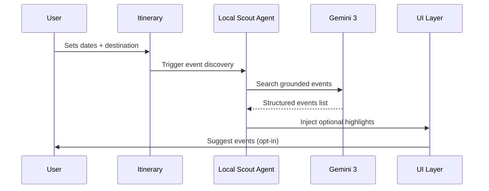
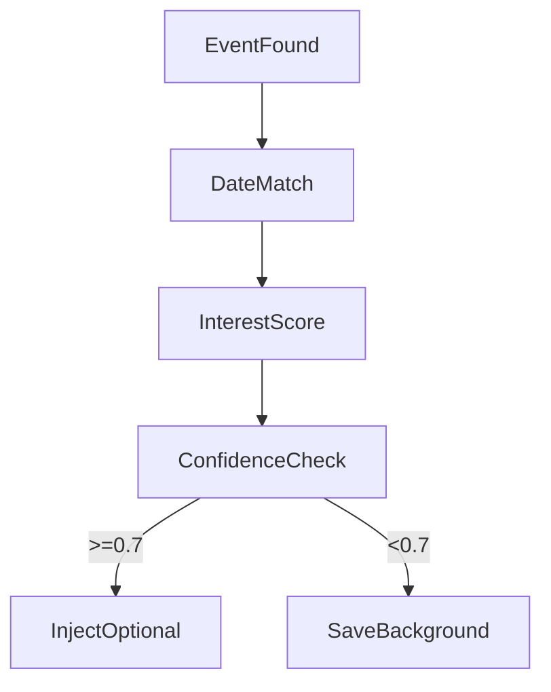

# LOCAL SCOUT AGENT
## Date-Specific Events Discovery for Trips

Creates “I didn’t know that!” moments by discovering concerts, festivals, pop-ups, and cultural events during a user’s exact travel dates — and injecting them as optional highlights into the itinerary.

---

### 0. Progress Tracker (TOP OF FILE)

| Phase | Status | Owner | Validation |
| :--- | :--- | :--- | :--- |
| **Agent Logic Design** | Not Started | AI | Sources grounded + schema validated |
| **UI / UX Design** | Not Started | Design | Mobile + Desktop reviewed |
| **Event Discovery** | Not Started | AI | Date + location accuracy |
| **Injection Logic** | Not Started | Product | No itinerary conflicts |
| **Production Readiness** | Not Started | Eng | Fallbacks + caching |

---

### 1. Product Goal (Short Summary)

**Help travelers discover real, local, date-specific events happening during their trip** — without searching social media, blogs, or event sites manually.

**Outcome**
*   Delight users
*   Increase itinerary richness
*   Differentiate from static travel planners

---

### 2. Core Value Proposition

| Before Local Scout | After Local Scout |
| :--- | :--- |
| Generic attractions | Time-aware events |
| Timeless recommendations | City-specific culture |
| User must search manually | Optional, non-intrusive highlights |

---

### 3. User Journey (End-to-End)



---

### 4. Information Architecture (New Pages & Components)

**New Pages**
*   `/itinerary/:id/events` → **Local Events Hub**
*   `/event/:eventId` → **Event Detail Sheet**

**Embedded Sections**
*   Itinerary feed → “Local Highlights” block
*   Map overlay → event pins (temporary)

---

### 5. UI / UX Layout (Responsive)

**Desktop (3-Column)**
`| Filters | Event Cards | Map |`

**Tablet**
```
| Event Cards |
| Map Drawer |
```

**Mobile**
```
[ Event Highlights ]
[ Swipe Cards ]
[ Map (toggle) ]
```

---

### 6. Wireframe Sections (Figma Instructions)

#### Section A — Local Highlights (Injected Block)
*   **Placement**: Appears between Day sections. Soft visual distinction (not dominant).
*   **Card Content**:
    *   Event name
    *   Date + time
    *   Category badge (Music, Culture, Food)
    *   “Why this matters” (AI explanation)
*   **Actions**:
    *   Add to itinerary
    *   Save for later
    *   Dismiss

#### Section B — Events Hub Page
*   **Header**: “Happening while you’re in Medellín”
*   **Filters**: Date (auto-bounded), Category, Distance, Crowd size
*   **Cards**: Illustrated (poster / venue image), Lift on hover, Pulse badge if “Tonight” or “Limited”

#### Section C — Event Detail Sheet
*   **Layout**: Image hero, Event summary, When / Where, How it fits your trip, Add to itinerary CTA

---

### 7. Visual Design System (Style Guide Extract)

*   **Typography**:
    *   Headings: Editorial serif / premium display
    *   Body: Clean sans-serif
    *   Dates: Tabular numerals
*   **Cards**: Rounded (12–16px), Soft elevation, No flat borders
*   **Color**: Neutral base, One accent for “Live / Temporary”, No alert red unless urgent

---

### 8. Micro-Interactions
*   Card hover → lift + glow
*   “Add to itinerary” → success check + subtle animation
*   Dismiss → fade, never snap

---

### 9. AI Agent Logic (Gemini 3)

**Agent: Local Scout**

**Inputs**
```json
{
  "city": "Medellín",
  "start_date": "2026-01-14",
  "end_date": "2026-01-19",
  "user_interests": ["culture", "music", "local"]
}
```

**Tools Used (Gemini 3)**
| Capability | Usage |
| :--- | :--- |
| **Gemini 3 Pro** | Reasoning + filtering |
| **Gemini 3 Flash** | Fast refresh / regeneration |
| **Google Search Grounding** | Find real events |
| **Google Maps Grounding** | Validate venues |
| **URL Context Tool** | Read event pages |
| **Structured Outputs** | Safe UI injection |
| **Interactions API** | Stateful discovery |
| **Deep Research** | Festival & city calendars |

**Structured Output Schema (Required)**
```json
{
  "events": [
    {
      "id": "evt_001",
      "title": "Live Salsa Night at Son Havana",
      "date": "2026-01-16",
      "time": "8:00 PM",
      "location": {
        "name": "Son Havana",
        "lat": 6.2442,
        "lng": -75.5812
      },
      "category": "Music",
      "why_recommended": "Matches your interest in nightlife and local culture",
      "confidence": 0.82
    }
  ]
}
```

---

### 10. Automation Rules (Injection Logic)



**Rules**
1.  Never auto-book
2.  Never block itinerary
3.  Always explain why

---

### 11. Core vs Advanced Features

**Core (MVP)**
*   Date-specific events
*   Optional injection
*   Explainability
*   Manual add/remove

**Advanced**
*   Event reminders
*   Crowd level prediction
*   Rain-aware suggestions
*   Ticket price alerts

---

### 12. Routes & Navigation
*   `/itinerary/:id` → Highlights inline
*   `/itinerary/:id/events` → Browse all
*   `/event/:id` → Detail sheet (modal on mobile)

---

### 13. Success Criteria
*   ≥60% of users interact with at least one event
*   ≥30% add at least one event
*   Zero itinerary conflicts caused by agent
*   Events always within travel dates

---

### 14. Production-Ready Checklist
*   [ ] Grounded sources only
*   [ ] Fallback when no events found (“Nothing major this week — here are timeless picks”)
*   [ ] Caching per city/date
*   [ ] Kill-switch for agent
*   [ ] Logged explanations

---

### 15. Figma Make — FINAL PROMPT (COPY-PASTE)

Design a Local Events Discovery experience for a premium AI travel planner.
The UI must feel editorial, calm, and intelligent.
Create mobile-first wireframes, event cards, injected itinerary highlights, and an events hub page.
Emphasize explainability (“Why this event”) and optionality.
No clutter. No urgency traps.
Treat this as a concierge whisper, not a notification.
