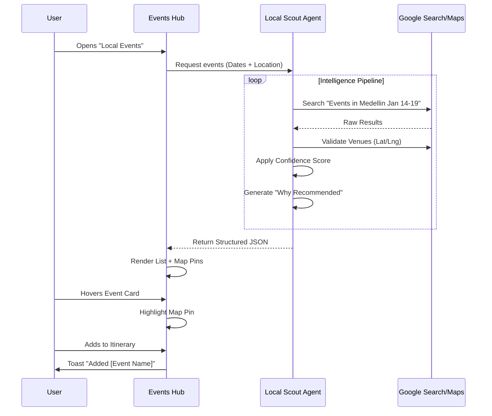

# Local Scout Agent: Phase 2 Design & Intelligence Plan

This document outlines the detailed design, schema updates, and AI workflows required to move the Local Scout Agent from "Mock Prototype" to "Intelligent Production" state.

---

## 1. 🏗️ Data Schema & TypeScript Interfaces

To support the "Strict JSON" requirement and Map functionality, we must upgrade our data model.

### **Updated Interface (`LocalEvent`)**
```typescript
export interface LocalEvent extends FeedItem {
  // Core Data
  date: string;          // "Jan 16" (Display)
  isoDate: string;       // "2026-01-16" (Sorting)
  time: string;          // "20:00"
  endTime?: string;      // Optional
  
  // Location Intelligence
  venue: {
    name: string;
    address: string;
    lat: number;         // Required for Map
    lng: number;         // Required for Map
    placeId?: string;    // Google Place ID
  };

  // Actionability
  booking_url?: string;  // Official ticket link
  source_urls: string[]; // Citations
  price_level: 'Free' | '$' | '$$' | '$$$' | 'Unknown';

  // AI Logic
  why_recommended: string; // 1-sentence personalized pitch
  confidence: number;      // 0.0 - 1.0
  flags?: {
    time_uncertain?: boolean;
    venue_uncertain?: boolean;
  };
}
```

---

## 2. 🎨 Visual UI/UX Design System

### **A. Intelligent Event Card (Enhanced)**
*   **Visual Hierarchy**:
    1.  **Image**: High-quality aspect-ratio cover.
    2.  **Badge Overlay**: "Top Match" (if confidence > 0.9) or "Rare Find".
    3.  **Content**:
        *   **Title**: Bold, truncated to 2 lines.
        *   **Meta Row**: `📅 Date` • `📍 Neighborhood` • `💲 Price`.
        *   **AI Insight**: A distinct, light-colored background block (e.g., `bg-emerald-50`) containing the `why_recommended` text with a small spark icon.
    4.  **Action Footer**: "View Details" (Secondary) vs "Add to Trip" (Primary Icon).

### **B. Map-First Discovery Layout (Events Hub)**
*   **Mobile Layout**:
    *   **Floating Toggle**: "List | Map" pill at the bottom center.
    *   **Map View**: Full screen map. Cards appear as a horizontal swipeable carousel at the bottom when a pin is clicked.
*   **Desktop Layout**:
    *   **Split View**: 
        *   **Left (40%)**: Scrollable list of cards with filters.
        *   **Right (60%)**: Sticky map showing all visible events.
    *   **Hover Interaction**: Hovering a card on the left highlights the pin on the right (scale up + color change).

### **C. Trust & Confidence Indicators**
*   **Confidence Score**: Visualized not as a raw number, but as a "Match Strength" ring or bar.
*   **Source Transparency**: "Verified via [Source Name]" small text link in the Detail Sheet.

---

## 3. 🧠 AI Agent Workflows & Logic

### **User Journey: Discovery & Validation**



### **Confidence Scoring Logic (Frontend Utility)**
We need a client-side utility to color-code confidence:

*   **≥ 0.90 (Exceptional)**: Gold border/glow. Text: "Perfect Match".
*   **≥ 0.80 (High)**: Green indicator. Text: "Highly Recommended".
*   **< 0.80 (Good)**: Slate indicator. Text: "Suggested".

---

## 4. 🤖 Developer Prompts to Execute

Use these prompts to implement the changes step-by-step.

### **Prompt 1: Data Schema & Mock Update**
```text
Update `utils/mockTripData.ts` to implement the new `LocalEvent` interface. 
1. Add `venue` object (lat, lng, name, address).
2. Add `booking_url` and `price_level`.
3. Update `MOCK_LOCAL_EVENTS` to include real lat/lng coordinates for Medellin venues (e.g., Son Havana, Jardin Botanico) so they map correctly.
4. Ensure TypeScript errors are resolved.
```

### **Prompt 2: Visual Polish - Event Card**
```text
Refactor `EventCard.tsx` to match the "Intelligent Event Card" design:
1. Add a dedicated "AI Insight" section below the title using `bg-emerald-50` and text-xs.
2. Display the `venue.name` and `price_level` clearly.
3. Add a "Confidence Ring" or simple badge if confidence > 0.85.
4. Ensure the image uses `Aspect Ratio` component for consistency.
```

### **Prompt 3: Map Discovery Mode**
```text
Update `LocalEventsHub.tsx` to support a Split View (List + Map):
1. On Desktop: Render `PlannerMap` (reuse existing) on the right side (50% width).
2. Pass the filtered `events` list to the map to render as pins.
3. Implement `onHover` logic: Hovering a card highlights the pin; Clicking a pin scrolls the list to the card.
4. On Mobile: Add a "Show Map" floating button that toggles a full-screen map view with a card carousel overlay.
```

### **Prompt 4: Map Pin Logic**
```text
Update `PlannerMap.tsx` to handle "Prospective Events":
1. Accept an optional `events` prop (Array of LocalEvent).
2. Render these events as different colored pins (e.g., Purple for nightlife, Orange for food) to distinguish them from "Booked Activities".
3. When an event pin is clicked, show a small Tooltip with the Event Title and a "Add" button inside the tooltip.
```

---

## 5. 📱 Responsive Wireframe Concepts

### **Mobile: The "Explorer" View**
```
+-----------------------------------+
|  < Back      Local Events         |
| [Filter] [Filter] [Filter]        |
+-----------------------------------+
|  [ Event Card 1                 ] |
|  [    Image    ] [ Title      ] |
|  [             ] [ AI Reason  ] |
+-----------------------------------+
|  [ Event Card 2                 ] |
|  ...                              |
+-----------------------------------+
|      ( Floating Action Button )   |
|         [ 🗺️ Map View ]          |
+-----------------------------------+
```

### **Desktop: The "Command Center" View**
```
+----------------------+---------------------------+
| Filter Bar           |                           |
|----------------------|                           |
| Event Card 1         |                           |
| [Image] Title        |        MAP AREA           |
| Why: ...             |                           |
| -------------------- |       📍       📍         |
| Event Card 2         |            📍             |
| [Image] Title        |                           |
| Why: ...             |      (Interactive)        |
|                      |                           |
+----------------------+---------------------------+
```
