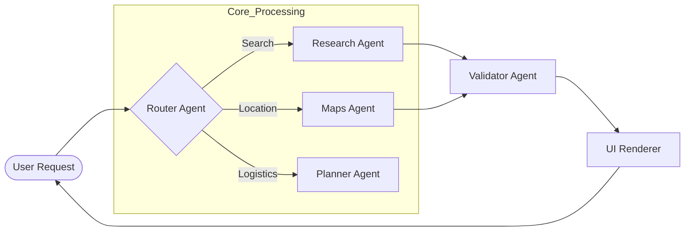
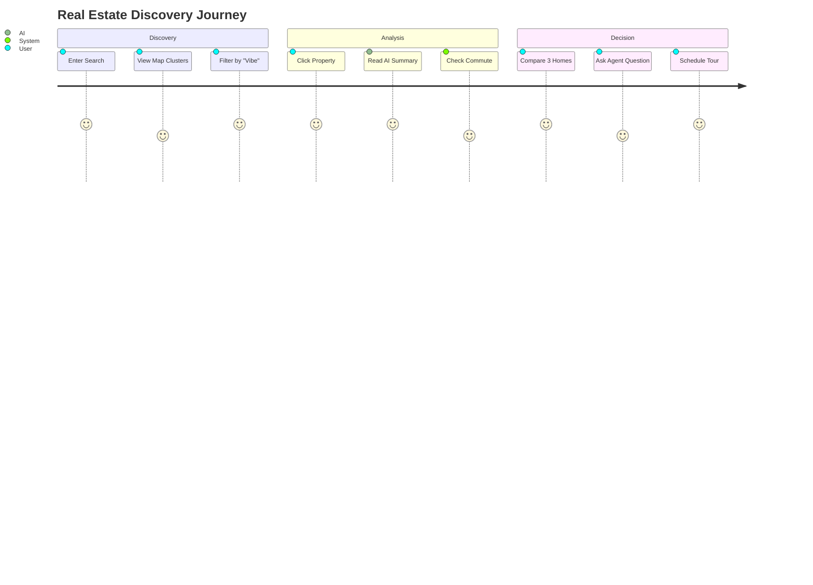
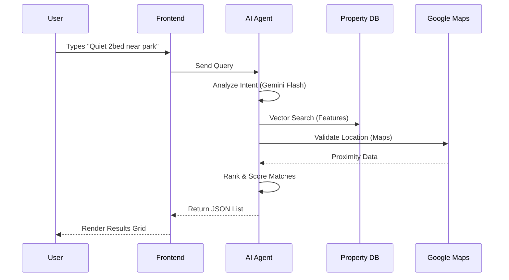
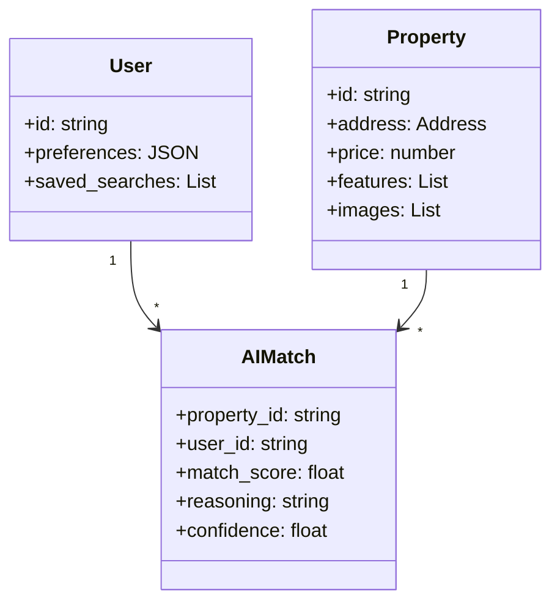
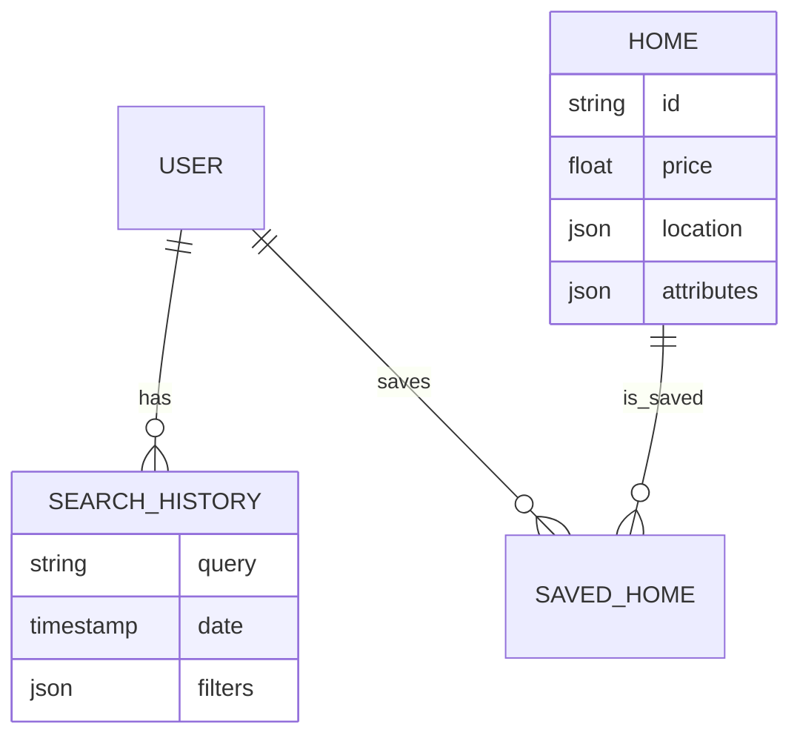

# 🧠 AI-Powered Real Estate Platform: Design & Architecture Spec

**Status:** Draft  
**Version:** 1.0  
**Date:** Dec 18, 2025  
**Tone:** Calm, Intelligent, Premium, Trustworthy

---

## 🏛 STEP 0 — SYSTEM ROLE & GOAL

**System Persona:** "The Architect"  
A Senior Product Designer and AI Systems Architect.

**Goal:**  
Design a production-ready AI platform UI that turns user intent into clear insights → decisions → actions → automation.

**Core Principles:**
*   **One Primary Action**: Every screen has a clear "Next Step".
*   **No Dead Ends**: Always offer similar items, refinements, or contact options.
*   **Explainable AI**: "Why this match?" must always be answered.
*   **Trust-First UX**: Verify data with sources (Grounding).
*   **Mobile-First**: Design for the thumb, scale to the mouse.
*   **Visual Clarity**: Data density without clutter.

---

## 🗺 STEP 1 — INFORMATION ARCHITECTURE & ROUTES

### Public Routes
*   `/` (Landing: Value Prop + Smart Search)
*   `/search` (Discovery: List/Grid + Filters)
*   `/map` (Exploration: Full-screen geospatial view)
*   `/compare` (Decision: Side-by-side analysis)
*   `/market-reports` (Data: Trends & Neighborhood stats)

### User Routes (Authenticated)
*   `/dashboard` (Overview: Feed of alerts & matches)
*   `/saved` (Collections: Favorites & Lists)
*   `/alerts` (Automation: Price drops & New listings)
*   `/settings` (Profile & AI Preferences)

### Wizard Routes (Modal/Focused View)
*   `/wizard/start` (Intent: Buy, Rent, Invest?)
*   `/wizard/preferences` (Needs: Beds, Budget, Vibe)
*   `/wizard/review` (Confirmation: "Did I get this right?")
*   `/wizard/processing` (AI Action: "Scouting...")
*   `/wizard/results` (Curated Match List)

**Routing Rules:**
1.  **Wizard Isolation**: No global navigation; only "Back" and "Close".
2.  **Primary CTA**: Every page must have one distinct primary button.
3.  **Nav Patterns**: Bottom bar for Mobile; Sidebar/Top-nav for Desktop.

---

## 🎨 STEP 2 — STYLE GUIDE (DESIGN SYSTEM)

### 1. Brand Tone
*   **Calm**: Soft backgrounds, no jarring alerts.
*   **Intelligent**: Crisp data visualization, serif headings.
*   **Premium**: Generous whitespace, high-quality imagery.

### 2. Typography
*   **Headings (Serif)**: *Playfair Display* or *Merriweather*. Represents confidence & tradition.
*   **Body/UI (Sans)**: *Inter* or *DM Sans*. Represents clarity & utility.

**Scale:**
*   **Display**: 48px/1.1 (Hero)
*   **H1**: 32px/1.2 (Page Titles)
*   **H2**: 24px/1.3 (Section Headers)
*   **H3**: 20px/1.4 (Card Titles)
*   **Body**: 16px/1.5 (Readable text)
*   **Small**: 14px/1.5 (UI Elements)
*   **Caption**: 12px/1.5 (Metadata)

### 3. Color Palette
*   **Primary**: `Emerald-900` (#064E3B) – Trust, Wealth, Nature.
*   **Secondary**: `Slate-500` (#64748B) – Neutral, Technical.
*   **Accent**: `Amber-400` (#FBBF24) – Insight, Opportunity (Use sparingly).
*   **Background**: `Slate-50` (#F8FAFC) – Paper-like, clean.
*   **Surface**: `White` (#FFFFFF) – Cards, Modals.
*   **Error**: `Rose-600` (#E11D48) – Critical alerts only.

### 4. Spacing & Shape
*   **Grid**: 8px baseline.
*   **Radius**: 
    *   `rounded-lg` (8px) for buttons/inputs.
    *   `rounded-2xl` (16px) for cards/modals.
*   **Shadows**: Soft, diffused shadows (`shadow-lg` for floating elements).

---

## 🧩 STEP 3 — COMPONENT LIBRARY

### Core Components

1.  **Buttons**
    *   *Primary*: Emerald-900 background, White text. Full width on mobile.
    *   *Secondary*: White background, Slate-200 border.
    *   *Ghost*: Text only, Emerald-700 hover.

2.  **Cards**
    *   *Property Card*: Image (16:9), Price (Bold), Address, Badges (AI Match %), Quick Actions (Heart, Share).
    *   *Insight Card*: Icon (Sparkle), Title, Summary text, "Learn More" link.
    *   *Stat Block*: Label (uppercase small), Value (Large Number), Trend Indicator (Green arrow).

3.  **Inputs**
    *   *Smart Search*: Large input with leading search icon. Auto-complete dropdown with "Smart Suggestions".
    *   *Filters*: Pills/Chips for quick selection.

4.  **AI Indicators**
    *   *Thinking*: Pulsing skeleton loader or specific "Scouting..." animation.
    *   *Verified*: Green checkmark with "Verified Source" tooltip.
    *   *Confidence*: Ring chart (0-100%).

5.  **Map Markers**
    *   *Pin*: Price bubble.
    *   *Selected*: Color invert + Bounce.
    *   *Cluster*: Circle with count.

---

## 🖥 STEP 4 — CORE PAGES (WIREFRAMES)

### A) Search / Discovery
*   **Header**: Search bar + "Ask AI" button.
*   **Filter Bar**: Price, Beds, "Lifestyle" (e.g., Near Parks).
*   **Layout**:
    *   *Desktop*: Split view (Map Left / Grid Right).
    *   *Mobile*: Stacked cards. Floating "Map" toggle button.
*   **Card Metadata**: "98% Match for [User Name]", "Quiet Street", "Great Schools".

### B) Map-First Exploration
*   **Interface**: Full-screen map.
*   **Overlays**: Heatmaps (Safety, Noise, Appreciation).
*   **Interactions**: Hover pin → Preview Card. Click pin → Open Drawer.
*   **AI Context**: "Why this area?" floating pill.

### C) Detail / Analysis
*   **Hero**: Gallery carousel.
*   **Key Facts**: Price, Sqft, Beds, Baths.
*   **AI Summary**: "Why we picked this for you" (Natural language generation).
*   **Pros/Cons**: Bullet points generated by AI (Grounding).
*   **Actions**: "Schedule Tour", "Ask Question", "Mortgage Calc".

### D) Compare
*   **Layout**: Side-by-side columns (Desktop) or Tab switching (Mobile).
*   **Smart Diff**: Highlight rows where properties differ significantly.
*   **Recommendation**: Banner at top: "Property A is better for investment due to..."

---

## 🪄 STEP 5 — MULTI-STEP WIZARD

**Flow**:
1.  **Start**: "What is your goal?" (Buy / Rent / Invest).
2.  **Preferences**: "Bedroom count?", "Budget range?".
3.  **Vibe**: "Modern?", "Historic?", "Near Nightlife?".
4.  **Constraints**: "Commute time?", "Pet friendly?".
5.  **AI Processing**: Animation of "Scanning market...", "Checking crime rates...", "Verifying schools...".
6.  **Results**: Top 3 curated options.

**Features**:
*   Progress bar (Dots).
*   "Save Progress" auto-save.
*   Natural language input option ("Just paste your requirements").

---

## 📊 STEP 6 — DASHBOARD & AUTOMATIONS

### Dashboard Modules
*   **Welcome**: "Good Morning, [User]. 3 New Matches today."
*   **Feed**: Timeline of new listings and price changes.
*   **Saved Collections**: Horizontal scroll of lists.
*   **Market Pulse**: Graph of price trends in interested areas.

### Automations
*   **Triggers**: "Notify me if [Property] drops below $500k".
*   **Smart Alerts**: Push notifications with AI reasoning ("Price dropped 5% - likely to sell fast").

---

## 🤖 STEP 7 — AI AGENTS ARCHITECTURE

### Agents Logic
1.  **Router Agent**: Classifies intent (Search vs. Support vs. Analysis).
2.  **Research Agent**: Queries vector DB + External APIs (MLS/Zillow).
3.  **Maps Agent**: Geospatial filtering (Commute times, Polygon search).
4.  **Planner Agent**: Schedules tours, organizes itinerary.
5.  **Validator Agent**: Checks data freshness (Grounding).



---

## 🧠 STEP 9 — GEMINI FEATURES MAPPING

| Feature | Gemini Model | Purpose |
| :--- | :--- | :--- |
| **Smart Search** | Gemini Flash | Fast query understanding & autocomplete suggestions. |
| **Property Summary** | Gemini Pro | Generating "Pros/Cons" & "Why this home matches you". |
| **Market Analysis** | Gemini Pro | Analyzing trends and price history for investment scores. |
| **Map Intelligence** | Maps Grounding | "What's nearby?" validation and commute calculations. |
| **Chat Assistant** | Gemini Flash | Quick Q&A ("Is there a garage?", "HOA fees?"). |
| **Structure** | JSON Mode | Returning consistent card data for UI rendering. |

---

## 📱 STEP 10 — RESPONSIVE RULES

| Breakpoint | Layout Strategy | Navigation | Interaction |
| :--- | :--- | :--- | :--- |
| **Mobile (<768px)** | Single Column (Stack) | Bottom Tab Bar | Swipe Gestures, Bottom Sheets |
| **Tablet (768-1024px)** | 2-Column Grid | Side Rail (Collapsed) | Touch + Cursor |
| **Desktop (>1024px)** | 3-Column / Split View | Full Sidebar / Top Nav | Hover states, Modal overlays |

---

## 📐 STEP 11 — VISUAL DIAGRAMS

### 1. User Journey Map



### 2. Sequence Diagram: Search to Match



### 3. Class Diagram: Data Models



### 4. Entity Relationship Diagram (ERD)



### 5. Requirement Diagram (SysML)

```mermaid
requirementDiagram
    requirement SearchSpeed {
        id: 1
        text: "Search results must load in < 1s"
        risk: Low
        verifymethod: Test
    }

    requirement AI_Explainability {
        id: 2
        text: "Every match must have text explanation"
        risk: High
        verifymethod: Inspection
    }

    requirement MobileResponsive {
        id: 3
        text: "100% functional on 375px width"
        risk: Medium
        verifymethod: Demonstration
    }

    element "Search Component" as SC
    element "AI Engine" as AE
    element "UI Layout" as UI

    SC - satisfies -> SearchSpeed
    AE - satisfies -> AI_Explainability
    UI - satisfies -> MobileResponsive
```
