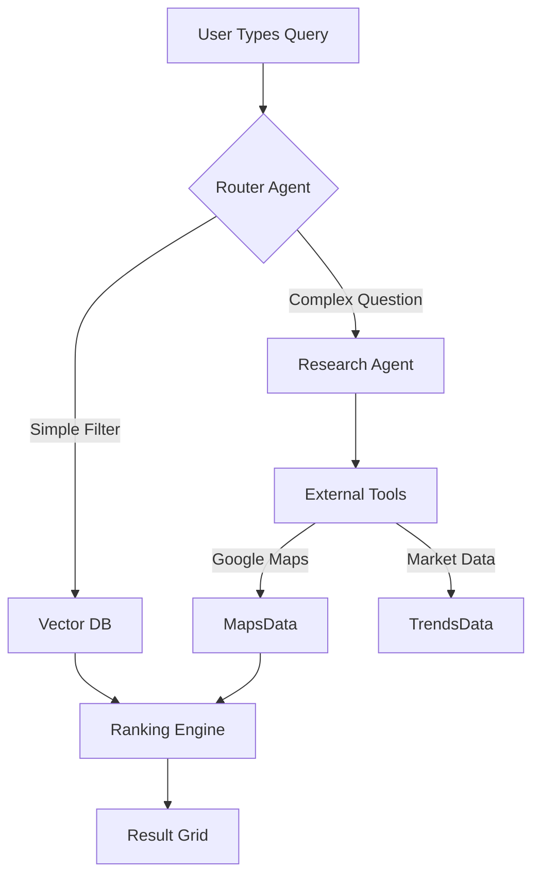
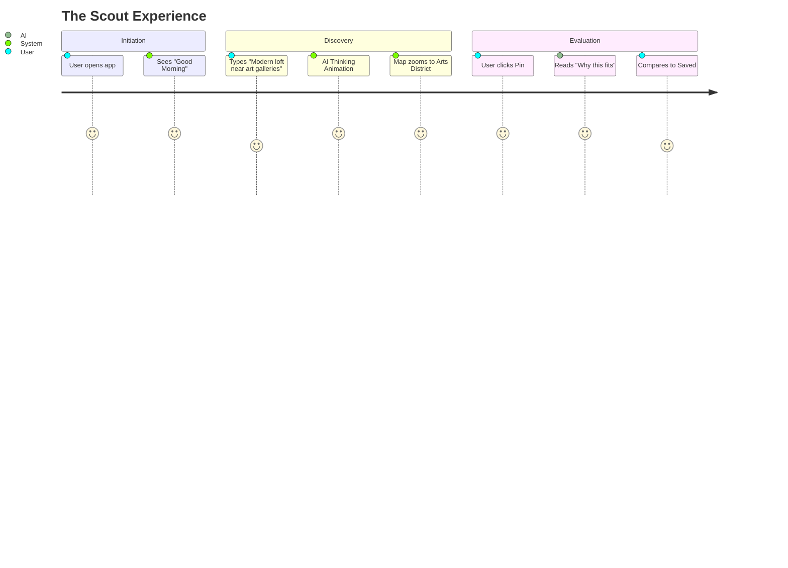

# 🏙️ Mega-Prompts: AI Real Estate Platform Build
**Target System:** Gemini 2.0 Pro / Flash  
**Context:** Building a luxury, AI-first Real Estate Application  
**Date:** Dec 18, 2025

---

## 📊 Build Progress Tracker

| Phase | Prompt Name | Focus Area | Status |
| :--- | :--- | :--- | :--- |
| **01** | **Foundation & System** | Design System, Routes, Layouts | 🔴 Todo |
| **02** | **Discovery Engine** | Smart Search, Filtering, Grid | 🔴 Todo |
| **03** | **Geospatial Intelligence** | Interactive Map, Clustering | 🔴 Todo |
| **04** | **Analysis & Details** | Property View, AI Insights | 🔴 Todo |
| **05** | **The Wizard** | Multi-step Onboarding Flow | 🔴 Todo |
| **06** | **Decision Deck** | Comparison & Saved Items | 🔴 Todo |
| **07** | **Agent Architecture** | AI Logic, Mock Validators | 🔴 Todo |
| **08** | **Deep Research** | Gemini Data Gathering Prompts | 🔴 Todo |

---

## 📝 How to use these prompts
These are "Mega-Prompts" designed to be pasted sequentially into an AI coding assistant. They are context-heavy and strictly typed to ensure high-quality output.

---

## 🏗️ PHASE 1: FOUNDATION & SYSTEM

### Prompt 1.0: The Design System & Shell
```markdown
**Role:** Senior UX Engineer & System Architect
**Goal:** Initialize the "LuxeEstate" application shell with a robust design system.

**Context:**
We are building a high-end Real Estate AI platform. The tone is "Calm, Intelligent, Premium".
We need the core layout, routing, and design tokens established before building features.

**Requirements:**
1.  **Tech Stack:** React, Tailwind CSS v4, Lucide React, Framer Motion.
2.  **Design Tokens (Tailwind):**
    *   Primary: Emerald-900 (Trust/Wealth)
    *   Secondary: Slate-500 (Technical)
    *   Accent: Amber-400 (Insight - use sparingly)
    *   Fonts: Serif for Headings (Playfair), Sans for UI (Inter).
3.  **Layout Components:**
    *   `AppLayout.tsx`: The main wrapper.
    *   `Sidebar.tsx`: Collapsible side navigation (Desktop).
    *   `BottomNav.tsx`: Tab bar (Mobile only).
    *   `Header.tsx`: Global search trigger + User profile.
4.  **Routing (React Router):**
    *   `/` (Home/Dashboard)
    *   `/search` (Discovery)
    *   `/map` (Exploration)
    *   `/saved` (Collections)
    *   `/alerts` (Automations)
5.  **Responsiveness:**
    *   Mobile-First approach.
    *   Hide Sidebar on Mobile, show BottomNav.
    *   Reverse for Desktop.

**Output:**
*   Create `tailwind.config.js` (or CSS variables) with the specific color palette.
*   Create the shell components (`AppLayout`, `Sidebar`, `BottomNav`).
*   Implement the routing structure.
*   **Visuals:** Ensure generous whitespace, soft shadows, and rounded-2xl corners for containers.
```

---

## 🔍 PHASE 2: DISCOVERY ENGINE

### Prompt 2.0: Smart Search Interface
```markdown
**Role:** Frontend Specialist (Search & Filtering)
**Goal:** Build the "Discovery Page" (`/search`) where users find properties.

**UI Specs:**
1.  **Header Area:**
    *   Large "Smart Search" input: "Describe what you want (e.g., 'Quiet 3-bed near a park')."
    *   Filter Pills: Price, Beds, Baths, Vibe (e.g., "Nightlife", "Schools").
2.  **Layout:**
    *   **Desktop:** Split View. 60% Grid (Left), 40% Map (Right - Placeholder for now).
    *   **Mobile:** Stacked List. Floating "Map View" toggle button.
3.  **Property Card Component:**
    *   **Image**: 16:9 aspect ratio, high-res placeholder.
    *   **Badges**: "AI Match 98%" (Green gradient), "New" (Blue).
    *   **Details**: Price (Serif font, Bold), Address, Beds/Baths icons.
    *   **AI Insight**: A single sentence footer with a Sparkle icon: "Why: Matches your commute preference."
    *   **Actions**: Heart (Save), Eye (View).
4.  **Mock Data:**
    *   Create `mockProperties.ts` with 10 detailed items.
    *   Include "AI Confidence Score" and "Reasoning" fields.

**Interaction:**
*   Hovering a card should slightly lift it (`scale-105`).
*   Clicking a card opens a placeholder Detail Drawer.

**Deliverable:**
*   `SearchPage.tsx`
*   `PropertyCard.tsx`
*   `FilterBar.tsx`
*   Mock Data file.
```

---

## 🗺️ PHASE 3: GEOSPATIAL INTELLIGENCE

### Prompt 3.0: The Map Experience
```markdown
**Role:** Data Visualization Engineer
**Goal:** Implement the interactive Map functionality for `/map` and the Search split-view.

**Context:**
The map is the primary way users understand "Context". It's not just pins; it's intelligence.

**Requirements:**
1.  **Component:** `PlannerMap.tsx` (Reuse existing if avail, or create new specialized one).
2.  **Markers:**
    *   **Standard Pin:** Rounded pill showing Price (e.g., "$1.2M").
    *   **AI Pin:** Glowing Emerald ring for "Top Matches".
    *   **Cluster:** Circle for grouped items.
3.  **Interactions:**
    *   Clicking a card in the list "flies to" the pin on the map.
    *   Hovering a pin highlights the card in the list.
4.  **Overlays (Mocked):**
    *   Add a toggle for "Heatmaps": Safety (Green), Noise (Blue), Schools (Orange).
    *   Render these as semi-transparent SVG overlays on the map.
5.  **Mobile Behavior:**
    *   Full-screen map.
    *   Swipeable "Card Tray" at the bottom showing the currently selected pin's details.

**Deliverable:**
*   Updated `SearchPage.tsx` with real map integration.
*   `MapMarker.tsx` variants.
*   `MapOverlays.tsx` controls.
```

---

## 📈 PHASE 4: ANALYSIS & DETAILS

### Prompt 4.0: Property Intelligence Detail
```markdown
**Role:** UX Designer & React Developer
**Goal:** Create the `PropertyDetailSheet.tsx` (Slide-over) and `PropertyPage.tsx` (Full view).

**Core Philosophy:**
Don't just list facts. Explain *why* this matters to the user.

**Sections:**
1.  **Hero:** Full-width image gallery (Carousel).
2.  **The "AI Brief":**
    *   A prominent block at the top.
    *   "Why we picked this": Natural language summary.
    *   "Trade-offs": Honest cons (e.g., "Farther from work, but bigger yard").
3.  **The "Vitals":**
    *   Grid of stats (Price/Sqft, HOA, Year Built).
4.  **Contextual Analysis:**
    *   "Commute": Visual bar chart.
    *   "Investment Score": 0-100 Gauge chart (Green = Good).
5.  **Actions (Sticky Footer on Mobile):**
    *   Primary: "Schedule Tour" (Emerald).
    *   Secondary: "Ask AI Agent" (Ghost).

**Deliverable:**
*   `PropertyDetail` components.
*   Route functionality to open this view.
```

---

## 🪄 PHASE 5: THE WIZARD

### Prompt 5.0: Multi-Step Onboarding Agent
```markdown
**Role:** Interaction Designer
**Goal:** Build the "Agent Onboarding" flow (`/wizard/*`).

**Context:**
This replaces the traditional "Search Form". It's a conversation.

**Steps:**
1.  **Step 1: Intent:** "Are you Buying, Renting, or Investing?" (Big Cards).
2.  **Step 2: The Dream:** "Describe your perfect Saturday morning." (Text Area + AI Keywords like 'Coffee', 'Park', 'Quiet').
3.  **Step 3: The Reality:** "Budget & Commute constraints." (Sliders).
4.  **Step 4: Processing:**
    *   A "Fake" loading screen that builds trust.
    *   Show steps: "Scanning 5,000 listings...", "Filtering for safety...", "Checking school districts...".
5.  **Step 5: The Reveal:**
    *   Transition to `/search` with pre-applied filters and a "Curated for You" banner.

**Tech:**
*   Use `framer-motion` for smooth transitions between steps.
*   Store state in a React Context (`WizardContext`).

**Deliverable:**
*   `WizardLayout.tsx` (No sidebar, focused).
*   Step components 1-5.
```

---

## ⚖️ PHASE 6: DECISION DECK

### Prompt 6.0: Compare & Collections
```markdown
**Role:** Frontend Developer
**Goal:** Build the `/compare` and `/saved` views.

**Context:**
Users rarely buy the first thing they see. They curate.

**Requirements:**
1.  **Saved Page:**
    *   Grid of saved items.
    *   "Add Note" feature (local state).
2.  **Compare Page:**
    *   Side-by-side view of 2-3 properties.
    *   **Smart Diff Table:** Highlight rows where properties differ (e.g., Price, Sqft).
    *   **AI Winner:** A banner at the top: "Option A is better for [User Goal] because..."

**Deliverable:**
*   `SavedPage.tsx`
*   `ComparePage.tsx`
```

---

## 🤖 PHASE 7: AGENT ARCHITECTURE

### Prompt 7.0: The Logic Layer (Mock AI)
```markdown
**Role:** Backend / Logic Engineer
**Goal:** Create the "Brain" of the application using mock TypeScript logic.

**Requirements:**
1.  **File:** `utils/aiLogic.ts`
2.  **Function:** `generateInsight(property, userPrefs)`
    *   Returns a string: "This home is a 95% match because it has the [Feature] you wanted."
3.  **Function:** `calculateConfidence(property)`
    *   Returns 0-100 based on data completeness and price accuracy.
4.  **Function:** `simulateAgentSearch(query)`
    *   Takes a text query.
    *   Parses "Intent" (Buy/Rent).
    *   Parses "Entities" (Location, Beds).
    *   Returns a filtered list of mock properties.

**UI Integration:**
*   Update the `SearchPage` Search Bar to use `simulateAgentSearch`.
*   Show a "Thinking..." spinner when searching to simulate AI latency.

**Deliverable:**
*   `aiLogic.ts`
*   Integration with Search UI.
```

---

## 🧠 PHASE 8: GEMINI DEEP RESEARCH PROMPTS

### Prompt 8.0: The "Deep Research" Simulator
*Use these prompts in Gemini to generate the **content** and **data** for the application.*

#### A. Market Analysis (Gemini Pro)
```text
Act as a Real Estate Analyst. I need a JSON dataset of 5 distinct neighborhoods in [Target City].
For each neighborhood, provide:
1. "Vibe Score" (1-10 for Nightlife, Family, Nature).
2. "Investment Outlook" (Trending Up/Down).
3. "Hidden Gem Factor" (Description).
4. A list of 3 "Persona Matches" (e.g., "The Young Professional", "The Artist").
Format as strict JSON for use in a frontend application.
```

#### B. Property Generation (Gemini Flash)
```text
Generate 10 realistic luxury real estate listings for Medellín, Colombia.
Include:
- "Why_AI_Loves_It" (A creative marketing hook).
- "Secret_Flaw" (A realistic downside, e.g., "Street noise on weekends").
- precise Lat/Lng coordinates in El Poblado and Laureles.
- Price in USD and COP.
Output as TypeScript interface `LocalProperty`.
```

#### C. User Persona Simulation
```text
Create 3 User Personas with detailed "Natural Language Requirements".
Example: "Sofia wants a place with good light for painting, max $1500/mo, within walking distance of a cafe."
Then, map which of the generated properties fits her best and provide the "AI Explanation" text.
```

---

## 📐 DIAGRAMS (For implementation reference)

### AI Agent Flow


### User Journey: The "Scout"

