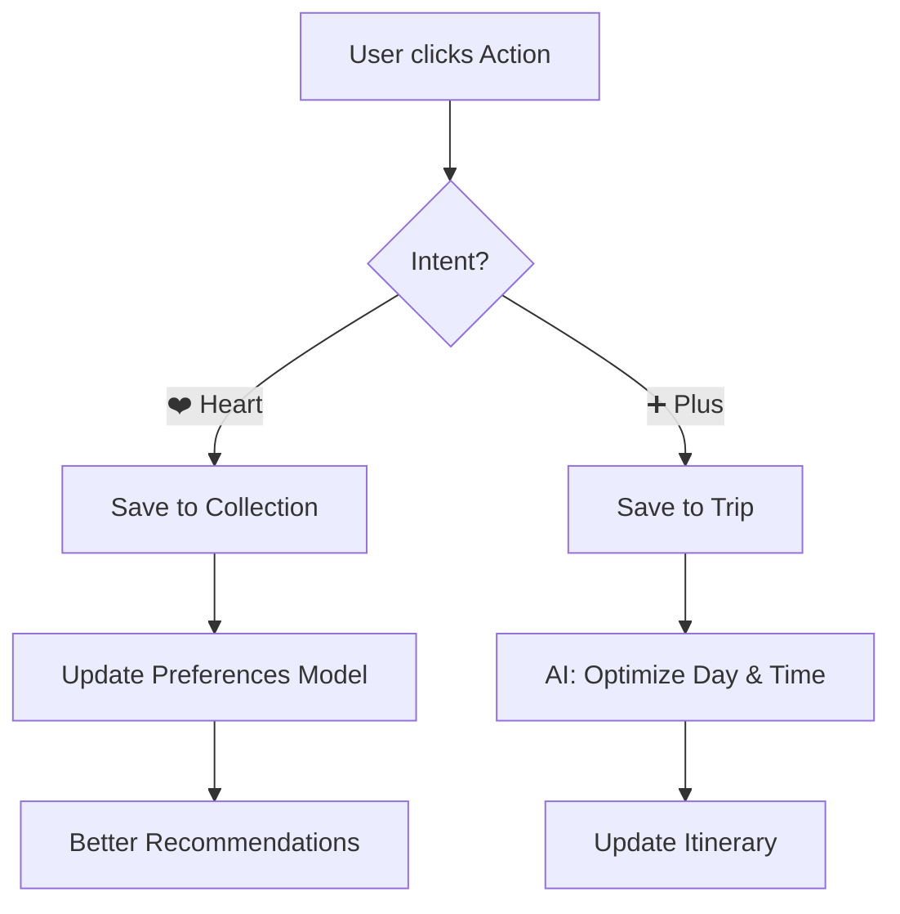

# 🌍 Saved Places · Collections · Trips (AI-Powered Travel OS)

**Role:** Senior Product Designer + UX Architect  
**Product:** Premium AI Travel OS  
**Tone:** Calm, Intelligent, Editorial, Effortless, Trustworthy  
**Core Concept:** Not a booking site. Not a list manager. **A personal travel memory + planning brain.**

---

## 🎯 PRODUCT GOAL

**Help users:**
1.  **Save** inspiration instantly (❤️).
2.  **Organize** it intelligently (Collections).
3.  **Turn** it into real trips (Itineraries).

*With AI doing the heavy lifting.*

---

## 1️⃣ INFORMATION ARCHITECTURE

### Core Objects
*   **Place**: Restaurant, Stay, Attraction, Activity.
*   **Collection**: Curated inspiration set (e.g., "Paris Cafes", "Dream Honeymoon").
*   **Trip**: Time-bound execution plan (e.g., "Paris - May 12-20").

### Key Rule
*   ❤️ **Heart** = **Save for Inspiration** (Low commitment).
*   ➕ **Plus** = **Add to Real Trip** (High commitment).

---

## 2️⃣ PRIMARY USER JOURNEYS

### Journey A — Save Inspiration (Heart ❤️)
*   **Intent:** "I might want this later."
*   **Flow:**
    1.  User browses Explore / Map / Cards.
    2.  Clicks ❤️.
    3.  **System:**
        *   Saves to "All Saved".
        *   Suggests relevant Collections (Toast notification).
        *   Learns preferences silently.
*   **UX Principle:** Zero interruption. No modal unless it's the first time.

### Journey B — Organize Inspiration (Collections)
*   **Intent:** "Group ideas meaningfully."
*   **Flow:**
    1.  User opens **Saved**.
    2.  Switches tabs: **Places** | **Collections** | **Guides**.
    3.  Creates/Edits collections.
    4.  Adds notes, tags, and specific intent.

### Journey C — Execute a Trip (➕ Add to Trip)
*   **Intent:** "I want to actually go."
*   **Flow:**
    1.  User clicks ➕ on a place.
    2.  **Modal:** "Save to Trip".
    3.  Select existing trip OR create new.
    4.  **AI Logic:**
        *   Places item into the correct day based on location.
        *   Suggests optimal time slot.
        *   Optimizes routing.

---

## 3️⃣ SCREEN SYSTEM (DESKTOP FIRST)

### SCREEN 1 — SAVED PLACES (MAIN HUB)
**Layout:** 2-Column (Left Nav, Center Content).

**Top Area:**
*   **Title:** "Your saved places"
*   **Tabs:** Places, Collections, Guides.
*   **Search:** "Search my saved places..."
*   **Filter Pills:** All, Stays, Restaurants, Attractions, Activities, Locations.

**Place Card (Premium):**
*   **Anatomy:** Large image (16:9), Title, Rating, Category + City.
*   **Actions:**
    *   ❤️ (Active/Inactive state).
    *   ➕ "Add to trip" (Primary action).
*   **Micro-interactions:** Hover lifts card + soft shadow.

### SCREEN 2 — CREATE COLLECTION (MODAL)
**Purpose:** Turn inspiration into curated meaning.

**Fields:**
*   **Name:** Max 50 chars.
*   **Visibility:** Public / Private.
*   **Helper Text:** "Collections help you group ideas before planning a trip."

**AI Assist:**
*   Auto-suggests name based on items (e.g., "Medellín Coffee Tour").
*   Auto-tags theme.

### SCREEN 3 — COLLECTION DETAIL
**Layout:** Hero + Grid.

**Hero:**
*   Collection Name & Description.
*   Item count.
*   **Primary CTA:** "Turn into a trip".

**Grid:**
*   Draggable Place Cards.
*   Inline notes per item ("Must try the latte here").

### SCREEN 4 — SAVE TO TRIP (MODAL)
**Title:** "Save to trip"

**Content:**
*   List of upcoming trips (with dates).
*   "Create a new trip" button.

**AI Logic:**
*   If a trip is selected, AI suggests: "Add to Day 3? (You're nearby)".

### SCREEN 5 — EXPLORE + MAP (DUAL VIEW)
**Layout:**
*   **Left:** Scrollable Card List.
*   **Right:** Interactive Map.

**Behavior:**
*   Hover Card → Highlights Map Pin (Bounce/Scale).
*   Click Pin → Scrolls List to Card.
*   Filters sync instantly.

---

## 4️⃣ AI AGENTS & LOGIC

### 🤖 AI Agent System
1.  **Preference Memory Agent:** Learns from saves/notes.
2.  **Intent Classifier:** Distinguishes "Dreaming" vs "Planning".
3.  **Trip Structuring Agent:** Balances itinerary pace.
4.  **Routing & Time Agent:** Calculates logistics (Open hours, distance).

### AI Decision Logic


---

## 5️⃣ UX RULES (NON-NEGOTIABLE)

1.  **❤️ never asks questions.** (Instant gratification).
2.  **➕ always confirms intent.** (Precision).
3.  **No dead ends.** Every empty state suggests an action.
4.  **Every save has a future path.**
5.  **AI explains only when asked.**

---

## 6️⃣ VISUAL STYLE GUIDELINES

*   **Typography:** Editorial Serif (Headlines), Clean Sans (Body).
*   **Cards:** Rounded corners (lg/xl), soft elevation, real photography.
*   **Motion:** Subtle, slow, purposeful.
*   **Palette:** Neutral backgrounds, vivid imagery.

---

## 7️⃣ MULTI-STEP FIGMA MAKE PROMPTS

### PROMPT 1 — Audit & Map
```markdown
**Task:** Analyze current Saved/Explore flows.
**Output:** Create a Sitemap + User Flow diagram showing:
1. Saved → Collections → Trips connection.
2. The divergence of ❤️ vs ➕ logic.
3. Key decision points.
**Deliverable:** A single Figma page titled "Saved → Trip Flows".
```

### PROMPT 2 — Wireframes (Low-Fidelity)
```markdown
**Task:** Create mobile-first wireframes.
**Screens:**
1. Saved Places Hub (Tabs: Places/Collections).
2. Collection Detail View.
3. "Save to Trip" Modal.
4. Explore (Split View).
**Focus:** Hierarchy, spacing, tap targets. No color.
```

### PROMPT 3 — High-Fidelity Premium UI
```markdown
**Task:** Upgrade wireframes to "Premium Travel OS" style.
**Style:**
- Use Editorial Serif fonts for headers.
- Soft, generous padding (whitespace).
- High-quality image fills for cards.
- Map pins: Custom markers (not default Google pins).
**Deliverable:** Pixel-perfect mockups for Desktop and Mobile.
```

### PROMPT 4 — Interaction Prototype
```markdown
**Task:** Create a clickable prototype.
**Flow:**
1. User browses Explore.
2. Clicks ❤️ (Heart animates).
3. Navigates to "Saved".
4. Drags item into a Collection.
5. Clicks ➕ on an item -> Selects Trip -> AI confirmation toast.
**Motion:** Smart Animate (Ease-out, 300ms).
```

---

## 8️⃣ SUCCESS CRITERIA

*   Saving feels **instant**.
*   Organizing feels **optional**.
*   Planning feels **inevitable**.
*   AI feels **helpful**, not visible.
*   **User Feeling:** "I didn't plan anything — it just came together."
