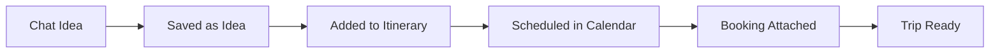

# ✈️ Trip Operating System (AI-Powered)

**Role:** Senior Product Designer + UX Architect  
**Product:** Premium AI Travel OS  
**Tone:** Calm, Premium, Minimal, Structured  
**Core Concept:** Not just an itinerary. A **Trip Operating System** that turns planning into progress.

---

## 🎯 SHORT SUMMARY
**Goal:** Turn planning into progress, not scattered notes.

**The Layout Strategy:**
*   **Left:** Conversation & Context (Chat) → "Ask, adjust, refine"
*   **Center:** Trip Intelligence (Itinerary + Decisions) → "What I'm actually doing"
*   **Right:** Structured Memory & Actions (Sidebar) → "Everything the system remembers"

---

## 1️⃣ SCREEN ARCHITECTURE (3-COLUMN LOGIC)

| Column | Purpose | Real-World Meaning |
| :--- | :--- | :--- |
| **Left (25%)** | **Chat** | "Ask, adjust, refine" |
| **Center (45%)** | **Itinerary** | "What I'm actually doing" |
| **Right (30%)** | **Sidebar Tools** | "System memory & organization" |

**Mental Model:** Talk → Decide → Save → Schedule

---

## 2️⃣ DESIGN SPECIFICATIONS

### 🎨 Visual Style
*   **Vibe:** Calm, premium, minimal.
*   **Elements:** Soft shadows, rounded cards, clear hierarchy.
*   **Responsiveness:**
    *   **Desktop:** 3 columns visible.
    *   **Mobile:** Sidebar panels slide over center.

### 🖼️ Reference Images
*   *Trip Card View:*
    `import tripCards from 'figma:asset/ad9a65ad5e8275aaf7acb04c8ba93bd0b30ded14.png';`
*   *Trip Dashboard (3-Column):*
    `import tripDash from 'figma:asset/e632afb5be5d9a4f02a93461dc5bf1750228ef5f.png';`
*   *Itinerary Detail:*
    `import tripItinerary from 'figma:asset/e24d2509878e5cd79d3a1c2d06c30f8ae06a3a60.png';`

---

## 3️⃣ USER JOURNEYS & LOGIC

### Simplified Flow


### AI Logic & Workflows
*   **Chat Agent:** Handles queries, refinements, and suggestions.
*   **Itinerary Agent:** Structures data into days/times.
*   **Conflict Agent:** Checks for overlapping times or impossible logistics.

---

## 4️⃣ CORE VS ADVANCED SCOPE

| Feature | Core (MVP) | Advanced |
| :--- | :--- | :--- |
| **Interaction** | Chat Interface | Real-time suggestions during travel |
| **Planning** | Itinerary Days, Manual Add | AI Auto-suggest days |
| **Organization** | Ideas, Calendar | Smart Time Allocation |
| **Logic** | Basic Conflicts | Map-aware scheduling |

---

## 5️⃣ DETAILED COMPONENT PROMPTS

### A) MASTER PROMPT: Trip Details Screen
> **Role:** Senior Product Designer
> **Task:** Design a Trip Details screen with a 3-column responsive layout.
>
> **Left (25%) - Chat:**
> *   Trip-specific chat.
> *   Input field (Text/Mic).
> *   List of past chats.
> *   Empty state explaining value.
>
> **Center (45%) - Itinerary:**
> *   Header: Name, City, Duration, Travelers, Budget.
> *   Vertical Day-by-Day structure.
> *   Drag & Drop reordering.
> *   "Add Item" per day.
>
> **Right (30%) - Sticky Sidebar:**
> *   Stacked Action Cards:
>     1.  Itinerary (Active)
>     2.  Bookings
>     3.  Ideas
>     4.  Media
>     5.  Key Details
>     6.  Calendar
> *   Clicking a card opens a slide-in panel.

### B) Sidebar: Ideas Panel
*   **Purpose:** Capture inspiration before scheduling.
*   **UI:** Image-based cards, "Add to Day" CTA, "Save for later".
*   **Use Case:** Instagram save → but actually useful.

### C) Sidebar: Bookings Panel
*   **Purpose:** The "Folder" for paid items.
*   **UI:** Flights, Hotels, Tours. Status tags (Planned/Booked/Confirmed).
*   **Use Case:** Replacing email searches.

### D) Sidebar: Media Panel
*   **Purpose:** Visual inspiration board.
*   **UI:** Grid layout. Upload photos, paste links (TikTok/IG).
*   **Use Case:** Dropping screenshots during research.

### E) Sidebar: Key Details Panel
*   **Purpose:** Trip memory for AI.
*   **UI:** Chip-style tags (Travelers, Budget, Preferences). Editable.
*   **Use Case:** Improves recommendations without asking repeatedly.

### F) Sidebar: Calendar Panel
*   **Purpose:** Sanity check.
*   **UI:** 7-day vertical timeline, hourly slots. Visual spacing.
*   **Use Case:** "Is this realistic?"

---

## 6️⃣ PROGRESS TRACKER & FEATURE MATRIX

| Feature Area | Component | Status | Priority |
| :--- | :--- | :--- | :--- |
| **Layout** | 3-Column Shell | 🔴 Pending | P0 |
| **Left Col** | Chat Interface | 🔴 Pending | P0 |
| **Center Col** | Itinerary Header | 🔴 Pending | P0 |
| **Center Col** | Day List (DnD) | 🔴 Pending | P1 |
| **Right Col** | Sidebar Navigation | 🔴 Pending | P0 |
| **Panel** | Ideas Panel | 🔴 Pending | P1 |
| **Panel** | Bookings Panel | 🔴 Pending | P1 |
| **Panel** | Media Panel | 🔴 Pending | P2 |
| **Panel** | Key Details | 🔴 Pending | P2 |
| **Panel** | Calendar View | 🔴 Pending | P2 |

---

## 7️⃣ MULTI-STEP IMPLEMENTATION PROMPTS

### Step 1: Scaffold & Layout
```text
Create the `TripDetailsPage` with a 3-column responsive layout using Tailwind CSS.
- Left Sidebar (25%): Placeholder for Chat.
- Main Content (45%): Placeholder for Itinerary.
- Right Sidebar (30%): Placeholder for Tools.
- Ensure mobile responsiveness (stacking or sliding).
```

### Step 2: Right Sidebar Navigation
```text
Implement the `TripSidebar` component.
- Create vertical stacked cards for: Itinerary, Bookings, Ideas, Media, Key Details, Calendar.
- Implement state to track the "Active Panel".
- When a card is clicked, it should expand or show detailed view.
```

### Step 3: Center Itinerary Feed
```text
Implement the `ItineraryFeed` component in the center column.
- Header with Trip Metadata (Name, Dates, Budget).
- List of Days (Day 1, Day 2...).
- Inside each day, a list of placeholder activities.
- "Add Activity" button for each day.
```

### Step 4: Chat Interface
```text
Implement the `TripChat` component in the left column.
- Message history list.
- Input area with Mic and Send buttons.
- Connect to mock AI context.
```

### Step 5: Advanced Panels (Ideas & Bookings)
```text
Implement the detailed views for the "Ideas" and "Bookings" panels in the Right Sidebar.
- Ideas: Grid of draggable cards.
- Bookings: List of confirmed items with status tags.
```
