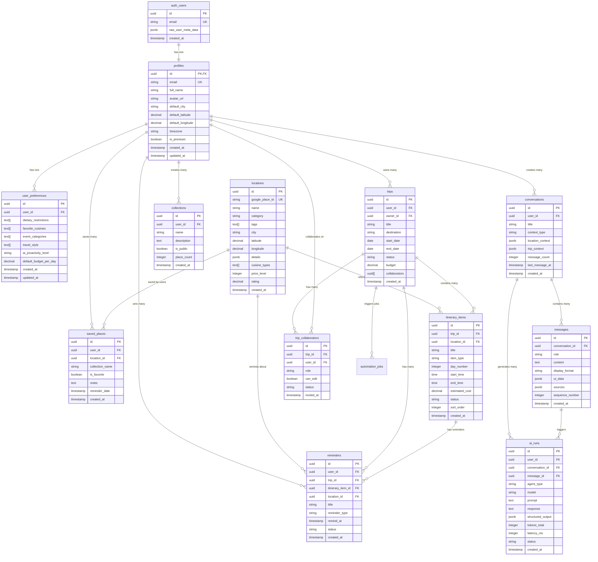

# Entity Relationship Diagrams

**Complete ERD for Local Scout AI Platform**

## Core Schema ERD



## Advanced Schema ERD


## Complete System ERD (All Entities)


## Data Flow Diagram: User Journey


## Database Relationships Summary

### One-to-One Relationships
- `auth.users` → `profiles` (1:1)
- `profiles` → `user_preferences` (1:1)

### One-to-Many Relationships
- `profiles` → `conversations` (1:N)
- `profiles` → `trips` (1:N)
- `profiles` → `saved_places` (1:N)
- `conversations` → `messages` (1:N)
- `trips` → `itinerary_items` (1:N)
- `locations` → `saved_places` (1:N)

### Many-to-Many Relationships
- `trips` ↔ `profiles` (via `trip_collaborators`)
- `locations` ↔ `collections` (via `saved_places`)

### Polymorphic Relationships
- `reminders` → `trips`, `itinerary_items`, `locations` (polymorphic)
- `embeddings` → `locations`, `messages`, etc. (polymorphic via `entity_type`)

## Index Strategy by Table

### High-Traffic Tables (Optimized)

**messages**
- Primary: `id` (PK, automatic)
- Foreign: `conversation_id` (B-tree)
- Composite: `(conversation_id, sequence_number)` (B-tree)
- Time: `created_at DESC` (B-tree)

**locations**
- Primary: `id` (PK, automatic)
- Unique: `google_place_id` (B-tree)
- Category: `category` (B-tree)
- Geospatial: `(latitude, longitude)` (B-tree)
- Arrays: `tags`, `cuisine_types` (GIN)
- Rating: `rating DESC` (B-tree partial)

**itinerary_items**
- Primary: `id` (PK, automatic)
- Foreign: `trip_id`, `location_id` (B-tree)
- Composite: `(trip_id, day_number, sort_order)` (B-tree)
- Type: `item_type`, `status` (B-tree)

### Search-Optimized Tables

**embeddings**
- Vector: `embedding vector_cosine_ops` (HNSW)
- Entity: `(entity_type, entity_id)` (B-tree)
- Hash: `content_hash` (B-tree)

**search_cache**
- Hash: `query_hash` (B-tree, unique)
- Expiry: `expires_at` (B-tree partial)

## RLS Policy Patterns

### User-Owned Data Pattern
```sql
-- Pattern: Users can only access their own data
CREATE POLICY "policy_name"
  ON table_name
  FOR SELECT
  USING (auth.uid() = user_id);
```

**Applied to:**
- profiles
- user_preferences
- conversations
- saved_places
- collections
- trips (with owner_id)
- reminders

### Collaborative Data Pattern
```sql
-- Pattern: Users can access data they own OR are collaborators on
CREATE POLICY "policy_name"
  ON table_name
  FOR SELECT
  USING (
    auth.uid() = owner_id OR
    auth.uid() = ANY(collaborators)
  );
```

**Applied to:**
- trips
- itinerary_items

### Public Read Pattern
```sql
-- Pattern: Data is publicly readable but service-controlled
CREATE POLICY "public_read"
  ON table_name
  FOR SELECT
  USING (is_active = true);

CREATE POLICY "service_write"
  ON table_name
  FOR ALL
  USING (auth.jwt()->>'role' = 'service_role');
```

**Applied to:**
- locations
- search_cache
- web_sources

### Derived Access Pattern
```sql
-- Pattern: Access via foreign key relationship
CREATE POLICY "derived_access"
  ON child_table
  FOR SELECT
  USING (
    EXISTS (
      SELECT 1 FROM parent_table
      WHERE parent_table.id = child_table.parent_id
      AND parent_table.user_id = auth.uid()
    )
  );
```

**Applied to:**
- messages (via conversations)
- itinerary_items (via trips)
- trip_collaborators (via trips)

## Trigger Functions

### Auto-Create Triggers
1. **`handle_new_user()`** - Creates profile when user signs up
2. **`auto_create_booking_reminder()`** - Creates reminder for bookings

### Update Triggers
3. **`update_updated_at_column()`** - Updates `updated_at` timestamp
4. **`update_conversation_on_message()`** - Updates conversation metadata
5. **`increment_automation_run_count()`** - Tracks automation executions

### Cache Triggers
6. **`update_search_cache_access()`** - Tracks cache hits
7. **`update_ai_run_completion()`** - Sets completion timestamp

## Constraints Summary

### Check Constraints
- **Date ranges**: `end_date >= start_date`
- **Ratings**: `rating >= 1 AND rating <= 5`
- **Enums**: Status fields with IN clauses
- **Ranges**: Temperature, priority, price levels

### Unique Constraints
- **Natural keys**: `google_place_id`, `url_hash`
- **User uniqueness**: `(user_id, location_id)`, `(user_id, name)`
- **Sequence**: `(conversation_id, sequence_number)`

### Foreign Key Constraints
- **ON DELETE CASCADE**: User-owned data
- **ON DELETE SET NULL**: Optional references
- **ON DELETE RESTRICT**: Protected references (none currently)

---

**Next:** See `/supabase/docs/04-data-flows.md` for detailed data flow diagrams
