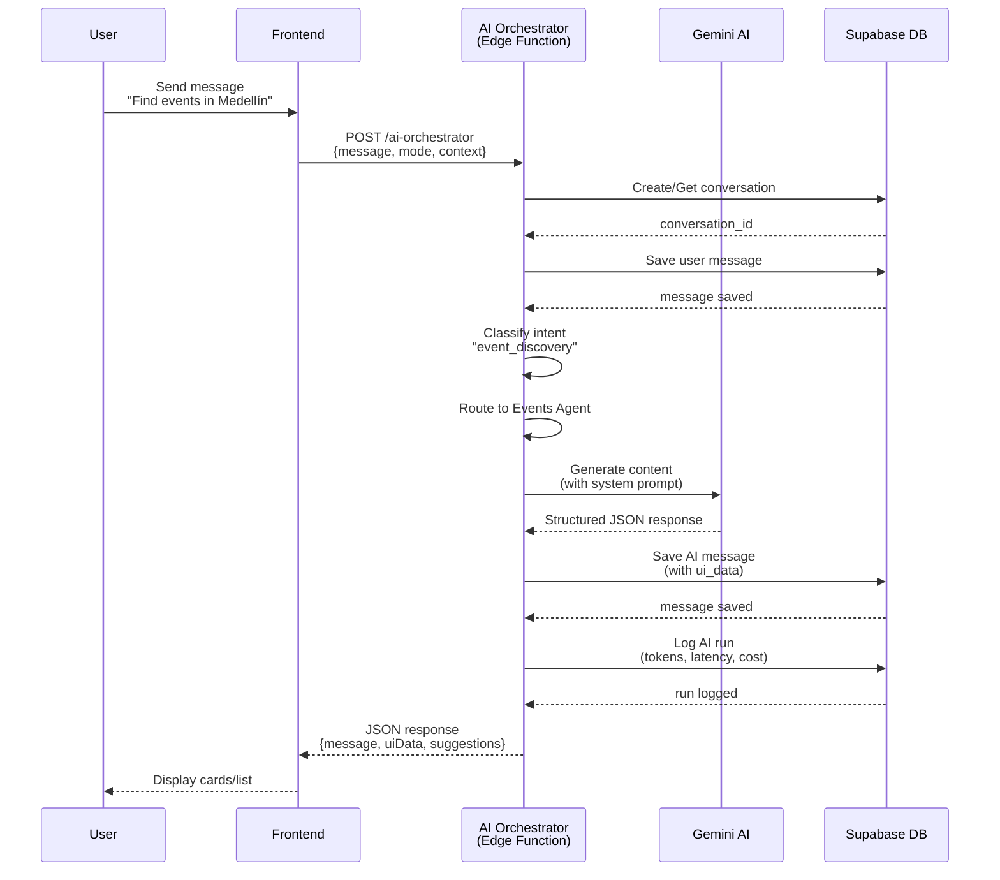
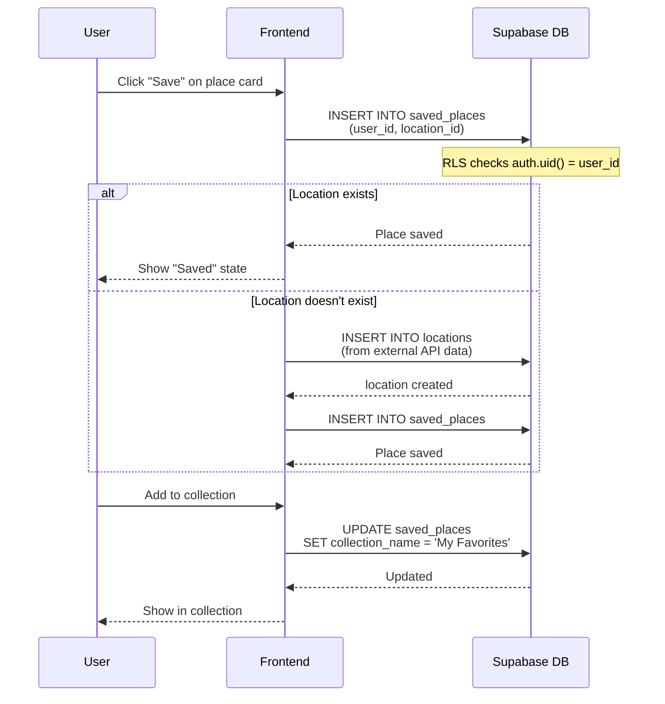
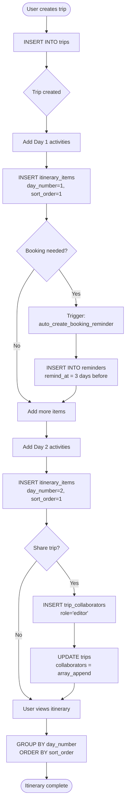
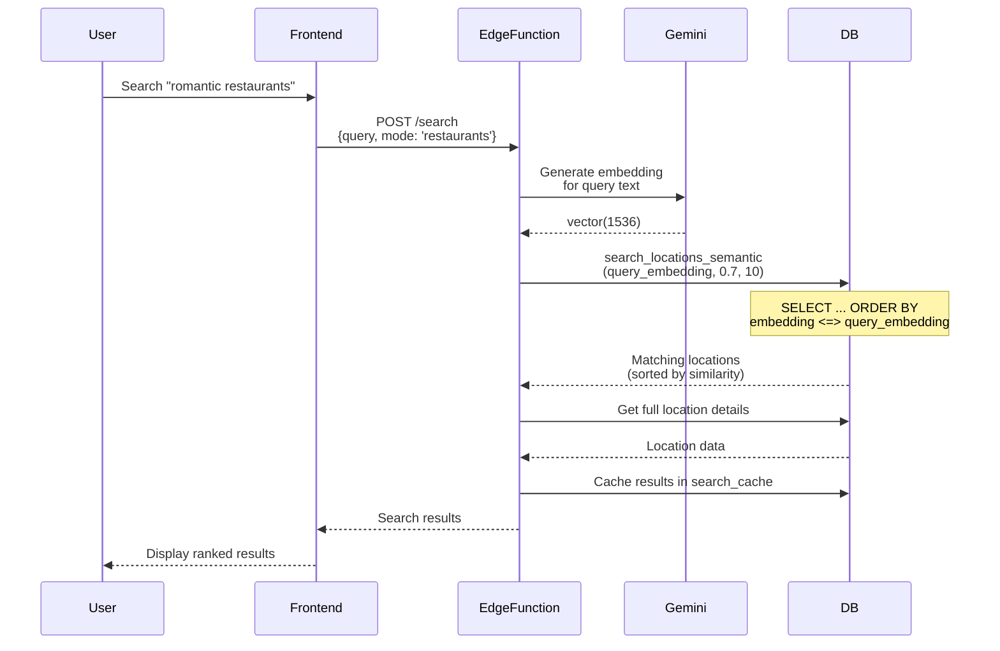
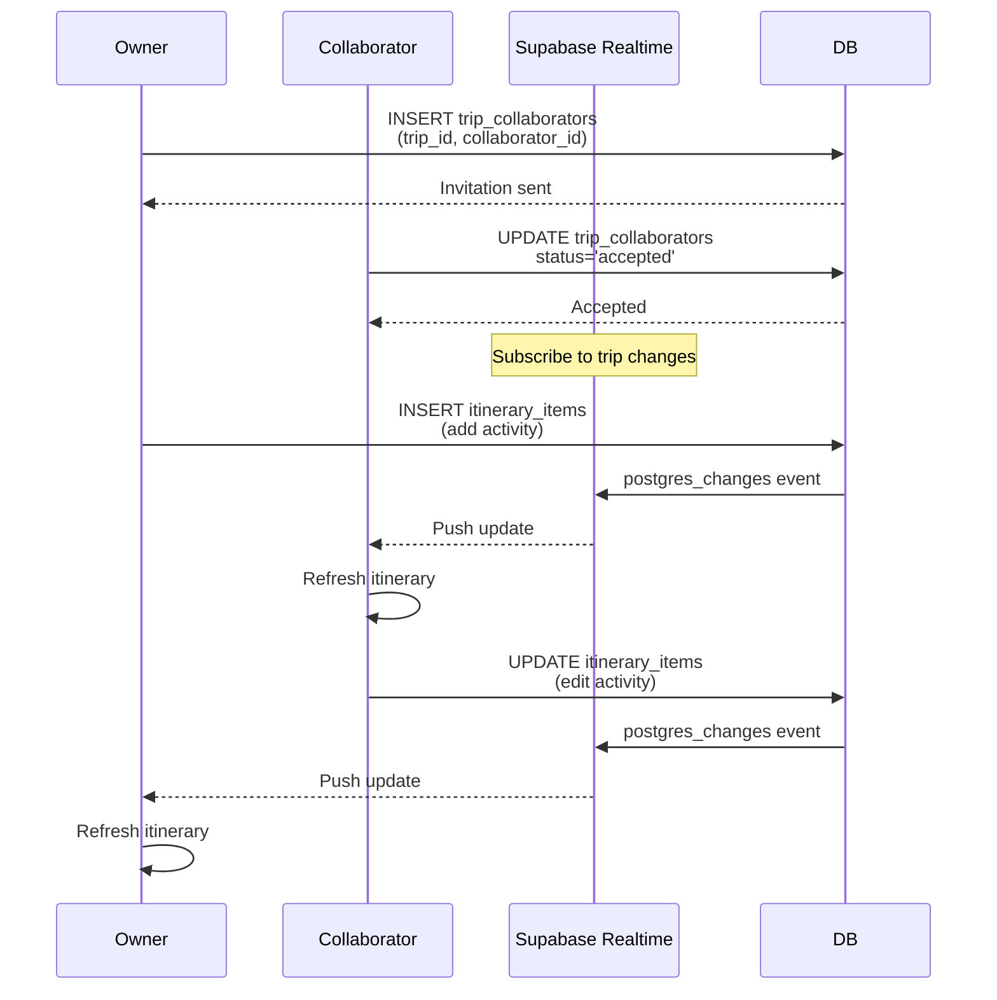
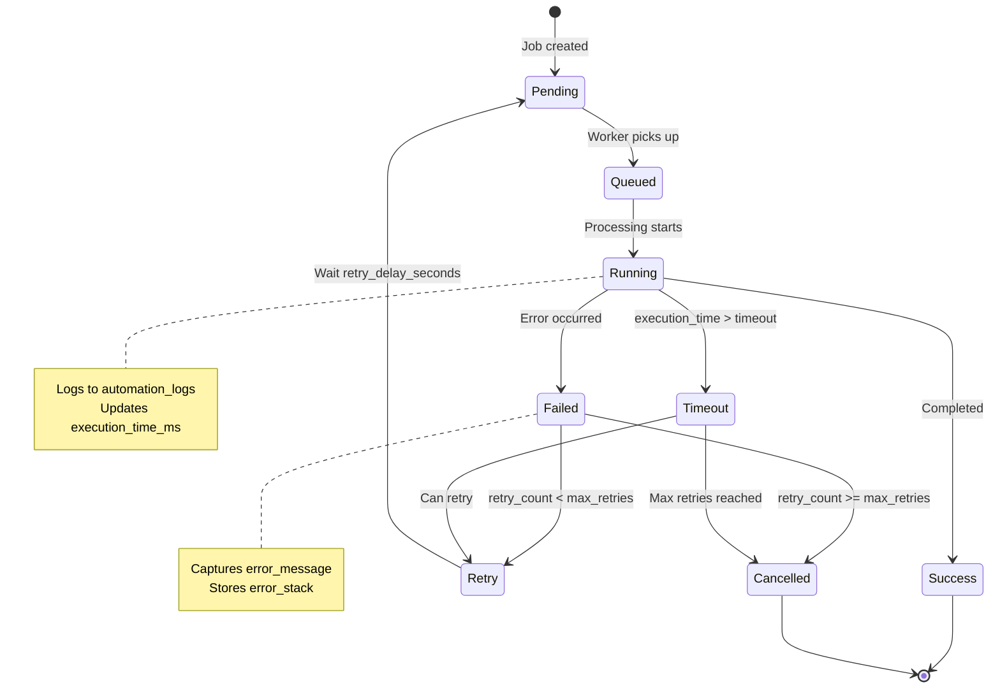

# Data Flow Diagrams

**Complete data flow documentation for Local Scout AI**

## 1. AI Chat Flow (Main User Journey)



## 2. Save Place Flow



## 3. Trip Creation & Itinerary Building



## 4. Automation Workflow

```mermaid
flowchart LR
    subgraph "User Definition"
        User[User] --> CreateRule[Create Automation Rule]
        CreateRule --> RuleConfig{Rule Type}
        
        RuleConfig -->|Time-based| Cron[Cron schedule<br/>'0 9 * * *']
        RuleConfig -->|Event-based| Event[On trip created]
        RuleConfig -->|Location-based| Geo[Geofence trigger]
    end
    
    subgraph "Job Scheduling"
        Cron --> CalculateNext[Calculate next_run_at]
        Event --> CreateJob[INSERT automation_jobs<br/>status='pending']
        Geo --> CreateJob
        CalculateNext --> CreateJob
    end
    
    subgraph "Worker Processing"
        CreateJob --> JobQueue[(Job Queue)]
        JobQueue --> Worker[Background Worker]
        Worker --> GetNext[get_next_automation_job]
        GetNext --> ProcessJob{Process Job}
        
        ProcessJob -->|AI Suggestion| CallAI[Call AI Orchestrator]
        ProcessJob -->|Send Notification| SendNotif[Send notification]
        ProcessJob -->|Update Data| UpdateDB[Update database]
        
        CallAI --> LogResult
        SendNotif --> LogResult
        UpdateDB --> LogResult[INSERT automation_logs]
        
        LogResult --> UpdateStatus[UPDATE automation_jobs<br/>status='success']
        UpdateStatus --> IncrementRun[Trigger:<br/>increment_automation_run_count]
        IncrementRun --> UpdateRule[UPDATE automation_rules<br/>run_count++, last_run_at]
    end
    
    UpdateRule --> Complete([Job Complete])
```



## 5. Vector Search Flow (Semantic Search)



## 6. Real-Time Collaboration Flow



## 7. External API Integration Flow

```mermaid
flowchart TD
    Start([User searches for places]) --> CheckCache{Check search_cache}
    
    CheckCache -->|Cache hit| ReturnCached[Return cached results]
    CheckCache -->|Cache miss| CallExternal
    
    CallExternal --> GooglePlaces[Call Google Places API]
    CallExternal --> YelpAPI[Call Yelp API]
    CallExternal --> TicketmasterAPI[Call Ticketmaster API]
    
    GooglePlaces --> NormalizeData[Normalize to locations table]
    YelpAPI --> NormalizeData
    TicketmasterAPI --> NormalizeData
    
    NormalizeData --> SaveLocations[INSERT INTO locations<br/>ON CONFLICT DO UPDATE]
    
    SaveLocations --> GenerateEmbedding{Need embedding?}
    
    GenerateEmbedding -->|Yes| QueueJob[Queue embedding job]
    GenerateEmbedding -->|No| CacheResults
    
    QueueJob --> CacheResults[INSERT search_cache<br/>expires_at = NOW() + 1 hour]
    
    CacheResults --> ReturnResults[Return results]
    ReturnCached --> ReturnResults
    ReturnResults --> End([Display to user])
```

## 8. Reminder Notification Flow

```mermaid
flowchart TD
    Start([Background scheduler]) --> CheckReminders[SELECT FROM reminders<br/>WHERE remind_at <= NOW()<br/>AND status = 'pending']
    
    CheckReminders --> HasReminders{Any reminders?}
    
    HasReminders -->|No| Wait[Wait 1 minute]
    Wait --> Start
    
    HasReminders -->|Yes| ProcessReminder[For each reminder]
    
    ProcessReminder --> CheckPreferences[Get user preferences<br/>(email/push/sms)]
    
    CheckPreferences --> SendEmail{Send email?}
    SendEmail -->|Yes| EmailService[Call email service]
    SendEmail -->|No| CheckPush
    
    EmailService --> CheckPush{Send push?}
    CheckPush -->|Yes| PushService[Call push notification]
    CheckPush -->|No| CheckSMS
    
    PushService --> CheckSMS{Send SMS?}
    CheckSMS -->|Yes| SMSService[Call SMS service]
    CheckSMS -->|No| UpdateStatus
    
    SMSService --> UpdateStatus[UPDATE reminders<br/>status='sent', sent_at=NOW()]
    
    UpdateStatus --> LogNotification[INSERT automation_logs<br/>level='info']
    
    LogNotification --> NextReminder{More reminders?}
    NextReminder -->|Yes| ProcessReminder
    NextReminder -->|No| Start
```

## 9. Error Handling & Retry Flow



## 10. Data Consistency Flow (Triggers)

```mermaid
flowchart TD
    subgraph "User Signup"
        SignUp[User signs up<br/>INSERT auth.users] --> TriggerProfile[Trigger: on_auth_user_created]
        TriggerProfile --> CreateProfile[Function: handle_new_user<br/>INSERT profiles]
        CreateProfile --> ProfileCreated[Profile auto-created]
    end
    
    subgraph "Message Creation"
        NewMessage[INSERT messages] --> TriggerConversation[Trigger: on_message_created]
        TriggerConversation --> UpdateConv[Function: update_conversation_on_message]
        UpdateConv --> IncrementCount[INCREMENT message_count]
        IncrementCount --> UpdateTime[SET last_message_at]
    end
    
    subgraph "Booking Item"
        NewItem[INSERT itinerary_items<br/>booking_status='needed'] --> TriggerReminder[Trigger: on_itinerary_item_booking_needed]
        TriggerReminder --> CreateBookingReminder[Function: auto_create_booking_reminder]
        CreateBookingReminder --> CalculateDate[remind_at = start_date - 3 days]
        CalculateDate --> InsertReminder[INSERT reminders]
    end
    
    subgraph "Update Timestamps"
        AnyUpdate[UPDATE any_table] --> TriggerTimestamp[Trigger: update_*_updated_at]
        TriggerTimestamp --> SetTimestamp[Function: update_updated_at_column]
        SetTimestamp --> UpdatedAt[SET updated_at = NOW()]
    end
```

## 11. Query Optimization Patterns

```mermaid
flowchart LR
    subgraph "Inefficient Query"
        Q1[SELECT *<br/>FROM trips] --> Loop[For each trip]
        Loop --> Q2[SELECT *<br/>FROM itinerary_items<br/>WHERE trip_id = ?]
        Q2 --> Loop
        Loop --> N1[N+1 Query Problem]
    end
    
    subgraph "Optimized Query"
        Q3[SELECT trips.*,<br/>json_agg(itinerary_items.*)<br/>FROM trips<br/>LEFT JOIN itinerary_items<br/>GROUP BY trips.id] --> R1[Single Query]
        R1 --> UseIndex[Uses indexes:<br/>- trips.id<br/>- itinerary_items.trip_id]
        UseIndex --> Fast[Fast & Efficient]
    end
    
    N1 -.->|Refactor| Q3
```

## 12. RLS Policy Flow

```mermaid
flowchart TD
    Start([User makes query]) --> ExtractJWT[Extract JWT from<br/>Authorization header]
    
    ExtractJWT --> ParseJWT[Parse JWT<br/>auth.uid()]
    
    ParseJWT --> CheckRLS{RLS enabled<br/>on table?}
    
    CheckRLS -->|No| DirectQuery[Execute query<br/>without checks]
    CheckRLS -->|Yes| ApplyPolicies[Apply RLS policies]
    
    ApplyPolicies --> UserOwned{User-owned data?}
    
    UserOwned -->|Yes| CheckOwnership[WHERE user_id = auth.uid()]
    UserOwned -->|No| CheckCollaborative
    
    CheckOwnership --> ExecuteQuery
    
    CheckCollaborative{Collaborative?}
    CheckCollaborative -->|Yes| CheckCollaborators[WHERE owner_id = auth.uid()<br/>OR auth.uid() = ANY(collaborators)]
    CheckCollaborative -->|No| CheckPublic
    
    CheckCollaborators --> ExecuteQuery
    
    CheckPublic{Public readable?}
    CheckPublic -->|Yes| CheckActive[WHERE is_active = true]
    CheckPublic -->|No| Deny[DENY ACCESS]
    
    CheckActive --> ExecuteQuery[Execute filtered query]
    
    ExecuteQuery --> Results[Return results]
    DirectQuery --> Results
    
    Results --> End([Response to user])
    Deny --> End
    
    style Deny fill:#ff6b6b
    style Results fill:#51cf66
```

## Summary: Key Data Flows

### 1. **AI Chat** (Most Common)
User message → Intent classification → Agent routing → AI generation → Database save → UI display

### 2. **Place Discovery**
Search query → Cache check → External API call → Normalize data → Generate embedding → Cache → Return

### 3. **Trip Planning**
Create trip → Add items → Auto-create reminders → Share with collaborators → Real-time sync

### 4. **Automation**
User defines rule → Schedule jobs → Background worker → Execute actions → Log results → Update stats

### 5. **Semantic Search**
Query → Generate embedding → Vector similarity search → Rank results → Display

### 6. **Real-Time Collaboration**
User action → Database change → Realtime event → Push to subscribers → Update UI

---

**Next:** See `/supabase/docs/06-implementation-order.md` for implementation steps
